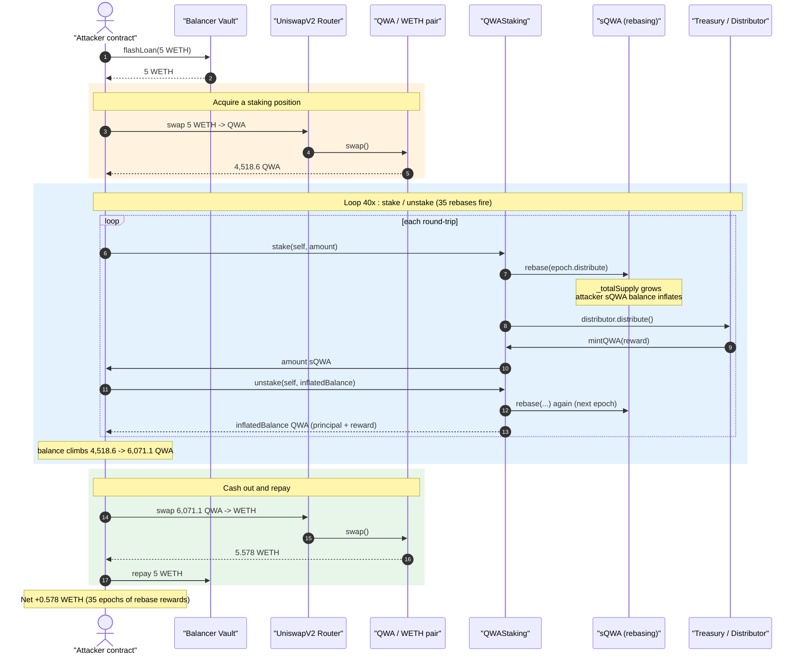
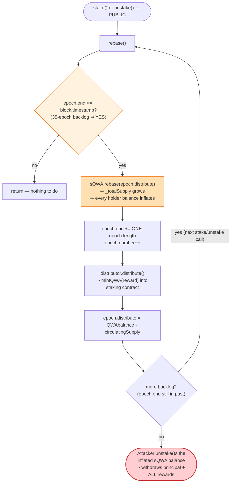
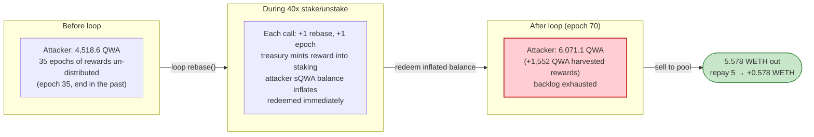

# Quantum Wealth Network (QWA) Exploit — Re-entrant `rebase()` Reward Harvest via stake/unstake Looping

> **Vulnerability classes:** vuln/logic/reward-calculation · vuln/access-control/missing-auth · vuln/governance/flash-loan-attack

> **Reproduction:** the PoC compiles & runs in an isolated Foundry project at
> [this project folder](.) (the umbrella DeFiHackLabs repo contains many
> unrelated PoCs that do not whole-compile under `forge test`, so this one was
> extracted). Full verbose trace: [output.txt](output.txt).
> Verified vulnerable sources:
> [QWAStaking](sources/QWAStaking_69422c/contracts_Staking.sol),
> [sQWA](sources/sQWA_f5bF1f/contracts_token_sQWA.sol).

---

## Key info

| | |
|---|---|
| **Loss** | ~0.578 WETH (~$900 at the time) extracted from the QWA staking system in a single transaction |
| **Vulnerable contract** | `QWAStaking` — [`0x69422c7F237D70FCd55C218568a67d00dc4ea068`](https://etherscan.io/address/0x69422c7F237D70FCd55C218568a67d00dc4ea068#code) (with rebase-token co-conspirator `sQWA` [`0xf5bF1f78EDa7537F9cAb002a8F533e2733DDfBbC`](https://etherscan.io/address/0xf5bF1f78EDa7537F9cAb002a8F533e2733DDfBbC#code)) |
| **Underlying token** | `QuantumWealthAcceleratorToken` (QWA) — [`0xc14F8A4C8272b8466659D0f058895E2F9D3ae065`](https://etherscan.io/address/0xc14F8A4C8272b8466659D0f058895E2F9D3ae065#code), 9 decimals |
| **Victim pool** | QWA/WETH UniswapV2 pair — `0xdb98950D58c62B8299192300d47294F20C093847` |
| **Attacker EOA** | [`0x6ce9fa08f139f5e48bc607845e57efe9aa34c9f6`](https://etherscan.io/address/0x6ce9fa08f139f5e48bc607845e57efe9aa34c9f6) |
| **Attack contract** | [`0x154863eb71de4a34f88ea57450840eab1c71aba6`](https://etherscan.io/address/0x154863eb71de4a34f88ea57450840eab1c71aba6) |
| **Attack tx** | [`0xa4659632a983b3bfd1b6248fd52d8f247a9fcdc1915f7d38f01008cff285d0bf`](https://app.blocksec.com/explorer/tx/eth/0xa4659632a983b3bfd1b6248fd52d8f247a9fcdc1915f7d38f01008cff285d0bf) |
| **Chain / fork block / date** | Ethereum mainnet / 18,070,348 / ~September 6, 2023 |
| **Compiler** | Solidity v0.8.19, optimizer **off** (runs 200) |
| **Bug class** | Re-entrant / repeatable rebase reward distribution — accumulated epoch rewards harvested by a single looping staker |

---

## TL;DR

`QWAStaking` is an Olympus-style staking system. Staking QWA gives you `sQWA` 1:1; the
`sQWA` token *rebases* (mints supply to existing holders) every epoch, so when you later
unstake you get back **more QWA than you put in** — that surplus is the staking reward.

The fatal design choices, all in [`Staking.sol`](sources/QWAStaking_69422c/contracts_Staking.sol):

1. **Every `stake()` and `unstake()` call calls `rebase()` first**
   ([:64](sources/QWAStaking_69422c/contracts_Staking.sol#L64),
   [:73](sources/QWAStaking_69422c/contracts_Staking.sol#L73)).
2. **`rebase()` has no per-block / per-transaction guard** — it only checks
   `epoch.end <= block.timestamp` ([:84](sources/QWAStaking_69422c/contracts_Staking.sol#L84)),
   and every time it runs it advances `epoch.end` by **only one** `epoch.length`
   ([:87](sources/QWAStaking_69422c/contracts_Staking.sol#L87)) and mints a fresh epoch
   of rewards.
3. **`unstake()` pays out whatever the caller's (now-inflated) sQWA balance is**, capped
   only by the contract's QWA balance
   ([:72-80](sources/QWAStaking_69422c/contracts_Staking.sol#L72-L80)).

At the fork block the epoch counter was **35 intervals stale** (the protocol had not been
rebased in a long time, so `epoch.end` was far in the past). The attacker exploited this
by, **all within one flash-loaned transaction**:

1. Buying a small amount of QWA (4,518.6 QWA for the 5 WETH flash loan).
2. Calling `stake → unstake → stake → unstake …` **40 times in a row**. Each call ran one
   more `rebase()`, walking the epoch counter forward from 36 to 70 — **forcing 35 epochs
   of accumulated rewards to be minted and distributed**, and because the attacker was
   effectively the only staker, **they captured the entire reward stream**. Their balance
   grew 4,518.6 → 6,071.1 QWA.
3. Selling the inflated 6,071.1 QWA back to the pool for 5.578 WETH and repaying the
   5 WETH flash loan.

Net profit = **0.578 WETH**, drawn directly from rebase rewards (newly minted QWA backed
by treasury reserves) that should have accrued to all stakers over 35 epochs but were
instead siphoned by one looping account.

---

## Background — how QWA staking is supposed to work

QWA is an OlympusDAO-style "backed token". The three relevant pieces:

- **QWA** ([`QuantumWealthAcceleratorToken`](sources/QuantumWealthAcceleratorToken_c14F8A/contracts_token_QWA.sol)):
  a 9-decimal ERC20 with a 5% buy/sell tax routed to backing/liquidity/team. A treasury
  can `mint()` new QWA ([:1074-1077](sources/QuantumWealthAcceleratorToken_c14F8A/contracts_token_QWA.sol#L1074-L1077)).
- **sQWA** ([`sQWA`](sources/sQWA_f5bF1f/contracts_token_sQWA.sol)): the staked
  receipt token. It is a *rebasing* (gons/fragments) token: internal balances are stored
  in fixed "gons", and `balanceOf = gons / _gonsPerFragment`
  ([:256-260](sources/sQWA_f5bF1f/contracts_token_sQWA.sol#L256-L260)). When `_totalSupply`
  grows, `_gonsPerFragment` shrinks, so **every holder's fragment balance rises
  proportionally** without any transfer — that is the rebase reward.
- **QWAStaking** ([`QWAStaking`](sources/QWAStaking_69422c/contracts_Staking.sol)):
  - `stake(to, amount)`: pulls `amount` QWA from you, sends you `amount` sQWA
    ([:63-67](sources/QWAStaking_69422c/contracts_Staking.sol#L63-L67)).
  - `unstake(to, amount, rebase)`: pulls `amount` sQWA from you, sends you `amount` QWA
    ([:72-80](sources/QWAStaking_69422c/contracts_Staking.sol#L72-L80)).
  - `rebase()`: once per epoch, calls `sQWA.rebase(epoch.distribute, …)` to mint the
    reward, advances the epoch, asks a `Distributor` to top up the contract's QWA, and
    recomputes the next `epoch.distribute = QWA.balanceOf(this) - circulatingSupply()`
    ([:83-103](sources/QWAStaking_69422c/contracts_Staking.sol#L83-L103)).

Read from the trace at the fork block:

| Parameter | Value (from [output.txt](output.txt)) |
|---|---|
| Starting epoch number | **35** (first rebase in the attack is epoch 36 — [:86](output.txt)) |
| `epoch.end` vs `block.timestamp` | `epoch.end` far in the past → `rebase()` immediately enabled, repeatedly |
| QWA in the QWA/WETH pair (pool reserve) | ~9,436.6 QWA (`reserve1 = 9436574005490`) |
| WETH in the pair | ~15.4 WETH (`reserve0 = 15410486470370649012`) |
| sQWA `_totalSupply` before attack | 1,138,351,351,509,516 gons-fragments (≈1.138e15) |

Because the protocol had gone many epochs without anyone calling `rebase()`, there was a
huge backlog of un-distributed reward — and `rebase()` would happily release one epoch's
worth on **every** call until it caught up to `block.timestamp`.

---

## The vulnerable code

### 1. `stake` / `unstake` call `rebase()` unconditionally

```solidity
// sources/QWAStaking_69422c/contracts_Staking.sol:63-80
function stake(address _to, uint256 _amount) external {
    rebase();                                   // ← runs a rebase first
    QWA.transferFrom(msg.sender, address(this), _amount);
    sQWA.transfer(_to, _amount);                // you get _amount sQWA
}

function unstake(address _to, uint256 _amount, bool _rebase) external {
    if (_rebase) rebase();                       // ← runs ANOTHER rebase first
    sQWA.transferFrom(msg.sender, address(this), _amount);
    require(
        _amount <= QWA.balanceOf(address(this)), // only solvency guard
        "Insufficient QWA balance in contract"
    );
    QWA.transfer(_to, _amount);                  // you redeem _amount QWA
}
```

### 2. `rebase()` advances only ONE epoch per call and mints a reward each time

```solidity
// sources/QWAStaking_69422c/contracts_Staking.sol:83-103
function rebase() public {
    if (epoch.end <= block.timestamp) {          // ← only gate; TRUE for 35 epochs
        sQWA.rebase(epoch.distribute, epoch.number);   // mint reward into sQWA supply

        epoch.end = epoch.end + epoch.length;     // ← advances ONE interval only
        epoch.number++;

        if (address(distributor) != address(0)) {
            distributor.distribute();             // mints fresh QWA into this contract
        }

        uint256 balance = QWA.balanceOf(address(this));
        uint256 staked = sQWA.circulatingSupply();
        if (balance <= staked) epoch.distribute = 0;
        else epoch.distribute = balance - staked; // next reward = surplus QWA
    }
}
```

There is **no `nonReentrant` guard and no "max one rebase per block" cap**. Calling `stake`
then `unstake` then `stake`… in the same transaction drives the `epoch.end <= block.timestamp`
loop forward one interval at a time until the backlog is exhausted, releasing 35 epochs of
rewards into a single transaction.

### 3. The rebase inflates the caller's sQWA balance, which they immediately redeem

In `sQWA`, the rebase grows `_totalSupply` and shrinks `_gonsPerFragment`
([:111-138](sources/sQWA_f5bF1f/contracts_token_sQWA.sol#L111-L138)), so a holder's
fragment balance rises with no transfer:

```solidity
// sources/sQWA_f5bF1f/contracts_token_sQWA.sol:127-133
_totalSupply = _totalSupply + rebaseAmount;
...
_gonsPerFragment = TOTAL_GONS / _totalSupply;   // ← shrinks → every balanceOf grows
```

So the attacker stakes `N` QWA → holds `N` sQWA → the next `rebase()` (run inside the very
next `unstake`) bumps their sQWA balance to `N + reward` → they `unstake(N + reward)` and
the contract pays out `N + reward` QWA. The "reward" is real, treasury-minted QWA, captured
in full because the attacker is essentially the only staker during the loop.

---

## Root cause — why it was possible

The reward-distribution accounting is correct **only if `rebase()` runs at most once per
block and rewards are split across all stakers over real elapsed time**. The implementation
violates both assumptions:

1. **No replay guard on `rebase()`.** It is `public`, reachable from both `stake` and
   `unstake`, and re-callable any number of times in one transaction as long as a backlog
   of stale epochs exists. Advancing `epoch.end` by a single `epoch.length` per call
   ([:87](sources/QWAStaking_69422c/contracts_Staking.sol#L87)) means a 35-epoch backlog
   becomes 35 reward releases inside one tx.

2. **Reward is paid to the *current* staker set, with no time-weighting.** A whale who
   stakes one block before harvesting receives the same per-token reward as someone who
   staked for the entire epoch. The attacker exploits this by being the dominant (effectively
   sole) staker for the brief window of each looped rebase.

3. **`unstake()` trusts the inflated sQWA balance.** Its only check is the contract's QWA
   solvency ([:75-78](sources/QWAStaking_69422c/contracts_Staking.sol#L75-L78)). It does not
   track how long the caller was staked, nor cap redemption to principal. So freshly minted
   rebase rewards are immediately withdrawable.

4. **The backlog itself was the enabler.** Had `rebase()` been kept current by a keeper,
   `epoch.distribute` per call would have been tiny. Because nobody had triggered it for 35
   intervals, a large accumulated reward sat ready to be drained by the first caller who
   thought to loop.

In short: an Olympus-fork staking contract that (a) auto-rebases on every user action,
(b) releases exactly one stale epoch per call with no replay protection, and (c) lets the
caller instantly redeem the resulting balance, lets a single account farm an entire backlog
of rebase rewards risk-free in one transaction.

---

## Preconditions

- A backlog of un-rebased epochs (`epoch.end` is in the past, here by 35 intervals), so
  `rebase()` can fire repeatedly. (Naturally true on-chain; the PoC simply forks the block
  where it was already true — no `vm.warp` is needed.)
- The `Distributor` / `QWATreasury` is funded enough to `mintQWA` the per-epoch rewards into
  the staking contract (confirmed in the trace: `QWATreasury::mintQWA(QWAStaking, 357692195897…)`
  fires inside each rebase — [:118-126](output.txt)).
- A QWA/WETH pool to convert the harvested QWA back into ETH. The QWA token charges a 5% sell
  tax, which the attacker absorbs (it is far smaller than the harvested reward).
- Working capital to acquire the initial staking position. Here it is a **5 WETH Balancer
  flash loan** (fee 0), fully repaid in the same tx — so the attack is effectively
  capital-free.

---

## Attack walkthrough (with on-chain numbers from the trace)

All figures are taken directly from [output.txt](output.txt). The driver is
[test/QuantumWN_exp.sol](test/QuantumWN_exp.sol): `userData = 0x28 = 40` controls the loop
count, so the body runs **40 stake/unstake round-trips** (which produce 35 rebases — epochs
36 → 70 — before the backlog is exhausted).

| # | Step | Detail | Source |
|---|------|--------|--------|
| 0 | **Flash loan** 5 WETH from Balancer Vault (fee 0) | `flashLoan(..., [5e18], 0x28)` | [test/QuantumWN_exp.sol:35](test/QuantumWN_exp.sol#L35) |
| 1 | **Buy QWA** — swap 5 WETH → **4,518.647764563 QWA** | `swapExactTokensForTokens(5e18 → 4518647764563)` | [:48-49](output.txt) |
| 2 | **stake #1** of 4,292.715376335 QWA (post-tax balance) → triggers `rebase` epoch **36** | `LogSupply(epoch: 36, totalSupply: 1.138e15)` | [:84-87](output.txt) |
| 3 | **unstake #1** → triggers `rebase` epoch **37**; attacker's sQWA had grown, redeems back | balance read `4398242688011` after round 1 | [:280-283](output.txt) |
| … | **repeat stake/unstake** — each call advances one epoch and mints a reward | epochs 38, 39, 40, … 70 | [:344-2361](output.txt) |
| n | attacker QWA balance climbs **4,292.7 → 4,398.2 → 4,503.4 → … → 6,071.1 QWA** | `sQWA::balanceOf` grows each round | trace |
| m | **backlog exhausted** at epoch 70; payout plateaus at **6,071.103020278 QWA** for the final rounds | staking contract QWA balance becomes binding (`29926034816894` left) | [:2422-2470](output.txt) |
| z | **Sell QWA** — swap 6,071.103020278 QWA → **5.578272417 WETH** (5% sell-tax: only 5,767.5 QWA reach the pair) | `Swap(amount1In: 5767547869265, amount0Out: 5578272417140540576)` | [:3322-3323](output.txt) |
| z+1 | **Repay** 5 WETH flash loan | `WETH.transfer(Vault, 5e18)` | [:3330](output.txt) |
| z+2 | **Profit** = 5.578272417 − 5.0 = **0.578272417 WETH** | `[End] Attacker WETH after exploit: 0.578272417140540576` | [:5](output.txt) |

### Per-round reward growth (selected rounds)

| Round | sQWA balance redeemed (QWA, 9 dec) | Rebase epoch |
|------:|-----------------------------------:|-------------:|
| start | 4,292.715376335 (after corner-buy tax) | — |
| 1 → | 4,398.242688011 | 36→37 |
| 2 → | 4,503.387747122 | 38→39 |
| 3 → | 4,608.218177435 | 40→41 |
| … | … (≈ +105 QWA / round, accelerating) | … |
| final | **6,071.103020278** (plateau) | 70 |

The first round-trip alone nets +105.527 QWA; the gain grows each round because
`epoch.distribute` (surplus QWA = treasury top-up minus circulating) compounds, until the
contract's QWA balance becomes the limiting factor and the payout flattens at ~6,071 QWA.

---

## Profit / loss accounting (WETH)

| Direction | Amount (WETH) |
|---|---:|
| Borrowed (flash loan, fee 0) | 5.000000000 |
| QWA acquired with the 5 WETH | 4,518.647764563 QWA |
| QWA after 35-epoch harvest loop | 6,071.103020278 QWA |
| QWA sold back to pool | → 5.578272417 WETH out |
| Flash-loan repayment | −5.000000000 |
| **Net profit** | **+0.578272417 WETH** |

The 0.578 WETH profit is funded by the **~1,552 QWA of rebase rewards** harvested
(6,071.1 − 4,518.6), i.e. treasury-minted QWA that 35 epochs of staking should have
distributed across all stakers but which one looping account captured wholesale, then
liquidated against the pool.

---

## Diagrams

### Sequence of the attack



### Why looping `rebase()` is theft



### Attacker QWA balance vs. staking-contract reward release



---

## Remediation

1. **Cap `rebase()` to once per block / once per epoch tick, and catch up in one shot.**
   Replace the per-call single-interval advance
   ([:87](sources/QWAStaking_69422c/contracts_Staking.sol#L87)) with a loop (or
   closed-form) that processes *all* elapsed intervals in a single call and records the last
   processed timestamp, so a backlog cannot be milked one stale epoch at a time across many
   calls:
   ```solidity
   uint256 intervals = (block.timestamp - epoch.end) / epoch.length + 1;
   // distribute the FULL accumulated reward once, advance epoch.end by intervals*length
   ```
   Add `require(block.number > lastRebaseBlock)` or a `nonReentrant`-style guard so two
   rebases cannot execute in the same transaction.

2. **Time-weight rewards.** Track each staker's stake duration (e.g., warmup period or
   gons-since-stake) so that a position created moments before a rebase does not receive a
   full epoch's reward. Olympus' own design uses a warm-up/claim delay precisely to defeat
   this just-in-time-stake-and-harvest pattern.

3. **Separate principal from yield in `unstake()`.** Track the QWA principal deposited per
   account and only auto-release rewards after a minimum lock, rather than letting `unstake`
   redeem the entire (rebase-inflated) sQWA balance immediately
   ([:72-80](sources/QWAStaking_69422c/contracts_Staking.sol#L72-L80)).

4. **Keep `rebase()` current with a keeper.** Even with the above, a permissionless,
   incentivized keeper calling `rebase()` each epoch removes the large backlog that makes
   harvesting profitable.

5. **Do not auto-rebase on user actions without a guard.** Calling `rebase()` from inside
   both `stake` and `unstake` is the mechanism that lets a single transaction issue dozens
   of rebases — gate it.

---

## How to reproduce

The PoC was extracted into a standalone Foundry project (the umbrella DeFiHackLabs repo has
several unrelated PoCs that fail to whole-compile under `forge test`):

```bash
_shared/run_poc.sh 2023-09-QuantumWN_exp --mt testExploit -vvvvv
```

- RPC: an **Ethereum mainnet archive** endpoint is required (fork block 18,070,348).
- Result: `[PASS] testExploit()` with the attacker holding **0.578272417140540576 WETH**
  after repaying the flash loan.

Expected tail:

```
Ran 1 test for test/QuantumWN_exp.sol:Exploit
[PASS] testExploit() (gas: 8407494)
Logs:
  [End] Attacker WETH after exploit: 0.578272417140540576

Suite result: ok. 1 passed; 0 failed; 0 skipped
```

---

*Reference: Decurity disclosure — https://x.com/DecurityHQ/status/1699384904218202618
(Quantum Wealth Network, Ethereum, ~0.5 ETH).*
