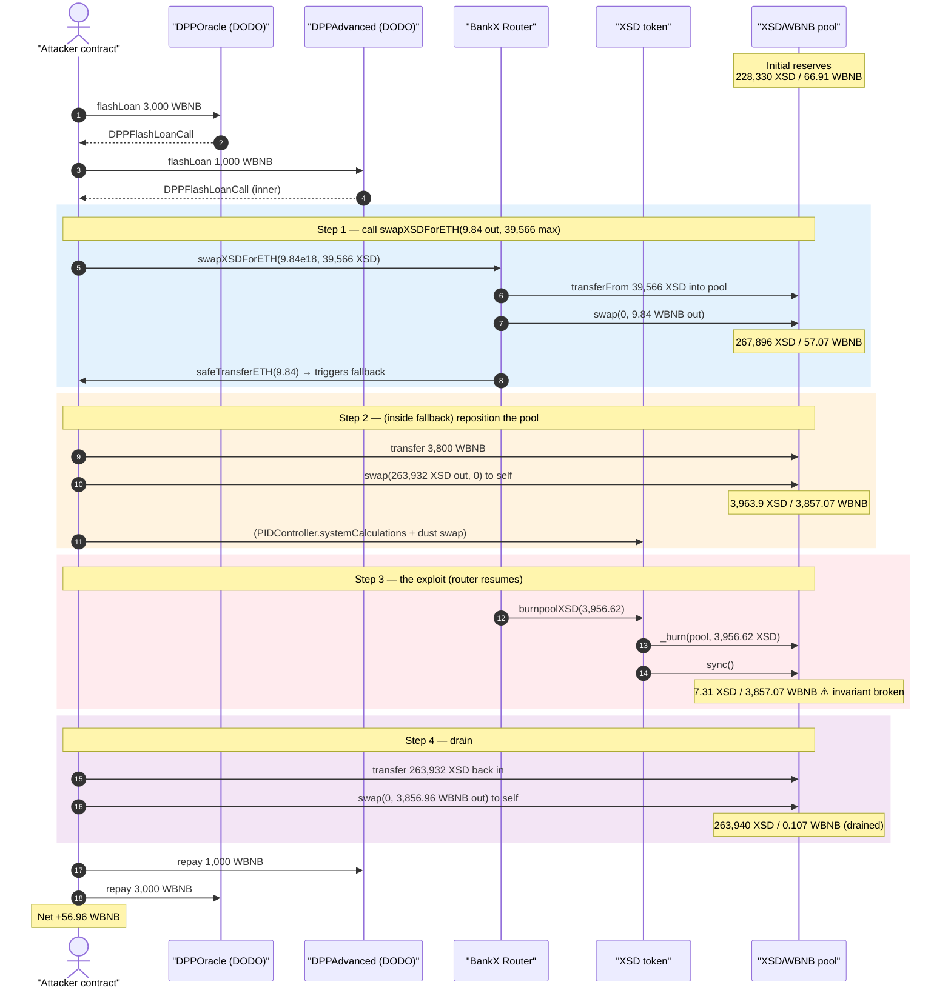
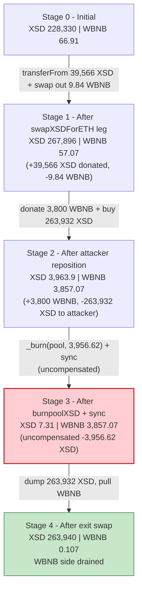
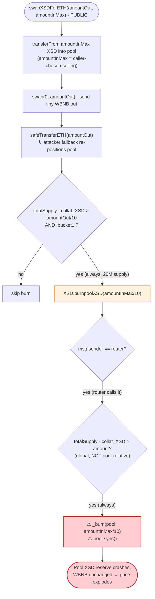
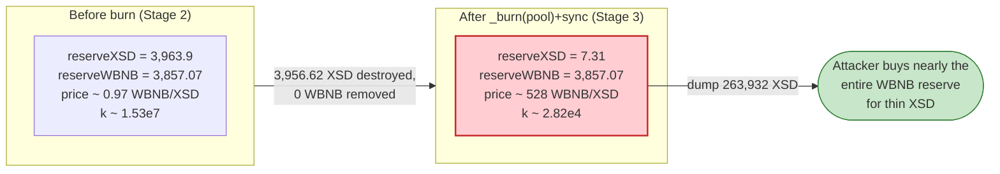

# BankX / XSD Exploit — Router `swapXSDForETH()` Triggers an Un-Compensated Pool Burn

> **Reproduction:** the PoC compiles & runs in an isolated Foundry project at
> [this project folder](.) (the umbrella DeFiHackLabs repo contains several unrelated PoCs that do
> not whole-compile, so this one was extracted).
> Full verbose trace: [output.txt](output.txt).
> Verified vulnerable sources: [Router](sources/Router_fADDa9/contracts_UniswapFork_Router.sol)
> and [XSDStablecoin](sources/XSDStablecoin_39400E/contracts_XSD_XSDStablecoin.sol).

---

## Key info

| | |
|---|---|
| **Loss** | **56.96 WBNB** drained from the XSD/WBNB pool (≈ $12.5K at the time) |
| **Vulnerable contracts** | `Router` ([`0xfADDa925e10d07430f5d7461689fd90d3D81bB48`](https://bscscan.com/address/0xfADDa925e10d07430f5d7461689fd90d3D81bB48#code)) + `XSDStablecoin` ([`0x39400E67820c88A9D67F4F9c1fbf86f3D688e9F6`](https://bscscan.com/address/0x39400E67820c88A9D67F4F9c1fbf86f3D688e9F6#code)) |
| **Victim pool** | `XSDWETHpool` — [`0xbfBcB8BDE20cc6886877DD551b337833F3e0d96d`](https://bscscan.com/address/0xbfBcB8BDE20cc6886877DD551b337833F3e0d96d) (XSD = token0, WBNB = token1) |
| **Attacker EOA** | [`0x506eebd8d6061202a8e8fc600bb3d5d41f475ee1`](https://bscscan.com/address/0x506eebd8d6061202a8e8fc600bb3d5d41f475ee1) |
| **Attacker contract** | [`0x202e059a16d29a2f6ae0307ae3d574746b2b6305`](https://bscscan.com/address/0x202e059a16d29a2f6ae0307ae3d574746b2b6305) |
| **Attack tx** | [`0xbdf76f22c41fe212f07e24ca7266d436ef4517dc1395077fabf8125ebe304442`](https://bscscan.com/tx/0xbdf76f22c41fe212f07e24ca7266d436ef4517dc1395077fabf8125ebe304442) |
| **Chain / block / date** | BSC / 32,086,901 (fork at 32,086,900) / Sept 26, 2023 |
| **Funding** | DODO flash loans (DPPOracle + DPPAdvanced), 3,000 + 1,000 WBNB |
| **Compiler** | Pool/Router/XSD: Solidity v0.8.4, optimizer 100,000 runs |
| **Bug class** | Broken AMM constant-product invariant via an attacker-sized, un-compensated reserve burn (`_burn(pool) + sync()`) |

---

## TL;DR

The BankX `Router.swapXSDForETH(amountOut, amountInMax)` is a Uniswap-V2-style "swap exact-XSD for
ETH" wrapper, except for a fatal bolt-on at the end: after performing the swap it **burns
`amountInMax / 10` worth of XSD directly out of the liquidity pool** by calling
`XSD.burnpoolXSD(amountInMax/10)` ([Router.sol:199-201](sources/Router_fADDa9/contracts_UniswapFork_Router.sol#L199-L201)).
`burnpoolXSD` does `super._burn(address(xsdEthPool), _xsdamount)` then `xsdEthPool.sync()`
([XSDStablecoin.sol:276-283](sources/XSDStablecoin_39400E/contracts_XSD_XSDStablecoin.sol#L276-L283)).

Two design flaws compose into a critical bug:

1. **`amountInMax` is fully attacker-controlled and is NOT what was actually swapped.** It is the
   user-supplied slippage ceiling that gets `transferFrom`'d into the pool, but the burn amount is
   keyed off `amountInMax/10` rather than off the swap's actual economics. The attacker passes a tiny
   `amountOut` (9.84 WBNB) with a huge `amountInMax` (39,566 XSD), so the routine burns 3,956.6 XSD —
   roughly the **entire** remaining XSD reserve — for a near-zero swap.
2. **The burn deletes one side of the pool's reserves and `sync()`s, with no matching WBNB outflow.**
   This destroys the constant-product invariant `x·y = k` in the attacker's favor.

The attacker uses a DODO flash loan as working capital, manipulates the pool down to a thin XSD
reserve, triggers the un-compensated burn (which crashes the XSD reserve from 3,963.9 XSD to
**7.31 XSD** while leaving 3,857 WBNB untouched), then dumps a pre-bought XSD bag into the now
degenerate pool to pull out **3,856.96 WBNB**. After repaying both flash loans, the net profit is
**56.96 WBNB**.

---

## Background — the BankX/XSD protocol

XSD is an algorithmic, partially-collateralized stablecoin (a Frax-style design). Relevant pieces:

- **`XSDWETHpool`** ([source](sources/XSDWETHpool_bfBcB8/contracts_XSD_Pools_XSDWETHpool.sol)) is a
  custom Uniswap-V2 fork pair holding XSD (token0) and WBNB (token1). Its `swap()` enforces the
  standard K-check ([XSDWETHpool.sol:135](sources/XSDWETHpool_bfBcB8/contracts_XSD_Pools_XSDWETHpool.sol#L135))
  and `sync()` blindly trusts current balances
  ([XSDWETHpool.sol:151-153](sources/XSDWETHpool_bfBcB8/contracts_XSD_Pools_XSDWETHpool.sol#L151-L153)).
- **`Router`** ([source](sources/Router_fADDa9/contracts_UniswapFork_Router.sol)) is the front door
  for swaps. After certain swaps it "burns" a slice of XSD from the pool to push deflation, and calls
  `refreshPID()` to recompute oracle/system state.
- **`XSDStablecoin`** ([source](sources/XSDStablecoin_39400E/contracts_XSD_XSDStablecoin.sol)) is the
  XSD ERC20. It exposes `burnpoolXSD()`, gated only by `msg.sender == router`, which burns XSD out of
  the pool and re-syncs it.

On-chain state at the fork block (read directly from the trace):

| Parameter | Value | Trace |
|---|---|---|
| XSDWETHpool reserve0 (XSD) | 228,330.43 XSD | [output.txt:92](output.txt) |
| XSDWETHpool reserve1 (WBNB) | 66.91 WBNB | [output.txt:92](output.txt) |
| XSD `totalSupply()` | 20,000,547.03 XSD | [output.txt:162](output.txt) |
| CollateralPool `collat_XSD()` | ~6.26 XSD (1.5b42…e3414b) | [output.txt:308](output.txt) |
| XSD given to attacker (`deal`) | 39,566.238 XSD | [output.txt:54](output.txt) |
| `bucket1()` | 0 (false) | [output.txt:550](output.txt) |

The `uXSD > 0` guard inside `burnpoolXSD` (`totalSupply - collat_XSD > _xsdamount`) is trivially
satisfied here — 20M XSD un-collateralized supply dwarfs the 3,956 XSD burn — so it provides no
protection at all against draining a 3,963-XSD pool.

---

## The vulnerable code

### 1. `Router.swapXSDForETH` — the burn keyed off the attacker-controlled slippage ceiling

```solidity
// sources/Router_fADDa9/contracts_UniswapFork_Router.sol:181-203
function swapXSDForETH(uint amountOut, uint amountInMax) external override {
    require(!swap_paused, "Swaps have been paused");
    (uint reserveA, uint reserveB, ) = IXSDWETHpool(XSDWETH_pool_address).getReserves();
    uint amounts = BankXLibrary.quote(amountOut, reserveB, reserveA);
    require(amounts <= amountInMax, 'BankXRouter: EXCESSIVE_INPUT_AMOUNT');   // amountInMax = ceiling
    TransferHelper.safeTransferFrom(
        xsd_address, msg.sender, XSDWETH_pool_address, amountInMax            // ⚠️ pulls the FULL ceiling into the pool
    );
    XSDWETHpool(XSDWETH_pool_address).swap(0, amountOut, address(this));
    IWBNB(WETH).withdraw(amountOut);
    TransferHelper.safeTransferETH(msg.sender, amountOut);                    // ⚠️ ETH send → attacker fallback reenters the system
    //burn xsd here
    if (XSD.totalSupply() - CollateralPool(payable(collateral_pool_address)).collat_XSD() > amountOut/10
        && !pid_controller.bucket1()) {
        XSD.burnpoolXSD(amountInMax/10);                                     // ⚠️ burn = amountInMax/10, NOT swap economics
    }
    refreshPID();
}
```

Note that the entire `amountInMax` is transferred into the pool, but the swap only consumes the
amount required for `amountOut`. The leftover XSD just sits in the pool as donated liquidity — and then
the contract **burns `amountInMax/10` of the pool's XSD** regardless. With the attacker choosing
`amountInMax = 39,566 XSD` against `amountOut = 9.84 WBNB`, the burn is 3,956.6 XSD.

### 2. `XSDStablecoin.burnpoolXSD` — destroys pool reserve, then `sync()`

```solidity
// sources/XSDStablecoin_39400E/contracts_XSD_XSDStablecoin.sol:276-283
function burnpoolXSD(uint _xsdamount) public {
    //uXSD = totalSupply - collat_XSD
    require(msg.sender == router, "Only the router can access this function");
    require(totalSupply()-CollateralPool(payable(collateral_pool_address)).collat_XSD()>_xsdamount,
            "uXSD has to be positive");                                       // 20M >> 3,956 → always true
    super._burn(address(xsdEthPool), _xsdamount);                            // ⚠️ deletes XSD held by the pair
    xsdEthPool.sync();                                                       // ⚠️ forces the reduced balance to be the new reserve
    emit XSDBurned(msg.sender, address(this), _xsdamount);
}
```

### 3. `XSDWETHpool.sync` — blindly trusts balances

```solidity
// sources/XSDWETHpool_bfBcB8/contracts_XSD_Pools_XSDWETHpool.sol:151-153
function sync() external override nonReentrant {
    _update(IERC20(XSDaddress).balanceOf(address(this)),
            IERC20(WETHaddress).balanceOf(address(this)), reserve0, reserve1);
    kLast = uint(reserve0)*(reserve1);
}
```

`sync()` does no K-check — it exists to "accept reality." `burnpoolXSD` weaponizes exactly that: it
makes XSD *vanish* from the pair, then tells the pair "your XSD reserve is now this much smaller,"
while WBNB is untouched. `k` collapses and the marginal price of XSD explodes.

---

## Root cause — why it was possible

A Uniswap-V2/PancakeSwap pair prices assets purely from its reserves and enforces `x·y ≥ k` only
*inside `swap()`*. Burning one token from the pair and `sync()`ing is a unilateral, un-compensated
reserve deletion that no honest AMM should ever perform on a live pool. BankX did exactly that, and
made it externally reachable and **attacker-scaled**:

1. **Burn amount is decoupled from swap economics.** The burn is `amountInMax/10`, where `amountInMax`
   is the caller's slippage ceiling, not the value of the trade. A near-dust swap (9.84 WBNB out) can
   carry a burn that wipes essentially the entire XSD reserve.
2. **The "uXSD positive" guard is on global supply, not on the pool.** `totalSupply - collat_XSD`
   (≈20M XSD) is checked against the burn amount, so it never limits a burn that is catastrophic
   *relative to the tiny pool*.
3. **`sync()` has no slippage / K protection.** Any balance change is accepted as the new truth, so a
   one-sided burn directly re-prices the pool.
4. **The flow is permissionless and flash-loanable.** Anyone can call `swapXSDForETH` with arbitrary
   `amountInMax`; the working capital to set up the pool state is borrowed and repaid in the same
   transaction. The mid-swap `safeTransferETH` even hands control back to the attacker (via the ETH
   receive hook) so the multi-step setup runs inside one router call.

The net effect: `burnpoolXSD` is a free, attacker-sized "delete half the pool's XSD reserve" button.

---

## Preconditions

- `XSD.totalSupply() - collat_XSD() > amountOut/10` and `> amountInMax/10` (both trivially true given
  20M un-collateralized supply) and `pid_controller.bucket1() == false`
  ([output.txt:550](output.txt) shows `bucket1 = 0`). All satisfied at the fork block.
- Working capital in WBNB to (a) pre-buy a large XSD bag and (b) top up the pool's WBNB side so the
  exit swap can pull a big WBNB amount. The attacker borrowed 3,000 WBNB (DPPOracle) + 1,000 WBNB
  (DPPAdvanced) via DODO flash loans and repaid both in the same transaction — so the attack is
  effectively self-funded and atomic.
- A starting XSD balance to feed `swapXSDForETH`'s `amountInMax`. In the live attack the attacker had
  acquired XSD beforehand; the PoC reproduces it with `deal(XSD, attacker, 39,566.238 XSD)`
  ([XSDWETHpool_exp.sol:82](test/XSDWETHpool_exp.sol#L82)).

---

## Attack walkthrough (with on-chain numbers from the trace)

The pair's `token0 = XSD`, `token1 = WBNB`, so `reserve0 = XSD`, `reserve1 = WBNB`. All figures are
taken directly from the `Sync`/`Swap`/`balanceOf` lines in [output.txt](output.txt).

The whole exploit runs inside nested DODO flash-loan callbacks. The clever part is that the
attacker's pool setup happens **inside the router's own `swapXSDForETH` call**: the router sends ETH
to the attacker via `safeTransferETH` *before* it does the pool burn, which lands in the attacker's
`fallback()` ([XSDWETHpool_exp.sol:110-115](test/XSDWETHpool_exp.sol#L110-L115)) and re-positions the
pool. Then control returns to the router, which executes the fatal `burnpoolXSD`.

| # | Step | XSD reserve | WBNB reserve | Trace | Effect |
|---|------|------------:|-------------:|-------|--------|
| 0 | **Initial** | 228,330.43 | 66.91 | [:92](output.txt) | Honest pool. |
| 1 | Attacker calls `Router.swapXSDForETH(9.84 WBNB out, 39,566.238 XSD max)`; router `transferFrom`s **39,566.238 XSD** into the pool, then `swap()` sends out **9.84 WBNB** | 267,896.67 | 57.07 | [:93-110](output.txt) | Full slippage ceiling donated into pool; 9.84 WBNB out. |
| 2a | *(inside `safeTransferETH` → attacker `fallback`)* attacker transfers **3,800 WBNB** into the pool | 267,896.67 | 60.87→… | [:126-129](output.txt) | Pre-loads the WBNB side. |
| 2b | attacker `XSDWETHpool.swap(263,932.74 XSD out, 0)` — buys the bag for itself | 3,963.94 | 3,857.07 | [:132-143](output.txt) | Pool XSD thinned to **3,963.9**; attacker now holds 263,932.74 XSD off-pool. |
| 2c | attacker calls `PIDController.systemCalculations()` + a dust `swapETHForBankX` | 3,963.94 | 3,857.07 | [:148-364](output.txt) | Refreshes oracle/system state so the later router checks pass; negligible value. |
| 3 | *(control returns to router)* `burnpoolXSD(3,956.62 XSD)` → `_burn(pool, 3,956.62)` + `sync()` | **7.31** | 3,857.07 | [:551-560](output.txt) | **Invariant broken**: XSD reserve annihilated, WBNB untouched. |
| 4 | attacker transfers its **263,932.74 XSD** back into the pool and `swap(0, 3,856.96 WBNB out)` | 263,940.05 | **0.107** | [:571-588](output.txt) | Dumps the bag into the degenerate pool, pulls out **3,856.96 WBNB**. |
| 5 | repay 1,000 WBNB to DPPAdvanced, then 3,000 WBNB to DPPOracle | — | — | [:594-617](output.txt) | Both flash loans repaid. |
| 6 | **Final attacker WBNB balance** | — | — | [:630-633](output.txt) | **56.964339410199718035 WBNB profit**. |

**Why step 3 is theft.** Before the burn the pool held `3,963.94 XSD / 3,857.07 WBNB`
(`k ≈ 1.53e7` in token units). After `_burn(pool, 3,956.62)` + `sync()` it holds `7.31 XSD / 3,857.07
WBNB`. No WBNB left the pool, yet the XSD side dropped ~99.8%. The pool now thinks 7.31 XSD is worth
3,857 WBNB, i.e. each XSD is priced at ~528 WBNB. The attacker simply sells back the 263,932 XSD it
parked off-pool and drains the WBNB side down to 0.107 WBNB.

### Profit accounting (WBNB, net of flash loans)

The flash loans (3,000 + 1,000 WBNB) are borrowed and repaid in full within the transaction, so they
net to zero. The attacker started with 0 WBNB ([output.txt:68](output.txt) "Before Start: 0 BNB") and
ended with the drained WBNB minus what it injected:

| Flow | Amount (WBNB) | Trace |
|---|---:|-------|
| Received — 9.84 WBNB from the initial `swapXSDForETH` | +9.84 | [:99-118](output.txt) |
| Injected — 3,800 WBNB into the pool (step 2a) | −3,800.00 | [:126](output.txt) |
| Received — 3,856.96 WBNB from the exit swap (step 4) | +3,856.96 | [:577-578](output.txt) |
| **Net (≈ 9.84 − 3,800 + 3,856.96)** | **+56.96** | [:630-633](output.txt) |

Final measured profit: **56.964339410199718035 WBNB**, exactly matching the pool WBNB that was
re-priced away from the honest LPs by the un-compensated burn.

---

## Diagrams

### Sequence of the attack



### Pool state evolution



### The flaw inside `swapXSDForETH` / `burnpoolXSD`



### Why the burn is theft: constant-product before vs. after



---

## Why each magic number

- **`deal` 39,566.238 XSD → `amountInMax`:** sized so that `amountInMax/10 = 3,956.62 XSD` is just under
  the pool's repositioned XSD reserve (3,963.94 XSD). The burn then leaves the pool at `≈7.31 XSD`,
  pushing the XSD price to the moon while keeping the WBNB side full.
- **`amountOut = 9.84 WBNB`:** deliberately tiny — the swap itself is irrelevant; the only purpose of
  the `swapXSDForETH` call is to (a) donate the full `amountInMax` into the pool and (b) reach the
  `burnpoolXSD` line. The mid-call ETH transfer is the hook that lets the attacker reposition the pool
  before the burn fires.
- **`swapAmount = 263,932.74 XSD`:** the size of the bag the attacker buys out of the pool in step 2b
  and later dumps back in step 4. Large enough to absorb essentially all of the post-burn WBNB reserve.
- **`attackAmount = 3,800 WBNB`:** WBNB donated into the pool in step 2a so the exit swap has a fat
  WBNB side (3,857.07 WBNB) to drain.
- **3,000 + 1,000 WBNB flash loans:** working capital to fund the 3,800 WBNB donation and the bag buy;
  both fully repaid in-transaction, making the attack self-financing.

---

## Remediation

1. **Never burn from the liquidity pool on a swap path.** Removing `XSD.burnpoolXSD(amountInMax/10)`
   from `swapXSDForETH` (and the `_burn(pool) + sync()` body of `burnpoolXSD`) eliminates the bug. A
   burn must only ever destroy tokens the protocol *owns* (its own balance or a treasury), not the
   reserves an LP put up.
2. **Decouple any deflation from caller-controlled slippage parameters.** If a per-swap burn is a
   product requirement, base it on the *actual* amount swapped (`amounts`, the quoted input), never on
   `amountInMax`, and cap it as a small fraction of the pool's current reserve.
3. **If the pool must shrink, move both reserves together.** Route any reserve adjustment through the
   pair's own `burn()` (LP redemption) so XSD and WBNB move proportionally and `k` is preserved —
   `sync()`-after-one-sided-burn must be impossible to weaponize.
4. **Cap single-operation reserve impact.** Any operation that can move a pool reserve by more than a
   few percent should revert. A burn that lands as ~100% of a thinned reserve is a red flag.
5. **Avoid handing control to the caller mid-flow.** `swapXSDForETH` unwraps WBNB and sends native ETH
   to the caller *before* the burn, opening a reentrancy/repositioning window. Use a checks-effects
   ordering (do all state changes first) or push WBNB rather than ETH, and add a `nonReentrant` guard
   that spans the whole router function.

---

## How to reproduce

The PoC was extracted into a standalone Foundry project (the umbrella DeFiHackLabs repo has several
unrelated PoCs that fail to compile under `forge test`'s whole-project build):

```bash
_shared/run_poc.sh 2023-09-XSDWETHpool_exp -vvvvv
```

- RPC: a **BSC archive** endpoint is required (the fork pins block 32,086,900). The project's
  `foundry.toml` points the `bsc` alias at an archive node; most pruned public RPCs will fail with
  `header not found` / `missing trie node`.
- Result: `[PASS] testExploit()` with `Attack Exploit: 56.964339410199718035 BNB`.

Expected tail ([output.txt:637-639](output.txt)):

```
Ran 1 test for test/XSDWETHpool_exp.sol:ContractTest
[PASS] testExploit() (gas: 888598)
Logs:
  Before Start: 0 BNB
  Attack Exploit: 56.964339410199718035 BNB
Suite result: ok. 1 passed; 0 failed; 0 skipped; finished in 33.20s
```

---

*References: CertiK Alert — https://twitter.com/CertiKAlert/status/1706765042916450781 ;
SlowMist Hacked — https://hacked.slowmist.io/ (BankX/XSD, BSC, Sept 2023).*
