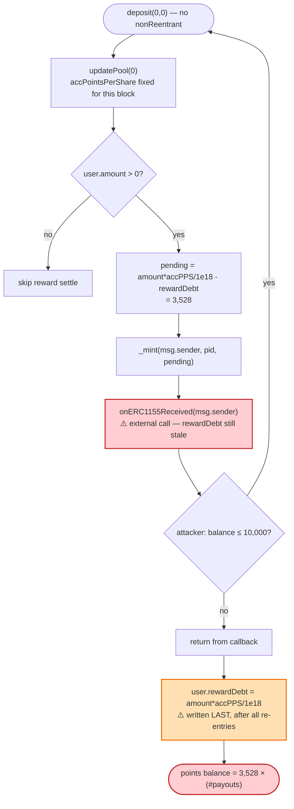
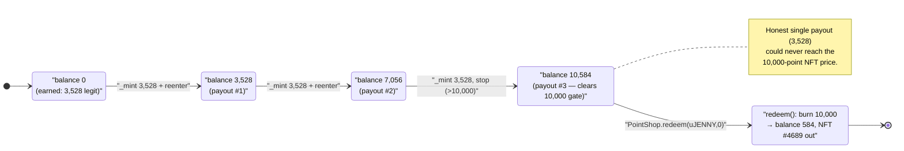

# Unicly PointFarm Exploit — ERC1155 Reentrancy Inflates Reward Points to Steal a LootRealms NFT

> **Reproduction:** the PoC compiles & runs in an isolated Foundry project at
> [this project folder](.). Full verbose trace: [output.txt](output.txt).
> Verified vulnerable source: [PointFarm.sol](sources/PointFarm_d3c41c/PointFarm.sol)
> (the redemption path is in [PointShop.sol](sources/PointShop_cDCc53/PointShop.sol)).

---

## Key info

| | |
|---|---|
| **Loss** | 1 NFT — **LootRealms #4689** (a "Realm" NFT, redeemed from the Unicly shop without enough points) |
| **Vulnerable contract** | `PointFarm` — [`0xd3C41c85bE295607E8EA5c58487eC5894300ee67`](https://etherscan.io/address/0xd3c41c85be295607e8ea5c58487ec5894300ee67#code) |
| **Redemption contract** | `PointShop` — [`0xcDCc535503CBA9286489b338b36156b4b75008f6`](https://etherscan.io/address/0xcDCc535503CBA9286489b338b36156b4b75008f6#code) |
| **uToken / pool** | `uJENNY` ([`0xa499648fD0e80FD911972BbEb069e4c20e68bF22`](https://etherscan.io/address/0xa499648fD0e80FD911972BbEb069e4c20e68bF22)) · uJENNY/WETH pair `0xEC5100AD159F660986E47AFa0CDa1081101b471d` |
| **Stolen NFT collection** | `LootRealms` ([`0x7AFe30cB3E53dba6801aa0EA647A0EcEA7cBe18d`](https://etherscan.io/address/0x7AFe30cB3E53dba6801aa0EA647A0EcEA7cBe18d)), token id **4689** |
| **Attacker EOA** | [`0x92cfcb70b2591ceb1e3c6d90e21e8154e7d29832`](https://etherscan.io/address/0x92cfcb70b2591ceb1e3c6d90e21e8154e7d29832) |
| **Attacker contract** | [`0x9d9820f10772ffcef842770b6581c07a97fed9e4`](https://etherscan.io/address/0x9d9820f10772ffcef842770b6581c07a97fed9e4) |
| **Attack tx** | [`0xc42fe1ce2516e125a386d198703b2422aa0190b25ef6a7b0a1d3c6f5d199ffad`](https://etherscan.io/tx/0xc42fe1ce2516e125a386d198703b2422aa0190b25ef6a7b0a1d3c6f5d199ffad) |
| **Chain / block / date** | Ethereum mainnet / fork at 18,133,171, attack rolled to 18,149,401 / Sept 2023 |
| **Compiler** | PointFarm/PointShop/Converter: Solidity **v0.6.12** (optimizer off); PoC compiled under 0.8.34 |
| **Bug class** | ERC1155 reentrancy (read-only-balance / state-update-after-callback) in a MasterChef-style reward accountant |
| **Analysis** | [@DecurityHQ thread](https://twitter.com/DecurityHQ/status/1703096116047421863) |

---

## TL;DR

`PointFarm` is a SushiSwap **MasterChef** fork (its own header says *"Copied from … MasterChef.sol — Modified by 0xLeia"*) that pays farming rewards as an **ERC1155 "points" token** instead of a normal ERC20. Users stake a Unicly `uToken` (here `uJENNY`) and accrue non-transferable points; those points are later burned in `PointShop.redeem()` to claim NFTs out of a shop.

The reward-settlement logic in
[`deposit()`](sources/PointFarm_d3c41c/PointFarm.sol#L1576-L1593) follows the classic MasterChef pattern: settle the user's pending reward, then update the user's `rewardDebt`. But because the reward is paid by **minting an ERC1155** via `_mint(...)`, the OpenZeppelin ERC1155 `_doSafeTransferAcceptanceCheck` makes an **external `onERC1155Received` callback to the recipient before `user.rewardDebt` is updated**. That is a textbook checks-effects-interactions violation: the "effect" (`rewardDebt = …`) happens *after* the "interaction" (the mint callback).

A malicious recipient re-enters `deposit(0,0)` from inside its `onERC1155Received` hook. On each re-entry, `pending = user.amount × accPointsPerShare/1e18 − user.rewardDebt` is recomputed against the **still-stale `rewardDebt`**, so the *same* pending reward is minted again and again. The attacker tripled its point balance (3,528 → **10,584**), enough to clear the NFT redemption price of **10,000** points that its honest single payout of 3,528 could never reach.

With 10,584 points, the attacker called `PointShop.redeem()`, which burned 10,000 points and shipped out **LootRealms #4689** for free. It then withdrew its `uJENNY` stake and swapped back to WETH, ending roughly capital-neutral (0.5 WETH in, 0.497 WETH out) while walking off with the NFT.

---

## Background — Unicly points farming

Unicly lets a collection of NFTs be fractionalized into an ERC20 `uToken` via a [`Converter`](sources/Converter_a49964/Converter.sol). Holders of a `uToken` can farm "points" and spend those points to redeem specific NFTs from a curated shop. Three contracts cooperate:

- **`PointFarm`** ([source](sources/PointFarm_d3c41c/PointFarm.sol)) — the MasterChef-style staking pool. You `deposit(pid, amount)` your `uToken`; over time you accrue points minted as an **ERC1155** (`id == pid`). Points are *non-transferable* — `safeTransferFrom`/`safeBatchTransferFrom` are overridden to require `from == this || to == this`, so the only way points move is mint/burn.
- **`PointShop`** ([source](sources/PointShop_cDCc53/PointShop.sol)) — holds NFTs that can be redeemed. [`redeem(uToken, internalID)`](sources/PointShop_cDCc53/PointShop.sol#L2683-L2693) burns `nfts[uToken][internalID].price` points from the caller (via `PointFarm.burn`) and transfers the NFT.
- **`Converter`** — the `uJENNY` ERC20 itself, backed by NFTs including the LootRealms collection.

The reward math is standard MasterChef:

```
pending reward = user.amount * pool.accPointsPerShare / 1e18 - user.rewardDebt
```

`accPointsPerShare` grows every block (`pointsPerBlock` per block, scaled by `1e18` and divided by the pool's `uToken` balance). `rewardDebt` is the "already-paid" watermark; after each settle it is reset to `user.amount * accPointsPerShare / 1e18` so the *next* `pending` starts from zero.

The whole scheme rests on one invariant: **once a pending reward is paid, `rewardDebt` is bumped so it cannot be paid again.** The bug breaks exactly that invariant.

---

## The vulnerable code

### 1. `deposit()` settles rewards by minting an ERC1155, then updates `rewardDebt` last

[PointFarm.sol:1576-1593](sources/PointFarm_d3c41c/PointFarm.sol#L1576-L1593):

```solidity
function deposit(uint256 _pid, uint256 _amount) public {
    PoolInfo storage pool = poolInfo[_pid];
    UserInfo storage user = userInfo[_pid][msg.sender];
    updatePool(_pid);
    if (user.amount > 0) {
        uint256 pending = user.amount.mul(pool.accPointsPerShare).div(1e18).sub(user.rewardDebt);
        if(pending > 0) {
            bytes memory data;
            _mint(msg.sender, _pid, pending, data);   // ⚠️ external callback to msg.sender HERE
        }
    }
    if(_amount > 0) {
        pool.uToken.safeTransferFrom(address(msg.sender), address(this), _amount);
        user.amount = user.amount.add(_amount);
    }
    user.rewardDebt = user.amount.mul(pool.accPointsPerShare).div(1e18);   // ⚠️ effect AFTER the interaction
    emit Deposit(msg.sender, _pid, _amount);
}
```

There is **no reentrancy guard** (no `nonReentrant`, no inherited `ReentrancyGuard`). `user.rewardDebt` — the value that prevents double payment — is written on the **last line**, *after* `_mint` has already handed control back to `msg.sender`.

### 2. `_mint` calls back the recipient before `rewardDebt` is set

`_mint` resolves to OpenZeppelin's ERC1155 [`_mint`](sources/PointFarm_d3c41c/PointFarm.sol#L1111-L1122), which credits the balance and then runs the acceptance check, which makes the external call:

```solidity
function _doSafeTransferAcceptanceCheck(...) private {
    if (to.isContract()) {
        try IERC1155Receiver(to).onERC1155Received(operator, from, id, amount, data) returns (bytes4 response) {
            ...
```

(see [PointFarm.sol:1230-1251](sources/PointFarm_d3c41c/PointFarm.sol#L1230-L1251)). Because the ERC1155 *balance* is already incremented but `PointFarm.user.rewardDebt` is **not yet** updated, the recipient observes an intermediate, inconsistent state and can act on it.

### 3. The attacker's `onERC1155Received` re-enters `deposit(0,0)`

[uniclyNFT_exp.sol:101-113](test/uniclyNFT_exp.sol#L101-L113):

```solidity
function onERC1155Received(address, address, uint256, uint256, bytes calldata) external returns (bytes4) {
    uint256 pointFarmBalance = PointFarm.balanceOf(address(this), 0);
    if (pointFarmBalance <= 10_000) {        // keep re-depositing until we clear the NFT price
        PointFarm.deposit(0, 0);
    }
    return this.onERC1155Received.selector;
}
```

Each nested `deposit(0,0)`:
1. calls `updatePool(0)` — but `block.number` hasn't changed, so `accPointsPerShare` is unchanged;
2. recomputes `pending = user.amount * accPointsPerShare/1e18 - user.rewardDebt` against the **still-stale `rewardDebt`** → identical 3,528 points;
3. mints another 3,528 points → another callback.

The recursion terminates when the balance exceeds 10,000, then the stack unwinds and the innermost frame finally sets `rewardDebt`. By then the attacker has been paid the same reward **three times**.

### 4. `PointShop.redeem()` burns the inflated points for an NFT

[PointShop.sol:2683-2693](sources/PointShop_cDCc53/PointShop.sol#L2683-L2693):

```solidity
function redeem(address _uToken, uint256 internalID) public {
    PointFarm(farm).burn(msg.sender, PointFarm(farm).shopIDs(_uToken), nfts[_uToken][internalID].price);
    ...
    IERC721(nfts[_uToken][internalID].contractAddr).transferFrom(address(this), msg.sender, ...tokenId);
}
```

The NFT price was **10,000 points**. An honest single deposit settlement paid only **3,528** — far short. The reentrancy made up the difference.

---

## Root cause

A **reentrancy** caused by violating checks-effects-interactions in a reward accountant whose reward token performs an external callback on mint:

1. **State-update-after-interaction.** `deposit()` mints the reward (an external `onERC1155Received` callback) **before** writing `user.rewardDebt`. The variable that enforces "pay each reward once" is updated last.
2. **The reward token is itself a callback token.** Unlike vanilla MasterChef (where the reward is a plain ERC20 mint that never calls back), here points are an **ERC1155**, so *every* reward payout hands control to the recipient mid-function. The MasterChef template was safe only because ERC20 `_mint` doesn't call out; porting it to ERC1155 silently introduced a reentrancy surface.
3. **No reentrancy guard.** `deposit()` (and `withdraw()`, which has the identical structure) has no `nonReentrant` modifier, so nested re-entry is permitted.
4. **The pending formula reads only mutated-too-late state.** Because `accPointsPerShare` doesn't change within the same block and `rewardDebt` isn't yet updated, `pending` is *constant* across re-entries — each re-entry re-mints the full reward.

The net effect: the attacker is paid the same `pending` reward once per re-entry. `withdraw()` shares the exact same flaw and could be abused the same way.

---

## Preconditions

- Attacker holds a non-zero `uToken` stake (`user.amount > 0`) so that `deposit` takes the reward-settlement branch. In the PoC the attacker buys ~3,528 uJENNY with 0.5 WETH and stakes it.
- At least some blocks must elapse after the stake so that `pending > 0`. The PoC `vm.roll`s from 18,133,171 to **18,149,401** (≈16,230 blocks, ~2 days) to accrue points.
- The attacker is a **contract** that implements `onERC1155Received` and re-enters `deposit`. (An EOA cannot reenter; this is why the attack runs through attacker contract `0x9d98…d9e4`.)
- The single honest payout must be *less than* the NFT price (3,528 < 10,000), so reentrancy is *needed* to clear it — here three payouts (10,584) suffice.

No flash loan, no privileged role, no oracle. The only capital required is enough WETH to buy a small uJENNY stake, and that capital is recovered at the end.

---

## Step-by-step attack walkthrough (with on-chain numbers from the trace)

All numbers below are taken directly from [output.txt](output.txt). Pool `uJENNY/WETH`: `reserve0 = uJENNY`, `reserve1 = WETH`.

| # | Step | Concrete values (from trace) |
|---|------|------------------------------|
| 0 | **Fund** the attacker with 0.5 WETH | `deal(WETH, this, 5e17)` |
| 1 | **Buy uJENNY** — transfer 0.5 WETH to the pair, `swap` out uJENNY | out = **3,527.995810700000234095 uJENNY** (`3.527e21`); pool after: 1,692,844 uJENNY / 239.696 WETH |
| 2 | **Stake** — `PointFarm.deposit(0, 3527.99e18)` | farm's uJENNY balance 10,000 → 13,527.99; sets `user.amount`, `accPointsPerShare`, `rewardDebt` |
| 3 | **Wait** — `vm.roll(18_149_401)` | +16,230 blocks (~2 days) of point accrual |
| 4 | **Trigger reward + reenter** — `PointFarm.deposit(0, 0)` | see the reentrancy ladder below |
| 4a | outer `deposit`: pending = **3,528**, `_mint(this,0,3528)` → callback; balance = 3,528 (≤10,000) ⇒ reenter | `TransferSingle … value: 3528`, balance `3528` |
| 4b | re-entry #1: `_mint` 3,528 → callback; balance = 7,056 (≤10,000) ⇒ reenter | balance `7056` |
| 4c | re-entry #2: `_mint` 3,528 → callback; balance = 10,584 (>10,000) ⇒ **stop** | balance `10584` |
| 4d | stack unwinds; each frame sets `rewardDebt` (now too late) | final point balance = **10,584** |
| 5 | **Unstake** — `PointFarm.withdraw(0, 3527.99e18)` | uJENNY returned to attacker |
| 6 | **Swap back** — transfer uJENNY to pair, `swap` out WETH | out = **0.497010711179183339 WETH** (`4.97e17`) |
| 7 | **Approve + redeem** — `setApprovalForAll(PointShop,true)` then `PointShop.redeem(uJENNY, 0)` | `burn(this, 0, 10000)` → balance 10,584 → **584**; `Realm.transferFrom(PointShop → this, 4689)` |
| 8 | **Result** | `Realm.ownerOf(4689) == attacker`; attacker WETH = 0.497 |

**Why 3 mints?** The legitimate single payout was `pending = 3528`. The attacker's guard `if (balance <= 10_000) deposit(0,0)` re-enters as long as the balance is ≤10,000. After 1 mint = 3,528 (≤10,000 → reenter), 2 mints = 7,056 (≤10,000 → reenter), 3 mints = 10,584 (>10,000 → stop). The NFT price is 10,000, so the attacker needs ≥3 payouts. Each re-entry pays the *same* 3,528 because `rewardDebt` is never updated until the recursion unwinds.

### Profit / loss accounting

| Item | Amount |
|---|---:|
| WETH in (buy uJENNY) | 0.500000000000000000 |
| WETH out (sell uJENNY back) | 0.497010711179183339 |
| **Net WETH** | **−0.00298928882…** (swap fees + price impact) |
| **Points minted vs. earned** | 10,584 minted vs. 3,528 legitimately earned (**3×**) |
| **NFT extracted** | LootRealms **#4689** (price 10,000 points) — taken essentially for free |

The attacker is roughly capital-neutral on WETH (a few thousandths of an ETH lost to AMM fees) and walks away with the NFT. The economic loss falls on the Unicly shop / `uJENNY` collateral pool, which gave up a real NFT for points that were conjured out of thin air. (The PoC's reported `Attacker WETH balance after attack: 0.497…` is the round-trip residue, not a profit — the profit is the NFT.)

---

## Diagrams

### Sequence of the attack

```mermaid
sequenceDiagram
    autonumber
    actor A as "Attacker contract"
    participant PF as "PointFarm (ERC1155)"
    participant PS as "PointShop"
    participant R as "LootRealms NFT"

    Note over A,PF: Setup — buy & stake uJENNY, then wait ~16,230 blocks

    rect rgb(227,242,253)
    Note over A,PF: Step 4 — deposit(0,0) triggers reward settlement
    A->>PF: deposit(0, 0)
    PF->>PF: updatePool(0); pending = 3,528
    PF->>PF: _mint(A, id=0, 3,528)
    PF-->>A: onERC1155Received() (rewardDebt NOT yet updated)
    end

    rect rgb(255,243,224)
    Note over A,PF: Re-entry #1 (balance 3,528 ≤ 10,000)
    A->>PF: deposit(0, 0)
    PF->>PF: pending = 3,528 again (stale rewardDebt)
    PF->>PF: _mint(A, id=0, 3,528)
    PF-->>A: onERC1155Received()  (balance 7,056)
    end

    rect rgb(255,235,238)
    Note over A,PF: Re-entry #2 (balance 7,056 ≤ 10,000)
    A->>PF: deposit(0, 0)
    PF->>PF: pending = 3,528 again
    PF->>PF: _mint(A, id=0, 3,528)
    PF-->>A: onERC1155Received() (balance 10,584 > 10,000 ⇒ STOP)
    PF->>PF: rewardDebt finally written (too late)
    end

    rect rgb(243,229,245)
    Note over A,R: Steps 5–7 — cash out & redeem
    A->>PF: withdraw(0, 3527.99e18)
    A->>PF: setApprovalForAll(PointShop, true)
    A->>PS: redeem(uJENNY, 0)
    PS->>PF: burn(A, id=0, 10,000)
    Note over PF: points 10,584 → 584
    PS->>R: transferFrom(PointShop → A, #4689)
    end

    Note over A: Holds LootRealms #4689 for ~3,528 legitimately-earned points
```

### Why the points inflate: state-update-after-interaction



### Point-balance evolution vs. the redemption gate



---

## Remediation

1. **Add a reentrancy guard.** Apply OpenZeppelin `ReentrancyGuard`'s `nonReentrant` to `deposit`, `withdraw`, and `emergencyWithdraw`. This alone blocks the nested re-entry.
2. **Follow checks-effects-interactions.** Update `user.rewardDebt` (the anti-double-pay watermark) **before** minting the reward, not after. If `rewardDebt` is already advanced when the callback fires, a re-entrant `deposit` computes `pending == 0` and mints nothing.
3. **Don't pay rewards with a callback token, or pull-not-push.** A MasterChef port should keep rewards as a non-callback ERC20, or move to a pull model (`claim()` that the user calls explicitly) so settlement does not hand control to an arbitrary recipient mid-accounting.
4. **Validate the acceptance hook.** `onERC1155Received` here returns the magic value only when `keccak256(data) == keccak256("JCNH")`; minting passes empty `data`, so the standard mint would normally revert. The attacker side-steps this by implementing its own permissive receiver — but the deeper issue is that *any* external call during settlement is unsafe, regardless of the hook's checks.
5. **Cap or sanity-check per-block reward issuance.** A single account receiving the same `pending` multiple times within one block is an invariant violation; an assertion that `rewardDebt` strictly increases on each payout would have caught it.

---

## How to reproduce

The PoC is an isolated Foundry project (the umbrella DeFiHackLabs repo does not whole-compile under `forge test`).

```bash
_shared/run_poc.sh 2023-09-uniclyNFT_exp --mt testExploit -vvvvv
```

- RPC: a **mainnet archive** endpoint is required (fork block 18,133,171, then `vm.roll` to 18,149,401). `foundry.toml`'s `mainnet` endpoint serves the historical state.
- Result: `[PASS] testExploit()` — the attacker ends owning LootRealms #4689 with only ~3,528 legitimately-earned points.

Expected tail:

```
[PASS] testExploit() (gas: 642763)
  Attacker Realm NFT balance before attack: 0
  Attacker WETH balance after attack: 0.497010711179183339
  Attacker Realm NFT balance after attack: 1
Suite result: ok. 1 passed; 0 failed; 0 skipped; finished in 11.98s
```

---

*Reference: Decurity analysis — https://twitter.com/DecurityHQ/status/1703096116047421863 (Unicly PointFarm, Ethereum, Sept 2023).*
