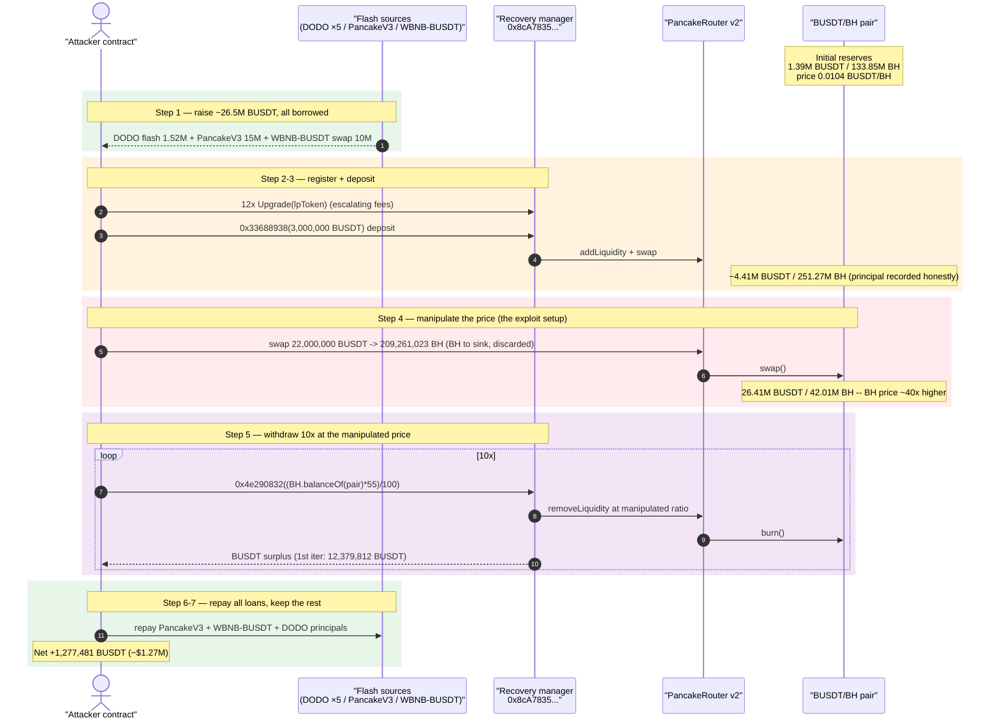
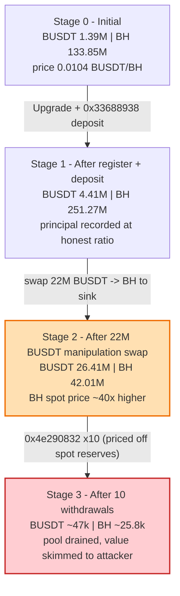
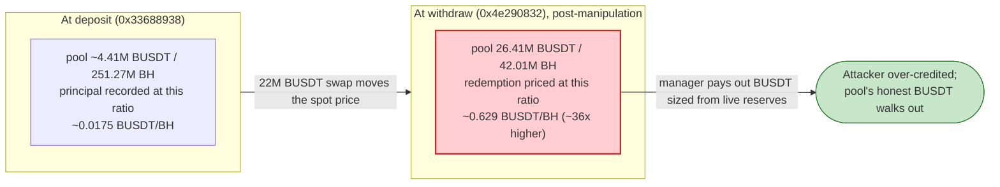
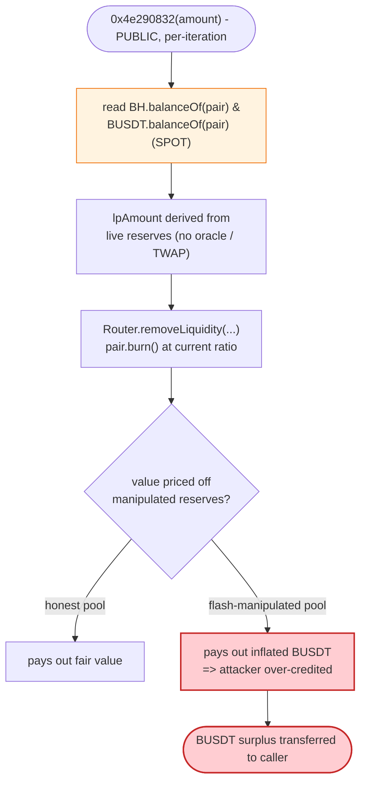

# BH Exploit — Spot-Reserve-Priced Liquidity Manager Drained via Flash-Loan Price Manipulation

> **Reproduction:** the PoC compiles & runs in an isolated Foundry project at
> [this project folder](.). The umbrella DeFiHackLabs repo does not whole-compile under
> `forge test`, so this PoC was extracted into a standalone project.
> Full verbose trace: [output.txt](output.txt).
> PoC source: [test/BH_exp.sol](test/BH_exp.sol).
> Verified BH token source: [sources/BH_CC61CC/BH.sol](sources/BH_CC61CC/BH.sol)
> (the actual vulnerable logic lives in the **unverified** liquidity-manager
> `0x8cA7835aa30b025b38A59309DD1479d2F452623a`, whose behavior is reconstructed from the trace).

---

## Key info

| | |
|---|---|
| **Loss** | ~$1.27M — attacker walked away with **1,277,481 BUSDT** (started with 0) plus 22.08M BH dust |
| **Vulnerable contract** | "Recovery" liquidity manager (unverified) — [`0x8cA7835aa30b025b38A59309DD1479d2F452623a`](https://bscscan.com/address/0x8cA7835aa30b025b38A59309DD1479d2F452623a) |
| **Token involved** | `BH` (BH Token) — [`0xCC61CC9F2632314c9d452acA79104DDf680952b5`](https://bscscan.com/address/0xCC61CC9F2632314c9d452acA79104DDf680952b5#code) |
| **Victim pool** | BUSDT/BH PancakePair — [`0x2371E4Ad771020CE3D8252f1db3e5559FbA8eeb5`](https://bscscan.com/address/0x2371E4Ad771020CE3D8252f1db3e5559FbA8eeb5) (token0 = BUSDT, token1 = BH) |
| **Attacker EOA** | [`0xfdbfceea1de360364084a6f37c9cdb7aaea63464`](https://bscscan.com/address/0xfdbfceea1de360364084a6f37c9cdb7aaea63464) |
| **Attacker contract** | [`0x216ccfd4fb3f2267677598f96ef1ff151576480c`](https://bscscan.com/address/0x216ccfd4fb3f2267677598f96ef1ff151576480c) |
| **Attack tx** | [`0xc11e4020c0830bcf84bfa197696d7bfad9ff503166337cb92ea3fade04007662`](https://bscscan.com/tx/0xc11e4020c0830bcf84bfa197696d7bfad9ff503166337cb92ea3fade04007662) |
| **Chain / block / date** | BSC / 32,512,073 / Oct 11, 2023 |
| **Compiler** | BH token: Solidity v0.8.4 (optimizer 200 runs); PancakePair: v0.5.16 |
| **Bug class** | Spot-price liquidity accounting (no TWAP/oracle) → flash-loan price manipulation across a deposit/withdraw boundary |

---

## TL;DR

The "Recovery" liquidity manager lets a user **deposit** BUSDT (selector `0x33688938`) and later
**withdraw** (selector `0x4e290832`). On deposit it adds BUSDT+BH to the BUSDT/BH PancakeSwap pair
and records the user's principal at the pool's *current* ratio. On withdraw it computes how much LP
to redeem — and therefore how much BUSDT to hand back — **from the pool's instantaneous spot
reserves at withdraw time** rather than from the recorded principal or a manipulation-resistant
oracle.

The attacker, funded entirely by flash loans, did the following inside one transaction:

1. **Bootstrapped a position** in the manager: 12× `Upgrade(lpToken)` (a small escalating-fee
   accrual/registration routine) plus a large deposit `0x33688938(3,000,000 BUSDT)`.
2. **Crashed the BH price** in the pair by dumping **22,000,000 BUSDT → 209,261,023 BH** and sending
   that BH to a throwaway sink ([`0x5b9dd1De...`](https://bscscan.com/address/0x5b9dd1De70320B1EA6C8BBebA12bf4e246227999)).
   This collapses the pair from `1.40M BUSDT / 251.27M BH` to `26.41M BUSDT / 42.01M BH` — BH's spot
   price (BUSDT per BH) jumps roughly **40×**.
3. **Withdrew 10×** via `0x4e290832`. Because the withdrawal math reads the now-distorted spot
   reserves, each redemption returns far more BUSDT than the position is actually worth, repeatedly
   redeeming `BH.balanceOf(pair) * 55%` worth of LP and skimming BUSDT back to the attacker.
4. **Repaid all flash loans** and kept the surplus: **1,277,481 BUSDT (~$1.27M) of net profit.**

The BH token contract itself (verified) is a trivial whitelist-gated ERC20 — it is **not** where the
bug lives; it is merely the asset paired against BUSDT in the manipulated pool. The exploit is a
classic *spot-reserve-priced* liquidity/redemption routine that trusts a flash-loan-manipulable AMM
price.

---

## Background — the actors

The PoC ([test/BH_exp.sol](test/BH_exp.sol)) wires together a deep flash-loan stack purely to raise
working capital cheaply (DODO pools charge 0 fee), then routes everything through the manager:

- **DODO pools** (`DPPOracle1/2/3`, `DPP`, `DPPAdvanced`) — five nested 0-fee BUSDT flash loans
  totalling **1,521,678 BUSDT**.
- **PancakeV3 `BUSDT_USDC`** — a 15,000,000 BUSDT `flash()` (paid back with a 0.05% fee = 7,500 BUSDT).
- **WBNB/BUSDT v2 pair** — a `swap()` that pulls **10,000,000 BUSDT** out (paid for in BUSDT inside
  the v2 callback).
- **Router** — PancakeRouter v2 (`0x10ED4...`), used by the manager for `addLiquidity` /
  `removeLiquidity` / swaps.
- **`UnverifiedContract1` = the manager** (`0x8cA7835...`, labelled `Recovery` for its factory role) —
  the vulnerable contract. Key entry points observed in the trace:
  - `Upgrade(address lpToken)` — pulls an escalating BUSDT fee from the caller (10, 20, … BUSDT),
    adds a tiny amount of liquidity, swaps, and distributes BH to a set of reward addresses; it
    effectively *registers / accrues* the caller as a participant.
  - `0x33688938(uint256 amount)` — **deposit**: pulls `amount` BUSDT, adds BUSDT+BH liquidity to the
    pair, records the caller's principal, and refunds leftover BH.
  - `0x4e290832(uint256 amount)` — **withdraw**: redeems LP from the pair and returns BUSDT to the
    caller, **sized from the pool's current spot reserves**.

The BUSDT/BH pair starts the transaction (block 32,512,073) at roughly:

| Reserve | Value |
|---|---|
| BUSDT (reserve0) | 1,393,467 BUSDT |
| BH (reserve1) | 133,854,404 BH |
| Spot price | ~0.0104 BUSDT per BH |

---

## The vulnerable code

### What is *verified*: the BH token (not the bug)

The on-chain-verified `BH` token ([sources/BH_CC61CC/BH.sol](sources/BH_CC61CC/BH.sol#L180-L191)) is a
plain whitelist-gated ERC20 with no fee-on-transfer and no AMM hooks:

```solidity
function _transfer(address sender, address to, uint amount) internal {
    require(isWhite[sender] || isWhite[to], "ERC20: not white");
    require(sender != address(0), "ERC20: transfer from the zero address");
    require(amount > 0, "Transfer amount must be greater than zero");
    require(_balances[sender] >= amount,"exceed balance!");

    _balances[sender] = _balances[sender].sub(amount);
    _balances[to] = _balances[to].add(amount);
    emit Transfer(sender, to, amount);
}
```

There is nothing exploitable here beyond the whitelist gate — and that gate is satisfied because the
pair and the manager are whitelisted. The vulnerability is in the **manager's redemption accounting**,
not in the token.

### What is *unverified* but reconstructable from the trace: the manager's withdraw

The manager's withdraw `0x4e290832` is not source-verified, but the trace makes its logic
unmistakable. The PoC drives it with a withdrawal sizing keyed to the *live* pool BH balance:

```solidity
// test/BH_exp.sol:117-125  — attacker's withdrawal loop
i = 0;
while (i < 10) {
    uint256 lpAmount = (BH.balanceOf(busdt_bh_lp) * 55) / 100;   // <-- spot-reserve-derived size
    (success,) = address(UnverifiedContract1).call(
        abi.encodeWithSelector(bytes4(0x4e290832), lpAmount));
    require(success, "Call to function with selector 0x4e290832 fail");
    ++i;
}
```

Inside each `0x4e290832` call the trace shows the manager:

1. read `BH.balanceOf(pair)` and `BUSDT.balanceOf(pair)` ([output.txt:2116-2119](output.txt));
2. derive an LP amount, `approve` the router, and call
   `Router.removeLiquidity(BUSDT, BH, lpAmount, 0, 0, manager, …)` ([output.txt:2127](output.txt));
3. the pair `burn()` returns BUSDT+BH **at the current (manipulated) ratio** —
   `Burn(amount0: 14,564,485 BUSDT, amount1: 23,172,077 BH)` ([output.txt:2161](output.txt));
4. re-add a slice of liquidity, then **transfer the BUSDT surplus to the caller** —
   `BUSDT::transfer(ContractTest, 12,379,812 BUSDT)` ([output.txt:2172-2173](output.txt)).

The single load-bearing flaw: **the amount of value returned to the user is a function of the pool's
instantaneous reserves, with no check that the spot price is consistent with the price at deposit
time and no manipulation-resistant oracle.** Because reserves are flash-loan-manipulable, the
attacker controls the exchange rate at which they redeem.

---

## Root cause

A constant-product AMM's *spot* price (`reserveQuote / reserveBase`) is trivially movable: a single
large swap shifts it arbitrarily for the rest of the transaction. Any protocol that prices
deposits/withdrawals/collateral off the pair's live reserves — instead of a TWAP, an external oracle,
or the user's recorded principal — can be drained by:

> deposit at the honest price → move the price with a flash-funded swap → withdraw at the
> manipulated price → repay the flash loan → keep the difference.

The BH manager does exactly this. Concretely:

1. **Withdrawal value derived from live reserves.** `0x4e290832` sizes the LP redemption (and thus
   the BUSDT paid out) from `BH.balanceOf(pair)` / pool reserves at *call time*, not from the
   principal recorded at deposit time.
2. **No oracle / no TWAP.** There is no manipulation-resistant price source; `getReserves()` *is* the
   price source.
3. **Deposit and withdraw are independently callable in the same transaction**, so the attacker can
   straddle a self-induced price move between them.
4. **The price move is free.** The 22M-BUSDT manipulation swap is fully recovered: the BUSDT goes
   into the pair and comes back out (and then some) through the over-credited withdrawals.

The verified BH token's whitelist (`isWhite`) is not a meaningful defense here — the pair and manager
are whitelisted so all transfers in the attack path succeed.

---

## Preconditions

- A liquidity manager that prices redemptions off the pair's **spot reserves** (satisfied by
  `0x8cA7835...`).
- The attacker can **deposit then withdraw within one transaction**, straddling a price move
  (satisfied: `0x33688938` and `0x4e290832` are separate public selectors).
- Enough working capital to (a) seed a deposit and (b) move the pool's BH price hard. All of it is
  **flash-loaned** (1.52M BUSDT from DODO + 15M from PancakeV3 + 10M from the WBNB/BUSDT pair), so the
  attacker needs ~0 of its own capital — the PoC starts the attacker at **0 BUSDT**
  ([test/BH_exp.sol:59](test/BH_exp.sol#L59)).
- BH whitelist permits the pair/manager/router transfers (true at the fork block).

---

## Attack walkthrough (with on-chain numbers from the trace)

All reserve figures are taken from `Sync` / `getReserves` events in [output.txt](output.txt). For the
pair, `reserve0 = BUSDT`, `reserve1 = BH`.

| # | Step | BUSDT reserve | BH reserve | Effect |
|---|------|--------------:|-----------:|--------|
| 0 | **Initial pool** (fork block) | 1,393,467 | 133,854,404 | Honest pool, price ≈ 0.0104 BUSDT/BH. |
| 1 | **Raise capital** — 5 nested DODO flash loans (1,521,678 BUSDT) + PancakeV3 `flash` 15,000,000 BUSDT + WBNB/BUSDT `swap` 10,000,000 BUSDT | — | — | Attacker now holds ~26.5M BUSDT, all borrowed. |
| 2 | **Register/accrue** — 12× `Upgrade(lpToken)` (escalating BUSDT fees 10,20,…) | ~1.405M | ~134.2M | Each `Upgrade` adds tiny liquidity + distributes BH rewards; bootstraps a manager position. |
| 3 | **Deposit** — `0x33688938(3,000,000 BUSDT)`: addLiquidity 1.998M BUSDT + 190.8M BH, then swap 1.002M BUSDT→73.78M BH, refund 66.27M BH to attacker | 3,403,698 → 4,405,698 | 325.06M → 251.27M | Principal recorded at the honest ratio; attacker holds a large LP/share position. |
| 4 | **Manipulate** — `swapExactTokensForTokens(22,000,000 BUSDT → 209,261,023 BH)`, BH sent to sink `0x5b9dd1De…` (discarded) | **26,405,698** | **42,011,431** | BH spot price spikes ~40×: pool now grossly BUSDT-heavy. |
| 5 | **Withdraw ×10** — `0x4e290832((BH.balanceOf(pair) * 55) / 100)` each iteration; manager `removeLiquidity` at the manipulated ratio and skims BUSDT to attacker | 26.41M → drains down to ~47,126 | 42.01M → ~25,835 | Each redemption is priced off the inflated reserves → massive BUSDT over-credit. First iteration alone returns 12,379,812 BUSDT to the attacker ([output.txt:2172](output.txt)). |
| 6 | **Repay** — return 15,007,500 BUSDT to PancakeV3, 10,060,000 BUSDT into WBNB/BUSDT (repay the 10M swap), and the five DODO principals | — | — | All borrowed capital returned. |
| 7 | **Settle** | — | — | Attacker keeps **1,277,481 BUSDT** + 22.08M BH dust. |

**Why the 55%-of-BH-balance sizing works:** by keying the withdrawal amount to the pool's *current*
BH balance, each iteration redeems a fixed fraction of whatever is left, and because redemptions are
priced at the manipulated (BUSDT-rich) ratio, BUSDT flows out far faster than the position's honest
value. Ten iterations walk the pool down from 26.4M BUSDT to ~47k BUSDT, with the difference (minus
flash-loan repayments) ending up with the attacker.

### Profit / loss accounting (BUSDT)

| Item | Amount (BUSDT) |
|---|---:|
| Attacker BUSDT before | 0 |
| Total flash-borrowed (DODO 1,521,678 + PancakeV3 15,000,000 + WBNB/BUSDT swap 10,000,000) | 26,521,678 |
| Flash repayments (incl. PancakeV3 0.05% fee 7,500 + WBNB/BUSDT swap repay 10,060,000 + DODO principals) | ≈ 26,521,678 + fees |
| **Attacker BUSDT after** | **1,277,481** |
| **Net profit** | **+1,277,481 BUSDT (~$1.27M)** |
| Residual BH dust held | 22,080,807 BH |

(Reported headline loss ~$1.27M, matching the final on-chain BUSDT balance read at
[output.txt](output.txt) tail: `Attacker BUSDT balance after attack: 1277481.82…`.)

---

## Diagrams

### Sequence of the attack



### Pool state evolution



### Why redemption is theft: deposit price vs. withdraw price



### The flaw inside the withdraw path



---

## Remediation

1. **Never price deposits/withdrawals off live AMM reserves.** Redemption value must be derived from
   the user's *recorded principal* (and any genuinely earned yield), not from `getReserves()` at
   withdraw time. The manager already pulls the user's BUSDT on deposit — return value relative to
   that recorded basis, not the spot pool ratio.
2. **Use a manipulation-resistant price source.** If a pool price is unavoidable, use a TWAP
   (Uniswap/Pancake v2 cumulative-price oracle over a window) or an independent oracle
   (Chainlink/DODO oracle price), and reject quotes that deviate from it beyond a tight band.
3. **Break the deposit/withdraw straddle.** Enforce a time delay or a "no withdraw in the same block
   as a deposit/large reserve change" rule so a flash-loaned price move cannot sit between a deposit
   and a withdrawal.
4. **Bound single-operation reserve impact / use slippage controls.** Reject withdrawals when the
   pair's spot price has moved more than a small percentage versus a reference (oracle/TWAP) within
   the operation, and pass real `amountMin` values to `removeLiquidity` instead of `0`.
5. **Add reentrancy / per-tx accounting guards.** Make the redemption accounting independent of any
   value the same transaction can transiently inflate.

---

## How to reproduce

The PoC was extracted into a standalone Foundry project (the umbrella DeFiHackLabs repo does not
whole-compile under `forge test`).

```bash
_shared/run_poc.sh 2023-10-BH_exp -vvvvv
```

- RPC: a **BSC archive** endpoint is required (fork block 32,512,073). Most pruned public RPCs will
  fail with `header not found` / `missing trie node`; use an archive node.
- Result: `[PASS] testExploit()` — attacker BUSDT goes from 0 to **1,277,481 BUSDT**.

Expected tail:

```
Ran 1 test for test/BH_exp.sol:ContractTest
[PASS] testExploit() (gas: 6430822)
Logs:
  Attacker BUSDT balance before attack: 0.000000000000000000
  Attacker BH balance before attack: 0.000000000000000000
  Attacker BUSDT balance after attack: 1277481.822359750672220700
  Attacker BH balance after attack: 22080807.209252526442543347

Suite result: ok. 1 passed; 0 failed; 0 skipped
```

---

*References: Beosin — https://twitter.com/BeosinAlert/status/1712139760813375973 ; Decurity —
https://twitter.com/DecurityHQ/status/1712118881425203350 ; SlowMist Hacked — https://hacked.slowmist.io/ (BH, BSC, ~$1.27M).*
