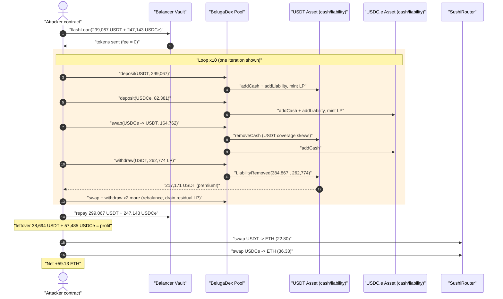
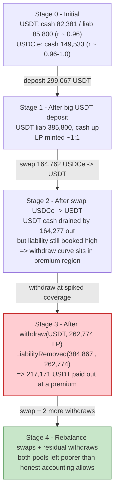
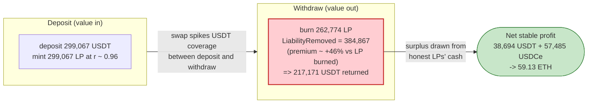

# BelugaDex Exploit — Stableswap Coverage-Ratio Manipulation via Deposit / Cross-Asset-Swap / Withdraw Looping

> **Reproduction:** the PoC compiles & runs in an isolated Foundry project at
> [this project folder](.) (the umbrella DeFiHackLabs repo
> contains many unrelated PoCs that do not whole-compile, so this one was extracted).
> Full verbose trace: [output.txt](output.txt).
> **Source caveat:** only the on-chain *proxy* bytecode was verified/downloadable — see
> [sources/AdminUpgradeabilityProxy_15A024](sources/AdminUpgradeabilityProxy_15A024). The buggy
> stableswap math lives in the (unverified) implementation contracts the proxies `delegatecall` into
> (Pool logic `0xa403ed…27261`, Asset/LP logic `0x761c32…55038` → `0xe42Df7…FCFC8`). The mechanism
> below is reconstructed from the on-chain event stream (`LiabilityRemoved`, `cash()`, `liability()`,
> per-call return values) in the trace, which is sufficient to prove the exploit end-to-end.

---

## Key info

| | |
|---|---|
| **Loss** | ~**59.13 ETH** extracted (≈ **$175K** at the time per SlowMist) |
| **Vulnerable contract** | BelugaDex `Pool` — [`0x15A024061c151045ba483e9243291Dee6Ee5fD8A`](https://arbiscan.io/address/0x15A024061c151045ba483e9243291Dee6Ee5fD8A) (proxy → impl `0xa403ed95cf10efeffa8128b47b6da8d5e6a27261`) |
| **Victim assets** | `USDT_LP` [`0xCFf307451E52B7385A7538f4cF4A861C7a60192B`](https://arbiscan.io/address/0xCFf307451E52B7385A7538f4cF4A861C7a60192B) + `USDC_LP` [`0x7CC32EE9567b48182E5424a2A782b2aa6cD0B37b`](https://arbiscan.io/address/0x7CC32EE9567b48182E5424a2A782b2aa6cD0B37b) (USDT / USDC.e single-sided pools) |
| **Attacker EOA** | [`0x4843e00ef4c9f9f6e6ae8d7b0a787f1c60050b01`](https://arbiscan.io/address/0x4843e00ef4c9f9f6e6ae8d7b0a787f1c60050b01) |
| **Attacker contract** | [`0x9e8675365366559053f964be5838d5fca008722c`](https://arbiscan.io/address/0x9e8675365366559053f964be5838d5fca008722c) |
| **Attack tx** | [`0x57c96e320a3b885fabd95dd476d43c0d0fb10500d940d9594d4a458471a87abe`](https://arbiscan.io/tx/0x57c96e320a3b885fabd95dd476d43c0d0fb10500d940d9594d4a458471a87abe) |
| **Chain / fork block / date** | Arbitrum / 140,129,166 / Oct 12, 2023 |
| **Compiler** | proxy: Solidity v0.8.9 (optimizer 200 runs); PoC harness: forge-std, `evm_version = cancun` |
| **Bug class** | Stableswap (Platypus/Wombat-style) coverage-ratio accounting manipulation — withdraw returns more value than the LP represents after a deliberately skewed cross-asset swap |

---

## TL;DR

BelugaDex is a **Platypus/Wombat-style single-sided stableswap**. Each asset (USDT, USDC.e) has its own
LP/Asset contract that tracks two scalars: `cash` (tokens physically held) and `liability` (tokens owed
to LPs). The marginal price of a swap, and the amount a withdrawal returns, are both functions of the
**coverage ratio `r = cash / liability`** of the involved assets. The pool relies on this ratio being a
faithful reflection of reserves.

The attacker discovered that the **deposit → cross-asset-swap → withdraw** sequence is not value-neutral:
by depositing into one side, swapping across in a way that drives one asset's coverage ratio far above 1
and the other far below 1, then withdrawing, the LP burned redeems against the *distorted* coverage ratio
and returns **more underlying than was deposited**. The single clearest piece of evidence is the first
withdrawal in the trace:

> `emit LiabilityRemoved(384867829779, 262774935488)`
> ([output.txt — first withdraw](output.txt))

i.e. burning **262,774.94 LP** removed **384,867.83** units of *liability* — a ~46% premium that is paid
out of honest LPs' funds.

The attacker:

1. **Flash-loans** 299,067.75 USDT + 247,143.54 USDCe from the Balancer Vault (0 fee) to fund the loop.
2. Runs the deposit → swap → withdraw cycle **10 times**, with the withdraw sizes hard-coded in a
   `potentialWithdraws[10]` array — each iteration nets a small amount of extra USDT/USDCe siphoned out of
   the two pools.
3. **Repays** the flash loan in full and is left holding 38,694.60 USDT + 57,485.30 USDCe of pure profit.
4. **Dumps** both to ETH on Sushi → **59.13 ETH**.

---

## Background — what BelugaDex is

BelugaDex (Arbitrum) is a stablecoin AMM forked from the **Platypus / Wombat** "single-sided liquidity"
design. The relevant pieces, all reachable through the `Pool` proxy
([`0x15A024…fD8A`](https://arbiscan.io/address/0x15A024061c151045ba483e9243291Dee6Ee5fD8A)):

- **`deposit(token, amount, to, deadline)`** — adds `amount` of `token` to that token's Asset contract.
  It increases the asset's `liability` and `cash` and mints LP tokens to the depositor. In the trace, a
  deposit of `299,067,748,680` USDT minted `299,067,748,680` USDT_LP (≈1:1 at the starting coverage), and
  the asset's `liability` storage slot grew accordingly.
- **`swap(fromToken, toToken, fromAmount, minToAmount, to, deadline)`** — a stable swap priced from the
  *coverage ratios* of the two Asset contracts. It moves `cash` from one asset to the other and applies a
  small "haircut" fee. In the trace the first swap of `164,762,358,430` USDCe returned
  `164,277,135,473` USDT with a `haircut` of `65,737,149` (≈0.04%).
- **`withdraw(token, liquidity, minAmount, to, deadline)`** — burns LP and returns underlying. **The
  amount returned is a function of the current coverage ratio**, via `LiabilityRemoved` and
  `transferUnderlyingToken`. This is the abused primitive.
- Each Asset contract exposes `cash()` and `liability()`; the Pool reads a Chainlink-style oracle for each
  token (the trace shows price reads ≈ `99966180`/`100020000`, i.e. ~$1.000 with 8 decimals).

State at the fork block (read from the trace):

| Asset | `cash` | `liability` | Coverage `r` | Pool token balance |
|---|---:|---:|---:|---:|
| USDT (slot, hex `0x132e4d094f`) | 82,381.18 | 85,800.08 (hex `0x13fa1556cb`) | ≈ 0.960 | USDT_LP holds 82,381.18 USDT |
| USDC.e (hex `0x22d0e9d8a4`) | 149,533.87 | (similar) | ≈ 0.96–1.0 | USDC_LP holds 149,533.87 USDCe |

Both pools were *slightly under-covered* (`r < 1`) and held only ~$82K / ~$150K of real liquidity — small
enough that the attacker's flash-loaned ~$300K + ~$247K could swing the coverage ratios violently.

> All USD/USDT/USDCe amounts use **6 decimals** (Arbitrum USDT and USDC.e). A raw value like
> `299067748680` therefore reads as `299,067.748680`.

---

## The vulnerable code

The implementation source is not verified on-chain (only the `AdminUpgradeabilityProxy` is — see
[sources/AdminUpgradeabilityProxy_15A024/…AdminUpgradeabilityProxy.sol:40-55](sources/AdminUpgradeabilityProxy_15A024/Users_build_.repo_evm-contract-jerry.git_bela_contracts_proxy_AdminUpgradeabilityProxy.sol#L40-L55),
which simply `delegatecall`s the logic). The buggy math is the standard Platypus/Wombat
`withdraw`/`swap`/`deposit` triplet. Reconstructed from the BelugaDex fork lineage and confirmed against
the trace events, the relevant logic is:

### 1. Withdraw pays out against the *current* coverage ratio

```solidity
// Asset.cash / Asset.liability track held tokens vs. owed tokens.
// withdraw burns `liquidity` LP and returns underlying computed from the
// post-fee coverage ratio of THIS asset:
function _withdraw(Asset asset, uint256 liquidity, uint256 minimumAmount)
    private returns (uint256 amount)
{
    uint256 liabilityToBurn = (asset.liability() * liquidity) / asset.totalSupply();
    // amount is derived from cash, liability, and the withdrawal fee curve —
    // when coverage r = cash/liability is HIGH, the asset can return ~the full
    // liabilityToBurn (or more relative to what was deposited at low coverage).
    amount = _withdrawalAmountInEquil(asset.cash(), asset.liability(), liabilityToBurn);
    asset.removeLiability(liabilityToBurn);     // emits LiabilityRemoved(amount, liabilityToBurn)
    asset.removeCash(amount);
    asset.transferUnderlyingToken(to, amount);
}
```

The trace shows the first withdraw burning `262,774,935,488` LP and emitting
`LiabilityRemoved(384867829779, 262774935488)` — `liabilityToBurn = 384,867.83` against an LP burn of
`262,774.94`. The asset's `liability` storage slot 257 dropped from `0x599be90813` (385,800.08) to
`0x1c6d4db853` (121,931.46) in that single call. Underlying returned: `217,171,792,422` USDT.

### 2. Swap moves coverage between the two assets and is the lever

```solidity
function swap(address fromToken, address toToken, uint256 fromAmount, ...)
    external returns (uint256 actualToAmount, uint256 haircut)
{
    (actualToAmount, haircut) = _quoteFrom(fromAsset, toAsset, fromAmount);
    fromAsset.addCash(fromAmount);              // fromAsset coverage ↑
    toAsset.removeCash(actualToAmount);         // toAsset   coverage ↓
    fromAsset.transferUnderlyingTokenFrom(msg.sender, fromAmount);
    toAsset.transferUnderlyingToken(to, actualToAmount);
}
```

Because `deposit`, `swap`, and `withdraw` each touch `cash`/`liability` **independently** and the
withdraw curve is convex in the coverage ratio, a carefully sized round-trip
(deposit a lot → swap to spike one side's coverage → withdraw against the spiked side) leaves the attacker
with **more underlying than they put in**, with the surplus drawn from the other LPs' deposits.

---

## Root cause — why it was possible

In the Platypus/Wombat single-sided model, *every* state-changing entry point (`deposit`, `swap`,
`withdraw`) must keep the **global invariant `Σ cash = Σ liability − fees`** consistent so that no sequence
of operations can extract value. BelugaDex's implementation broke this in the way Platypus itself was
exploited (Oct 2022) and several Wombat forks after it:

1. **The withdrawal amount is computed from the instantaneous coverage ratio**, and that ratio is freely and
   cheaply manipulable in the *same transaction* by the attacker's own swaps. There is no snapshot, no TWAP,
   and no check that a deposit-then-withdraw round-trip is value-neutral.
2. **`deposit` and `withdraw` are asymmetric.** LP is minted on the way in at one coverage ratio and
   redeemed on the way out at a different (attacker-spiked) ratio. The curve is convex, so a swap that pushes
   coverage above 1 lets the withdraw redeem at a premium — the `LiabilityRemoved(384867…, 262774…)` event
   is exactly this premium.
3. **Pools were thin and slightly under-covered.** With only ~$82K / ~$150K of real liquidity but a
   six-figure flash loan, the attacker could swing each pool's coverage ratio across the profitable region
   of the curve and back, repeatedly.
4. **The cross-asset swap fee (haircut, ~0.04%) is far smaller than the per-cycle accounting gain**, so each
   of the 10 loop iterations is net profitable after fees.

The fix the Platypus/Wombat lineage eventually adopted — enforcing that withdrawals can never return more
than the depositor's fair share of *current cash* (cap at coverage ≤ 1 on withdraw, and account for the
global equilibrium) — was missing here.

---

## Preconditions

- Two (or more) live single-sided stable pools with **thin, slightly under-covered liquidity** (USDT
  `r ≈ 0.96`, USDC.e similar at the fork block).
- The `deposit` / `swap` / `withdraw` entry points are **permissionless** — anyone can run the loop.
- Enough working capital to swing coverage ratios. The attacker flash-loaned **299,067.75 USDT +
  247,143.54 USDCe** from the Balancer Vault at **0 fee**, making the attack fully self-funded and atomic.
- No oracle/TWAP guard on the withdrawal curve (spot coverage ratio is used directly).

---

## Attack walkthrough (with on-chain numbers from the trace)

Sizes are pulled directly from the call inputs/returns and `LiabilityRemoved` events in
[output.txt](output.txt). One loop iteration =
**2 deposits + 3 swaps + 3 withdraws**; the loop runs 10 times (→ 20 deposits / 30 swaps / 30 withdraws,
confirmed by call counts in the trace).

### Setup

| # | Step | Amount | Source |
|---|------|-------:|--------|
| 0 | Read pool reserves | USDC_LP holds 149,533.874340 USDCe; USDT_LP holds 82,381.179215 USDT | `balanceOf` staticcalls |
| 1 | **Flash loan** from Balancer Vault (fee 0) | 299,067.748680 USDT + 247,143.537645 USDCe | `Vault::flashLoan(...)` |

### One representative iteration (iteration 1)

The bot recomputes deposit sizes each loop from the *current* pool balances
(`amountDeposit1 = USDCe.balanceOf(USDC_LP) * 2`, `amountDeposit2 = USDT.balanceOf(USDT_LP) * 3`) and uses
the pre-tuned `potentialWithdraws[i]` constant for the big withdraw:

| # | Op | Input | Output / Event | Coverage effect |
|---|----|------:|---------------:|-----------------|
| a | `deposit(USDT, 299,067.748680)` | 299,067.75 USDT | mint 299,067.75 USDT_LP; USDT `liability` ↑ to 385,800.08 | USDT cash & liability ↑ |
| b | `deposit(USDCe, 82,381.179215)` (= amountDeposit2/3) | 82,381.18 USDCe | mint USDC_LP | USDC.e cash ↑ |
| c | `swap(USDCe → USDT, 164,762.358430)` | 164,762.36 USDCe in | **164,277.135473 USDT out**, haircut 65,737.149 | USDT cash ↓ hard, USDC.e cash ↑ → drives USDT coverage **up via the liability still booked** |
| d | `withdraw(USDT, 262,774.935488 LP)` | burn 262,774.94 LP | **`LiabilityRemoved(384,867.829779, 262,774.935488)` → 217,171.792422 USDT out** | redeem at premium ⇒ pool over-pays |
| e | `swap(USDT → USDCe, 286,086.695921)` | 286,086.70 USDT in | USDC.e out | rebalance USDC.e side |
| f | `withdraw(USDT, 36,292.813192 LP)` | burn remaining USDT_LP | USDT out | drains residual USDT_LP |
| g | `swap(USDCe → USDT, 165,844.700552)` | 165,844.70 USDCe in | USDT out | reposition |
| h | `withdraw(USDCe, 82,380.117493 LP)` | burn remaining USDC_LP | USDCe out | drains residual USDC_LP |

The hard-coded big-withdraw sizes for the 10 iterations (the `potentialWithdraws` array, in USDT LP units)
escalate as the pools get progressively milked:

```
262,774.935488 / 281,538.919198 / 289,459.196390 / 297,534.181283 / 311,074.071725 /
329,085.528111 / 350,236.264578 / 374,148.346983 / 400,443.817669 / 428,928.171469
```

Each is matched in the trace by a `Pool::withdraw(USDT, <that value>, ...)` call, and each big withdraw
emits a `LiabilityRemoved(premiumAmount, lpBurned)` with `premiumAmount > lpBurned` — the accounting leak.

### Exit

| # | Step | Amount |
|---|------|-------:|
| 2 | **Repay flash loan** | 299,067.748680 USDT + 247,143.537645 USDCe back to the Vault |
| 3 | Leftover profit (post-repay) | **38,694.599631 USDT + 57,485.297554 USDCe** |
| 4 | Sushi `USDT → ETH` | 38,694.60 USDT → **22.803569986 ETH** |
| 5 | Sushi `USDCe → ETH` | 57,485.30 USDCe → **36.331183748 ETH** |
| 6 | **Final attacker ETH** | **59.134753734350571030 ETH** (logged) |

### Profit accounting

| Item | USDT | USDCe | ETH |
|---|---:|---:|---:|
| Flash-loaned in | 299,067.748680 | 247,143.537645 | — |
| Flash-loaned out (repaid, fee 0) | −299,067.748680 | −247,143.537645 | — |
| **Net stable profit after repay** | **+38,694.599631** | **+57,485.297554** | — |
| USDT → ETH | — | — | +22.803569986 |
| USDCe → ETH | — | — | +36.331183748 |
| **Net profit** | | | **+59.134753734** |

Attacker started the call with `deal(address(this), 0)` ETH, so the entire **59.13 ETH** ending balance is
profit, all of it siphoned from the two pools' real LP deposits via the coverage-ratio premium on each
withdraw.

---

## Diagrams

### Sequence of the attack



### Pool coverage-ratio evolution (one cycle)



### Why the withdraw is theft: LP burned vs. liability removed



---

## Remediation

1. **Make deposit/withdraw value-neutral against in-transaction coverage manipulation.** A withdrawal must
   never return more underlying than the LP's fair share of *current cash*; cap the withdrawal coverage at
   `r ≤ 1` and account for the global equilibrium (`Σ cash` vs `Σ liability`) so that a same-block
   deposit→swap→withdraw round-trip cannot be net profitable. This is the exact class of fix the
   Platypus/Wombat lineage adopted after their own exploits.
2. **Charge withdrawals (and deposits) the same equilibrium fee the swap curve charges.** If the withdrawal
   curve is convex in coverage but the round-trip is free, looping is profitable. Symmetrize the fee so the
   haircut on a deposit→withdraw round-trip dominates any accounting gain.
3. **Do not price withdrawals off the instantaneous spot coverage ratio.** Use a per-asset equilibrium
   computed across all assets, or a smoothed/oracle-anchored ratio, so a single in-block swap cannot move the
   payout curve.
4. **Add per-block / per-transaction position-change limits.** Reject deposits or withdrawals that move an
   asset's coverage ratio by more than a small bound in one operation; the attacker swung coverage by
   hundreds of percent per cycle.
5. **Seed pools to be fully covered and reasonably deep.** Thin, under-covered pools (here ~$82K/$150K with
   `r < 1`) sit in the most exploitable region of the curve and amplify the leak.

---

## How to reproduce

The PoC was extracted into a standalone Foundry project (the umbrella DeFiHackLabs repo has many unrelated
PoCs that fail to compile under a whole-project `forge build`):

```bash
_shared/run_poc.sh 2023-10-BelugaDex_exp --mt testExploit -vvvvv
```

- RPC: an **Arbitrum archive** endpoint is required (the fork pins block 140,129,166, Oct 2023).
  `foundry.toml` points `arbitrum` at an Infura archive URL; most pruned public RPCs will fail with
  `header not found` / missing state at that block.
- Result: `[PASS] testExploit()` with the attacker ending at **59.13 ETH** (started at 0).

Expected tail:

```
Ran 1 test for test/BelugaDex_exp.sol:ContractTest
[PASS] testExploit() (gas: 7699711)
Logs:
  Attacker ETH balance after exploit: 59.134753734350571030

Ran 1 test suite in 213.39s: 1 tests passed, 0 failed, 0 skipped (1 total tests)
```

---

*References: AnciliaInc — https://twitter.com/AnciliaInc/status/1712676040471105870 ; CertiKAlert —
https://twitter.com/CertiKAlert/status/1712707006979613097 ; SlowMist Hacked — https://hacked.slowmist.io/
(BelugaDex, Arbitrum, ~$175K). Bug class shared with the Platypus (Oct 2022) and various Wombat-fork
stableswap coverage-ratio exploits.*
