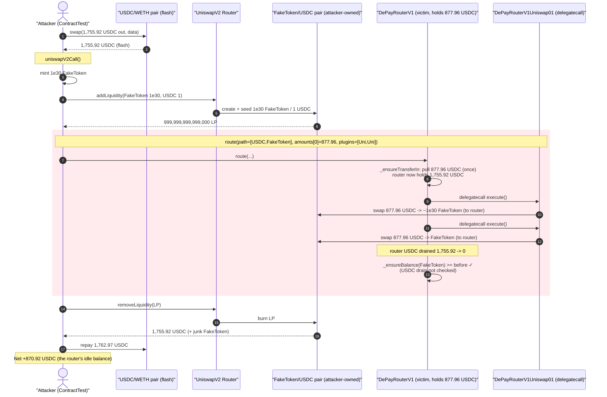
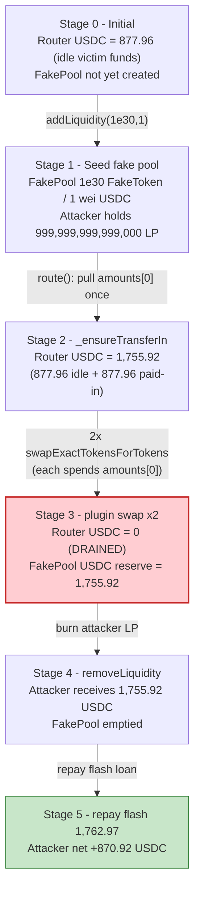
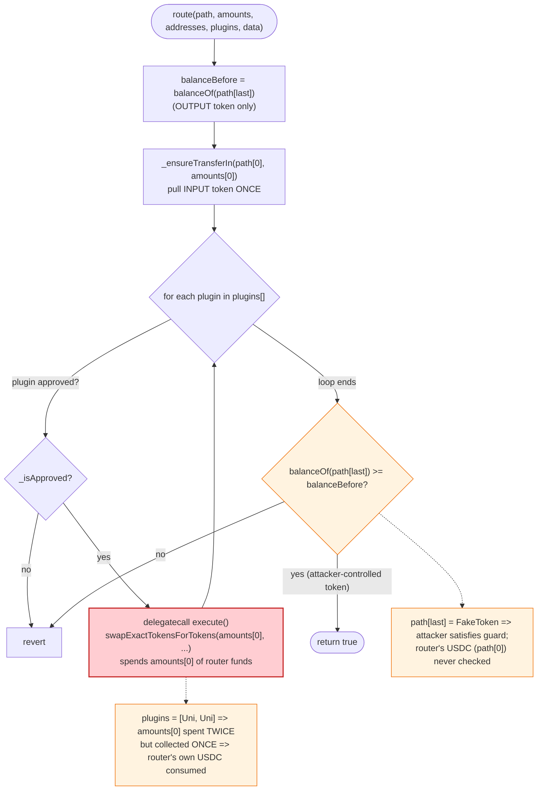

# DePayRouterV1 Exploit — Output-Only Balance Check + Repeated Plugin Execution Drains Router Funds

> **Reproduction:** the PoC compiles & runs in an isolated Foundry project at
> [this project folder](.) (the umbrella DeFiHackLabs repo contains many unrelated
> PoCs that do not whole-compile, so this one was extracted).
> Full verbose trace: [output.txt](output.txt).
> Verified vulnerable sources: [DePayRouterV1.sol](sources/DePayRouterV1_ae60aC/DePayRouterV1.sol)
> and the swap plugin [DePayRouterV1Uniswap01.sol](sources/DePayRouterV1Uniswap01_e04b08/DePayRouterV1Uniswap01.sol).

---

## Key info

| | |
|---|---|
| **Loss** | **~870.92 USDC** (870,917,088 6-dec units) drained from the DePayRouterV1 contract in this tx; the campaign across all victim tokens totalled ~$827–$2.3K |
| **Vulnerable contract** | `DePayRouterV1` — [`0xae60aC8e69414C2Dc362D0e6a03af643d1D85b92`](https://etherscan.io/address/0xae60ac8e69414c2dc362d0e6a03af643d1d85b92#code) |
| **Vulnerable plugin** | `DePayRouterV1Uniswap01` — [`0xe04b08Dfc6CaA0F4Ec523a3Ae283Ece7efE00019`](https://etherscan.io/address/0xe04b08Dfc6CaA0F4Ec523a3Ae283Ece7efE00019#code) |
| **Victim funds** | USDC sitting idle in the router (`0x46662b86…` slot = 877,961,918 = 877.96 USDC pre-existing balance) |
| **Flash-loan source** | Uniswap V2 USDC/WETH pair — `0xB4e16d0168e52d35CaCD2c6185b44281Ec28C9Dc` |
| **Attacker EOA** | [`0x7f284235aef122215c46656163f39212ffa77ed9`](https://etherscan.io/address/0x7f284235aef122215c46656163f39212ffa77ed9) |
| **Attacker contract** | [`0xba2aa7426ec6529c25a38679478645b2db5fa19b`](https://etherscan.io/address/0xba2aa7426ec6529c25a38679478645b2db5fa19b) |
| **Attack tx** | [`0x9a036058afb58169bfa91a826f5fcf4c0a376e650960669361d61bef99205f35`](https://etherscan.io/tx/0x9a036058afb58169bfa91a826f5fcf4c0a376e650960669361d61bef99205f35) |
| **Chain / block / date** | Ethereum mainnet / fork at 18,281,129 (tx in 18,281,130) / Oct 4, 2023 |
| **Compiler** | Solidity `>=0.7.5 <0.8.0` (router + plugin), `abicoder v2` |
| **Bug class** | Broken accounting invariant — balance check guards the *output* token only, while the plugin list is executed an arbitrary number of times against funds already held by the router |

---

## TL;DR

`DePayRouterV1.route()` is a generic "swap-and-pay" router. It pulls in the input token
**once**, runs a caller-supplied **list of plugins**, then checks only that the balance of the
**last token in the path did not go down**
([DePayRouterV1.sol:759-763](sources/DePayRouterV1_ae60aC/DePayRouterV1.sol#L759-L763)).

Three composable design flaws turn that into a free drain of any token the router happens to be
holding:

1. **The post-condition check only protects `path[last]` (the output token), not `path[0]`
   (the input token) or any token the router custodies.** A swap that *consumes* the router's
   own USDC passes the check as long as the (attacker-controlled) output token balance does not
   decrease.
2. **`plugins` is a caller-supplied array that `_execute()` loops over with no de-duplication and
   no per-plugin accounting** ([:791-808](sources/DePayRouterV1_ae60aC/DePayRouterV1.sol#L791-L808)).
   Passing the same Uniswap swap plugin **twice** performs **two** `swapExactTokensForTokens(amounts[0], …)`
   calls, each spending `amounts[0]` of the input token — but `_ensureTransferIn()` only collected
   `amounts[0]` **once**. The second swap is funded entirely by USDC that was already sitting in the
   router.
3. **The output token and its liquidity pool are 100% attacker-controlled.** The attacker mints a
   fake ERC-20, seeds a `FakeToken/USDC` Uniswap pair with `1e30 : 1` reserves, and routes
   `USDC → FakeToken` through it. Because the fake side is a near-infinite reserve and the USDC side
   is 1 wei, every swap dumps the router's USDC into a pool the attacker fully owns — then
   `removeLiquidity()` hands it all back.

Net: the attacker recovers the router's idle **877.96 USDC**, paying only a Uniswap flash-loan fee
of ~7.04 USDC, for **+870.92 USDC** profit in a single atomic transaction.

---

## Background — what `route()` is supposed to do

DePay is a crypto-payments protocol. `DePayRouterV1.route()` lets a payer hand over `tokenIn`,
have it swapped on a DEX, and forward `tokenOut` to a merchant — all in one call, via a pluggable
processor pipeline:

```solidity
function route(
  address[] calldata path,     // e.g. [USDC, DAI]
  uint[]    calldata amounts,  // e.g. [amountIn, amountOut, deadline]
  address[] calldata addresses,// e.g. [receiver]
  address[] calldata plugins,  // ordered plugin list, e.g. [Uniswap, Payment]
  string[]  calldata data
) external payable returns(bool) {
  uint balanceBefore = _balanceBefore(path[path.length-1]); // ← snapshot OUTPUT token only
  _ensureTransferIn(path[0], amounts[0]);                   // ← pull INPUT token ONCE
  _execute(path, amounts, addresses, plugins, data);        // ← run EVERY plugin in the list
  _ensureBalance(path[path.length-1], balanceBefore);       // ← OUTPUT token must not decrease
  return true;
}
```
[DePayRouterV1.sol:743-764](sources/DePayRouterV1_ae60aC/DePayRouterV1.sol#L743-L764)

The only swap plugin involved here is `DePayRouterV1Uniswap01`, executed by `delegatecall`
(it declares `delegate = true`). For a non-ETH path it simply calls:

```solidity
IUniswapV2Router02(UniswapV2Router02).swapExactTokensForTokens(
  amounts[0],   // input amount  ← re-read on every plugin execution
  amounts[1],   // amountOutMin (= 0 here)
  uniPath,      // path
  address(this),// recipient = the router (because of delegatecall)
  amounts[2]    // deadline
);
```
[DePayRouterV1Uniswap01.sol:521-529](sources/DePayRouterV1Uniswap01_e04b08/DePayRouterV1Uniswap01.sol#L521-L529)

Because the plugin runs under `delegatecall`, `address(this)` is the **router**, so the swapped-out
tokens land in the router and the swapped-in tokens are pulled from the router's balance.

---

## The vulnerable code

### 1. Input token is collected once, but plugins run as many times as the caller asks

```solidity
function _ensureTransferIn(address tokenIn, uint amountIn) private {
  if(tokenIn == ETH) {
    require(msg.value >= amountIn, 'DePay: Insufficient ETH amount payed in!');
  } else {
    Helper.safeTransferFrom(tokenIn, msg.sender, address(this), amountIn);  // ← ONE pull of amounts[0]
  }
}

function _execute(...) internal {
  for (uint i = 0; i < plugins.length; i++) {            // ← unbounded, no de-dup
    require(_isApproved(plugins[i]), 'DePay: Plugin not approved!');
    IDePayRouterV1Plugin plugin = IDePayRouterV1Plugin(configuration.approvedPlugins(plugins[i]));
    if(plugin.delegate()) {
      (bool success, bytes memory returnData) = address(plugin).delegatecall(abi.encodeWithSelector(
        plugin.execute.selector, path, amounts, addresses, data));   // ← each call re-spends amounts[0]
      require(success, string(returnData));
    } else { ... }
  }
}
```
[DePayRouterV1.sol:775-808](sources/DePayRouterV1_ae60aC/DePayRouterV1.sol#L775-L808)

Nothing prevents `plugins = [SwapPlugin, SwapPlugin]`. Each iteration calls
`swapExactTokensForTokens(amounts[0], …)` and spends `amounts[0]` of the *router's* USDC. With
`amounts[0] = 877,961,918` collected once, two iterations spend `2 × 877,961,918`. The extra
`877,961,918` comes from USDC already custodied by the router.

### 2. The post-condition only protects the output token

```solidity
function _ensureBalance(address tokenOut, uint balanceBefore) private view {
  require(_balance(tokenOut) >= balanceBefore, 'DePay: Insufficient balance after payment!');
}
```
[DePayRouterV1.sol:810-814](sources/DePayRouterV1_ae60aC/DePayRouterV1.sol#L810-L814)

`tokenOut` is always `path[path.length-1]`. The attacker sets it to a **fake token they minted**,
so the swaps *increase* the router's fake-token balance and the check passes trivially. The router's
**USDC** balance is never compared — it can be drained to zero and `route()` still returns `true`.
The comment above the function — *"Prevents draining of the contract"* — describes an invariant the
code only enforces for one of the path's two tokens.

### 3. The plugin recipient is the router, and the output pool is attacker-owned

Under `delegatecall`, the plugin's `swapExactTokensForTokens(..., address(this), ...)` deposits
output to and pulls input from the **router**. The attacker chooses the swap pool: a freshly created
`FakeToken/USDC` Uniswap V2 pair seeded `1e30 FakeToken : 1 wei USDC`, so swapping ~878 USDC in
returns ~`1e30` fake tokens — a worthless output the attacker discards, used only to satisfy the
output-balance check while sweeping the USDC the router will pay in.

---

## Root cause

> The router enforces *"the OUTPUT token balance must not decrease"* but never enforces *"no other
> token I custody may decrease"*, and it executes a caller-controlled, un-deduplicated plugin list
> that re-spends `amounts[0]` on every iteration while only collecting it once.

Concretely, the four decisions that compose into the drain:

1. **Output-only balance guard.** `_ensureBalance` checks `path[last]` only. Any token the router
   holds — including its own idle USDC, or `path[0]` — is unprotected. By making `path[last]` a
   token the attacker controls, the guard is neutered.
2. **Repeated plugin execution funded by router custody.** The `plugins` array is taken verbatim
   from the caller, looped with no uniqueness check, and each `execute()` re-reads `amounts[0]`.
   The input token is pulled in **once**; the second (and any further) swap consumes the router's
   pre-existing balance.
3. **`delegatecall` makes the router both the payer and the payee of every swap.** This is what lets
   a swap spend the *router's* funds rather than the caller's, while the proceeds also accrue to the
   router (where the attacker then reclaims them via the LP they own).
4. **Attacker-controlled output token + pool.** Both the output token and the AMM it swaps against
   are deployed and seeded by the attacker, so the "swap" is just a way to move the router's USDC
   into a pool the attacker can immediately `removeLiquidity()` from.

The published audit note the constructor links to (Audit3.md#H02) hardened the *configuration*
contract against delegatecall overlay attacks — but the *balance accounting* in `route()` was left
guarding only one side of the path.

---

## Preconditions

- **The router holds an idle balance of the input token.** Here the router custodied
  `877,961,918` USDC (slot `0x46662b86…` reads `0x3454a2be` before the attack) — leftover/dust from
  prior payments. The drain is exactly this balance; an empty router yields no profit.
- **At least one approved swap plugin exists.** `configuration.approvedPlugins(DePayUniV1)` returns
  the plugin address (trace lines 124-127), so `_isApproved` passes. The attacker reuses the
  *legitimate, already-approved* Uniswap plugin — no malicious plugin needs to be approved.
- **`amounts[1]` (amountOutMin) can be 0** so the worthless fake-token output is accepted.
- **Working capital in USDC** to fund the route input and the flash-loan repayment. It is fully
  recovered intra-transaction, hence flash-loanable — the PoC sources it from the Uniswap USDC/WETH
  pair via a flash swap.

---

## Attack walkthrough (with on-chain numbers from the trace)

All figures are taken directly from the events and storage diffs in [output.txt](output.txt).
The "FakeToken" is the attacker test contract itself (`ContractTest`, address `0x7FA9…1496`); its
`balanceOf/transfer` are the minimal ERC-20 at [DePayRouter_exp.sol:109-130](test/DePayRouter_exp.sol#L109-L130).

| # | Step | Trace ref | Effect |
|---|------|-----------|--------|
| 0 | **Flash swap**: `UNIV2.swap(1,755,923,836 USDC out)` on the real USDC/WETH pair, with callback data | [L42-L45](output.txt) | Attacker receives **1,755.92 USDC**; owes `amount·1001/997 = 1,762,968,665` back |
| 1 | **Mint fake supply**: `balances[this] = 1e30 + 1` | [L106-107](output.txt) | Attacker holds 1e30+1 FakeToken |
| 2 | **`addLiquidity(FakeToken 1e30, USDC 1)`** → new pair `0x366Eb…`; LP minted = 999,999,999,999,000 | [L52-L109](output.txt) | New pool **1e30 FakeToken / 1 USDC** (Sync L101) |
| 3 | **`route(path=[USDC,FakeToken], amounts[0]=877,961,918, plugins=[Uni,Uni])`** | [L112](output.txt) | Begins the drain |
| 3a | `_ensureTransferIn`: pull **877,961,918 USDC** attacker→router | [L117, L120](output.txt) | Router USDC: `0x3454a2be (877,961,918)` → `0x68a9457c (1,755,923,836)` — now holds the **pre-existing 877.96 + the new 877.96** |
| 3b | **Plugin exec #1**: `swapExactTokensForTokens(877,961,918 USDC → FakeToken)` | [L130-L165](output.txt) | Router→pair 877,961,918 USDC (L144 ↓ to `0x3454a2be`); out 999,999,998,857,571,148,165,247,322,258 (~1e30) FakeToken (Swap L160). Pool Sync: 1,142,428,851,834,752,677,742 FakeToken / 877,961,919 USDC (L159) |
| 3c | **Plugin exec #2**: `swapExactTokensForTokens(877,961,918 USDC → FakeToken)` AGAIN | [L172-L207](output.txt) | Router→pair another 877,961,918 USDC (L186: router USDC `0x3454a2be → 0`, **fully drained**); out 570,356,316,789,990,826,928 FakeToken (Swap L202). Pool Sync: 572,072,535,044,761,850,814 FakeToken / **1,755,923,837 USDC** (L201) |
| 3d | `_ensureBalance(FakeToken)`: router FakeToken `0 → 9.999e29` ≥ 0 ✓ | [L113, L208-210](output.txt) | Output check passes; **USDC drain ignored** |
| 4 | **`removeLiquidity(FakeToken/USDC, 999,999,999,999,000 LP)`** burn | [L216-L260](output.txt) | Burns LP, returns 572,072,535,044,189,778,278 FakeToken (discarded) + **1,755,923,836 USDC** to attacker (USDC Transfer L241) |
| 5 | **Repay flash loan**: transfer `1,762,968,665` USDC → USDC/WETH pair | [L263, L279](output.txt) | Closes the flash swap (`amount·1001/997`) |
| 6 | **Profit** | [L287-L293](output.txt) | Attacker USDC balance = **870,917,088** = **870.92 USDC** |

### Why the second swap is "free"

The router pulled in `877,961,918` USDC once (step 3a) but the two plugin executions pushed out
`2 × 877,961,918 = 1,755,923,836` USDC into the attacker's pool (steps 3b, 3c). The difference —
exactly the router's pre-existing `877,961,918` USDC — is the stolen value. The pool's USDC reserve
ends at `1,755,923,836` (step 3c, Sync L201), and `removeLiquidity` returns all of it to the
attacker (step 4, L241).

### Profit accounting (USDC, 6 decimals)

| Direction | Amount | Source |
|---|---:|---|
| In  — flash-borrowed | 1,755,923,836 | swap out, L45 |
| In  — recovered from own LP | 1,755,923,836 | removeLiquidity, L241 |
| Out — paid into `route()` | −877,961,918 | `_ensureTransferIn`, L117 |
| Out — flash-loan repayment | −1,762,968,665 | repay, L263 |
| **Net** | **+870,917,089** | matches reported **870,917,088** (1-wei rounding) |

Equivalently: **profit ≈ router's drained USDC (877,961,918) − flash fee (7,044,829) ≈ 870.92 USDC.**

---

## Diagrams

### Sequence of the attack



### Pool / router USDC state evolution



### The flaw inside `route()` / `_execute()`



---

## Remediation

1. **Check ALL custodied balances, not just the output token.** Snapshot and assert non-decrease for
   every token the router holds across `route()` — at minimum `path[0]` (the input token) and any
   token reachable by a plugin. The strongest form: forbid `route()` from ending with *less* of *any*
   token than it started with (after accounting for the legitimately-collected `amounts[0]`).
2. **De-duplicate / bound the plugin list, and collect input per-execution.** Either reject duplicate
   plugins, cap the list, or pull `amounts[0]` inside each plugin execution so a swap can never be
   funded by the router's pre-existing balance. The amount actually spent by plugins must be tied to
   the amount actually collected.
3. **Do not let the router be the payer of arbitrary swaps.** Because plugins run via `delegatecall`,
   `address(this)` is the router and swaps draw from its balance. Route swap inputs explicitly from
   `msg.sender`-provided funds tracked for *this* call, not from the router's standing balance.
4. **Never leave idle funds in the router.** The drained 877.96 USDC was leftover from prior payments.
   A payment router should hold no resting balances; sweep residuals to a treasury after each payment
   and treat any non-zero resting balance as an invariant violation.
5. **Constrain `path` ↔ output semantics.** Require `amounts[1]` (amountOutMin) to be a meaningful,
   caller-provided minimum and validate that the output token is the merchant's expected token, so a
   worthless attacker-minted token cannot stand in as `path[last]`.

---

## How to reproduce

The PoC was extracted into a standalone Foundry project (the umbrella DeFiHackLabs repo has many
unrelated PoCs that fail `forge test`'s whole-project build):

```bash
_shared/run_poc.sh 2023-10-DePayRouter_exp --mt testExploit -vvvvv
```

- RPC: an Ethereum **mainnet archive** endpoint is required (`vm.createSelectFork("mainnet", 18_281_130 - 1)`).
  Configure the `mainnet` RPC alias in `foundry.toml` / env to an archive node serving historical
  state at block 18,281,129.
- Result: `[PASS] testExploit()` with `Attack Exploit: 870.917088 USDC`.

Expected tail:

```
Ran 1 test for test/DePayRouter_exp.sol:ContractTest
[PASS] testExploit() (gas: 2987325)
Logs:
  Before Start: 0 USDC
  Attack Exploit: 870.917088 USDC

Suite result: ok. 1 passed; 0 failed; 0 skipped
```

---

*References: DeFiHackLabs PoC (`src/test/2023-10/DePayRouter_exp.sol`); CertiK Alert —
https://twitter.com/CertiKAlert/status/1709764146324009268 ; SlowMist Hacked — https://hacked.slowmist.io/ (DePay, Ethereum).*
