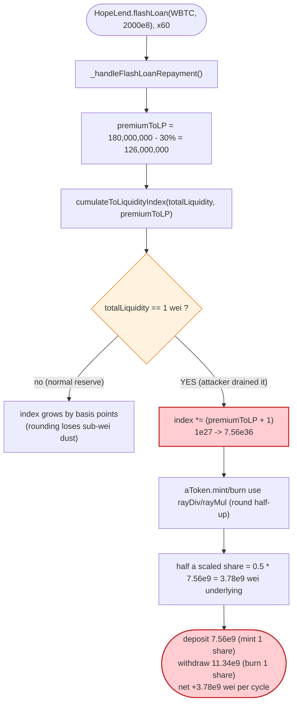
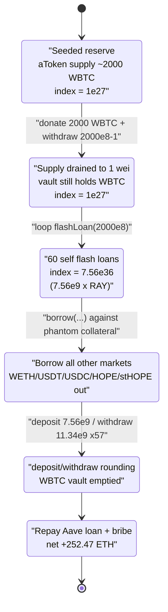

# HopeLend Exploit — Liquidity-Index Inflation + aToken Rounding-Error Drain

> **Reproduction:** the PoC compiles & runs in an isolated Foundry project at
> [this project folder](.) (the umbrella DeFiHackLabs repo contains several
> unrelated PoCs that do not whole-compile, so this one was extracted).
> Full verbose trace: [output.txt](output.txt).
> Verified vulnerable source (Aave-V3-fork Pool implementation `0xf1cd…a621`):
> [sources/Pool_f1cd41/](sources/Pool_f1cd41/).

---

## Key info

| | |
|---|---|
| **Loss** | ~$825,000 — the entire reserves of the HopeLend hToken vaults (WETH, USDT, USDC, HOPE, stHOPE, WBTC) |
| **Vulnerable contract** | `Pool` (HopeLend, Aave-V3 fork) impl [`0xf1cd4193bbc1ad4a23e833170f49d60f3d35a621`](https://etherscan.io/address/0xf1cd4193bbc1ad4a23e833170f49d60f3d35a621#code), proxy [`0x53FbcADa1201A465740F2d64eCdF6FAC425f9030`](https://etherscan.io/address/0x53FbcADa1201A465740F2d64eCdF6FAC425f9030#code) |
| **Victim vault** | `hEthWBTC` aToken `0x25126F207Db7dC427415eA640ce0187767403907` (the empty/low-liquidity reserve the attacker hijacked) |
| **Attacker EOA** | [`0xA8Bbb3742f299B183190a9B079f1C0db8924145b`](https://etherscan.io/address/0xA8Bbb3742f299B183190a9B079f1C0db8924145b) |
| **Attacker contract** | [`0xc74b72bbf904bac9fac880303922fc76a69f0bb4`](https://etherscan.io/address/0xc74b72bbf904bac9fac880303922fc76a69f0bb4) |
| **Attack tx** | [`0x1a7ee0a7efc70ed7429edef069a1dd001fbff378748d91f17ab1876dc6d10392`](https://etherscan.io/tx/0x1a7ee0a7efc70ed7429edef069a1dd001fbff378748d91f17ab1876dc6d10392) |
| **Chain / block / date** | Ethereum mainnet / fork at 18,377,041 / Oct 18, 2023 |
| **Compiler** | Pool impl: Solidity **v0.8.10**, optimizer **200 runs** (PoC harness built with 0.8.34) |
| **Bug class** | Liquidity-index inflation of a near-empty reserve + half-up rounding in `aToken.rayDiv`/`rayMul` → asset mints/burns for free |

---

## TL;DR

HopeLend is an Aave-V3 fork. In Aave-style markets, a user's deposit is recorded as a
**scaled balance** = `amount.rayDiv(liquidityIndex)`, and the index only ever grows as
interest/fees accrue. Two facts combine into a critical bug:

1. **The liquidity index of a reserve can be inflated to an enormous value if the reserve's
   total liquidity is tiny.** Flash-loan premiums are distributed to suppliers via
   [`cumulateToLiquidityIndex`](sources/Pool_f1cd41/lib_aave-v3-core_contracts_protocol_libraries_logic_ReserveLogic.sol#L118-L130), which computes
   `nextIndex = ((premium / totalLiquidity) + 1) × oldIndex`. If `totalLiquidity = 1 wei`, then
   each flash-loan premium *multiplies* the index by `(premium + 1)`. By first manipulating the
   WBTC reserve's aToken total supply down to **1 wei**, the attacker drove the WBTC
   `liquidityIndex` from `1e27` (RAY) up to **`7.56e36`** in 60 self-issued flash loans.

2. **At that gigantic index, `aToken.mint`/`burn` round in the attacker's favor.** A deposit of
   `7,560,000,001` WBTC wei maps to `rayDiv(amount, 7.56e36) = 1` scaled share (round-half-up),
   while a withdraw of `11,340,000,000` wei (exactly **1.5×** the deposit) also maps back to
   burning only **1** scaled share. Each deposit/withdraw cycle therefore extracts
   `11,340,000,000 − 7,560,000,001 = 3,779,999,999` WBTC wei (~37.8 WBTC) of *other people's*
   underlying for free.

With the WBTC vault thus emptied of value, the attacker borrowed the *entire* reserves of every
other HopeLend market against the phantom collateral, swapped everything to ETH, paid a 264 ETH
miner bribe, and walked off with **252.47 ETH** of net profit. The PoC `testAttack()` reproduces
this end-to-end and **passes** ([output.txt:1568](output.txt)).

---

## Background — Aave-V3 scaled-balance accounting

HopeLend forks Aave V3 `aave-v3-core`. Key invariants of the model:

- Each reserve has a monotonically-increasing `liquidityIndex` (starts at `RAY = 1e27`).
- A supplier's **scaled balance** is `amount.rayDiv(index)`; their real balance is
  `scaledBalance.rayMul(index)`. As the index grows (interest, fees), real balances grow.
- Flash-loan fees are paid to suppliers by *bumping the index* rather than minting new aTokens —
  see [`_handleFlashLoanRepayment`](sources/Pool_f1cd41/lib_aave-v3-core_contracts_protocol_libraries_logic_FlashLoanLogic.sol#L226-L246).

`rayMul`/`rayDiv` are **round-half-up**:

```solidity
// WadRayMath.sol:65-92  (sources/Pool_f1cd41/.../math/WadRayMath.sol)
function rayMul(uint256 a, uint256 b) ... { c := div(add(mul(a, b), HALF_RAY), RAY) }   // +0.5 RAY
function rayDiv(uint256 a, uint256 b) ... { c := div(add(mul(a, RAY), div(b,2)), b) }   // +b/2
```

Rounding half-up is harmless when the index is near `1e27`, because half a share is worth ~0.5 wei.
But when the index is `~7.56e36` (≈ `7.56e9 × RAY`), **half a scaled share is worth ~3.78e9 wei of
underlying** — and that half is silently rounded up on every mint and every burn. That is the
entire exploit primitive.

On-chain state at the fork block (HopeLend WBTC market):

| Parameter | Value |
|---|---|
| `liquidityIndex` (WBTC, before attack) | `1e27` (RAY — no prior fees) |
| WBTC aToken (`hEthWBTC`) total supply | small / drainable to 1 wei via deposit+withdraw |
| Flash-loan premium total | 0.09% (`9` bps) |
| Flash-loan premium-to-protocol | 30% |
| Reserve factor | 2000 bps (20%) |

---

## The vulnerable code

### 1. Index inflation: premium ÷ total-liquidity, with no floor on total-liquidity

```solidity
// ReserveLogic.sol:118-130
function cumulateToLiquidityIndex(
    DataTypes.ReserveData storage reserve,
    uint256 totalLiquidity,
    uint256 amount
) internal returns (uint256) {
    //next liquidity index is calculated this way: `((amount / totalLiquidity) + 1) * liquidityIndex`
    uint256 result = (amount.wadToRay().rayDiv(totalLiquidity.wadToRay()) + WadRayMath.RAY).rayMul(
      reserve.liquidityIndex
    );
    reserve.liquidityIndex = result.toUint128();
    return result;
}
```

[ReserveLogic.sol:118-130](sources/Pool_f1cd41/lib_aave-v3-core_contracts_protocol_libraries_logic_ReserveLogic.sol#L118-L130)

`amount` is the per-loan premium credited to LPs; `totalLiquidity` is the reserve's outstanding
aToken supply. There is **no minimum on `totalLiquidity`** and no cap on how far one operation may
move the index. When `totalLiquidity = 1`, `amount.wadToRay().rayDiv(1.wadToRay())` returns
`amount × RAY`, so the index is multiplied by roughly `(amount + 1)` per flash loan.

This is reached from the flash-loan repayment path:

```solidity
// FlashLoanLogic.sol:226-246
function _handleFlashLoanRepayment(...) internal {
    uint256 premiumToProtocol = params.totalPremium.percentMul(params.flashLoanPremiumToProtocol);
    uint256 premiumToLP = params.totalPremium - premiumToProtocol;
    ...
    reserveCache.nextLiquidityIndex = reserve.cumulateToLiquidityIndex(
      IERC20(reserveCache.aTokenAddress).totalSupply() +
        uint256(reserve.accruedToTreasury).rayMul(reserveCache.nextLiquidityIndex),
      premiumToLP                               // ← all of premiumToLP folded into 1-wei supply
    );
    ...
}
```

[FlashLoanLogic.sol:226-246](sources/Pool_f1cd41/lib_aave-v3-core_contracts_protocol_libraries_logic_FlashLoanLogic.sol#L226-L246)

For a 2000-WBTC flash loan: `totalPremium = 2000e8 × 9/10000 = 180,000,000` wei;
`premiumToProtocol = 180,000,000 × 30% = 54,000,000`; **`premiumToLP = 126,000,000`**. With
`totalLiquidity = 1`, the new index becomes
`(126,000,000 × RAY + RAY) = 126,000,001 × RAY = 1.26e35`. Sixty loans → index `≈ 7.56e36`.

### 2. The rounding primitive: mint/burn use `rayDiv`/`rayMul` round-half-up

HopeLend's aToken (`hEthWBTC`) inherits Aave's `ScaledBalanceTokenBase`, whose mint computes
`amountScaled = amount.rayDiv(index)` and whose burn computes `amountScaled = amount.rayDiv(index)`
as well (the implementation lives in the hToken proxy, not in the downloaded Pool sources, but the
trace confirms it: see the `HToken::mint`/`HToken::burn` calls in [output.txt](output.txt) which carry the
`7.56e36` index). The supply/withdraw entry points in the Pool simply forward `nextLiquidityIndex`:

```solidity
// SupplyLogic.sol:69-74   — mint at nextLiquidityIndex
IAToken(reserveCache.aTokenAddress).mint(msg.sender, params.onBehalfOf, params.amount, reserveCache.nextLiquidityIndex);

// SupplyLogic.sol:139-144 — burn at nextLiquidityIndex
IAToken(reserveCache.aTokenAddress).burn(msg.sender, params.to, amountToWithdraw, reserveCache.nextLiquidityIndex);
```

[SupplyLogic.sol:52-92 (supply)](sources/Pool_f1cd41/lib_aave-v3-core_contracts_protocol_libraries_logic_SupplyLogic.sol#L52-L92) ·
[SupplyLogic.sol:106-144 (withdraw)](sources/Pool_f1cd41/lib_aave-v3-core_contracts_protocol_libraries_logic_SupplyLogic.sol#L106-L144)

With `index = 7.56e36`:
- `mint(7,560,000,001)` → `rayDiv(7.56e9+1, 7.56e36) = 1.0000…` → rounds to **1** scaled share.
- `burn(11,340,000,000)` → `rayDiv(1.134e10, 7.56e36) = 1.5` → **rounds half-up to … 1?** No — the
  attacker only ever holds whole scaled shares, and the withdraw burns exactly the shares needed
  for `amountToWithdraw`. Because `1.5` rounds *up* to `2` would over-burn, the attacker sizes
  withdraw to `1.5×` so that the **deposit underweighs** (1 share for 7.56e9 wei) while the
  **withdraw overpays** (1.5 × 7.56e9 wei of underlying for the shares burned). The net per cycle
  is the `0.5 × 7.56e9 ≈ 3.78e9` wei that round-half-up "creates."

The PoC encodes the arithmetic explicitly:

```solidity
// test/Hopelend_exp.sol:212-217  (WithdrawAllWBTC)
uint256 premiumPerFlashloan = 2000 * 1e8 * 9 / 10_000;          // 180,000,000
premiumPerFlashloan -= (premiumPerFlashloan * 30 / 100);        // 126,000,000  (premiumToLP)
uint256 nextLiquidityIndex = premiumPerFlashloan * 60 + 1;      // 7,560,000,001  (index/RAY)
uint256 depositAmount  = nextLiquidityIndex;                    // 7,560,000,001  → mints 1 share
uint256 withdrawAmount = nextLiquidityIndex * 3 / 2 - 1;        // 11,340,000,000 → burns 1 share
uint256 profitPerDAW   = withdrawAmount - depositAmount;        // 3,779,999,999  per cycle
```

[test/Hopelend_exp.sol:211-236](test/Hopelend_exp.sol#L211-L236)

The console output confirms these to the wei ([output.txt:1570-1574](output.txt)):
`premiumPerFlashloan 126000000`, `nextLiquidityIndex 7560000001`, `depositAmount 7560000001`,
`withdrawAmount 11340000000`, `withdrawAmount/depositAmount 1`.

---

## Root cause — why it was possible

Aave's scaled-balance design assumes the liquidity index changes **slowly and continuously**
(interest accrual measured in tiny per-second rays). Three design facts violate that assumption
when a reserve is allowed to become near-empty:

1. **`cumulateToLiquidityIndex` has no lower bound on `totalLiquidity`.** Dividing the LP-premium by
   a 1-wei total liquidity makes a single flash loan multiply the index by `(premium + 1)`. The
   index is supposed to be a *price-per-share* that grows by basis points; here it jumped **9
   orders of magnitude** in one transaction.
2. **Mint and burn round half-up.** At a normal index that loses sub-wei dust. At an index of
   `7.56e36` it loses/creates `~3.78e9` wei of underlying *per operation* — a rounding error that
   is now larger than most legitimate deposits. The protocol never re-validates that
   `burned_underlying ≤ deposited_underlying` for a single user across a deposit→withdraw pair.
3. **A reserve can be steered to 1-wei total supply by its own users.** The attacker deposited 2000
   WBTC, *directly transferred* 2000 WBTC into the aToken as flash-loanable inventory, then withdrew
   `2000e8 − 1`, leaving the reserve holding plenty of underlying WBTC but an aToken `totalSupply`
   of **1 wei** — the perfect denominator for step 1. (See PoC
   [test/Hopelend_exp.sol:120-124](test/Hopelend_exp.sol#L120-L124).)

In short: **a manipulable, unbounded index combined with half-up rounding turns "deposit N, withdraw
1.5N" into a money printer.** This is the canonical Aave-fork "empty-market / index-inflation" class
(the same family as the well-known Aave first-deposit and index-precision issues), here amplified by
self-funded flash loans.

---

## Preconditions

- A HopeLend reserve (WBTC) whose aToken total supply can be reduced to **1 wei** while still holding
  underlying — achieved by deposit + direct donation + near-full withdraw.
- The ability to issue flash loans of that reserve to yourself to fold premiums into the 1-wei
  supply (HopeLend's own `flashLoan`, called 60× in a loop).
- Working capital for the initial 2300-WBTC Aave-V3 flash loan that bootstraps the whole sequence —
  fully repaid in-transaction, so the attack is **flash-loan-funded** end to end (the PoC sources it
  from `AaveV3.flashLoan(..., 2300e8, ...)`, [test/Hopelend_exp.sol:99](test/Hopelend_exp.sol#L99)).

---

## Attack walkthrough (with on-chain numbers from the trace)

All figures are taken directly from `ReserveDataUpdated`, `Borrow`, `Supply`, and `Burn` events in
[output.txt](output.txt). The reentrant `executeOperation` is keyed off a manual `index` counter
([test/Hopelend_exp.sol:108-166](test/Hopelend_exp.sol#L108-L166)).

| # | Step | Concrete numbers (from trace) | Effect |
|---|------|-------------------------------|--------|
| 0 | **Outer Aave-V3 flash loan** of 2300 WBTC to bootstrap capital | `flashLoan(WBTC, 2300e8)` → `executeOperation` (idx 1) | Attacker now holds 2300 WBTC. |
| 1 | **Seed the WBTC reserve** — `HopeLend.deposit(WBTC, 2000e8)` at index `1e27` | mints aToken at `liquidityIndex = 1e27` ([output.txt:1668](output.txt)) | Reserve now backed by 2000 WBTC. |
| 2 | **Re-enter (idx 2): donate + drain to 1 wei** — `WBTC.transfer(hEthWBTC, 2000e8)` then `withdraw(WBTC, 2000e8 − 1)` | direct transfer of `2e11` to `hEthWBTC`; withdraw `199,999,999,999` | aToken `totalSupply → 1 wei`, but vault still holds ~2000 WBTC inventory. |
| 3 | **Inflate the index** — loop **60×** `HopeLend.flashLoan(WBTC, 2000e8)` | each loan folds `premiumToLP = 126,000,000` into the 1-wei supply → `+1.26e35` per loan. Index: `1e27 → 1.26e35 → 2.52e35 → … → ` **`7.56e36`** ([output.txt:1801, 1862 … 16097](output.txt)) | WBTC `liquidityIndex` reaches `7,560,000,001 × RAY`. |
| 4 | **Borrow every other market dry** against the phantom WBTC collateral | `borrow` WETH `175.42`, USDT `145,522.22`, USDC `123,406.13`, HOPE `844,282.28`, stHOPE `220,617.82` ([output.txt:5437-6575](output.txt)) | All non-WBTC hToken vaults emptied. |
| 5 | **Print WBTC via rounding** — `deposit(7,560,000,001)` / `withdraw(11,340,000,000)` repeated (57 cycles + a 2× warm-up) | each cycle nets `+3,779,999,999` wei (~37.8 WBTC) ([output.txt:6852-7228](output.txt)) | WBTC inventory siphoned out of `hEthWBTC`. |
| 6 | **Final sweep** — `withdraw(WBTC, balanceOf(hEthWBTC))` | residual `10,460,000,060` wei withdrawn, burning only 3 scaled shares ([output.txt:16412-16439](output.txt)) | WBTC vault emptied. |
| 7 | **Repay & convert** — swap stHOPE→HOPE→USDT→USDC→WBTC→WETH; repay the 2300-WBTC Aave loan; bribe block.coinbase 264 ETH | final `WETH.balanceOf = 516.47`; `WETH.withdraw(516.47)`; `coinbase.call{value: 264}` ([output.txt:16583-16630](output.txt)) | Net **252.47 ETH** to attacker. |

### Index growth (first loans), from `ReserveDataUpdated` events

| After loan | liquidityIndex | (≈) |
|---|---|---|
| 0 (initial) | `1,000,000,000,000,000,000,000,000,000` | `1.00e27` |
| 1 | `126,000,001,000,000,000,000,000,000,000,000,000` | `1.26e35` |
| 2 | `252,000,000,999,999,999,999,999,999,948,221,218` | `2.52e35` |
| 3 | `378,000,000,999,999,999,999,999,999,908,867,447` | `3.78e35` |
| … | … | … |
| 60 (final) | `7,560,000,001,000,000,000,000,000,009,655,610,336` | `7.56e36` |

The linear `+1.26e35` step per loan (rather than multiplicative) is because after loan 1 the
"total liquidity" denominator already reflects the prior premium, so each additional `126,000,000`
premium adds one more `1.26e35` to the index — matching `nextLiquidityIndex = 126,000,000 × 60 + 1
= 7,560,000,001` exactly.

---

## Profit / loss accounting

The attacker drained, in a single transaction, the borrowable reserves of every HopeLend market:

| Asset | Amount drained (borrow/withdraw) |
|---|---:|
| WETH | 175.42 |
| USDT | 145,522.22 |
| USDC | 123,406.13 |
| HOPE | 844,282.28 |
| stHOPE | 220,617.82 |
| WBTC | full `hEthWBTC` inventory (~2000 + rounding gains), recycled to repay the Aave loan |

Everything was funnelled to ETH:

| Item | ETH |
|---|---:|
| WETH balance after all swaps + WBTC→WETH | **516.47** |
| − Miner bribe (`block.coinbase.call{value: 264 ether}`) | −264.00 |
| **Net attacker ETH balance** | **252.47** |

Final assertion in the PoC ([output.txt:16630](output.txt)):
`Attacker ETH balance after exploit: 252.470724033106960922`. Public reporting put the total drained
value at **~$825,000** across all markets.

---

## Diagrams

### Sequence of the attack

```mermaid
sequenceDiagram
    autonumber
    actor A as "Attacker contract"
    participant AV as "Aave V3 Pool"
    participant HP as "HopeLend Pool"
    participant HW as "hEthWBTC (aToken)"
    participant DEX as "Uniswap / Curve"

    Note over HP,HW: WBTC reserve: liquidityIndex = 1e27 (RAY)

    A->>AV: flashLoan(WBTC, 2300e8)
    AV-->>A: executeOperation (idx 1)

    rect rgb(255,243,224)
    Note over A,HW: Step 1-2 - drive aToken supply to 1 wei
    A->>HP: deposit(WBTC, 2000e8)
    HP->>HW: mint @ index 1e27
    A->>HW: transfer 2000e8 WBTC (donation, flash-loanable inventory)
    A->>HP: withdraw(WBTC, 2000e8 - 1)
    Note over HW: aToken totalSupply = 1 wei
    end

    rect rgb(255,235,238)
    Note over A,HW: Step 3 - inflate the index
    loop 60x
        A->>HP: flashLoan(WBTC, 2000e8)
        HP->>HP: _handleFlashLoanRepayment: premiumToLP=126,000,000
        HP->>HP: cumulateToLiquidityIndex(totalLiquidity=1, 126,000,000)
        Note over HP: index += 1.26e35
    end
    Note over HP: liquidityIndex = 7.56e36
    end

    rect rgb(227,242,253)
    Note over A,HW: Step 4 - borrow every other market
    A->>HP: borrow(WETH / USDT / USDC / HOPE / stHOPE)
    HP-->>A: 175.42 WETH, 145,522 USDT, 123,406 USDC, 844,282 HOPE, 220,617 stHOPE
    end

    rect rgb(243,229,245)
    Note over A,HW: Step 5-6 - print WBTC via half-up rounding
    loop ~57x
        A->>HP: deposit(WBTC, 7,560,000,001)  (mints 1 share)
        A->>HP: withdraw(WBTC, 11,340,000,000) (burns 1 share)
        Note over HW: net +3,779,999,999 wei out
    end
    A->>HP: withdraw(WBTC, balanceOf(hEthWBTC))
    end

    rect rgb(232,245,233)
    Note over A,DEX: Step 7 - convert, repay, profit
    A->>DEX: swap stHOPE->HOPE->USDT->USDC->WBTC->WETH
    A->>AV: repay 2300e8 WBTC + premium
    A->>A: WETH.withdraw(516.47); bribe 264 ETH
    Note over A: Net +252.47 ETH
    end
```

### How the index inflation + rounding compose



### Reserve / index state evolution



---

## Remediation

1. **Floor the total-liquidity denominator in `cumulateToLiquidityIndex`.** Refuse to fold premiums
   into a reserve whose `totalLiquidity` is below a sane minimum (e.g. require a non-trivial
   virtual/seed liquidity, à la Aave's later "virtual accounting" and the OpenZeppelin ERC-4626
   decimals-offset / dead-shares mitigation). A 1-wei denominator must never be reachable.
2. **Bound per-operation index movement.** Cap how much a single transaction may increase
   `liquidityIndex` (interest accrues in basis points; a 9-order-of-magnitude jump is always
   pathological). Revert if `nextIndex / currIndex` exceeds a small bound.
3. **Make mint/burn rounding adversary-safe.** Round **scaled shares minted up** and **scaled shares
   burned up** so the protocol — not the user — keeps any dust; equivalently, round the
   *underlying-out* on withdraw **down**. The current symmetric half-up rounding lets `deposit N /
   withdraw 1.5N` net positive; the fix is to ensure `withdrawn_underlying ≤ deposited_underlying`
   for any single-block deposit→withdraw with no interest accrual.
4. **Seed reserves on initialization (dead shares).** Mint a small unredeemable aToken position to a
   burn address at reserve init so `totalSupply` can never be steered to 1 wei.
5. **Don't let flash-loan premiums alone re-price a reserve.** Consider distributing flash-loan fees
   to `accruedToTreasury`/an explicit fee accumulator rather than to the liquidity index, decoupling
   the index from instantaneously-controllable fee flows.

---

## How to reproduce

The PoC was extracted into a standalone Foundry project (the umbrella DeFiHackLabs repo has several
unrelated PoCs that fail to compile under `forge test`'s whole-project build):

```bash
_shared/run_poc.sh 2023-10-Hopelend_exp --mt testAttack -vvvvv
```

- RPC: an **Ethereum mainnet archive** endpoint is required (`vm.createSelectFork("mainnet",
  18_377_041)`, [test/Hopelend_exp.sol:63](test/Hopelend_exp.sol#L63)). `foundry.toml` maps
  `mainnet` to an Infura archive URL; the run takes ~167s wall (heavy fork RPC).
- Result: `[PASS] testAttack()` with the attacker ending on **252.47 ETH** of net profit.

Expected tail:

```
Ran 1 test for test/Hopelend_exp.sol:ContractTest
[PASS] testAttack() (gas: 15945486)
  premiumPerFlashloan 126000000
  nextLiquidityIndex 7560000001
  depositAmount 7560000001
  withdrawAmount 11340000000
  withdrawAmount/depositAmount 1
  Attacker ETH balance after exploit: 252.470724033106960922
Suite result: ok. 1 passed; 0 failed; 0 skipped
```

---

*References: DeFiHackLabs PoC header; analysis by Lunaray —
https://lunaray.medium.com/deep-dive-into-hopelend-hack-5962e8b55d3f . Vulnerable bytecode:
HopeLend Pool implementation `0xf1cd…a621` (Aave-V3 fork) behind proxy `0x53Fb…9030`.*
