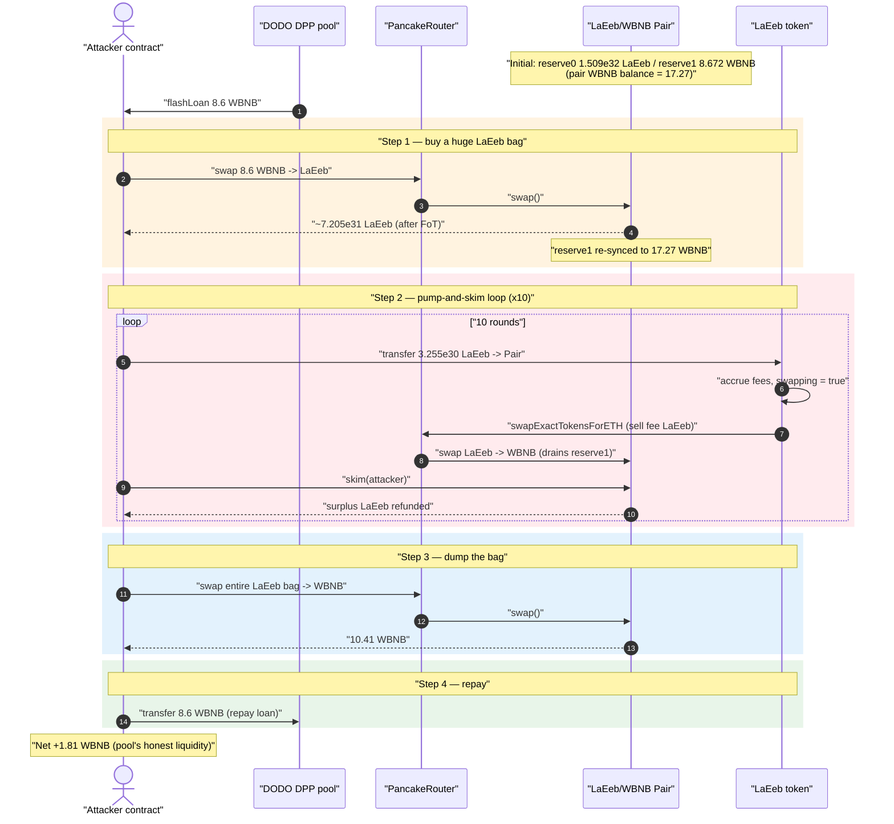
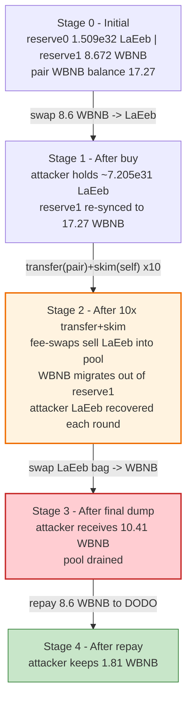
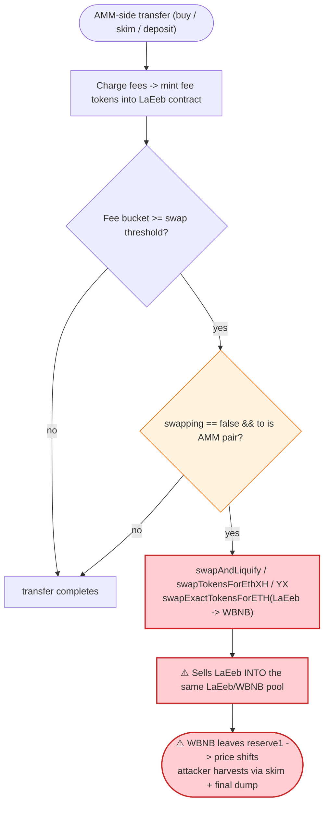

# LaEeb Exploit — Fee-on-Transfer + Auto-Liquify Pool Drain via `skim()` Recycling

> **Vulnerability classes:** vuln/logic/fee-calculation · vuln/defi/slippage · vuln/oracle/price-manipulation

> **Reproduction:** the PoC compiles & runs in an isolated Foundry project at
> [this project folder](.) (the umbrella DeFiHackLabs repo contains many unrelated
> PoCs that do not compile under a single `forge build`, so this one was extracted).
> Full verbose trace: [output.txt](output.txt).
> Verified vulnerable source: [LaEeb.sol](sources/LaEeb_a2B8A1/LaEeb.sol);
> victim AMM pair: [PancakePair.sol](sources/PancakePair_3921E8/PancakePair.sol).

---

## Key info

| | |
|---|---|
| **Loss** | **~1.81 WBNB** (≈ $370 at the time) drained from the LaEeb/WBNB PancakeSwap pair |
| **Vulnerable contract** | `LaEeb` — [`0xa2B8A15A07385EA933088c6bcBB38B84c1051a58`](https://bscscan.com/address/0xa2B8A15A07385EA933088c6bcBB38B84c1051a58#code) |
| **Victim pool** | LaEeb/WBNB PancakeSwap V2 pair — [`0x3921E8cb14e2C08DB989FDF88D01220a0C53cC91`](https://bscscan.com/address/0x3921E8cb14e2C08DB989FDF88D01220a0C53cC91) |
| **Attacker EOA** | [`0x7cb74265e3e2d2b707122bf45aea66137c6c8891`](https://bscscan.com/address/0x7cb74265e3e2d2b707122bf45aea66137c6c8891) |
| **Attacker contract** | [`0x9180981034364f683ea25bcce0cff5e03a595bef`](https://bscscan.com/address/0x9180981034364f683ea25bcce0cff5e03a595bef) |
| **Attack tx** | [`0x0d13a61e9dc81cfae324d3d80e49830d9bbae300f760e016a15600889a896a1b`](https://app.blocksec.com/explorer/tx/bsc/0x0d13a61e9dc81cfae324d3d80e49830d9bbae300f760e016a15600889a896a1b) |
| **Flash-loan source** | DODO DPP pool — `0x6098A5638d8D7e9Ed2f952d35B2b67c34EC6B476` (8.6 WBNB) |
| **Chain / block / date** | BSC / fork **33,053,187** / **2023-10-30** |
| **Compiler** | LaEeb: Solidity v0.8.7, optimizer 1 run; Pair: v0.5.16 |
| **Bug class** | Fee-on-transfer token that auto-sells its own fees **into its own AMM pair**, combined with the permissionless `skim()` primitive, breaking the AMM constant-product invariant |

---

## TL;DR

`LaEeb` is a "reflection / dividend" meme token whose `_transfer()` charges a multi-bucket
fee (marketing / liquidity / LP / dead / referral) on every AMM-side transfer, accumulates
those fees inside the token contract, and then **auto-swaps the accumulated fee tokens back
into BNB by selling them through the very same LaEeb/WBNB PancakeSwap pair**
([LaEeb.sol:1060-1086](sources/LaEeb_a2B8A1/LaEeb.sol#L1060-L1086), driven by
`swapAndLiquify` / `swapTokensForEthXH` / `swapTokensForEthYX`).

The attacker weaponizes this self-inflicted sell pressure with PancakeSwap's permissionless
`skim()` ([PancakePair.sol:483-488](sources/PancakePair_3921E8/PancakePair.sol#L483-L488)):

1. Flash-borrow 8.6 WBNB, buy a gigantic LaEeb position from the pool.
2. Repeatedly **transfer huge amounts of LaEeb back into the pair, then `skim()` the surplus
   right back out**. Each transfer is a fee-bearing AMM transfer, so it (a) mints fresh fee
   tokens into the LaEeb contract and (b) trips the `swapAndLiquify`/fee-swap path, which
   **dumps those fee tokens into the pool, siphoning WBNB out of the pool's reserve** and into
   the LaEeb contract. The attacker recovers their deposited LaEeb via `skim()` each round, so
   the loop is nearly free of inventory cost.
3. After 10 rounds the pool's effective LaEeb/WBNB price has been pushed in the attacker's
   favor; the attacker swaps their entire accumulated LaEeb bag back to WBNB, receiving
   **10.41 WBNB** out of a pool that only ever held ~17 WBNB.
4. Repay the 8.6 WBNB flash loan; keep the **1.81 WBNB** difference — the pool's genuine
   liquidity.

The root flaw is an AMM token that **routes its fee accounting through swaps against its own
liquidity pool**, so anyone who can force transfers (and `skim()` is free) can pump the
contract's auto-sell engine and harvest the resulting reserve movement.

---

## Background — what LaEeb does

`LaEeb` ([source](sources/LaEeb_a2B8A1/LaEeb.sol)) is a BEP-20 "SafeMoon-style" token with a
210 trillion supply and an elaborate fee/dividend system layered on top of a standard
OpenZeppelin ERC20:

- **Per-AMM-transfer fees.** When a transfer touches the PancakeSwap pair (a registered
  `automatedMarketMakerPairs`), `_transfer()` slices the amount into six fee buckets —
  marketing (`marketingFee = 100` bps), liquidity (`liquidityFee = 50`), LP (`lpFee = 100`),
  liquidity-dead (`liquidityDeadFee = 50`), referral (`commFee = 100`), plus a dead bucket —
  and moves those tokens into the token contract / referral chain
  ([LaEeb.sol:1091-1142](sources/LaEeb_a2B8A1/LaEeb.sol#L1091-L1142)).
- **Auto-liquify / auto-swap engine.** On any qualifying transfer where the contract has
  accumulated enough fee tokens, `_transfer()` flips the `swapping` guard and calls a battery
  of internal routines — `swapAndLiquify`, `swapTokensForEthXH`, `swapAndSendDividends`,
  `swapTokensForEthYX` — each of which **sells LaEeb back through the PancakeSwap router for
  BNB / CAKE** ([LaEeb.sol:1060-1086](sources/LaEeb_a2B8A1/LaEeb.sol#L1060-L1086);
  swap helpers at [:1161-1245](sources/LaEeb_a2B8A1/LaEeb.sol#L1161-L1245)).
- **Dividend tracker.** After every transfer it pokes an external `dividendTracker.process()`
  loop ([LaEeb.sol:1145-1157](sources/LaEeb_a2B8A1/LaEeb.sol#L1145-L1157)).

The victim AMM is a stock PancakeSwap V2 pair
([PancakePair.sol:304](sources/PancakePair_3921E8/PancakePair.sol#L304)). Two of its
low-level primitives are central here:

- **`skim(to)`** — sends `balanceOf(token) − reserve` of *each* token to `to`. It exists to
  rescue tokens accidentally sent to the pair, and it is **permissionless**
  ([PancakePair.sol:483-488](sources/PancakePair_3921E8/PancakePair.sol#L483-L488)).
- **`swap(...)`** — only this function enforces the `x·y ≥ k` invariant
  ([PancakePair.sol:452-480](sources/PancakePair_3921E8/PancakePair.sol#L452-L480)).

On-chain state at the fork block (read from the trace's `getReserves` / `balanceOf` returns):

| Parameter | Value |
|---|---|
| `token0` (reserve0) | **LaEeb** |
| `token1` (reserve1) | **WBNB** |
| `reserve0` (LaEeb) | 150,941,689,913,701,737,074,332,774,368,886 (≈ 1.509e32) |
| `reserve1` (WBNB) | 8.672 WBNB |
| **Pair's actual WBNB balance** | **17.27 WBNB** ← > reserve1 (a pre-existing surplus) |

> Note the pair's *real* WBNB balance (17.27) already exceeded its recorded `reserve1`
> (8.672). The attacker's first swap re-syncs the reserve to 17.27 WBNB; that ~17 WBNB is the
> entire prize the pool can give up.

---

## The vulnerable code

### 1. The token sells its own fees *into its own pool* on transfer

```solidity
// LaEeb.sol — _transfer(), the auto-swap engine
if( canSwap &&
    !swapping &&
    automatedMarketMakerPairs[to] &&        // a transfer TO the pair triggers this
    from != owner() && to != owner() &&
    bbswapAndLiquifyEnabled &&
    from != address(this)
) {
    swapping = true;
    if(address(this).balance >= AmountDeadBNB && AmountCountDeadBNB >= AmountDeadBNB){
         swapETHForTokensToAddress(AmountDeadBNB, deadWallet);
    }
    if(AmountLiquidityFee >= (30000 * 1e18) && balanceOf(address(this)) >= AmountLiquidityFee){
         swapAndLiquify(AmountLiquidityFee);     // ⚠️ sells LaEeb → BNB via the pool
    }
    if(AmountDeadFee >= (100 * 1e18) && balanceOf(address(this)) >= AmountDeadFee){
         swapTokensForEthXH(AmountDeadFee);      // ⚠️ sells LaEeb → BNB via the pool
    }
    if(AmountLPFee >= 100 * (10*18)){
        swapAndSendDividends(AmountLPFee);       // ⚠️ sells LaEeb → CAKE via the pool
    }
    if(marketingFeeTokens >= amountMarketingFeeTokens && balanceOf(address(this)) >= marketingFeeTokens){
        swapTokensForEthYX(marketingFeeTokens);  // ⚠️ sells LaEeb → BNB via the pool
    }
    swapping = false;
}
```
([LaEeb.sol:1060-1086](sources/LaEeb_a2B8A1/LaEeb.sol#L1060-L1086))

Every one of these routines calls
`uniswapV2Router.swapExactTokensForETHSupportingFeeOnTransferTokens(...)` against the LaEeb/WBNB
pair ([:1186-1204](sources/LaEeb_a2B8A1/LaEeb.sol#L1186-L1204)). The token thus performs an
**uncontrolled, attacker-triggerable sell of LaEeb directly into its own liquidity pool**,
pulling WBNB out of the pool's `reserve1`. In the trace, the very first fee-swap dumps
187,862,439,886,282,589,404,256,613,182 LaEeb (≈ 1.878e29) into the pool for 0.0425 WBNB
([output.txt:251](output.txt)).

### 2. The fee is charged on *every* AMM-side transfer

```solidity
super._transfer(from, address(this), feeslist[3].add(feeslist[4]).add(feeslist[5]).add(feeslist[2]));
AmountLiquidityFee = AmountLiquidityFee.add(feeslist[3]);
AmountLPFee        = AmountLPFee.add(feeslist[4]);
AmountDeadFee      = AmountDeadFee.add(feeslist[5]);
marketingFeeTokens = marketingFeeTokens.add(feeslist[2]);
```
([LaEeb.sol:1113-1118](sources/LaEeb_a2B8A1/LaEeb.sol#L1113-L1118))

So whenever the attacker transfers LaEeb **to** the pair (or `skim()` transfers LaEeb **from**
the pair to the attacker — also an AMM-side transfer), fresh fee tokens are minted into the
contract and the auto-swap thresholds are re-armed. The attacker controls the pump.

### 3. PancakeSwap `skim()` recycles the deposited LaEeb for free

```solidity
function skim(address to) external lock {
    address _token0 = token0;
    address _token1 = token1;
    _safeTransfer(_token0, to, IERC20(_token0).balanceOf(address(this)).sub(reserve0)); // LaEeb surplus → attacker
    _safeTransfer(_token1, to, IERC20(_token1).balanceOf(address(this)).sub(reserve1)); // WBNB surplus → attacker
}
```
([PancakePair.sol:483-488](sources/PancakePair_3921E8/PancakePair.sol#L483-L488))

`skim()` is permissionless and never updates reserves. After the attacker dumps LaEeb into the
pair (inflating `balanceOf(LaEeb, pair)` far above `reserve0`), a single `skim()` hands the
surplus LaEeb straight back to the attacker — so each pump cycle costs the attacker almost no
LaEeb inventory, only the fee skimmed off the top.

---

## Root cause — why it was possible

A Uniswap-V2/PancakeSwap pair only enforces the constant-product invariant inside `swap()`.
Everything else (`sync`, `skim`, raw `transfer`s) trusts that token balances move in ways the
pair can reason about. `LaEeb` violates that trust by **using its own liquidity pool as the
execution venue for its fee logic**:

1. **The token auto-sells fees into its own pool.** `swapAndLiquify` /
   `swapTokensForEthXH` / `swapTokensForEthYX` all route LaEeb → WBNB through the same pair
   that prices LaEeb. Every fee swap **removes WBNB from `reserve1`**. This sell pressure is
   not tied to organic volume — it fires on *any* qualifying transfer, including ones the
   attacker manufactures.
2. **The fee/swap engine is attacker-triggerable for free.** Because `skim()` is
   permissionless and refunds the deposited LaEeb, the attacker can loop
   `transfer(pair) → skim(self)` indefinitely. Each loop is an AMM-side transfer that mints
   new fees and re-arms the auto-swap, so the attacker repeatedly forces the contract to sell
   LaEeb into the pool and bleed WBNB — without permanently spending LaEeb.
3. **No reserve-impact limit.** Nothing caps how much WBNB a single fee-swap (or a burst of
   them) can pull out of the pool, and nothing checks that the pool the token sells into is
   the same pool that defines its price (a reflexive, self-referential dependency).
4. **A pre-existing reserve/balance mismatch.** The pair already held more WBNB (17.27) than
   its recorded reserve (8.672), so the attacker's first swap captured the surplus into the
   reserve and the subsequent loop had a full ~17 WBNB to bleed toward themselves.

Concretely: the attacker buys ~75e30 LaEeb for 8.6 WBNB, runs 10 pump-and-skim rounds that
shift the pool's price, and sells the bag back for 10.41 WBNB — netting the pool's honest
~1.81 WBNB after repaying the loan.

---

## Preconditions

- LaEeb's `bbswapAndLiquifyEnabled == true` (default) and fee buckets non-zero, so AMM-side
  transfers accrue fees and arm the auto-swap path.
- At least one accumulated fee bucket above its swap threshold (the attacker's first large
  buy/transfer guarantees this within the same transaction).
- A funding source for the initial LaEeb buy. Here an **8.6 WBNB DODO (DPP) flash loan**
  ([test/LaEeb_exp.sol:26](test/LaEeb_exp.sol#L26)) — fully repaid intra-transaction, so the
  attack is effectively capital-free.
- `skim()` being permissionless (true for all standard Uniswap-V2 / PancakeSwap pairs).

---

## Attack walkthrough (with on-chain numbers from the trace)

`token0 = LaEeb` (`reserve0`), `token1 = WBNB` (`reserve1`). All figures are taken directly
from the `Swap` / `Sync` events and `balanceOf` returns in [output.txt](output.txt).

| # | Step | LaEeb action | WBNB effect | Source |
|---|------|--------------|-------------|--------|
| 0 | **Flash loan** | DODO DPP lends 8.6 WBNB to the attacker | attacker WBNB: 0 → 8.6 | [output.txt:19-22](output.txt) |
| 1 | **Buy LaEeb** — `swapExactTokensForTokensSupportingFeeOnTransferTokens(8.6 WBNB → LaEeb)` | attacker receives ≈ 7.205e31 LaEeb (after FoT fee); `reserve1` re-synced to **17.27 WBNB** | pool WBNB reserve now 17.27 | [output.txt:200-211](output.txt) |
| 2 | **Pump-and-skim loop ×10** — each round: `LaEeb.transfer(pair, 3.255e30)` then `pair.skim(attacker)` | each transfer accrues fresh fees → contract auto-sells LaEeb into the pool; `skim()` returns the surplus LaEeb to the attacker | each round bleeds WBNB out of `reserve1` toward the attacker/contract (e.g. round-1 fee-swap dumps 1.878e29 LaEeb → 0.0425 WBNB) | [output.txt:218-251](output.txt), skims at [686](output.txt), [1341](output.txt), [1984](output.txt), [2639](output.txt), [3294](output.txt), [3937](output.txt), [4592](output.txt), [5223](output.txt), [5878](output.txt), [6327](output.txt) |
| 3 | **Final dump** — `swapExactTokensForTokensSupportingFeeOnTransferTokens(LaEeb → WBNB)` for the attacker's whole bag (6.95e31 LaEeb, 6.672e31 effective in) | attacker sells the accumulated LaEeb | attacker receives **10.41 WBNB** | [output.txt:6817](output.txt) |
| 4 | **Repay** — `WBNB.transfer(DPP, 8.6)` | — | attacker WBNB: 10.41 → **1.81** | [output.txt:6824](output.txt) |

**Result:** attacker ends with **1.810006799591890007 WBNB** (`[End] Attacker WBNB after
exploit`), all of it extracted from the pool's genuine liquidity.

### Why the loop works

PancakeSwap's `getAmountOut` prices LaEeb purely off the pool reserves, and the fee-swap path
sells LaEeb into that same pool. Each `transfer(pair)→skim(self)` round:

- **Mints fresh fee tokens** into the LaEeb contract (1%-ish of the transfer per bucket),
- **Re-arms** the `AmountLiquidityFee`/`marketingFeeTokens` thresholds so the next qualifying
  transfer triggers `swapAndLiquify`/`swapTokensForEthYX`,
- Those routines **sell LaEeb into the pool**, removing WBNB from `reserve1`,
- `skim()` **refunds the attacker's deposited LaEeb**, so the attacker's inventory is preserved
  while the pool's WBNB steadily migrates out.

After 10 rounds the cumulative WBNB displacement plus the favorable price shift let the final
LaEeb→WBNB dump return 10.41 WBNB — more than the 8.6 the attacker injected.

### Profit accounting (WBNB)

| Direction | Amount |
|---|---:|
| Borrowed (DODO flash loan) | 8.6 |
| Spent — initial LaEeb buy | (8.6, recycled into the bag) |
| Received — final LaEeb dump | 10.41 |
| Repaid — flash loan | 8.6 |
| **Net profit** | **+1.81** |

---

## Diagrams

### Sequence of the attack



### Pool / attacker state evolution



### The reflexive flaw inside `_transfer`



---

## Why each magic number

- **8.6 WBNB flash loan:** just enough to acquire a LaEeb bag large enough that 10 pump rounds
  plus the final dump return more than 8.6 WBNB. The loan is repaid in the same tx, so the
  attack needs no upfront capital.
- **`3,255,594,269,218 ether` per transfer (≈ 3.255e30 LaEeb):** sized so that each deposit
  pushes the pair's LaEeb balance well above `reserve0`, guaranteeing (a) a large `skim()`
  refund and (b) a fee accrual large enough to keep the auto-swap engine firing every round.
- **10 iterations:** empirically enough rounds for the cumulative fee-swap WBNB drain + price
  shift to make the final dump profitable; more rounds yield diminishing returns as the pool
  thins.
- **Final dump of the whole LaEeb bag (~6.95e31):** converts all the recycled LaEeb back to
  WBNB at the now-favorable price, returning 10.41 WBNB.

---

## Remediation

1. **Never route fee/auto-liquify logic through the token's own price-defining pool.** If the
   token must convert fees to BNB, do it against an independent venue or accumulate and have a
   trusted keeper sell in bounded, scheduled tranches — not synchronously on every transfer.
2. **Disable or gate the auto-swap on AMM-side transfers triggered by `skim`/donations.** The
   `swapAndLiquify` path should only fire on genuine organic volume, behind a per-block/size
   throttle, never on attacker-manufactured transfers.
3. **Do not let `skim()`-style recycling subsidize the attack.** Tokens whose fee logic
   depends on AMM transfers should treat transfers *from* the pair (skims) as fee-exempt or
   non-triggering, so an attacker cannot loop `transfer→skim` to pump the engine for free.
4. **Cap single-operation reserve impact.** Any internal swap should revert if it would move
   the pool reserve by more than a small percentage in one transaction.
5. **Use an oracle/TWAP, not instantaneous reserves, for any value-bearing decision.** The
   instantaneous reserve is manipulable by donations, swaps, and skims within a single tx.

---

## How to reproduce

The PoC was extracted into a standalone Foundry project (the umbrella DeFiHackLabs repo has
many unrelated PoCs that fail to compile under a single `forge build`):

```bash
_shared/run_poc.sh 2023-10-LaEeb_exp -vvvvv
```

- RPC: a **BSC archive** endpoint is required (fork block 33,053,187 is old; most public BSC
  RPCs prune it and fail with `header not found` / `missing trie node`).
  `foundry.toml` uses `https://bsc-mainnet.public.blastapi.io`, which serves historical state
  at that block.
- Result: `[PASS] testExploit()`; the attacker's WBNB goes from 0 to **1.810006799591890007**.

Expected tail:

```
[PASS] testExploit() (gas: 12807335)
  [Begin] Attacker WBNB before exploit: 0.000000000000000000
  [End] Attacker WBNB after exploit: 1.810006799591890007

Suite result: ok. 1 passed; 0 failed; 0 skipped
```

---

*Reference: PoC TX (BlockSec) https://app.blocksec.com/explorer/tx/bsc/0x0d13a61e9dc81cfae324d3d80e49830d9bbae300f760e016a15600889a896a1b — analyst note by @MetaSec_xyz (https://x.com/MetaSec_xyz/status/1718964562165420076). LaEeb, BSC, ~1.8 WBNB.*
