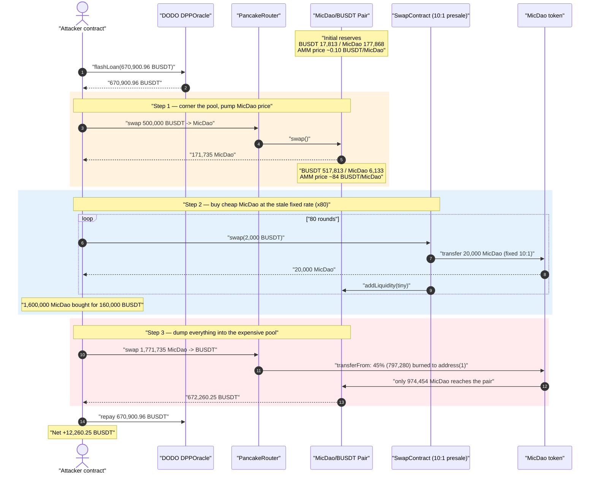
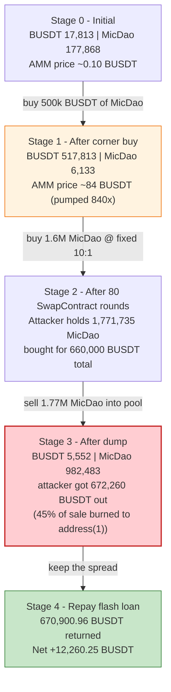
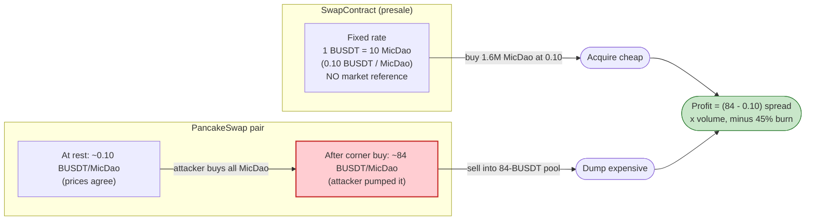

# MicDao Exploit — Fixed-Rate Presale Swap Arbitraged Against a Self-Manipulated AMM Pool

> **Vulnerability classes:** vuln/oracle/price-manipulation · vuln/logic/price-calculation · vuln/defi/slippage

> **Reproduction:** the PoC compiles & runs in an isolated Foundry project at
> [this project folder](.) (the umbrella DeFiHackLabs repo
> contains many unrelated PoCs that do not whole-compile, so this one was extracted).
> Full verbose trace: [output.txt](output.txt).
> Verified vulnerable source: [MicDao.sol](sources/MicDao_f6876f/MicDao.sol).

---

## Key info

| | |
|---|---|
| **Loss** | ~$12.26K — **12,260.25 BUSDT** net profit, drained from the MicDao/BUSDT pool's real liquidity |
| **Vulnerable contract** | `MicDao` token — [`0xf6876f6AB2637774804b85aECC17b434a2B57168`](https://bscscan.com/address/0xf6876f6AB2637774804b85aECC17b434a2B57168#code) — and the fixed-rate presale `SwapContract` [`0x19345233ea7486c1D5d780A19F0e303597E480b5`](https://bscscan.com/address/0x19345233ea7486c1D5d780A19F0e303597E480b5) it sells through |
| **Victim pool** | MicDao/BUSDT PancakeSwap pair — [`0x928902c2499bd6D123F455b1de93F1A139Ef9B00`](https://bscscan.com/address/0x928902c2499bd6D123F455b1de93F1A139Ef9B00) (token0 = BUSDT, token1 = MicDao) |
| **Flash-loan source** | DODO `DPPOracle` — [`0x26d0c625e5F5D6de034495fbDe1F6e9377185618`](https://bscscan.com/address/0x26d0c625e5F5D6de034495fbDe1F6e9377185618) |
| **Attacker EOA** | [`0xcd03ed98868a6cd78096f116a4b56a5f2c67757d`](https://bscscan.com/address/0xcd03ed98868a6cd78096f116a4b56a5f2c67757d) |
| **Attacker contract** | [`0x502b4a51ca7900f391d474268c907b110a277d6f`](https://bscscan.com/address/0x502b4a51ca7900f391d474268c907b110a277d6f) |
| **Attack tx** | [`0x24a2fbb27d433d91372525954f0d7d1af7509547b9ada29cc6c078e732c6d075`](https://bscscan.com/tx/0x24a2fbb27d433d91372525954f0d7d1af7509547b9ada29cc6c078e732c6d075) |
| **Chain / block / date** | BSC / 32,711,747 / Oct 18, 2023 |
| **Compiler** | Solidity v0.8.18, optimizer **off** (runs 200) |
| **Bug class** | Price-oracle / pricing inconsistency: a fixed-rate token sale priced independently of the AMM, combined with a deflationary sell-burn that lets the attacker pump the pool's price |

---

## TL;DR

`MicDao` was being sold through a presale-style helper contract (`SwapContract` at
`0x19345233…`) that hands out **a fixed 10 MicDao per 1 BUSDT** regardless of the live market price.
The token itself adds fuel to the fire: on every transfer *to a registered pair* (a sell), it burns
**45 %** of the amount to `address(1)` ([MicDao.sol:214-221](sources/MicDao_f6876f/MicDao.sol#L214-L221)),
which lets an attacker permanently shrink the pool's MicDao reserve and **drive the AMM price of MicDao far
above the SwapContract's fixed price.**

The attacker:

1. **Flash-loans 670,900.96 BUSDT** from DODO's `DPPOracle`.
2. **Corner-buys** the pool with 500,000 BUSDT, draining its MicDao reserve from 177,868 → 6,133 and
   pushing the AMM price of MicDao from ~0.10 BUSDT to **~84 BUSDT** each.
3. **Buys 1,600,000 MicDao for only 160,000 BUSDT** from the SwapContract — 80 rounds of `swap(2000 BUSDT)`,
   each returning a fixed **20,000 MicDao** (10:1) at the obsolete presale price.
4. **Dumps all 1,771,735 MicDao** back into the now-expensive pool, receiving **672,260.25 BUSDT** out.
5. **Repays** the 670,900.96 BUSDT flash loan and keeps the difference: **+12,260.25 BUSDT**.

The whole thing is one atomic, flash-loan-funded transaction. The profit is the spread between the
SwapContract's stale fixed rate and the AMM price the attacker themselves inflated.

---

## Background

There are three moving pieces in this attack:

1. **The `MicDao` token** ([source](sources/MicDao_f6876f/MicDao.sol)) — a standard OpenZeppelin-style
   ERC20 with one twist: a **45 % sell-burn**. Whenever someone who is not a whitelisted "deliverer"
   transfers MicDao *to a registered pair address*, 45 % of the transfer is burned to `address(1)` and
   only 55 % actually lands in the pool. This is a deflationary "tax on sells" mechanism.

2. **The `SwapContract`** (`0x19345233…`) — a presale/launch helper. A buyer sends it BUSDT and it sends
   back MicDao at a **hard-coded 10:1 rate** (2,000 BUSDT → 20,000 MicDao in the trace), then seeds a tiny
   amount of fresh liquidity into the pool via `addLiquidity` (it added ~23.69 MicDao + ~2,000 BUSDT per
   round) and runs a referral/relationship bind. Critically, **its sale price is fixed** — it does not read
   the live AMM price at all.

3. **The MicDao/BUSDT PancakeSwap pair** (`0x928902c2…`) — the open market where MicDao trades. Its price is
   the constant-product ratio of its reserves, which anyone can move by trading.

On-chain state at fork block 32,711,747 (read from the trace):

| Parameter | Value |
|---|---|
| Pool reserve0 (BUSDT) | **17,813.10 BUSDT** |
| Pool reserve1 (MicDao) | **177,868.93 MicDao** |
| AMM spot price of MicDao | ≈ **0.1002 BUSDT** (17,813.10 / 177,868.93) |
| SwapContract sale rate | **10 MicDao per 1 BUSDT** ⇒ ≈ **0.10 BUSDT / MicDao** |
| MicDao sell-burn | **45 %** of any transfer into a pair |
| DODO `DPPOracle` BUSDT balance | 677,677.73 BUSDT (99 % flash-loanable) |

At the start, the SwapContract price (0.10 BUSDT) and the AMM price (0.1002 BUSDT) are roughly equal — so the
presale is *fairly* priced at rest. The bug is that this equality is **not enforced**: the attacker can break
the AMM price away from the fixed presale price and then arbitrage the gap.

---

## The vulnerable code

### 1. The 45 % sell-burn — the price-pump primitive

```solidity
// MicDao.sol:214-221
function _transfer(address sender, address recipient, uint256 amount) internal override {
    if (pairList[recipient] && !isDelivers[sender]) {     // a "sell" into a registered pair
        uint256 toBurn = amount.mul(45).div(100);         // burn 45%
        super._transfer(sender, address(1), toBurn);      // 45% goes to address(1) (dead)
        amount = amount.sub(toBurn);                       // only 55% reaches the pair
    }
    super._transfer(sender, recipient, amount);
}
```

[MicDao.sol:214-221](sources/MicDao_f6876f/MicDao.sol#L214-L221)

This is a textbook fee-on-transfer/deflationary hook. It is not itself "the bug," but it is the lever the
attacker pulls: because sells permanently destroy 45 % of the MicDao that would otherwise enter the pool, the
pool's MicDao reserve can be made arbitrarily scarce, and scarcity = high AMM price.

### 2. There is no on-chain price coupling

The token has **no oracle, no TWAP, no price reference** to anything. The `SwapContract` (verified by
behaviour in the trace, not in this repo's verified source) sells at a flat 10:1, also with **no reference to
the live pool**. Two venues price the same asset, and nothing keeps them in sync. The trace shows the fixed
output explicitly:

```text
// every round: 2,000 BUSDT in → 20,000 MicDao out (fixed 10:1)
0x19345233…::swap(2000000000000000000000, attacker)
  MicDao::transfer(Helper, 20000000000000000000000)   // 20,000 MicDao, regardless of market
```

[output.txt:130](output.txt) shows the first such round; this repeats **80 times**.

---

## Root cause

**A fixed-price token sale (the presale `SwapContract`) sold MicDao at a rate that was completely decoupled
from the only market that could absorb that MicDao (the AMM pool) — and the MicDao token's own 45 % sell-burn
let the attacker freely inflate that market's price first.**

Concretely, three design decisions compose into the loss:

1. **Stale, oracle-free sale price.** The SwapContract dispenses MicDao at a constant 10:1 ratio. It never
   checks what MicDao is worth on the AMM at the moment of sale. So if the AMM price of MicDao is ever higher
   than 0.10 BUSDT, every unit bought from the SwapContract is instantly profitable when sold on the AMM.

2. **The AMM price is attacker-controllable.** A Uniswap-V2/Pancake pair prices purely off its reserves.
   With 500,000 BUSDT of (flash-loaned) capital, the attacker buys nearly all of the pool's MicDao, collapsing
   `reserveMicDao` from 177,868 → 6,133 and lifting the AMM price from ~0.10 to ~84 BUSDT — an **~840×** gap
   versus the SwapContract's fixed 0.10.

3. **The 45 % sell-burn deepens the asymmetry and guarantees the dump still pays.** When the attacker finally
   sells 1.77M MicDao, 45 % (797,280 MicDao) is burned and only 55 % (974,454 MicDao) enters the pool — yet
   because the pool started with so little MicDao and so much BUSDT (677,813 BUSDT vs 8,028 MicDao at dump
   time), even the burned-down 974,454 MicDao still extracts 672,260 BUSDT. The burn the protocol intended as
   a *defense against dumps* instead helped the attacker keep MicDao scarce and expensive.

The flash loan simply removes the capital requirement: the attacker never needs to own 660,000 BUSDT, only to
borrow and repay it within one transaction.

---

## Preconditions

- The `SwapContract` must still be live and willing to sell MicDao at its fixed 10:1 rate (it was).
- The AMM pool must be thin enough that ~500,000 BUSDT meaningfully moves the MicDao price (it was: only
  17,813 BUSDT / 177,868 MicDao of liquidity).
- The attacker's helper addresses must not be on the `isDelivers` whitelist (they are fresh contracts, so the
  45 % burn applies to them on sells — which the attacker *wants*, since the burn pumps the price).
- Working capital in BUSDT to corner the pool and feed the SwapContract — fully recovered intra-transaction,
  hence **flash-loanable** (the PoC borrows 670,900.96 BUSDT from DODO's `DPPOracle`).

---

## Attack walkthrough (with on-chain numbers from the trace)

The pair `0x928902c2…` has `token0 = BUSDT (reserve0)`, `token1 = MicDao (reserve1)`. All figures are taken
directly from the `Sync` / `Swap` events and `getReserves()` calls in [output.txt](output.txt).

| # | Step | BUSDT reserve | MicDao reserve | AMM MicDao price | Effect |
|---|------|--------------:|---------------:|-----------------:|--------|
| 0 | **Initial** | 17,813.10 | 177,868.93 | ≈ 0.100 BUSDT | Honest, thin pool. SwapContract sells at the same ~0.10. |
| 1 | **Corner buy** — flash-loaned 500,000 BUSDT → 171,735.32 MicDao to attacker | 517,813.10 | 6,133.61 | ≈ **84.4 BUSDT** | Pool's MicDao nearly emptied; AMM price pumped ~840×. |
| 2 | **80× SwapContract rounds** — each `swap(2,000 BUSDT)` → 20,000 MicDao, forwarded to attacker (plus tiny `addLiquidity` per round) | grows to ~677,813 | grows to ~8,028 | (drifts up via small LP adds) | Attacker buys **1,600,000 MicDao for 160,000 BUSDT** at the stale 10:1 rate. |
| 3 | **Final dump** — sell **1,771,735.32 MicDao** into the pool. 45 % (**797,280.89**) burned to `address(1)`; only **974,454.42** enters the pair | 5,552.85 | 982,483.28 | crashes back down | Attacker receives **672,260.25 BUSDT** out. |
| 4 | **Repay** flash loan: transfer 670,900.96 BUSDT back to `DPPOracle` | — | — | — | Net BUSDT kept = **12,260.25**. |

**Why step 2 is profitable:** after step 1, MicDao costs ~84 BUSDT on the AMM but only ~0.10 BUSDT at the
SwapContract. The attacker accumulates 1.6M MicDao for 160,000 BUSDT (avg 0.10 BUSDT) that is "worth" far more
against the inflated pool. Combined with the 171,735 MicDao from the corner buy, the attacker holds
1,771,735 MicDao going into the dump.

**Why step 3 still pays despite the 45 % burn:** at dump time the pool holds 677,813 BUSDT against only ~8,028
MicDao of synced reserve. Selling 974,454 MicDao (the 55 % that survives the burn) against that lopsided pool
returns 672,260 BUSDT — far more than the 160,000 + 500,000 = 660,000 BUSDT the attacker spent acquiring the
position.

### Profit accounting (BUSDT)

| Direction | Amount (BUSDT) |
|---|---:|
| Flash-loan borrowed | 670,900.96 |
| Spent — corner buy (AMM) | 500,000.00 |
| Spent — 80 × 2,000 to SwapContract | 160,000.00 |
| **Total spent acquiring MicDao** | **660,000.00** |
| Received — final MicDao dump | 672,260.25 |
| Flash-loan repaid | 670,900.96 |
| **Net profit (attacker BUSDT balance after − before)** | **+12,260.25** |

The attacker started with 0 BUSDT and ended with **12,260.25 BUSDT** ([output.txt:7](output.txt)),
confirming the spread it extracted from the pool's honest liquidity.

---

## Diagrams

### Sequence of the attack



### Pool / position state evolution



### Why the two prices diverge (the core flaw)



---

## Why each magic number

- **Flash loan 670,900.96 BUSDT** = 99 % of the `DPPOracle`'s 677,677.73 BUSDT balance
  ([MicDao_exp.sol:41](test/MicDao_exp.sol#L41)). This is just "borrow as much as the source allows" — sized
  to comfortably cover the 660,000 BUSDT of acquisition cost.
- **Corner buy of 500,000 BUSDT** ([MicDao_exp.sol:77](test/MicDao_exp.sol#L77)) — large enough relative to the
  thin 17,813-BUSDT / 177,868-MicDao pool to nearly empty the MicDao side and pump the AMM price ~840×, while
  still leaving headroom to feed the SwapContract.
- **80 rounds of 2,000 BUSDT each** ([MicDao_exp.sol:55-60](test/MicDao_exp.sol#L55-L60)) — the SwapContract
  hands out exactly 20,000 MicDao per 2,000-BUSDT call, so 80 rounds buy 1,600,000 MicDao for 160,000 BUSDT.
  Each round is wrapped in a fresh, self-destructing `HelperContract`
  ([MicDao_exp.sol:92-108](test/MicDao_exp.sol#L92-L108)) — likely to obtain a clean per-buyer
  referral/relationship state and avoid any per-address purchase limit in the SwapContract.
- **Final dump of 1,771,735.32 MicDao** ([MicDao_exp.sol:86-88](test/MicDao_exp.sol#L86-L88)) = 171,735.32
  (corner buy) + 1,600,000 (SwapContract) — sell the entire MicDao position back into the pool the attacker
  made expensive. The 45 % sell-burn destroys 797,280.89 of it, but the surviving 974,454.42 still extracts
  672,260.25 BUSDT.

---

## Remediation

1. **Never sell a token at a price decoupled from its live market.** The SwapContract's fixed 10:1 rate is the
   root enabler. If a presale/swap helper must dispense tokens, it should either (a) read a manipulation-
   resistant price (Chainlink/TWAP) and refuse to sell below market, (b) hard-cap per-block or per-address
   purchase volume so the fixed-rate window cannot be drained atomically, or (c) be sunset/disabled once
   public AMM trading begins.
2. **Make pump-and-dump uneconomical, not just "taxed."** A 45 % sell-burn does not prevent the attack — it
   actually deepens the reserve asymmetry the attacker exploits. If a deflationary mechanism is desired, do not
   let it permanently delete pool-bound supply in a way that arbitrary actors can weaponize; consider symmetric
   buy/sell handling or burning from a treasury rather than from the in-flight transfer.
3. **Resist single-transaction price manipulation.** Any system whose security depends on the AMM spot price
   (here, implicitly, the assumption that AMM ≈ presale price) must use a TWAP or oracle, not the instantaneous
   reserve ratio that a flash loan can move ~840× in one call.
4. **Whitelist / rate-limit the SwapContract counterparty.** The fact that fresh, throwaway helper contracts
   could each pull a full 20,000-MicDao allotment shows there was no per-buyer cap or KYC/allowlist gate on the
   sale. Add one.

---

## How to reproduce

The PoC was extracted into a standalone Foundry project (the umbrella DeFiHackLabs repo has many unrelated PoCs
that fail to compile under `forge test`'s whole-project build):

```bash
_shared/run_poc.sh 2023-10-MicDao_exp --mt testExploit -vvvvv
```

- RPC: a **BSC archive** endpoint is required (the fork block 32,711,747 is old; most public BSC RPCs prune it
  and fail with `header not found` / `missing trie node`).
- Result: `[PASS] testExploit()` — attacker BUSDT goes from 0 to **12,260.25**.

Expected tail:

```
Ran 1 test for test/MicDao_exp.sol:ContractTest
[PASS] testExploit() (gas: 48022408)
Logs:
  Attacker BUSDT balance before exploit: 0.000000000000000000
  Attacker BUSDT balance after exploit: 12260.251676860937684429

Suite result: ok. 1 passed; 0 failed; 0 skipped
```

---

*References: [CertiKAlert](https://twitter.com/CertiKAlert/status/1714677875427684544),
[ChainAegis](https://twitter.com/ChainAegis/status/1714837519488205276) — MicDao, BSC, ~$13K, Oct 2023.*
