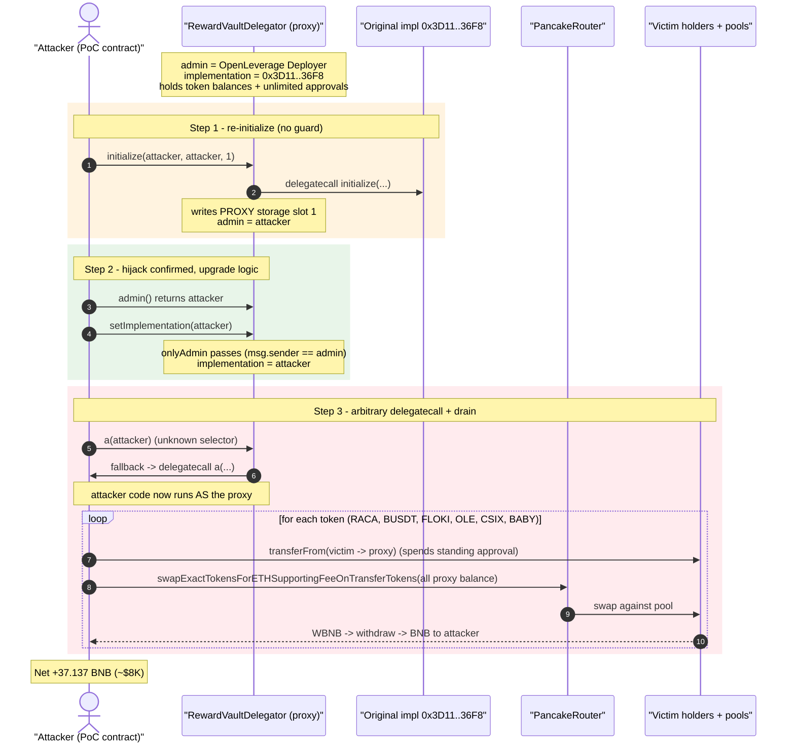
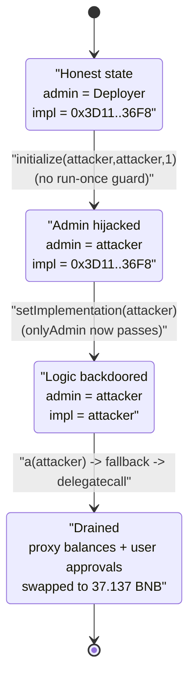
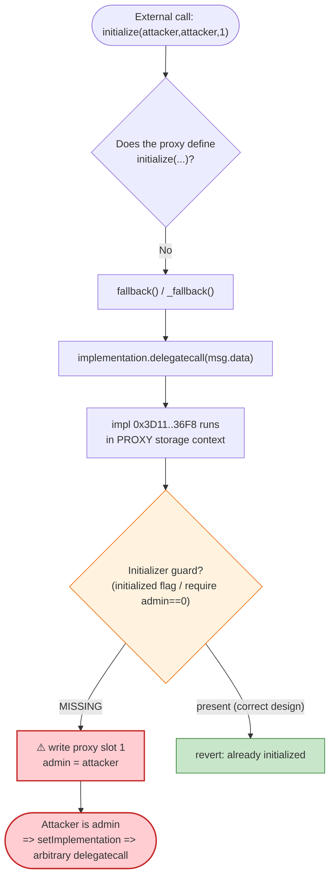

# OpenLeverage `RewardVaultDelegator` Exploit — Re-initializable Proxy → Admin Takeover → Arbitrary `delegatecall`

> **Reproduction:** the PoC compiles & runs in an isolated Foundry project at
> [this project folder](.) (the umbrella DeFiHackLabs repo contains many unrelated PoCs
> that do not whole-compile, so this one was extracted).
> Full verbose trace: [output.txt](output.txt).
> Verified vulnerable source: [contracts_RewardVaultDelegator.sol](sources/RewardVaultDelegator_7bACB1/contracts_RewardVaultDelegator.sol),
> [contracts_Adminable.sol](sources/RewardVaultDelegator_7bACB1/contracts_Adminable.sol),
> [contracts_DelegatorInterface.sol](sources/RewardVaultDelegator_7bACB1/contracts_DelegatorInterface.sol).

---

## Key info

| | |
|---|---|
| **Loss** | ~$8K — **37.137 BNB** swept from the contract + the addresses that had approved it |
| **Vulnerable contract** | `RewardVaultDelegator` (proxy) — [`0x7bACB1c805CbbF7c4f74556a4B34FDE7793d0887`](https://bscscan.com/address/0x7bACB1c805CbbF7c4f74556a4B34FDE7793d0887#code) |
| **Logic implementation** | [`0x3D11015d9044cAbBB2504448e37f20d0d56E36F8`](https://bscscan.com/address/0x3D11015d9044cAbBB2504448e37f20d0d56E36F8) |
| **Victims** | the proxy's own residual token balances + 5 EOAs/contracts that had granted it unlimited ERC20 approvals (RACA, BUSDT, FLOKI, OLE, CSIX holders) |
| **Original admin** | OpenLeverage Deployer — `0xE9547CF7E592F83C5141bB50648317e35D27D29B` |
| **Attacker EOA** | [`0x8ebd046992afe07eacce6b9b3878fdb45830f42b`](https://bscscan.com/address/0x8ebd046992afe07eacce6b9b3878fdb45830f42b) |
| **Attacker contract** | [`0x5366c6ba729d9cf8d472500afc1a2976ac2fe9ff`](https://bscscan.com/address/0x5366c6ba729d9cf8d472500afc1a2976ac2fe9ff) |
| **Attack tx** | [`0xd88f26f2f9145fa413db0cfd5d3eb121e3a50a3fdcee16c9bd4731e68332ce4b`](https://bscscan.com/tx/0xd88f26f2f9145fa413db0cfd5d3eb121e3a50a3fdcee16c9bd4731e68332ce4b) |
| **Chain / block / date** | BSC / fork at **32,820,951** / ~October 2023 |
| **Compiler** | proxy/impl Solidity **v0.8.15**, optimizer 200 runs (PoC harness `^0.8.10`) |
| **Bug class** | Re-initializable proxy (missing initializer guard) → admin hijack → arbitrary `delegatecall` via attacker-controlled implementation |

---

## TL;DR

`RewardVaultDelegator` is a Compound-style delegator/proxy. Its `admin` is supposed to be set
**once**, by the constructor, by delegate-calling the implementation's `initialize(...)`
([contracts_RewardVaultDelegator.sol:14-25](sources/RewardVaultDelegator_7bACB1/contracts_RewardVaultDelegator.sol#L14-L25)).
After deployment, all unknown calls fall through the proxy's `fallback()` into the implementation
via `delegatecall` ([contracts_DelegatorInterface.sol:69-93](sources/RewardVaultDelegator_7bACB1/contracts_DelegatorInterface.sol#L69-L93)).

The implementation's `initialize(...)` had **no "already initialized" guard**. Because the proxy
forwards any unrecognized selector into the implementation under `delegatecall` — and the
implementation writes to the **proxy's** storage — anyone could call `initialize(...)` a second time
*through the proxy* and overwrite the `admin` slot.

The attacker:

1. **Re-initializes** the proxy: `initialize(attacker, attacker, 1)` → the implementation runs in the
   proxy's context and rewrites storage slot `1` (`admin`) from the OpenLeverage Deployer to the
   attacker ([output.txt:48-54](output.txt)).
2. **Becomes admin**, so the `onlyAdmin`-gated
   [`setImplementation()`](sources/RewardVaultDelegator_7bACB1/contracts_RewardVaultDelegator.sol#L31-L35)
   now passes for them. They point the proxy's logic at **their own attack contract**
   ([output.txt:62-66](output.txt)).
3. **Calls an arbitrary selector `a(address)`** on the proxy. There is no such function, so it falls
   through `fallback()` and is `delegatecall`ed into the attacker's contract — which now executes
   **with the proxy's identity and the proxy's outstanding ERC20 approvals**
   ([output.txt:67-572](output.txt)).
4. Inside that `delegatecall`, the attacker uses the proxy's `msg.sender` identity to `transferFrom`
   tokens out of every address that had ever approved the proxy, then swaps every token the proxy
   holds for BNB on PancakeSwap, sending the BNB to the attacker EOA.

Net result: **37.137 BNB** is extracted in one transaction (PoC: `0 → 37.136665551377188920` BNB).

---

## Background — what `RewardVaultDelegator` is

`RewardVaultDelegator` is OpenLeverage's reward-vault delegator, built on the well-known
Compound delegator pattern (a minimal storage proxy that `delegatecall`s a separate logic contract).
Three source files define the on-chain behavior:

- **`Adminable`** ([source](sources/RewardVaultDelegator_7bACB1/contracts_Adminable.sol)) — declares
  the storage layout `admin` (slot 1), `pendingAdmin` (slot 2), `developer` (slot 3), and the
  `onlyAdmin` modifier `require(msg.sender == admin, ...)`
  ([:18-20](sources/RewardVaultDelegator_7bACB1/contracts_Adminable.sol#L18-L20)).
- **`DelegatorInterface`** ([source](sources/RewardVaultDelegator_7bACB1/contracts_DelegatorInterface.sol))
  — declares `implementation` (slot 0) and the catch-all `fallback()/receive()` that
  `delegatecall`s the implementation with the raw calldata
  ([:69-93](sources/RewardVaultDelegator_7bACB1/contracts_DelegatorInterface.sol#L69-L93)).
- **`RewardVaultDelegator`** ([source](sources/RewardVaultDelegator_7bACB1/contracts_RewardVaultDelegator.sol))
  — the deployed proxy: its constructor seeds `admin = msg.sender`, delegate-calls
  `initialize(address,address,uint64)` on the implementation, sets `implementation`, and then writes
  the real `admin`.

Because it is a reward/vault delegator that pulls user tokens to distribute them, **users had granted
it unlimited (`type(uint256).max`) ERC20 approvals**. That is the latent value the bug unlocks: once
the attacker controls the proxy, the proxy's `transferFrom` rights become the attacker's.

The on-chain state at the fork block (read from the trace):

| Fact | Value | Source |
|---|---|---|
| `admin` before attack | `0xE954…D29B` (OpenLeverage Deployer) | [output.txt:42,46](output.txt) |
| `implementation` before attack | `0x3D11…36F8` | [_meta.json](sources/RewardVaultDelegator_7bACB1/_meta.json), [output.txt:65](output.txt) |
| Proxy storage slot `1` (admin) before | `…e9547cf7…d27d29b` | [output.txt:52](output.txt) |
| Proxy storage slot `0` (implementation) before | `…3d11015d…56e36f8` | [output.txt:65](output.txt) |
| Outstanding approvals to the proxy | unlimited, from 5+ distinct holders | [output.txt:76-77, 200-201, 397-398](output.txt) |

---

## The vulnerable code

### 1. `admin` is only meant to be set in the constructor, via a delegated `initialize`

```solidity
// contracts_RewardVaultDelegator.sol
constructor(
    address payable _admin,
    address _distributor,
    uint64 _defaultExpireDuration,
    address implementation_){
    admin = payable(msg.sender);
    // First delegate gets to initialize the delegator (i.e. storage contract)
    delegateTo(implementation_, abi.encodeWithSignature("initialize(address,address,uint64)",
        _admin,
        _distributor,
        _defaultExpireDuration
        ));
    implementation = implementation_;
    admin = _admin;          // <-- the "real" admin is meant to be final here
}
```

The comment *"First delegate gets to initialize"* is the giveaway: the design assumes `initialize`
runs exactly once. **Nothing enforces that.**

### 2. Any unknown selector is `delegatecall`ed into the implementation, writing the proxy's storage

```solidity
// contracts_DelegatorInterface.sol:69-93
fallback() external payable { _fallback(); }
receive()  external payable { _fallback(); }

function _fallback() internal {
    if (msg.data.length > 0) {
        (bool success, ) = implementation.delegatecall(msg.data);   // <-- proxy storage context
        assembly {
            let free_mem_ptr := mload(0x40)
            returndatacopy(free_mem_ptr, 0, returndatasize())
            switch success
            case 0 { revert(free_mem_ptr, returndatasize()) }
            default { return(free_mem_ptr, returndatasize()) }
        }
    }
}
```

`initialize(address,address,uint64)` is **not** a function on the proxy, so a call to it falls through
`fallback()` → `implementation.delegatecall(initialize(...))`. The implementation's `initialize`
writes `admin` — but under `delegatecall` it writes the **proxy's** `admin` slot. With no
`initialized` flag in the implementation, a second `initialize` simply overwrites it.

The trace shows exactly this — the proxy forwards `initialize` to the implementation `0x3D11…36F8`
as a `delegatecall`, and slot `1` is rewritten:

```
[13974] RewardVaultDelegator::initialize(attacker, attacker, 1)
  [8778] 0x3D11…36F8::initialize(attacker, attacker, 1) [delegatecall]
     storage changes:
       @ 1: …e9547cf7…d27d29b  →  …7fa9385b…b3e1496   // admin: Deployer → attacker
```
([output.txt:48-54](output.txt))

### 3. `setImplementation` trusts `admin` — which the attacker now controls

```solidity
// contracts_RewardVaultDelegator.sol:31-35
function setImplementation(address implementation_) public override onlyAdmin {
    address oldImplementation = implementation;
    implementation = implementation_;
    emit NewImplementation(oldImplementation, implementation);
}
```

`onlyAdmin` is `require(msg.sender == admin)`. Once `admin == attacker`, the attacker repoints the
proxy's logic at their own contract:

```
[4933] RewardVaultDelegator::setImplementation(attacker)
  emit NewImplementation(old: 0x3D11…36F8, new: attacker)
  storage changes:
    @ 0: …3d11015d…56e36f8  →  …7fa9385b…b3e1496        // implementation → attacker
```
([output.txt:62-66](output.txt))

From here, every call to the proxy `delegatecall`s into attacker code running with the proxy's
identity and approvals.

---

## Root cause — why it was possible

The bug is the classic **re-initializable proxy / uninitialized-implementation** failure, composed of
three independently-true facts that together hand over the contract:

1. **Missing initializer guard.** The implementation's `initialize(address,address,uint64)` does not
   set/check an `initialized` flag (no `initializer` modifier, no `require(admin == address(0))`,
   no one-shot latch). The constructor's *"first delegate gets to initialize"* comment is the entire
   protection — and it is only a comment.
2. **A permissive catch-all `delegatecall` fallback.** The proxy forwards *any* selector it does not
   itself define into the implementation under `delegatecall`. `initialize` is not a proxy method, so
   it is reachable post-deployment through `fallback()`, executing against the proxy's storage.
3. **`admin`-gated implementation upgrade.** Because the only thing standing between an admin and
   arbitrary code execution is `setImplementation`/`onlyAdmin`, capturing `admin` is equivalent to
   capturing the whole contract. The attacker turns "I can set admin" into "I can run any code as the
   proxy."

The terminal harm comes from what the proxy *is*: a reward vault that holds token balances and, more
importantly, holds **unlimited ERC20 allowances from its users**. Arbitrary `delegatecall` as the
proxy therefore equals `transferFrom(anyUserWhoApprovedUs, …)` — the attacker drains both the proxy's
own balances and the balances of everyone who trusted it.

> One-sentence root cause: **`initialize()` had no run-once guard and was reachable through the
> proxy's `delegatecall` fallback, so anyone could overwrite `admin`, then upgrade the implementation
> to attacker code and spend the proxy's standing ERC20 approvals.**

---

## Preconditions

- The implementation's `initialize` is callable a second time (no initializer guard) — **true** here.
- The proxy `delegatecall`s unknown selectors into the implementation — **true** (catch-all
  `fallback`).
- `setImplementation` is gated only by `onlyAdmin` (no timelock / multisig / two-step on the upgrade
  itself once admin is held) — **true**.
- Value to extract: the proxy holds residual token balances **and** holds live unlimited approvals
  from users (it is a reward distributor). **No flash loan or capital is required** — the attacker
  spends only gas. The PoC starts the attacker with `0` BNB ([test/OpenLeverage_exp.sol:58](test/OpenLeverage_exp.sol#L58)).

---

## Step-by-step attack walkthrough (with on-chain numbers from the trace)

The PoC's `testExploit()` ([test/OpenLeverage_exp.sol:57-80](test/OpenLeverage_exp.sol#L57-L80)) does
the takeover in three calls; the drain itself happens inside the attacker's `a(address)`
([test/OpenLeverage_exp.sol:103-126](test/OpenLeverage_exp.sol#L103-L126)) once it is the proxy's
implementation.

| # | Step | Call | Effect | Trace |
|---|------|------|--------|-------|
| 0 | **Baseline** | `admin()` | `admin == 0xE954…D29B` (OpenLeverage Deployer); attacker BNB = 0 | [output.txt:42,40](output.txt) |
| 1 | **Re-initialize** | `initialize(attacker, attacker, 1)` | forwarded via `delegatecall` to impl `0x3D11…36F8`; **slot 1 (`admin`) → attacker** | [output.txt:48-54](output.txt) |
| 2 | **Confirm hijack** | `admin()` | now returns `0x7FA9…1496` (the PoC contract) | [output.txt:55-56](output.txt) |
| 3 | **Repoint logic** | `setImplementation(attacker)` | `onlyAdmin` passes; **slot 0 (`implementation`) → attacker** | [output.txt:62-66](output.txt) |
| 4 | **Trigger drain** | `a(attacker)` | unknown selector → `fallback()` → `delegatecall` into attacker code, **running as the proxy** | [output.txt:67-68](output.txt) |
| 5 | drain RACA | `transferFrom(0x2aB3…242B, proxy, 28,246,878 RACA)` then swap proxy's **37,335,415 RACA** → BNB | **+28.0476 BNB** | [output.txt:78, 88, 128](output.txt) |
| 6 | drain BUSDT | `transferFrom(0xe83c…D2f6, proxy, 0.2249 BUSDT)` (allowance-capped) then swap proxy's **1,288.22 BUSDT** → BNB | **+5.9831 BNB** | [output.txt:140, 150, 190](output.txt) |
| 7 | drain FLOKI | `transferFrom(0x0D41…1901, proxy, 0.00876 FLOKI)` then swap proxy's **0.01234 FLOKI** → BNB | **+1.5058 BNB** | [output.txt:202, 218, 387](output.txt) |
| 8 | drain OLE | `transferFrom(0x3BD0…CF04, proxy, 338.567 OLE)` then swap proxy's **3,945.03 OLE** → BNB | **+0.06004 BNB** | [output.txt:399, 407, 445](output.txt) |
| 9 | drain CSIX | `transferFrom(0x2C8E…93f2, proxy, 17,850.67 CSIX)` then swap proxy's **18,882.72 CSIX** → BNB | **+1.4338 BNB** | [output.txt:457, 474, 519](output.txt) |
| 10 | drain BABY | victim `address(0)` (no `transferFrom`) → swap proxy's residual **3,318.62 BABY** → BNB | **+0.1062 BNB** | [output.txt:528, 529, 569](output.txt) |
| 11 | **Result** | — | attacker BNB **0 → 37.136665551377188920** | [output.txt:574](output.txt) |

A few details worth noting from the trace:

- The drain helper `transferFromAndSwapTokensToBNB`
  ([test/OpenLeverage_exp.sol:82-101](test/OpenLeverage_exp.sol#L82-L101)) runs **inside the proxy's
  context** (`delegatecall`), so `IERC20(token).approve(router, max)` and `transferFrom(victim, this, …)`
  both use the **proxy** as `msg.sender`/owner. The trace confirms this — every approval/transfer is
  emitted with `owner: RewardVaultDelegator [0x7bACB1…]`, e.g.
  [output.txt:70, 79](output.txt).
- For most tokens the proxy *already holds* far more than is pulled from the named victim (e.g. it
  pulls 0.2249 BUSDT but swaps 1,288.22 BUSDT; pulls 338.567 OLE but swaps 3,945.03 OLE). The
  `transferFrom` step harvests whatever standing allowance remains, then the swap dumps the proxy's
  **entire** balance of that token for BNB. The contract's own residual balances are the bulk of the
  loss here.
- `swapExactTokensForETHSupportingFeeOnTransferTokens` is used for every leg
  ([test/OpenLeverage_exp.sol:98-100](test/OpenLeverage_exp.sol#L98-L100)) because several victims
  (FLOKI, CSIX) are fee-on-transfer / hooked tokens — visible as `beforeTransferHandler` /
  `getTax` / `extractFee` calls in the trace ([output.txt:203-207, 458-464](output.txt)).

### Profit / loss accounting (BNB received by attacker)

| Leg | Token swapped | BNB out | Trace |
|---|---|---:|---|
| RACA | 37,335,415 RACA | 28.04764 | [output.txt:128](output.txt) |
| BUSDT | 1,288.22 BUSDT | 5.98314 | [output.txt:190](output.txt) |
| FLOKI | 0.01234 FLOKI | 1.50582 | [output.txt:387](output.txt) |
| OLE | 3,945.03 OLE | 0.06004 | [output.txt:445](output.txt) |
| CSIX | 18,882.72 CSIX | 1.43381 | [output.txt:519](output.txt) |
| BABY | 3,318.62 BABY | 0.10621 | [output.txt:569](output.txt) |
| **Total** | | **37.13666** | [output.txt:574](output.txt) |

`28.04764 + 5.98314 + 1.50582 + 0.06004 + 1.43381 + 0.10621 = 37.13666 BNB`, matching the logged
final balance `37.136665551377188920` to the wei. Attacker capital spent: **0 BNB** (gas only).
Reported loss ≈ **$8K** at the time.

---

## Diagrams

### Sequence of the attack



### Takeover state machine



### Why `initialize` is reachable post-deploy



---

## Remediation

1. **Make `initialize` run-once.** Use OpenZeppelin's `initializer`/`reinitializer` modifier, or a
   simple latch in the implementation that writes to the proxy's storage:
   `require(!initialized); initialized = true;` (or `require(admin == address(0))`). This is the single
   change that closes the bug.
2. **Disable the implementation's own initializer.** Standard upgradeable practice is to call
   `_disableInitializers()` in the implementation's constructor so the logic contract cannot be
   initialized in any context except the intended proxy bootstrap.
3. **Do not forward arbitrary selectors before initialization is complete / restrict the fallback.**
   If a delegator must expose `initialize`, it should be a *named* proxy method protected by a guard,
   not something reachable through the catch-all `delegatecall` fallback.
4. **Two-key the upgrade path, not just `admin`.** Gate `setImplementation` behind a timelock +
   multisig (and ideally a two-step admin handover via the existing
   `setPendingAdmin`/`acceptAdmin`). That way a single overwritten `admin` slot does not immediately
   equal arbitrary code execution.
5. **Minimize standing approvals.** A reward vault that holds unlimited user allowances turns any
   takeover into a mass-drain. Pull exact amounts per operation, or use permit-style single-use
   approvals, so a compromised vault cannot spend more than what is in-flight.

---

## How to reproduce

The PoC was extracted into a standalone Foundry project (the umbrella DeFiHackLabs repo has many
unrelated PoCs that fail to whole-compile under `forge test`):

```bash
_shared/run_poc.sh 2023-10-OpenLeverage_exp -vvvvv
```

- RPC: a **BSC archive** endpoint is required (fork block 32,820,951 is well in the past). Most public
  BSC RPCs prune that state and fail with `header not found` / `missing trie node`.
- Result: `[PASS] testExploit()` with the attacker BNB balance going from `0` to `~37.13 BNB`.

Expected tail:

```
Ran 1 test for test/OpenLeverage_exp.sol:ContractTest
[PASS] testExploit() (gas: 1095199)
Logs:
  Attacker BNB balance before exploit: 0.000000000000000000
  Original admin address (Open Leverage Deployer): 0xE9547CF7E592F83C5141bB50648317e35D27D29B
  Admin address after calling initialize func (admin change): 0x7FA9385bE102ac3EAc297483Dd6233D62b3e1496
  Attacker BNB balance after exploit: 37.136665551377188920

Suite result: ok. 1 passed; 0 failed; 0 skipped
```

---

*Refs: PoC header [test/OpenLeverage_exp.sol:7-14](test/OpenLeverage_exp.sol#L7-L14);
attack tx `0xd88f26f2f9145fa413db0cfd5d3eb121e3a50a3fdcee16c9bd4731e68332ce4b` on BscScan.*
