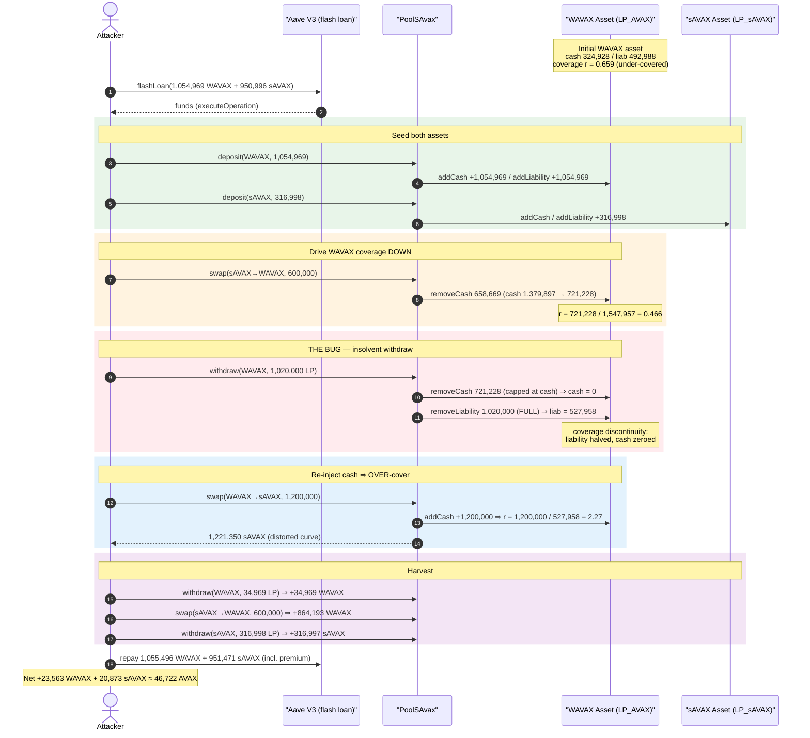
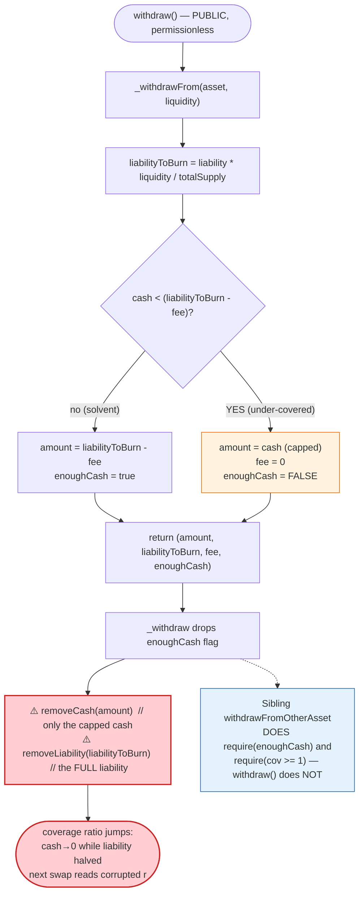
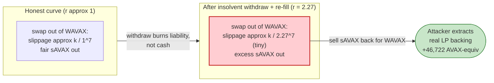

# Platypus Finance (PoolSAvax) Exploit — Withdraw-While-Insolvent Coverage-Ratio Manipulation

> **Reproduction:** the PoC compiles & runs in an isolated Foundry project at
> [this project folder](.) (the umbrella DeFiHackLabs repo contains many unrelated PoCs that do
> not compile together, so this one was extracted).
> Full verbose trace: [output.txt](output.txt).
> Verified vulnerable source: [contracts_pool_PoolSAvax.sol](sources/PoolSAvax_e5c84c/contracts_pool_PoolSAvax.sol),
> [contracts_pool_Core.sol](sources/PoolSAvax_e5c84c/contracts_pool_Core.sol).

---

## Key info

| | |
|---|---|
| **Loss** | ~$2.0M — attacker netted **23,563.75 WAVAX + 20,873.79 sAVAX ≈ 46,722 AVAX-equivalent** from the sAVAX pool |
| **Vulnerable contract** | `PoolSAvax` (behind proxy) — [`0xe5c84C7630A505B6adF69B5594d0Ff7fEDd5F447`](https://snowtrace.io/address/0xe5c84c7630a505b6adf69b5594d0ff7fedd5f447#code) |
| **Victim pool / assets** | sAVAX Pool; `LP_AVAX` [`0xC73eeD…79939`](https://snowtrace.io/address/0xC73eeD4494382093C6a7C284426A9a00f6C79939), `LP_sAVAX` [`0xA2A7EE…1789`](https://snowtrace.io/address/0xA2A7EE49750Ff12bb60b407da2531dB3c50A1789) |
| **Attacker EOA** | [`0x0cd4fD0Eecd2c5aD24De7f17Ae35F9DB6Ac51EE7`](https://snowtrace.io/address/0x0cd4fd0eecd2c5ad24de7f17ae35f9db6ac51ee7) |
| **Attacker contract** | [`0x44e251786a699518D6273eA1e027CEC27b49D3bd`](https://snowtrace.io/address/0x44e251786a699518d6273ea1e027cec27b49d3bd) |
| **Attack tx** | [`0x4425f757715e23d392cda666bc0492d9e5d5848ff89851a1821eab5ed12bb867`](https://snowtrace.io/tx/0x4425f757715e23d392cda666bc0492d9e5d5848ff89851a1821eab5ed12bb867) (one of several) |
| **Chain / block / date** | Avalanche C-Chain / fork **36,346,397** / October 12, 2023 |
| **Compiler** | Pool/Asset/Core compiled with Solidity **0.8.9** (PoC harness built with 0.8.34) |
| **Bug class** | Broken AMM invariant — withdrawal allowed while an asset is under-covered, letting `liability` be burned faster than `cash`, which inflates the surviving coverage ratio and corrupts the swap price curve |

---

## TL;DR

Platypus is a single-pool stableswap-style AMM. Each token in a pool is represented by an `Asset`
contract that tracks two numbers: **`cash`** (underlying tokens actually held) and **`liability`**
(what LPs are owed). The swap price between two assets is driven by their **coverage ratios**
`r = cash / liability` through a steep slippage curve ([Core._slippage](sources/PoolSAvax_e5c84c/contracts_pool_Core.sol#L59-L90)).

The bug is in `_withdraw` / `_withdrawFrom`
([PoolSAvax.sol:556-623](sources/PoolSAvax_e5c84c/contracts_pool_PoolSAvax.sol#L556-L623)).
When an asset does **not** have enough `cash` to honor a withdrawal (it is under-covered, `r < 1`),
the protocol caps the withdrawn `amount` at the available `cash` — but it still burns the **full**
`liabilityToBurn` proportional to the LP redeemed:

```solidity
// _withdrawFrom — when cash is insufficient
amount = asset.cash();   // capped at available cash
fee = 0;
enoughCash = false;
...
// _withdraw — burns the FULL liabilityToBurn regardless
asset.removeCash(amount);            // removes only `cash`
asset.removeLiability(liabilityToBurn); // removes the full proportional liability
```

Because `liability` shrinks while `cash` is driven to `0`, the asset's coverage ratio
`cash / liability` **jumps from below 1 to a value the attacker controls**. The attacker then
re-injects `cash` via a swap (lifting coverage well above 1) and exploits the now-distorted slippage
curve: WAVAX deposited into the over-covered WAVAX asset is quoted far more sAVAX out than it should
be. Repeating deposit → under-cover-via-swap → withdraw-while-insolvent → over-cover-via-swap lets
the attacker pull more value out of the pool than they put in.

The whole thing is wrapped in an **Aave V3 flash loan** of 1,054,969 WAVAX + 950,996 sAVAX
([Platypus03_exp.sol:67-72](test/Platypus03_exp.sol#L67-L72)), so the attacker needs **zero capital**.
After repaying the flash loan with its premium, the attacker walks away with
**23,563.75 WAVAX and 20,873.79 sAVAX** ([output.txt:1564-1565](output.txt)).

---

## Background — how the Platypus sAVAX pool prices swaps

`PoolSAvax` is an upgrade of the standard Platypus pool restricted to two tokens: **WAVAX** and
**sAVAX** (BENQI staked AVAX). Each token has an `Asset` LP contract
([Asset.sol](sources/PoolSAvax_e5c84c/contracts_asset_Asset.sol)) holding two pieces of accounting
state:

- **`cash`** — the underlying token the asset physically holds
  ([Asset.sol:199-221](sources/PoolSAvax_e5c84c/contracts_asset_Asset.sol#L199-L221)).
- **`liability`** — the sum of deposits + accrued dividends, i.e. what LPs are owed
  ([Asset.sol:226-249](sources/PoolSAvax_e5c84c/contracts_asset_Asset.sol#L226-L249)).

The **coverage ratio** `r = cash / liability` is the heart of the design. Platypus's Yellow-Paper
slippage curve makes swapping *into* a well-covered asset cheap and swapping *out of* an
under-covered asset expensive. The ideal cross-token amount is computed from the sAVAX oracle rate
(`getPooledAvaxByShares(1e18)` = **1.10944593 AVAX/sAVAX** at this block, [output.txt:1777](output.txt)),
then adjusted by the slippage of the *from* and *to* assets and a 0.04% haircut
([_quoteFrom](sources/PoolSAvax_e5c84c/contracts_pool_PoolSAvax.sol#L899-L931)).

State of the WAVAX asset (`LP_AVAX`) at the fork block, read from the trace's event `previous` fields:

| Asset | `cash` | `liability` | coverage `r` |
|---|---:|---:|---:|
| WAVAX (LP_AVAX) | 324,928.73 | 492,988.99 | **≈ 0.659** (under-covered) |
| sAVAX (LP_sAVAX) | 401,999.49 | 417,291.21 | ≈ 0.963 |

The WAVAX asset was already **under-covered** (`r < 1`) — far more had been swapped out than was
deposited. That under-coverage is precisely what makes the withdraw-while-insolvent path reachable.

---

## The vulnerable code

### 1. `_withdrawFrom` caps the payout at `cash` but reports the full liability

```solidity
function _withdrawFrom(Asset asset, uint256 liquidity)
    private view
    returns (uint256 amount, uint256 liabilityToBurn, uint256 fee, bool enoughCash)
{
    liabilityToBurn = (asset.liability() * liquidity) / asset.totalSupply();
    require(liabilityToBurn > 0, 'INSUFFICIENT_LIQ_BURN');

    fee = _withdrawalFee(... asset.cash(), asset.liability(), liabilityToBurn);
    enoughCash = true;

    if (liabilityToBurn > fee) {
        amount = liabilityToBurn - fee;
        if (asset.cash() < amount) {
            amount = asset.cash();   // ← payout capped at cash on hand
            fee = 0;
            enoughCash = false;      // ← flagged "not enough cash"
        }
    } else { ... }
}
```

[PoolSAvax.sol:556-597](sources/PoolSAvax_e5c84c/contracts_pool_PoolSAvax.sol#L556-L597)

### 2. `_withdraw` ignores the `enoughCash` flag and burns the full liability

```solidity
function _withdraw(Asset asset, uint256 liquidity, uint256 minimumAmount, address to)
    private returns (uint256 amount)
{
    uint256 liabilityToBurn;
    (amount, liabilityToBurn, , ) = _withdrawFrom(asset, liquidity); // ← drops `enoughCash`!

    require(minimumAmount <= amount, 'AM_TOO_LOW');

    asset.burn(msg.sender, liquidity);
    asset.removeCash(amount);              // ← removes only the capped `cash`
    asset.removeLiability(liabilityToBurn);// ← removes the FULL proportional liability
    asset.transferUnderlyingToken(to, amount);
}
```

[PoolSAvax.sol:607-623](sources/PoolSAvax_e5c84c/contracts_pool_PoolSAvax.sol#L607-L623)

The public `withdraw()` entry point ([PoolSAvax.sol:634-650](sources/PoolSAvax_e5c84c/contracts_pool_PoolSAvax.sol#L634-L650))
routes straight here. Compare with the *sibling* function `withdrawFromOtherAsset`, which **does**
check the flag and reverts on insolvency — `require(enoughCash, 'N_ENOUGH_CASH')` and
`require((cash - amount)/liability >= 1, 'COV_RATIO_LOW')`
([PoolSAvax.sol:739-746](sources/PoolSAvax_e5c84c/contracts_pool_PoolSAvax.sol#L739-L746)). The plain
`withdraw` path has **neither guard**.

### 3. The slippage curve that the corrupted coverage ratio feeds into

```solidity
function _slippageFunc(uint256 k, uint256 n, uint256 c1, uint256 xThreshold, uint256 x)
    internal pure returns (uint256)
{
    if (x < xThreshold) { return c1 - x; }
    else { return k.wdiv((((x * RAY) / WAD).rpow(n) * WAD) / RAY); } // k / x^n
}
```

[Core.sol:33-45](sources/PoolSAvax_e5c84c/contracts_pool_Core.sol#L33-L45). With `n = 7`, the curve
is extremely sensitive to the coverage ratio `x`. Pushing one asset's coverage from `< 1` up to
`>> 1` makes swaps *out of* it abnormally favorable — exactly the regime the attacker engineers.

---

## Root cause — why it was possible

`_withdraw` lets an LP redeem from an **under-covered** asset, paying out only the `cash` available
but destroying the **full** proportional `liability`. This is a *non-conservative* operation on the
coverage ratio:

> Removing `Δcash = cash` and `Δliability = liabilityToBurn` (where `liabilityToBurn > cash`)
> makes the surviving `cash / liability` ratio **larger**, not smaller. An asset can be driven to
> `cash = 0` while `liability` still has a large residual, and the *next* deposit/swap re-establishes
> a coverage ratio that no longer reflects how much value really backs the asset.

Two design decisions compose into the critical bug:

1. **The insolvency flag is computed but discarded in the main path.** `_withdrawFrom` returns
   `enoughCash`, and the otherwise-identical `withdrawFromOtherAsset` *enforces* it
   ([:743](sources/PoolSAvax_e5c84c/contracts_pool_PoolSAvax.sol#L743)). The plain `withdraw`
   ([:607-623](sources/PoolSAvax_e5c84c/contracts_pool_PoolSAvax.sol#L607-L623)) silently throws it
   away — so withdrawing while insolvent is permitted, and the LP burns more liability than the cash
   it recovers. That liability/cash asymmetry is the lever.
2. **Coverage ratio is both the price input *and* freely manipulable within one transaction.**
   `cash` and `liability` are moved by permissionless `deposit`/`swap`/`withdraw` calls with no TWAP,
   no per-tx coverage bound, and no minimum-coverage invariant on `withdraw`. The slippage curve
   (`k / x^7`) reads whatever instantaneous ratio the attacker has just sculpted.

This earlier Platypus design (Yellow Paper v1) explicitly *removed* the impairment-loss/gain
accounting and the price-deviation peg check (see the contract header comment,
[PoolSAvax.sol:29-37](sources/PoolSAvax_e5c84c/contracts_pool_PoolSAvax.sol#L29-L37)). Those removals
left no backstop against a withdrawal that empties `cash` while leaving stranded `liability`.

---

## Preconditions

- The target asset (WAVAX) is **under-covered** (`r < 1`) so the insolvent-withdraw branch is
  reachable. At the fork block WAVAX coverage was ≈ 0.659 — naturally true.
- A flash-loan source for working capital. The PoC uses **Aave V3** on Avalanche
  ([:47](test/Platypus03_exp.sol#L47)); premiums were 527.48 WAVAX + 475.50 sAVAX
  ([output.txt:2311,2345](output.txt)).
- The pool is **not paused** and the deadline is in the future — both trivially satisfied. No
  privileged role is required; every call (`deposit`, `swap`, `withdraw`) is permissionless.

---

## Attack walkthrough (with on-chain numbers from the trace)

Everything below runs inside `executeOperation`, the Aave flash-loan callback
([Platypus03_exp.sol:83-110](test/Platypus03_exp.sol#L83-L110)). All `cash`/`liability` figures are
read directly from the `CashAdded`/`CashRemoved`/`LiabilityAdded`/`LiabilityRemoved` events in
[output.txt](output.txt). The WAVAX asset (`LP_AVAX`) is the one being corrupted; figures in WAD (1e18).

| # | Action (call) | WAVAX `cash` → | WAVAX `liability` → | WAVAX `r` | Effect |
|---|---|---:|---:|---:|---|
| 0 | **Initial** | 324,928.73 | 492,988.99 | 0.659 | Pool is honestly under-covered on WAVAX. |
| 1 | **flashLoan** 1,054,969 WAVAX + 950,996 sAVAX | — | — | — | Zero-capital working funds ([:1598](output.txt)). |
| 2 | `deposit(WAVAX, 1,054,969)` → mints 1,054,969 LP_AVAX | 1,379,897.73 | 1,547,957.99 | 0.891 | Adds cash & liability 1:1 ([:1667,1678](output.txt)). |
| 3 | `deposit(SAVAX, 316,998.67)` | (sAVAX side) | | | sAVAX cash 401,999→718,998; liab 417,291→734,289 ([:1731,1742](output.txt)). |
| 4 | `swap(SAVAX→WAVAX, 600,000)` — pulls WAVAX `cash` out, **drives WAVAX coverage down** | 721,228.13 | 1,547,957.99 | **0.466** | WAVAX cash −658,669.60; attacker receives 658,669.60 WAVAX ([:1834,1851](output.txt)). |
| 5 | `withdraw(WAVAX, 1,020,000 LP)` — **the bug**: insolvent withdraw | **0** | 527,957.99 | n/a | `liabilityToBurn` ≈ 1,020,000 > `cash` 721,228 ⇒ pays out only 721,228.13, **burns full 1,020,000 liability** ([:1904,1915,1923](output.txt)). |
| 6 | `swap(WAVAX→SAVAX, 1,200,000)` — re-fills WAVAX `cash`, **over-covers it** | 1,200,000 | 527,957.99 | **2.273** | WAVAX cash 0→1,200,000; receives 1,221,350.49 sAVAX at the distorted curve ([:1990,2001,2019](output.txt)). |
| 7 | `withdraw(WAVAX, 34,969 LP)` — redeem remaining WAVAX LP, now solvent & over-covered | 1,165,031 | 492,988.99 | 2.363 | Recovers 34,969 WAVAX, restores liability to original ([:2073,2084,2092](output.txt)). |
| 8 | `swap(SAVAX→WAVAX, 600,000)` — convert the surplus sAVAX back into WAVAX cheaply | 300,837.49 | 492,988.99 | 0.610 | WAVAX cash −864,193.51 → attacker receives 864,193.51 WAVAX ([:2174,2191](output.txt)). |
| 9 | `withdraw(SAVAX, 316,998.67 LP)` — redeem the sAVAX LP minted in step 3 | (sAVAX side) | | | Recovers 316,997.46 sAVAX ([:2244,2255,2264](output.txt)). |
| 10 | **Repay flash loan** 1,055,496.48 WAVAX + 951,471.50 sAVAX (amount+premium) | — | — | — | Approved & pulled by Aave ([:1629,1634,2311,2345](output.txt)). |

The pivot is **steps 4→5→6**: a swap drives WAVAX coverage *below 1*, the insolvent `withdraw`
destroys 1,020,000 liability while only 721,228 cash leaves (coverage cannot go negative, so the
asset is left at `cash = 0`, `liability = 527,958`), and the next swap re-injects cash against the
**halved liability**, lifting coverage to 2.27. From that over-covered state the attacker swaps
1,200,000 WAVAX out for 1,221,350 sAVAX — more sAVAX than the honest curve would ever quote.

### sAVAX oracle rate

`getPooledAvaxByShares(1e18)` returned `0x0f658b32ee8c4a6d` = **1,109,445,934,083,492,461**, i.e.
**1.10944593 AVAX per sAVAX**, consistently across all three reads
([output.txt:1777, 1948, 2117](output.txt)). The oracle was *not* manipulated — the exploit is purely
internal coverage-ratio accounting, not an oracle attack.

---

## Profit / loss accounting

The PoC never `deal`s any starting balance — the attacker begins with **0** WAVAX / **0** sAVAX,
borrows everything via flash loan, and repays it (with premium) inside the callback. Whatever remains
afterward is pure profit ([Platypus03_exp.sol:74-81](test/Platypus03_exp.sol#L74-L81)):

| Token | Final attacker balance | Source |
|---|---:|---|
| WAVAX | **23,563.75** | [output.txt:1564](output.txt) |
| sAVAX | **20,873.79** | [output.txt:1565](output.txt) |

Converting sAVAX → AVAX at the on-chain rate 1.10944593:

```
profit_AVAX = 23,563.75 + 20,873.79 × 1.10944593 ≈ 46,722 AVAX
```

At AVAX ≈ $40 (Oct 2023), that is roughly **$1.8–2.0M** — consistent with the
`@KeyInfo - Total Lost : ~2M USD$` header in the PoC. The loss is borne by the pool's honest LPs,
whose backing `cash` was siphoned out while their `liability` claims remained.

```
Ran 1 test for test/Platypus03_exp.sol:ContractTest
[PASS] testExploit() (gas: 913884)
  Attacker WAVAX balance after exploit: 23563.753297365694923959
  Attacker SAVAX balance after exploit: 20873.788349988661159273
```
([output.txt:1561-1565](output.txt))

---

## Diagrams

### Sequence of the attack



### WAVAX-asset coverage-ratio evolution

```mermaid
stateDiagram-v2
    direction LR
    [*] --> S0
    S0: "S0 Initial<br/>cash 324,928 | liab 492,988<br/>r = 0.659"
    S1: "S1 After WAVAX deposit<br/>cash 1,379,897 | liab 1,547,957<br/>r = 0.891"
    S2: "S2 After swap sAVAX to WAVAX<br/>cash 721,228 | liab 1,547,957<br/>r = 0.466 (under-covered)"
    S3: "S3 After INSOLVENT withdraw<br/>cash 0 | liab 527,958<br/>liability burned > cash paid"
    S4: "S4 After swap WAVAX to sAVAX<br/>cash 1,200,000 | liab 527,958<br/>r = 2.273 (OVER-covered)"
    S5: "S5 After harvest swaps/withdraws<br/>attacker drains pool value"

    S0 --> S1: deposit 1,054,969
    S1 --> S2: swap out 658,669 cash
    S2 --> S3: withdraw 1,020,000 LP (bug)
    S3 --> S4: swap in 1,200,000 cash
    S4 --> S5: sell sAVAX back / withdraw LP
    S5 --> [*]
```



### The flaw inside `_withdraw` / `_withdrawFrom`



### Why the corrupted coverage ratio is theft



---

## Why each step is sized the way it is

- **`deposit(WAVAX, 1,054,969)`** seeds enough WAVAX LP so the attacker can later redeem 1,020,000 LP
  in one withdraw — the LP whose oversized liability burn does the damage.
- **`swap(sAVAX→WAVAX, 600,000)`** removes WAVAX `cash` (−658,669) to push WAVAX coverage *below 1*,
  making the insolvent-withdraw branch reachable.
- **`withdraw(WAVAX, 1,020,000 LP)`** is sized so `liabilityToBurn` exceeds the remaining `cash`,
  forcing the `amount = cash` cap and the full-liability burn — zeroing `cash` while halving
  `liability`.
- **`swap(WAVAX→sAVAX, 1,200,000)`** re-injects `cash` against the halved `liability`, lifting WAVAX
  coverage to 2.27× and emitting 1,221,350 sAVAX at the distorted (cheap) slippage.
- **The final swaps/withdraws** convert the surplus sAVAX and residual LP back into WAVAX/sAVAX and
  realize the profit; the flash loan + premium is then repaid in full.

---

## Remediation

1. **Enforce the solvency flag on every withdrawal path.** The plain `withdraw`/`_withdraw` must honor
   the `enoughCash` result that `_withdrawFrom` already returns — `require(enoughCash, 'N_ENOUGH_CASH')`
   — exactly as `withdrawFromOtherAsset` does
   ([:743](sources/PoolSAvax_e5c84c/contracts_pool_PoolSAvax.sol#L743)). Block redemptions that can
   only be partially honored from `cash`.
2. **Never burn more liability than the cash actually paid out (asymmetry fix).** If a withdrawal is
   capped at `cash`, the burned `liability` must be reduced proportionally so the coverage ratio is
   *monotonic* (cannot increase) on withdrawal. Removing `liabilityToBurn` while only paying `cash`
   is the core accounting flaw.
3. **Add a post-operation coverage invariant.** After any deposit/swap/withdraw, assert that the
   asset's `cash/liability` ratio did not move outside a safe band, mirroring the
   `require(cov >= 1)` check already present in `withdrawFromOtherAsset`
   ([:746](sources/PoolSAvax_e5c84c/contracts_pool_PoolSAvax.sol#L746)).
4. **Restore (or re-add) a price-deviation / impairment guard.** The header notes the chainlink peg
   check and impairment accounting were *removed*
   ([:29-37](sources/PoolSAvax_e5c84c/contracts_pool_PoolSAvax.sol#L29-L37)). Reinstating an
   impairment-aware model so withdrawals from an under-covered asset realize a loss (rather than
   socializing it) removes the lever.
5. **Bound single-transaction coverage swings.** Any one transaction that moves an asset's coverage
   ratio by more than a small threshold should revert — defeating the swap → insolvent-withdraw →
   swap pivot that depends on a large intra-tx coverage discontinuity.

---

## How to reproduce

The PoC was extracted into a standalone Foundry project (the umbrella DeFiHackLabs repo fails to
whole-compile under `forge test`):

```bash
_shared/run_poc.sh 2023-10-Platypus03_exp -vvvvv
```

- RPC: an **Avalanche C-Chain archive** endpoint is required (fork block 36,346,397). The project's
  `foundry.toml` defines the `avalanche` alias; most pruned public RPCs will fail with
  `header not found` / `missing trie node`.
- Result: `[PASS] testExploit()` with the two leftover-balance logs below.

Expected tail:

```
Ran 1 test for test/Platypus03_exp.sol:ContractTest
[PASS] testExploit() (gas: 913884)
  Attacker WAVAX balance after exploit: 23563.753297365694923959
  Attacker SAVAX balance after exploit: 20873.788349988661159273
Suite result: ok. 1 passed; 0 failed; 0 skipped; finished in 29.99s
```

---

*References: BlockSec — https://twitter.com/BlockSecTeam/status/1712445197538468298 ;
PeckShield — https://twitter.com/peckshield/status/1712354198246035562 ;
SlowMist Hacked — https://hacked.slowmist.io/ (Platypus, Avalanche, ~$2M).*
