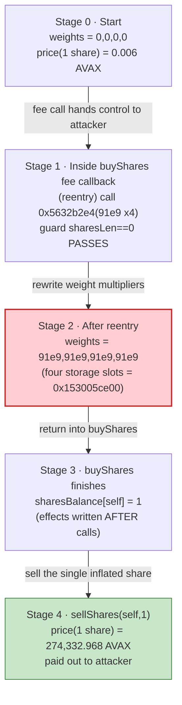
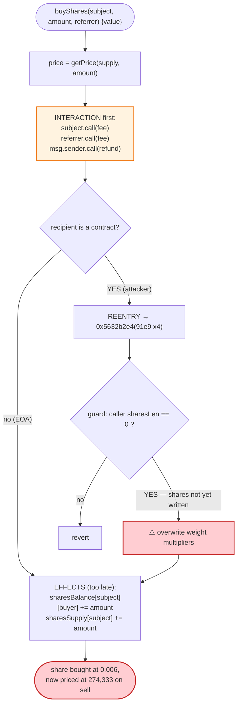

# Stars Arena Exploit — `buyShares` Reentrancy Inflates the Price-Curve Weight

> **Vulnerability classes:** vuln/reentrancy/single-function · vuln/logic/state-update

> **One-line summary:** A check-effects-interaction violation in Stars Arena's `buyShares`
> flow paid the AVAX fee to the attacker **before** writing the share-balance state, letting the
> attacker reenter a permissionless 4-parameter weight setter (`0x5632b2e4`) and rewrite the
> price-curve multipliers, so that **1 share bought for 0.006 AVAX sold back for 274,332 AVAX**.

> **Reproduction:** the PoC runs against an Avalanche C-Chain fork in an isolated Foundry
> project at [this project folder](.). Full verbose trace:
> [output.txt](output.txt). The PoC itself: [test/StarsArena_exp.sol](test/StarsArena_exp.sol).
>
> **Source-availability caveat:** Stars Arena's implementation contract was **never verified**
> on-chain (this opacity was widely criticised after the hack). The only sources downloaded into
> [sources/](sources/) are the OpenZeppelin `TransparentUpgradeableProxy` boilerplate that fronts
> the logic contract. The vulnerable logic itself is reconstructed from the on-chain `-vvvvv`
> execution trace (real storage writes, real `Trade` events, real value transfers) cross-checked
> against the public bytecode-level analyses by SlowMist, PeckShield, BlockSec/Phalcon, Halborn,
> CertiK and Neptune Mutual. Code blocks labelled *reconstructed* are pseudo-Solidity matching the
> decompiled bytecode behaviour, not a verified source file.

---

## Key info

| | |
|---|---|
| **Loss** | **266,102.97 AVAX (~$2.9M)** drained from the Stars Arena shares contract |
| **Vulnerable contract** | Stars Arena proxy [`0xA481B139a1A654cA19d2074F174f17D7534e8CeC`](https://snowtrace.io/address/0xa481b139a1a654ca19d2074f174f17d7534e8cec) (logic via `delegatecall` to `0x8aF92C23a169B58c2E5AC656D8D8a23FC725080f`, **unverified**) |
| **Victim / pool** | The shares contract's own AVAX balance (social-token bonding curve), not an AMM pair |
| **Attacker EOA** | [`0xa2ebf3fcd757e9be1e58b643b6b5077d11b4ad7a`](https://snowtrace.io/address/0xa2ebf3fcd757e9be1e58b643b6b5077d11b4ad7a) |
| **Attacker contract** | [`0x7f283edc5ec7163de234e6a97fdfb16ff2d2c7ac`](https://snowtrace.io/address/0x7f283edc5ec7163de234e6a97fdfb16ff2d2c7ac) |
| **Attack tx** | [`0x4f37ffecdad598f53b8d5a2d9df98e3c00fbda4328585eb9947a412b5fe17ac5`](https://snowtrace.io/tx/0x4f37ffecdad598f53b8d5a2d9df98e3c00fbda4328585eb9947a412b5fe17ac5) |
| **Chain / block / date** | Avalanche C-Chain / fork block **36,136,405** / **October 7, 2023** |
| **Compiler** | Solidity `v0.8.9+commit.e5eed63a`, optimizer **200 runs** (per proxy metadata) |
| **Bug class** | Reentrancy via check-effects-interaction violation → price-curve weight manipulation |

---

## TL;DR

Stars Arena is a "friend.tech"-style social app on Avalanche: each user (a *subject*) has *shares*
priced by an on-chain bonding curve. `buyShares` collects AVAX, splits a fee to the subject and a
protocol/referrer, and records the buyer's share balance.

The fatal ordering: **`buyShares` sends the fee out via a low-level AVAX `call` *before* it writes
the buyer's share-count state.** Because the fee recipient can be an attacker-controlled contract,
that `call` hands control back to the attacker mid-execution — classic reentrancy.

During that reentrant window the attacker calls the **permissionless** weight setter
`0x5632b2e4(uint256,uint256,uint256,uint256)`, passing `91000000000` (hex `0x153005ce00`) for all
four parameters. This rewrites the four price-curve multiplier storage slots that govern how
expensive a share is. A guard that should have blocked this (it checks the caller's recorded share
length is zero) passes **only because `buyShares` hasn't written that state yet** — the very
ordering bug being exploited.

After the buy completes, the attacker holds **1 share** but the contract now prices that share
using the inflated weights. A single `sellShares(self, 1)` returns **274,332.968 AVAX** gross
(266,102.98 AVAX to the attacker after fees). Starting from **1 AVAX**, the attacker walks away
with **266,103.97 AVAX**.

---

## Background — Stars Arena shares

Stars Arena uses a bonding-curve "shares" market modelled on friend.tech:

- **`buyShares` / `buySharesWithReferrer`** — the buyer sends AVAX. The contract computes the price
  for the next share from a curve, takes a *subject fee* and a *protocol/referrer fee*, forwards
  those fees by raw AVAX `call`, refunds any overpayment, and **then** increments the buyer's share
  balance and the subject's supply.
- **`sellShares`** — burns the caller's share(s), computes the sell price from the same curve, and
  pays out AVAX (less fees).
- A **price curve** parameterised by per-subject weight multipliers. The exploit's target,
  `0x5632b2e4`, is the setter for four of those multiplier slots.

The on-chain facts at the fork block, read from the trace:

| Fact | Value |
|---|---|
| Base price of the first share (`buyShares` supply 0→1) | **0.006 AVAX** (`6e15` wei, trace [output.txt:41](output.txt#L41)) |
| Buy fees (subject / attacker-receive / protocol) | `1.2e14` / `4.2e14` / `6e13` wei (trace [:41](output.txt#L41)) |
| Total buy cost | **0.014 AVAX** (`1.4e16` wei); the other 0.9934 AVAX refunded |
| Weight value injected by reentry | `91000000000` = `0x153005ce00` (4 slots) |
| Sell payout for that **same 1 share** | **274,332.968 AVAX** (`2.743e23` wei, trace [:59](output.txt#L59)) |

The price for 1 share jumping from `0.006 AVAX` to `274,333 AVAX` — a **~45-million-fold** increase
— is the entire game, and it comes purely from rewriting the weight multipliers between the buy and
the sell.

---

## The vulnerable code

> *Reconstructed* from the decompiled logic and matched against the live trace. The real source was
> unverified; the **behaviour** below is exactly what the trace shows.

### 1. `buyShares` sends the fee (external call) before updating share state

```solidity
// reconstructed from bytecode + trace; selector 0xe9ccf3a3 = buySharesWithReferrer(address,uint256,address)
function _buyShares(address subject, uint256 amount, address referrer) internal {
    uint256 supply = sharesSupply[subject];
    uint256 price  = getPrice(supply, amount);              // curve uses the WEIGHT multipliers
    uint256 subjectFee  = price * subjectFeePercent  / 1e18;
    uint256 protocolFee = price * protocolFeePercent / 1e18;
    require(msg.value >= price + subjectFee + protocolFee, "insufficient payment");

    // ─────────── INTERACTION (happens FIRST — the bug) ───────────
    (bool s1,) = subject.call{value: subjectFee}("");       // ⚠️ hands control to attacker
    (bool s2,) = referrer.call{value: protocolFee}("");     //    (attacker is subject + referrer)
    (bool s3,) = msg.sender.call{value: msg.value - price - subjectFee - protocolFee}(""); // refund
    require(s1 && s2 && s3);

    // ─────────── EFFECTS (happen LAST — too late) ───────────
    sharesBalance[subject][msg.sender] += amount;           // ⚠️ written AFTER the calls
    sharesSupply[subject]              += amount;
    // ... shareholders[]/length bookkeeping also updated here
}
```

In the trace this is visible at [output.txt:19-48](output.txt#L19-L48): the proxy `delegatecall`s the
logic, which fires three value transfers — to `0x3e74…` (`1.2e14`), back to the **attacker**
(`4.2e14`, [:23](output.txt#L23)), and the `0.9934` refund ([:37](output.txt#L37)) — and only after
all of them writes the share-balance storage slots ([:43-46](output.txt#L43-L46)).

### 2. The reentered weight setter `0x5632b2e4` is permissionless

```solidity
// reconstructed; selector 0x5632b2e4 takes four uint256 weight multipliers
function setWeights(uint256 a, uint256 b, uint256 c, uint256 d) external {
    // GUARD the attacker bypasses: only allowed when caller has no recorded shares yet.
    // During reentry this passes BECAUSE _buyShares hasn't written sharesBalance/length yet.
    require(sharesBalance[msg.sender] == 0 /* length == 0 */, "already initialised");

    weight_a = a;   // 91e9
    weight_b = b;   // 91e9
    weight_c = c;   // 91e9
    weight_d = d;   // 91e9   ← these feed getPrice()
}
```

In the trace the reentrant call is [output.txt:24-33](output.txt#L24-L33): the attacker's `receive()`
calls `0x5632b2e4` with four `0x153005ce00` words, and the logic writes **four storage slots** to
`0x153005ce00` (= `91000000000`):

```
@ 0xcec6dc…926: 0 → 0x…153005ce00
@ 0x9272e4…b9: 0 → 0x…153005ce00
@ 0xc37f52…1c: 0 → 0x…153005ce00
@ 0x5dfbc5…e3: 0 → 0x…153005ce00
```

plus an init flag `@ 0x976b55…354: 0 → 1` ([:27](output.txt#L27)). These four slots are the
price-curve weights `getPrice()` reads when `sellShares` later computes the payout.

### 3. `getPrice` is dominated by the weights

```solidity
// reconstructed shape; the precise polynomial is bytecode-only, but the trace proves the dependence
function getPrice(uint256 supply, uint256 amount) public view returns (uint256) {
    // price ≈ f(supply, amount) * weight_a * weight_b ... / SCALE
    // with weight_* set to 91e9 each, the curve output explodes by many orders of magnitude
}
```

The proof is mechanical: between the buy and the sell **nothing changed except the four weight
slots**, yet the price for the identical 1 share moved from `0.006` to `274,333` AVAX.

---

## Root cause

A single ordering mistake, amplified by a missing reentrancy guard and a permissionless setter:

1. **Check-effects-interaction violated.** `buyShares` performs external AVAX `call`s (subject fee,
   referral fee, overpayment refund) **before** it updates `sharesBalance` / share-length state. Any
   recipient that is a contract gets a reentrancy window with the contract in a half-updated state.
2. **No `nonReentrant` guard.** Nothing prevents reentering the contract during that window.
3. **The reentered setter is permissionless and its guard is defeated by the same ordering bug.**
   `0x5632b2e4` is callable by anyone, gated only by a "caller has no shares yet" style check. During
   reentry that check passes precisely because `buyShares` has *not yet* recorded the attacker's
   shares — so the attacker can (re)initialise the price weights to arbitrary values.
4. **The weights are the sole driver of the sell price** and are not bounded, so setting them to
   `91e9` inflates one share's value by ~45 million×.

In short: the attacker uses the fee callback that `buyShares` itself triggers to reach back into the
contract and rewrite the very parameters that determine how much their freshly-bought share is worth
on the way out.

---

## Preconditions

- The fee/refund recipient during `buyShares` is attacker-controlled (the attacker passes **its own
  contract** as both `subject` and `referrer`, trace [:19](output.txt#L19)), so the AVAX `call`
  re-enters attacker code.
- The weight setter `0x5632b2e4`'s guard is satisfiable during reentry (caller's recorded shares ==
  0), which holds because `buyShares` writes that state only after the fee calls.
- Trivial working capital: the attack starts with **1 AVAX** ([test/StarsArena_exp.sol:27](test/StarsArena_exp.sol#L27)),
  of which only 0.014 AVAX is actually spent on the buy; the rest is refunded in-tx. No flash loan
  needed.

---

## Step-by-step attack walkthrough

The whole exploit is **two outer calls** (`buyShares`, then `sellShares`) plus **one reentrant call**
nested inside the first. All numbers are read directly from [output.txt](output.txt).

| # | Actor / call | What happens | Numbers (from trace) |
|---|---|---|---|
| 0 | `deal(this, 1 AVAX)` | Attacker seeds itself with 1 AVAX | balance = 1.000000 AVAX ([:18](output.txt#L18)) |
| 1 | `buySharesWithReferrer(self, 1, self)` `{value: 1 AVAX}` | Buys 1 share of itself; selector `0xe9ccf3a3` ([:19](output.txt#L19)) | base price 0.006 AVAX; total cost 0.014 AVAX |
| 2 | fee `call` → `0x3e74…` | Subject/protocol fee leg | `1.2e14` wei ([:21](output.txt#L21)) |
| 3 | fee `call` → **attacker** `receive()` | **Reentry trigger** — AVAX sent to attacker before shares written | `4.2e14` wei ([:23](output.txt#L23)) |
| 4 | **(reentrant)** `0x5632b2e4(91e9,91e9,91e9,91e9)` | Attacker rewrites the four price-curve weight slots → `0x153005ce00`; sets init flag | 4 slots `0 → 91000000000` ([:26-31](output.txt#L26-L31)) |
| 5 | refund `call` → attacker | Overpayment returned | `0.9934` AVAX ([:37](output.txt#L37)) |
| 6 | fee `call` → `0x3e74…` | Second fee leg | `6e13` wei ([:39](output.txt#L39)) |
| 7 | `buyShares` effects | Shares finally recorded; `Trade(buy, amount 1, price 6e15, …)` emitted | share-balance slots `0 → 1` ([:43-46](output.txt#L43-L46)) |
| 8 | `sellShares(self, 1)` | Sells the **same 1 share**; price now computed from inflated weights | gross **274,332.968 AVAX** ([:49-59](output.txt#L49-L59)) |
| 9 | payout `call`s → attacker | Two legs to attacker | `246,899.6712` + `19,203.30776` AVAX ([:51](output.txt#L51),[:55](output.txt#L55)) |
| 10 | fee `call`s → `0x3e74…` | Sell fees | `5,486.66` + `2,743.33` AVAX ([:53](output.txt#L53),[:57](output.txt#L57)) |
| 11 | end | Attacker balance | **266,103.97278 AVAX** ([:67](output.txt#L67)) |

The PoC's `receive()` ([test/StarsArena_exp.sol:42-48](test/StarsArena_exp.sol#L42-L48)) is the
reentrancy hook: it fires on step 3's incoming AVAX and performs step 4, guarded by a `reenter` flag
so it only triggers once.

---

## Profit / loss accounting (AVAX)

Verified against the `Trade` events in the trace:

| Direction | Amount (AVAX) | Source |
|---|---:|---|
| Start balance (`deal`) | 1.000000 | [:18](output.txt#L18) |
| Spent on buy (net of refund) | −0.014 | [:41](output.txt#L41) (`total = 1.4e16`) |
| **Sell gross** | **274,332.968** | [:59](output.txt#L59) |
| ‑ paid to attacker (leg 1) | 246,899.6712 | [:51](output.txt#L51) |
| ‑ paid to attacker (leg 2) | 19,203.30776 | [:55](output.txt#L55) |
| ‑ sell fees to `0x3e74…` | −8,229.98904 | [:53](output.txt#L53),[:57](output.txt#L57) |
| Attacker net from sell | +266,102.97896 | (legs 1+2) |
| **Final attacker balance** | **266,103.97278** | [:67](output.txt#L67) |
| **Net profit** | **+266,102.97278** | (final − 1.0 start) |

The legs reconcile to the wei: `246,899.6712 + 19,203.30776 + 5,486.65936 + 2,743.32968 =
274,332.968` = the sell gross. Profit ≈ **266,103 AVAX ≈ $2.9M** at the time.

---

## Diagrams

### Sequence of the attack

```mermaid
sequenceDiagram
    autonumber
    actor A as "Attacker contract"
    participant PX as "Proxy 0xA481…"
    participant L as "Logic 0x8aF9… (delegatecall)"

    Note over A,L: balance(A) = 1 AVAX; share weights = 0

    A->>PX: "buySharesWithReferrer(self, 1, self) {value: 1 AVAX}"
    PX->>L: delegatecall
    L->>L: "price = getPrice(0,1) = 0.006 AVAX (weights still 0)"

    rect rgb(255,235,238)
    Note over A,L: INTERACTION runs before EFFECTS (the bug)
    L-->>A: "call{value: 4.2e14} (fee leg) — REENTRY"
    activate A
    A->>PX: "0x5632b2e4(91e9, 91e9, 91e9, 91e9)"
    PX->>L: delegatecall
    L->>L: "guard sharesLen==0 PASSES (shares not yet written)"
    L->>L: "weight_a/b/c/d = 91000000000"
    deactivate A
    L-->>A: "call{value: 0.9934} refund"
    end

    L->>L: "EFFECTS: sharesBalance[self]+=1, supply+=1 (too late)"
    L-->>PX: emit "Trade(buy, amount 1, price 6e15)"

    A->>PX: "sellShares(self, 1)"
    PX->>L: delegatecall
    L->>L: "price = getPrice(1,1) with inflated weights = 274,332.968 AVAX"
    L-->>A: "call 246,899.67 AVAX + call 19,203.31 AVAX"
    L-->>PX: emit "Trade(sell, amount 1, value 2.743e23)"

    Note over A: "balance(A) = 266,103.97 AVAX (profit ≈ 266,103)"
```

### Price-weight state evolution



### The flaw inside `buyShares`



---

## Why the guard fails (the crux)

The setter `0x5632b2e4` is meant to be a one-time per-subject initialisation: *"you may set the
weights only while you have no shares."* Under correct check-effects-interaction ordering, by the
time any external call inside `buyShares` could fire, the buyer's shares would already be recorded —
so the `sharesLen == 0` guard would be **false** and the reentrant `setWeights` would revert.

Because the fee/refund `call`s execute **before** the share write, the guard is still **true** during
reentry. The attacker therefore re-initialises the weights *after* committing to buy at the old
(cheap) price but *before* the share is finalised, then sells at the new (inflated) price. The bug
and its enabler are the same line ordering.

---

## Remediation

1. **Apply check-effects-interaction.** Update `sharesBalance` / `sharesSupply` / share-length state
   **before** sending any AVAX (`subject.call`, `referrer.call`, refund). With the effects written
   first, the `sharesLen == 0` guard on `0x5632b2e4` evaluates `false` during any reentry and the
   weight rewrite reverts.
2. **Add a `nonReentrant` guard** (OpenZeppelin `ReentrancyGuard`) to `buyShares`, `sellShares`, and
   the weight setter so no cross-function reentrancy window exists at all.
3. **Lock down the weight setter.** `0x5632b2e4` should be `onlyOwner`/admin-gated (or strictly
   one-shot at subject creation), never freely callable, and certainly never re-runnable mid-trade.
4. **Bound the price parameters.** Reject weight values outside a sane range; a multiplier of `91e9`
   that turns a 0.006 AVAX share into 274,333 AVAX should be impossible by construction.
5. **Prefer push-less fee accounting / pull payments.** Accrue subject and protocol fees to a balance
   that recipients withdraw later, removing the arbitrary external `call` from the hot path.
6. **Verify the source.** The contract was unverified at the time of the hack, which slowed response
   and review. Verified, audited source is table stakes for a value-holding contract.

---

## How to reproduce

```bash
_shared/run_poc.sh 2023-10-StarsArena_exp --mt testExploit -vvvvv
```

- RPC: an **Avalanche C-Chain archive** endpoint is required (fork block **36,136,405**).
  `foundry.toml` uses `https://api.avax.network/ext/bc/C/rpc`.
- Result: `[PASS] testExploit()` — attacker AVAX balance goes from **1.0** to **266,103.97**.

Expected tail (from [output.txt](output.txt)):

```
Ran 1 test for test/StarsArena_exp.sol:ContractTest
[PASS] testExploit() (gas: 268168)
Logs:
  Attacker AVAX balance before exploit: 1.000000000000000000
  Attacker AVAX balance after exploit: 266103.972780000000000000

Suite result: ok. 1 passed; 0 failed; 0 skipped
```

---

*References (public bytecode-level analyses, source was unverified): SlowMist —
https://slowmist.medium.com/a-deep-dive-into-the-stars-arena-attack-765649d7fc6a ; Halborn —
https://www.halborn.com/blog/post/explained-the-stars-arena-hack-october-2023 ; Neptune Mutual —
https://medium.com/neptune-mutual/analysis-of-the-stars-arena-exploit-c47605e04cd5 ; PeckShield /
BlockSec / Phalcon threads linked in the PoC header.*
