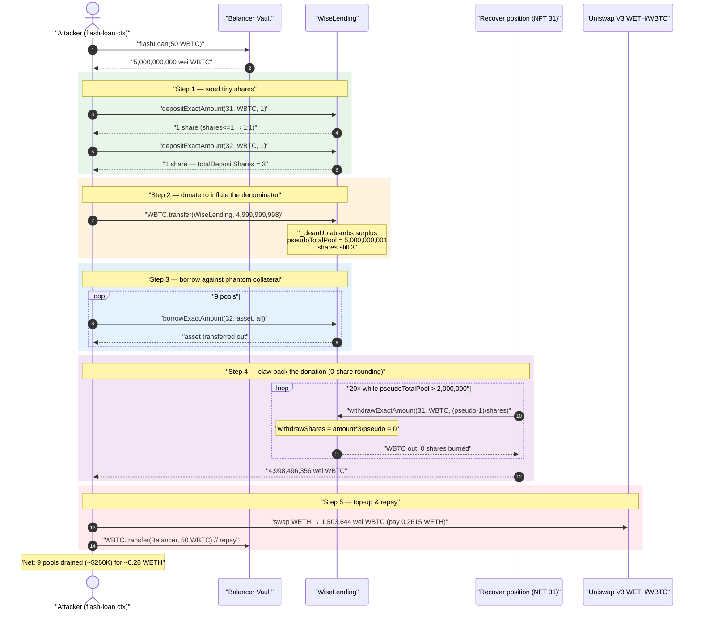
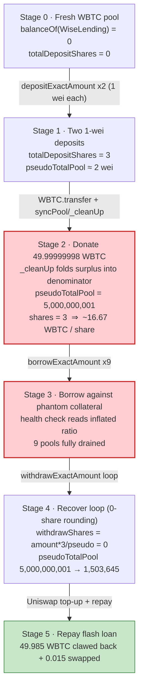
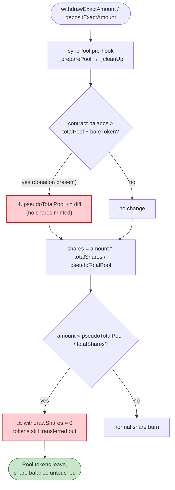

# Wise Lending Exploit — First-Depositor Share Inflation via `pseudoTotalPool` Donation

> **Vulnerability classes:** vuln/arithmetic/rounding · vuln/arithmetic/precision-loss

> **Reproduction:** the PoC compiles & runs in an isolated Foundry project at
> [this project folder](.) (the umbrella DeFiHackLabs repo contains many
> unrelated PoCs that do not whole-compile, so this one was extracted).
> Full verbose trace: [output.txt](output.txt).
> Verified vulnerable source: [contracts_WiseLending.sol](sources/WiseLending_84524b/contracts_WiseLending.sol),
> [contracts_MainHelper.sol](sources/WiseLending_84524b/contracts_MainHelper.sol).

---

## Key info

| | |
|---|---|
| **Loss** | ~$260,000 (rescued by a whitehat; same bug, same tx pattern an attacker would have used) — 9 different pool assets drained from Wise Lending |
| **Vulnerable contract** | `WiseLending` — [`0x84524bAa1951247b3A2617A843e6eCe915Bb9674`](https://etherscan.io/address/0x84524baa1951247b3a2617a843e6ece915bb9674#code) |
| **Victim** | Wise Lending pools (WBTC collateral pool + every borrowable pool: wstETH, WETH, aEthWETH, DAI, sDAI, aEthDAI, aEthUSDC, aEthUSDT, USDC) |
| **Attacker EOA** | `c0ffeebabe.eth` (whitehat) |
| **Attacker / MEV contract** | [`0x3aa228a80f50763045bdfc45012da124bd0a6809`](https://etherscan.io/address/0x3aa228a80f50763045bdfc45012da124bd0a6809) |
| **Attack tx** | [`0x7ac4a98599596adbf12fffa2bd23e2a2d2ac7e8989b6ea043fcc412a29126555`](https://etherscan.io/tx/0x7ac4a98599596adbf12fffa2bd23e2a2d2ac7e8989b6ea043fcc412a29126555) |
| **Chain / block / date** | Ethereum mainnet / fork at 18,342,120 / October 13, 2023 |
| **Compiler** | Solidity v0.8.21, optimizer 200 runs (verified `_meta.json`) |
| **Bug class** | First-depositor / donation share-price inflation + division-rounding share theft (ERC4626-style) |

---

## TL;DR

Wise Lending prices lending shares with the classic `shares = amount * totalShares / pseudoTotalPool`
formula ([contracts_MainHelper.sol:55-57](sources/WiseLending_84524b/contracts_MainHelper.sol#L55-L57)).
The denominator `pseudoTotalPool` is **not** the value the protocol itself moves in/out — it can be
inflated by a *direct token transfer* to the contract, because the pool's `syncPool` modifier runs
`_cleanUp()`, which reads the contract's raw ERC20 balance and folds any surplus
(`amountContract - (totalPool + bareToken)`) straight into `pseudoTotalPool`
([contracts_MainHelper.sol:226-255](sources/WiseLending_84524b/contracts_MainHelper.sol#L226-L255)).

The attacker:

1. Flash-loans **50 WBTC** from Balancer.
2. Opens two positions and deposits **1 wei** of WBTC into each, minting **1 share** each (a brand-new
   pool, so the `shares <= 1` short-circuit returns `amount` 1:1).
3. **Donates 49.99999998 WBTC** directly to `WiseLending`. The next `syncPool` absorbs it, so the WBTC
   pool now reports `pseudoTotalPool = 5,000,000,001` wei backed by only **3** total shares — each share
   is now "worth" ~16.67 WBTC.
4. **Borrows the entire reserves of nine other pools** against the borrower position, because the
   collateral valuation reads the same inflated `pseudoTotalPool`/share ratio.
5. **Recovers the donated WBTC** through `withdrawExactAmount`: each withdrawal of ~1/3 of the pool
   computes `withdrawShares = amount * 3 / pseudoTotalPool` which **rounds down to 0**, so it pulls real
   WBTC out while burning **zero** shares. Looping pulls ~all 50 WBTC back out.
6. Repays the 50-WBTC flash loan (covering a tiny ~0.015 WBTC residual with a Uniswap-V3 WETH→WBTC swap).

Net result: the attacker walks away with all nine borrowed assets (~$260K) for the cost of one
Uniswap swap (~0.26 WETH). Because the borrow collateral was a phantom valuation, the loans are never
repaid and the lending pools are left insolvent.

---

## Background — how Wise Lending accounts for deposits

Wise Lending is a multi-asset lending market. Each pool tracks two parallel quantities for the supply
side:

- **`totalPool`** — tokens actually available to lend out (the "real" balance the protocol controls).
- **`pseudoTotalPool`** — the *valuation* basis: real tokens + accrued lending interest. Lending shares
  are minted/redeemed against this number, not against `totalPool`.
- **`totalDepositShares`** — total supply of lending shares for the pool.

A depositor receives `shares = amount * totalDepositShares / pseudoTotalPool`
([calculateLendingShares](sources/WiseLending_84524b/contracts_MainHelper.sol#L31-L58)), and a
withdrawer burns the symmetric `shares = withdrawAmount * totalDepositShares / pseudoTotalPool`
([_preparationsWithdraw → calculateLendingShares](sources/WiseLending_84524b/contracts_MainHelper.sol#L144-L163)).

Every state-changing entry point (`depositExactAmount`, `withdrawExactAmount`, `borrowExactAmount`, …)
is wrapped in the `syncPool` modifier ([contracts_WiseLending.sol:67-77](sources/WiseLending_84524b/contracts_WiseLending.sol#L67-L77)),
whose pre-hook calls `_preparePool → _cleanUp → _updatePseudoTotalAmounts`.

On-chain parameters of the WBTC pool at the fork block (from the trace):

| Parameter | Value |
|---|---|
| WBTC pool state before attack | empty / freshly usable (`balanceOf(WiseLending) = 0`) |
| `totalDepositShares(WBTC)` after 2× 1-wei deposits | 3 (1 + 1 + the implicit `+1` baseline) |
| `pseudoTotalPool(WBTC)` after donation | **5,000,000,001 wei** (≈ 50 WBTC) |
| WBTC decimals | 8 (`50 * 1e8 = 5,000,000,000`) |
| Flash-loan size | 50 WBTC (Balancer, fee-free) |

That ratio — **3 shares backing ~50 WBTC of valuation** — is the entire exploit.

---

## The vulnerable code

### 1. Share price = amount × shares ÷ pseudoTotalPool (manipulable denominator)

```solidity
// contracts_MainHelper.sol
function calculateLendingShares(
    address _poolToken,
    uint256 _amount
)
    public
    view
    returns (uint256)
{
    uint256 shares = getTotalDepositShares(_poolToken);

    if (shares <= 1) {
        return _amount;                 // ← first depositor gets 1:1 (no floor / no dead shares)
    }

    uint256 pseudo = getPseudoTotalPool(_poolToken);

    if (pseudo == 0) {
        return _amount;
    }

    return _amount
        * shares
        / pseudo;                       // ⚠️ integer division → rounds DOWN, can return 0
}
```

[contracts_MainHelper.sol:31-58](sources/WiseLending_84524b/contracts_MainHelper.sol#L31-L58)

### 2. `_cleanUp` turns a raw transfer (donation) into `pseudoTotalPool`

```solidity
// contracts_MainHelper.sol  — runs inside syncPool's pre-hook (_preparePool)
function _cleanUp(address _poolToken) internal {
    uint256 amountContract = IERC20(_poolToken).balanceOf(address(this)); // ⚠️ raw balance
    uint256 totalPool      = getTotalPool(_poolToken);
    uint256 bareToken      = getTotalBareToken(_poolToken);

    if (_checkCleanUp(amountContract, totalPool, bareToken)) {            // bare+total >= balance ?
        return;
    }

    uint256 diff = amountContract - (totalPool + bareToken);             // the donated surplus
    _increaseTotalAndPseudoTotalPool(_poolToken, diff);                  // ⚠️ folded into the denominator
}
```

[contracts_MainHelper.sol:226-255](sources/WiseLending_84524b/contracts_MainHelper.sol#L226-L255)

`_checkCleanUp` is just `bareToken + totalPool >= amountContract`
([:206-216](sources/WiseLending_84524b/contracts_MainHelper.sol#L206-L216)) — so any token sent
directly to the contract, above what the bookkeeping expects, is treated as "found money" and credited
to the pool's valuation *without minting any shares for it*.

### 3. Deposit / withdraw both go through the same manipulable ratio

```solidity
// contracts_WiseLending.sol
function depositExactAmount(uint256 _nftId, address _poolToken, uint256 _amount)
    public syncPool(_poolToken) returns (uint256)
{
    uint256 shareAmount = calculateLendingShares(_poolToken, _amount); // ratio in
    _handleDeposit(msg.sender, _nftId, _poolToken, _amount, shareAmount);
    _safeTransferFrom(_poolToken, msg.sender, address(this), _amount);
    return shareAmount;
}

function withdrawExactAmount(uint256 _nftId, address _poolToken, uint256 _withdrawAmount)
    external syncPool(_poolToken) returns (uint256)
{
    uint256 withdrawShares = _preparationsWithdraw(    // == calculateLendingShares(amount)
        _nftId, msg.sender, _poolToken, _withdrawAmount
    );
    _coreWithdrawToken(msg.sender, _nftId, _poolToken, _withdrawAmount, withdrawShares);
    _safeTransfer(_poolToken, msg.sender, _withdrawAmount);             // ⚠️ tokens out…
    // …even when withdrawShares == 0
    return withdrawShares;
}
```

[depositExactAmount:279-309](sources/WiseLending_84524b/contracts_WiseLending.sol#L279-L309) ·
[withdrawExactAmount:520-560](sources/WiseLending_84524b/contracts_WiseLending.sol#L520-L560)

There is **no check that `withdrawShares > 0`** and **no check that the requested withdraw amount is
backed by the caller's share balance in token terms**. A withdrawal that rounds to 0 shares still
transfers out the requested tokens.

---

## Root cause

Two independent flaws compose into a critical theft:

1. **The valuation denominator is attacker-controllable for free.** `pseudoTotalPool` is supposed to
   reflect protocol-owned value, but `_cleanUp` lets *anyone* inflate it by `transfer`-ing tokens to the
   contract — no share is minted in exchange. So one (or a few) wei of shares can be made to "own" an
   arbitrarily large fraction of the pool. This is the textbook ERC4626 first-depositor / donation
   inflation, and Wise Lending has **no dead-shares mint, no virtual offset, and no minimum-liquidity
   floor** to neutralize it (`calculateLendingShares` returns `amount` 1:1 while `shares <= 1`).

2. **Withdrawals round shares-burned *down* but transfer the full token amount.** Because
   `withdrawShares = amount * totalShares / pseudoTotalPool` truncates, choosing
   `amount < pseudoTotalPool / totalShares` yields `withdrawShares = 0`. The attacker can therefore
   pull tokens out repeatedly while burning **zero** shares — recovering the donated capital without
   collapsing the inflated ratio.

The first flaw lets the attacker mint a position whose *collateral valuation* is enormous relative to
the trivial WBTC it actually controls, so the borrow-side health check (which reads the same inflated
ratio) approves draining every other pool. The second flaw lets the attacker get its working capital
(the donated 50 WBTC) back, making the whole thing a near-free flash-loan round trip.

> The donated WBTC is never the prize. It is *bait*: it inflates the share price so the borrow check is
> fooled, then it is clawed back via the zero-share-rounding withdrawal. The prize is the nine pools of
> borrowable assets the phantom collateral unlocks.

---

## Preconditions

- A pool with a **tiny `totalDepositShares`** (here the attacker creates it by being the first/only
  depositor with 1-wei deposits — `shares <= 1` path mints 1:1, then a second 1-wei deposit). A fresh
  or near-empty pool is ideal.
- Ability to **transfer the donation directly** to `WiseLending` so `_cleanUp` absorbs it into
  `pseudoTotalPool` on the next `syncPool` — true for any ERC20 (no allowance/approval of the donation
  is needed, just a plain `transfer`).
- **Working capital** in the collateral asset to make the donation; here 50 WBTC, obtained via a
  fee-free **Balancer flash loan** and fully repaid in the same transaction — so the real cost is just
  the residual Uniswap swap (~0.26 WETH).
- The withdraw-recovery only works while `withdrawAmount * totalShares / pseudoTotalPool` truncates to
  0, i.e. while `withdrawAmount < pseudoTotalPool / totalShares` (~16.67 WBTC per share here), which the
  attacker satisfies by withdrawing ~1/3 of the remaining pool each iteration.

---

## Step-by-step attack walkthrough (ground-truth numbers from the trace)

All values below are read directly from [output.txt](output.txt) (`depositExactAmount` /
`borrowExactAmount` / `withdrawExactAmount` calls, `FundsDeposited` / `FundsBorrowed` /
`FundsWithdrawn` events, and `getPseudoTotalPool` / `getTotalDepositShares` static-call returns).

| # | Action (trace ref) | WBTC pool effect | Result |
|---|--------------------|------------------|--------|
| 0 | `Balancer.flashLoan(50 WBTC)` → `receiveFlashLoan` | — | Attacker holds 5,000,000,000 wei WBTC |
| 1 | `mintPositionForUser` ×2 → nftId **31** (recover), **32** (borrower) | — | Two empty positions |
| 2 | `depositExactAmount(31, WBTC, 1)` | shares 1→2, pseudo set | 1 share minted (`shares<=1` 1:1) |
| 3 | `depositExactAmount(32, WBTC, 1)` | shares 2→3 | 1 share minted; `totalDepositShares = 3` |
| 4 | `WBTC.transfer(WiseLending, 4,999,999,998)` (donation) | absorbed by next `_cleanUp` | `pseudoTotalPool(WBTC) = 5,000,000,001`, shares still **3** |
| 5 | `borrowExactAmount(32, …)` ×9 against the phantom collateral | drains 9 pools | see Profit table |
| 6 | `recover()` loop: 20× `withdrawExactAmount(31, WBTC, ~1/3 of pool)` each burning **0 shares** | pseudo 5,000,000,001 → 1,503,645 | 4,998,496,356 wei WBTC clawed back |
| 7 | Uniswap-V3 `WETH→WBTC` swap for the ~1,503,644 wei residual; pay 0.2615 WETH | — | enough WBTC to repay loan |
| 8 | `WBTC.transfer(Balancer, 5,000,000,000)` | — | flash loan repaid |

### The zero-share withdrawal, proven by the trace

At the start of the recover loop the trace reports:

```
getPseudoTotalPool(WBTC)   → 5000000001
getTotalDepositShares(WBTC) → 3
withdrawExactAmount(31, WBTC, 1666666666)
  FundsWithdrawn(... amount: 1666666666, shares: 0 ...)   ← 0 shares burned!
```

`recoverAmount = (pseudoTotalPool - 1) / totalDepositShares = (5,000,000,001 - 1) / 3 = 1,666,666,666`.
Burned shares = `1,666,666,666 * 3 / 5,000,000,001 = 0` (truncated). So 16.67 WBTC leave the pool for
**0 shares**. The next iteration withdraws `(remaining-1)/3` again, and the amounts decay geometrically
exactly as the trace shows:

```
1666666666, 1111111111, 740740741, 493827160, 329218107, 219478738,
146319159, 97546106, 65030737, 43353825, 28902550, 19268366, 12845578,
8563718, 5709146, 3806097, 2537398, 1691599, 1127732, 751822
```

The loop's guard is `while (getPseudoTotalPool(WBTC) > 2_000_000)`; it exits when the pool valuation
falls to `1,503,645` wei. Total recovered: **4,998,496,356 wei** (≈ 49.985 WBTC of the 50 donated).

---

## Profit / loss accounting

The nine assets borrowed against the phantom WBTC collateral (`FundsBorrowed` events + final balance
log in [output.txt](output.txt)):

| Asset | Amount drained | Decimals |
|---|---:|---|
| wstETH | 33.538664799002267467 | 18 |
| WETH | 0.339996372423526589 | 18 |
| aEthWETH | 98.969695913405122899 | 18 |
| DAI | 200.094287736946980059 | 18 |
| sDAI | 16,161.480100000000000000 | 18 |
| aEthDAI | 1,302.840070263627457089 | 18 |
| aEthUSDC | 5,108.839054 | 6 |
| aEthUSDT | 26,082.605241 | 6 |
| USDC | 50.000000 | 6 |

**Cost side:** the 50-WBTC flash loan is fully repaid (49.985 WBTC clawed back from Wise Lending +
0.015 WBTC bought on Uniswap V3 for **0.261513918503463417 WETH**). Balancer charges no fee. So the
attacker's net outlay is ~0.26 WETH and the take is the entire list above — roughly **$260K** at the
time (per the PoC's `@KeyInfo` header). This particular transaction was executed by `c0ffeebabe.eth`,
a whitehat, who returned the funds; the mechanics are identical to what a malicious actor would have
done.

The pools are left **insolvent**: the borrower position (nftId 32) still nominally holds the inflated
WBTC collateral on the books, but the actual WBTC was withdrawn via the recover position (nftId 31), so
no real assets back the nine outstanding loans.

---

## Diagrams

### Sequence of the attack



### WBTC pool valuation vs. real shares



### The two flaws inside the share math



---

## Remediation

1. **Decouple the share-price denominator from the raw contract balance.** Do not let `_cleanUp` credit
   arbitrary direct transfers into `pseudoTotalPool`. Track protocol-owned value through explicit
   deposit/withdraw/interest accounting only, and treat unexpected balance surpluses as skimmable fees
   to a treasury — never as instant valuation that unminted shares can claim.
2. **Add virtual shares / dead-share offset (OpenZeppelin ERC4626 mitigation).** Mint a permanent dead
   deposit at pool creation, or use the virtual-asset/virtual-share offset so the first depositor can
   never own a near-100% slice with a few wei. This makes the donation economically pointless.
3. **Reject zero-share state changes.** In `withdrawExactAmount` / `_coreWithdrawToken`, require
   `withdrawShares > 0` (and symmetrically require `shareAmount > 0` on deposit). A withdrawal that
   burns 0 shares but moves tokens is always a rounding-theft primitive.
4. **Round in the protocol's favor.** Round *shares burned* on withdrawal **up** and *shares minted* on
   deposit **down**, so a caller can never extract value via truncation.
5. **Enforce a minimum first deposit / minimum liquidity.** Block dust-sized first deposits that create
   `totalDepositShares <= 1`, the state that enables the 1:1 short-circuit and the subsequent inflation.

---

## How to reproduce

The PoC was extracted into a standalone Foundry project (the umbrella DeFiHackLabs repo has many
unrelated PoCs that fail `forge test`'s whole-project build):

```bash
_shared/run_poc.sh 2023-10-WiseLending_exp -vvvvv
```

- RPC: an **Ethereum archive** endpoint is required (fork block 18,342,120, Oct 2023). The PoC uses the
  `mainnet` alias from `foundry.toml`; most public mainnet RPCs prune that state and fail with
  `header not found` / `missing trie node`.
- Result: `[PASS] testExploit()` with the nine borrowed-asset balances logged.

Expected tail (from [output.txt](output.txt)):

```
Ran 1 test for test/WiseLending_exp.sol:ContractTest
[PASS] testExploit() (gas: 6891242)
  Attacker wstETH balance after exploit: 33.538664799002267467
  Attacker aEthWETH balance after exploit: 98.969695913405122899
  Attacker DAI balance after exploit: 200.094287736946980059
  Attacker sDAI balance after exploit: 16161.480100000000000000
  Attacker aEthDAI balance after exploit: 1302.840070263627457089
  Attacker aEthUSDC balance after exploit: 5108.839054
  Attacker aEthUSDT balance after exploit: 26082.605241
  Attacker USDC balance after exploit: 50.000000
Suite result: ok. 1 passed; 0 failed; 0 skipped
```

---

*References: BlockSec ([@BlockSecTeam](https://twitter.com/BlockSecTeam/status/1712871304993689709)),
SlowMist Hacked — https://hacked.slowmist.io/ (Wise Lending, Ethereum, ~$260K, whitehat rescue).*
