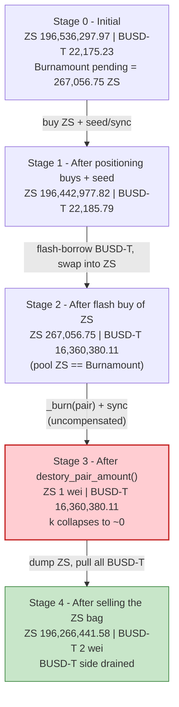
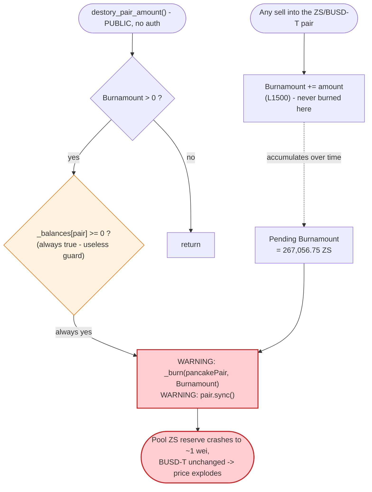
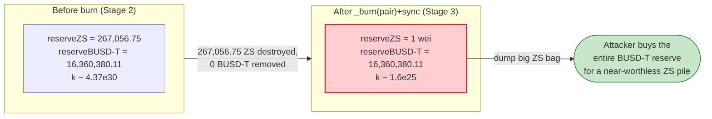

# ZS Token Exploit — Permissionless `destory_pair_amount()` Pool-Reserve Burn

> **Vulnerability classes:** vuln/access-control/missing-auth · vuln/oracle/price-manipulation

> **Reproduction:** the PoC compiles & runs in an isolated Foundry project at
> [this project folder](.) (the umbrella DeFiHackLabs repo
> contains many unrelated PoCs that do not whole-compile, so this one was extracted).
> Full verbose trace: [output.txt](output.txt).
> Verified vulnerable source: [contracts_ZS.sol](sources/ZS_12b3B6/contracts_ZS.sol).

---

## Key info

| | |
|---|---|
| **Loss** | ~$14,026 — **14,026.76 BUSD-T** drained from the ZS/BUSD-T PancakeSwap pair |
| **Vulnerable contract** | `ZS` — [`0x12b3B6b1055B8Ad1aE8F60a0B6C79A9825Bcb4bC`](https://bscscan.com/address/0x12b3b6b1055b8ad1ae8f60a0b6c79a9825bcb4bc#code) |
| **Victim pool** | ZS/BUSD-T PancakeSwap-V2 pair — `0x162888d39Cfb0990699aD1EA252521b2982ad690` |
| **Flash-loan source** | BUSD-T/USDC PancakeSwap-V3 pair — `0x4f31Fa980a675570939B737Ebdde0471a4Be40Eb` |
| **Attacker EOA** | `0x7ccf451d3c48c8bb747f42f29a0cde4209ff863e` |
| **Attacker contract** | `0xa905ff8853edc498a2acddfdfac4a56c2c599930` |
| **First attack tx** | `0xe2e87090f47c82eed3697297763edfad8e9689d2da7a4325541087d77432f54f` |
| **Second attack tx** | `0xbc88aa6057f9da6f88e28bc908baad111ae7545e69fb0c90fbdfd485c9e72192` |
| **Chain / block / date** | BSC / fork at 32,429,591 / Oct 8, 2023 |
| **Compiler** | Solidity ^0.8.10 |
| **Bug class** | Broken AMM invariant via a permissionless, un-compensated reserve burn |

(`BUSD-T` here is Binance-Peg BSC-USD, `0x55d3…7955`, an 18-decimal USD-pegged token; the trace labels it `BUSDT`.)

---

## TL;DR

`ZS` is a deflationary token that, on every **sell** into its PancakeSwap pair, accumulates the sold
amount into a public counter `Burnamount`
([contracts_ZS.sol:1500](sources/ZS_12b3B6/contracts_ZS.sol#L1500)). The function
`destory_pair_amount()` ([:1553-1563](sources/ZS_12b3B6/contracts_ZS.sol#L1553-L1563)) then **burns
`Burnamount` ZS directly out of the pair's balance and calls `pair.sync()`** — an *un-compensated*
removal of one side of the pool's reserves. No BUSD-T leaves the pair, so this single operation
**breaks the constant-product invariant `x·y = k`** by collapsing the ZS reserve to ~zero while the
BUSD-T reserve is untouched.

Crucially, `destory_pair_amount()` is declared `public` with **no access control**
([:1553](sources/ZS_12b3B6/contracts_ZS.sol#L1553)), so anyone can fire the reserve-burn at the moment
of their choosing.

The attacker:

1. **Buys** ZS through the router so it personally holds a large ZS bag (≈196.27M ZS by the time it
   matters), positioning itself as essentially the only ZS holder outside the pool.
2. **Flash-borrows** 16,339,183.76 BUSD-T from the BUSD-T/USDC V3 pair to bankroll the cornering.
3. Inside the flash callback, **swaps to leave the pool's ZS reserve sitting at ≈ the pending
   `Burnamount`** (267,056.75 ZS).
4. **Calls `ZS.destory_pair_amount()`** — `_burn(pancakePair, 267,056.75 ZS)` + `sync()` wipes the
   pool's ZS reserve from 267,056.75 → **1 wei** while leaving 16,360,380.11 BUSD-T in the pool.
5. **Sells its huge ZS bag** into the now-degenerate pool, pulling out essentially the entire BUSD-T
   reserve, repays the flash loan + fee, and keeps the difference.

Net result after repaying the 16.339M BUSD-T flash loan and its 8,169.59 BUSD-T fee, the attacker
walked away with **14,026.76 BUSD-T** of genuine pool liquidity.

---

## Background — what ZS does

`ZS` ([source](sources/ZS_12b3B6/contracts_ZS.sol)) is a BEP-20 (OpenZeppelin-style ERC20) with a
PancakeSwap-flavoured fee/deflation system bolted on. The relevant features:

- **Fee routing in `_transfer`** ([:1415-1517](sources/ZS_12b3B6/contracts_ZS.sol#L1415-L1517)) —
  buys take a `buyFee` (3%), sells a `sellFee`, transfers a `transferFee` (3%). Buys/sells are
  identified by whether `from`/`to == pancakePair`.
- **Per-user daily sell limit** — a `user_snap` snapshot caps sells at `dayrate/1000` (0.5%) of the
  seller's balance per day ([:1488-1499](sources/ZS_12b3B6/contracts_ZS.sol#L1488-L1499)).
- **Sell-burn accumulator** — on every sell, `Burnamount += amount`
  ([:1500](sources/ZS_12b3B6/contracts_ZS.sol#L1500)). This is *not* burned immediately; it is parked
  in a public counter.
- **The reserve burn** — `destory_pair_amount()` later burns the whole accumulated `Burnamount`
  out of the **pair** and `sync()`s it ([:1553-1563](sources/ZS_12b3B6/contracts_ZS.sol#L1553-L1563)).

The on-chain state at the fork block (read from the trace):

| Parameter | Value | Source |
|---|---|---|
| `Burnamount` (pending, accumulated from prior sells) | **267,056.75 ZS** | trace L178 |
| Pool ZS reserve (`reserve0`) | 196,536,297.97 ZS | trace L98 |
| Pool BUSD-T reserve (`reserve1`) | 22,175.23 BUSD-T | trace L98 |
| `buyFee` / `sellFee` / `transferFee` | 30 / 1000 / 30 (÷1000) | [:1273-1277](sources/ZS_12b3B6/contracts_ZS.sol#L1273-L1277) |
| `dayrate` | 5 (÷1000 = 0.5%/day sell cap) | [:1345](sources/ZS_12b3B6/contracts_ZS.sol#L1345) |
| `tradingEnabled` | true | [:1308](sources/ZS_12b3B6/contracts_ZS.sol#L1308) |

The single fact that makes this exploitable: a **non-trivial `Burnamount` is already pending**, and
anyone may detonate it against the pool's reserve at will.

---

## The vulnerable code

### 1. Every sell silently arms the bomb

```solidity
// _transfer(), sell branch (to == pancakePair, from != pancakePair)
} else {
    require(!from.isContract(), "ERC20: Transfer to contract address is not allowed");
    uint256 time = block.timestamp;
    uint256 open_days = (time - start_timestamp) / 86400;
    if ((user_snap[from].day == 0 && user_snap[from].amount == 0 ) || (user_snap[from].day < open_days)){
        uint256 user_totol =  IERC20(address(this)).balanceOf(from);
        uint256 max_amount = user_totol * dayrate / 1000;
        require((amount )  < max_amount , "transaction exceeds maximum limit");
        ...
    } else { ... }
    Burnamount += amount;          // ← accumulates sold amount; never auto-burned here
}
```
([contracts_ZS.sol:1479-1501](sources/ZS_12b3B6/contracts_ZS.sol#L1479-L1501))

### 2. The reserve burn is `public` and uncompensated

```solidity
function destory_pair_amount() public {        // ⚠️ no access control
    if (Burnamount > 0){
        if(_balances[pancakePair]  >= 0){       // ⚠️ always-true guard (uint >= 0)
            _burn(pancakePair, Burnamount);     // ⚠️ deletes ZS from the pair's balance...
            Burnamount = 0;
            IPancakePair(pancakePair).sync();   // ⚠️ ...then forces it to be the new reserve
        }
    }
    return ;
}
```
([contracts_ZS.sol:1553-1563](sources/ZS_12b3B6/contracts_ZS.sol#L1553-L1563))

`destory_pair_amount()` is also called as a side-effect of *non-AMM* transfers (the `else` branch of
`_transfer`, [:1510](sources/ZS_12b3B6/contracts_ZS.sol#L1510)), but the real problem is that it is a
**standalone public entry point** — the attacker does not need any transfer to trigger it; they call
it directly at the instant the pool is positioned for maximum profit.

The `if(_balances[pancakePair] >= 0)` check is a no-op: an unsigned balance is always `>= 0`. So the
only gate is "is there a pending `Burnamount`?".

---

## Root cause — why it was possible

A Uniswap-V2/PancakeSwap pair prices assets purely from its reserves and enforces `x·y ≥ k` only
*inside `swap()`*. `sync()` exists to let the pair adopt its real token balances as reserves — it
trusts that those balances move only through mint/burn/swap/transfers it can reason about.

`destory_pair_amount` violates that trust directly:

> It **destroys** ZS held by the pair (`_burn(pancakePair, Burnamount)`) and then calls
> `pair.sync()`, telling the pair "your ZS reserve is now this much smaller." No BUSD-T leaves the
> pair. The product `k` collapses and the marginal price of ZS explodes — **for free, callable by
> anyone.**

The composing design flaws:

1. **Permissionless trigger.** `destory_pair_amount()` has no `onlyOwner`/keeper restriction, so the
   attacker chooses *when* the reserve-shrinking burn fires — right after positioning the pool.
2. **Burning from the pool is a value transfer to ZS holders.** Removing ZS from the pair without
   removing BUSD-T shifts the entire BUSD-T side toward whoever still holds ZS. The attacker arranges
   to be essentially the only ZS holder before detonating.
3. **The burn amount is decoupled from the pool's size.** `Burnamount` is a *pre-accumulated*
   absolute quantity (267,056.75 ZS), independent of the current pool reserve. The attacker only has
   to shrink the pool's ZS reserve down to ≈ `Burnamount`, and the burn then **annihilates it to 1
   wei.**
4. **The "useless" `>= 0` guard.** The intended safety check (`_balances[pancakePair] >= remaining`)
   was mis-typed as `_balances[pancakePair] >= 0`, which is always true, so there is no balance
   sanity gate at all.

---

## Preconditions

- A pending `Burnamount > 0` accumulated from prior organic ZS sells. At the fork block this was
  **267,056.75 ZS** (trace L178). The attacker can also pad it with its own sells, but here the
  organic backlog was already large enough.
- `tradingEnabled == true` (it was) so the attacker's positioning swaps go through.
- Working capital in BUSD-T to corner the pool. This is supplied by a **flash loan** from the
  BUSD-T/USDC V3 pair and repaid in the same transaction (trace L187, L318), so the attack is
  effectively zero-capital beyond the flash fee.
- A subtle enabler: the AttackContract performs its first ZS buy/sell **inside its own constructor**
  (PoC [test/ZS_exp.sol:77-85](test/ZS_exp.sol#L77-L85)). During construction `extcodesize == 0`, so
  `isContract()` returns `false`, bypassing the `require(!to.isContract())` / `require(!from.isContract())`
  anti-contract guards in `_transfer` ([:1476](sources/ZS_12b3B6/contracts_ZS.sol#L1476),
  [:1480](sources/ZS_12b3B6/contracts_ZS.sol#L1480)). The PoC comments call this out explicitly.

---

## Attack walkthrough (with on-chain numbers from the trace)

The pair's `token0 = ZS`, `token1 = BUSD-T`, so `reserve0 = ZS`, `reserve1 = BUSD-T`.
All figures below are taken from the `Sync` / `Swap` / `Transfer` events in [output.txt](output.txt).

The PoC splits the attack into two transactions, matching the on-chain incident:

**First tx — constructor positioning** (`new AttackContract`, trace L57-168):

| # | Step | Pool ZS reserve | Pool BUSD-T reserve | Source |
|---|------|----------------:|--------------------:|--------|
| 0 | **Initial** ZS/BUSD-T pool | 196,536,297.97 | 22,175.23 | trace L98 |
| 1 | Buy: 0.1 BNB → 21.12 BUSD-T via WBNB/BUSD-T pool (`WBNBToBUSDT`) | — | — | trace L63-93 |
| 2 | Buy: 10.56 BUSD-T → 93,321.15 ZS into AttackContract (`BUSDTToZS`) | 196,442,976.82 | 22,185.79 | trace L96-135 |
| 3 | Seed: `BUSDT.transfer(pair, 1)` + `ZS.transfer(pair, 1e18)` + `pair.sync()` — arms `Burnamount` and refreshes reserves | 196,442,977.82 | 22,185.79 | trace L136-164 |

After tx 1 the attacker holds ZS and a pending `Burnamount` is in place. (`vm.roll(+2)` advances 2
blocks; PoC L53.)

**Second tx — the drain** (`exploitZS()` → flash callback, trace L176-323):

| # | Step | Pool ZS reserve | Pool BUSD-T reserve | Source |
|---|------|----------------:|--------------------:|--------|
| 4 | Read `Burnamount()` = **267,056.75 ZS**; compute flash size | 196,442,977.82 | 22,185.79 | trace L178, L183 |
| 5 | **Flash-borrow 16,339,183.76 BUSD-T** from BUSD-T/USDC V3 pair | — | — | trace L187, L195 |
| 6 | Inside callback: swap 16,338,194.32 BUSD-T → 196,175,921.06 ZS to attacker (`ZS_BUSDT.swap`), pushing pool ZS down to ≈ `Burnamount` | **267,056.75** | 16,360,380.11 | trace L207-240 |
| 7 | **`ZS.destory_pair_amount()`** — `_burn(pair, 267,056.75 ZS)` + `sync()` | **1 wei** | 16,360,380.11 | trace L241-256 |
| 8 | Sell the ZS bag back: `ZS.transfer(pair, 196,266,441.58 ZS)` then `swap(0, 16,360,380.11 BUSD-T)` to attacker | 196,266,441.58 | **2 wei** | trace L271-296 |
| 9 | Repay flash: `BUSDT.transfer(V3 pair, 16,347,353.35 BUSD-T)` (principal 16,339,183.76 + fee 8,169.59) | — | — | trace L297, L318 |
| 10 | **Send profit** `BUSDT.transfer(exploiter, 14,026.76 BUSD-T)` | — | — | trace L305-306 |

### Why "selling the bag empties the BUSD-T side"

After step 7 the pool is `(ZS = 1 wei, BUSD-T = 16,360,380.11)` — a degenerate pool where ZS is
priced absurdly high. PancakeSwap's `getAmountOut` is
`out = (in·9975·reserveOut) / (reserveIn·10000 + in·9975)`. With `reserveIn = 1 wei` and the
attacker's enormous `in = 196.27M ZS`, the denominator is dominated by `in`, so `out` approaches the
*entire* `reserveOut` (BUSD-T). The single sell at step 8 yields **16,360,380.11 BUSD-T out** for
2 wei left in the pool (trace L281-296). That is the whole BUSD-T reserve — the honest liquidity plus
the attacker's own flash-borrowed BUSD-T — handed to the attacker.

### Profit accounting (BUSD-T)

| Direction | Amount | Source |
|---|---:|--------|
| Borrowed (flash) | 16,339,183.76 | trace L187 |
| BUSD-T pulled out of ZS pool (step 8) | 16,360,380.11 | trace L283 |
| Repaid principal + fee to V3 pair | 16,347,353.35 | trace L297 |
| **Net profit to exploiter** | **14,026.76** | trace L305-306, L325 |

The exploiter's BUSD-T balance went from **0.000000** before to **14,026.755365** after
(trace L6-7 / L175 / L328), funded entirely by the ZS/BUSD-T pool's real liquidity. Starting capital
was 0.1 BNB (the seed for the tiny initial buys); the bulk of the working capital was flash-borrowed
and repaid intra-transaction.

---

## Diagrams

### Sequence of the attack

```mermaid
sequenceDiagram
    autonumber
    actor A as "Attacker (AttackContract)"
    participant R as PancakeRouter
    participant P as "ZS/BUSD-T Pair"
    participant Z as "ZS token"
    participant V3 as "BUSD-T/USDC V3 (flash)"

    Note over P: "Initial reserves<br/>196,536,297.97 ZS / 22,175.23 BUSD-T<br/>pending Burnamount = 267,056.75 ZS"

    rect rgb(255,243,224)
    Note over A,Z: "TX1 (constructor) - position & arm"
    A->>R: "buy ZS (BNB to BUSD-T to ZS)"
    R->>P: "swap()"
    P-->>A: "93,321.15 ZS"
    A->>P: "transfer 1 BUSD-T + 1e18 ZS, then sync()"
    Note over P: "reserves refreshed; Burnamount still pending"
    end

    rect rgb(227,242,253)
    Note over A,Z: "TX2 - flash, corner, detonate, drain"
    A->>V3: "flash 16,339,183.76 BUSD-T"
    V3-->>A: "BUSD-T"
    A->>P: "swap 16,338,194.32 BUSD-T to 196,175,921.06 ZS"
    Note over P: "pool ZS pushed down to 267,056.75 (== Burnamount)"
    end

    rect rgb(255,235,238)
    Note over A,Z: "the exploit"
    A->>Z: "destory_pair_amount()  (PUBLIC, no auth)"
    Z->>P: "_burn(pair, 267,056.75 ZS)"
    Z->>P: "sync()"
    Note over P: "1 wei ZS / 16,360,380.11 BUSD-T  -- invariant broken"
    end

    rect rgb(243,229,245)
    Note over A,Z: "drain & repay"
    A->>P: "transfer 196,266,441.58 ZS, then swap out BUSD-T"
    P-->>A: "16,360,380.11 BUSD-T (entire reserve)"
    A->>V3: "repay 16,347,353.35 BUSD-T (principal + fee)"
    A->>A: "keep 14,026.76 BUSD-T profit"
    end
```

### Pool state evolution



### The flaw inside `_transfer` / `destory_pair_amount`



### Why the burn is theft: constant-product before vs. after



---

## Remediation

1. **Never burn from the liquidity pool.** A burn must only ever destroy tokens the protocol *owns*
   (its own balance / a treasury). Removing `_burn(pancakePair, …)` + `pair.sync()` eliminates the
   bug entirely. If "deflation reaching the pool" is a product goal, implement it as a buy-and-burn
   funded by the protocol, not as a side-channel reserve deletion.
2. **Gate `destory_pair_amount()`.** At minimum mark it `internal`/`private` and/or restrict the
   external surface to a trusted keeper. As written it is `public` with no caller check and no
   reentrancy/atomicity constraint, so an attacker detonates it at the most profitable instant.
3. **Fix the dead guard.** `if(_balances[pancakePair] >= 0)` is always true. If a balance check was
   intended it must be `_balances[pancakePair] >= Burnamount`, and even then a pool burn is unsafe.
4. **Keep `k` invariant when adjusting pool balances.** If a token must change pool state, route it
   through the pair's own `burn()` (LP redemption) so both reserves move together and the
   constant-product invariant is preserved.
5. **Cap single-operation reserve impact.** Any operation that can move a pool reserve by more than a
   small percentage should revert; burning an absolute, externally-accumulated quantity that can equal
   ~100% of a thinned pool is the core hazard here.
6. **Do not rely on `isContract()` for anti-bot protection.** The attacker bypassed the
   `require(!isContract())` checks simply by acting from within its constructor. Use explicit
   allow/deny logic or a one-block delay instead.

---

## How to reproduce

The PoC was extracted into a standalone Foundry project (the umbrella DeFiHackLabs repo has many
unrelated PoCs that fail to compile under `forge test`'s whole-project build):

```bash
_shared/run_poc.sh 2023-10-ZS_exp --mt testExploit -vvvvv
```

- RPC: a **BSC archive** endpoint is required (the fork block 32,429,591 is from Oct 2023). Most
  public BSC RPCs prune historical state at that block and fail with `header not found` /
  `missing trie node`; configure an archive provider in `foundry.toml`.
- Result: `[PASS] testExploit()`.

Expected tail:

```
Ran 1 test for test/ZS_exp.sol:ZSExploit
[PASS] testExploit() (gas: 3053200)
Logs:
  Exploiter BUSDT balance before attack: 0.000000000000000000
  Exploiter BUSDT balance after attack: 14026.755365047874377260

Suite result: ok. 1 passed; 0 failed; 0 skipped
```

---

*Reference: post-mortem thread — https://x.com/MetaSec_xyz/status/1711189697534513327 (ZS, BSC, ~$14K).*
