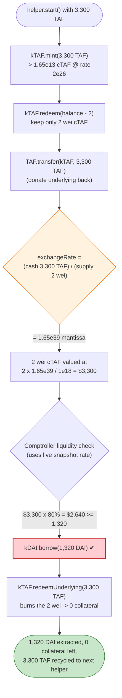
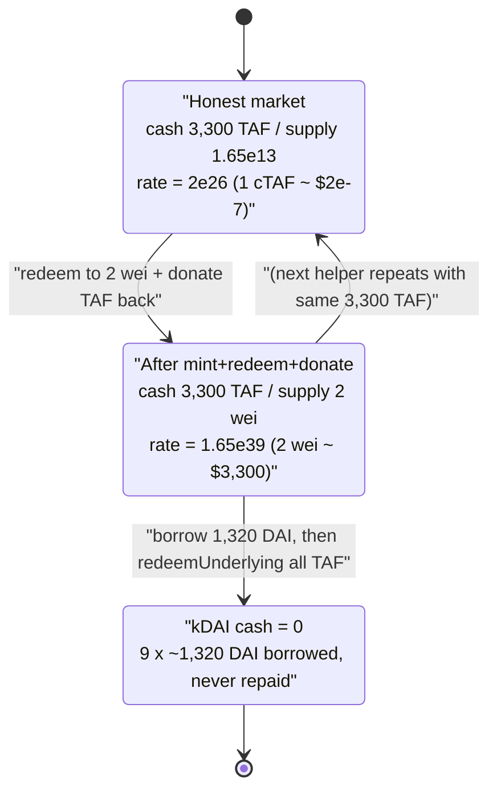

# Kerberus / kTAF Exploit — Compound-Fork Exchange-Rate Inflation via a Donatable, Tiny-Cash Collateral Token

> **Reproduction:** the PoC compiles & runs in an isolated Foundry project at
> [this project folder](.) (the umbrella DeFiHackLabs repo contains many
> unrelated PoCs that do not whole-compile, so this one was extracted).
> Full verbose trace: [output.txt](output.txt).
> Verified vulnerable sources: [CErc20Immutable.sol](sources/CErc20Immutable_f5140f/CErc20Immutable.sol),
> [AssetToken.sol](sources/AssetToken_f573E6/AssetToken.sol),
> [Unitroller.sol](sources/Unitroller_959Fb4/Unitroller.sol).

---

## Key info

| | |
|---|---|
| **Loss** | **~$8.19K** — `8,187.51 DAI` (the entire DAI cash of the `kDAI` market) drained, plus `3,300 TAF` retained |
| **Vulnerable contract** | `kTAF` (CErc20Immutable / Compound fork) — [`0xf5140fC35C6f94D02d7466f793fEB0216082d7E5`](https://etherscan.io/address/0xf5140fc35c6f94d02d7466f793feb0216082d7e5#code) |
| **Drained market** | `kDAI` (CErc20Immutable) — [`0xE5C6c14F466A4F3A73eCEc7F3aAaA15c5EcBc769`](https://etherscan.io/address/0xE5C6c14F466A4F3A73eCEc7F3aAaA15c5EcBc769) |
| **Collateral underlying** | `TAF` = `AssetToken` — [`0xf573E6740045b5387F6d36a26B102C2adF639af5`](https://etherscan.io/address/0xf573E6740045b5387F6d36a26B102C2adF639af5) |
| **Comptroller (Unitroller)** | [`0x959Fb43EF08F415da0AeA39BEEf92D96f41E41b3`](https://etherscan.io/address/0x959Fb43EF08F415da0AeA39BEEf92D96f41E41b3) (impl `0x2b26c6...d95b`) |
| **Attacker EOA** | [`0x9b99d7ce9e39c68ab93348fd31fd4c99f79e4b19`](https://etherscan.io/address/0x9b99d7ce9e39c68ab93348fd31fd4c99f79e4b19) |
| **Attacker contract** | [`0xa6d35c97bd00b99a962393408aaa9eb275a45c5e`](https://etherscan.io/address/0xa6d35c97bd00b99a962393408aaa9eb275a45c5e) |
| **Attack tx** | [`0x325999373f1aae98db2d89662ff1afbe0c842736f7564d16a7b52bf5c777d3a4`](https://etherscan.io/tx/0x325999373f1aae98db2d89662ff1afbe0c842736f7564d16a7b52bf5c777d3a4) |
| **Chain / fork block / date** | Ethereum mainnet / `18,385,885` / October 2023 |
| **Compiler** | `kTAF`/`kDAI`: Solidity `v0.5.12`, optimizer 200 runs · `AssetToken`/`Comptroller`: `v0.5.16` |
| **Bug class** | Compound-fork donation / exchange-rate manipulation → under-collateralized borrow (collateral mirage) |

---

## TL;DR

`kTAF` is a textbook Compound v2 `CErc20Immutable` market whose collateral exchange rate is computed
*live* from how much underlying it currently holds:

```
exchangeRate = (cash + totalBorrows − totalReserves) / totalSupply
```
([CErc20Immutable.sol:1418-1447](sources/CErc20Immutable_f5140f/CErc20Immutable.sol#L1418-L1447), `cash = getCashPrior()` = `TAF.balanceOf(kTAF)`).

Two facts make this market lethal:

1. **The market is tiny.** At the fork block `kTAF` holds only **3,300 TAF** of cash. A handful of TAF
   wei is enough to move the exchange rate.
2. **The exchange rate is donation-driven.** Because `cash` is just the raw token balance, anyone can
   *raise* `cash` by transferring TAF directly to `kTAF`, while *shrinking* `totalSupply` by redeeming —
   together inflating the per-cToken exchange rate without bound.

The attacker flash-loans 4,000 DAI from Balancer and then, inside a single transaction, builds a
**collateral mirage** and repeatedly borrows against it:

- Mint `kTAF` with 3,300 TAF (→ `1.65e13` cTAF wei), then **redeem all but 2 wei** of cTAF and
  **transfer the redeemed TAF straight back into `kTAF`**. Now `kTAF` still holds ~3,300 TAF but
  `totalSupply` is only 2 wei → the exchange rate of those 2 wei explodes to **`1.65e39`** mantissa.
- Those 2 wei of cTAF are now valued at `2 × 1.65e39 / 1e18 = 3.3e21` = **3,300 TAF = $3,300** of
  collateral. With an 80% collateral factor that backs a **1,320 DAI** borrow.
- Immediately `redeemUnderlying(3,300 TAF)` pulls all the TAF back out (burning the 2 wei), leaving zero
  net collateral — but the 1,320 DAI has already been borrowed and is never repaid.

Repeating this with a fresh helper contract 9 times drains all **8,187.51 DAI** of `kDAI`'s cash. The
borrows are left permanently bad-debt against the protocol.

---

## Background — the protocol

This is a small Compound v2 / Cream fork ("Kerberus"). Two markets are involved:

- **`kDAI`** — the lending market holding the prize: ~8,187 DAI of free cash. Its underlying is plain DAI.
- **`kTAF`** — a collateral market whose underlying is `TAF` (`AssetToken`), a bespoke ERC-20.

The Comptroller (`Unitroller` + `Comptroller` impl) values collateral via a price oracle and the cToken
exchange rate. At the fork block both DAI and TAF are priced at `$1` (`getUnderlyingPrice` returns `1e18`
for both — see [output.txt:1620-1635](output.txt)), `kTAF`'s collateral factor is **80%** (`8e17`), and the
liquidation incentive is **1.0** (`1e18`).

`AssetToken` ([AssetToken.sol:716-746](sources/AssetToken_f573E6/AssetToken.sol#L716-L746)) is a normal,
freely-transferable ERC-20 — there is no transfer hook, no fee. That matters: the attacker can move TAF
in and out of `kTAF` at will, which is exactly what drives the exchange-rate manipulation.

On-chain state at the fork block (read from the trace):

| Quantity | Value | Source |
|---|---|---|
| `TAF.balanceOf(kTAF)` (= `kTAF` cash) | **3,300 TAF** (`3.3e21`) | [output.txt:1637](output.txt) |
| `kTAF.exchangeRateStored()` | **`2e26`** mantissa | [output.txt:1638](output.txt) |
| Borrower's `kTAF` balance | `1.65e13` cTAF (= 3,300 TAF) | [output.txt:1642](output.txt) |
| `kDAI` cash (`DAI.balanceOf(kDAI)`) | **8,187.51 DAI** (`8.187e21`) | [output.txt:1644](output.txt) |
| `kTAF` collateral factor | `8e17` (80%) | [output.txt:1633](output.txt) |
| TAF price / DAI price | `1e18` / `1e18` | [output.txt:1627, 1635](output.txt) |

A pre-existing, slightly-underwater borrower (`0x3cF7…a67d`) had supplied 3,300 TAF of `kTAF` collateral
and borrowed `3,486 DAI` — the seed position the attack first liquidates.

---

## The vulnerable code

### 1. Exchange rate is computed from the live, donatable cash balance

```solidity
// CErc20Immutable.sol  (exchangeRateStoredInternal)
function exchangeRateStoredInternal() internal view returns (MathError, uint) {
    if (totalSupply == 0) {
        return (MathError.NO_ERROR, initialExchangeRateMantissa);
    } else {
        // exchangeRate = (totalCash + totalBorrows - totalReserves) / totalSupply
        uint totalCash = getCashPrior();                       // == TAF.balanceOf(kTAF)
        ...
        (mathErr, exchangeRate) = getExp(cashPlusBorrowsMinusReserves, totalSupply);
        return (MathError.NO_ERROR, exchangeRate.mantissa);
    }
}
```
[CErc20Immutable.sol:1418-1447](sources/CErc20Immutable_f5140f/CErc20Immutable.sol#L1418-L1447) ·
`getCashPrior()` at [:2654](sources/CErc20Immutable_f5140f/CErc20Immutable.sol#L2654) simply returns the
ERC-20 balance of `kTAF`.

The rate has **two independently attacker-controllable inputs**: `totalCash` (raise by donating TAF) and
`totalSupply` (shrink by redeeming cTAF). The attacker drives `totalSupply` down to **2 wei** while keeping
`totalCash ≈ 3,300 TAF`, so `exchangeRate ≈ 3.3e21·1e18 / 2 = 1.65e39`.

### 2. Liquidity / borrow checks trust the manipulated exchange rate via `getAccountSnapshot`

The Comptroller's borrow-allowance and liquidation math read the exchange rate straight out of the cToken
snapshot. In `liquidateCalculateSeizeTokens`:

```solidity
// Unitroller.sol (Comptroller impl)
//  seizeTokens = repay * liquidationIncentive * priceBorrowed / (priceCollateral * exchangeRate)
uint exchangeRateMantissa = CToken(cTokenCollateral).exchangeRateStored();
...
(mathErr, denominator) = mulExp(priceCollateralMantissa, exchangeRateMantissa);
```
[Unitroller.sol:3547-3589](sources/Unitroller_959Fb4/Unitroller.sol#L3547-L3589).

The collateral-value path (`getHypotheticalAccountLiquidity`) likewise multiplies the cToken balance by
this exchange rate — so 2 wei of cTAF at rate `1.65e39` is treated as `$3,300` of borrowing power.

### 3. Redeem lets the attacker shrink `totalSupply` to a dust amount

```solidity
// CErc20Immutable.sol redeemFresh
vars.redeemTokens  = redeemTokensIn;                                           // burn N cTAF
vars.redeemAmount  = mulScalarTruncate(Exp({mantissa: exchangeRate}), redeemTokensIn);
...
doTransferOut(redeemer, vars.redeemAmount);                                    // send back TAF
totalSupply       = totalSupply - redeemTokens;                                // supply -> ~0
```
[CErc20Immutable.sol:1696-1790](sources/CErc20Immutable_f5140f/CErc20Immutable.sol#L1696-L1790).

`redeem(balance − 2)` leaves the helper with exactly 2 wei of cTAF; immediately re-sending the redeemed
3,300 TAF into `kTAF` ([AssetToken.transfer](sources/AssetToken_f573E6/AssetToken.sol#L293-L296)) restores
`cash` without restoring `totalSupply`. That is the entire manipulation.

---

## Root cause

A Compound v2 cToken's exchange rate is `(cash + borrows − reserves) / supply`. This is **safe only when
`cash` cannot be cheaply moved relative to `supply`** — Compound's own markets are large and the well-known
hardening (seed the market with a non-redeemable "burn" supply, or compute cash from an internal accumulator)
must be applied. `kTAF` has neither:

1. **`cash` is the raw token balance** (`getCashPrior()` = `TAF.balanceOf(kTAF)`), so anyone can inflate it
   with a direct transfer.
2. **`totalSupply` can be driven to dust** via `redeem`, with no minimum-supply / first-depositor protection.
3. **The market is tiny** (3,300 TAF), so the manipulation is essentially free — no flash loan is even
   required to fund the donation; the same 3,300 TAF is recycled every cycle.
4. **The borrow-time liquidity check uses the instantaneous, manipulated exchange rate** (no TWAP, no
   sanity bound on how far the rate may move per block).

Composed, these let the attacker mint a position, redeem it down to 2 wei, donate the underlying back, and
have the protocol value those 2 wei as the full $3,300 — borrowing real DAI against collateral that is then
fully withdrawn in the same call. The DAI is never repaid; the protocol is left holding bad debt for the
amount of cash drained.

This is the same family as the CREAM/Hundred Finance exchange-rate / donation exploits: **the cToken trusts
its own balance as ground truth for valuing collateral.**

---

## Preconditions

- A `kTAF` market with a **small** TAF cash balance (3,300 TAF) and a freely-transferable underlying (TAF
  has no transfer hook/fee). ✓
- A liquid `kDAI` market with borrowable cash (8,187 DAI). ✓
- An existing slightly-underwater borrower to bootstrap the attacker's initial collateral, plus the ability
  to `enterMarkets(kTAF)` from each helper. ✓
- Working capital to repay the seed borrower's debt — 4,000 DAI, flash-loaned from Balancer and fully
  repaid intra-transaction (Balancer charges 0 fee), so the attack is effectively capital-free.

---

## Attack walkthrough (with on-chain numbers from the trace)

The exploit runs entirely inside the Balancer flash-loan callback
([test/kTAF_exp.sol:79-112](test/kTAF_exp.sol#L79-L112)). It has two phases.

### Phase A — liquidate the seed borrower to harvest the 3,300 TAF collateral

The `while(true)` loop repays `borrowBalanceStored(borrower)/10` of the borrower's DAI debt each pass and
seizes `kTAF` collateral, until the borrower's remaining `kTAF` balance can be fully claimed in one shot
([test/kTAF_exp.sol:87-111](test/kTAF_exp.sol#L87-L111)). Because the exchange rate is `2e26`, each
liquidation seizes only a *tiny* number of cTAF wei:

| # | Action | repay (DAI) | seizeTokens (cTAF) | Source |
|---|--------|------------:|-------------------:|--------|
| 1 | `liquidateBorrow(borrower, …)` | 348.61 | 1,743,064,954,141 (`1.743e12`) | [output.txt:1643, 1744](output.txt) |
| 2 | `liquidateBorrow` | 314.57 | 1,572,827,645,016 | [output.txt:1810, 1909](output.txt) |
| 3 | `liquidateBorrow` | 283.11 | 1,415,544,880,514 | [output.txt:1970, 2069](output.txt) |
| … | … (28 partial liquidations total) | decreasing | decreasing | — |

`seizeTokens = repay · 1.0 · 1e18 / (1e18 · 2e26) = repay / 2e8`, confirming the `1.743e12` value for the
first 348.61-DAI repay. After Phase A the attacker controls the borrower's full `1.65e13` cTAF and then
`kTAF.redeem(1.65e13)` ([output.txt:6110](output.txt)) converts it into **3,300 TAF** held by the attacker
([output.txt:6128-6133](output.txt)). Phase A is a wash on DAI (the attacker temporarily *adds* DAI cash to
`kDAI` by repaying) — its only purpose is to acquire the 3,300 TAF "seed" and clear the borrower out of the
`kTAF` market.

### Phase B — recycle the 3,300 TAF as a collateral mirage and drain `kDAI`

The inner `while (DAI.balanceOf(kDAI) > 1)` loop ([test/kTAF_exp.sol:99-107](test/kTAF_exp.sol#L99-L107))
spins up a fresh `ExploitHelper`, hands it the 3,300 TAF, and calls `helper.start()`
([ExploitHelper.start, kTAF_exp.sol:122-144](test/kTAF_exp.sol#L122-L144)). Each helper cycle:

| Step | Call | Effect | Source |
|---|---|---|---|
| B1 | `enterMarkets(kTAF)` | helper uses kTAF as collateral | [output.txt:6155-6156](output.txt) |
| B2 | `kTAF.mint(3,300 TAF)` | mint `1.65e13` cTAF (rate `2e26`) | [output.txt:6178, 6207](output.txt) |
| B3 | `kTAF.redeem(balance − 2)` = `redeem(1.649e13)` | leave **2 wei** cTAF; pull `3,299.99…6 TAF` back to helper | [output.txt:6219, 6249](output.txt) |
| B4 | `TAF.transfer(kTAF, 3,299.99… TAF)` | **donate TAF back** → cash≈3,300, supply=2 wei | [output.txt:6266](output.txt) |
| B5 | `kDAI.borrow(1,320 DAI)` | snapshot rate now **`1.65e39`** → 2 wei = $3,300 collateral → borrow succeeds | [output.txt:6274, 6294-6296](output.txt) |
| B6 | `kTAF.redeemUnderlying(3,300 TAF)` | burn the 2 wei, withdraw all TAF → **zero net collateral** | [output.txt:6342, 6390](output.txt) |
| B7 | transfer 1,320 DAI + 3,300 TAF back to attacker | DAI extracted, TAF recycled into next helper | [output.txt:6406](output.txt) |

The decisive on-chain proof is the `getAccountSnapshot` of the helper *after* B4, read by the borrow-time
liquidity check: `(err=0, cTokenBalance=2, borrowBalance=0, exchangeRate=1650000000000000000000000000000000000000)`
= **`1.65e39`** ([output.txt:6294-6296](output.txt)). Two wei × `1.65e39` / `1e18` = `3.3e21` TAF wei =
`$3,300` of borrow power, of which 80% = `$2,640` comfortably backs the 1,320-DAI borrow.

The loop runs **9 times**, borrowing 1,320 DAI each cycle (the last cycle borrows only `927.51 DAI`, capped
by remaining cash), until `kDAI` cash reaches 0:

| Cycle | `kDAI` cash before borrow | borrow (DAI) | Source |
|------:|---------------------------:|-------------:|--------|
| 1 | 11,487.51 (8,187 + Phase-A repays) | 1,320 | [output.txt:6275-6276](output.txt) |
| 2–8 | decreasing | 1,320 each | [output.txt:6737, 7200, 7663, 8126, 8589, 9052, 9515](output.txt) |
| 9 | 927.51 | 927.51 (drains to ~0) | [output.txt:9978](output.txt) |

After the final cycle `DAI.balanceOf(kDAI) == 0` ([output.txt:10175](output.txt)); the loop exits, repays the
4,000-DAI flash loan ([output.txt:10283](output.txt)), and returns.

---

## Profit / loss accounting

| Item | Amount |
|---|---:|
| Flash loan in (Balancer) | 4,000.00 DAI |
| Flash loan repaid (fee 0) | 4,000.00 DAI |
| Attacker DAI after exploit | **8,187.51 DAI** ([output.txt:1566](output.txt)) |
| Attacker TAF after exploit | **3,300.00 TAF** ([output.txt:1567](output.txt)) |
| **Net DAI gain (above the loan)** | **+4,187.51 DAI** |
| **TAF retained** | **+3,300 TAF** |
| **Protocol loss** | **8,187.51 DAI of `kDAI` cash** (now bad debt) + 3,300 TAF of collateral never returned |

The `kDAI` market is left with `0` cash and a pile of unbacked borrows owed by throwaway helper contracts.
Total loss ≈ **$8.2K** (the SlowMist-reported figure ≈ $8K), the sum of the drained DAI cash and the
recycled TAF.

---

## Diagrams

### Sequence of the attack

```mermaid
sequenceDiagram
    autonumber
    actor A as "Attacker contract"
    participant V as "Balancer Vault"
    participant kDAI as "kDAI market"
    participant kTAF as "kTAF market"
    participant TAF as "AssetToken (TAF)"
    participant C as "Comptroller"

    A->>V: "flashLoan(4,000 DAI)"
    V-->>A: "receiveFlashLoan()"

    rect rgb(255,243,224)
    Note over A,kTAF: "Phase A — liquidate seed borrower, harvest 3,300 TAF"
    loop "28 partial liquidations"
        A->>kDAI: "liquidateBorrow(borrower, repay/10, kTAF)"
        kDAI->>C: "liquidateCalculateSeizeTokens (rate 2e26)"
        kDAI->>kTAF: "seize(~1.7e12 cTAF wei)"
    end
    A->>kTAF: "redeem(1.65e13 cTAF)"
    kTAF->>TAF: "transfer 3,300 TAF to attacker"
    end

    rect rgb(255,235,238)
    Note over A,C: "Phase B — collateral mirage, x9"
    loop "until kDAI cash == 0"
        A->>kTAF: "mint(3,300 TAF) -> 1.65e13 cTAF"
        A->>kTAF: "redeem(balance - 2) -> keep 2 wei cTAF"
        kTAF->>TAF: "send 3,300 TAF back to attacker"
        A->>kTAF: "transfer 3,300 TAF back INTO kTAF (donation)"
        Note over kTAF: "cash 3,300 / supply 2 wei -> rate 1.65e39"
        A->>kDAI: "borrow(1,320 DAI)"
        kDAI->>C: "liquidity check: 2 wei == $3,300 collateral -> OK"
        A->>kTAF: "redeemUnderlying(3,300 TAF) -> 0 net collateral"
        kTAF->>TAF: "return 3,300 TAF (recycled to next helper)"
    end
    end

    A->>V: "repay 4,000 DAI (fee 0)"
    Note over A: "Net +4,187 DAI + 3,300 TAF; kDAI cash = 0"
```

### The collateral-mirage flaw inside one helper cycle



### kTAF exchange-rate state: honest vs. manipulated



---

## Why each magic number

- **4,000 DAI flash loan:** funds the Phase-A liquidations that repay the seed borrower's `3,486 DAI` debt
  and clear its `kTAF` collateral. Fully repaid at the end (Balancer fee = 0), so the attack needs no
  real capital.
- **`redeem(balance − 2)` / keep 2 wei:** the smallest cTAF balance that still rounds the collateral value
  up to the full 3,300 TAF after donation (`2 × 1.65e39 / 1e18 = 3.3e21`). Keeping 1 wei would still work
  arithmetically; 2 wei is just the attacker's chosen margin to avoid truncation-to-zero in the snapshot.
- **1,320 DAI per borrow:** `min(1,320, DAI.balanceOf(kDAI))` in the helper
  ([kTAF_exp.sol:134-138](test/kTAF_exp.sol#L134-L138)) — a fixed bite per cycle, capped at `3,300 × 80% / …`
  comfortably under the `$2,640` borrow power. The last cycle borrows only `927.51 DAI` because that is all
  the cash left.
- **`1.65e39` snapshot exchange rate:** `3,300 TAF (3.3e21 wei) ÷ 2 wei supply × 1e18 scale = 1.65e39`, the
  exact value the Comptroller reads at borrow time ([output.txt:6294-6296](output.txt)).

---

## Remediation

1. **Do not derive the exchange rate from a freely-donatable balance.** Track underlying via an internal
   accounting variable updated only inside `mint`/`redeem`/`borrow`/`repay`/`seize`, so a raw
   `TAF.transfer(kTAF, …)` cannot move the rate.
2. **Seed every market with permanently-locked supply.** Mint an initial chunk of cTokens to a burn address
   at deployment (Compound's "1e8 burn" mitigation) so `totalSupply` can never be driven to dust and the
   exchange rate cannot be inflated by redeeming down to a few wei.
3. **Bound exchange-rate movement per block.** Reject (or sanity-check) any borrow/liquidation where the
   collateral exchange rate has moved more than a small percentage since the last accrual, or use a TWAP for
   collateral valuation.
4. **Avoid listing tiny / low-liquidity markets as collateral.** A market holding only 3,300 TAF should never
   back borrows in a market with 8,187 DAI of cash; require a minimum liquidity / supply before granting a
   non-zero collateral factor.
5. **Disallow same-transaction mint→redeem→borrow→redeem patterns on collateral.** A re-entrancy/flash-action
   guard, or accruing-and-locking collateral for at least one block, breaks the atomic "mirage" cycle.

---

## How to reproduce

The PoC was extracted into a standalone Foundry project (the umbrella DeFiHackLabs repo does not
whole-compile under `forge test`):

```bash
_shared/run_poc.sh 2023-10-kTAF_exp --mt testExploit -vvvvv
```

- RPC: a **mainnet archive** endpoint is required (fork block `18,385,885`). `foundry.toml` points
  `mainnet` at an Infura URL; substitute your own archive RPC if it is rate-limited.
- Result: `[PASS] testExploit()`.

Expected tail:

```
Ran 1 test for test/kTAF_exp.sol:ContractTest
[PASS] testExploit() (gas: 17704205)
  Attacker DAI balance before exploit: 0.000000000000000000
  Attacker TAF balance before exploit: 0.000000000000000000
  Attacker DAI balance after exploit: 8187.514103413431539366
  Attacker TAF balance after exploit: 3300.000000000000000000
```

---

*References: PoC header [test/kTAF_exp.sol:7-14](test/kTAF_exp.sol#L7-L14); DeFiMon analysis
`https://defimon.xyz/attack/mainnet/0x325999373f1aae98db2d89662ff1afbe0c842736f7564d16a7b52bf5c777d3a4`;
SlowMist Hacked — `https://hacked.slowmist.io/` (Kerberus / kTAF, Ethereum, ~$8K).*
