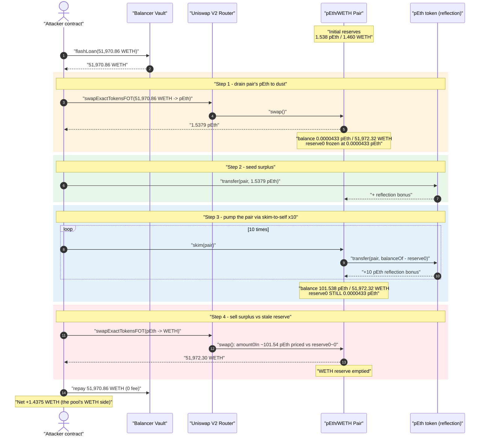
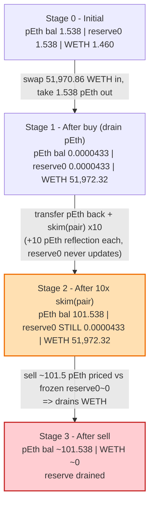
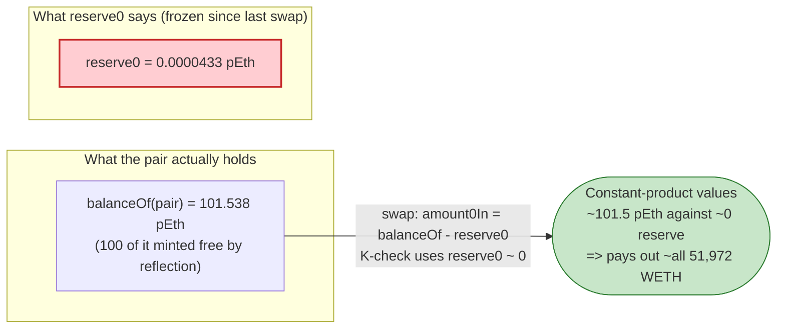

# pSeudoEth (pEth) Exploit — `skim()`-Pumped Reflection Token Drains the AMM Pool

> **Vulnerability classes:** vuln/defi/slippage · vuln/oracle/spot-price

> **Reproduction:** the PoC compiles & runs in an isolated Foundry project at
> [this project folder](.) (the umbrella DeFiHackLabs repo contains many
> unrelated PoCs that do not whole-compile, so this one was extracted).
> Full verbose trace: [output.txt](output.txt).
> The vulnerable token (`pEth`, `0x62aBdd…DDbE7`) is **unverified** on Etherscan, so
> only the public [`UniswapV2Pair`](sources/UniswapV2Pair_2033b5/UniswapV2Pair.sol) and
> [Balancer `Vault`](sources/Vault_BA1222/contracts_vault_Vault.sol) sources are present;
> the token's reflection logic is reconstructed below from the on-chain trace.

---

## Key info

| | |
|---|---|
| **Loss** | ~**1.44 WETH** (≈ $2.3K at the time) — the entire WETH side of the pEth/WETH pair |
| **Vulnerable contract** | `pEth` token — [`0x62aBdd605E710Cc80a52062a8cC7c5d659dDDbE7`](https://etherscan.io/address/0x62aBdd605E710Cc80a52062a8cC7c5d659dDDbE7) (unverified) |
| **Victim pool** | Uniswap V2 `pEth/WETH` pair — [`0x2033B54B6789a963A02BfCbd40A46816770f1161`](https://etherscan.io/address/0x2033B54B6789a963A02BfCbd40A46816770f1161#code) |
| **Attacker EOA** | [`0xea75aec151f968b8de3789ca201a2a3a7faeefba`](https://etherscan.io/address/0xea75aec151f968b8de3789ca201a2a3a7faeefba) |
| **Attacker contract** | [`0xf88d1d6d9db9a39dbbfc4b101cecc495bb0636f8`](https://etherscan.io/address/0xf88d1d6d9db9a39dbbfc4b101cecc495bb0636f8) |
| **Attack tx** | [`0x4ab68b21799828a57ea99c1288036889b39bf85785240576e697ebff524b3930`](https://etherscan.io/tx/0x4ab68b21799828a57ea99c1288036889b39bf85785240576e697ebff524b3930) |
| **Chain / block / date** | Ethereum mainnet / 18,305,132 (forked at `-1`) / Oct 4, 2023 |
| **Capital source** | Balancer flash loan — **51,970.86 WETH** (zero fee), fully repaid in-tx |
| **Compiler** | Pair: `v0.5.16` (optimizer, 999999 runs); PoC built with Solc 0.8.34 |
| **Bug class** | Fee/reflection token whose per-transfer bonus is paid to the *AMM pair*, weaponized through Uniswap V2 `skim()` to inflate the pool's token balance against a frozen reserve |

---

## TL;DR

`pEth` is a "reflection" token: on certain transfers it **mints a fixed bonus directly into
the recipient's balance**. Critically, when tokens are transferred to the **AMM pair**, the
pair receives that bonus too — its `balanceOf` grows even though no real liquidity was added.

Uniswap V2's [`skim(to)`](sources/UniswapV2Pair_2033b5/UniswapV2Pair.sol#L485-L490) is meant to
return *surplus* tokens (`balanceOf(pair) − reserve`) to `to`. The attacker calls
`skim(pair)` — i.e. tells the pair to send its own surplus **to itself**. Because `pEth`'s
`transfer` pays the recipient (the pair) a **fixed +10 pEth reflection bonus** on every transfer
regardless of the amount, each `skim()` round leaves the pair holding *more* pEth than before,
while the recorded `reserve0` stays frozen at the tiny post-swap value.

Repeating `skim(pair)` ten times pumps the pair's pEth balance from **1.538 → 101.538 pEth** while
`reserve0` remains **0.0000433 pEth**. The attacker then sells that surplus through a normal swap:
Uniswap prices the `≈101.5 pEth` input against the **frozen 0.0000433 pEth reserve**, so the
constant-product math pays out essentially the **entire 51,972 WETH** reserve. After repaying the
51,970.86 WETH flash loan, the attacker keeps **1.4375 WETH** — the pool's whole WETH side.

---

## Background

### The honest pool at the fork block

The `pEth/WETH` Uniswap V2 pair (token0 = `pEth`, token1 = `WETH`) was a tiny, freshly-seeded pool.
Its first read in the trace ([output.txt:1619](output.txt)) shows:

| Reserve | Value | Human |
|---|---:|---|
| `reserve0` (pEth) | `1,537,965,509,184,617,860` | **1.5380 pEth** |
| `reserve1` (WETH) | `1,459,789,552,765,232,477` | **1.4598 WETH** |

So the pool held only ~1.46 WETH of real liquidity. That is the prize.

### What makes `pEth` dangerous

`pEth` is an unverified reflection/fee-on-transfer token. The trace exposes its behavior even
though we cannot read its source: every `pEth.transfer(...)` into the pair emits a **non-standard
event** (topic `0x57e1b125…a0dd9c`, *not* the ERC20 `Transfer` signature) carrying a constant
data field `0x8ac7230489e80000` = **10 × 10¹⁸ = 10 pEth**
([output.txt:1655-1660](output.txt)). After each such transfer the pair's `balanceOf` has grown by
**exactly 10 pEth**, independent of how many tokens were actually sent. In other words the token
**reflects a flat +10 pEth bonus to the recipient on every transfer**, and the AMM pair is not
excluded from receiving it.

---

## The vulnerable code

### 1. Uniswap V2 `skim()` — returns `balanceOf − reserve` to an arbitrary `to`

[`sources/UniswapV2Pair_2033b5/UniswapV2Pair.sol:485-490`](sources/UniswapV2Pair_2033b5/UniswapV2Pair.sol#L485-L490)

```solidity
// force balances to match reserves
function skim(address to) external lock {
    address _token0 = token0; // gas savings
    address _token1 = token1; // gas savings
    _safeTransfer(_token0, to, IERC20(_token0).balanceOf(address(this)).sub(reserve0));
    _safeTransfer(_token1, to, IERC20(_token1).balanceOf(address(this)).sub(reserve1));
}
```

`skim` is permissionless. It assumes the only thing it does is move *existing surplus* out of the
pair — a safe no-op for a well-behaved token. But when `to == pair` **and** `token0` pays a
reflection bonus to the recipient, the `_safeTransfer(_token0, pair, surplus)` *credits the pair
with another +10 pEth*. The pair's balance therefore **rises** after a "skim", instead of being
flushed to its reserve.

### 2. The reserve only updates inside `swap()` / `sync()`, never in `skim()`

`skim()` does **not** call `_update`. Reserves are only re-read from balances in
[`swap`](sources/UniswapV2Pair_2033b5/UniswapV2Pair.sol#L454-L482) and
[`sync`](sources/UniswapV2Pair_2033b5/UniswapV2Pair.sol#L493-L495). So the attacker can pump
`balanceOf(pair)` with repeated `skim()` calls while `reserve0` stays frozen at the tiny value
recorded by the previous swap's `Sync`.

### 3. `swap()` prices the input against the stale reserve

[`UniswapV2Pair.sol:471-477`](sources/UniswapV2Pair_2033b5/UniswapV2Pair.sol#L471-L477)

```solidity
uint amount0In = balance0 > _reserve0 - amount0Out ? balance0 - (_reserve0 - amount0Out) : 0;
...
uint balance0Adjusted = balance0.mul(1000).sub(amount0In.mul(3));
uint balance1Adjusted = balance1.mul(1000).sub(amount1In.mul(3));
require(balance0Adjusted.mul(balance1Adjusted) >= uint(_reserve0).mul(_reserve1).mul(1000**2), 'UniswapV2: K');
```

`_reserve0` here is the **frozen 0.0000433 pEth**. With `reserve0 ≈ 0`, the K-invariant check is
trivially satisfiable while draining `reserve1` (WETH) almost entirely — a single swap of the
pumped-up pEth surplus buys nearly the whole WETH side.

---

## Root cause

This is the classic **fee/reflection-token × Uniswap-V2-`skim()`** incompatibility, with a twist:
the bonus is *additive and fixed* rather than a percentage, which makes the pump trivially
repeatable.

Three design facts compose into the drain:

1. **The reflection bonus is paid to the AMM pair.** A correct reflection token *excludes* AMM
   pairs (and the router) from receiving reflections; `pEth` does not. Every transfer into the
   pair mints +10 pEth into the pair's balance for free.
2. **`skim(pair)` is a self-feeding pump.** `skim` transfers `balanceOf − reserve` to `to`. With
   `to = pair`, that transfer *itself* triggers another +10 pEth reflection into the pair. Net of
   each round: the pair's pEth balance **grows by 10 pEth** while `reserve0` is untouched (skim
   never updates reserves). Ten rounds → +100 pEth surplus sitting in the pair.
3. **Reserves are stale between `swap`s.** Because `skim` doesn't `_update`, the swap that follows
   values the entire pumped surplus against the frozen near-zero `reserve0`, so the constant-product
   formula hands over essentially the full WETH reserve.

In short: the attacker manufactures pEth *inside the pair* out of thin air (reflection bonus) and
then sells it back to the pair at a price set by a reserve that pretends the pair holds almost no
pEth.

---

## Preconditions

- A live `pEth/WETH` Uniswap V2 pair where `pEth` pays its reflection bonus to the pair.
- Enough WETH to (a) drain the pair's pEth down to dust via an initial swap and (b) re-enter — fully
  recoverable in the same transaction, hence **flash-loanable**. The PoC borrows
  **51,970.86 WETH** from Balancer at zero fee.
- `skim()` is permissionless (always true for Uniswap V2).
- No reentrancy or privileged role required; the whole attack is a single externally-driven sequence.

---

## Attack walkthrough (with on-chain numbers from the trace)

`token0 = pEth`, `token1 = WETH` ⇒ `reserve0 = pEth`, `reserve1 = WETH`. All figures are taken
directly from the `getReserves`, `Sync`, `Swap`, and `balanceOf` lines in
[output.txt](output.txt).

| # | Step | Pair pEth `balanceOf` | `reserve0` (pEth) | `reserve1` (WETH) | Effect |
|---|------|----------------------:|------------------:|------------------:|--------|
| 0 | **Initial pool** ([:1619](output.txt)) | 1.5380 | 1.5380 | 1.4598 | Honest pool, ~1.46 WETH liquidity. |
| 1 | **Buy pEth with the whole flash loan** — swap 51,970.86 WETH → 1.5379 pEth to attacker ([:1622-1634](output.txt)) | 0.0000433 | **0.0000433** (Sync) | 51,972.32 | Pair's pEth drained to dust; WETH reserve now holds the loan. `reserve0` frozen at 0.0000433. |
| 2 | Attacker `transfer`s its 1.5379 pEth back to the pair ([:1645](output.txt)) | 1.5380 | 0.0000433 | 51,972.32 | Surplus seeded (+reflection on this transfer). |
| 3a | **`skim(pair)` #1** ([:1651](output.txt)) | 11.5380 | 0.0000433 | 51,972.32 | Reflection bonus +10 pEth credited to the pair. |
| 3b | **`skim(pair)` #2** ([:1668](output.txt)) | 21.5380 | 0.0000433 | 51,972.32 | +10 pEth. |
| 3c | **`skim(pair)` #3** ([:1684](output.txt)) | 31.5380 | 0.0000433 | 51,972.32 | +10 pEth. |
| 3d | **`skim(pair)` #4** ([:1700](output.txt)) | 41.5380 | 0.0000433 | 51,972.32 | +10 pEth. |
| 3e | **`skim(pair)` #5** ([:1716](output.txt)) | 51.5380 | 0.0000433 | 51,972.32 | +10 pEth. |
| 3f | **`skim(pair)` #6** ([:1732](output.txt)) | 61.5380 | 0.0000433 | 51,972.32 | +10 pEth. |
| 3g | **`skim(pair)` #7** ([:1748](output.txt)) | 71.5380 | 0.0000433 | 51,972.32 | +10 pEth. |
| 3h | **`skim(pair)` #8** ([:1764](output.txt)) | 81.5380 | 0.0000433 | 51,972.32 | +10 pEth. |
| 3i | **`skim(pair)` #9** ([:1780](output.txt)) | 91.5380 | 0.0000433 | 51,972.32 | +10 pEth. |
| 3j | **`skim(pair)` #10** ([:1796](output.txt)) | 101.5380 | 0.0000433 | 51,972.32 | +10 pEth → 100 pEth surplus accumulated. |
| 4 | **Sell the surplus** — swap pEth → WETH ([:1820-1836](output.txt)). `amount0In = balance0 − (reserve0 − amount0Out) ≈ 101.5379 pEth`; priced vs frozen `reserve0 = 0.0000433` → pays out **51,972.30 WETH** | 0.0000222 (WETH) | (Sync: 101.5380) | 0.0000222 | WETH reserve emptied; attacker now holds 51,972.30 WETH. |
| 5 | **Repay flash loan** 51,970.86 WETH to Balancer ([:1843](output.txt)) | — | — | — | Loan + 0 fee returned. |

**Net:** attacker WETH balance after repayment = **1.437545289007891970 WETH**
([output.txt:1855](output.txt)).

### Why "+10 pEth per skim, regardless of amount"

In each `skim(pair)` round the pair sends `balanceOf − reserve0` pEth **to itself**. The transferred
amount grows each round (1.538, 11.538, 21.538, …), yet the pair's balance increases by **exactly
10 pEth** every time, and the non-standard event always carries the same `0x8ac7230489e80000`
(= 10e18) data field ([output.txt:1657](output.txt), [:1674](output.txt), [:1690](output.txt), …).
That fixed bonus is the token's reflection logic crediting the recipient (the pair) a flat 10 pEth
per transfer — free pEth that the attacker then sells back to the pool.

### Profit accounting (WETH)

| Direction | Amount (WETH) |
|---|---:|
| Borrowed (flash loan in) | 51,970.861732 |
| Received from final pEth→WETH sell | 51,972.299277 |
| Repaid to Balancer (loan, 0 fee) | 51,970.861732 |
| **Net profit** | **+1.437545** |

The profit (1.4375 WETH) is essentially the pool's original ~1.46 WETH of honest liquidity, minus
the 0.3% swap fees paid on the in/out swaps — the attacker walked off with the entire WETH side of
the pool.

---

## Diagrams

### Sequence of the attack



### Pool state evolution



### Why the drain works: balance vs. frozen reserve



---

## Why each magic number

- **Flash loan = 51,970.86 WETH.** Sized so that swapping it all into the pair pushes the pair's
  pEth reserve down to dust (0.0000433 pEth) — i.e. it buys essentially the entire pEth side. The
  exact amount (`51_970_861_731_879_316_502_999`) is just "almost all of the pEth," and is fully
  recovered, so its precise size only needs to be "large enough to corner the pool."
- **10 `skim(pair)` rounds.** Each round adds a fixed +10 pEth reflection bonus to the pair; ten
  rounds accumulate **100 pEth** of free surplus on top of the ~1.5 pEth re-seeded in Step 2. More
  rounds would extract slightly more, but the WETH reserve is the hard cap — 100 pEth priced against
  `reserve0 ≈ 0` already buys ~100% of the WETH.
- **`skim(to = pair)`.** The whole trick: directing `skim` back at the pair so the surplus transfer
  re-triggers the reflection bonus *into the pair*, growing `balanceOf` while `reserve0` stays
  frozen.

---

## Remediation

1. **Reflection / fee tokens must exclude AMM pairs and routers from reflections.** The root defect
   is on the `pEth` side: paying a transfer bonus to the Uniswap pair lets anyone manufacture
   "surplus" inside the pool. Exclude pair/router addresses from fee redistribution, or do not
   implement balance-mutating reflections at all.
2. **Do not pair reflection/rebasing/fee-on-transfer tokens with vanilla Uniswap V2.** V2's
   `skim`/`sync` model assumes `balanceOf` only changes via deposits, swaps, and direct sends it can
   reconcile. Tokens that mint to arbitrary holders (including the pair) break that assumption.
3. **For LPs / integrators:** treat a token whose `balanceOf(pair)` can increase without a
   corresponding `swap`/`mint` as fundamentally incompatible with constant-product AMMs; deploy such
   tokens only against AMMs that price on internal reserves and forbid external balance injection.
4. **General hardening:** AMMs that must support exotic tokens should re-derive reserves from
   balances at the *start* of every state-changing call (or use internal accounting that ignores
   un-attributed balance deltas), so a stale reserve can never be exploited the way the frozen
   `reserve0` was here.

---

## How to reproduce

The PoC was extracted into a standalone Foundry project (the umbrella DeFiHackLabs repo has many
unrelated PoCs that fail to compile under a single whole-project `forge build`):

```bash
_shared/run_poc.sh 2023-10-pSeudoEth_exp -vvvvv
```

- Network: an **Ethereum mainnet archive** RPC is required (fork at block `18_305_132 - 1`).
  `foundry.toml` points `mainnet` at an Infura endpoint; any archive node serving state at that
  block works. Most pruned/public RPCs will fail with `header not found` / missing-state errors.
- Result: `[PASS] testExploit()` with `Attack Exploit: 1.437545289007891970 WETH`.

Expected tail:

```
Ran 1 test for test/pSeudoEth_exp.sol:ContractTest
[PASS] testExploit() (gas: 431327)
  Before Start: 0 WETH
  Attack Exploit: 1.437545289007891970 WETH

Suite result: ok. 1 passed; 0 failed; 0 skipped; finished in 8.37s
```

---

*References: CertiK Alert — https://twitter.com/CertiKAlert/status/1710979615164944729 ;
SlowMist Hacked — https://hacked.slowmist.io/ (pSeudoEth / pEth, Ethereum, Oct 2023).*
