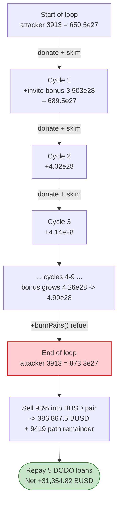
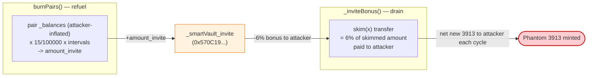

# 3913 Token Exploit — `skim`-Driven Invite-Bonus / LP-Burn Vault Drain

> **One-line summary:** `3913` token's `_transfer` pays a 6% "invite bonus" out of a permissionless smart-vault on *every* pair→user transfer and lets anyone trigger the LP-burn that funds that vault — so by cycling its own tokens through the PancakeSwap pair with `skim()`, the attacker repeatedly mints itself phantom `3913` and dumps it for ~31,354 BUSD.

> **Reproduction:** the PoC compiles & runs in this isolated Foundry project ([this folder](.)).
> The umbrella DeFiHackLabs repo does not whole-compile, so this PoC was extracted.
> Full verbose trace: [output.txt](output.txt).
> Verified vulnerable source: [sources/T3913_d74F28/T3913.sol](sources/T3913_d74F28/T3913.sol).

---

## Key info

| | |
|---|---|
| **Loss** | ~**31,354 USD** (31,354.82 BUSD, single tx; this was one of several attack txs) |
| **Vulnerable contract** | `3913` token (`T3913`) — [`0xd74F28c6E0E2c09881Ef2d9445F158833c174775`](https://bscscan.com/address/0xd74F28c6E0E2c09881Ef2d9445F158833c174775#code) |
| **Victim pool** | BUSD/3913 PancakeSwap pair — `0x715762906489D5D671eA3eC285731975DA617583` |
| **Secondary pool** | 9419/3913 pair — `0xd6d66e1993140966e6029815eDbB246800928969` |
| **Invite vault drained** | `_smartVault_invite` — `0x570C19331c1B155C21ccD6C2D8e264785cc6F015` |
| **Attacker EOA** | [`0xb29f18b89e56cc0151c7c17de0625a21018d8ae7`](https://bscscan.com/address/0xb29f18b89e56cc0151c7c17de0625a21018d8ae7) |
| **Attacker contract** | `0x783fbea45b32eaaa596b44412041dd1208025e83` |
| **Attack tx** | [`0x8163738d6610ca32f048ee9d30f4aa1ffdb3ca1eddf95c0eba086c3e936199ed`](https://bscscan.com/tx/0x8163738d6610ca32f048ee9d30f4aa1ffdb3ca1eddf95c0eba086c3e936199ed) |
| **Chain / block / date** | BSC / 33,132,467 / Nov 2, 2023 |
| **Compiler** | Solidity v0.8.10, optimizer 200 runs |
| **Bug class** | Broken token accounting — permissionless mint-equivalent via `skim()`-triggered invite bonus + LP burn |

---

## TL;DR

`3913` is a deflationary "MLM/dividend" token. Its `_transfer`
([T3913.sol:909-995](sources/T3913_d74F28/T3913.sol#L909)) wires three independent payout
mechanisms onto plain ERC20 transfers:

1. **LP auto-burn** — any transfer *to* a pair calls `burnPairs()`
   ([:853-891](sources/T3913_d74F28/T3913.sol#L853)), which moves a slice (`15/100000 × intervals`)
   of the pair's `_balances` into six "smart vaults", the largest going to `_smartVault_invite`.
2. **Invite bonus** — any transfer *from* a pair calls `_inviteBonus(to, amount)`
   ([:997-1007](sources/T3913_d74F28/T3913.sol#L997)), which pays the recipient's "inviter" **6%**
   (`_inviteRate = 600 / RBASE`) of the transferred amount **out of `_smartVault_invite`**.
3. **Phantom balance via `skim()`** — `balanceOf(pair)` returns the pair's *real* `_balances`
   ([:683-684](sources/T3913_d74F28/T3913.sol#L683), pairs are exempt from `burnAmount`), so a direct
   `vulnerable.transfer(pair, X)` donation makes the pair's balance exceed its reserve, and
   PancakeSwap's `pair.skim(to)` ships that surplus back out — re-entering `_transfer(pair → to)` and
   thus firing the invite bonus **again**.

The attacker stitches these together into a positive-feedback loop. Each cycle:

- donate the attacker's whole `3913` balance into the BUSD/3913 pair (firing `burnPairs()` → tops up
  `_smartVault_invite`),
- `pair.skim(x)` → the pair transfers the donated surplus to a helper contract `x`; because the sender
  is a pair, `_inviteBonus` pays the attacker an extra **6%** from the invite vault,
- pull the skimmed tokens back out of `x`.

Because the 6% invite bonus is paid out of a vault that the same flow keeps refilling, the attacker's
`3913` balance **grows every cycle** — `650.5e27 → 873.3e27` over ~10 iterations — for free. They then
sell the inflated `3913` for BUSD (and round-trip through 9419) and repay the chain of five DODO
flash-loans, netting **31,354 BUSD**.

---

## Background — what the 3913 token does

`T3913` ([source](sources/T3913_d74F28/T3913.sol)) is a BEP20 with a heavy "tokenomics" layer built
around two PancakeSwap pairs created in its constructor
([:614-621](sources/T3913_d74F28/T3913.sol#L614)): a BUSD/3913 pair and a 9419/3913 pair. Six
`SmartVault` helper contracts ([:432-445](sources/T3913_d74F28/T3913.sol#L432)) hold protocol-owned
3913 for dividends, invite bonuses, and liquidity top-ups.

Relevant parameters (from source constants):

| Parameter | Value | Meaning |
|---|---|---|
| `_decimals` / `_totalSupply` | 18 / 16,000,000,000,000 × 1e18 | huge supply |
| `RBASE` | 10000 | rate denominator |
| `_inviteRate` | **600** | **6%** invite bonus, paid from `_smartVault_invite` |
| `_burnRateLP` | 15 | LP burn = `15/100000` of pair balance × intervals |
| `_burnCycleLP` | 30 minutes | LP burn cadence |
| `_burnAssignRatePool` / `_burnAssignRateDividend` | 1800 / 2500 | how LP-burn proceeds are split across vaults |
| `39130000e18` | — | floor supply below which the per-account `burnAmount` stops |

The defining quirk lives in `balanceOf`:

```solidity
function balanceOf(address _uid) public view override returns (uint256) {
    return _balances[_uid].sub(burnAmount(_uid));   // virtual, time-based burn
}
function burnAmount(address uid) public view returns (uint256) {
    if (_burnNot[uid]) return 0;
    if (_v2Pairs[uid]) return 0;        // ⚠️ pairs always report their FULL raw balance
    ...
}
```

A pair's `balanceOf` is its un-discounted `_balances`. That matters because PancakeSwap's `skim()`
sends out `balanceOf(pair) − reserve`.

---

## The vulnerable code

### 1. `_transfer` hangs MLM payouts off both directions of a pair transfer

```solidity
function _transfer(address from, address to, uint256 amount) internal returns (bool) {
    ...
    (bool isAdd, bool isDel) = _isLiquidity(from, to);
    updateTime();
    _burnToken(from);
    _burnToken(to);
    if (_v2Pairs[to] && !isAdd && from != address(this)) {
        burnPairs();                       // ⚠️ (A) transfer TO a pair → refill the vaults
    }
    if (_v2Pairs[from] && !isDel) {
        _inviteBonus(to, amount);          // ⚠️ (B) transfer FROM a pair → pay 6% from invite vault
    }
    ...
    _takeTransfer(from, to, amount);
    return true;
}
```
[T3913.sol:909-995](sources/T3913_d74F28/T3913.sol#L909)

### 2. `_inviteBonus` pays the recipient's inviter 6% out of `_smartVault_invite`

```solidity
function _inviteBonus(address to, uint256 amount) private {
    if (_users[to].pid != address(0)) {
        uint256 balance_t = _balances[address(_smartVault_invite)];
        if (balance_t == 0) return;
        uint256 bunusAmount = amount.mul(_inviteRate).div(RBASE);   // 6% of the moved amount
        bunusAmount = bunusAmount > balance_t ? balance_t : bunusAmount;
        _smartVault_invite.transfer(address(this), _users[to].pid, bunusAmount);  // FREE tokens out
    }
}
```
[T3913.sol:997-1007](sources/T3913_d74F28/T3913.sol#L997)

### 3. `burnPairs` is permissionless and keeps refilling that same vault

```solidity
function burnPairs() public {                 // ⚠️ no access control
    ...
    for (uint256 i = 0; i < pairList.length; i++) {
        pair   = pairList[i];
        amount = burnAmountPair(pair);          // = _balances[pair] * 15/100000 * intervals
        if (amount > 0) {
            ...
            _balances[pair] -= amount;
            amount_invite = amount.sub(amountDividend).sub(amount_pool);
            _balances[address(_smartVault_invite)] += amount_invite;   // ⚠️ vault topped up
            ...
            IUniswapV2Pair(pair).sync();
            addLiquidity(pair);
        }
    }
}
```
[T3913.sol:853-891](sources/T3913_d74F28/T3913.sol#L853)

### 4. `SmartVault.transfer` lets the 3913 contract move out arbitrary amounts

```solidity
contract SmartVault {
    function transfer(address token, address to, uint256 amount) public {
        require(_owner[msg.sender], "permission denied");   // owner == the 3913 token
        amount = amount == 0 ? IBEP20(token).balanceOf(address(this)) : amount;
        IBEP20(token).transfer(to, amount);
    }
}
```
[T3913.sol:432-445](sources/T3913_d74F28/T3913.sol#L432)

---

## Root cause — why it was possible

The token treats a **transfer involving a PancakeSwap pair as a trigger to mint value out of a
protocol vault**, with no protection against a user being on both sides of that transfer:

1. **The 6% invite bonus is funded by a vault, not by the counterparty.** When a pair sends tokens to
   user `X`, the token pays `X`'s inviter 6% *extra* tokens from `_smartVault_invite`. Those tokens are
   not deducted from anyone in the trade — they are net-new liquidity handed out for free. An attacker
   who controls both the "inviter" and the recipient simply earns 6% on every pair-out transfer they
   can cause.

2. **`pair.skim()` lets the attacker cause arbitrary pair-out transfers cheaply.** Because pairs report
   their full raw balance in `balanceOf` ([:689](sources/T3913_d74F28/T3913.sol#L689)), donating
   `3913` into a pair creates a `balanceOf(pair) − reserve` surplus. `skim(x)` flushes that surplus —
   re-entering `_transfer(pair → x)` and firing `_inviteBonus` on the full skimmed amount. The
   donation costs the attacker nothing (they get the same tokens back via `skim`), so the only net
   effect is the **6% bonus paid out of the vault**.

3. **`burnPairs()` is permissionless and refuels the very vault being drained.** Each donation into a
   pair triggers `burnPairs()`, which siphons `15/100000 × intervals` of the (attacker-inflated) pair
   balance into the vaults — the largest cut going to `_smartVault_invite`. So the loop both *spends*
   the invite vault (via the 6% bonus) and *refills* it (via the LP burn), letting the attacker iterate
   until the per-call invite ceiling (`bunusAmount > balance_t ? balance_t`) is the only limiter.

4. **No invariant ties `_balances` to actual deposited value.** Nothing checks that the sum of vault
   payouts is matched by real tokens entering the system. The accounting is a closed bookkeeping loop
   the attacker can pump.

Net: by repeatedly donating-then-`skim`-ing through the pair (plus a one-off `burnPairs()` call inside
the loop), the attacker turned **650.5e27 3913 into 873.3e27 3913** with zero real input, then sold the
surplus for BUSD.

---

## Preconditions

- Attacker must be registered as the "inviter" of the recipient contract `x`, so that
  `_users[x].pid == attacker` and `_inviteBonus` fires. The PoC establishes this implicitly through the
  earlier swaps/transfers that call `_bindInvite` ([:731-746](sources/T3913_d74F28/T3913.sol#L731)).
- `_smartVault_invite` must hold a non-zero `3913` balance — guaranteed because the donate→`burnPairs`
  step refills it each cycle.
- At least one `_burnCycleLP` (30 min) must have elapsed so `burnAmountPair` > 0 for the pairs; true at
  the live attack block.
- Working capital in BUSD to seed the swaps. The PoC sources it from **five chained DODO flash-loans**
  (`dodo1..dodo5`, [test/3913_exp.sol:64-153](test/3913_exp.sol#L64)) and repays them all in the same
  tx, so the attack is **flash-loan funded / zero net capital**.

---

## Attack walkthrough (with on-chain numbers from the trace)

The BUSD/3913 pair has `token0 = BUSD`, `token1 = 3913` (`pair.token0()` returns the BUSD address,
[:1843 in trace](output.txt)). All figures are taken from the verbose trace.

| # | Step | Concrete numbers (from trace) | Effect |
|---|------|-------------------------------|--------|
| 0 | **Stack 5 DODO flash-loans** of BUSD (`dodo1..dodo5`) | total ≈ borrowed BUSD across 5 vaults | Provides working BUSD, repaid at end of each callback |
| 1 | Buy 3913 with 10 BUSD on BUSD/3913 pair | 10 BUSD → 46,791,279.93e18 3913 (after fee) | Seed an initial 3913 position |
| 2 | Buy 9419 with 10 BUSD | 10 BUSD → 9419 | Seed 9419 (used for the secondary dump path) |
| 3 | Deploy helper `x`, send it 1e18 3913, pull it back (`x.transferToken`) | establishes invite relationship | Wires `x.pid = attacker` so invite bonus pays attacker |
| 4 | Swap 358,631.96e18 BUSD → 3913 | attacker 3913 balance = **650,501,978,825,924,088,488,444,996,953** (6.505e29) | Build the principal to cycle |
| 5 | **Donate** entire 3913 to BUSD/3913 pair (`transfer(pair, bal)`) | pair `_balances` jump to ≈ 1.074e30 3913; `burnPairs()` fires → refills `_smartVault_invite` | Inflate pair balance over reserve + top up invite vault |
| 6 | `pair.skim(x)` | pair → `x` transfer of 6.309e29 3913; `_inviteBonus` pays attacker **3.903e28** (≈6%) from `0x570C19…` | **Phantom 3913 minted to attacker** |
| 7 | Pull skimmed 3913 out of `x` (`x.transferToken`) | attacker reclaims 6.309e29 + keeps the 3.903e28 bonus | Net positive 3913 |
| 8 | **Loop steps 5–7 (~10×)**; one iteration calls `vulnerable.burnPairs()` directly | per-cycle invite bonus grows: 3.903e28 → 4.02e28 → 4.14e28 → … → 4.999e28 | Balance ratchets up |
| 9 | After loop, attacker 3913 = **873,285,322,509,556,749,289,919,955,755** (8.732e29) | `assertEq` confirms | +222.8e27 3913 vs step 4, for free |
| 10 | Sell 98% of 3913 into BUSD/3913 pair via raw `pair.swap` | `getAmountsOut` 855,819.6e18×… → **386,867.52e18 BUSD** (×99/100) | Convert bulk to BUSD |
| 11 | Sell remaining 3913 into 9419/3913 pair → 9419 → BUSD | 278,798.04e18 9419 out → swapped to BUSD | Mop up the rest |
| 12 | Repay all 5 DODO flash-loans | dodo1..dodo5 repaid | Loans closed |
| **13** | **Final attacker BUSD balance** | **31,354,821,282,527,587,092,356 = 31,354.82 BUSD** | **Profit** |

### Key reserve snapshots (BUSD/3913 pair, from `Sync` / `getReserves`)

| Moment | reserve0 (BUSD) | reserve1 (3913) |
|---|---:|---:|
| Initial | 226,440.86e18 | 1.095e30 |
| After loop, before bulk sell | 585,082.81e18 | 4.244e29 |
| The PoC asserts `res0 = 585,082,814,956,957,699,188,861` and `res1 = 424,480,476,638,586,992,222,101,033,564` | ✓ | ✓ |

### Profit / loss accounting (BUSD)

| Direction | Amount (BUSD) |
|---|---:|
| Starting attacker BUSD (after `deal(.,0)`) | 0 |
| Borrowed via 5 DODO flash-loans | repaid in full (net 0) |
| 3913 cycled balance gain | +222.78e27 3913 (free) |
| Proceeds — bulk 3913 sell into BUSD pair | +386,867.52e18 BUSD |
| Proceeds — 9419 → BUSD path | + remainder |
| Flash-loan repayments | − borrowed |
| **Net attacker BUSD after attack** | **+31,354.82 BUSD** |

The profit is exactly the value the attacker extracted from the BUSD/3913 (and 9419/3913) liquidity by
inflating its 3913 holdings out of thin air and dumping them.

---

## Diagrams

### Sequence of one extraction cycle

```mermaid
sequenceDiagram
    autonumber
    actor A as "Attacker (Exploit)"
    participant X as "Helper x (NewContract)"
    participant T as "3913 token"
    participant V as "_smartVault_invite (0x570C19)"
    participant P as "BUSD/3913 pair"

    Note over A,P: Attacker holds 650.5e27 3913 (bought with flash-loaned BUSD)

    rect rgb(255,243,224)
    Note over A,T: Donate into the pair
    A->>T: transfer(pair, wholeBalance)
    T->>T: _transfer(A, pair): to is pair → burnPairs()
    T->>P: _balances[pair] -= LPburn ; pair.sync()
    T->>V: _balances[V] += amount_invite (vault refilled)
    Note over P: pair _balances now >> reserve (surplus)
    end

    rect rgb(227,242,253)
    Note over A,P: Skim the surplus back out
    A->>P: skim(x)
    P->>T: transfer(pair, x, surplus 6.309e29)
    T->>T: _transfer(pair, x): from is pair → _inviteBonus(x, surplus)
    T->>V: read _balances[V]
    V-->>A: 6% bonus = 3.903e28 3913 (paid to x.pid = attacker)
    P-->>X: surplus 6.309e29 3913
    end

    rect rgb(232,245,233)
    Note over A,X: Reclaim
    A->>X: transferToken(3913, A)
    X-->>A: 6.309e29 3913 back
    Note over A: net +3.903e28 3913 this cycle (free)
    end

    Note over A,P: Repeat ~10× → balance 650.5e27 → 873.3e27
```

### Balance ratchet across the loop



### Why the loop is net-positive (vault as a money pump)



---

## Why each magic number

- **`358,631,959,260,537,946,706,184` (358,631.96 BUSD swap):** sizes the attacker's *starting* 3913
  principal to exactly `650,501,978,825,924,088,488,444,996,953` — the value `assertEq`'d at
  [test/3913_exp.sol:102](test/3913_exp.sol#L102). A larger principal means a larger per-cycle 6%
  invite bonus.
- **The `while (i < 10)` loop:** runs the donate→skim→reclaim cycle ten times, with one branch calling
  `vulnerable.burnPairs()` directly when the invite vault hits its sentinel balance (`!= 1e15`) to keep
  it funded. Final balance asserted at `873,285,322,509,556,749,289,919,955,755`
  ([:118](test/3913_exp.sol#L118)).
- **`* 98 / 100` and `* 99 / 100`:** the attacker leaves a small buffer when computing
  `getAmountsOut`/raw `swap` amounts so the constant-product `swap()` does not revert on `k`
  rounding. `amountOut[0] = 855,819,616,059,365,614,304,121,556,639` and the BUSD leg
  `386,867,521,275,785,735,087,292` are both asserted against the live reserves.
- **`busd.transfer(pair, 1)` before each sell:** a 1-wei BUSD donation so the raw `pair.swap()`
  (bypassing the router) satisfies the pair's balance/`k` check on the input side.

---

## Remediation

1. **Never pay bonuses out of a vault on uncontrolled transfers.** `_inviteBonus` mints free tokens on
   *every* pair→user transfer. Bonuses must be funded by a fee taken from the same trade (deducted from
   the counterparty), not handed out of a shared pool that anyone can repeatedly trigger.
2. **Do not key payouts on `skim`/donation-reachable balances.** Because `skim(to)` lets anyone cause a
   pair→arbitrary-address transfer, any logic that fires on "transfer from a pair" is attacker-driven.
   Restrict invite/burn side effects to genuine swap paths, or gate them so the same address cannot be
   both trigger and beneficiary.
3. **Make `burnPairs()` non-permissionless (or idempotent against manipulation).** Letting anyone move
   a percentage of the *current* (attacker-inflated) pair balance into vaults turns the burn into an
   attacker-controlled refuel pump. Restrict it to a keeper, and compute burn amounts from reserves the
   attacker cannot transiently inflate.
4. **Enforce a conservation invariant.** The sum of all vault payouts must be backed by real value
   entering the protocol. A simple check that `totalSupply` and vault outflows cannot exceed deposited
   collateral would have made the closed-loop pump unprofitable.
5. **Exclude pairs from raw `balanceOf` surplus games.** Treat a pair's accountable balance as
   `reserve`, not raw `_balances`, in any internal logic so a donation cannot create a free
   `skim`-able surplus that re-enters the transfer hooks.

---

## How to reproduce

```bash
_shared/run_poc.sh 2023-11-3913_exp -vvvvv
```

- RPC: a **BSC archive** endpoint is required (fork block 33,132,467). `foundry.toml` uses
  `https://bsc-mainnet.public.blastapi.io`, which serves historical state at that block; most pruned
  public RPCs fail with `header not found` / `missing trie node`.
- Result: `[PASS] testExploit()` — attacker BUSD goes from 0 to 31,354.82 BUSD.

Expected tail:

```
  attacker balance busd before attack:: 0.000000000000000000
  attacker balance busd after attack:: 31354.821282527587092356

Suite result: ok. 1 passed; 0 failed; 0 skipped
```

---

*Reference: DeFiHackLabs PoC `src/test/2023-11/3913_exp.sol`; on-chain analysis via the Foundry fork
trace in [output.txt](output.txt). The attacker sent multiple txs; this PoC reproduces the first.*
