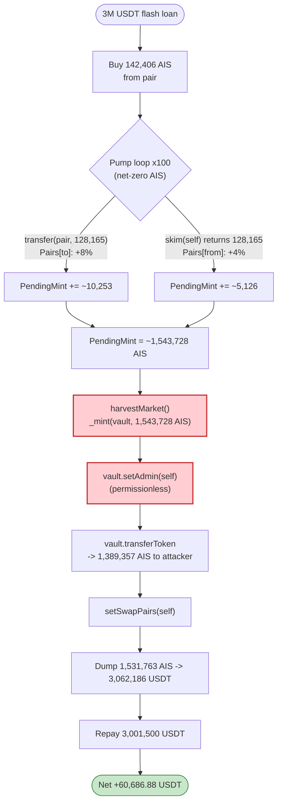
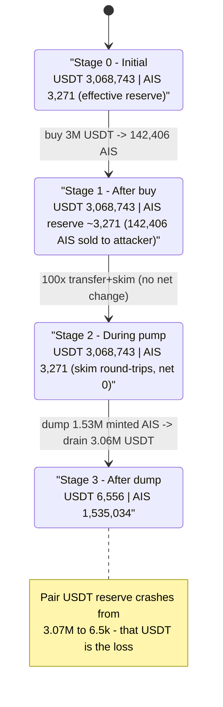

# AI SPACE (AIS) Exploit — Permissionless `PendingMint` Inflation + Unprotected Vault Drain

> **Reproduction:** the PoC compiles & runs in an isolated Foundry project at
> [this project folder](.) (the umbrella DeFiHackLabs repo contains many unrelated PoCs that do not
> compile together, so this one was extracted).
> Full verbose trace: [output.txt](output.txt).
> Verified vulnerable source: [sources/AISPACE_6844Ef/AISPACE.sol](sources/AISPACE_6844Ef/AISPACE.sol).
> PoC: [test/AIS_exp.sol](test/AIS_exp.sol).

---

## Key info

| | |
|---|---|
| **Loss** | **~$60.7k** — **60,686.88 USDT** extracted from the AIS/USDT PancakeSwap-V2 pair |
| **Vulnerable contract** | `AISPACE` (AIS token) — [`0x6844Ef18012A383c14E9a76a93602616EE9d6132`](https://bscscan.com/address/0x6844Ef18012A383c14E9a76a93602616EE9d6132#code) |
| **Secondary vulnerable contract** | "MarketVault" — [`0xFFAc2Ed69D61CF4a92347dCd394D36E32443D9d7`](https://bscscan.com/address/0xFFAc2Ed69D61CF4a92347dCd394D36E32443D9d7) (unverified; has a permissionless `setAdmin` + `transferToken`) |
| **Victim pool** | AIS/USDT PancakeSwap-V2 pair — `0x1219F2699893BD05FE03559aA78e0923559CF0cf` |
| **Flash-loan source** | PancakeSwap-V3 USDT pool — `0x4f31Fa980a675570939B737Ebdde0471a4Be40Eb` |
| **Attacker EOA** | `0x84f37F6cC75cCde5fE9bA99093824A11CfDc329D` (frontrun by `0x7cb74265e3e2d2b707122bf45aea66137c6c8891`) |
| **Attacker contract** | `0xf6f60b0e83d9837c1f247c575c8583b1d085d351` (frontrunner: `0x15ffd1d02b3918c9e56f75e30d23786d3ef2b5bc`) |
| **Attack tx** | [`0x0be817b6a522a111e06293435c233dab6576d7437d0e148b45efcf7ab8a10de0`](https://bscscan.com/tx/0x0be817b6a522a111e06293435c233dab6576d7437d0e148b45efcf7ab8a10de0) |
| **Chain / block / date** | BSC / 33,916,687 (PoC fork) / Nov 2023 |
| **Compiler** | Solidity v0.8.20, optimizer **200 runs** |
| **Bug class** | Permissionless mint-accounting inflation + missing access control on `setSwapPairs` / `setAdmin` |

---

## TL;DR

The AIS token bolts a "market reward" mint mechanism onto a standard OZ ERC20. Every transfer that
touches a registered AMM pair bumps a global counter `PendingMint` by **4–8 % of the transferred
amount** ([AISPACE.sol:973-998](sources/AISPACE_6844Ef/AISPACE.sol#L973-L998)). A separate,
**permissionless** function `harvestMarket()` then **mints `PendingMint − MintPosition` brand-new AIS**
to the `MarketAddress` vault ([:968-972](sources/AISPACE_6844Ef/AISPACE.sol#L968-L972)).

Two design flaws make this catastrophic:

1. **`setSwapPairs(address)` lost its `onlyOwner` modifier** — the `//onlyOwner` is commented out
   ([:949-951](sources/AISPACE_6844Ef/AISPACE.sol#L949-L951)). Anyone can register any address as a
   "pair", giving it the inflationary transfer semantics.
2. **`PendingMint` accrues with no backing.** Because it grows on *every* pair-touching transfer
   (including zero-net round-trips), an attacker can pump it arbitrarily high by shuttling AIS in and
   out of the pair via `pair.skim()` — then `harvestMarket()` mints that inflation as real AIS.

The vault (`MarketAddress = 0xFFAc2Ed…`) is itself broken: it exposes a **permissionless `setAdmin()`**
and an admin-only `transferToken()`. So the attacker makes themselves admin and walks the freshly-minted
AIS out of the vault.

The full attack (one atomic tx, financed by a 3,000,000 USDT PancakeV3 flash loan):

1. **Buy** 142,406 AIS from the AIS/USDT pair with the flash-loaned 3M USDT.
2. **Pump `PendingMint`** — 100 rounds of `transfer(pair, 128,165 AIS)` + `pair.skim(self)` round-trips.
   Each leg bumps `PendingMint` by 4–8 % with **zero net AIS cost** (skim returns what was sent).
3. **`harvestMarket()`** — mints **1,543,728 AIS** to the vault.
4. **Steal the mint** — `vault.setAdmin(self)` then `vault.transferToken(AIS, self, 90 % = 1,389,357 AIS)`.
5. **`setSwapPairs(self)`** so the attacker's own sell into the pair takes the *buy* (untaxed) path.
6. **Dump** ~1.53M AIS into the pair → receive **3,062,186 USDT**.
7. **Repay** 3,001,500 USDT (3M + 0.05 % fee). Net **+60,686.88 USDT**.

---

## Background — what AISPACE does

`AISPACE` ([source](sources/AISPACE_6844Ef/AISPACE.sol#L933-L1018)) is an OZ-5 ERC20 (with
`ERC20Burnable`, `ERC20Pausable`, `Ownable`) plus a custom "market reward" layer:

- **Registered pairs** — `Pairs[addr]` marks AMM pairs. Set via `setSwapPairs()`.
- **Custom transfer routing** — `transfer`/`transferFrom` delegate to `_transferAIS`, which branches
  on whether the counterparty is a pair (a "buy" vs a "sell"). Both branches accrue `PendingMint`
  and `PendingBrun`.
- **`PendingMint` / `MintPosition`** — a global accumulator of "rewards owed"; `harvestMarket()` mints
  the delta to `MarketAddress`.
- **`PendingBrun`** — a per-account pending-burn ledger; crucially, the overridden
  `balanceOf` **subtracts** `PendingBrun[account]` ([:1008-1010](sources/AISPACE_6844Ef/AISPACE.sol#L1008-L1010)).

Total supply at the fork block was ~1.0e9 AIS (minted to the vault holder in the constructor,
[:939](sources/AISPACE_6844Ef/AISPACE.sol#L939)). The AIS/USDT pair held only **3,271 AIS** and
**3,068,743 USDT** of effective reserve liquidity — the prize.

---

## The vulnerable code

### 1. `setSwapPairs` is permissionless (access control commented out)

```solidity
function setSwapPairs(address _address) public { //onlyOwner {
    Pairs[_address] = true;
}
```
[AISPACE.sol:949-951](sources/AISPACE_6844Ef/AISPACE.sol#L949-L951) — the `onlyOwner` guard is
**commented out**. Anyone can flag any address as a pair, switching its transfer accounting into the
inflationary branch.

### 2. The pair-touching transfer paths inflate `PendingMint` for free

```solidity
function _transferAIS(address from, address to, uint256 value) private returns (bool) {
    if (Pairs[from]){                                   // a "buy" (tokens leaving the pair)
        _transfer(from, to, value);
        PendingBrun[to]  = value*5/100;
        PendingMint     += value*4/100;                 // ⚠️ +4% accrual, unbacked
        IMarketVault(MarketAddress).addMarketValue(value*4/100);
        return true;
    }
    if (Pairs[to]){                                     // a "sell" (tokens entering the pair)
        require(balanceOf(from) > value*111/100, "insufficient funds for burn!");
        _transfer(from, to, value);
        PendingBrun[from] = value*10/100;
        PendingMint      += value*8/100;                // ⚠️ +8% accrual, unbacked
        IMarketVault(MarketAddress).addMarketValue(value*8/100);
        return true;
    } else { ... }
}
```
[AISPACE.sol:973-998](sources/AISPACE_6844Ef/AISPACE.sol#L973-L998). `PendingMint` rises every time
AIS moves to/from a pair, regardless of whether any *net* value changed hands.

### 3. `harvestMarket` mints the accrued inflation, permissionlessly

```solidity
function harvestMarket() public {
    require(PendingMint>MintPosition, "No Pending available");
    _mint(MarketAddress, PendingMint-MintPosition);     // ⚠️ mints unbacked AIS to the vault
    MintPosition = PendingMint;
}
```
[AISPACE.sol:968-972](sources/AISPACE_6844Ef/AISPACE.sol#L968-L972) — no access control, no rate limit.

### 4. The `balanceOf` override + `skim` make the pump cost-free

```solidity
function balanceOf(address account) public override view virtual returns (uint256) {
    return ERC20.balanceOf(account) - PendingBrun[account];
}
```
[AISPACE.sol:1008-1010](sources/AISPACE_6844Ef/AISPACE.sol#L1008-L1010). The attacker shuttles AIS
through `pair.skim()` (which pays out `realBalance − reserve`) so the AIS round-trips back at no net
cost, while each leg keeps bumping `PendingMint`.

### 5. The vault's `setAdmin` is also permissionless

The `MarketAddress` vault (`0xFFAc2Ed…`, unverified) exposes `setAdmin(address)` with **no access
control** and an admin-gated `transferToken(token, to, amount)`. In the trace
([output.txt:5916-5928](output.txt#L5916-L5928)) the attacker calls `setAdmin(self)` then
`transferToken(AIS, self, 1,389,357 AIS)` — straight out of the vault.

---

## Root cause — why it was possible

The protocol mints "rewards" off an accumulator that anyone can inflate, and nothing ties that
accumulator to real economic activity:

1. **No access control on `setSwapPairs`** lets an attacker pick which addresses get inflationary
   transfer semantics — including, at the end, *themselves*, so they can dump AIS through the untaxed
   buy path.
2. **`PendingMint` accrues on gross transfer volume, not net value.** A wash trade (send AIS to the
   pair, `skim` it right back) generates fee-like accrual with **zero** capital at risk. The skim
   round-trip is the engine: the attacker's AIS balance is conserved while `PendingMint` ratchets up.
3. **`harvestMarket()` is permissionless and unbounded** — it mints the entire accrued delta of an
   attacker-controlled number into a single address.
4. **The reward sink (`MarketAddress` vault) has a permissionless `setAdmin`**, so even though the
   inflation lands in the vault rather than the attacker's wallet, the attacker simply seizes admin and
   sweeps it.

Each flaw alone is bad; composed, they let an attacker conjure ~1.54M AIS from nothing and sell it into
the pool's real USDT reserves.

---

## Preconditions

- An AIS/USDT AMM pair exists with real USDT liquidity (≈3.07M USDT here).
- `setSwapPairs` is reachable without ownership (it is — guard commented out).
- `harvestMarket` is reachable without ownership (it is).
- The `MarketAddress` vault has a permissionless `setAdmin` + admin `transferToken` (it does).
- Working capital to buy AIS and prime the pump — **fully flash-loanable**: the PoC borrows
  3,000,000 USDT from a PancakeV3 pool and repays it in the same tx.

---

## Attack walkthrough (with on-chain numbers from the trace)

Pair token0 = USDT, token1 = AIS, so `reserve0 = USDT`, `reserve1 = AIS`. All figures are taken
directly from the `Sync`/`Transfer` events and `addMarketValue` calls in [output.txt](output.txt).

| # | Step | Trace ref | Concrete numbers |
|---|------|-----------|------------------|
| 0 | **Flash-loan** 3,000,000 USDT from PancakeV3 pool | [:37-49](output.txt#L37) | borrow 3,000,000 USDT; fee 1,500 USDT |
| 1 | **Buy AIS** — swap 3,000,000 USDT → AIS to self | [:51-92](output.txt#L51) | received **142,406.16 AIS**; pair reserve AIS → 3,271.32 |
| 2 | **Pump loop ×100** — `transfer(pair, 128,165.54 AIS)` then `skim(self)` ×2 | [:93-5908](output.txt#L93) | each leg: `PendingMint += value*8/100 ≈ 10,253 AIS` (send-in) and `+= value*4/100 ≈ 5,126 AIS` (skim-out); **net AIS cost = 0** (skim returns the 128,165 sent) |
| 3 | **`harvestMarket()`** — mint accrued `PendingMint` to vault | [:5909-5915](output.txt#L5909) | mints **1,543,728.29 AIS** to vault `0xFFAc2Ed…` |
| 4 | **`vault.setAdmin(self)`** — seize the vault | [:5916-5919](output.txt#L5916) | admin slot → attacker |
| 5 | **`vault.transferToken(AIS, self, 90%)`** | [:5922-5929](output.txt#L5922) | pulls **1,389,357.51 AIS** to attacker |
| 6 | **`setSwapPairs(self)`** — flag attacker as a "pair" | [:5930-5933](output.txt#L5930) | makes the upcoming sell take the untaxed `Pairs[from]` path |
| 7 | **Dump AIS** — `transfer(pair, 1,531,763.68 AIS)` + buy-path swap → USDT | [:5936-5985](output.txt#L5936) | receive **3,062,186.88 USDT**; pair USDT reserve → 6,556 |
| 8 | **Repay flash loan** — transfer 3,001,500 USDT to V3 pool | [:5986-5991](output.txt#L5986) | 3,000,000 + 1,500 fee |
| 9 | **Profit** | [:6004-6008](output.txt#L6004) | balance **60,713.39 USDT**, logged profit **60,686.88 USDT** |

**Why the skim loop is free:** `pair.skim(to)` transfers out `realBalance − recordedReserve`. The
attacker sends 128,165.54 AIS to the pair (real balance becomes `3,271.32 + 128,165.54 = 131,436.87`,
seen at [:137](output.txt#L137)), then skim pays exactly `131,436.87 − 3,271.32 = 128,165.54` AIS back
to the attacker. Net AIS = 0, but the two AIS transfers (in via `Pairs[to]`, out via `Pairs[from]`)
have already bumped `PendingMint` by `8% + 4% = 12%` of 128,165.54 ≈ 15,380 AIS per cycle. Over 100
cycles plus the initial buy, `PendingMint` reaches the 1,543,728 AIS that `harvestMarket` then mints.

### Profit accounting (USDT)

| Direction | Amount (USDT) |
|---|---:|
| Flash-loan in | +3,000,000.00 |
| Spent — buy AIS | −3,000,000.00 |
| Received — dump 1.53M AIS | +3,062,186.88 |
| Repay flash loan (3M + 0.05 %) | −3,001,500.00 |
| Pre-existing balance (gas float) | +26.51 |
| **Final balance** | **60,713.39** |
| **Logged profit** | **60,686.88** |

The ~1.54M AIS sold for 3,062,186 USDT was minted from thin air; the 60,686.88 USDT profit is real
USDT drained out of the pair's liquidity (and ultimately from AIS holders, whose supply was diluted by
the unbacked mint).

---

## Diagrams

### Sequence of the attack

```mermaid
sequenceDiagram
    autonumber
    actor A as Attacker
    participant V3 as PancakeV3 USDT pool
    participant R as PancakeRouter
    participant P as "AIS/USDT pair"
    participant T as "AIS token"
    participant M as "MarketVault (0xFFAc2Ed)"

    A->>V3: flash(3,000,000 USDT)
    V3-->>A: 3,000,000 USDT

    rect rgb(227,242,253)
    Note over A,T: Step 1 — buy AIS
    A->>R: swap 3,000,000 USDT -> AIS
    R->>P: swap()
    P-->>A: 142,406 AIS
    end

    rect rgb(255,243,224)
    Note over A,T: Step 2 — pump PendingMint (x100, net-zero AIS)
    loop 100 cycles
        A->>T: transfer(pair, 128,165 AIS)  (Pairs[to]: PendingMint += 8%)
        A->>P: skim(self)  (returns 128,165 AIS; Pairs[from]: PendingMint += 4%)
    end
    Note over T: PendingMint inflated to ~1,543,728 AIS
    end

    rect rgb(255,235,238)
    Note over A,M: Steps 3-5 — mint & steal
    A->>T: harvestMarket()
    T->>M: _mint(vault, 1,543,728 AIS)
    A->>M: setAdmin(self)  (permissionless!)
    A->>M: transferToken(AIS, self, 1,389,357)
    M->>T: transfer(self, 1,389,357 AIS)
    end

    rect rgb(243,229,245)
    Note over A,T: Steps 6-7 — flag self as pair & dump
    A->>T: setSwapPairs(self)
    A->>R: swap 1,531,763 AIS -> USDT
    R->>P: swap()
    P-->>A: 3,062,186 USDT
    end

    A->>V3: repay 3,001,500 USDT
    Note over A: Net +60,686.88 USDT
```

### `PendingMint` inflation and value flow



### Pair reserve evolution



---

## Why each magic number

- **3,000,000 USDT flash loan** — sized to buy enough AIS (142,406) so that 90 % of it (128,165) can be
  used as the per-cycle skim amount. Bigger buy ⇒ bigger per-cycle accrual ⇒ bigger final mint.
- **`balance * 90 / 100` per skim leg** — leaves a 10 % buffer so the `Pairs[to]` sell guard
  `balanceOf(from) > value*111/100` never reverts ([:982](sources/AISPACE_6844Ef/AISPACE.sol#L982))
  and the attacker never strands AIS in the pair.
- **100 iterations** — purely a knob: each cycle adds ~12 % of 128,165 ≈ 15,380 AIS to `PendingMint`;
  100 cycles compound it to the ~1.54M AIS eventually minted.
- **`balanceOf(vault) * 90 / 100` transferred out** — the attacker leaves 10 % in the vault, plausibly
  to avoid edge-case reverts; 90 % (1,389,357 AIS) is more than enough to drain the pool.

---

## Remediation

1. **Restore access control on `setSwapPairs`.** Re-add `onlyOwner` (or a managed allow-list). An
   attacker must never be able to declare arbitrary addresses — least of all themselves — as pairs.
2. **Do not accrue mintable rewards on gross transfer volume.** `PendingMint` must reflect real,
   non-reversible economic activity, not wash-trade round-trips. At minimum, exclude pair↔pair and
   self-directed transfers, and make accrual depend on net value, not gross amount.
3. **Gate `harvestMarket()` and bound it.** Restrict to a trusted keeper/role, cap the per-call and
   cumulative mint, and reconcile against an off-chain or oracle-verified reward figure.
4. **Never override `balanceOf` to diverge from the real ERC20 ledger.** The `balanceOf − PendingBrun`
   trick desynchronizes the token's view from AMM reserves and enables the `skim` round-trip; it is a
   classic source of pair-accounting exploits.
5. **Fix the vault.** `setAdmin()` must have access control; `transferToken()` must only move tokens
   the vault is entitled to, under a trusted role.
6. **Treat the token + vault as one trust boundary.** The vault blindly trusts AIS's `addMarketValue`
   accounting and exposes an open admin setter — either side alone breaks the system.

---

## How to reproduce

The PoC was extracted into a standalone Foundry project (the umbrella DeFiHackLabs repo has many
unrelated PoCs that fail to compile under a single `forge build`):

```bash
_shared/run_poc.sh 2023-11-AIS_exp -vvvvv
```

- RPC: a **BSC archive** endpoint is required (fork block 33,916,687). `foundry.toml` uses
  `https://bsc-mainnet.public.blastapi.io`, which serves historical state at that block. Public BSC
  RPCs that prune old state fail with `header not found` / `missing trie node`; if blastapi returns a
  transient `history index only covers up to …` pipeline-sync error, simply re-run.
- Result: `[PASS] testExploit()` with `USDT profit: 60686.884783691370295991`.

Expected tail:

```
Ran 1 test for test/AIS_exp.sol:AISExploit
[PASS] testExploit() (gas: 7954032)
Logs:
  USDT profit: 60686.884783691370295991

Suite result: ok. 1 passed; 0 failed; 0 skipped
```

---

*References: Phalcon analysis — https://twitter.com/Phalcon_xyz/status/1729861048004391306 ;
SlowMist Hacked — https://hacked.slowmist.io/ (AIS, BSC, ~$61K).*
