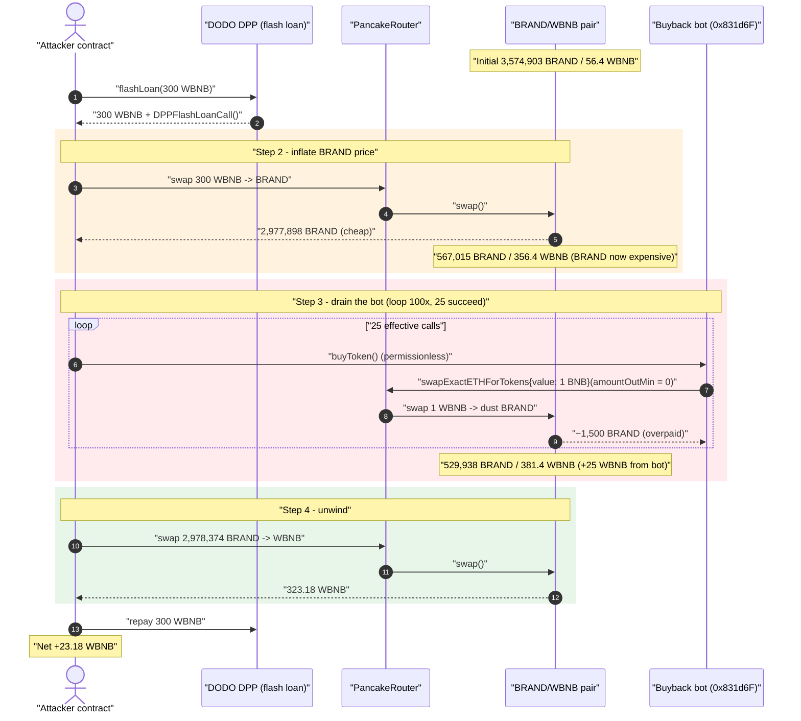
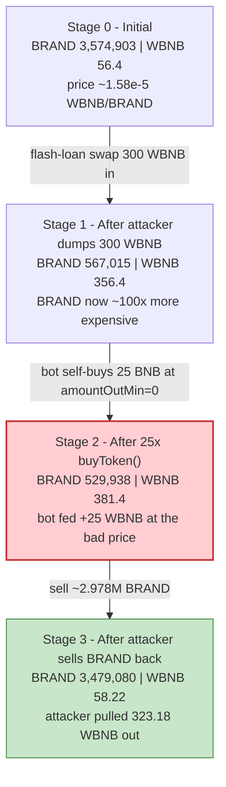
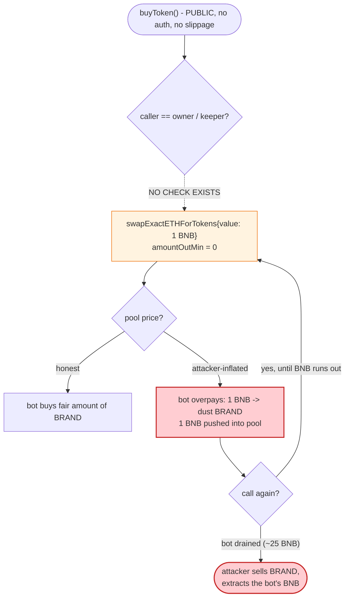

# BrandPad (BRAND) Exploit — Permissionless `buyToken()` Buyback-Bot Sandwich

> **Vulnerability classes:** vuln/access-control/missing-auth · vuln/defi/sandwich-attack

> One-liner: a public, slippage-blind "buyback" bot (`buyToken()`) is forced to market-buy BRAND
> with its own BNB at a price the attacker first inflated with a flash-loaned swap, letting the
> attacker round-trip the bot's BNB out for **~23.18 WBNB** profit.

> **Reproduction:** the PoC compiles & runs in an isolated Foundry project at
> [this project folder](.). Full verbose trace: [output.txt](output.txt).
> The vulnerable bot contract is **unverified** on BscScan, so its logic is reconstructed
> from the on-chain trace + bytecode (function selectors recovered with `cast 4byte`);
> the verified [BrandPad token](sources/BrandPad_4d993e/BrandPad.sol) and the
> [DODO DPP flash-loan pool](sources/DPP_6098A5/DPP.sol) are included as supporting sources.

---

## Key info

| | |
|---|---|
| **Loss** | **~23.18 WBNB** profit to the attacker; ~25.3 BNB drained from the BRAND buyback bot |
| **Vulnerable contract** | BRAND buyback bot — [`0x831d6F9AA6AF85CeAD4ccEc9B859c64421EEeFD4`](https://bscscan.com/address/0x831d6F9AA6AF85CeAD4ccEc9B859c64421EEeFD4) (unverified; `buyToken()` selector `0xa4821719`) |
| **Asset / token** | BrandPad `BRAND` — [`0x4d993ec7b44276615bB2F6F20361AB34FbF0ec49`](https://bscscan.com/address/0x4d993ec7b44276615bB2F6F20361AB34FbF0ec49#code) (9-decimal reflection token, 3% fee) |
| **Victim pool** | BRAND/WBNB PancakeSwap-V2 pair — `0x0040890a6a33674Db2dD706462398503B6Ab7078` |
| **Flash-loan source** | DODO DPP pool — [`0x6098A5638d8D7e9Ed2f952d35B2b67c34EC6B476`](https://bscscan.com/address/0x6098A5638d8D7e9Ed2f952d35B2b67c34EC6B476#code) (0-fee `flashLoan`) |
| **Attacker EOA** | `0x835b45d38cbdccf99e609436ff38e31ac05bc502` |
| **Attacker contract** | `0xf994f331409327425098feecfc15db7fabf782b7` |
| **Attack tx** | `0x19ef4febcd272643642925d5d7e9ab8fd3ed8785c5e3268f5b6fee44ae6b4a34` |
| **Chain / block / date** | BSC / 33,139,124 (fork) / Nov 1, 2023 |
| **Compiler** | PoC: Solidity ^0.8.10; token: v0.6.x/0.8.x reflection; DPP: v0.6.9 |
| **Bug class** | Missing access control + zero-slippage market buy on a permissionless buyback bot → price-manipulation sandwich |

---

## TL;DR

The BRAND project deployed a "buyback" / market-maker bot at `0x831d6F…EEeFD4` and pre-funded it with
~25.3 BNB. The bot exposes a function `buyToken()` (selector `0xa4821719`) that, on every call,
spends a fixed `transactionAmount` (= **1 BNB**) of the **bot's own native balance** to market-buy
BRAND on PancakeSwap via `swapExactETHForTokensSupportingFeeOnTransferTokens(..., amountOutMin = 0, ...)`.

Two fatal properties combine:

1. **`buyToken()` has no access control** — anyone can call it, any number of times, in the same
   transaction.
2. **It buys with `amountOutMin = 0`** — it accepts any price the pool quotes, so it has no
   protection against a manipulated pool.

The attacker therefore runs a textbook sandwich, but where the *victim trade is one the attacker
triggers itself*:

1. Flash-borrow 300 WBNB (DODO DPP, zero fee) and swap it all into BRAND. This empties the pool's
   BRAND reserve and floods it with WBNB, making BRAND extremely expensive in WBNB terms — i.e. the
   attacker now holds cheap BRAND and the pool is mispriced.
2. Call `buyToken()` 100 times. Each successful call forces the bot to spend 1 BNB buying BRAND at
   the inflated price, receiving almost nothing back and **pushing its WBNB straight into the pool**.
   The bot only held ~25.3 BNB, so **25** calls succeed (25 BNB spent) and the rest silently no-op.
3. Sell the attacker's BRAND back into the now WBNB-heavy pool, pulling out **323.18 WBNB**.
4. Repay the 300 WBNB flash loan. Net profit ≈ **23.18 WBNB**.

The attacker simply pocketed the BNB the project loaded into its own buyback bot.

---

## Background — the moving parts

- **BrandPad (`BRAND`)** — [`sources/BrandPad_4d993e/BrandPad.sol`](sources/BrandPad_4d993e/BrandPad.sol)
  is an ordinary 9-decimal reflection token: 3% transfer fee (`_tFeePercent = 3`) with a
  feeless-exemption mapping (`_isFeeless`). It is **not** the vulnerable contract — its only role here
  is that fee-on-transfer behaviour is why the PoC uses
  `swap...SupportingFeeOnTransferTokens`. Total supply 188,100,000 BRAND.
- **BRAND/WBNB pair** `0x0040890a…7078` — a standard PancakeSwap-V2 pair. `token0 = BRAND`,
  `token1 = WBNB`, so `reserve0 = BRAND` (9 dec), `reserve1 = WBNB` (18 dec). At the fork block the
  honest pool held **3,574,903.35 BRAND / 56.40 WBNB**.
- **The buyback bot** `0x831d6F…EEeFD4` (vulnerable, **unverified**) — recovered function set
  (via `cast 4byte` over the deployed bytecode):

  | Selector | Signature | Notes |
  |---|---|---|
  | `0xa4821719` | `buyToken()` | **permissionless market-buy of BRAND with 1 BNB of bot funds, `amountOutMin = 0`** |
  | `0x9769f0b0` | `sellToken()` | counterpart sell |
  | `0xd942bffa` | `transactionAmount()` | per-call native amount = **1 BNB** at the fork block |
  | `0x5117dbce` | `updateTransactionAmount(uint256)` | owner-only |
  | `0xc851cc32` | `updateRouter(address)` | owner-only |
  | `0x6691461a` | `updateTokenAddress(address)` | owner-only |
  | `0x5a18664c` | `withdrawNativeToken()` | owner withdrawal |
  | `0x068acf6c` | `withdrawStuckToken(address)` | owner withdrawal |
  | `0x67272999` | `claimETH()` | owner withdrawal |
  | `0x8da5cb5b` / `0xf2fde38b` / `0x715018a6` | `owner()` / `transferOwnership` / `renounceOwnership` | OpenZeppelin `Ownable` |

  Read on-chain at the fork block:

  | Bot state @ block 33,139,124 | Value |
  |---|---|
  | native (BNB) balance | **25.3156 BNB** |
  | `transactionAmount()` | **1.0 BNB** (`1e18`) |
  | `owner()` | `0x70547a2cE4Def7175C69421d7221f62992C81a58` |

- **DODO DPP pool** `0x6098A5…B476` — [`sources/DPP_6098A5/DPP.sol`](sources/DPP_6098A5/DPP.sol#L1192)
  provides a **zero-fee** `flashLoan(baseAmount, quoteAmount, assetTo, data)` that transfers the assets
  out, calls the borrower's `DPPFlashLoanCall(...)` callback, and checks repayment afterward. Purely a
  funding vehicle here — no DPP bug is involved.

---

## The vulnerable code

The bot is unverified, so the exact Solidity is not on BscScan, but the trace pins its behaviour
exactly. A faithful reconstruction of `buyToken()` (matching every call/event observed in
[output.txt](output.txt#L70-L109)) is:

```solidity
// 0x831d6F9AA6AF85CeAD4ccEc9B859c64421EEeFD4  (UNVERIFIED — reconstructed from trace + bytecode)
uint256 public transactionAmount;   // = 1 ether at the fork block
address public router;               // = PancakeRouter 0x10ED43C7...
address public tokenAddress;         // = BRAND 0x4d993ec7...

function buyToken() external {                       // ⚠️ NO access control
    address[] memory path = new address[](2);
    path[0] = IUniswapV2Router(router).WETH();        // WBNB
    path[1] = tokenAddress;                           // BRAND
    IUniswapV2Router(router).swapExactETHForTokensSupportingFeeOnTransferTokens
        { value: transactionAmount }(                 // ⚠️ spends the BOT's own 1 BNB
            0,                                        // ⚠️ amountOutMin = 0  (no slippage guard)
            path,
            address(this),                            // bot keeps the BRAND it buys
            block.timestamp
        );
}
```

What the trace confirms for each successful call ([output.txt:70-109](output.txt#L70-L109)):

- `Recovery::WETH()` → `0xbb4C…095c` (WBNB),
- `Recovery::swapExactETHForTokensSupportingFeeOnTransferTokens{value: 1000000000000000000}(0, [WBNB, BRAND], 0x831d6F…, deadline)`,
- WBNB `deposit{value: 1e18}` then `transfer` into the pair, then `pair.swap(...)` paying BRAND to the bot.

(`Recovery` is just how the trace labels the PancakeSwap router `0x10ED43C7…` proxy in this fork.)

The **token contract itself is fine** — see the verified
[`BrandPad._transfer` / `_getTValues`](sources/BrandPad_4d993e/BrandPad.sol). The vulnerability is
entirely in the bot.

---

## Root cause — why it was possible

A market-buy that (a) spends a privileged contract's own funds, (b) is callable by anyone, and
(c) accepts any execution price, is an open invitation to be sandwiched. Three independent failures
compose:

1. **Permissionless privileged action.** `buyToken()` should have been a keeper/owner-only or
   internally-scheduled action. Because it is public, the attacker — not the project — decides *when*
   the bot buys. The attacker fires it precisely when the pool is mispriced in the attacker's favour.

2. **Zero slippage protection (`amountOutMin = 0`).** The bot blindly accepts whatever BRAND the pool
   quotes. After the attacker's 300-WBNB swap inflated BRAND's WBNB price ~100×, each 1-BNB bot buy
   bought essentially nothing — but the bot still handed 1 BNB to the pool. That BNB is exactly what
   the attacker harvests on the way out.

3. **Repeatable in a single transaction.** With no per-block / per-call guard and no reentrancy
   concern, the attacker loops `buyToken()` 100× inside one flash-loan callback, draining the bot's
   entire BNB balance in one atomic, risk-free transaction.

The flash loan is incidental working capital: it lets the attacker temporarily move the pool price
with 300 WBNB it does not own, then unwind. Because the DODO DPP loan is **fee-free**, the only cost
is gas, so the whole 25-BNB-drain → 23.18-WBNB-profit round trip carries no economic risk.

> In effect, `buyToken()` is a "donate my BNB to the pool at a price you choose" button left open to
> the public.

---

## Preconditions

- The buyback bot holds a non-trivial BNB balance (25.3 BNB here) and `transactionAmount > 0`.
- `buyToken()` is callable by anyone (no `onlyOwner`/keeper modifier) — satisfied.
- `buyToken()` buys with `amountOutMin = 0` — satisfied.
- A BRAND/WBNB AMM pool whose price the attacker can move within one transaction, plus working capital
  to move it. Here a **fee-free** 300-WBNB DODO DPP flash loan provides the capital, making the attack
  zero-cost and risk-free.

---

## Attack walkthrough (with on-chain numbers from the trace)

Pair `token0 = BRAND` (9 dec), `token1 = WBNB` (18 dec); all reserves below are read from the `Sync`
events in [output.txt](output.txt). BRAND amounts shown in whole BRAND (raw / 1e9), WBNB in whole
WBNB (raw / 1e18).

| # | Step | Pool BRAND | Pool WBNB | Effect (trace ref) |
|---|------|-----------:|----------:|--------|
| 0 | **Initial** (honest pool) | 3,574,903.35 | 56.40 | start ([getReserves](output.txt#L43)) |
| 1 | **Flash-loan 300 WBNB** from DODO DPP | — | — | `flashLoan(300e18, 0, attacker, …)` ([:19](output.txt#L19)) |
| 2 | **Dump 300 WBNB → BRAND** (attacker corner-buy) | 567,015.55 | 356.40 | attacker receives **2,977,898.68 BRAND**; pool now WBNB-heavy, BRAND scarce/expensive ([Sync :60](output.txt#L60)) |
| 3 | **`buyToken()` × 100** (only 25 succeed) | 529,938.59 | 381.40 | bot spends **1 BNB each** at the inflated price, getting ~1,500 BRAND/BNB; pushes **25 WBNB** into the pool, keeps the worthless BRAND ([first buy :70](output.txt#L70), [25th Sync :1086](output.txt#L1086)) |
| 4 | **Sell 2,978,374.96 BRAND → WBNB** (attacker unwind) | 3,479,080.68 | 58.22 | attacker pulls **323.18 WBNB** out of the pool ([final swap :1552](output.txt#L1552), [Sync :1580](output.txt#L1580)) |
| 5 | **Repay 300 WBNB** flash loan | — | — | `WBNB.transfer(DPP, 300e18)` ([:1588](output.txt#L1588)) |

**Why only 25 of the 100 `buyToken()` calls did anything:** the bot held ~25.3 BNB and each call
spends exactly 1 BNB. The trace contains exactly **25** `WBNB.deposit{value: 1e18}` events and **25**
BRAND payouts to the bot; once the bot's balance fell below 1 BNB the inner router call reverted and
was swallowed by the attacker's `address(Vulncontract).call(...)` (whose return value is ignored), so
the remaining ~75 calls were harmless no-ops.

### Profit / loss accounting (WBNB)

| Direction | Amount (WBNB) |
|---|---:|
| Borrowed (DODO DPP, fee-free) | 300.0000 |
| Out — corner buy into pool (step 2) | −300.0000 |
| In — final BRAND→WBNB sell (step 4) | +323.1819 |
| Out — flash-loan repayment (step 5) | −300.0000 |
| **Net attacker profit** | **+23.1819** |

| Victim accounting | Amount |
|---|---:|
| BNB drained from buyback bot (25 × 1 BNB) | ~25.0 BNB |
| Bot BNB balance before / after | 25.3156 → ~0.3 BNB |

The ~25 BNB the bot lost minus the ~1.8 BNB eaten by pool fees / residual leaves the attacker's
**+23.18 WBNB** profit. The loss is borne by the project that funded the bot; the pool LPs net out
roughly flat (the attacker's two swaps and the bot's buys all paid them fees).

---

## Diagrams

### Sequence of the attack



### Pool state evolution



### The flaw inside `buyToken()`



---

## Remediation

1. **Add access control to `buyToken()` / `sellToken()`.** A buyback bot must restrict its trading
   entry points to the owner or a trusted keeper (`onlyOwner` / role-gated). The project — not the
   public — should decide when and how often the bot buys.
2. **Never trade with `amountOutMin = 0`.** Pass a real minimum-out derived from a manipulation-
   resistant reference (TWAP/oracle), or bound the allowed slippage. A zero floor means "execute at
   any price," which is always exploitable on an AMM.
3. **Rate-limit the action.** Even if gated, cap buys per block / per interval (e.g., enforce a cooldown
   using `transactionAmount` and a `lastBuy` timestamp) so the bot cannot be drained in a single
   transaction.
4. **Keep idle capital out of the bot.** Hold only the funds needed for the next scheduled buy; sweep
   the rest to a treasury so a single failure can lose at most one tranche.
5. **Use commit/keeper infrastructure for buybacks.** Off-chain keepers submitting price-checked,
   slippage-bounded buys (or MEV-protected private transactions) remove the on-chain "buy at any price"
   button entirely.

---

## How to reproduce

The PoC was extracted into a standalone Foundry project (the umbrella DeFiHackLabs repo has several
unrelated PoCs that fail to compile under a whole-project `forge build`):

```bash
_shared/run_poc.sh 2023-11-BRAND_exp -vvvvv
```

- RPC: a **BSC archive** endpoint is required (fork block 33,139,124 = Nov 2023). Most public BSC
  RPCs prune that depth and fail with `header not found` / `missing trie node` / `historical state is
  inconsistent`. `foundry.toml` uses `https://api.zan.top/bsc-mainnet`, which serves historical state
  at that block. (The default `bsc-mainnet.public.blastapi.io`, `onfinality`, and free-tier `drpc`
  all failed to return archive state for this block.)
- Result: `[PASS] testExploit()` — attacker WBNB goes `0 → 23.181868108667834716`.

Expected tail:

```
Ran 1 test for test/BRAND_exp.sol:Exploit
[PASS] testExploit() (gas: 3209163)
  [Begin] Attacker WBNB before exploit: 0.000000000000000000
  [End] Attacker WBNB after exploit: 23.181868108667834716
Suite result: ok. 1 passed; 0 failed; 0 skipped
```

---

*References: @MetaSec_xyz — https://x.com/MetaSec_xyz/status/1720035913009709473 ; attack tx*
*`0x19ef4febcd272643642925d5d7e9ab8fd3ed8785c5e3268f5b6fee44ae6b4a34` on BscScan.*
