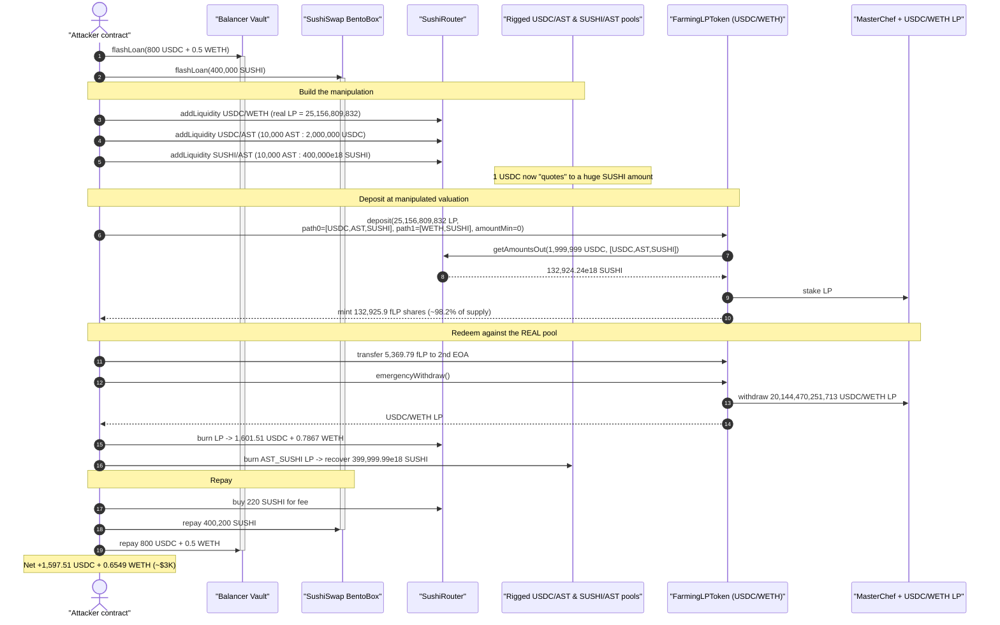
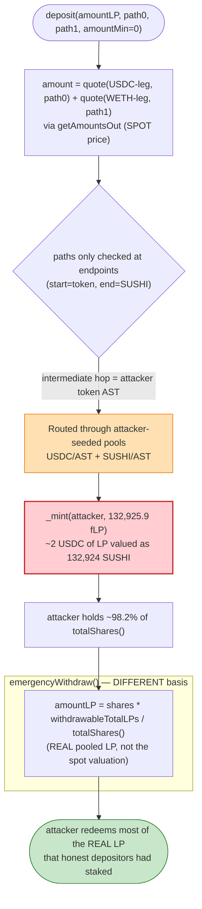
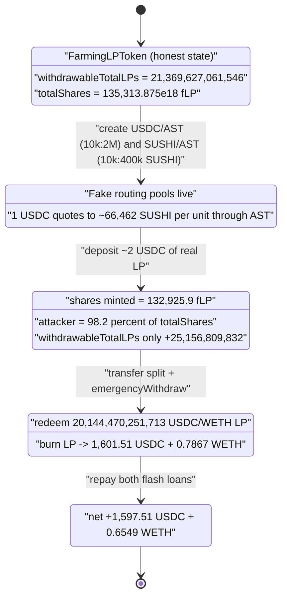

# Burntbubba (LevX / FarmingLPToken) Exploit — Spot-Price Share Minting Manipulated via Attacker-Created Routing Pools

> **Reproduction:** the PoC compiles & runs in an isolated Foundry project at
> [this project folder](.) (the umbrella DeFiHackLabs repo does not whole-compile, so this
> PoC was extracted). Full verbose trace: [output.txt](output.txt).
> Verified vulnerable source: [contracts_FarmingLPToken.sol](sources/FarmingLPToken_a44e79/contracts_FarmingLPToken.sol).

---

## Key info

| | |
|---|---|
| **Loss** | ~$3K — **1,597.51 USDC + 0.6549 WETH** extracted by the attacker contract (≈ the underlying USDC/WETH LP that the inflated fLP shares were redeemed for) |
| **Vulnerable contract** | `FarmingLPToken` (LevX `sushi-farming`) — [`0xa44e79a2c9a8965e7A6FA77BF0ca8FAF50e6C73E`](https://etherscan.io/address/0xa44e79a2c9a8965e7a6fa77bf0ca8faf50e6c73e#code) |
| **Factory (yieldVault provider)** | `FarmingLPTokenFactory` — [`0xEE083E0F0f5dE2ff34662F1ef6f76d897d5047EF`](https://etherscan.io/address/0xEE083E0F0f5dE2ff34662F1ef6f76d897d5047EF#code) |
| **Underlying LP / victim pool** | SushiSwap **USDC/WETH** pair `0x397FF1542f962076d0BFE58eA045FfA2d347ACa0` (`SushiUSDC`) — the source of the redeemed value |
| **Attacker EOA** | `0x9d44f1a37044500064111010632a8a59003701c8` |
| **Attack contract** | `0x4Bc691601B50B3e107B89d5EA172B40a9dbC6251` (PoC re-deploys an equivalent; reads slot 10 from the original for the exact transfer split) |
| **Attack tx** | [`0x2b6d0af0dc513a15e325703405739057f9de6ef3f99934b957653b8a3fade4c6`](https://app.blocksec.com/explorer/tx/eth/0x2b6d0af0dc513a15e325703405739057f9de6ef3f99934b957653b8a3fade4c6) |
| **Chain / block / date** | Ethereum mainnet / 18,680,254 / Nov 2023 |
| **Compiler** | Solidity v0.8.17, optimizer 200 runs |
| **Bug class** | Price-manipulation of vault-share minting — value derived from manipulable AMM spot price (`getAmountsOut`) through attacker-created routing pools |

---

## TL;DR

`FarmingLPToken` is an ERC-4626-flavoured wrapper that takes a SushiSwap LP token (here the USDC/WETH
pair), farms it in MasterChef, and mints "fLP" shares to the depositor. The number of shares minted is
**the SUSHI-denominated value of the deposited LP**, computed at deposit time by quoting the LP's two
underlying token amounts through caller-supplied swap paths using
`UniswapV2Router.getAmountsOut(...)`
([contracts_FarmingLPToken.sol:213-223](sources/FarmingLPToken_a44e79/contracts_FarmingLPToken.sol#L213-L223)).

`getAmountsOut` is an **instantaneous spot price**. The caller fully controls the `path0`/`path1`
arrays (only their first/last hops are validated), so the attacker routes the valuation through
**brand-new pools they created and seeded with rigged ratios**. The result: ~2 USDC worth of LP is
valued at **132,924 SUSHI**, minting **132,925.9 fLP shares** for a deposit whose real underlying LP is
worth only ~20,144 USDC-LP units. Those over-minted shares are then redeemed pro-rata against the real
pooled LP, letting the attacker walk off with USDC/WETH that does not belong to them.

The attacker stacks two flash loans (Balancer for 800 USDC + 0.5 WETH; SushiSwap BentoBox for 400,000
SUSHI) purely as working capital to build the rigged pools and supply the fee, then repays both in the
same transaction. Net profit ≈ **1,597.51 USDC + 0.6549 WETH (~$3K)**.

---

## Background — what FarmingLPToken does

`FarmingLPToken` ([source](sources/FarmingLPToken_a44e79/contracts_FarmingLPToken.sol)) is one instance
of LevX's `sushi-farming` system. Each instance is a minimal-proxy clone (hence the `[delegatecall]`
into itself in the trace) deployed by `FarmingLPTokenFactory`
([0xEE083E…](sources/FarmingLPToken_a44e79/contracts_FarmingLPTokenFactory.sol)). The instance attacked
here wraps the SushiSwap **USDC/WETH** LP token.

Its model:

- **Deposit** — a user supplies SushiSwap LP tokens. The contract stakes them in MasterChef
  (`pid`), accrues SUSHI yield, and mints `fLP` "shares" to the user.
- **Share unit = SUSHI** — shares are denominated in SUSHI. The amount minted on deposit is the LP's
  estimated SUSHI value, obtained by (a) computing the LP's pro-rata share of each underlying reserve
  and (b) quoting each through a SUSHI-terminated swap path
  (`_deposit`, [:201-227](sources/FarmingLPToken_a44e79/contracts_FarmingLPToken.sol#L201-L227)).
- **Withdraw / emergencyWithdraw** — burns shares and returns LP pro-rata:
  `amountLP = shares * withdrawableTotalLPs / totalShares`
  (`emergencyWithdraw`, [:295-306](sources/FarmingLPToken_a44e79/contracts_FarmingLPToken.sol#L295-L306)).

The fatal property: **deposits mint shares from a manipulable spot price, but withdrawals pay out from
the real pooled LP** — `withdrawableTotalLPs` only ever increases by the actual LP amount deposited.
So inflating the minted-share count does not inflate the pool's real assets; the surplus shares are a
claim on **everyone else's** LP.

---

## The vulnerable code

### Share amount is the spot-price SUSHI valuation of the LP

```solidity
// contracts/FarmingLPToken.sol  (_deposit)
IERC20(lpToken).safeTransferFrom(msg.sender, address(this), amountLP);

uint256 total = IUniswapV2Pair(lpToken).totalSupply();
(uint256 reserve0, uint256 reserve1, ) = IUniswapV2Pair(lpToken).getReserves();
uint256 amount = UniswapV2Utils.quote(router, (reserve0 * amountLP) / total, path0) +
    UniswapV2Utils.quote(router, (reserve1 * amountLP) / total, path1);

if (amount < amountMin) revert InsufficientAmount();   // amountMin = 0 in the attack

IMasterChef(masterChef).deposit(pid, amountLP);
_depositSushi();

_mint(beneficiary, amount);          // ⚠️ shares minted = spot-price valuation
withdrawableTotalLPs += amountLP;    // real assets only grow by actual LP
```

[contracts_FarmingLPToken.sol:201-227](sources/FarmingLPToken_a44e79/contracts_FarmingLPToken.sol#L201-L227)

The only validation on the paths is the first and last hop:

```solidity
if (path0[0] != token0 || path0[path0.length - 1] != sushi) revert InvalidPath();
if (path1[0] != token1 || path1[path1.length - 1] != sushi) revert InvalidPath();
```

[contracts_FarmingLPToken.sol:208-209](sources/FarmingLPToken_a44e79/contracts_FarmingLPToken.sol#L208-L209)
— so for the USDC/WETH instance, `path0` must start at USDC and end at SUSHI, `path1` must start at
WETH and end at SUSHI. The **intermediate hops are unconstrained**, letting the attacker insert their
own token (`AST`) and route through pools they just created.

### `quote` is a raw spot-price `getAmountsOut`

```solidity
// contracts/libraries/UniswapV2Utils.sol
function quote(address router, uint256 amountIn, address[] memory path) internal view returns (uint256 amountOut) {
    if (path.length < 2) return amountIn;
    uint256[] memory amountsOut = IUniswapV2Router02(router).getAmountsOut(amountIn, path);
    return amountsOut[amountsOut.length - 1];
}
```

[contracts_libraries_UniswapV2Utils.sol:14-23](sources/FarmingLPToken_a44e79/contracts_libraries_UniswapV2Utils.sol#L14-L23)
— there is no TWAP, no sanity bound, no comparison against a trusted oracle. The mint amount is
whatever the *current reserves* of the (attacker-built) pools imply.

### Withdrawal pays out from the real pool, not from the inflated shares' "value"

```solidity
// contracts/FarmingLPToken.sol  (emergencyWithdraw)
uint256 shares   = sharesOf(msg.sender);
uint256 amountLP = (shares * withdrawableTotalLPs) / totalShares();   // pro-rata over REAL LP
IMasterChef(masterChef).withdraw(pid, amountLP);
IERC20(lpToken).safeTransfer(beneficiary, amountLP);
_burn(msg.sender, shares);
withdrawableTotalLPs -= amountLP;
```

[contracts_FarmingLPToken.sol:295-306](sources/FarmingLPToken_a44e79/contracts_FarmingLPToken.sol#L295-L306)

Because the attacker's over-minted shares make up the lion's share of `totalShares()`, their pro-rata
slice of `withdrawableTotalLPs` is most of the pool — i.e., they redeem far more LP than the LP they
actually deposited, eating into the LP that legitimate depositors had staked.

---

## Root cause — why it was possible

The protocol prices a deposit using a **manipulable, caller-routed spot price** and mints shares from
that price, while the redemption side honours the **real** pooled LP. Concretely:

1. **Spot price as a valuation oracle.** `getAmountsOut` reflects only current reserves. A pool that an
   attacker just created and seeded with any ratio they like produces any "price" they like. Using it
   to size minted shares is equivalent to letting the depositor declare how many shares they receive.
2. **Caller controls the routing path.** Only the path endpoints are checked. The attacker inserts an
   intermediate token (`AST`) and routes through two fresh pools (`USDC/AST` and `SUSHI/AST`) whose
   ratios make 1 USDC quote to an enormous SUSHI amount.
3. **Mint and redeem use different accounting bases.** `_mint` uses the spot valuation; `withdraw`/
   `emergencyWithdraw` use `withdrawableTotalLPs` (the real LP). The mismatch is the theft: surplus
   shares are a claim on other users' LP, not on assets the depositor actually brought.
4. **`amountMin` is attacker-supplied and set to 0.** The one guard against a bad quote
   (`if (amount < amountMin) revert`) is disabled by the caller passing `amountMin = 0`.

This is the classic AMM-spot-price-as-oracle bug applied to share minting: the share price is read from
liquidity the attacker fully controls within the same transaction.

---

## Preconditions

- The `FarmingLPToken` instance must already hold real, withdrawable LP from honest depositors
  (so there is something to over-claim). At the fork block `withdrawableTotalLPs ≈ 21,369,627,061,546`
  USDC/WETH-LP units and `totalShares ≈ 135,313.8e18` fLP before the attacker deposits.
- Working capital, fully recovered intra-transaction (hence flash-loanable):
  - **Balancer** flash loan: 800 USDC + 0.5 WETH (0 fee) — used to seed the rigged pools and as the
    WETH leg.
  - **SushiSwap BentoBox** flash loan: 400,000 SUSHI (fee 200 SUSHI) — used to seed the SUSHI/AST pool
    so the valuation path returns a huge SUSHI figure.
- A dust amount of the intermediate token `AST` (the PoC `deal`s 2,062,557 wei of AST) to seed the
  two AST pools.

---

## Attack walkthrough (with on-chain numbers from the trace)

All figures are taken from [output.txt](output.txt). The attacker contract is the entry; it nests a
Balancer flash loan ⇒ a SushiSwap flash loan ⇒ the rigging + deposit + redemption.

| # | Step | Concrete numbers (from trace) | Effect |
|---|------|------------------------------|--------|
| 0 | **Balancer flashLoan** 800 USDC + 0.5 WETH | [output.txt:78-102](output.txt) | Working capital in. |
| 1 | **SushiSwap (BentoBox) flashLoan** 400,000 SUSHI (fee 200) | [:104-111](output.txt) | SUSHI to seed the rigged SUSHI pool. |
| 2 | **Seed real USDC/WETH LP** — `addLiquidity(USDC, WETH, 2e6, 1e15)` mints **25,156,809,832** SushiUSDC LP to attacker | [:139-181](output.txt) | This LP is the only *real* asset the attacker deposits. |
| 3 | **Create + seed rigged USDC/AST pool** — `addLiquidity(USDC, AST, 2e6, 10e3)` ⇒ new pair `0xd3A1…`, reserves **10,000 AST : 2,000,000 USDC** | [:182-244](output.txt) | 1 AST ≈ 200 USDC in this fake pool. |
| 4 | **Create + seed rigged SUSHI/AST pool** — `addLiquidity(SUSHI, AST, 400000e18, 10e3)` ⇒ `AST_SUSHI` `0xd47f…`, reserves **10,000 AST : 400,000e18 SUSHI** | [:245-304](output.txt) | 1 AST ≈ 40e18 SUSHI in this fake pool. |
| 5 | **Deposit the real LP** — `FarmingLPToken.deposit(25,156,809,832, path0=[USDC,AST,SUSHI], path1=[WETH,SUSHI], amountMin=0)` | [:307-421](output.txt) | Triggers the manipulated valuation. |
| 5a | valuation: LP's USDC leg = **1,999,999 USDC** → quote `[USDC,AST,SUSHI]` = **132,924.24e18 SUSHI** | [:319-324](output.txt) | ~2 USDC valued at 132,924 SUSHI through the rigged pools. |
| 5b | valuation: LP's WETH leg = **0.000982 WETH** → quote `[WETH,SUSHI]` = **1.652e18 SUSHI** | [:325-328](output.txt) | Tiny, via the real WETH/SUSHI pool. |
| 5c | **shares minted = 132,924.24 + 1.65 = 132,925.9 fLP** | [:412-413](output.txt) | Over-minted vs the trivial real LP deposited. |
| 6 | read post-deposit state: `withdrawableTotalLPs = 21,369,627,061,546`, `totalShares = 135,313.875e18`, attacker `balanceOf = 132,925.897e18` | [:424-457](output.txt) | Attacker now owns ~98.2% of all shares. |
| 7 | **Transfer 5,369.79e18 fLP to a 2nd EOA** (`toAddr`); split sized so the rest redeems exactly the targeted LP slice (`value = 20,144,470,251,714` read from original attacker slot 10) | [:458-489](output.txt) | Matches the original tx's two-recipient split. |
| 8 | **`emergencyWithdraw`** burns remaining 127,556.10e18 fLP → returns **amountLP = 20,144,470,251,713** SushiUSDC LP | [:490-525](output.txt) | Redeems pro-rata against the **real** pool. |
| 9 | **Burn that LP** (`SushiUSDC.burn`) → **1,601.51 USDC + 0.7867 WETH** | [:526-569](output.txt) | LP redeemed into underlying tokens. |
| 10 | **Burn the rigged AST_SUSHI LP** → recovers 9,999 AST + **399,999.99e18 SUSHI** | [:570-609](output.txt) | Reclaims the SUSHI used to seed the fake pool. |
| 11 | **Buy 220 SUSHI** with WETH to cover the 200-SUSHI flash-loan fee + buffer | [:610-637](output.txt) | Repayment funding. |
| 12 | **Repay SushiSwap** 400,200 SUSHI; **repay Balancer** 800 USDC + 0.5 WETH | [:638-664](output.txt) | Both flash loans cleared. |
| 13 | **Final attacker balances** | [:675-682](output.txt) | **1,597.51 USDC + 0.6549 WETH** kept. |

### The valuation math (verified against the trace)

LP deposited = 25,156,809,832 of `SushiUSDC.totalSupply = 88,227,612,603,823,949`, pool reserves
`7,014,213,105,075 USDC / 3,445,432,035,340,938,810,944 WETH`:

- USDC leg = `reserve0 * amountLP / total = 1,999,999` (≈ 2 USDC)
- WETH leg = `reserve1 * amountLP / total = 982,414,415,896,775` (≈ 0.000982 WETH)

Quoting:

- `getAmountsOut(1,999,999, [USDC,AST,SUSHI])` = **132,924,244,496,102,830,575,687** (rigged pools)
- `getAmountsOut(982,414,415,896,775, [WETH,SUSHI])` = **1,652,456,944,262,126,787** (real pool)

`amount = 132,924,244,496,102,830,575,687 + 1,652,456,944,262,126,787 = 132,925,896,953,047,092,702,474`
= **exactly the shares minted** at [output.txt:413](output.txt). The whole position was created by
valuing ~2 USDC of LP at ~132,924 SUSHI.

### Profit accounting

| Asset | Final attacker balance |
|---|---:|
| USDC | **1,597.512305** |
| WETH | **0.654886372151164260** |

Both flash loans are repaid in full inside the transaction (Balancer fee 0; SushiSwap fee 200 SUSHI,
funded by the recovered seed SUSHI + a small WETH→SUSHI buy). Starting balances were 0 USDC / 0 WETH,
so the residual is pure profit ≈ **$3K** (≈ 1,597.51 USDC + 0.6549 WETH at ~$2,050/ETH ≈ $2,940),
matching the PoC header's `~$3K`.

---

## Diagrams

### Sequence of the attack



### Share accounting: what minting vs. redeeming each trusts



### Pool / state evolution



---

## Why each magic number

- **`addLiquidity(USDC, AST, 2e6, 10e3)`** → reserves `10,000 AST : 2,000,000 USDC`. This makes the
  first hop `USDC → AST` return ~AST per USDC at a price the attacker chooses.
- **`addLiquidity(SUSHI, AST, 400000e18, 10e3)`** → reserves `10,000 AST : 400,000e18 SUSHI`. The
  second hop `AST → SUSHI` then multiplies into an enormous SUSHI figure, so the two-hop quote of ~2
  USDC lands at **132,924 SUSHI**. The 400,000 SUSHI is exactly the flash-loaned amount.
- **`amountMin = 0`** in the `deposit` call disables the only quote sanity check
  ([:218](sources/FarmingLPToken_a44e79/contracts_FarmingLPToken.sol#L218)).
- **`vm.load(originalAttackContract, slot 10)` = 20,144,470,251,714**: the exact LP figure the original
  attacker targeted; the PoC uses it to split shares between the contract and a 2nd EOA so the
  remaining shares redeem precisely that LP amount, reproducing the on-chain split.
- **Buy 220 SUSHI (`feeAmount + feeAmount/10`)**: covers the 200-SUSHI BentoBox flash-loan fee plus a
  10% buffer, funded by selling a little WETH.

---

## Remediation

1. **Do not value share minting from AMM spot price.** Replace `getAmountsOut`-based valuation with a
   manipulation-resistant source: the LP's own reserves valued via a TWAP or an external oracle
   (e.g., Chainlink) for the underlying assets, computed over a window the attacker cannot move within
   one transaction.
2. **Mint shares from the deposited LP directly, in LP units.** The safest design for an LP wrapper is
   to make shares proportional to LP deposited relative to `withdrawableTotalLPs`
   (`shares = amountLP * totalShares / withdrawableTotalLPs`), so the mint and redeem bases are
   identical and no external price is needed at all.
3. **Constrain the routing path completely, or remove caller-supplied paths.** Allowing arbitrary
   intermediate hops lets the caller route valuation through pools they create. Hard-code canonical
   token0→SUSHI / token1→SUSHI routes, or disallow paths through non-whitelisted pools/tokens.
4. **Reject freshly created / low-liquidity pools in any pricing path.** Require a minimum reserve /
   minimum pool age, or check that each hop's pool has meaningful, externally-anchored liquidity before
   trusting its price.
5. **Enforce a meaningful `amountMin` server-side, not from the caller.** A caller-chosen `amountMin`
   provides no protection; bound the minted amount against an independently computed reference value.

---

## How to reproduce

The PoC was extracted into a standalone Foundry project (the umbrella DeFiHackLabs repo has several
unrelated PoCs that fail to compile under a whole-project `forge build`):

```bash
_shared/run_poc.sh 2023-11-Burntbubba_exp -vvvvv
```

- RPC: an **Ethereum mainnet archive** endpoint is required (fork block 18,680,254). `foundry.toml`
  uses an Infura archive key; the original rotated key returned HTTP 401, so it was swapped for another
  archive key in the same project.
- Local imports beyond the shared `interface.sol`: the PoC imports `./../basetest.sol`, which pulls in
  `./tokenhelper.sol`; both were copied into the project root so the relative path resolves.
- Result: `[PASS] testExploit()`.

Expected tail:

```
Ran 1 test for test/Burntbubba_exp.sol:BurntbubbaExploit
[PASS] testExploit() (gas: 5604417)
  Exploiter USDC balance before attack: 0.000000
  Exploiter WETH balance before attack: 0.000000000000000000
  Exploiter USDC balance after attack: 1597.512305
  Exploiter WETH balance after attack: 0.654886372151164260
Suite result: ok. 1 passed; 0 failed; 0 skipped
```

---

*Reference: post-mortem thread — https://x.com/MetaSec_xyz/status/1730044259087315046 (LevX FarmingLPToken, Ethereum, ~$3K).*
