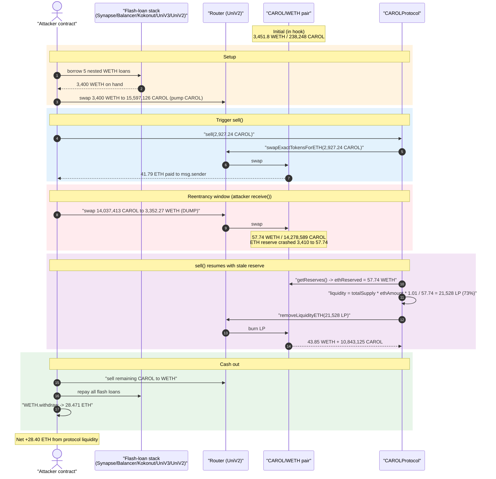
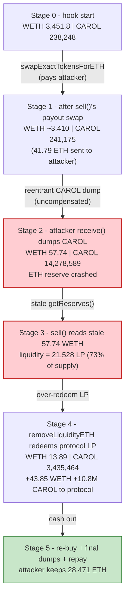
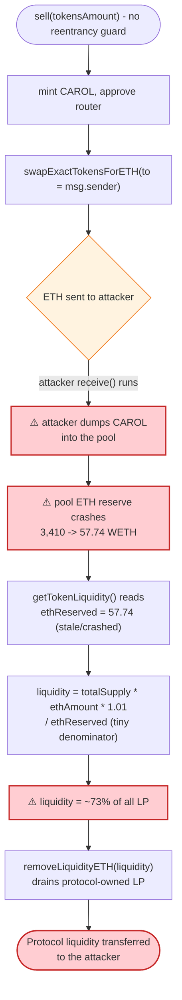

# CAROL Protocol Exploit — Reentrancy in `sell()` via Mid-Function ETH Payout to Attacker

> **Vulnerability classes:** vuln/reentrancy/single-function · vuln/logic/incorrect-order-of-operations

> **Reproduction:** the PoC compiles & runs in an isolated Foundry project at
> [this project folder](.) (the umbrella DeFiHackLabs repo does not whole-compile,
> so this PoC was extracted).
> Full verbose trace: [output.txt](output.txt).
> Verified vulnerable source: [CAROLProtocol.sol](sources/CAROLProtocol_26fe40/CAROLProtocol.sol).

---

## Key info

| | |
|---|---|
| **Loss** | ~$53K — attacker ended with **28.471 ETH** (net **+28.40 ETH**) from a 0.07 ETH stake |
| **Vulnerable contract** | `CAROLProtocol` — [`0x26fe408BbD7A490fEB056DA8e2D1e007938E5685`](https://basescan.org/address/0x26fe408BbD7A490fEB056DA8e2D1e007938E5685#code) |
| **Victim pool** | CAROL/WETH UniV2-style pair — `0x0C477c729816228AF3Cb4E014cbF9412aA080b86` (holds the protocol's own liquidity) |
| **Attacker EOA** | [`0x5aa27d556f898846b9bad32f0cdba5b1f8bc3144`](https://basescan.org/address/0x5aa27d556f898846b9bad32f0cdba5b1f8bc3144) |
| **Attacker contract** | [`0xc4566ae957ad8dde4768bdd28cdc3695e4780b2c`](https://basescan.org/address/0xc4566ae957ad8dde4768bdd28cdc3695e4780b2c) |
| **Prepare tx** | `0x6462f5e358eb2c7769e6aa59ce43277be4799b297bc4c9503610443b9d56cc24` |
| **Attack tx** | `0xd962d397a7f8b3aadce1622e705b9e33b430e86e0d306d6fb8ccbc5957b4185c` |
| **Chain / block / date** | Base / fork at 7,246,080 / Nov 30, 2023 |
| **Compiler** | Solidity v0.8.18, optimizer 200 runs (PoC pinned to 0.8.10) |
| **Bug class** | Reentrancy — stale pool reserve read after an attacker-controlled mid-function ETH payout |

---

## TL;DR

`CAROLProtocol.sell()` is a "burn my receipt → get ETH" function. It does three things in order:

1. mints CAROL and **swaps it for ETH, sending that ETH straight to `msg.sender`**
   ([CAROLProtocol.sol:972-978](sources/CAROLProtocol_26fe40/CAROLProtocol.sol#L972-L978)) — this
   transfers ETH to the attacker **in the middle of the function**, handing them control;
2. **then** reads the pool's current ETH reserve `ethReserved` and computes how much protocol LP to
   redeem: `liquidity = LP.totalSupply * ethAmount * (10000 + 1%) / 10000 / ethReserved`
   ([:982-987](sources/CAROLProtocol_26fe40/CAROLProtocol.sol#L982-L987));
3. removes that much LP from the protocol's own position and re-buys CAROL with the ETH
   ([:994-1010](sources/CAROLProtocol_26fe40/CAROLProtocol.sol#L994-L1010)).

The fatal mistake: between step 1 and step 2, the attacker's `receive()` fires and **dumps a huge
amount of CAROL into the very pool whose reserve `sell()` is about to read**. This crashes the pool's
ETH reserve from **3,410 WETH down to 57.7 WETH**. Because `ethReserved` sits in the *denominator* of
the LP-redemption formula, a tiny `ethReserved` makes `liquidity` explode — the protocol redeems
**~73% of its entire LP position** (vs. the ~1.24% it would have redeemed with an honest reserve, a
**~59× over-redemption**). The attacker, having flash-loaned thousands of WETH to set this up, captures
the protocol's liquidity and walks away with **+28.40 ETH** on a 0.07 ETH starting stake.

---

## Background — what CAROL Protocol does

`CAROLProtocol` ([source](sources/CAROLProtocol_26fe40/CAROLProtocol.sol)) is a yield/bond ("ROI dapp")
contract layered on top of a UniswapV2-style CAROL/WETH pair that the protocol itself seeds with
liquidity:

- **`buy(upline, bondType)`** ([:678-706](sources/CAROLProtocol_26fe40/CAROLProtocol.sol#L678-L706)) —
  user sends ETH; the protocol mints CAROL and adds CAROL+ETH liquidity to the pair, creating a
  time-locked "bond" that accrues a profit percentage.
- **`stake(bondIdx)`** ([:847-893](sources/CAROLProtocol_26fe40/CAROLProtocol.sol#L847-L893)) — the
  user converts an active bond into a staking position that accrues `STAKING_REWARD_PERCENT` (200%/day
  baseline) up to a 150% cap, again backed by protocol-owned LP.
- **`userBalance(addr)`** ([:1087-1126](sources/CAROLProtocol_26fe40/CAROLProtocol.sol#L1087-L1126)) —
  view that computes the user's redeemable CAROL from matured bonds + accrued staking rewards.
- **`sell(tokensAmount)`** ([:955-1019](sources/CAROLProtocol_26fe40/CAROLProtocol.sol#L955-L1019)) —
  the redemption path. It mints the requested CAROL, swaps it to ETH **for the user**, then removes a
  proportional slice of the **protocol's own LP** to "balance the price," and re-buys CAROL.

The protocol holds all the real value: the LP tokens of the CAROL/WETH pair are owned by
`CAROLProtocol` itself. `sell()` is the only path that converts that protocol-owned LP back to ETH, and
its conversion ratio is keyed off the *instantaneous* pool reserve — the manipulable quantity.

The pair's `token0 = WETH`, `token1 = CAROL`, so in trace terms `reserve0 = WETH`, `reserve1 = CAROL`.

---

## The vulnerable code

### `sell()` — payout to attacker, *then* read pool reserve

```solidity
function sell(uint256 tokensAmount) external {
    require(userBalance(msg.sender) >= tokensAmount, "Sell: insufficient balance");
    collect(msg.sender);
    Models.User storage user = users[msg.sender];
    require(user.balance >= tokensAmount, "Sell: insufficient balance");
    user.balance -= tokensAmount;
    user.lastActionTime = block.timestamp;

    address[] memory path = new address[](2);
    path[0] = TOKEN_ADDRESS;
    path[1] = Constants.WRAPPED_ETH;

    CAROLToken(TOKEN_ADDRESS).mint(address(this), tokensAmount);
    CAROLToken(TOKEN_ADDRESS).increaseAllowance(UNISWAP_ROUTER_ADDRESS, tokensAmount);

    // ⚠️ swapExactTokensForETH sends ETH DIRECTLY to msg.sender (the attacker),
    //    triggering attacker's receive() — reentrancy window opens here.
    uint256[] memory amounts = IUniswapV2Router01(UNISWAP_ROUTER_ADDRESS).swapExactTokensForETH(
        tokensAmount, 0, path, msg.sender, block.timestamp + 5 minutes
    );
    uint256 ethAmount = amounts[1];

    // ⚠️ pool reserve read AFTER the attacker had control — now stale/crashed
    (uint256 ethReserved, ) = getTokenLiquidity();
    uint256 liquidity = ERC20(LP_TOKEN_ADDRESS).totalSupply()
        * ethAmount
        * (Constants.PERCENTS_DIVIDER + PRICE_BALANCER_PERCENT)   // (10000 + 100) = +1%
        / Constants.PERCENTS_DIVIDER
        / ethReserved;                                            // ⚠️ attacker-shrunk denominator

    ERC20(LP_TOKEN_ADDRESS).approve(UNISWAP_ROUTER_ADDRESS, liquidity);

    // ⚠️ removes `liquidity` of the PROTOCOL's own LP — value handed to the attacker
    (, uint256 amountETH) = IUniswapV2Router01(UNISWAP_ROUTER_ADDRESS).removeLiquidityETH(
        TOKEN_ADDRESS, liquidity, 0, 0, address(this), block.timestamp + 5 minutes
    );

    path[0] = Constants.WRAPPED_ETH;
    path[1] = TOKEN_ADDRESS;
    amounts = IUniswapV2Router01(UNISWAP_ROUTER_ADDRESS).swapExactETHForTokens{value: amountETH}(
        0, path, address(this), block.timestamp + 5 minutes
    );
    emit Events.Sell(msg.sender, tokensAmount, ethAmount, block.timestamp);
}
```
[CAROLProtocol.sol:955-1019](sources/CAROLProtocol_26fe40/CAROLProtocol.sol#L955-L1019)

### `getTokenLiquidity()` — the manipulable read

```solidity
function getTokenLiquidity() public view returns (uint256 liquidityETH, uint256 liquidityERC20) {
    (liquidityETH, liquidityERC20, ) = IUniswapV2Pair(LP_TOKEN_ADDRESS).getReserves();
}
```
[CAROLProtocol.sol:1140-1145](sources/CAROLProtocol_26fe40/CAROLProtocol.sol#L1140-L1145) — returns the
live pair reserves; `liquidityETH` is exactly the `ethReserved` denominator above.

### `swapExactTokensForETH` → `receive()` is the reentrancy entry

`swapExactTokensForETH` unwraps WETH and sends native ETH to `to = msg.sender`. The attacker contract's
`receive()` ([CAROLProtocol_exp.sol:202-208](test/CAROLProtocol_exp.sol#L202-L208)) intercepts that ETH
and dumps CAROL into the pool **before `sell()` reads `getTokenLiquidity()`**:

```solidity
receive() external payable {
    if (withdrawingWETH) { return; }
    uint256 amountIn = (CAROL.balanceOf(address(this)) * 90) / 100;
    CAROLToWETH(amountIn);   // sells 90% of attacker's CAROL → crashes pool ETH reserve
}
```

---

## Root cause — why it was possible

Three design errors compose into a critical bug:

1. **Interaction before the critical read (reentrancy).** `sell()` performs an external interaction
   that *hands native ETH to `msg.sender`* — `swapExactTokensForETH(..., msg.sender, ...)` — and only
   *afterwards* reads the pool reserve it uses to size the LP redemption. The user controls code that
   runs between those two points and can change the very state the function trusts. This is a textbook
   reentrancy / read-after-interaction flaw, but routed through the AMM rather than a direct call. There
   is no `nonReentrant` guard and no checks-effects-interactions ordering for the reserve read.

2. **A spot reserve drives an economic conversion, with the reserve in the denominator.** The LP to
   redeem is `LP.totalSupply * ethAmount * 1.01 / ethReserved`. Putting the live, single-block pool
   reserve in the denominator means: *the smaller you make the pool's ETH side, the more protocol LP the
   function gives away.* The attacker simply makes `ethReserved` tiny right before the read.

3. **The function redeems the protocol's own liquidity based on that figure.** `sell()` doesn't move
   the user's funds — it removes `liquidity` of **protocol-owned** LP and recycles it. An inflated
   `liquidity` therefore drains the protocol, not the caller. Combined with (1) and (2), one `sell()`
   call empties most of the protocol's LP position.

The attacker amplifies the effect with **stacked flash loans** of WETH (from Synapse, Balancer,
Kokonut, a Uniswap-V3 pool, and a V2 pool) so that the CAROL dump inside `receive()` is large enough to
collapse the reserve, and so that the over-redeemed LP can be converted to ETH at scale within one
transaction.

---

## Preconditions

- An active bond/stake so that `userBalance(msg.sender) > 0` and `sell()` is callable. The attacker
  created one in the **prepare tx** by calling `buy{value: 0.03 ETH}` and `stake{value: 0.039 ETH}`.
- Time advanced so the staking position has accrued a non-zero `userBalance`. The PoC reproduces this
  with `vm.roll(+33,719 blocks)` and `vm.warp(+18h39m)`
  ([CAROLProtocol_exp.sol:103-106](test/CAROLProtocol_exp.sol#L103-L106)); the comment notes that
  without the warp `userBalance` reads 0.
- Enough WETH liquidity to crash the CAROL/WETH pool's ETH reserve and to scale the redemption. The
  attacker sourced **~3,400 WETH** via five chained flash loans
  ([CAROLProtocol_exp.sol:108-168](test/CAROLProtocol_exp.sol#L108-L168)), fully repaid in-tx — so the
  attack needed essentially no upfront capital beyond the 0.07 ETH bond.

---

## Attack walkthrough (with on-chain numbers from the trace)

All figures are taken directly from `getReserves`/`Sync` lines in
[output.txt](output.txt). Pair `reserve0 = WETH`, `reserve1 = CAROL`.

### Setup (prepare tx)

| # | Step | Trace |
|---|------|-------|
| 0 | `deal` 0.07 ETH to attacker | [output.txt:187](output.txt) |
| 1 | `buy{0.03 ETH}(self, 0)` → protocol mints CAROL, adds liquidity, opens bond 0 | [:190-303](output.txt) |
| 2 | `stake{0.039 ETH}(0)` → converts bond into a staking position | [:304-401](output.txt) |
| 3 | `vm.roll(+33,719)` + `vm.warp(+18h39m)` → staking reward accrues so `userBalance > 0` | [:402-405](output.txt) |

### Flash-loan stack (attack tx)

The attacker nests five WETH flash loans to assemble working capital, ending with **3,400 WETH** on hand
([output.txt:481-482](output.txt) — `"WETH amount after flashloans": 3400.0`):

Synapse 1,292.17 → Balancer 824.24 → Kokonut 323.60 → UniV3 pool `flash` 339.25 → UniV2 pool `swap`
borrow 620.75. The innermost callback is `hook()`, where the actual exploit runs.

### The exploit (inside `hook()`)

| # | Step | WETH reserve | CAROL reserve | Source |
|---|------|-------------:|--------------:|--------|
| A | Swap **3,400 WETH → 15,597,126 CAROL** to the attacker (pumps CAROL price up) | 3,451.81 | 238,248 | [:495](output.txt), [:535-538](output.txt) |
| B | `userBalance(attacker)` = **2,927.24 CAROL** redeemable; call `sell(2927.24e18)` in a 1,000-iteration retry loop | — | — | [:536-540](output.txt) |
| C | Inside `sell()`: `swapExactTokensForETH(2,927.24 CAROL)` → **41.79 WETH** sent to attacker `receive()` | 3,451.81 → ~3,410 | 238,248 → 241,175 | [:556-587](output.txt) |
| D | **Reentrancy:** `receive()` dumps **14,037,413 CAROL → 3,352.27 WETH** out of the pool, crashing the ETH reserve | **3,410 → 57.74** | 241,175 → 14,278,589 | [:598-638](output.txt) |
| E | Back in `sell()`: `getTokenLiquidity()` reads the crashed `ethReserved = 57.74 WETH`; computes `liquidity` ≈ **21,528 LP = ~73% of total LP supply** | 57.74 | 14,278,589 | [:637-645](output.txt) |
| F | `removeLiquidityETH(21,528 LP)` redeems **43.85 WETH + 10,843,125 CAROL** of the protocol's own position | 57.74 → 13.89 | 14,278,589 → 3,435,464 | [:646-689](output.txt) |
| G | `sell()` re-buys CAROL with the 43.85 ETH (`swapExactETHForTokens`) and emits `Sell` | 13.89 → 57.74 | 3,435,464 → 828,153 | [:706-745](output.txt) |
| H | Attacker dumps its remaining 1,559,712 CAROL → 37.68 WETH | 57.74 → 20.06 | 828,153 → 2,387,866 | [:752-786](output.txt) |
| I | Repay all flash loans (UniV2, UniV3, Kokonut, Balancer, Synapse) | — | — | [:787-905](output.txt) |
| J | `WETH.withdraw(28.4714 WETH)` → final ETH balance **28.471449 ETH** | — | — | [:906-915](output.txt) |

### Why the redemption explodes (step E)

`sell()` computes, with `PRICE_BALANCER_PERCENT = 100` (i.e. +1%):

```
liquidity = LP.totalSupply * ethAmount * (10000 + 100) / 10000 / ethReserved
```

| Quantity | Value |
|---|---:|
| `LP.totalSupply` (at sell entry) | 29,448.74 LP |
| `ethAmount` (the 41.79 WETH paid out in step C) | 41.792 WETH |
| `ethReserved` **honest** (≈ pool ETH at sell entry) | 3,410.01 WETH → `liquidity` ≈ **350.6 LP (1.24% of LP)** |
| `ethReserved` **crashed** (after reentrant dump, step D) | **57.74 WETH** → `liquidity` ≈ **21,528 LP (73% of LP)** |

The reentrant dump shrinks the denominator ~59×, so the protocol redeems ~59× more of its own LP than
it should — handing the attacker the bulk of the pool's WETH.

---

## Profit / loss accounting

| | ETH |
|---|---:|
| Attacker ETH at start (`deal`) | 0.070000 |
| Spent — `buy` | −0.030000 |
| Spent — `stake` | −0.039000 |
| (All flash loans borrowed and repaid in-tx, net 0) | 0 |
| ETH recovered at end (`WETH.withdraw`) | +28.471449 |
| **Net profit** | **+28.401449 ETH** (~$53K) |

The profit is drained from the **protocol-owned CAROL/WETH liquidity**, which `sell()` over-redeemed by
~73% of total supply in a single call. (PoC logs: `Exploiter ETH balance before attack:
0.070000000000000000` → `Exploiter ETH balance after attack: 28.471449434096888262`,
[output.txt:157-160](output.txt).)

---

## Diagrams

### Sequence of the attack



### Pool state evolution (WETH / CAROL reserves)



### The flaw inside `sell()`



---

## Remediation

1. **Add a reentrancy guard.** Mark `sell()` (and `buy`/`stake`/`claim`/`rebond`, all of which touch
   the pool) `nonReentrant`. The root failure is that user-controlled code executes between the ETH
   payout and the reserve read.
2. **Follow checks-effects-interactions: never read pool reserves after an external interaction.**
   Snapshot `getReserves()` *before* any swap/transfer that can hand control to the caller, and base the
   LP-redemption math on the pre-interaction reserve (or, better, on values that cannot be moved within
   the same transaction).
3. **Do not pay the user mid-function.** `swapExactTokensForETH(..., to = msg.sender, ...)` sends native
   ETH (a `call`) to the attacker in the middle of `sell()`. Send proceeds to `address(this)` and
   forward to the user only at the very end, after all state-dependent computation is complete.
4. **Stop pricing protocol LP redemption off a spot reserve.** Using the instantaneous pool ETH reserve
   in the denominator of `liquidity = totalSupply * ethAmount * 1.01 / ethReserved` makes the payout
   directly proportional to how much an attacker can distort the pool. Use a manipulation-resistant
   price (TWAP/oracle), or redeem LP through the pair's own `burn()` so both reserves move together and
   `k` is preserved.
5. **Bound single-call impact.** Any operation that can redeem a large fraction of the protocol's LP in
   one call (here ~73%) should revert; cap the per-call redemption to a small percentage of the
   position.

---

## How to reproduce

The PoC was extracted into a standalone Foundry project (the umbrella DeFiHackLabs repo fails to
whole-compile under `forge test`):

```bash
_shared/run_poc.sh 2023-11-CAROLProtocol_exp -vvvvv
```

- RPC: a **Base archive** endpoint is required (fork block 7,246,080). `foundry.toml` uses an Infura
  Base archive endpoint; most public Base RPCs prune historical state at that block and fail with
  `header not found` / `missing trie node`.
- Result: `[PASS] testExploit()` with the attacker ending at **28.47 ETH**.

Expected tail:

```
Ran 1 test for test/CAROLProtocol_exp.sol:ContractTest
[PASS] testExploit() (gas: 1802490)
Logs:
  Exploiter ETH balance before attack: 0.070000000000000000
  WETH amount after flashloans: 3400.000000000000000000
  CAROL amount after swap from WETH: 15597126.006409689141027309
  Exploiter ETH balance after attack: 28.471449434096888262
```

---

*Reference: @MetaSec_xyz post-mortem — https://x.com/MetaSec_xyz/status/1730496513359647167 (CAROL Protocol, Base, ~$53K).*
