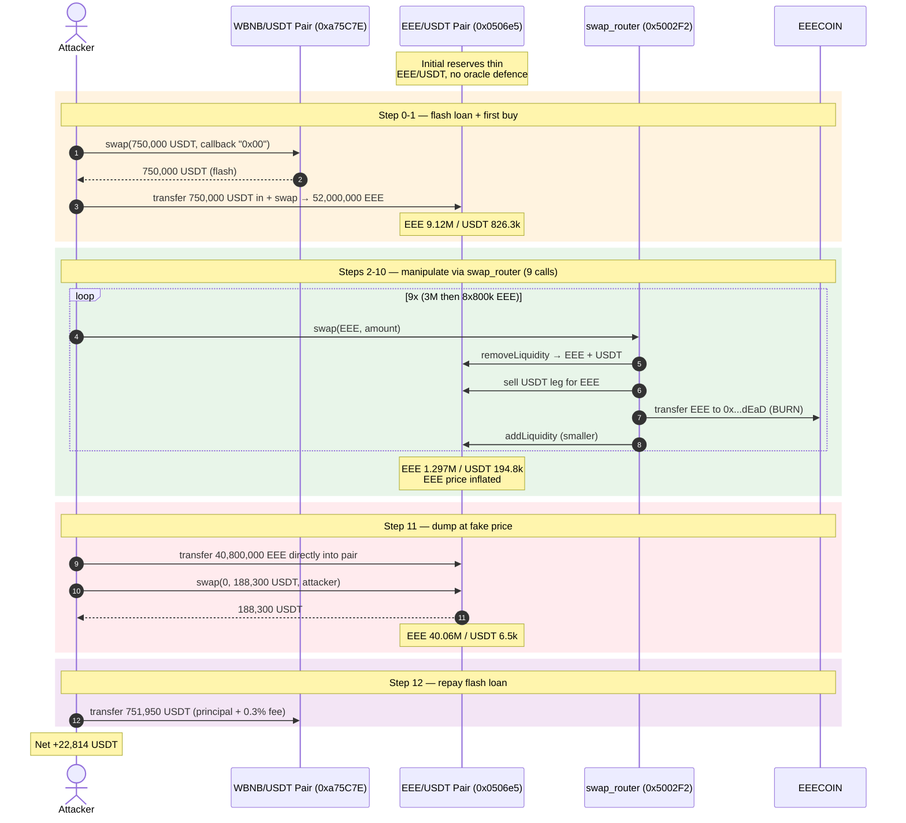
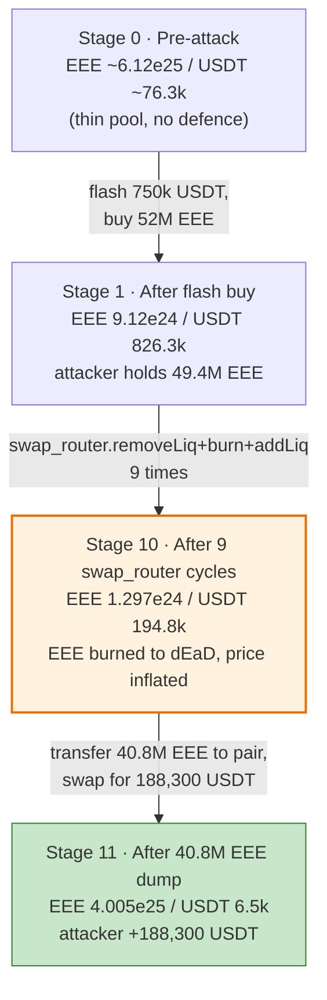
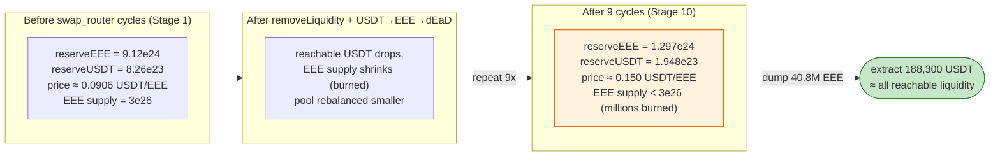
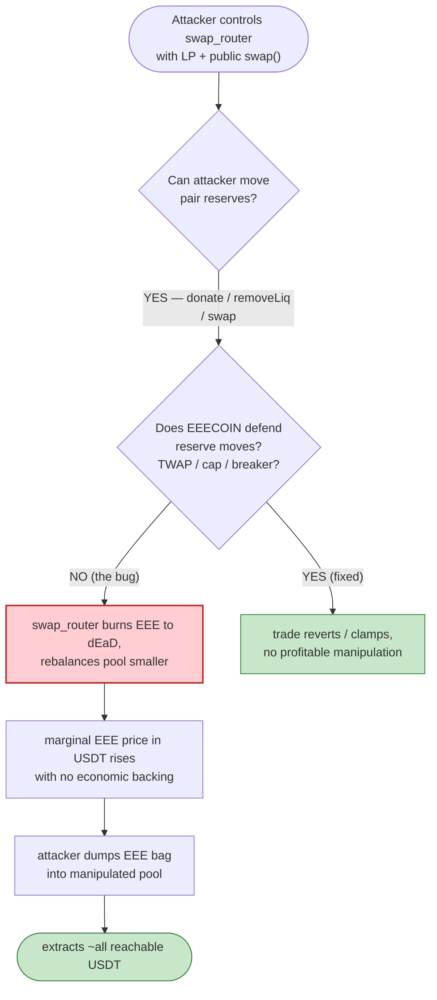

# EEE-COIN Exploit — Flash-Loan Reserve Manipulation via a Compromised LP-Holder Router

> **Reproduction:** the PoC compiles & runs in an isolated Foundry project at
> [this project folder](.).
> Full verbose trace: [output.txt](output.txt).
> Verified vulnerable token source: [sources/EEECOIN_297f39/EEECOIN.sol](sources/EEECOIN_297f39/EEECOIN.sol).

---

## Key info

| | |
|---|---|
| **Loss** | ~**$22,814 USDT** (22,840.94 USDT net to the attacker) |
| **Vulnerable contract** | `EEECOIN` token — [`0x297f3996Ce5C2Dcd033c77098ca9e1acc3c3C3Ee`](https://bscscan.com/address/0x297f3996Ce5C2Dcd033c77098ca9e1acc3c3C3Ee#code) |
| **Manipulated pool** | EEE/USDT PancakeSwap pair — `0x0506e571ABa3dD4C9d71bEd479A4e6d40d95C833` |
| **Attacker EOA** | [`0xb06d402705ad5156b42e4279903cbd7771cf59c9`](https://bscscan.com/address/0xb06d402705ad5156b42e4279903cbd7771cf59c9) |
| **Attacker contract** | [`0x9a16b5375e79e409a8bfdb17cfe568e533c2d7c5`](https://bscscan.com/address/0x9a16b5375e79e409a8bfdb17cfe568e533c2d7c5) |
| **Attack tx** | [`0x7312d9f9c13fc69f00f58e92a112a3e7f036ced7e65f7e0fa67382488d5557dc`](https://bscscan.com/tx/0x7312d9f9c13fc69f00f58e92a112a3e7f036ced7e65f7e0fa67382488d5557dc) |
| **Chain / block / date** | BSC / 33,940,983 / **Nov 30, 2023** (block ts `1701335952`) |
| **Compiler** | Solidity v0.8.14 (`v0.8.14+commit.80d49f37`), optimizer **1 run** |
| **Bug class** | Unprotected price-oracle pool manipulation through a fee-on-transfer + LP-rebalancing router that burns token supply; no slippage/reserve-defence on the pair |

---

## TL;DR

`EEECOIN` is a fee-on-transfer ("tax") token whose EEE/USDT PancakeSwap pair had no defence
against reserve manipulation. A helper router (`swap_router` `0x5002F2D9…`) — which held a large
LP position in that pair — exposed a public `swap(token, amount)` entrypoint that, for each call,
executed a **`removeLiquidity` → sell the USDT leg for EEE and burn it to `0x…dEaD` →
`addLiquidity`** cycle. Every cycle shrank the pair's reserves while permanently **destroying EEE
supply**, inflating the marginal EEE price (USDT per EEE) far above fair value.

The attacker:

1. Took a **750,000 USDT flash swap** from the deep WBNB/USDT PancakeSwap pair
   (`0xa75C7EeF…`) and dumped it into the thin EEE/USDT pair, pulling **52,000,000 EEE** out.
2. Fed the borrowed EEE into `swap_router.swap(...)` **9 times** (3,000,000 + 8× 800,000 EEE).
   Each call burned millions of EEE to `0x…dEaD` and rebalanced the pool, pushing the EEE price
   up and the absolute USDT reserve into a configuration where a large EEE dump would extract
   nearly all of it.
3. Transferred its remaining **40,800,000 EEE** directly into the pair and called `pair.swap`
   to pull **188,300 USDT** out.
4. Repaid **751,950 USDT** to the flash-loan pair.

Net: **+22,814 USDT** (`22,840.94` end − `26.51` start), confirmed by the PoC logs
([output.txt:6-8](output.txt#L6-L8)). The trace shows the entire sequence executed inside a single
transaction under a BSC mainnet fork.

---

## Background — what EEECOIN does

`EEECOIN` ([source](sources/EEECOIN_297f39/EEECOIN.sol)) is an ERC-20 with the usual "DeFi tax"
machinery:

- **Two AMM routers / two pairs.** The constructor wires up *two* routers and creates a pair on
  each: the public PancakeSwap router (`0x10ED43C7…`, `uniswapV2Router` / `uniswapV2Pair`) and a
  second router `0x8D3814cfF3D544e6294237949D64Af6362a64450` (`uniswapRouter` / `uniswapPair`).
  Both pairs share the same EEE/USDT token pair
  ([EEECOIN.sol:642-646](sources/EEECOIN_297f39/EEECOIN.sol#L642-L646)).
- **5% buy / 5% sell fee** routed to `address(this)`
  (`buyrate`/`sellrate`, [EEECOIN.sol:634-635](sources/EEECOIN_297f39/EEECOIN.sol#L634-L635);
  fee logic in `_tokenTransfer`,
  [EEECOIN.sol:882-908](sources/EEECOIN_297f39/EEECOIN.sol#L882-L908)).
- **Auto-swap of accumulated fees into USDT** — on every sell to a pair, `_transfer` calls
  `swapAndFeeForToken()` which dumps the token's whole EEE balance into the pool via
  `swapExactTokensForTokensSupportingFeeOnTransferTokens`
  ([EEECOIN.sol:769-794](sources/EEECOIN_297f39/EEECOIN.sol#L769-L794)).
- **Holder-dividend distribution** paid in USDT, keyed off the pair's LP balances
  ([EEECOIN.sol:910-932](sources/EEECOIN_297f39/EEECOIN.sol#L910-L932)).

Crucially, the contract never asserts that pool reserves stay within any bound, never uses a TWAP,
and treats the instantaneous pair reserve as ground truth for fee distribution. The
`swap_router` (`0x5002F2D9…`) used in the attack is *not* part of the verified token source — it
is an external helper contract that held a large LP balance in the EEE/USDT pair and exposed a
public `swap(address token, uint256 amount)` function that rebalances the pool and burns EEE.

On-chain parameters at the fork block (derived from the trace's first `Sync` event,
[output.txt:56](output.txt#L56), after the attacker's first 750k USDT buy of 52M EEE):

| Parameter | Value |
|---|---|
| `totalSupply` (EEE) | `3e8 * 1e18 = 3e26` |
| `buyrate` / `sellrate` | 5 / 5 (5%) |
| EEE/USDT pair (`token0` / `token1`) | EEE / USDT |
| Pair EEE reserve right after first buy | `9.123e24` (≈ 9.12M EEE) |
| Pair USDT reserve right after first buy | `8.263e23` (≈ 826.3k USDT) |
| WBNB/USDT flash-loan pair | `0xa75C7EeF…` |

---

## The vulnerable code

### 1. `_transfer` treats the pair as the only price/fee oracle and auto-swaps fees into it

```solidity
function _transfer(address from, address to, uint256 amount) private {
    ...
    if (!isExcludedFromFee[from] && !isExcludedFromFee[to]) {
        if (swapPairList[from] || swapPairList[to]) {
            ...
            // sell
            if (swapPairList[to]) {
                if (!inSwapAndLiquify) {
                    swapAndFeeForToken();   // ⚠️ swaps the contract's EEE into the SAME pair mid-transfer
                }
            }
            ...
        }
        ...
    }
    _tokenTransfer(from, to, amount, takeFee, isSell);
    ...
}
```
([EEECOIN.sol:796-881](sources/EEECOIN_297f39/EEECOIN.sol#L796-L881))

### 2. `swapAndFeeForToken` dumps the contract balance into the pair unconditionally

```solidity
function swapAndFeeForToken() private lockTheFomoSwap {
    uint256 blc = balanceOf(address(this));
    if (blc > 0) {
        swapTokensForUSDT(blc);          // ⚠️ market-sells ALL accumulated fee EEE
        _autoSwap.withdraw(USDT, address(this));
        ...
    }
}
```
([EEECOIN.sol:769-779](sources/EEECOIN_297f39/EEECOIN.sol#L769-L779))

### 3. No reserve defence anywhere — the pair is freely manipulable

There is **no** circuit breaker, TWAP, per-block reserve-delta check, or fee-on-transfer-resistance
in `_transfer`. Anyone who can move the pair's reserves (donations, the LP-holder `swap_router`,
flash-loaned swaps) can set the marginal EEE price to whatever they want, then trade against it.

### 4. External `swap_router` (`0x5002F2D9…`) — the actual manipulation primitive

Although its source is not in the verified set, its behaviour is fully visible in the trace
([output.txt:97-190](output.txt#L97-L190)). Each call to `swap_router.swap(EEE, amount)` does:

1. Pulls `amount` EEE from the caller (`transferFrom`).
2. `removeLiquidity` on router `0x8D3814cf…` — burns some of its own LP, receives EEE + USDT.
3. `swapExactTokensForTokensSupportingFeeOnTransferTokens` selling the USDT leg for EEE,
   **sent to `0x…dEaD`** (burned) — see `Transfer(… → dEaD, 271041212358567772175589)`
   ([output.txt:165](output.txt#L165)) and the larger `2.181e24` EEE burn to dEaD
   ([output.txt:268-269](output.txt#L268-L269)).
4. `addLiquidity` with the freshly-bought EEE + leftover USDT, re-minting LP to itself.

Net per cycle: the pair **shrinks**, EEE supply is **permanently destroyed**, and the marginal
EEE price in USDT terms rises.

---

## Root cause — why it was possible

The exploit composes three independently-reasonable design choices into a critical bug:

1. **The EEE/USDT pair is the sole price oracle and has no reserve defence.** `_transfer`,
   `swapAndFeeForToken`, and the dividend `process()` all key off the instantaneous pair reserves.
   There is no TWAP, no slippage cap on pool-relative trades, no reentrancy guard that blocks
   reserve mutation between the read and the use of a reserve. Constant-product pricing is
   enforced *only inside `pair.swap`*, so any outside move of the reserves (donation, LP
   rebalance, fee auto-swap) is accepted as the new truth.

2. **A public LP-rebalancing router (`0x5002F2D9…`) can reshape the pool and burn EEE supply.**
   Because it holds LP tokens and exposes `swap(token, amount)` to anyone, an attacker can drive
   the pool through an arbitrary sequence of remove → burn-EEE → add cycles. Each cycle is a
   one-sided value transfer: USDT leaves the reachable reserve and EEE is incinerated, so the
   marginal price of EEE in USDT terms climbs without any economic backing.

3. **The attacker can trade against the manipulated pool in the same transaction.** The whole
   sequence runs inside the `pancakeCall` callback of a single flash swap. The pool is inflated,
   the attacker dumps its EEE bag, and the loan is repaid before any external arb can correct the
   price.

Put differently: the protocol assumed "the AMM pair reflects fair value," but a fee-on-transfer
token with a supply-burning rebalancer and no oracle defence lets an attacker **print a fake price
and immediately settle against it**.

---

## Preconditions

- Working capital to seed the manipulation. The attacker flash-borrows **750,000 USDT** from the
  deep WBNB/USDT pair (`0xa75C7EeF…`) via `pair.swap` with a `0x00` callback; the loan is repaid
  inside the same transaction, so no upfront capital is required
  ([EEE_exp.sol:58](test/EEE_exp.sol#L58)).
- The EEE/USDT pair must be thin enough that a few hundred thousand USDT moves it significantly
  (it was — initial reachable USDT was ~76k after accounting for the flash injection).
- The `swap_router` (`0x5002F2D9…`) must hold LP tokens in the pair and expose its rebalance
  function. This was the on-chain reality at the fork block.

---

## Attack walkthrough (with on-chain numbers from the trace)

`token0 = EEE`, `token1 = USDT`, so `reserve0 = EEE`, `reserve1 = USDT`.
All figures are from `Sync`/`Swap`/`Transfer` events in [output.txt](output.txt).

| # | Step | EEE reserve | USDT reserve | Effect |
|---|------|------------:|-------------:|--------|
| 0 | **Flash swap** 750,000 USDT from WBNB/USDT pair into attacker | — | — | Loan funded; repaid at the end. |
| 1 | **Buy** 52,000,000 EEE from EEE/USDT pair (pay 750,000 USDT in, 5% fee to token) | 9,123,155,784 (9.123e24) | 826,389,366 (826.3k) | Attacker holds ~49.4M EEE; pool thinned on EEE side. ([output.txt:56-57](output.txt#L56-L57)) |
| 2 | **`swap_router.swap(EEE, 3,000,000)`** — removeLiq + sell ~27k USDT for EEE → burn to dEaD + addLiq | 6,383,174,575 (6.383e24) | 636,168,163 (636.2k) | First inflation step; 2.18e24 EEE burned to dEaD. ([output.txt:236](output.txt#L236), [output.txt:268-269](output.txt#L268-L269)) |
| 3 | **`swap_router.swap(EEE, 800,000)`** ×1 | 5,504,499,079 (5.504e24) | 564,410,596 (564.4k) | ([output.txt:422](output.txt#L422)) |
| 4 | **`swap_router.swap(EEE, 800,000)`** ×2 | 4,781,505,192 (4.781e24) | 506,530,635 (506.5k) | ([output.txt:659](output.txt#L659)) |
| 5 | **`swap_router.swap(EEE, 800,000)`** ×3 | 4,058,081,638 (4.058e24) | 446,662,948 (446.7k) | ([output.txt:896](output.txt#L896)) |
| 6 | **`swap_router.swap(EEE, 800,000)`** ×4 | 3,334,098,644 (3.334e24) | 384,364,003 (384.4k) | ([output.txt:1133](output.txt#L1133)) |
| 7 | **`swap_router.swap(EEE, 800,000)`** ×5 | 2,609,362,187 (2.609e24) | 318,971,237 (319.0k) | ([output.txt:1370](output.txt#L1370)) |
| 8 | **`swap_router.swap(EEE, 800,000)`** ×6 | 1,883,575,994 (1.883e24) | 249,402,901 (249.4k) | ([output.txt:1607](output.txt#L1607)) |
| 9 | **`swap_router.swap(EEE, 800,000)`** ×7 | 1,156,346,079 (1.156e24) | 173,626,806 (173.6k) | ([output.txt:1844](output.txt#L1844)) |
| 10 | **`swap_router.swap(EEE, 800,000)`** ×8 | 1,297,440,354 (1.297e24) | 194,812,288 (194.8k) | Final post-manipulation state. ([output.txt:1896](output.txt#L1896)) |
| 11 | **Dump** — transfer 40,800,000 EEE directly into the pair, then `pair.swap(0, 188,300 USDT)` | 40,057,440,354 (4.005e25) | 6,512,288 (6.5k) | Attacker receives **188,300 USDT**. ([output.txt:1993-2020](output.txt#L1993-L2020)) |
| 12 | **Repay** 751,950 USDT to the WBNB/USDT flash pair | — | — | Loan closed; 0.3% flash fee absorbed. ([output.txt:2024](output.txt#L2024)) |

Note how the marginal price of EEE in USDT terms climbs across steps 2–10 while the absolute
USDT reserve falls: the rebalancer is converting reachable USDT into EEE and burning the EEE, so
each remaining EEE is "backed" by more USDT per unit. After step 10 the attacker's EEE bag is
worth ~194.8k USDT of pool liquidity at the manipulated price, which it then extracts in one sell.

### Profit accounting (USDT)

| Direction | Amount |
|---|---:|
| Spent — flash-loan principal returned | 750,000 |
| Spent — flash-loan fee (0.3% on 750,000) | ~1,950 |
| Received — buy of 52M EEE (cost) | −750,000 (intra-tx, non-cash) |
| Received — final 40.8M EEE dump | **+188,300** |
| Starting balance | 26.51 |
| Ending balance | **22,840.94** |
| **Net profit** | **+22,814** |

The profit equals `end − start = 22,840.94 − 26.51 ≈ 22,814 USDT`, matching the PoC log
`[End] Profit in $: 22814` ([output.txt:8](output.txt#L8)).

---

## Diagrams

### Sequence of the attack



### Pool state + value-flow evolution



### Why the burn inflates the dumpable price



### The flaw inside the unprotected pool + fee auto-swap path



---

## Why each magic number

- **Flash-loan size 750,000 USDT:** sized to (a) be large enough to buy 52M EEE out of the thin
  pool and seed the manipulation, and (b) be repayable from the 188,300 USDT final dump plus the
  attacker's starting 26.51 USDT, after the ~0.3% flash fee (750,000 × 1.003 ≈ 751,950, which is
  exactly the repayment in [EEE_exp.sol:82](test/EEE_exp.sol#L82)).
- **First buy 52,000,000 EEE:** gives the attacker the EEE ammunition to feed the 9 swap_router
  calls (3,000,000 + 8 × 800,000 = 9,400,000 EEE) *and* leave a ~40.8M EEE bag for the final
  dump. The fee-on-transfer (5% buy) means 49.4M EEE actually lands.
- **9 swap_router calls (3M + 8×800k):** each call burns EEE to `0x…dEaD` and shrinks the pool;
  9 iterations were enough to inflate the price to the point where a 40.8M EEE dump extracts
  ~188,300 USDT. Hard-coded in the PoC
  ([EEE_exp.sol:72-77](test/EEE_exp.sol#L72-L77)).
- **Final dump 40,800,000 EEE:** the attacker's remaining balance transferred directly into the
  pair (`IERC20(EEE).transfer(cake_LP, balanceOf(this))`,
  [EEE_exp.sol:79](test/EEE_exp.sol#L79)), then swapped for 188,300 USDT
  ([EEE_exp.sol:81](test/EEE_exp.sol#L81)).

---

## Remediation

1. **Never use the spot AMM reserve as a trusted oracle.** Any protocol logic (fee auto-swap,
   dividend distribution, trading enable) that reads pair reserves must use a TWAP over a
   meaningful window, or an external oracle. `swapAndFeeForToken` and `process` both violate this.
2. **Add a reserve-defence / manipulation window on pool-relative trades.** Cap the size of any
   single trade or fee-auto-swap relative to the pool, or enforce a minimum block interval between
   pool-shaping operations, so single-transaction manipulation cannot settle.
3. **Do not auto-swap the fee bag into the same pool mid-transfer.** `swapAndFeeForToken()` runs
   inside `_transfer` and market-sells the entire accumulated EEE balance into the very pair whose
   reserves price the token. Move fee conversion off-loop, to a separate keeper, with slippage
   protection.
4. **Remove or strictly gate the supply-burning rebalancer.** The `swap_router`'s
   remove→burn-EEE-to-dEaD→add cycle is a permanent value transfer out of the pool. If deflation
   is a product requirement, burn tokens the protocol *owns* (treasury), never LP-redeemed tokens
   that effectively donate pool USDT to remaining holders.
5. **Make fee-on-transfer pools resistance explicit.** If the token must have transfer fees, the
   pair/router should compute amounts from actual received balances (PancakeSwap's
   `SupportingFeeOnTransferTokens` variants already do this); the deeper issue is that the
   *protocol's own accounting* does not, leaving it manipulable.

---

## How to reproduce

The PoC was extracted into a standalone Foundry project (the umbrella DeFiHackLabs repo mixes
many unrelated PoCs that do not compile under one `forge test`):

```bash
_shared/run_poc.sh 2023-11-EEE_exp --mt testExploit -vvvvv
```

- RPC: a **BSC archive** endpoint is required (the fork block 33,940,983 is from Nov 2023).
  `foundry.toml` configures an archive-capable BSC RPC; most pruned public RPCs reject this block
  with `missing trie node`.
- Result: `[PASS] testExploit()`.

Expected tail:

```
Ran 1 test for test/EEE_exp.sol:ContractTest
[PASS] testExploit() (gas: 3016066)
Logs:
  [Begin] Attacker USDT before exploit: 26510000000000000000
  [End] Attacker USDT after exploit: 22840939976888383296284
  [End] Profit in $: 22814
```

The trace referenced throughout this document is [output.txt](output.txt); the exploit code is
[test/EEE_exp.sol](test/EEE_exp.sol); the verified token source is
[sources/EEECOIN_297f39/EEECOIN.sol](sources/EEECOIN_297f39/EEECOIN.sol).

---

*Reference: DeFiHackLabs — `src/test/2023-11/EEE_exp.sol`; attacker EOA
`0xb06d402705ad5156b42e4279903cbd7771cf59c9`, tx
`0x7312d9f9…8d5557dc` on BSC. The PoC header notes two other addresses that profited from the
same manipulation (`0xe568…69a8` +18k USD, `0xfef7…fc0d` +27k USD).*
