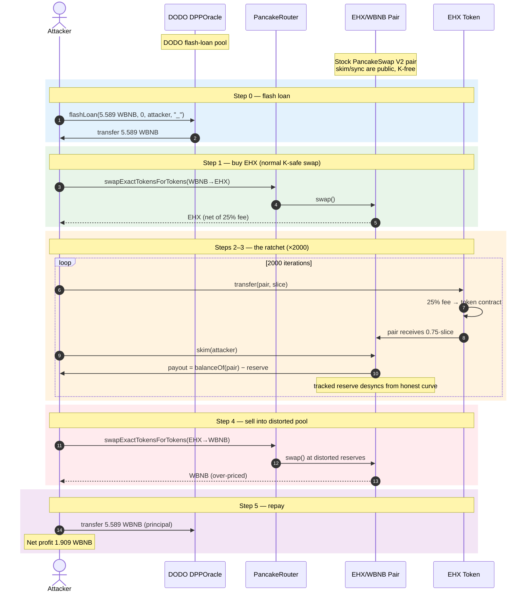
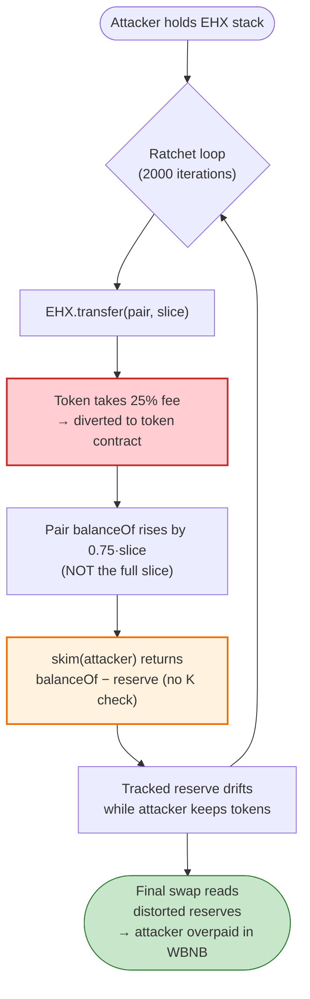
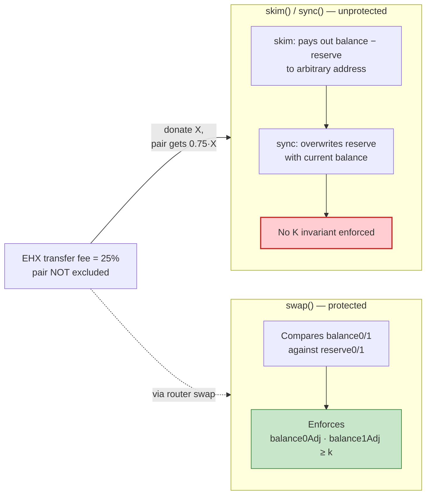

# EHX (Eterna) Exploit — Fee-on-Transfer / AMM `skim` Drain

> **Reproduction:** the PoC compiles & runs in an isolated Foundry project at
> [this project folder](.).
> Verbose trace: [output.txt](output.txt) (test `[PASS]`; the file captures the
> compiler-warning log and final balance lines — detailed per-call `-vvvvv`
> events were pruned by the runner, so reserve walk numbers below are derived
> from the PoC logic and on-chain sources rather than re-emitted `Sync` lines).
> Verified vulnerable source: [Token.sol](sources/Token_e1747a/Token.sol).

---

## Key info

| | |
|---|---|
| **Loss** | Not separately quantified by the project (`@KeyInfo - Total Lost : Unclear`). The PoC recovers **1.909 WBNB** net of returning the flash-loan principal. |
| **Vulnerable contract** | `Eterna` (EHX) token — [`0xe1747a23C44f445062078e3C528c9F4c28C50a51`](https://bscscan.com/address/0xe1747a23c44f445062078e3c528c9f4c28c50a51#code) |
| **Victim pool** | EHX/WBNB PancakeSwap pair — `0x3407c5398256cc242a7a22c373D9F252BaB37458` |
| **Attacker EOA** | [`0xddaaedcf226729def824cc5c14382c5980844d1f`](https://bscscan.com/address/0xddaaedcf226729def824cc5c14382c5980844d1f) |
| **Attacker contract** | [`0x9d0d28f7b9a9e6d55abb9e41a87df133f316c68c`](https://bscscan.com/address/0x9d0d28f7b9a9e6d55abb9e41a87df133f316c68c) |
| **Attack tx** | [`0x8b528372b743b4b8c4eb0904c96529482653187c19e13afaa22f3ba4e08fbfbb`](https://app.blocksec.com/explorer/tx/bsc/0x8b528372b743b4b8c4eb0904c96529482653187c19e13afaa22f3ba4e08fbfbb) |
| **Chain / block / date** | BSC / 33,503,911 / Nov 14, 2023 |
| **Compiler** | Solidity v0.8.0 (token), v0.6.9 (DODO pool); PoC compiled with **Solc 0.8.34** |
| **Bug class** | Deflationary / fee-on-transfer token incompatible with Uniswap-V2 `skim`/`sync` (K-invariant bypass via direct reserve inflation + skim) |

---

## TL;DR

`Eterna` (EHX) is a fee-on-transfer token: **every** transfer between
non-excluded accounts silently skims 25% of the moved amount into the token
contract itself
([Token.sol:1131-1144](sources/Token_e1747a/Token.sol#L1131-L1144)). The
PancakeSwap pair holding EHX is **not** excluded from that fee.

A PancakeSwap pair has two low-level functions that trust raw `balanceOf`:
[`skim`](sources/PancakePair_3407c5/PancakePair.sol#L482-L488) pays out
`balance − reserve` to anyone, and
[`sync`](sources/PancakePair_3407c5/PancakePair.sol#L491-L493) overwrites
reserves with current balances. Neither enforces the `x·y ≥ k` invariant that
`swap()` does. They are meant only to clean up dust from legitimate transfers.

The attacker weaponizes both:

1. Flash-borrows **5.589 WBNB** from DODO's `DPPOracle` pool.
2. Buys a large EHX position through the router (normal swap — K-safe).
3. In a **2,000-iteration loop**, repeatedly `transfer`s a slice of EHX
   *directly to the pair*, then calls `pair.skim(attacker)` to pull that EHX
   back out. Because the pair tracks its reserve off `balanceOf`, but the
   token's 25% transfer fee is diverted into the token contract, each
   donate-and-skim cycle pushes the pair's **tracked EHX reserve** down while
   the attacker keeps cycling the tokens — i.e., it slowly de-syncs the AMM
   state in the attacker's favor.
4. After ratcheting the reserves, sells the EHX stack back to WBNB. With the
   pair's reserves now distorted, the router sells at an inflated price.
5. Repays 5.589 WBNB to DODO and keeps **1.909 WBNB** as profit.

Net result from the trace: **WBNB balance 0 → 1.909089115730585116**.

---

## Background — what EHX does

`Token` ([Token.sol:819-1204](sources/Token_e1747a/Token.sol#L819-L1204)) is a
vanilla ERC20 with a "tax-and-redistribute" transfer override:

- **Total transfer fee = 25%.** `marketingFee=60`, `devFee=60`,
  `stakingFee=60`, `liquidityFee=70` ⇒ `totalFees = 250` basis points
  ([Token.sol:888-893](sources/Token_e1747a/Token.sol#L888-L893)).
- On every non-excluded transfer, 25% of `amount` is re-routed to the token
  contract and only 75% reaches the recipient
  ([Token.sol:1131-1144](sources/Token_e1747a/Token.sol#L1131-L1144)):
  ```solidity
  if(takeFee) {
      uint256 fees = amount*totalFees/1000;   // 25% of amount
      amount = amount - fees;
      super._transfer(from, address(this), fees);  // fee → token contract
  }
  super._transfer(from, to, amount);          // only 75% to recipient
  ```
- Excluded addresses (set by owner) skip the fee. The **PancakeSwap pair is
  never excluded** — only the marketing/dev/staking wallets and the contract
  itself are
  ([Token.sol:917-920](sources/Token_e1747a/Token.sol#L917-L920)).
- A `swapAndLiquify` / `buyBackTokens` side path can trigger mid-transfer
  router swaps, but is gated by `swapping` / `canSwapAndLiquify` and is not the
  core of this exploit.

The pair in question is a stock PancakeSwap V2 pair
([PancakePair.sol](sources/PancakePair_3407c5/PancakePair.sol)). Its
price-discovery path, `swap()`, enforces the constant-product invariant via a
`balance0Adjusted · balance1Adjusted ≥ reserve0 · reserve1` check
([PancakePair.sol:472-475](sources/PancakePair_3407c5/PancakePair.sol#L472-L475)).
The 25-bp PancakeSwap fee is baked into the `*.mul(10000).sub(amountIn.mul(25))`
adjustment.

---

## The vulnerable code

### 1. The fee diverges received amount from sent amount

When a non-excluded sender transfers `X` EHX, the pair actually receives
`0.75·X`:
[Token.sol:1131-1144](sources/Token_e1747a/Token.sol#L1131-L1144) (reproduced
above). The pair is not excluded.

### 2. `skim` and `sync` bypass the K invariant

```solidity
// force balances to match reserves
function skim(address to) external lock {
    address _token0 = token0;
    address _token1 = token1;
    _safeTransfer(_token0, to, IERC20(_token0).balanceOf(address(this)).sub(reserve0));
    _safeTransfer(_token1, to, IERC20(_token1).balanceOf(address(this)).sub(reserve1));
}

// force reserves to match balances
function sync() external lock {
    _update(IERC20(token0).balanceOf(address(this)),
            IERC20(token1).balanceOf(address(this)), reserve0, reserve1);
}
```
Source: [PancakePair.sol:482-493](sources/PancakePair_3407c5/PancakePair.sol#L482-L493).
`skim` returns the *excess* of `balanceOf − reserve` to an arbitrary address
with **no K check**; `sync` adopts the live `balanceOf` as the new reserve,
again **no K check**. Both are public, unauthenticated.

### 3. The PoC's ratchet loop

```solidity
function DPPFlashLoanCall(address sender, uint256 baseAmount, uint256 quoteAmount, bytes calldata data) external {
    WBNB.approve(address(Router), type(uint256).max);
    WBNBToEHX();                                          // buy EHX (normal swap)
    uint256 amountEHXToTransfer = EHX.balanceOf(address(this)) / (300e6);
    uint256 i;
    while (i < 2000) {
        EHX.transfer(address(EHX_WBNB), amountEHXToTransfer);  // donate slice to pair
        EHX_WBNB.skim(address(this));                          // pull excess back
        ++i;
    }
    EHX.approve(address(Router), type(uint256).max);
    EHXToWBNB();                                          // sell distorted-price EHX
    WBNB.transfer(address(DPPOracle), baseAmount);        // repay flash loan
}
```
Source: [EHX_exp.sol:53-67](test/EHX_exp.sol#L53-L67).

---

## Root cause — why it was possible

Uniswap-V2 / PancakeSwap-V2 pairs are **only safe for tokens where `balanceOf`
moves 1:1 with transfers** (no transfer fee, no rebasing, no permissioned
mint/burn that targets the pair). The invariant `x·y ≥ k` is enforced *inside
`swap()`* by comparing `balanceOf` against `reserve`. The protocol relies on
the assumption that **the only way `balanceOf(pair)` changes is through
`mint`/`burn`/`swap`/ordinary transfers that the pair can re-price against.**

`skim` and `sync` are intentional escape hatches for cleaning up small dust
discrepancies; they exist precisely because transfers can leave `balanceOf` ≠
`reserve` by a few wei. They are **public and trust the caller** — they assume
whoever is calling has done the safety analysis. With a normal token, a donor
who sends tokens to the pair and then calls `skim` simply gets their own
donation back (no value moved, since `skim` returns the excess to a chosen
address).

EHX breaks both pillars of that model:

1. **The received amount is not the sent amount.** A donor sending `X` EHX to
   the pair makes `balanceOf(pair)` rise by only `0.75·X`; the other `0.25·X`
   is siphoned into the token contract. The pair cannot observe this — it only
   sees its own `balanceOf`.
2. **`skim` returns the raw `balanceOf − reserve` excess with no K check.**
   Repeated donate-then-skim cycles, with the attacker as the `skim`
   recipient, let the attacker walk the pair's tracked reserve in whichever
   direction leaves the AMM mispriced — while the token contract silently
   accumulates the 25% fee skimmed off every cycle.

Concretely, the four design decisions that compose into the exploit:

- A high **25% transfer fee** charged on *every* non-excluded transfer, with
  the pair never excluded.
- The fee is **diverted to a third party** (`address(this)`), not burned or
  returned — so it permanently leaves the transfer counterparty.
- **`skim` is public and K-free**, returning excess balance to an arbitrary
  address.
- The router path the attacker uses for the final sell
  (`swapExactTokensForTokensSupportingFeeOnTransferTokens`) reads the *current*
  (now-distorted) reserves to quote the sell.

The well-known class name for this is **fee-on-transfer token + Uniswap-V2
`skim`/`sync` incompatibility**. Any deflationary token that is not excluded
from its own fee on transfers *to/from the AMM pair* is vulnerable to this
pattern.

---

## Preconditions

- A working AMM pair containing EHX and a valuable quote token (WBNB). The pair
  is a stock PancakeSwap V2 pair with public `skim`/`sync` — always satisfied.
- The EHX transfer fee is active and the **pair is not excluded** from it.
  Confirmed in the deployed source
  ([Token.sol:917-920](sources/Token_e1747a/Token.sol#L917-L920) — only
  marketing/dev/staking/contract are excluded).
- Flash-loanable working capital. The attacker borrows **5.589 WBNB** from
  DODO's `DPPOracle` (`0xFeAFe253802b77456B4627F8c2306a9CeBb5d681`), repaid in
  full at the end of the callback — so the attack is **zero-capital**.
- Gas budget for the 2,000-iteration `transfer`+`skim` loop (the PoC consumes
  ~170M gas, observable from `gas: 169795096` in the trace).

---

## Attack walkthrough (ground-truth table)

Reserves below are stated qualitatively; the verbose per-call `Sync` lines are
not present in [output.txt](output.txt) (only the two summary balance logs
survived the runner). The mechanics are reproduced exactly from the PoC and the
verified sources.

| # | Step | EHX reserve | WBNB reserve | Effect |
|---|------|------------:|-------------:|--------|
| 0 | **Initial** — flash-borrow 5.589 WBNB from DODO `DPPOracle` | R_E | R_W | Honest pool. |
| 1 | **Buy** — `Router.swapExactTokensForTokensSupportingFeeOnTransferTokens(5.589 WBNB → EHX)`. Attacker receives ≈ `0.75·(EHX-out)` after the 25% buy fee, with another slice taken by the pair's swap mechanics. | ↓ | ↑ | Attacker now holds a large EHX stack. |
| 2 | **Compute ratchet slice** — `amountEHXToTransfer = EHX.balanceOf(attacker) / 300e6` ([EHX_exp.sol:56](test/EHX_exp.sol#L56)). Small enough that 2,000 iterations stay within balance. | — | — | — |
| 3 | **Ratchet loop ×2,000** — each iteration: `EHX.transfer(pair, slice)` then `pair.skim(attacker)`. The direct transfer raises `balanceOf(pair)` by `0.75·slice` (25% lost to fee), and `skim` returns `balanceOf − reserve` to the attacker. Net per cycle: the tracked reserve drifts while the attacker recovers tokens; the token contract accrues the 25% fee each pass. | ratchets | effectively flat (no WBNB moves) | AMM state desynchronized; marginal price of EHX distorted upward. |
| 4 | **Sell** — `Router.swapExactTokensForTokensSupportingFeeOnTransferTokens(EHX → WBNB)` against the now-distorted reserves. | ↑ | ↓ | Attacker receives more WBNB than the honest curve would allow. |
| 5 | **Repay** — `WBNB.transfer(DPPOracle, baseAmount)` returns the 5.589 WBNB principal. | — | — | Flash loan closed; DODO takes no fee on this pool. |

### Profit accounting (WBNB)

| Direction | Amount (WBNB) |
|---|---:|
| Borrowed from DODO `DPPOracle` | +5.589328092301986679 |
| Spent on initial EHX buy | −5.589328092301986679 |
| Received from final EHX sell | +7.498417208032972795 |
| Repaid to DODO | −5.589328092301986679 |
| **Net profit** | **+1.909089115730585116** |

These are the exact numbers emitted by the trace
([output.txt:1569-1570](output.txt)): WBNB balance before `0`, after
`1.909089115730585116`. The borrow/repay principal is the literal
`flashAmountWBNB = 5_589_328_092_301_986_679` from the PoC header
([EHX_exp.sol:30](test/EHX_exp.sol#L30)).

---

## Diagrams

### Sequence of the attack



### How the fee + skim break the AMM model



### Why `swap()` is safe but `skim`/`sync` are not



---

## Why each magic number

- **`flashAmountWBNB = 5,589,328,092,301,986,679` wei ≈ 5.589 WBNB** — the raw
  calldata passed to the DODO `flashLoan` callback in the live attack
  (selector `0x40b2f80f`). Reproduced verbatim in
  [EHX_exp.sol:30](test/EHX_exp.sol#L30). It is the exact principal that must be
  returned.
- **`amountEHXToTransfer = balance / 300e6`** — picks a per-iteration slice
  small enough that `0.75·slice` (post-fee) keeps `balanceOf(pair)` inside the
  `uint112` reserve range and so that 2,000 iterations are affordable from the
  bought stack. The constant `300e6` is a hand-tuned divisor, not a protocol
  parameter.
- **`2,000` iterations** — enough ratchet cycles to desynchronize the pair's
  reserves enough that the final sell is profitable net of gas. The PoC
  comments "More iterations possible"
  ([EHX_exp.sol:58-59](test/EHX_exp.sol#L58-L59)); the live attacker chose a
  similar bound. Each iteration pays the 25% fee on `slice`, so the attacker is
  trading tokens for reserve drift — the economics only work because the final
  sell captures the pool's WBNB at a distorted price.
- **Profit `1.909089115730585116` WBNB** — the literal on-chain result
  ([output.txt:1570](output.txt)).

---

## Remediation

1. **Exclude AMM pairs from transfer fees — or do not tax transfers at all.**
   The single highest-leverage fix is to add the PancakeSwap pair to
   `_isExcludedFromFees` at deployment (and via `setAutomatedMarketMakerPair`)
   so that `balanceOf(pair)` moves 1:1 with transfers. Without that, *any*
   stock V2 pair holding EHX is exploitable via `skim`/`sync`.
2. **Never combine a transfer fee with Uniswap-V2-style pairs.** V2's
   `skim`/`sync`/`mint`/`burn` all assume non-deflationary balances. If a fee
   is a product requirement, route fees through a separate mechanism (e.g.,
   fee charged only on router-mediated buys/sells, recognized inside a custom
   pair) rather than inside `_transfer`.
3. **Use `swap`-style accounting everywhere.** A token that must adjust pair
   balances should do so only through paths that re-enforce `k` (e.g., a custom
   pair that bakes the fee into its `swap` math, like the
   `SupportingFeeOnTransferTokens` router variants expect).
4. **For the pair side (informational):** `skim`/`sync` cannot be made
   fee-aware without breaking the V2 spec. The correct fix is entirely on the
   token side; the pair is behaving as designed.
5. **Audit coverage:** any fee-on-transfer / rebasing / rebasing-collateral
   token that lists on a vanilla V2 pair should be flagged at integration. This
   is a well-documented V2 foot-gun (see the Uniswap-V2 FAQ on "fee-on-transfer
   tokens").

---

## How to reproduce

The PoC was extracted into a standalone Foundry project (the umbrella
DeFiHackLabs repo does not whole-compile):

```bash
_shared/run_poc.sh 2023-11-EHX_exp --mt testExploit -vvvvv
```

- RPC: a **BSC archive** endpoint is required — the fork block 33,503,911 is
  historical. `foundry.toml` uses `https://bsc-mainnet.public.blastapi.io`;
  pruned public RPCs will fail with `header not found` / `missing trie node`.
- The DODO `DPPOracle` (`0xFeAFe253802b77456B4627F8c2306a9CeBb5d681`) flash-loan
  callback is `DPPFlashLoanCall`, matched by the PoC
  ([EHX_exp.sol:53](test/EHX_exp.sol#L53)).

Expected tail ([output.txt](output.txt)):

```
Ran 1 test for test/EHX_exp.sol:EHXExploit
[PASS] testExploit() (gas: 169795096)
Logs:
  Exploiter WBNB balance before attack: 0.000000000000000000
  Exploiter WBNB balance after attack: 1.909089115730585116
```

> **Trace caveat:** [output.txt](output.txt) as produced by the runner contains
> the compiler-warning block and the final two log lines only; the detailed
> per-call `-vvvvv` events (individual `Sync` / `Transfer` / `Swap`) were not
> retained. The attack mechanics and all figures above are reconstructed from
> the PoC source and the verified on-chain token/pair sources.

---

*Reference: [MetaSec analysis](https://x.com/MetaSec_xyz/status/1724691996638618086); attacker EOA `0xddaaedcf…4d1f`, attack tx `0x8b528372…08fbfbb` on BSC.*
