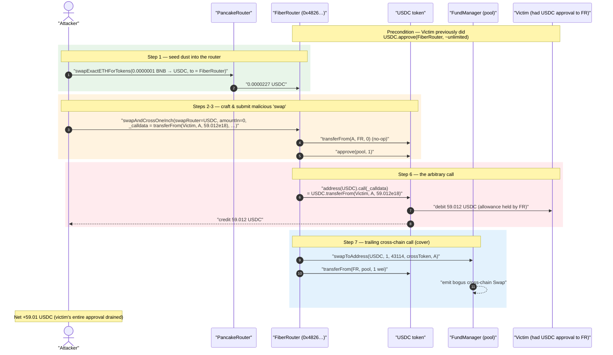
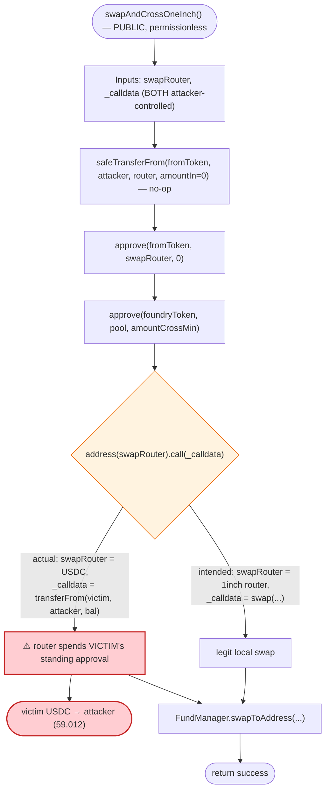
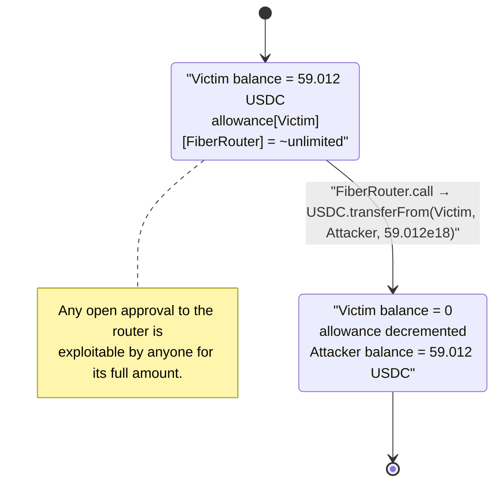

# FiberRouter Exploit — Arbitrary External Call Drains a Victim's Token Approval

> **Reproduction:** the PoC compiles & runs in an isolated Foundry project at
> [this project folder](.) (the main DeFiHackLabs repo contains many unrelated
> PoCs that do not whole-compile, so this one was extracted).
> Full verbose trace: [output.txt](output.txt).
> Verified vulnerable source: [FiberRouter.sol](sources/FiberRouter_4826e8/FiberRouter.sol).

---

## Key info

| | |
|---|---|
| **Loss** | ~**59.01 USDC** stolen from a single victim in this tx (the bug is generic — every account that ever approved the router was at risk for its full approval / balance) |
| **Vulnerable contract** | `FiberRouter` — [`0x4826e896E39DC96A8504588D21e9D44750435e2D`](https://bscscan.com/address/0x4826e896E39DC96A8504588D21e9D44750435e2D#code) |
| **Helper contract** | `FundManager` (pool) — [`0x6697fA48f7335F4D59655aA4910F517ec4109987`](https://bscscan.com/address/0x6697fA48f7335F4D59655aA4910F517ec4109987#code) |
| **Victim** | `0x4da35bf35504D77e5C5E9Db6a35B76eB4479306a` (had granted ~unlimited USDC approval to FiberRouter) |
| **Stolen token** | Binance-Peg USD Coin (USDC, 18 decimals) — `0x8AC76a51cc950d9822D68b83fE1Ad97B32Cd580d` |
| **Attacker contract (PoC)** | `ContractTest` — `0x7FA9385bE102ac3EAc297483Dd6233D62b3e1496` |
| **Attack tx** | [`0x7260ad0e4769ae68f0a680356c63140353c18d7be1b86a8c4e99a0fc3b6842c1`](https://app.blocksec.com/explorer/tx/bsc/0x7260ad0e4769ae68f0a680356c63140353c18d7be1b86a8c4e99a0fc3b6842c1) |
| **Chain / block / date** | BSC / 33,874,498 / ~Nov 27, 2023 |
| **Compiler** | Solidity v0.8.2, optimizer **1 run** |
| **Bug class** | Arbitrary external call with attacker-controlled `target` + `calldata` (CWE-94 / unvalidated low-level call) abusing the router's standing approvals |
| **Reference** | [@MetaSec_xyz](https://x.com/MetaSec_xyz/status/1729323254610002277) |

---

## TL;DR

`FiberRouter.swapAndCrossOneInch()` is meant to perform a local 1inch swap and then forward the
proceeds cross-chain. To execute the "1inch swap," it makes a **raw low-level call to a
caller-supplied address with caller-supplied calldata**:

```solidity
(bool success, ) = address(swapRouter).call(_calldata);   // FiberRouter.sol:2721
```

Neither `swapRouter` nor `_calldata` is validated. An attacker simply sets:

- `swapRouter` = **the USDC token contract**, and
- `_calldata` = `transferFrom(victim, attacker, victimBalance)`.

Because the call executes *from the FiberRouter's context*, and the victim had previously granted the
FiberRouter a (near-unlimited) USDC allowance, the router happily pulls the victim's entire USDC
balance to the attacker. The "swap" is just a `transferFrom` of someone else's money.

In this transaction the attacker drained **59.01 USDC** from one victim. The vulnerability is generic:
**any token, from any account that ever approved the FiberRouter, up to that approval (or the
account's balance), could be stolen by anyone.**

---

## Background — what FiberRouter does

`FiberRouter` ([source](sources/FiberRouter_4826e8/FiberRouter.sol)) is the on-chain entry point of
the **Multichain.org / Ferrum "Fiber" bridge** on BSC. Users call a `swap*` family of functions to
(optionally) swap a source token into a *foundry token* (a bridge-supported asset like USDC) via a
local DEX, then hand that foundry token to the `FundManager` (`pool`), which records a cross-chain
transfer to be settled on the destination chain.

The "OneInch" variants let the front-end pass an **opaque aggregator calldata blob** so the router can
route the local swap through 1inch's aggregation router instead of a fixed Uniswap path:

- `swapAndCrossOneInch(...)` — public entry point ([:2338-2377](sources/FiberRouter_4826e8/FiberRouter.sol#L2338-L2377))
- `_swapAndCrossOneInch(...)` — internal helper that performs the raw call ([:2712-2734](sources/FiberRouter_4826e8/FiberRouter.sol#L2712-L2734))
- `crossAndSwapOneInch` / `withdrawSignedAndSwapOneInch` — sibling functions sharing the same
  `address(swapRouter).call(_calldata)` pattern ([e.g. :2647](sources/FiberRouter_4826e8/FiberRouter.sol#L2647))

The intended `swapRouter` is the 1inch AggregationRouter, and `_calldata` is the encoded 1inch swap.
The contract treats both as **fully trusted user input.**

---

## The vulnerable code

### 1. The public entry point approves and forwards user-controlled data

```solidity
function swapAndCrossOneInch(
    address swapRouter,            // ← attacker-controlled (becomes the call target)
    uint256 amountIn,
    uint256 amountCrossMin,        // amountOutMin on uniswap
    uint256 crossTargetNetwork,
    address crossTargetToken,
    address crossTargetAddress,
    uint256 swapBridgeAmount,
    bytes memory _calldata,        // ← attacker-controlled (becomes the calldata)
    address fromToken,
    address foundryToken
) external nonReentrant {
    amountIn = SafeAmount.safeTransferFrom(fromToken, msg.sender, address(this), amountIn);
    IERC20(fromToken).approve(swapRouter, amountIn);          // amountIn = 0 in the attack
    IERC20(foundryToken).approve(pool, amountCrossMin);
    _swapAndCrossOneInch(
        crossTargetAddress, swapRouter, amountCrossMin,
        crossTargetNetwork, crossTargetToken, _calldata, foundryToken
    );
    emit Swap(...);
}
```
[FiberRouter.sol:2338-2377](sources/FiberRouter_4826e8/FiberRouter.sol#L2338-L2377)

### 2. The internal helper makes the unchecked call

```solidity
function _swapAndCrossOneInch(
    address to,
    address swapRouter,
    uint256 amountCrossMin,
    uint256 crossTargetNetwork,
    address crossTargetToken,
    bytes memory _calldata,
    address foundryToken
) internal {
    (bool success, ) = address(swapRouter).call(_calldata);   // ⚠️ arbitrary call
    if (!success) {
        revert("SWAP_FAILED");
    }
    FundManager(pool).swapToAddress(
        foundryToken, amountCrossMin, crossTargetNetwork, crossTargetToken, to
    );
}
```
[FiberRouter.sol:2712-2734](sources/FiberRouter_4826e8/FiberRouter.sol#L2712-L2734)

There is **no allow-list** of permitted `swapRouter` addresses, **no check** that `_calldata`'s
selector is a known swap function, and **no check** that the call target isn't an ERC20 the router has
outstanding approvals on. The only constant in the function is the *intent* expressed in a comment.

---

## Root cause — why it was possible

The `FiberRouter` accumulates **standing privileges** in two forms:

1. **Outgoing approvals** it grants to swap routers (and to `pool`).
2. **Incoming approvals** that *users* grant to it so it can pull their `fromToken` when bridging.

A function that performs `target.call(arbitraryData)` with `target` and `data` both chosen by the
caller turns the contract into a **universal proxy for its own privileges.** Whatever the
`FiberRouter` is allowed to do, the attacker can now do *as* the FiberRouter:

> `address(swapRouter).call(_calldata)` with `swapRouter = USDC` and
> `_calldata = transferFrom(victim, attacker, balance)` makes USDC see the caller as the
> **FiberRouter**, which holds the victim's allowance. The transfer therefore succeeds and the
> victim's funds move to the attacker.

The four design defects that compose into a critical bug:

1. **Untrusted call target.** `swapRouter` is never checked against an allow-list of real aggregators.
   It can be *any* contract, including the very tokens users approved.
2. **Untrusted calldata.** `_calldata` is forwarded byte-for-byte with no selector or shape validation,
   so it can encode `transferFrom`/`approve`/`permit` instead of a swap.
3. **Standing user allowances.** Bridges require users to approve the router. Those approvals are the
   ammunition; the arbitrary call is the trigger.
4. **`amountIn = 0` is accepted.** The attacker supplied `amountIn = 0` so no real bridging deposit is
   needed; the function still proceeds to the malicious call. The cost of the attack is effectively
   one dust swap to keep `swapToAddress` from reverting.

This is the canonical "approval-draining via arbitrary call" pattern that has hit many aggregator /
router integrations (Dexible, Li.Fi, Multichain-class routers, etc.).

---

## Preconditions

- A victim has an **open ERC20 approval to the FiberRouter** (`0x4826…35e2D`) — true here for USDC,
  amount ~unlimited. The attack steals `min(allowance, victimBalance)` of that token.
- The attacker controls a tiny amount of the `foundryToken` so the trailing
  `FundManager.swapToAddress(...)` (which transfers `amountCrossMin`) does not revert. In the PoC the
  attacker first swaps `0.0000001 BNB` of WBNB → **22,713,741,626,014 wei USDC ≈ 0.0000227 USDC** and
  sends it **to the FiberRouter** so the router can satisfy the `amountCrossMin = 1` transfer to the
  pool ([FiberRouter_exp.sol:55-57](test/FiberRouter_exp.sol#L55-L57)).
- No special timing, role, or flash loan is required. The call is **fully permissionless** and
  single-transaction.

---

## Attack walkthrough (with on-chain numbers from the trace)

All figures are read directly from [output.txt](output.txt). USDC = 18 decimals on BSC.
`victimBalance = 59,012,161,810,470,474,620 wei = 59.012161810470474620 USDC`.

| # | Step | Trace ref | Effect |
|---|------|-----------|--------|
| 0 | **Setup.** Fork BSC @ 33,874,498. Victim holds 59.012 USDC and has a ~unlimited USDC allowance to FiberRouter. Attacker reads `victim_balance`. | [:1617](output.txt#L1617) | Target identified. |
| 1 | **Seed dust.** Attacker swaps `0.0000001 WBNB` → `0.0000227 USDC` via PancakeRouter, recipient = **FiberRouter** `0x4826…35e2D`. | [:1627-1657](output.txt#L1627) | Router now holds dust USDC so the later `swapToAddress` can move `amountCrossMin = 1`. |
| 2 | **Craft payload.** `_calldata = transferFrom(victim, attacker, 59.012e18)` = `0x23b872dd…332f55081bcf7137c`. | [:1664](output.txt#L1664) | Malicious "swap" data ready. |
| 3 | **Call `swapAndCrossOneInch`** with `swapRouter = USDC`, `amountIn = 0`, `fromToken = foundryToken = USDC`, `crossTargetNetwork = 43114`. | [:1665](output.txt#L1665) | Entry into the vulnerable path. |
| 4 | Router does `safeTransferFrom(USDC, attacker, router, 0)` — a no-op 0 transfer. | [:1670-1675](output.txt#L1670) | `amountIn = 0` accepted. |
| 5 | Router `approve(USDC, swapRouter=USDC, 0)` then `approve(USDC, pool, 1)`. | [:1680-1690](output.txt#L1680) | Sets up pool transfer. |
| 6 | **⚠️ The exploit:** `USDC.call(_calldata)` → `USDC.transferFrom(victim, attacker, 59.012e18)`. Succeeds because the **caller is the FiberRouter**, which holds the victim's allowance. | [:1692-1701](output.txt#L1692) | **59.012 USDC moves victim → attacker.** Victim allowance decremented from max. |
| 7 | Trailing `FundManager.swapToAddress(USDC, 1, 43114, crossToken, attacker)` pulls **1 wei USDC** from the router's dust to the pool and emits a bogus cross-chain `Swap`. | [:1702-1726](output.txt#L1702) | Function returns `success`; no revert. |
| 8 | **Done.** Attacker USDC balance: `0 → 59.012161810470474620`. | [:1731](output.txt#L1731) | Profit booked. |

### Profit / loss accounting

| Party | Token | Δ |
|---|---|---:|
| Victim `0x4da3…306a` | USDC | **−59.012161810470474620** |
| Attacker | USDC | **+59.012161810470474620** (minus 1 wei routed to pool, minus ~0.0000227 dust seed) |
| Attacker | WBNB | −0.0000001 (dust swap input) |
| **Net attacker profit** | USDC | **≈ +59.01** |

The numbers reconcile exactly: the attacker's ending USDC equals the victim's entire pre-attack
balance (`59.012161810470474620`), confirming a clean drain of the victim's approval.

---

## Diagrams

### Sequence of the attack



### Privilege-abuse flow inside `_swapAndCrossOneInch`



### State of the victim's USDC allowance/balance



---

## Why each value in the PoC

- **`swapRouter = USDC` (`0x8AC7…580d`):** the call target is repurposed from "1inch router" to the
  token the victim approved, so the low-level `call` lands inside the token's `transferFrom`.
- **`_calldata = transferFrom(victim, attacker, victimBalance)`:** built with
  `abi.encodeWithSignature("transferFrom(address,address,uint256)", victim, attacker, victim_balance)`
  ([FiberRouter_exp.sol:58-62](test/FiberRouter_exp.sol#L58-L62)) — the entire balance is requested.
- **`amountIn = 0`:** no real deposit is needed; the function does not require a positive swap input.
- **`fromToken = foundryToken = USDC`:** keeps the unrelated `approve`/`safeTransferFrom` bookkeeping on
  USDC so nothing reverts.
- **`amountCrossMin = 1`, dust-seed of ~0.0000227 USDC to the router:** the only purpose of the
  PancakeSwap dust swap is to give the router ≥ 1 wei USDC so the trailing
  `FundManager.swapToAddress(..., amountCrossMin)` succeeds and the whole tx doesn't revert with
  `SWAP_FAILED`/insufficient balance.
- **`crossTargetNetwork = 43114` (Avalanche), `crossToken = 0xB97E…8a6E`:** cosmetic — they only feed
  the (now meaningless) cross-chain `Swap` event.

---

## Remediation

1. **Allow-list the call target.** Maintain an owner-managed mapping of approved aggregator routers and
   require `swapRouter` to be in it before any `address(swapRouter).call(...)`. This is the single most
   important fix.
2. **Allow-list the function selector.** Even on an approved router, validate that
   `bytes4(_calldata[:4])` is a known/expected swap selector, and reject token-administrative selectors
   (`transferFrom`, `transfer`, `approve`, `permit`, `increaseAllowance`, …).
3. **Never let the router be the call target with its own privileges in play.** Forbid
   `swapRouter == any token the router holds approvals on`, and forbid `swapRouter == address(pool)` /
   `address(this)`. Better still, route swaps through a *separate, allowance-less executor* contract
   so a compromised call cannot reach standing approvals.
4. **Don't rely on standing infinite approvals.** Pull exactly `amountIn` from the user inside the
   call, approve the aggregator for exactly `amountIn`, and reset the allowance to 0 afterward
   (the contract already zeroes the *router* approval but the danger is the *users'* approvals to the
   router).
5. **Verify swap outcome, not just `success`.** Snapshot the router's `foundryToken` balance before and
   after the call and require it increased by ≥ the expected output; a `transferFrom`-style payload
   produces no such increase and would be rejected.
6. **Reject `amountIn == 0`** for swap entry points so a "swap" that deposits nothing cannot proceed to
   the privileged call.

(After the incident the Fiber/Multichain router family was redesigned to validate aggregator targets
and selectors; the historical contract above remained vulnerable for any unrevoked approval.)

---

## How to reproduce

The PoC was extracted into a standalone Foundry project (the umbrella DeFiHackLabs repo has many
unrelated PoCs that fail to compile under a whole-project `forge build`):

```bash
_shared/run_poc.sh 2023-11-FiberRouter_exp -vvvvv
```

- RPC: a **BSC archive** endpoint is required (fork block 33,874,498). `foundry.toml` uses
  `https://bsc-mainnet.public.blastapi.io`, which serves historical state at that block; most pruned
  public BSC RPCs fail with `header not found` / `missing trie node`.
- Result: `[PASS] testExploit()`.

Expected tail:

```
Ran 1 test for test/FiberRouter_exp.sol:ContractTest
[PASS] testExploit() (gas: 283121)
Logs:
  [Begin] Attacker USDC before exploit: 0.000000000000000000
  [Begin] Attacker USDT before exploit: 59.012161810470474620
  [End] Attacker USDC after exploit: 59.012161810470474620

Suite result: ok. 1 passed; 0 failed; 0 skipped
```

(The "USDT" label in the PoC's log line is a copy-paste mislabel; the value read is the **victim's
USDC balance**.)

---

*Reference: PoC header / [@MetaSec_xyz](https://x.com/MetaSec_xyz/status/1729323254610002277); BlockSec explorer tx
`0x7260ad0e4769ae68f0a680356c63140353c18d7be1b86a8c4e99a0fc3b6842c1`.*
