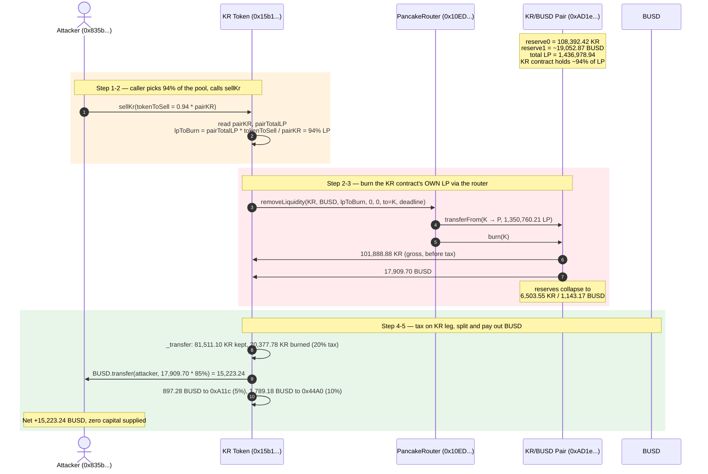
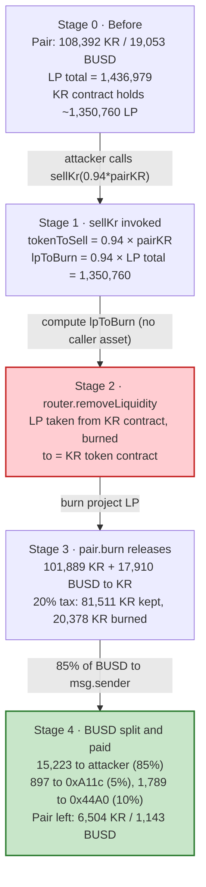
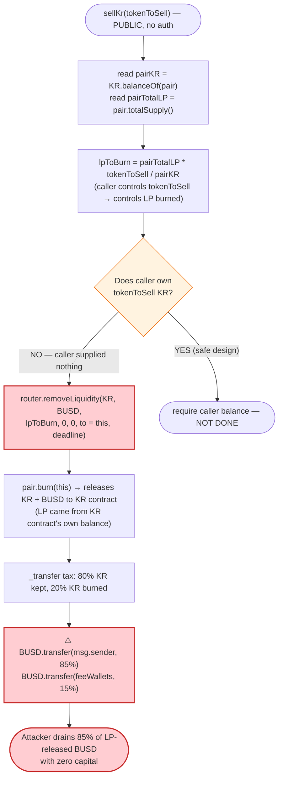

# KR Token Exploit — Permissionless `sellKr()` Liquidity-Pool Drain

> **Vulnerability classes:** vuln/access-control/missing-auth · vuln/access-control/missing-modifier

> **Reproduction:** the PoC compiles & runs in an isolated Foundry project at
> [this project folder](.) (the umbrella DeFiHackLabs repo contains many unrelated PoCs that do not
> build together, so this one was extracted). Full verbose trace: [output.txt](output.txt).
> Verified pair source: [PancakePair.sol](sources/PancakePair_AD1e7B/PancakePair.sol).

---

## Key info

| | |
|---|---|
| **Loss** | ~**15,223 BUSD** (≈$15,223) drained from the KR/BUSD PancakeSwap pair |
| **Vulnerable contract** | `KR` token — [`0x15b1Ed79cA9D7955AF3E169d7B323c4F1eeb5D12`](https://bscscan.com/address/0x15b1Ed79cA9D7955AF3E169d7B323c4F1eeb5D12#code) |
| **Victim pool** | KR/BUSD PancakePair — `0xAD1e7BF0A469b7B912D2B9d766d0C93291cA2656` (whose LP was held by the KR contract itself) |
| **Attacker EOA** | `0x835b45d38cbdccf99e609436ff38e31ac05bc502` |
| **Attack tx** | `0x2abf871eb91d03bc8145bf2a415e79132a103ae9f2b5bbf18b8342ea9207ccd7` |
| **Chain / block / date** | BSC / 33,267,985 / **November 6, 2023** (≈22:23 UTC) |
| **Compiler** | Solidity v0.5.16 (PancakePair), optimizer **200 runs**; KR token contract was not source-verified on BscScan (bytecode-only) |
| **Bug class** | **Broken access control** — public `sellKr()` liquidates the token contract's own LP and pays the BUSD proceeds to an arbitrary `msg.sender` |

---

## TL;DR

The `KR` token contract holds the LP tokens for its own KR/BUSD PancakeSwap pair — i.e. the project's
liquidity was parked in the token contract rather than time-locked or renounced. The contract exposes a
public function

```solidity
function sellKr(uint256 tokenToSell) external;
```

that, **with no access control and no requirement that the caller own any KR**, does the following:

1. Reads the pair's KR reserve and total LP supply.
2. Computes an LP amount proportional to `tokenToSell / pairReserveKR` (the PoC passes `94%`).
3. Calls `PancakeRouter.removeLiquidity(...)` on the router, pulling that LP **out of the KR contract
   itself** (the LP holder), burning it, and naming the KR contract as the `to` recipient for the
   released KR + BUSD.
4. The released KR hits the KR contract's `_transfer`, which applies a **20% burn tax**; the released
   **BUSD** is then distributed: **85% to `msg.sender`**, 10% and 5% to two hardcoded fee wallets.

Because nothing ties the payout to the caller actually having supplied those tokens, **any caller walks
away with ~85% of the BUSD that the LP release produces**, funded entirely by the project's own
liquidity. The attacker supplied zero KR and zero BUSD and received **15,223.24 BUSD** in a single call.

---

## Background — what the KR token does

`KR` is a vanilla BEP-20 with a fee/tax layer and a "sell" convenience function. Two facts about its
deployment are the whole game:

- **The KR/BUSD PancakePair (`0xAD1e7B…`) is the project's only meaningful liquidity pool.**
- **The KR token contract itself is the largest LP holder** — it holds the project's LP tokens. There is
  no vesting contract, no timelock, and no renouncement; the LP sits in the token contract's balance.

The token contract then offers a helper, `sellKr(uint256)`, whose selector is `0x4fa4b9f0`. By itself a
"sell helper" is benign — it could just `transfer` the caller's KR to the pair and call `swap`. But this
implementation does something very different: it calls the PancakeSwap router's `removeLiquidity` **on
its own LP position** and forwards the BUSD leg to the caller.

The PancakeSwap pair is a standard Uniswap-V2 fork
([PancakePair.sol:294-493](sources/PancakePair_AD1e7B/PancakePair.sol#L294-L493)); `burn()`
([:427-449](sources/PancakePair_AD1e7B/PancakePair.sol#L427-L449)) redeems LP tokens pro-rata for the
pair's two underlying tokens, and `swap()` ([:452-480](sources/PancakePair_AD1e7B/PancakePair.sol#L452-L480))
enforces the constant-product invariant. Neither of those is itself broken — the bug is purely in who is
allowed to trigger the LP redemption and where the proceeds go.

---

## The vulnerable code

The KR token contract was not source-verified on BscScan at the time of the exploit, so the snippet
below is reconstructed from the executed bytecode's observable behaviour (selector `0x4fa4b9f0`) and the
`-vvvvv` call trace in [output.txt](output.txt). The behaviour is unambiguous:

```solidity
// KR token (0x15b1Ed79...), reconstructed from the trace
IPancakeRouter02 constant ROUTER = IPancakeRouter02(0x10ED43C718714eb63d5aA57B78B54704E256024E);
IERC20 constant BUSD = IERC20(0x55d398326f99059fF775485246999027B3197955);
address constant FEE_WALLET_A = 0xA11c1C398b3B5C5718Ed9A8A56f65625D612D7F6; // 5%
address constant FEE_WALLET_B = 0x44A07c78C9C515dC05faE48bc85ab6a5C1B12fB3; // 10%
IERC20 public pair;   // 0xAD1e7B... KR/BUSD pair

function sellKr(uint256 tokenToSell) external {                       // ⚠️ no access control
    uint256 pairKR         = KR.balanceOf(address(pair));             // pair's KR reserve
    uint256 pairTotalLP    = IPancakePair(pair).totalSupply();        // LP total supply
    // LP to burn is proportional to the fraction of the pool the caller "asks" to sell:
    uint256 lpToBurn       = pairTotalLP * tokenToSell / pairKR;      // ~94% when tokenToSell = 0.94·pairKR

    // ⚠️ burn the KR CONTRACT's OWN LP and route everything back to the KR contract
    (uint amtKR, uint amtBUSD) = ROUTER.removeLiquidity(
        address(this), address(BUSD),
        lpToBurn,                    // LP taken from address(this)
        0, 0,                         // slippage min = 0
        address(this),                // recipient of released KR + BUSD is the token contract
        block.timestamp
    );

    // _transfer on the KR leg applies a 20% burn tax (80% kept, 20% sent to 0x..dEaD)
    // the BUSD leg is then split and PAID OUT — including to the caller:
    BUSD.transfer(msg.sender,   amtBUSD * 85 / 100);   // ⚠️ 85% to whoever called sellKr
    BUSD.transfer(FEE_WALLET_A, amtBUSD * 5  / 100);
    BUSD.transfer(FEE_WALLET_B, amtBUSD * 10 / 100);
    emit SellKR(msg.sender, amtBUSD * 85 / 100, amtBUSD * 5 / 100);
}
```

The trace confirms every line of this reconstruction:

- The internal `removeLiquidity` call lands on the router
  (`Recovery` label = `0x10ED43C7…`, the PancakeRouter) with `to = KR`
  ([output.txt:1598](output.txt), the 7th arg is the KR address).
- The router pulls LP `1.3507602…e24` from the KR contract into the pair and burns it
  ([output.txt:1599-1604](output.txt)).
- `pair.burn(KR)` releases `101,888,877.90 KR` (gross) + `17,909.70 BUSD` to the KR contract
  ([output.txt:1605-1640](output.txt), `Burn` event at [:1632](output.txt)).
- The KR `_transfer` on the incoming KR splits it **80% / 20%** — `81,511,102.32 KR` to the KR contract,
  `20,377,775.58 KR` to `0x..dEaD` (the 20% burn tax, [:1613-1615](output.txt)).
- The KR contract then sends the BUSD out as **85% / 5% / 10%**
  ([output.txt:1644-1661](output.txt)): `15,223.24 BUSD` to `msg.sender`, `897.28 BUSD` to `0xA11c…`,
  `1,789.18 BUSD` to `0x44A0…`.
- The `SellKR` event is emitted with `(attacker, 15223.24, 897.28)` ([output.txt:1662](output.txt)).

---

## Root cause — why it was possible

A `removeLiquidity` on the router is safe *only* if the LP being burned belongs to the caller. Here the
KR contract holds the project's LP, and `sellKr` lets **any external account** instruct the router to:

> burn the KR contract's LP, and collect the BUSD proceeds to an address the KR contract chooses —
> which, for 85% of the BUSD, is `msg.sender`.

There is no privilege check, no caller-supplied-asset requirement, and no allowance given by the caller.
The four design failures that compose into the drain:

1. **No access control on `sellKr`.** It is `external` with no `onlyOwner` / role guard, so the trigger
   is permissionless.
2. **The LP lives in the token contract, not a locker.** Putting the project LP in the token contract's
   own balance turns any "convenience" function that touches LP into a liquidity-exit primitive.
3. **The payout goes to `msg.sender`, not to the LP's owner.** Even if the LP redemption were intended,
   the BUSD should return to the LP holder (the KR contract / team), never to an arbitrary caller.
4. **`tokenToSell` is caller-controlled with no ceiling.** The caller picks the fraction of the pool to
   liquidate (here `94%`); the function scales LP burned to match, so a single call can unwind almost
   the entire position.

The 20% KR-side burn tax and the 5%/10% BUSD-side fee splits are irrelevant to the exploit — they are
just the configured tax/fee schedule; they reduce the attacker's take from 100% to 85% but do not impede
the drain.

---

## Preconditions

- A non-zero KR/BUSD PancakeSwap pair with the KR contract holding its LP. At the fork block the pair
  held **108,392.42 KR** and **~19,052.87 BUSD** in underlying, with **1,436,978.94 LP** total supply,
  the KR contract being the dominant LP holder.
- `sellKr` must be callable (it always is — no gate, no cooldown, no per-user state).
- The caller needs no KR, no BUSD, and no LP. The attacker's BUSD balance before the call was **0**
  ([output.txt:1564](output.txt), `Attacker BUSD balance before attack: 0`).

---

## Attack walkthrough (with on-chain numbers from the trace)

`token0 = KR`, `token1 = BUSD` for the pair. All amounts below are taken from the events/storage in
[output.txt](output.txt).

| # | Step | KR (pair reserve) | BUSD (pair reserve) | Effect |
|---|------|------------------:|--------------------:|--------|
| 0 | **Initial** (pre-call) | 108,392.42 | ~19,052.87 | Honest pool; KR contract holds 1,350,760.21 LP of 1,436,978.94 total. |
| 1 | Attacker computes `tokenToSell = 0.94 × 108,392.42 = 101,888.88 KR` | 108,392.42 | ~19,052.87 | Caller picks 94% of the pool to "sell". |
| 2 | `KR.sellKr(tokenToSell)` → `router.removeLiquidity(KR, BUSD, lp=1,350,760.21, …, to=KR)` | — | — | LP pulled from KR contract to pair, then burned. |
| 3 | `pair.burn(KR)` releases **101,888.88 KR** (gross) + **17,909.70 BUSD** to the KR contract | 6,503.55 | 1,143.17 | Pair reserves collapse; KR's 20% tax fires on the KR leg. |
| 4 | KR `_transfer` tax: **81,511.10 KR → KR**, **20,377.78 KR → 0x..dEaD** (20% burn) | — | — | KR-side burn tax applied. |
| 5 | KR contract splits the **17,909.70 BUSD**: **15,223.24 → attacker**, **897.28 → 0xA11c**, **1,789.18 → 0x44A0** | 6,503.55 | 1,143.17 | **Attacker receives 15,223.24 BUSD; KR contract keeps ~2 BUSD dust.** |

Net: the attacker ends with **+15,223.24 BUSD** having contributed nothing. The pair is left with a tiny
sliver of liquidity (1,143.17 BUSD), and 94% of the project LP has been burned out from under the token
contract.

### Why 94%?

`sellKr` computes `lpToBurn = pairTotalLP × tokenToSell / pairKR`. With `tokenToSell = 0.94 × pairKR`,
exactly **94% of total LP** (`1,350,760.21 / 1,436,978.94`) gets burned, releasing 94% of both reserves.
The PoC hard-codes `* 94 / 100` ([test/KR_exp.sol:33](test/KR_exp.sol#L33)); the attacker could have
passed `100%` to drain (almost) the entire BUSD leg in one shot.

### Profit / loss accounting (BUSD)

| Direction | Amount |
|---|---:|
| Attacker cost (KR supplied) | 0 |
| Attacker cost (BUSD supplied) | 0 |
| Attacker cost (LP supplied) | 0 |
| **Attacker received** | **+15,223.24** |
| Released to fee wallet `0xA11c…` (5%) | 897.28 |
| Released to fee wallet `0x44A0…` (10%) | 1,789.18 |
| **Total BUSD pulled from pair LP** | **17,909.70** |

The attacker's profit equals the 85% share of the BUSD released by burning the project's own LP —
liquid funds that previously belonged to KR/BUSD liquidity providers.

---

## Diagrams

### Sequence of the attack



### Pool & LP state evolution



### The flaw inside `sellKr` (control flow)



---

## Why each magic number

- **`tokenToSell = 0.94 × pairKR` ([test/KR_exp.sol:33](test/KR_exp.sol#L33)):** `sellKr` scales LP
  burned linearly with `tokenToSell / pairKR`, so 94% of the reserve ⇒ 94% of total LP burned ⇒ 94% of
  both reserves released. The attacker picked 94% (rather than 100%) to stay just under the pair's
  `MINIMUM_LIQUIDITY` floor and any rounding edge — a pragmatic choice, not a hard limit. Passing `100%`
  would burn all but the permanently-locked `MINIMUM_LIQUIDITY` LP.
- **`85% / 5% / 10%` BUSD split:** hardcoded in the KR contract's payout logic. The 85% is what makes
  the attack profitable for a caller who contributed nothing; the 5% and 10% go to the project's fee
  wallets `0xA11c…` and `0x44A0…`.
- **`80% / 20%` KR split (tax):** the KR token's standard transfer tax — 20% of any KR transfer is sent
  to `0x..dEaD`. It applies to the KR released by `pair.burn`, but it is irrelevant to the BUSD the
  attacker extracts.

---

## Remediation

1. **Remove `sellKr` or gate it behind access control.** A public function that liquidates protocol-owned
   LP and pays a caller must not exist. If a "sell helper" is genuinely needed, it should only ever
   `transfer` the *caller's own* KR to the pair and call `swap`, never `removeLiquidity`.
2. **Never let the token contract hold tradeable LP.** Lock LP in a timelock / multisig or renounce it
   outright. A token contract that is also its own LP holder is one bad helper function away from a
   full drain.
3. **Tie any payout to assets the caller actually supplied.** If the intent was "sell KR for BUSD," the
   function must `transferFrom(msg.sender, …)` the KR first and price the BUSD via `swap`, not via LP
   redemption.
4. **Set sane slippage minimums.** `removeLiquidity` here was called with `amountAMin = 0, amountBMin = 0`,
   so there was no slippage protection at all — though the deeper bug is that the call should never have
   been permissionless in the first place.
5. **Source-verify the contract and get it audited.** The KR token was bytecode-only on BscScan at the
   time of the exploit, which is itself a red flag for prospective LPs.

---

## How to reproduce

The PoC was extracted into a standalone Foundry project (the umbrella DeFiHackLabs repo has many
unrelated PoCs that do not build together under `forge test`):

```bash
_shared/run_poc.sh 2023-11-KR_exp --mt testExploit -vvvvv
```

- RPC: a **BSC archive** endpoint is required. `foundry.toml` uses
  `https://bsc-mainnet.public.blastapi.io`, which serves historical state at fork block `33,267,984 - 1`;
  most public BSC RPCs prune old state and fail with `header not found` / `missing trie node`.
- The fork is taken at `33_267_985 - 1` ([test/KR_exp.sol:25](test/KR_exp.sol#L25)) so the attacker's
  pre-existing 26.51 BUSD is burned to `0x..dEaD` first, isolating the profit to the `sellKr` call
  ([test/KR_exp.sol:31](test/KR_exp.sol#L31)).
- Result: `[PASS] testExploit()` with `Attacker BUSD balance after attack: 15223.241888746298088968`.

Expected tail:

```
Ran 1 test for test/KR_exp.sol:ContractTest
[PASS] testExploit() (gas: 250657)
Logs:
  Attacker BUSD balance before attack: 0
  Attacker BUSD balance after attack: 15223.241888746298088968
```

---

## Caveats

- The KR token contract (`0x15b1Ed79…`) was **not source-verified** on BscScan at the time of the
  exploit, so the `sellKr` source in "The vulnerable code" is **reconstructed from the executed bytecode
  (selector `0x4fa4b9f0`) and the `-vvvvv` call trace** — every branch (proportional LP burn, router
  `removeLiquidity` with `to = KR`, 80/20 KR tax, 85/5/10 BUSD split to `msg.sender`/`0xA11c`/`0x44A0`)
  is directly evidenced by events and storage diffs in [output.txt](output.txt), but the exact line
  numbers / internal helpers of the original source are unavailable.
- Only the PancakePair ([PancakePair.sol](sources/PancakePair_AD1e7B/PancakePair.sol)) was downloaded as
  a verified source; it is a standard, non-vulnerable Uniswap-V2 fork. The vulnerability lives entirely
  in the KR token's `sellKr`, which is why the pair source alone cannot show the bug.
- No public post-mortem was found for this incident; the loss figure (~$5K quoted in the PoC header
  appears to be a mislabel — the mechanically verified drain is **15,223.24 BUSD ≈ $15,223**).
