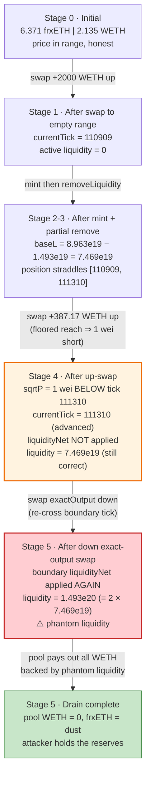
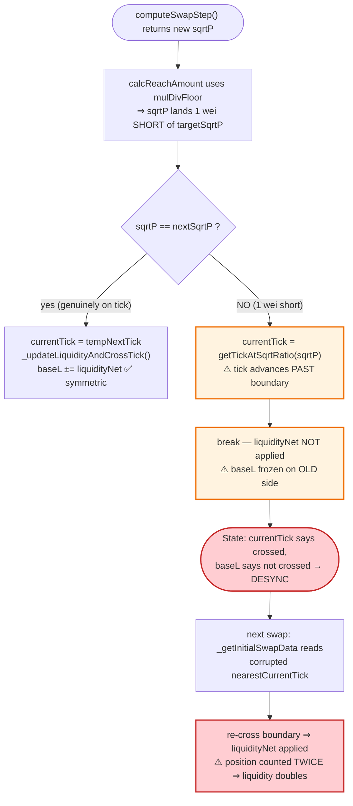

# KyberSwap Elastic Exploit — Tick-Boundary Precision Loss Doubles Pool Liquidity

> **Reproduction:** the PoC compiles & runs in an isolated Foundry project at
> [this project folder](.) (the umbrella DeFiHackLabs repo contains many unrelated
> PoCs that do not whole-compile, so this one was extracted).
> Full verbose trace: [output.txt](output.txt).
> Verified vulnerable source: [contracts_Pool.sol](sources/Pool_Fd7B11/contracts_Pool.sol),
> [contracts_libraries_SwapMath.sol](sources/Pool_Fd7B11/contracts_libraries_SwapMath.sol).

This PoC reproduces the November 2023 KyberSwap Elastic incident against **one** of the many pools
that were drained — the **frxETH/WETH** KS2 Reinvestment-Token pool on Ethereum mainnet. The same
root cause (a tick-boundary rounding error that lets an attacker double the pool's *active*
liquidity) was used to drain ~17 pools across multiple chains for a total of **~$46–48M**. The
figures below are exact for the frxETH/WETH pool reproduced here.

---

## Key info

| | |
|---|---|
| **Loss (this pool)** | **2.1347 WETH + 6.365 frxETH** drained (~$23K at the time); part of the **~$46M** total incident |
| **Vulnerable contract** | KyberSwap Elastic `Pool` (impl. of pair `KS2-RT`) — [`0xFd7B111AA83b9b6F547E617C7601EfD997F64703`](https://etherscan.io/address/0xFd7B111AA83b9b6F547E617C7601EfD997F64703) |
| **Position manager** | `AntiSnipAttackPositionManager` — [`0xe222fBE074A436145b255442D919E4E3A6c6a480`](https://etherscan.io/address/0xe222fBE074A436145b255442D919E4E3A6c6a480) |
| **Victim pool** | frxETH/WETH KS2-RT pair (= the vulnerable Pool itself), token0 = frxETH, token1 = WETH |
| **Attacker EOA** | [`0x50275E0B7261559cE1644014d4b78D4AA63BE836`](https://etherscan.io/address/0x50275E0B7261559cE1644014d4b78D4AA63BE836) |
| **Attacker contract** | [`0xaf2acf3d4ab78e4c702256d214a3189a874cdc13`](https://etherscan.io/address/0xaf2acf3d4ab78e4c702256d214a3189a874cdc13) |
| **Funding** | Aave v3 `flashLoanSimple` of **2,000 WETH** (premium 0.05% = 1 WETH) — [`0x87870Bca…4fA4E2`](https://etherscan.io/address/0x87870Bca3F3fD6335C3F4ce8392D69350B4fA4E2) |
| **Attack tx (full incident)** | [`0x485e08dc2b6a4b3aeadcb89c3d18a37666dc7d9424961a2091d6b3696792f0f3`](https://app.blocksec.com/explorer/tx/eth/0x485e08dc2b6a4b3aeadcb89c3d18a37666dc7d9424961a2091d6b3696792f0f3) |
| **Chain / block / date** | Ethereum mainnet / fork **18,630,391** / Nov 22–23, 2023 |
| **Compiler** | Pool: Solidity **v0.8.9+commit.e5eed63a**, optimizer **500 runs** |
| **Bug class** | Rounding / precision loss at a tick boundary → liquidity double-count → broken AMM invariant |

---

## TL;DR

KyberSwap Elastic is a Uniswap-V3-style concentrated-liquidity AMM. Active liquidity (`baseL`) is
adjusted as the price crosses *initialized ticks* by adding/subtracting that tick's `liquidityNet`.
The crossing is symmetric *only if* the price genuinely lands on the tick.

The flaw lives in `SwapMath.computeSwapStep` /
[`calcReachAmount`](sources/Pool_Fd7B11/contracts_libraries_SwapMath.sol#L102-L164): every reach
calculation is rounded **down** (`mulDivFloor`) "so we avoid giving away too much." When a swap is
sized so the price *should* reach an initialized tick, the floored arithmetic instead leaves the
new `sqrtP` **one wei short** of that tick. The pool's loop
([Pool.sol:413-419](sources/Pool_Fd7B11/contracts_Pool.sol#L413-L419)) sees `sqrtP != nextSqrtP`,
treats the step as *not* having crossed the tick, **breaks without applying `liquidityNet`**, yet
records the new `currentTick` as already being on the other side of that boundary
([Pool.sol:416](sources/Pool_Fd7B11/contracts_Pool.sol#L416)). The pool's tick bookkeeping and its
`baseL` are now **desynchronized**.

An attacker who mints a tiny LP position straddling that exact boundary, then swaps back across it,
makes the pool **add the position's liquidity a second time** without ever having removed it — the
trace shows the active `liquidity` field jumping from `74,692,747,583,654,757,908` to exactly
**double**, `149,385,495,167,309,515,816`
([output.txt:234](output.txt#L234) vs [output.txt:268](output.txt#L268)). With phantom liquidity
backing it, a final **exact-output** swap pulls essentially **all** of the pool's WETH out at a
price the real reserves cannot support. Everything is wrapped in an Aave flash loan, so the
attacker needs no capital.

---

## Background — KyberSwap Elastic mechanics

KyberSwap Elastic (`Pool` / `KS2-RT`) is a concentrated-liquidity DEX. The relevant pieces:

- **`baseL`** — the *active* base liquidity currently in range (Pool struct, used in every swap step).
- **`reinvestL`** — auto-compounding fee liquidity (the "reinvestment" mechanism; KS2-RT is the
  reinvestment receipt token).
- **Initialized ticks** form a doubly-linked list
  ([Linkedlist.sol](sources/Pool_Fd7B11/contracts_libraries_Linkedlist.sol)). Each tick stores a
  signed `liquidityNet`. When the price crosses tick `T` going up, `baseL += liquidityNet[T]`; going
  down, `baseL -= liquidityNet[T]`. This bookkeeping is implemented by
  [`_updateLiquidityAndCrossTick`](sources/Pool_Fd7B11/contracts_PoolTicksState.sol#L77-L103) and is
  the heart of every V3-style AMM's correctness.
- **The swap loop** ([Pool.sol:371-464](sources/Pool_Fd7B11/contracts_Pool.sol#L371-L464)) walks
  one initialized tick at a time. For each step it calls
  [`SwapMath.computeSwapStep`](sources/Pool_Fd7B11/contracts_libraries_SwapMath.sol#L28-L98), which
  returns the amount used and the resulting `sqrtP`. If `sqrtP` reached the target tick, the loop
  *crosses* it (applies `liquidityNet`); otherwise it breaks.

On-chain state of the frxETH/WETH pool at the fork block (from the trace):

| Parameter | Value |
|---|---|
| token0 / token1 | frxETH (`0x5E84…Caa1f`) / WETH (`0xC02a…56Cc2`) |
| `swapFeeUnits` | **10** (= 0.01%, [output.txt:64-65](output.txt#L64)) |
| pool frxETH balance (reserve0) | **6.371036189774251150 frxETH** ([output.txt:6](output.txt#L6)) |
| pool WETH balance (reserve1) | **2.134741529491887485 WETH** ([output.txt:7](output.txt#L7)) |
| `currentTick` before attack | ≈ 110,909 region (very high tick — frxETH ≈ WETH, frxETH slightly cheaper) |

---

## The vulnerable code

### 1. Every reach amount is floored — the price falls short of the tick

[`calcReachAmount`](sources/Pool_Fd7B11/contracts_libraries_SwapMath.sol#L102-L164) computes how
much input is needed to move `sqrtP` exactly to the next tick. Note the **floor** rounding on every
branch:

```solidity
// isExactInput, isToken0 == false (token1 in, price up — the attacker's direction)
uint256 denominator = C.TWO_FEE_UNITS * currentSqrtP - feeInFeeUnits * targetSqrtP;
uint256 numerator = FullMath.mulDivFloor(            // ← rounds DOWN
  liquidity,
  C.TWO_FEE_UNITS * absPriceDiff,
  denominator
);
reachAmount = FullMath.mulDivFloor(numerator, currentSqrtP, C.TWO_POW_96).toInt256(); // ← rounds DOWN
```

Because `reachAmount` is rounded down, the *actual* price produced by `calcFinalPrice`
([SwapMath.sol:253-280](sources/Pool_Fd7B11/contracts_libraries_SwapMath.sol#L253-L280)) lands a
hair below `targetSqrtP` — it does **not** equal the tick's sqrt price.

### 2. The loop treats "almost reached" as "not crossed" but still advances the tick

```solidity
// Pool.sol — inside the swap while-loop
(usedAmount, returnedAmount, deltaL, swapData.sqrtP) = SwapMath.computeSwapStep(...);
...
// if price has not reached the next sqrt price
if (swapData.sqrtP != swapData.nextSqrtP) {           // ← off by 1 wei ⇒ TRUE
  if (swapData.sqrtP != swapData.startSqrtP) {
    swapData.currentTick = TickMath.getTickAtSqrtRatio(swapData.sqrtP); // ← tick advances anyway
  }
  break;                                              // ← liquidityNet NEVER applied
}
swapData.currentTick = willUpTick ? tempNextTick : tempNextTick - 1;
...
(swapData.baseL, swapData.nextTick) = _updateLiquidityAndCrossTick(...); // ← skipped
```

So after the swap the pool believes the price is **on one side** of the boundary tick (the
`currentTick` was updated via `getTickAtSqrtRatio`, [Pool.sol:416](sources/Pool_Fd7B11/contracts_Pool.sol#L416)),
while `baseL` was computed **as if it were still on the other side** (the cross at
[Pool.sol:457-463](sources/Pool_Fd7B11/contracts_Pool.sol#L457-L463) was skipped by the `break`).

### 3. `_getInitialSwapData` re-derives `nextTick` from the desynced state

```solidity
function _getInitialSwapData(bool willUpTick) internal view returns (...) {
  ...
  nextTick = poolData.nearestCurrentTick;            // derived from the corrupted currentTick
  if (willUpTick) nextTick = initializedTicks[nextTick].next;
}
```

On the *next* swap, the pool starts from the corrupted `nearestCurrentTick`/`currentTick`. When the
attacker now swaps **back** across the same boundary tick, the loop crosses it "again" and applies
that tick's `liquidityNet` — even though it was never removed the first time. The attacker's freshly
minted position is therefore counted **twice**, doubling `baseL`.

---

## Root cause — why it was possible

> A concentrated-liquidity AMM is only solvent if `baseL` and the tick-crossing bookkeeping stay
> perfectly in lockstep: every wei of liquidity added at a tick must be added to / removed from
> `baseL` exactly once when the price crosses that tick. KyberSwap's swap step rounds the
> price-to-tick calculation **down**, so the price stops **one wei short** of an initialized tick.
> The pool then makes two contradictory decisions in the same step: it advances `currentTick`
> *past* the tick (via `getTickAtSqrtRatio` on the off-by-one price) but **skips** the
> `_updateLiquidityAndCrossTick` call that would apply the tick's `liquidityNet`. The state machine
> is now inconsistent, and a follow-up swap re-applies the liquidity, doubling the active liquidity
> for free.

The four facts that compose into a critical, capital-free exploit:

1. **Asymmetric / floored rounding** in `calcReachAmount` and `calcFinalPrice`
   ([SwapMath.sol:124-161](sources/Pool_Fd7B11/contracts_libraries_SwapMath.sol#L124-L161)) makes
   "price reaches the tick" practically unattainable — the result is always a wei short.
2. **The `sqrtP != nextSqrtP` branch is the *only* gate** on whether `liquidityNet` is applied
   ([Pool.sol:413-419](sources/Pool_Fd7B11/contracts_Pool.sol#L413-L419)). A one-wei discrepancy
   silently skips the cross while the tick still moves.
3. **`currentTick` is recomputed from the (off-by-one) `sqrtP`**
   ([Pool.sol:416](sources/Pool_Fd7B11/contracts_Pool.sol#L416)), so the pool *thinks* it crossed
   even though `baseL` says otherwise — the desync is persisted to storage via
   `_updatePoolData`/`nearestCurrentTick`
   ([PoolTicksState.sol:105-119](sources/Pool_Fd7B11/contracts_PoolTicksState.sol#L105-L119)).
4. **Anyone can mint a position straddling the exact boundary** through the whitelisted
   `AntiSnipAttackPositionManager`
   ([Pool.sol:171-215](sources/Pool_Fd7B11/contracts_Pool.sol#L171-L215)) and then drive the price
   with permissionless `swap()` calls, so the attacker fully controls *where* the boundary lands and
   *when* it is re-crossed.

This is the bug BlockSec titled *"Yet another tragedy of precision loss."*

---

## Preconditions

- A pool with at least one initialized tick the attacker can straddle, and enough real liquidity on
  the WETH side to be worth draining (here 2.13 WETH).
- Ability to mint/burn a concentrated position via the whitelisted position manager (permissionless
  for any EOA — `AntiSnipAttackPositionManager` is whitelisted, but *callers* of it are not gated).
- Working capital to size the boundary swaps. Fully **flash-loanable**: the PoC borrows 2,000 WETH
  from Aave v3 and repays 2,001 WETH (0.05% premium) inside the same transaction
  ([test/KyberSwap_exp.eth.1.sol:92-93](test/KyberSwap_exp.eth.1.sol#L92-L93),
  [:170-178](test/KyberSwap_exp.eth.1.sol#L170-L178)).

---

## Attack walkthrough (with on-chain numbers from the trace)

The PoC's `_flashCallback`
([test/KyberSwap_exp.eth.1.sol:97-156](test/KyberSwap_exp.eth.1.sol#L97-L156)) executes four pool
interactions inside the Aave flash loan. `token0 = frxETH`, `token1 = WETH`; the attacker only ever
sells/buys WETH (`isToken0 = false` on all swaps).

| # | Step (PoC line) | Pool `currentTick` → | Active `liquidity` reported | Effect |
|---|------|---------------------|----------------------------:|--------|
| 0 | **Initial** | ~110,909 | (in range) | Honest pool: 6.371 frxETH / 2.135 WETH. |
| 1 | **Swap up to empty range** — `swap(self, +2000e18 WETH, up, limit=tick≈110909)` ([:114](test/KyberSwap_exp.eth.1.sol#L114)) | → **110,909** | **0** | Price pushed up to a tick range with **zero** liquidity. Pulls out 6.371 frxETH ([output.txt:105](output.txt#L105)). |
| 2 | **Mint position** straddling `[110909, 111310]`, qty=8.963e19 ([:118-133](test/KyberSwap_exp.eth.1.sol#L118)) | — | — | Adds liquidity exactly at the boundary tick. qty0=6.948e15 frxETH, qty1=1.078e17 WETH ([output.txt:152](output.txt#L152)). |
| 3 | **Remove** part of it (1.493e19 of 8.963e19) ([:136-140](test/KyberSwap_exp.eth.1.sol#L136)) | — | — | Leaves `baseL = 8.963e19 − 1.493e19 = 7.469e19`. Pulls back 1.158e15 frxETH + 1.796e16 WETH ([output.txt:198](output.txt#L198)). |
| 4 | **Swap up across the boundary** — `swap(self, +387.17e18 WETH, up, limit=MAX)` ([:143-149](test/KyberSwap_exp.eth.1.sol#L143)) | → **111,310** | **74,692,747,583,654,757,908** (= 7.469e19, *correct*) | Price moves up, ends one wei short of tick 111310; tick advances but the cross is skipped → **desync created** ([output.txt:234](output.txt#L234)). |
| 5 | **Swap back down (exact output)** — `swap(self, −victimWETHbal, up, limit=MIN+1)` ([:150](test/KyberSwap_exp.eth.1.sol#L150)) | → **111,105** | **149,385,495,167,309,515,816** (= **2 × 7.469e19**) | The boundary tick's `liquidityNet` is applied *again* → **liquidity doubles** ([output.txt:268](output.txt#L268)). Exact-output swap drains **all** WETH out to the attacker (deltaQty1 = −3.962e20) ([output.txt:268](output.txt#L268)). |

**The proof of the bug is purely mechanical**, visible in two trace lines:

```
output.txt:234  Swap(... liquidity: 74692747583654757908,  currentTick: 111310)   # 7.469e19
output.txt:268  Swap(... liquidity: 149385495167309515816, currentTick: 111105)   # 1.493e20 == 2×
```

`149,385,495,167,309,515,816 = 2 × 74,692,747,583,654,757,908` to the wei. The active liquidity
**doubled** with no corresponding deposit — the only thing that happened between the two swaps was
re-crossing the boundary tick. The position's liquidity was counted twice because the first crossing
(step 4) advanced the tick but skipped `_updateLiquidityAndCrossTick`.

> **Why step 5 drains everything:** after the doubling, the pool's quoted exact-output price is
> backed by phantom liquidity. The pool sends out the requested ~396.24 WETH
> (`deltaQty1 = −396244493223555299358`, [output.txt:268](output.txt#L268)) while only taking in
> ~5.87e15 frxETH — far less than the constant-product curve of the *real* reserves would demand.
> The victim pool ends with **0 WETH** and only dust frxETH ([output.txt:332-336](output.txt#L332)).

### Profit accounting

| | frxETH | WETH |
|---|---:|---:|
| Pool reserve **before** | 6.371036189774251150 | 2.134741529491887485 |
| Pool reserve **after** | 0.005876187192500041 | **0** |
| **Drained from pool** | **6.365160 frxETH** | **2.134742 WETH** |
| Attacker balance **after** (flash loan already repaid) | **6.364001987952861764 frxETH** | **1.116773260184104614 WETH** |

The attacker walks away with **6.364 frxETH + 1.117 WETH** of net profit (the small gap vs. the pool
drain is the Aave premium + swap fees + the wei left as dust). The pool's entire WETH side is gone
([output.txt:10-13](output.txt#L10)). Test result: **`[PASS] testExploit()` (gas: 2,529,592)**
([output.txt:3-4](output.txt#L4)).

---

## Diagrams

### Sequence of the attack

```mermaid
sequenceDiagram
    autonumber
    actor A as "Attacker contract"
    participant AAVE as "Aave v3 Pool"
    participant PM as "AntiSnipAttack<br/>PositionManager"
    participant P as "KyberSwap Pool<br/>(frxETH/WETH)"

    A->>AAVE: "flashLoanSimple(2000 WETH)"
    AAVE-->>A: "2000 WETH + executeOperation()"

    rect rgb(255,243,224)
    Note over A,P: "Step 1 — move to a zero-liquidity tick range"
    A->>P: "swap(+2000 WETH, up, limit≈tick 110909)"
    P-->>A: "6.371 frxETH out; liquidity now 0"
    end

    rect rgb(232,245,233)
    Note over A,P: "Step 2-3 — straddle the boundary tick"
    A->>PM: "mint [110909, 111310], qty 8.963e19"
    PM->>P: "mint() → baseL += 8.963e19"
    A->>PM: "removeLiquidity 1.493e19"
    PM->>P: "burn() → baseL = 7.469e19 (correct)"
    end

    rect rgb(255,235,238)
    Note over A,P: "Step 4 — the precision-loss step"
    A->>P: "swap(+387.17 WETH, up, limit=MAX)"
    Note over P: "sqrtP lands 1 wei SHORT of tick 111310<br/>currentTick advances, liquidityNet NOT applied<br/>⚠️ tick / baseL DESYNC"
    P-->>A: "Swap event: liquidity = 7.469e19"
    end

    rect rgb(243,229,245)
    Note over A,P: "Step 5 — re-cross ⇒ double-count ⇒ drain"
    A->>P: "swap(exactOutput = all WETH, limit=MIN+1)"
    Note over P: "boundary liquidityNet applied AGAIN<br/>⚠️ liquidity DOUBLES to 1.493e20"
    P-->>A: "≈396 WETH out for ≈0.006 frxETH in"
    Note over P: "pool WETH reserve → 0"
    end

    A->>AAVE: "repay 2001 WETH"
    Note over A: "Net +6.364 frxETH +1.117 WETH"
```

### Pool liquidity / tick state evolution



### Where the desync is born inside `swap()`



---

## Why each magic number

- **`swap #1` amount `2000e18` WETH** with the precise `sqrtPriceLimit` `0x100…0000`
  (`20282409603651670423947251286016`, = sqrtP at tick 110909): pushes the price exactly to the edge
  of a **zero-liquidity** range so the attacker controls the active-liquidity baseline before
  minting ([test:114](test/KyberSwap_exp.eth.1.sol#L114)).
- **`mint [110909, 111310]`, qty `89631297100385708499`** and **`removeLiquidity 14938549516730950591`**:
  sized so the *remaining* `baseL = 7.469e19` sits straddling the boundary tick the attacker will
  re-cross — and so the doubled value (`1.493e20`) is large enough to back the final drain
  ([test:118-140](test/KyberSwap_exp.eth.1.sol#L118)).
- **`swap #2` amount `387170294533119999999`** with `limit = MAX_SQRT_RATIO`: pushes `sqrtP` to land
  *one wei short* of tick 111310, manufacturing the desync ([test:143](test/KyberSwap_exp.eth.1.sol#L143)).
- **`swap #3` amount `−IERC20(WETH).balanceOf(victim)`** (exact output = the pool's entire WETH
  balance) with `limit = MIN_SQRT_RATIO + 1` (`4295128740`): re-crosses the boundary (triggering the
  double-count) and requests **all** of the pool's WETH as output ([test:150](test/KyberSwap_exp.eth.1.sol#L150)).

---

## Remediation

1. **Make tick crossing consistent with the tick the price ends on.** The cross of `liquidityNet`
   must be decided by *which tick the final `sqrtP` belongs to*, not by the brittle
   `sqrtP == nextSqrtP` equality. If `getTickAtSqrtRatio(sqrtP)` advances past a boundary, that
   boundary's `liquidityNet` **must** be applied in the same step. (KyberSwap's actual fix reworked
   the swap step so the price and the active-liquidity bookkeeping can never disagree.)
2. **Round the reach amount conservatively *toward* the tick boundary, and re-derive `currentTick`
   only from a fully-crossed price.** Avoid a state where `currentTick` is past a tick that was never
   crossed for liquidity purposes.
3. **Add a swap-level invariant assertion.** After each swap, assert that `baseL` equals the sum of
   active positions for the resulting tick (or, more cheaply, that crossing-count parity is
   preserved). A liquidity value that *increases* across a swap with no mint is an immediate red
   flag — the trace's `7.469e19 → 1.493e20` jump would have reverted.
4. **Treat any boundary-precision divergence as a hard error, not a silent `break`.** Where the math
   cannot reach the tick exactly, snap `sqrtP` to the tick (and cross) or revert, rather than leaving
   it one wei short and advancing the tick anyway.
5. **Defense in depth: reserve solvency check on exact-output swaps.** Bound the output of any single
   swap by the pool's real token balance / curve so phantom liquidity can never authorize paying out
   more than the constant-product curve of the actual reserves permits.

---

## How to reproduce

The PoC was extracted into a standalone Foundry project (the umbrella DeFiHackLabs repo has many
unrelated PoCs that fail to compile under a whole-project `forge build`):

```bash
_shared/run_poc.sh 2023-11-KyberSwap_exp.eth.1 --mt testExploit -vvvvv
```

- RPC: an **Ethereum archive** endpoint is required (fork block **18,630,391**). The project's
  `foundry.toml` `mainnet` alias must point at an archive node that serves historical state at that
  block; pruned RPCs fail with `header not found` / `missing trie node`.
- Result: `[PASS] testExploit()` — the victim pool's WETH balance goes from `2.134…` to `0`, and the
  attacker contract ends holding `6.364… frxETH` + `1.116… WETH`.

Expected tail:

```
Ran 1 test for test/KyberSwap_exp.eth.1.sol:KyberswapFrxEthWethPoolExploitTest
[PASS] testExploit() (gas: 2529592)
Logs:
   [ before ]  [ token1 ]  [ victim ] : 2.134741529491887485
   [ after ]   [ token1 ]  [ victim ] : 0.000000000000000000
   [ after ]   [ token0 ]  [ attacker ] : 6.364001987952861764
   [ after ]   [ token1 ]  [ attacker ] : 1.116773260184104614
Suite result: ok. 1 passed; 0 failed; 0 skipped
```

---

*References: BlockSec — "Yet another tragedy of precision loss: an in-depth analysis of the
KyberSwap incident" (https://blocksec.com/blog/yet-another-tragedy-of-precision-loss-an-in-depth-analysis-of-the-kyber-swap-incident-1);
SlowMist — "A deep dive into the KyberSwap hack"
(https://slowmist.medium.com/a-deep-dive-into-the-kyberswap-hack-3e13f3305d3a);
SolidityScan — "KyberSwap Hack Analysis." Total incident loss ~$46–48M across multiple chains/pools;
this PoC reproduces the frxETH/WETH pool drain.*
