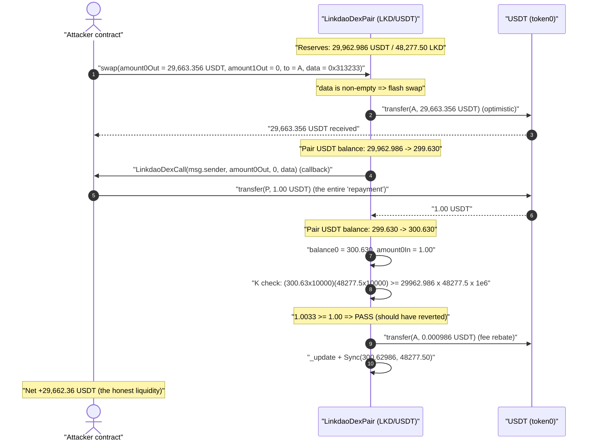
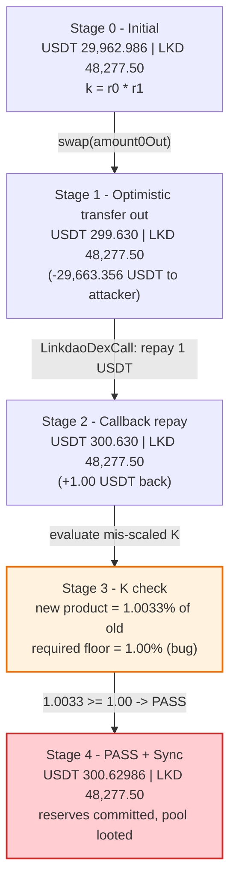
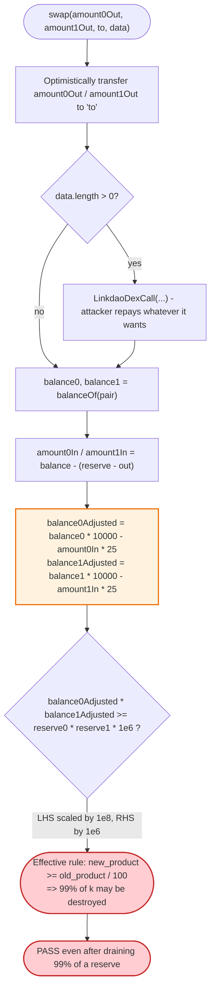
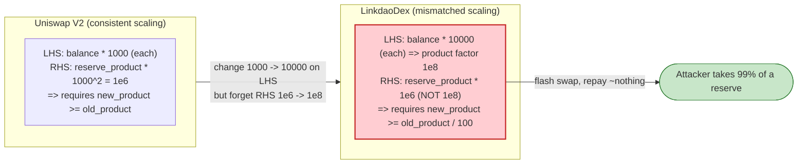

# LinkDao Exploit — Mis-scaled Constant-Product `K` Check in a Custom Uniswap-V2 Fork

> **Reproduction:** the PoC compiles & runs in an isolated Foundry project at
> [this project folder](.) (the umbrella DeFiHackLabs repo contains many unrelated PoCs that
> do not whole-compile, so this one was extracted).
> Full verbose trace: [output.txt](output.txt).
> Verified vulnerable source: [contracts_LinkdaoDexPair.sol](sources/LinkdaoDexFactory_717D0A/contracts_LinkdaoDexPair.sol).

---

## Key info

| | |
|---|---|
| **Loss** | ~$30K — **29,662.36 USDT** drained from the LKD/USDT pair in a single flash swap |
| **Vulnerable contract** | `LinkdaoDexPair` (LKD/USDT pair) — [`0x6524a5Fd3FEc179Db3b3C1d21F700Da7aBE6B0de`](https://bscscan.com/address/0x6524a5fd3fec179db3b3c1d21f700da7abe6b0de#code) |
| **Victim pool** | the pair itself; token0 = USDT `0x55d3…7955`, token1 = LKD `0xaF02…275F` |
| **Factory (sets fee params)** | `LinkdaoDexFactory` — [`0x717D0A192F4C5F9Bc8A2D45b01D696Dab2bD1b7A`](https://bscscan.com/address/0x717D0A192F4C5F9Bc8A2D45b01D696Dab2bD1b7A) |
| **Attacker EOA** | [`0xdF6B0200B4e1Bc4a310F33DF95a9087cC2C79038`](https://bscscan.com/address/0xdf6b0200b4e1bc4a310f33df95a9087cc2c79038) |
| **Attacker contract** | [`0x721a66c7767103e7dcacf8440e8dd074edff40a8`](https://bscscan.com/address/0x721a66c7767103e7dcacf8440e8dd074edff40a8) |
| **Attack tx** | [`0x4ed59e3013215c272536775a966f4365112997a6eec534d38325be014f2e15ee`](https://explorer.phalcon.xyz/tx/bsc/0x4ed59e3013215c272536775a966f4365112997a6eec534d38325be014f2e15ee) |
| **Chain / block / date** | BSC / 33,527,744 / 2023-11-15 |
| **Compiler** | Solidity v0.8.20, optimizer **1 run** |
| **Bug class** | Broken AMM constant-product invariant — dimensional/scaling mismatch in the `K` check |

---

## TL;DR

`LinkdaoDexPair` is a fork of Uniswap V2 whose `swap()` re-implements the constant-product
(`x·y ≥ k`) safety check with the protocol's own fee parameters. The fork got the *scaling* of
that check wrong:

```solidity
balance0Adjusted = balance0 * totalFeePercentage - amount0In * feePercentage;   // ×10000
balance1Adjusted = balance1 * totalFeePercentage - amount1In * feePercentage;   // ×10000
require(balance0Adjusted * balance1Adjusted >= uint256(_reserve0) * _reserve1 * 1e6, "LinkdaoDex: K");
```
[contracts_LinkdaoDexPair.sol:243-256](sources/LinkdaoDexFactory_717D0A/contracts_LinkdaoDexPair.sol#L243-L256)

`totalFeePercentage = 10000`, so the left-hand side carries a `10000 × 10000 = 1e8` factor, while
the right-hand side multiplies the old reserve product by only `1e6`. The two sides are off by
**100×**. The check therefore really enforces:

> `balance0·balance1  ≥  reserve0·reserve1 / 100`

i.e. a swap is allowed to **destroy 99% of the pool's `k`**. An attacker can request a flash swap
that pulls out ~99% of one reserve, repay essentially nothing (a token amount sized to land the
product just above the 1% floor), and walk away with the difference.

The attacker did exactly that: a single `swap()` requested **29,663.36 USDT** out, repaid only
**1.00 USDT** inside the callback, and the rigged `K` check passed because the post-swap reserve
product was 1.0033% of the original — above the 1% the bug tolerates. Net theft: **29,662.36 USDT**.

---

## Background — what LinkdaoDex does

`LinkdaoDexPair` ([source](sources/LinkdaoDexFactory_717D0A/contracts_LinkdaoDexPair.sol)) is a
near-verbatim Uniswap-V2 pair: it holds two token reserves, supports `mint`/`burn`/`swap`/`skim`/
`sync`, and protects swaps with a constant-product invariant. The one substantive change is the
fee model. Instead of Uniswap's hard-coded 0.3% (`balance*1000 - amountIn*3`), LinkDao reads four
fee parameters from the factory:

| Getter | On-chain value (read in the trace) | Factory comment |
|---|---:|---|
| `getFeePercentage()` | `0x19` = **25** | `// 0.25%` |
| `getBuyBackLkdPercentage()` | `0xbb8` = **3000** | `// 30%` |
| `getTreasuryPercentage()` | `0x3e8` = **1000** | `// 10%` |
| `getTotalFeePercentage()` | `0x2710` = **10000** | `// 100%` |

These are defined in
[contracts_LinkdaoDexFactory.sol:17-22](sources/LinkdaoDexFactory_717D0A/contracts_LinkdaoDexFactory.sol#L17-L22).
The intent: a 0.25% trading fee, where 40% of that fee (`(buyBack 3000 + treasury 1000)/10000`)
is paid back to `msg.sender` after the swap. `totalFeePercentage = 10000` is meant to be the
basis-point denominator (100% = 10000 bps).

That denominator is the trap. The swap K-check was lifted from Uniswap V2 — where the fee
denominator is `1000` and the RHS uses `1000² = 1e6` — but only one of the two numbers was changed
to match the new `10000` denominator. The author bumped the LHS multiplier from `1000` to
`totalFeePercentage` (10000) but left the RHS at the original `1e6`.

The state of the pair at the fork block (read from the trace):

| Parameter | Value |
|---|---:|
| Pair USDT balance (reserve0) | **29,962.986 USDT** ← the prize |
| Pair LKD balance (reserve1) | **48,277.50 LKD** |
| Attacker USDT balance (before) | 26.51 USDT |

---

## The vulnerable code

### `swap()` — optimistic transfer, flash-swap callback, then the mis-scaled `K` check

```solidity
function swap(uint256 amount0Out, uint256 amount1Out, address to, bytes calldata data)
    external override lock returns (uint256, uint256)
{
    require(amount0Out > 0 || amount1Out > 0, "LinkdaoDex: INSUFFICIENT_OUTPUT_AMOUNT");
    (uint112 _reserve0, uint112 _reserve1, ) = getReserves();
    require(amount0Out < _reserve0 && amount1Out < _reserve1, "LinkdaoDex: INSUFFICIENT_LIQUIDITY");

    uint256 balance0;
    uint256 balance1;
    {
        address _token0 = token0;
        address _token1 = token1;
        require(to != _token0 && to != _token1, "LinkdaoDex: INVALID_TO");
        if (amount0Out > 0) _safeTransfer(_token0, to, amount0Out); // optimistic transfer
        if (amount1Out > 0) _safeTransfer(_token1, to, amount1Out); // optimistic transfer
        if (data.length > 0)
            ILinkdaoDexCallee(to).LinkdaoDexCall(msg.sender, amount0Out, amount1Out, data); // flash callback
        balance0 = IERC20(_token0).balanceOf(address(this));
        balance1 = IERC20(_token1).balanceOf(address(this));
    }
    uint256 amount0In = balance0 > _reserve0 - amount0Out ? balance0 - (_reserve0 - amount0Out) : 0;
    uint256 amount1In = balance1 > _reserve1 - amount1Out ? balance1 - (_reserve1 - amount1Out) : 0;
    require(amount0In > 0 || amount1In > 0, "LinkdaoDex: INSUFFICIENT_INPUT_AMOUNT");

    uint256 feePercentage      = ILinkdaoDexFactory(factory).getFeePercentage();        // 25
    uint256 buyBackLkdAndTreasuryPercentage =
        ILinkdaoDexFactory(factory).getBuyBackLkdPercentage()
      + ILinkdaoDexFactory(factory).getTreasuryPercentage();                            // 4000
    uint256 totalFeePercentage = ILinkdaoDexFactory(factory).getTotalFeePercentage();   // 10000
    {
        uint256 balance0Adjusted = balance0 * totalFeePercentage - amount0In * feePercentage; // ×10000
        uint256 balance1Adjusted = balance1 * totalFeePercentage - amount1In * feePercentage; // ×10000

        require(
            balance0Adjusted * balance1Adjusted >= uint256(_reserve0) * _reserve1 * 1e6,        // ×1e6 (!!)
            "LinkdaoDex: K"
        );
    }
    _update(balance0, balance1, _reserve0, _reserve1);
    ...
}
```
[contracts_LinkdaoDexPair.sol:189-285](sources/LinkdaoDexFactory_717D0A/contracts_LinkdaoDexPair.sol#L189-L285)

Compare to canonical Uniswap V2:

```solidity
// UniswapV2Pair.swap()  (fee denominator 1000)
uint balance0Adjusted = balance0.mul(1000).sub(amount0In.mul(3));
uint balance1Adjusted = balance1.mul(1000).sub(amount1In.mul(3));
require(balance0Adjusted.mul(balance1Adjusted) >= uint(_reserve0).mul(_reserve1).mul(1000**2), 'UniswapV2: K');
//                                                                              ^^^^^^^ 1000² = 1e6 matches the 1000 on LHS
```

Uniswap pairs `1000` on the LHS with `1000² = 1e6` on the RHS — dimensionally consistent. LinkDao
changed the LHS multiplier to `totalFeePercentage = 10000` but **kept the RHS at `1e6`**. It should
have been `totalFeePercentage² = 1e8`.

---

## Root cause — the scaling is off by exactly 100×

Let `b0,b1` be the post-swap balances and `r0,r1` the pre-swap reserves. Ignoring the tiny
fee subtraction (`amount0In × 25` is negligible next to `balance0 × 10000`), the check is:

```
(b0 · 10000) · (b1 · 10000)  ≥  r0 · r1 · 1e6
        b0 · b1 · 1e8         ≥  r0 · r1 · 1e6
              b0 · b1         ≥  (r0 · r1) / 100
```

So the post-swap product only has to stay **above 1% of the pre-swap product**. A correctly scaled
check (`× 1e8` on both sides) would instead require `b0·b1 ≥ r0·r1`, i.e. the product may never
fall below its previous value — the actual constant-product safety property.

In other words, **every swap is silently allowed to vaporize up to 99% of the pool's liquidity.**
Because a flash swap lets the caller take tokens out *first* and decide what to return *after*, the
attacker can:

1. Request a huge `amount0Out` (USDT out).
2. In the callback, repay only enough USDT to land `b0·b1` just above `r0·r1/100`.
3. Pass the `K` check and keep the rest.

Verified against the trace (token1 = LKD never moved, so `b1 = r1`):

| Quantity | Value |
|---|---:|
| `r0` (USDT before) | 29,962.986 |
| `r1` (LKD) | 48,277.50 |
| `b0` (USDT after, post-repay) | 300.63 |
| `b1` (LKD after) | 48,277.50 |
| old product `r0·r1` | 1.4465e9 (×1e36 wei²) |
| new product `b0·b1` | 1.4514e7 (×1e36 wei²) |
| `b0·b1 / r0·r1` | **1.0033%** ← just above the 1% the bug allows |

The attacker drained the USDT reserve down to **1.0033%** of its original value, precisely the floor
the mis-scaled `K` check permits, and the `require` passed.

There is no reentrancy, no oracle, no flash-loan-of-an-external-protocol involved. The pair's own
`swap()` hands the attacker the funds optimistically and then fails to verify they were paid for.

---

## Preconditions

- A pool with non-trivial reserves (here ~30K USDT + ~48K LKD) and `tradingEnabled` on the pair
  (the pair has no trading gate; any holder of a tiny input can call `swap`).
- Ability to call `swap()` with calldata so the flash-swap callback (`LinkdaoDexCall`) fires — the
  attacker's contract implements it via a `fallback`/selector dispatch
  ([test/LinkDao_exp.sol:65-71](test/LinkDao_exp.sol#L65-L71)).
- A token amount to "repay" sized so the post-swap product lands just above `r0·r1/100`. In the live
  attack the repay was **1.00 USDT**; the bug's tolerance is so wide that the input is nearly free.
- No flash loan of external capital is even required — the attacker only needed ~1 USDT of working
  capital to satisfy the (broken) check.

---

## Attack walkthrough (with on-chain numbers from the trace)

token0 = USDT (`0x55d3…7955`), token1 = LKD (`0xaF02…275F`). All figures from
[output.txt](output.txt).

| # | Step | Pair USDT balance | Pair LKD balance | Effect |
|---|------|------------------:|-----------------:|--------|
| 0 | **Initial reserves** | 29,962.986 | 48,277.50 | Honest pool. |
| 1 | Attacker calls `swap(amount0Out = 29,663.356 USDT, amount1Out = 0, to = attacker, data = "123")` | — | — | A non-empty `data` makes it a **flash swap**. |
| 2 | Pair optimistically `transfer`s **29,663.356 USDT** to the attacker | **299.630** | 48,277.50 | USDT reserve collapses 99%. Attacker USDT: 26.51 → 29,689.87. |
| 3 | Pair invokes the flash callback `LinkdaoDexCall(...)` → attacker's `fallback` dispatches to `xdc6eaaa9()` | — | — | Attacker now decides what to repay. |
| 4 | Inside callback, attacker `transfer`s **1.00 USDT** back to the pair | **300.630** | 48,277.50 | This is the *entire* "repayment". |
| 5 | Pair reads `balance0 = 300.630 USDT`, `balance1 = 48,277.50 LKD`; computes `amount0In = 1.00 USDT`, `amount1In = 0` | — | — | (See [:221-233](sources/LinkdaoDexFactory_717D0A/contracts_LinkdaoDexPair.sol#L221-L233).) |
| 6 | Mis-scaled `K` check: `(300.63·10000)·(48277.50·10000) ≥ 29962.986·48277.50·1e6` → **`1.0033 ≥ 1.00` → PASS** | — | — | Should have reverted; doesn't. |
| 7 | Pair pays the "fee rebate" — `_safeTransfer(USDT, msg.sender, …)` of **0.000986 USDT** back to the attacker | **300.629** | 48,277.50 | The 40%-of-fee buy-back/treasury rebate ([:262-279](sources/LinkdaoDexFactory_717D0A/contracts_LinkdaoDexPair.sol#L262-L279)). |
| 8 | `_update(...)` syncs reserves; `Sync(reserve0 = 300.62986, reserve1 = 48277.50)` emitted | 300.630 | 48,277.50 | New (looted) reserves committed. |

The net of steps 2, 4, 7:

| Direction | USDT |
|---|---:|
| Out to attacker (amount0Out) | +29,663.356 |
| Repaid by attacker (callback) | −1.000 |
| Fee rebate back to attacker | +0.000986 |
| **Net USDT taken by attacker** | **+29,662.357** |

The pair's USDT reserve went from **29,962.986 → 300.630** — the attacker walked off with the
**29,662.36 USDT** of honest liquidity for the price of ~1 USDT.

### Profit / loss accounting

| | USDT |
|---|---:|
| Pair USDT before | 29,962.986 |
| Pair USDT after | 300.630 |
| **Pool loss** | **29,662.356** |
| Attacker USDT before | 26.51 |
| Attacker USDT after | ~29,688.87 |
| **Attacker gain (≈ pool loss, USDT ≈ $1)** | **≈ $29.7K** |

The PoC is a minimized single `swap()` call that reproduces just the looting `swap`; the LKD side
was never touched, so the attacker effectively bought ~29,662 USDT out of the pool for free.

---

## Diagrams

### Sequence of the attack



### Pool USDT-reserve evolution



### The flaw inside `swap()` — where the scaling diverges



### Correct vs. buggy invariant



---

## Why each number

- **`amount0Out = 29,663.356 USDT`:** sized so that, after repaying ~1 USDT, the post-swap USDT
  balance (≈300.63) leaves the reserve product at just over 1% of the original — the maximum the
  bug allows while still passing the `K` `require`. Taking even more would push the product below 1%
  and revert.
- **Repayment = 1.00 USDT:** the minimum needed to (a) make `amount0In > 0` so the
  `INSUFFICIENT_INPUT_AMOUNT` check passes, and (b) keep the product fractionally above the 1% floor.
- **`feePercentage × amount0In = 25 × 1` is negligible:** the fee subtraction in `balance0Adjusted`
  is dwarfed by `balance0 × 10000`, so it does not save the pool — the dominant term is the
  mis-scaled product itself.

---

## Remediation

1. **Fix the scaling — square the fee denominator on the RHS.** The right-hand side must use
   `totalFeePercentage²`, not a hard-coded `1e6`:
   ```solidity
   require(
       balance0Adjusted * balance1Adjusted >=
           uint256(_reserve0) * _reserve1 * (totalFeePercentage * totalFeePercentage),
       "LinkdaoDex: K"
   );
   ```
   With `totalFeePercentage = 10000`, the RHS becomes `× 1e8`, matching the `× 1e8` the LHS carries,
   and the check correctly enforces `new_product ≥ old_product`.
2. **Don't fork an AMM's safety math piecemeal.** When changing the fee denominator from Uniswap's
   `1000`, every constant derived from it (the `1000²` on the RHS, the `997`/`amountIn*3` numerators)
   must be updated in lockstep. Better: keep Uniswap's exact `swap()` and layer fees outside the
   invariant check.
3. **Add an invariant/property test.** A simple fuzz test asserting "after any `swap`,
   `reserve0·reserve1 ≥ k_before`" would have caught this immediately, since the bug allows a 100×
   `k` reduction.
4. **Guard the flash-swap path.** The optimistic-transfer + callback design is only safe if the
   post-callback `K` check is correct; given how cheap the attack is, the broken check turns the
   flash-swap feature into a free-withdrawal primitive.

---

## How to reproduce

The PoC was extracted into a standalone Foundry project (the umbrella DeFiHackLabs repo has many
unrelated PoCs that fail to whole-compile under `forge test`):

```bash
_shared/run_poc.sh 2023-11-LinkDao_exp -vvvvv
```

- RPC: a **BSC archive** endpoint is required (fork block 33,527,744, ~Nov 2023). The
  `setUp()` uses `vm.createSelectFork("bsc", 33_527_744)`; configure the `bsc` alias in
  `foundry.toml`/`~/.foundry` to an archive node.
- Result: `[PASS] test()`. The trace shows the pair's USDT balance dropping from 29,962.986 to
  300.63 and the attacker receiving 29,663.356 USDT while repaying only 1.00 USDT.

Expected tail:

```
Ran 1 test for test/LinkDao_exp.sol:LinkDao_exp
[PASS] test() (gas: 81164)
...
Suite result: ok. 1 passed; 0 failed; 0 skipped; finished in 6.86s
```

---

*Reference: Phalcon analysis — https://x.com/phalcon_xyz/status/1725058908144746992 (LinkDao, BSC, ~$30K).*
