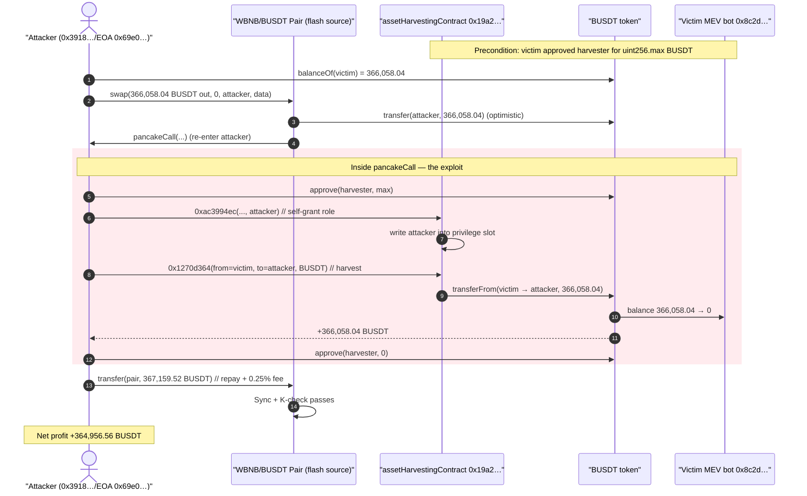
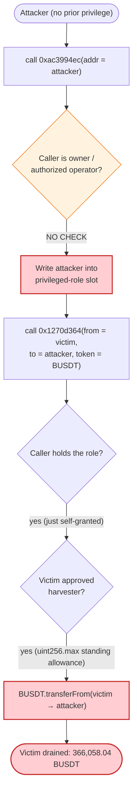
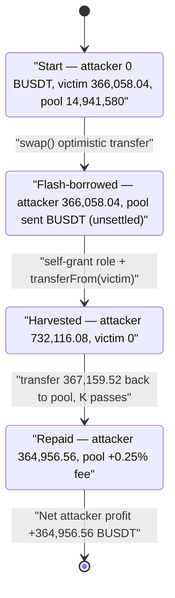

# MEV Bot `0x8c2d` Exploit — Permissionless Asset-Harvester Drains a Pre-Approved Victim

> **Vulnerability classes:** vuln/access-control/missing-auth · vuln/access-control/missing-modifier

> One-line summary: a generic "asset harvesting" infrastructure contract lets **anyone** designate
> themselves a privileged role and then move an arbitrary owner's pre-approved ERC-20 balance, so the
> attacker self-authorizes and sweeps **366,058 BUSDT (~$365K)** out of a victim MEV bot that had
> granted the harvester an infinite allowance.

> **Reproduction:** the PoC compiles & runs in this isolated Foundry project
> ([this folder](.)). The umbrella DeFiHackLabs repo contains many unrelated PoCs that do not
> whole-compile, so this one was extracted. Full verbose trace:
> [output.txt](output.txt). The only on-chain source that could be fetched verified is the victim
> pool used as the flash-loan source — [PancakePair.sol](sources/PancakePair_16b9a8/PancakePair.sol);
> the exploited `assetHarvestingContract` and `victimMevBot` are **unverified** on BscScan, so the
> bug class is reconstructed from the live call trace and storage diffs.

---

## Key info

| | |
|---|---|
| **Loss** | **366,058.04 BUSDT (~$365K)** swept from the victim MEV bot; attacker net **+364,956.56 BUSDT** after flash-loan fee |
| **Vulnerable contract** | `assetHarvestingContract` — [`0x19a23DdAA47396335894229E0439D3D187D89eC9`](https://bscscan.com/address/0x19a23DdAA47396335894229E0439D3D187D89eC9) (unverified) |
| **Victim** | MEV bot — [`0x8C2D4ed92Badb9b65f278EfB8b440F4BC995fFe7`](https://bscscan.com/address/0x8C2D4ed92Badb9b65f278EfB8b440F4BC995fFe7) (unverified) — had granted the harvester an infinite BUSDT allowance |
| **Flash-loan source** | WBNB/BUSDT PancakePair — [`0x16b9a82891338f9bA80E2D6970FddA79D1eb0daE`](https://bscscan.com/address/0x16b9a82891338f9bA80E2D6970FddA79D1eb0daE#code) |
| **Token drained** | BUSDT — [`0x55d398326f99059fF775485246999027B3197955`](https://bscscan.com/address/0x55d398326f99059fF775485246999027B3197955) |
| **Attacker EOA** | [`0x69e068eb917115ed103278b812ec7541f021cea0`](https://bscscan.com/address/0x69e068eb917115ed103278b812ec7541f021cea0) |
| **Attacker contract** | [`0x3918e0d26b41134c006e8d2d7e3206a53b006108`](https://bscscan.com/address/0x3918e0d26b41134c006e8d2d7e3206a53b006108) |
| **Attack tx** | [`0x3dcb26a1f49eb4d02ca29960b4833bfb2e83d7b5d9591aed1204168944c8c9b3`](https://explorer.phalcon.xyz/tx/bsc/0x3dcb26a1f49eb4d02ca29960b4833bfb2e83d7b5d9591aed1204168944c8c9b3) |
| **Chain / block / date** | BSC / 33,435,892 (fork block; exploit ran one block later) / Nov 2023 |
| **Compiler (PoC)** | Solidity 0.8.x via Foundry (Solc 0.8.34 in the trace); victim pool is Solc `v0.5.16` |
| **Bug class** | Broken access control on a shared infrastructure contract: self-grantable privileged role + arbitrary-`from` token transfer over a pre-existing allowance |

---

## TL;DR

The victim — a private MEV bot at `0x8c2d…` — outsourced its asset custody / sweeping to a shared
"asset harvesting" contract at `0x19a2…` and had pre-approved that harvester an **infinite BUSDT
allowance** (`type(uint256).max`).

The harvester exposes two raw, un-named functions reachable by 4-byte selector:

- **`0xac3994ec`** — *designate role*. It writes the **caller-supplied address** into a privileged-role
  storage slot. There is no check that the caller is the contract owner or that the address being
  granted is the caller's own legitimate principal — the attacker simply designates **itself**.
- **`0x1270d364`** — *harvest assets*. Given a `from` owner, a `to` recipient, and a token, it calls
  `token.transferFrom(from, to, amount)`. Because the privileged role was just self-granted, the
  authorization check passes, and because the victim had granted the harvester an infinite allowance,
  the `transferFrom` succeeds — moving the **victim's** BUSDT to the **attacker**.

The attacker wrapped this in a PancakeSwap flash swap purely to front the capital and make the
self-funded `transferFrom` shapes line up; the flash loan is repaid in the same transaction and the
profit is the victim's entire BUSDT balance minus the 0.25% pool fee.

```
designateRole(attacker)            // 0xac3994ec — self-grant privilege
harvestAssets(from=victim, to=attacker, token=BUSDT)   // 0x1270d364 — transferFrom victim → attacker
```

Net theft: **366,058.04 BUSDT**. Net attacker profit after the flash-loan fee: **364,956.56 BUSDT**.

---

## Background — the actors

- **The victim MEV bot (`0x8c2d…`)** is a searcher bot. To let an off-chain operator / keeper service
  sweep its accumulated profits without the bot signing each time, it granted a shared harvesting
  contract an **unlimited BUSDT allowance**. At the fork block it was holding **366,058.04 BUSDT**
  ([output.txt:1608-1609](output.txt#L1608)).
- **The asset-harvesting contract (`0x19a2…`)** is a piece of MEV / treasury infrastructure shared by
  multiple bots. It is meant to let an *authorized* operator pull pre-approved funds out of a bot and
  into a designated collector. Its access-control model is what breaks.
- **The PancakePair (`0x16b9…`)** is the canonical WBNB/BUSDT pool. It plays no victim role here — it
  is only the **flash-loan source** the attacker uses to borrow BUSDT for the duration of the
  transaction. Its `token0 = BUSDT`, `token1 = WBNB`. Reserves at the time: **14,934,149 BUSDT /
  60,136.75 WBNB** (post-trade Sync, [output.txt:1671-1675](output.txt#L1675)).

This is **not** an AMM / pricing bug. The pool's constant-product math is fully respected (the `K`
check passes). The entire loss comes from the harvester's broken authorization.

---

## The flash-loan vehicle (the only verified source)

The attacker borrows the *exact* victim balance from the pair via a flash swap. PancakeSwap's `swap`
optimistically sends the requested output, then calls back into the borrower's `pancakeCall`, and
only afterwards enforces the K-invariant on the post-callback balances
([PancakePair.sol:456-484](sources/PancakePair_16b9a8/PancakePair.sol#L456-L484)):

```solidity
function swap(uint amount0Out, uint amount1Out, address to, bytes calldata data) external lock {
    require(amount0Out > 0 || amount1Out > 0, 'Pancake: INSUFFICIENT_OUTPUT_AMOUNT');
    (uint112 _reserve0, uint112 _reserve1,) = getReserves();
    require(amount0Out < _reserve0 && amount1Out < _reserve1, 'Pancake: INSUFFICIENT_LIQUIDITY');
    ...
    if (amount0Out > 0) _safeTransfer(_token0, to, amount0Out); // optimistically transfer tokens
    ...
    if (data.length > 0) IPancakeCallee(to).pancakeCall(msg.sender, amount0Out, amount1Out, data); // ← attacker code runs here
    balance0 = IERC20(_token0).balanceOf(address(this));
    ...
    uint amount0In = balance0 > _reserve0 - amount0Out ? balance0 - (_reserve0 - amount0Out) : 0;
    ...
    uint balance0Adjusted = (balance0.mul(10000).sub(amount0In.mul(25)));  // 0.25% fee
    ...
    require(balance0Adjusted.mul(balance1Adjusted) >= uint(_reserve0).mul(_reserve1).mul(10000**2), 'Pancake: K');
}
```

Because `data.length > 0`, the pool re-enters the attacker's `pancakeCall`, where the real exploit
happens. The repay is `amount0 + 0.25% fee`, which the PoC computes as
`1 + (3 * amount0) / 997 + amount0` ([test/MEV_0x8c2d_exp.sol:57](test/MEV_0x8c2d_exp.sol#L57)).

---

## The vulnerable behavior (reconstructed from the trace)

The harvester source is unverified, so the two functions are reconstructed from the live call trace.
What the trace proves about each:

### 1. `0xac3994ec` — self-grantable privileged role

The attacker calls the harvester with the attacker's own address embedded in the calldata, and the
contract **writes that address into a role slot** with no owner/authority check
([output.txt:1625-1639](output.txt#L1625)):

```
assetHarvestingContract::ac3994ec( … …7fa9385be102ac3eac297483dd6233d62b3e1496 )   // last arg = attacker
  └─ storage changes:
       @ 0x7e58…718e: 0 → 0x4195bbc8…c655a90a
       @ 0x7e58…718d: 0 → 0x00000000000000000000000 1 7fa9385be102ac3eac297483dd6233d62b3e1496
                                                       ^role-bit  ^attacker address written verbatim
```

The attacker's address is written verbatim into the privilege slot — i.e. the function lets the
caller **name who is privileged**, and the attacker names itself. (The inner `BUSDT.transferFrom`
in this call is `attacker → attacker` for `366,058` — a no-op probe that also primes/exercises the
allowance bookkeeping.)

### 2. `0x1270d364` — arbitrary-`from` harvest over the victim's allowance

Now privileged, the attacker calls the harvest selector with `from = victimMevBot`,
`to = attacker`, `token = BUSDT` ([output.txt:1642-1653](output.txt#L1642)):

```
assetHarvestingContract::1270d364( …, victim=8c2d…ffe7, to=7fa9…1496, … )
  └─ BUSDT::transferFrom(victimMevBot 0x8C2D…, ContractTest 0x7FA9…, 366058040206325661577467)
       ├─ emit Transfer(from: victim, to: attacker, value: 366,058.04 BUSDT)
       ├─ emit Approval(owner: victim, spender: harvester, value: ~uint256.max − amount)  // ← infinite pre-approval consumed
       └─ storage changes:
            @ 0x67b3…1564 : 366,058 → 0        // victim BUSDT balance zeroed
            @ 0xb386…bc96 : … += 366,058        // attacker BUSDT balance credited
            @ 0x06fd…fd2f : uint256.max → max − amount   // victim→harvester allowance decremented
```

The decisive line is the `Approval` event with `owner = victim, spender = harvester`: the victim had
previously approved the harvester for `type(uint256).max`, so `transferFrom(victim, …)` from the
harvester's context succeeds. The harvester never checks that the *caller* who triggered the harvest
is allowed to move the *victim's* funds — only that the caller holds the role it just self-granted.

The attacker call frame is `msg.sender = attacker` throughout (the bot operator's authority is never
involved). The two-selector dance is the entire vulnerability:

> **Anyone can become "the operator," and "the operator" can pull any pre-approving owner's funds to
> any recipient.**

---

## Root cause

A shared, multi-tenant custody contract combined two independently-fatal access-control failures:

1. **Self-grantable privilege (`0xac3994ec`).** Role designation accepts an arbitrary address from
   calldata and stores it as privileged with no `onlyOwner` / signature / principal check. The
   attacker authorizes itself.
2. **Arbitrary-`from` transfer over standing allowances (`0x1270d364`).** The harvest path performs
   `BUSDT.transferFrom(from, to, amount)` with a caller-chosen `from` and `to`. Its only gate is the
   role from step 1. The moment a victim has granted the harvester a standing allowance, that victim
   becomes drainable by anyone who can pass the (self-grantable) role check.

The infinite pre-approval is the **enabler**, not the bug. The bug is that the privileged action that
spends those approvals is reachable by an attacker. The flash loan is purely a capital convenience and
contributes nothing to authorization — it just lets the attacker operate without holding 366K BUSDT.

This is the classic "shared approval target with broken auth" pattern: any contract that holds
**standing allowances from third parties** must treat its transfer-on-behalf entrypoint as a
maximum-sensitivity privileged function. Here it was effectively public.

---

## Preconditions

- The victim MEV bot had granted `assetHarvestingContract` an **unlimited BUSDT allowance** (visible
  in the trace as the `owner: victim, spender: harvester` `Approval` at
  [output.txt:1645](output.txt#L1645)). Without a standing allowance there is nothing to pull.
- The victim held a non-trivial BUSDT balance (366,058.04 BUSDT at the fork block).
- The harvester's role-designation selector `0xac3994ec` is callable by anyone and grants the caller
  the privilege checked by the harvest selector `0x1270d364`.
- Working capital is **not** required from the attacker — the flash swap fronts it and is repaid in
  the same tx, so the attack is effectively zero-capital.

---

## Attack walkthrough (with on-chain numbers from the trace)

All values are taken from [output.txt](output.txt) lines 1580-1683.

| # | Step | Call / Effect | Concrete value |
|---|------|---------------|---------------|
| 0 | Read victim balance | `BUSDT.balanceOf(victim)` | **366,058.040206325661577467 BUSDT** ([:1608](output.txt#L1608)) |
| 1 | Flash-borrow exactly that | `WBNB_BUSDT.swap(366058.04, 0, attacker, data)` — pool sends BUSDT, then calls back | attacker BUSDT: 0 → 366,058.04 ([:1610-1616](output.txt#L1610)) |
| 2 | (callback) approve harvester | `BUSDT.approve(harvester, type(uint256).max)` | allowance attacker→harvester = max ([:1618](output.txt#L1618)) |
| 3 | **Self-grant role** | `harvester.0xac3994ec(… , attacker)` writes attacker addr into role slot; probe `transferFrom(attacker→attacker, 366058)` | role slot `0x7e58…718d` → `…1 7fa9…1496` ([:1625-1639](output.txt#L1638)) |
| 4 | **Harvest victim** | `harvester.0x1270d364(from=victim, to=attacker, token=BUSDT)` → `BUSDT.transferFrom(victim→attacker, 366058.04)` | victim balance 366,058.04 → **0**; attacker += 366,058.04 ([:1642-1653](output.txt#L1647)) |
| 5 | Tidy up | `BUSDT.approve(harvester, 0)` | allowance attacker→harvester = 0 ([:1654](output.txt#L1654)) |
| 6 | Repay flash loan | `BUSDT.transfer(pair, 1 + 3*amount0/997 + amount0)` | **367,159.518762613502083719 BUSDT** repaid ([:1659-1660](output.txt#L1659)) |
| 7 | Pool checks K, settles | `Sync` then `Swap` — pool BUSDT reserve 14,941,580 → **14,934,149.41**, gains the 0.25% fee | K holds; `Pancake: K` passes ([:1671-1679](output.txt#L1675)) |
| 8 | Result | attacker BUSDT after | **364,956.561650037821071215 BUSDT** ([:1665-1669](output.txt#L1666)) |

### Profit / loss accounting (BUSDT)

| Flow | Amount (BUSDT) |
|---|---:|
| Flash-borrowed from pool (in) | +366,058.040206 |
| Harvested from victim (in) | +366,058.040206 |
| **Gross in** | **+732,116.080413** |
| Repaid to pool (borrow + 0.25% fee) | −367,159.518763 |
| **Net attacker profit** | **+364,956.561650** |
| **Victim loss** | **−366,058.040206** (entire BUSDT balance) |

The attacker's profit (364,956.56) equals the victim's stolen balance (366,058.04) minus the pool's
0.25% flash fee (~1,101.48 BUSDT) — confirming the attacker simply pocketed the victim's funds and
paid only the loan fee. (Reported headline loss "~$365K" matches the 366,058 BUSDT ≈ $366K at the
1:1 BUSDT/USD peg.)

---

## Diagrams

### Sequence of the attack



### Authorization flaw inside the harvester



### Value flow (state of balances)



---

## Remediation

1. **Lock down role designation.** `0xac3994ec`-style functions that assign privilege must enforce
   `onlyOwner` / `onlyGovernance`, or require the new operator to be set by an authenticated principal.
   Never write a **caller-supplied** address into a privilege slot without authority.
2. **Treat transfer-on-behalf as maximum-sensitivity.** Any function that does
   `token.transferFrom(from, …)` with a caller-chosen `from` over a standing allowance must restrict
   `from` to the caller (or to an owner who explicitly authorized *this* operation), not to whoever
   currently holds a self-grantable role.
3. **Do not use infinite, standing approvals to shared infrastructure.** The victim bot should have
   approved exact amounts just-in-time, or used a pull pattern where it pushes funds out rather than
   leaving a perpetual allowance for a multi-tenant contract to pull.
4. **Bind harvesting to a single, immutable principal per bot.** A harvester that serves many bots
   should map each bot to one authorized collector at deploy/registration time and refuse any
   `from`/`to` pair outside that mapping.
5. **Add a two-step / owner-confirmed operator model.** Privileged operators should be proposed by the
   bot owner and accepted, never claimable by an arbitrary caller in one transaction.

---

## How to reproduce

The PoC was extracted into this standalone Foundry project (the umbrella DeFiHackLabs repo has many
unrelated PoCs that fail under a whole-project `forge build`):

```bash
_shared/run_poc.sh 2023-11-MEV_0x8c2d_exp --mt testExploit -vvvvv
```

- RPC: a **BSC archive** endpoint is required (fork block 33,435,892). Most pruned public BSC RPCs
  fail with `header not found` / `missing trie node`; use an archive provider.
- Test: [test/MEV_0x8c2d_exp.sol](test/MEV_0x8c2d_exp.sol). It deals away the attacker's seed BUSDT
  (`deal(BUSDT, this, 0)`) so the logged balance is pure profit, then flash-swaps the victim's exact
  balance and runs `designateRole` (`0xac3994ec`) + `harvestAssets` (`0x1270d364`) inside
  `pancakeCall`.

Expected tail:

```
Ran 1 test for test/MEV_0x8c2d_exp.sol:ContractTest
[PASS] testExploit() (gas: 347428)
Logs:
  Attacker BUSDT balance after exploit: 364956.561650037821071215

Suite result: ok. 1 passed; 0 failed; 0 skipped; finished in 5.50s
```

---

*Caveat: the exploited `assetHarvestingContract` (`0x19a2…`) and `victimMevBot` (`0x8c2d…`) are
unverified on BscScan, so the two exploited functions are reconstructed from the raw 4-byte selectors,
call trace, and storage diffs rather than from source. The mechanism (self-granted role →
arbitrary-`from` transferFrom over a standing allowance) is, however, unambiguous from the trace's
`Approval`/`Transfer` events and storage changes.*

*Reference: Phalcon analysis — https://twitter.com/Phalcon_xyz/status/1723897569661657553*
