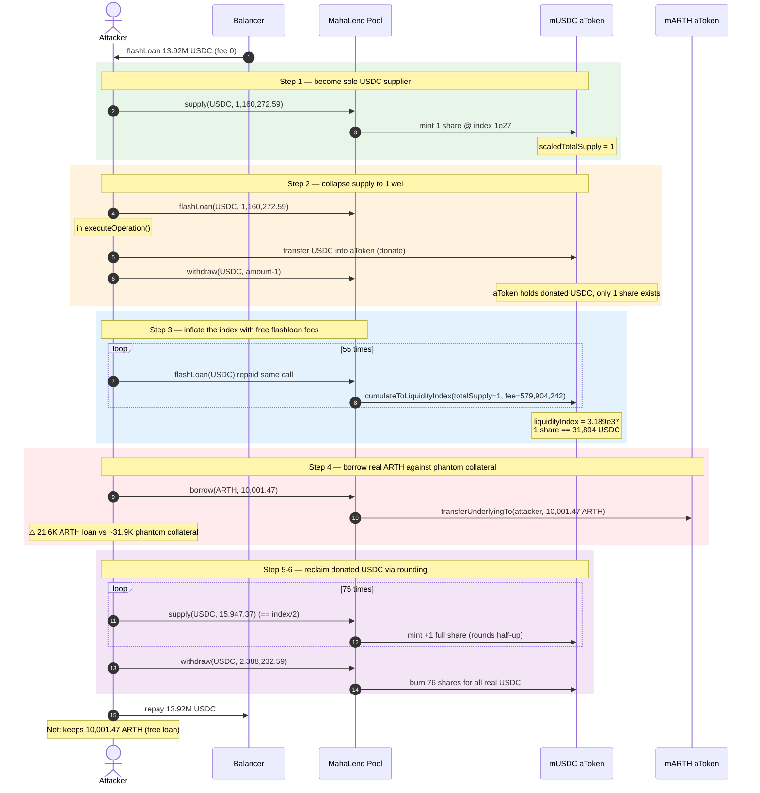
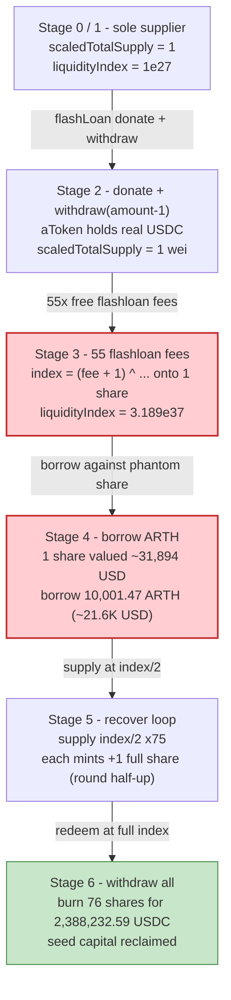
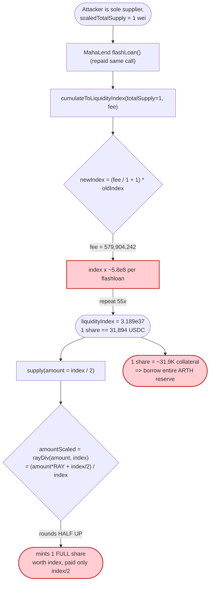
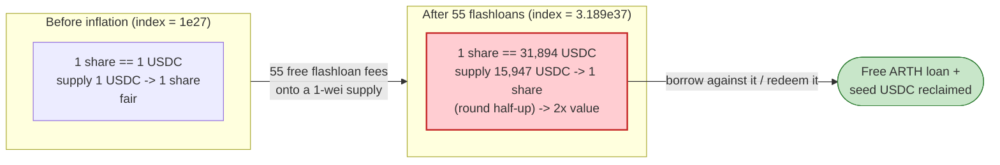

# MahaLend Exploit — Empty-Reserve Liquidity-Index Inflation + Share-Rounding Theft

> **Vulnerability classes:** vuln/arithmetic/rounding · vuln/arithmetic/precision-loss

> **Reproduction:** the PoC compiles & runs in an isolated Foundry project at
> [this project folder](.) (the umbrella DeFiHackLabs repo contains many
> unrelated PoCs that do not whole-compile, so this one was extracted).
> Full verbose trace: [output.txt](output.txt).
> Verified vulnerable sources under [sources/Pool_fd11ab/](sources/Pool_fd11ab/).

---

## Key info

| | |
|---|---|
| **Loss** | ~$20K (per the PoC's `@KeyInfo`). The attacker walked off with a free over-collateralized loan — borrowing **10,001.47 ARTH** (≈ $21.6K at the oracle price of $2.16) against fake collateral, while recovering 100% of the working capital it injected. |
| **Vulnerable contract** | MahaLend `Pool` (Aave-V3 fork) — [`0xfd11aba71c06061f446ade4eec057179f19c23c4`](https://etherscan.io/address/0xfd11aba71c06061f446ade4eec057179f19c23c4#code), proxied at [`0x76F0C94Ced5B48020bf0D7f3D0CEabC877744cB5`](https://etherscan.io/address/0x76F0C94Ced5B48020bf0D7f3D0CEabC877744cB5) |
| **Victim reserve** | `mUSDC` aToken proxy [`0x658b0f629B9e3753AA555C189D0cB19C1eD59632`](https://etherscan.io/address/0x658b0f629B9e3753AA555C189D0cB19C1eD59632) (impl `0xac3418ce48dbd35fe213dcfdfb70f044a47f9b0f`); drained reserve = **USDC** [`0xA0b86991c6218b36c1d19D4a2e9Eb0cE3606eB48`](https://etherscan.io/address/0xA0b86991c6218b36c1d19D4a2e9Eb0cE3606eB48); borrowed asset = **ARTH** [`0x8CC0F052fff7eaD7f2EdCCcaC895502E884a8a71`](https://etherscan.io/address/0x8CC0F052fff7eaD7f2EdCCcaC895502E884a8a71) (mARTH aToken `0xE6B683868D1C168Da88cfe5081E34d9D80E4D1a6`) |
| **Attacker EOA** | [`0x0ec330df28ae6106a774d0add3e540ea8d226e3b`](https://etherscan.io/address/0x0ec330df28ae6106a774d0add3e540ea8d226e3b) |
| **Attacker contract** | [`0xf5836e292f716a7979f9bc5c2d3ed59913e07962`](https://etherscan.io/address/0xf5836e292f716a7979f9bc5c2d3ed59913e07962) |
| **Attack tx** | [`0x2881e839d4d562fad5356183e4f6a9d427ba6f475614ce8ef64dbfe557a4a2cc`](https://etherscan.io/tx/0x2881e839d4d562fad5356183e4f6a9d427ba6f475614ce8ef64dbfe557a4a2cc) |
| **Chain / block / date** | Ethereum mainnet / fork block 18,544,604 / **2023-11-10** |
| **Compiler** | Solidity **v0.8.10+commit.fc410830**, optimizer enabled, 25,000 runs |
| **Bug class** | Empty-market share-inflation (rounding) — liquidity-index manipulation on a freshly-listed reserve via repeated flashloan-fee donation |

---

## TL;DR

MahaLend is a verbatim Aave-V3 fork. Aave's per-reserve accounting tracks a
`liquidityIndex` (a RAY-scaled 1.0-based exchange rate from *scaled* aToken
shares to underlying). A flashloan's LP fee is folded into that index by
[`cumulateToLiquidityIndex`](sources/Pool_fd11ab/mahalend_core-v3_contracts_protocol_libraries_logic_ReserveLogic.sol#L113-L125):

```
newIndex = (fee / totalLiquidity + 1) * oldIndex
```

When `totalLiquidity` (the aToken scaled total supply) is **1 wei**, a flashloan
fee of `f` multiplies the index by `(f + 1)`. So a single flashloan whose
LP-fee is `579,904,242` (≈ $580) inflates the index from `1e27` to
**`5.799e35`** — a `5.8e8×` blow-up — and 55 repeated flashloans push it to
**`3.189e37`** (one *share* is now worth `31,894,733,256` USDC-units ≈ $31,894).

Because Aave mints scaled shares as `amountScaled = amount.rayDiv(index)` and
`rayDiv` **rounds half-up**, supplying `index/2` underlying mints a *whole* share
that is immediately worth `index` underlying — i.e. you pay ~50% of a share's
value and receive a full share. The attacker:

1. Flash-borrows USDC from Balancer, supplies $1.16M to the USDC reserve, then
   inside the *MahaLend* flashloan callback **donates the underlying back into
   the aToken and withdraws all but 1 wei of scaled supply** — collapsing
   `aToken.scaledTotalSupply()` to **1**.
2. Runs **55 zero-net-cost MahaLend flashloans**; each one's LP fee is
   cumulated onto a 1-share base, inflating `liquidityIndex` to `3.189e37`.
3. **Borrows** the entire ARTH reserve (10,001.47 ARTH) — the 1 inflated share
   is valued as ~$31.9K of collateral, easily covering the ~$21.6K ARTH loan.
4. **Recovers** the donated USDC: supplies `index/2` (`15,947,366,656`) 75 times,
   each call minting exactly **+1 share** via the rounding error, then
   `withdraw`s the full aToken balance (**$2,388,232.59**), netting back all the
   injected capital plus the stolen ARTH.

The flaw is the classic Aave "empty-market / first-depositor" inflation, made
*cheap and deterministic* here because flashloan fees are a free, repeatable way
to grow the index on a 1-share reserve and the aToken share-mint rounds in the
attacker's favor.

---

## Background — Aave-V3 scaled-balance accounting

In Aave V3 (and this MahaLend fork), an aToken does not store raw balances. It
stores **scaled** balances and a per-reserve `liquidityIndex` (RAY = `1e27`,
representing 1.0). The real balance is `scaledBalance.rayMul(liquidityIndex)`,
and minting is the inverse `amountScaled = amount.rayDiv(index)`.

`liquidityIndex` only ever grows. It grows from accrued interest, and — crucially
here — from **flashloan fees**, which are distributed to suppliers by bumping the
index. The bump is computed in
[`ReserveLogic.cumulateToLiquidityIndex`](sources/Pool_fd11ab/mahalend_core-v3_contracts_protocol_libraries_logic_ReserveLogic.sol#L113-L125):

```solidity
function cumulateToLiquidityIndex(
  DataTypes.ReserveData storage reserve,
  uint256 totalLiquidity,
  uint256 amount
) internal returns (uint256) {
  //next liquidity index is calculated this way: `((amount / totalLiquidity) + 1) * liquidityIndex`
  uint256 result = (amount.wadToRay().rayDiv(totalLiquidity.wadToRay()) + WadRayMath.RAY).rayMul(
    reserve.liquidityIndex
  );
  reserve.liquidityIndex = result.toUint128();
  return result;
}
```

`totalLiquidity` is passed as `IERC20(aToken).totalSupply()` — the *current*
(scaled-then-unscaled) supply. On a fresh reserve this can be driven to **1 wei**,
at which point `amount / totalLiquidity ≈ amount`, so the index multiplies by
roughly `(fee + 1)` per flashloan.

On-chain reserve facts at the fork block (from the trace):

| Parameter | Value |
|---|---|
| USDC reserve `liquidityIndex` (start) | `1e27` (freshly listed; no prior activity) |
| USDC aToken `scaledTotalSupply` (start) | `0` |
| `reserveFactor` (USDC) | 1000 bps = 10% |
| Flashloan premium total | 0.05% (`amount * 5 / 10000`) |
| Flashloan premium to protocol | 0.04% of the premium |
| Balancer flashloan size | `13,923,271,097,322` USDC = **$13,923,271.10** (the entire Balancer USDC float, used only as free working capital — Balancer fee = 0%) |
| ARTH reserve liquidity (mARTH balance) | `10,001.466755...` ARTH |
| ARTH oracle price | `216,490,194` (8-dec USD) = **$2.1649** |

---

## The vulnerable code

### 1. Flashloan fee is cumulated onto whatever `totalSupply()` happens to be

[`FlashLoanLogic._handleFlashLoanRepayment`](sources/Pool_fd11ab/mahalend_core-v3_contracts_protocol_libraries_logic_FlashLoanLogic.sol#L223-L261):

```solidity
uint256 premiumToProtocol = params.totalPremium.percentMul(params.flashLoanPremiumToProtocol);
uint256 premiumToLP = params.totalPremium - premiumToProtocol;          // 0.05% - 0.04%·0.05%

DataTypes.ReserveCache memory reserveCache = reserve.cache();
reserve.updateState(reserveCache);
reserveCache.nextLiquidityIndex = reserve.cumulateToLiquidityIndex(
  IERC20(reserveCache.aTokenAddress).totalSupply(),   // ⚠️ == 1 after the attacker's setup
  premiumToLP                                          // ⚠️ free, repeatable index growth
);
```

There is **no minimum-liquidity / dead-shares floor** and **no guard against a
near-zero `totalSupply`**. A flashloan with `premiumToLP = 579,904,242` and
`totalSupply = 1` makes the index jump by `~5.799e8×`.

### 2. Share minting rounds half-up in the supplier's favor

[`SupplyLogic.executeSupply`](sources/Pool_fd11ab/mahalend_core-v3_contracts_protocol_libraries_logic_SupplyLogic.sol#L69-L74) mints:

```solidity
IAToken(reserveCache.aTokenAddress).mint(
  msg.sender, params.onBehalfOf, params.amount, reserveCache.nextLiquidityIndex
);
```

The aToken's `_mintScaled` computes `amountScaled = amount.rayDiv(index)`. From
[`WadRayMath.rayDiv`](sources/Pool_fd11ab/mahalend_core-v3_contracts_protocol_libraries_math_WadRayMath.sol#L83-L92):

```solidity
c := div(add(mul(a, RAY), div(b, 2)), b)   // (a·RAY + index/2) / index  — ROUNDS HALF UP
```

So when `amount = index/2` (here `15,947,366,656` ≈ `3.189e37 / 1e27 / 2`),
`amountScaled` rounds up to **1** whole share — a share worth a full `index`
(`31,894,733,256` USDC-units). The attacker pays half, gets one. The trace shows
exactly this: every `supply(USDC, 15947366656)` increments
`aToken.scaledTotalSupply` by 1 (storage slot `@54`: `1→2→3→…→76`) while
`Mint(value: 15947366656)`.

### 3. Withdraw redeems shares at full index

[`SupplyLogic.executeWithdraw`](sources/Pool_fd11ab/mahalend_core-v3_contracts_protocol_libraries_logic_SupplyLogic.sol#L117-L136) values the
attacker's balance as `scaledBalanceOf.rayMul(nextLiquidityIndex)` and burns it
for that much underlying — so 76 cheaply-minted shares redeem for the entire
real USDC sitting in the aToken.

---

## Root cause — why it was possible

The composition of three Aave-fork properties on a **freshly listed, near-empty
reserve**:

1. **Index growth is divided by `totalSupply` with no floor.** On an empty
   reserve the attacker can set `totalSupply` to 1 wei (donate underlying in, then
   `withdraw(amount-1)`), turning each flashloan fee into a multiplicative index
   explosion. This is the canonical Aave "donation / first-depositor inflation",
   but flashloan fees make the donation **free and repeatable** rather than a
   one-shot griefing of the next depositor.
2. **Flashloan fees are a permissionless, zero-net-cost index lever.** The
   attacker takes a MahaLend flashloan and repays it in the same call; the only
   cost is the LP fee, which it pays *to itself* (it owns the single share). 55
   iterations cost nothing net but compound the index to `3.189e37`.
3. **Share mint rounds half-up.** `rayDiv` rounding means supplying `index/2`
   mints a whole `index`-worth share. With the index inflated to `3.189e37`,
   one share is worth ~$31.9K, so a single share is enough collateral to borrow
   the entire ARTH reserve; and the recovery-supply loop reclaims donated USDC at
   a 2:1 mint ratio.

In short: an attacker who is the *sole* supplier of a near-empty reserve can use
flashloan fees to mint themselves an arbitrarily-valuable share for half price,
then borrow real assets against it.

---

## Preconditions

- A MahaLend reserve (USDC here) that is **fresh / near-empty** so the attacker
  can become the sole supplier and drive `aToken.scaledTotalSupply()` to 1 wei.
- Flashloans enabled on that reserve with a non-zero LP fee (0.05% here).
- A *borrowable* reserve with real liquidity to extract (ARTH, with ~10,001 ARTH
  in mARTH).
- Working capital to (a) seed the donation and (b) pay the recurring flashloan
  fees. All of it is recovered intra-transaction, so the attack is **fully
  flash-loanable** — the PoC sources the headroom from a single Balancer USDC
  flashloan (fee 0%).

---

## Attack walkthrough (with on-chain numbers from the trace)

All figures are taken from `Mint`/`Burn`/`ReserveDataUpdated` events in
[output.txt](output.txt). The driver is the attacker contract's
[`receiveFlashLoan`](test/MahaLend_exp.sol#L50-L80) /
[`executeOperation`](test/MahaLend_exp.sol#L82-L96) /
[`recoverDonatedFund`](test/MahaLend_exp.sol#L98-L116).

| # | Step | USDC `scaledTotalSupply` | USDC `liquidityIndex` | Effect |
|---|------|-------------------------:|----------------------:|--------|
| 0 | **Balancer flashloan** of `13,923,271,097,322` USDC ($13.92M) as free capital | 0 | `1e27` | Working capital acquired (Balancer fee = 0). |
| 1 | **Supply** `1,160,272,591,443` USDC ($1.16M); mints 1 share at index `1e27` | 1 | `1e27` | Attacker becomes sole USDC supplier; `scaledTotalSupply = 1`. |
| 2 | **MahaLend `flashLoan`** of `1,160,272,591,443` USDC; inside `executeOperation`: **transfer the loaned USDC into the aToken** + `withdraw(amount-1)` | **1** | `1e27` | aToken holds the donated underlying but only **1** scaled share exists (the donation is "owned" by that lone share). |
| 3a | Repay flashloan #1 → `_handleFlashLoanRepayment` cumulates `premiumToLP = 579,904,242` onto `totalSupply = 1` | 1 | **`5.799e35`** | `(580e6/1 + 1)·1e27` — index explodes `~5.8e8×`. |
| 3b | **54 more MahaLend flashloans**, each adding `≈579,904,242` to a 1-share base | 1 | grows linearly: `1.159e36`, `1.739e36`, … | Each fee adds `≈5.799e35` to the index. |
| 3c | After 55 flashloans total | 1 | **`31,894,733,256e27` = `3.189e37`** | One share now worth `31,894,733,256` USDC-units ≈ **$31,894**. |
| 4 | **Borrow** `10,001,466,755,107,579,871,763` ARTH (10,001.47 ARTH) mode=2 | 1 | `3.189e37` | Collateral check passes: 1 share ≈ $31.9K vs ARTH debt ≈ $21.6K. Real ARTH leaves mARTH to attacker. |
| 5 | **`recoverDonatedFund`**: `supply(15,947,366,656)` ×75 — each mints exactly **+1** share via half-up rounding | 1→76 | `3.189e37` | Attacker reclaims donated USDC at a **2:1** value ratio (pays index/2, mints a full index-worth share). |
| 6 | **`withdraw(2,388,232,586,924)`** — burn all 76 shares for the aToken's real USDC | 76→1 | `3.189e37` | Pulls **$2,388,232.59** USDC back out. |
| 7 | Repay Balancer flashloan `13,923,271,097,322` USDC | — | — | All injected capital returned; attacker keeps the 10,001.47 ARTH. |

### Why "supply `index/2` mints a whole share"

`amountScaled = (amount·RAY + index/2) / index`. With `index = 3.189e37` and
`amount = 15,947,366,656`:

- `amount·RAY = 15,947,366,656 · 1e27 ≈ 1.5947e37`
- `+ index/2 ≈ 1.5947e37` → numerator `≈ 3.189e37 ≈ index`
- `/ index = 1` (rounds up from just under 1).

So each `supply` of ≈`index/2` underlying yields one full scaled share — the
attacker recovers ~2 USDC of redeemable value for every 1 USDC supplied, which is
how the donated $1.16M is reclaimed (and more — withdrawing $2.388M).

### Profit accounting

| Flow | Amount (USDC unless noted) |
|---|---:|
| Balancer flashloan in (free capital) | +13,923,271.10 |
| Supply #1 (becomes the lone share's backing) | −1,160,272.59 |
| 55 MahaLend flashloan LP fees (paid to self) | net ≈ 0 |
| `recoverDonatedFund` supplies (75 × $15,947.37) | −1,196,052.50 |
| Final `withdraw` | +2,388,232.59 |
| Repay Balancer | −13,923,271.10 |
| **Net USDC** | ≈ **0** (recovered) |
| **Net ARTH stolen** | **+10,001.47 ARTH ≈ $21.6K** |

The USDC side nets out (the whole point of `recoverDonatedFund` is to claw back
the seed capital), and the realized profit is the **free, un-repaid ARTH loan**
collateralized by a phantom share. End-state attacker ARTH balance =
`10,001.466755107579871763` (trace tail).

---

## Diagrams

### Sequence of the attack



### Reserve state evolution



### The flaw inside the index / share math



### Cost vs. value of one share, before vs. after inflation



---

## Why each magic number

- **Supply #1 = `1,160,272,591,443` USDC ($1.16M):** chosen so the LP fee per
  flashloan (`amount·0.05% − 0.04%·that = 579,904,242`) lands on a clean index
  step. The PoC computes the exact per-flashloan index increment
  `nextLiquidityIndex = premiumToLP·55 + 1 = 31,894,733,311` to derive the
  recovery supply size.
- **`supplyAmount = 15,947,366,656` (= `nextLiquidityIndex/2 + 1`):** the minimum
  underlying that rounds up to exactly **+1** scaled share at the inflated index.
  Comment in [recoverDonatedFund](test/MahaLend_exp.sol#L102): *"Use a rounding
  error greater than 0.5 for upward rounding."*
- **55 flashloans:** enough index growth that one share's value (~$31.9K) exceeds
  the value of the entire ARTH reserve to be borrowed (~$21.6K) after LTV.
- **Donate + `withdraw(amount-1)`:** the one move that sets
  `aToken.scaledTotalSupply()` to **1 wei**, the denominator that makes the index
  explode.

---

## Remediation

1. **Adopt Aave's empty-market mitigation (virtual / "dead" shares + minimum
   liquidity).** Later Aave versions and audited forks seed a permanent
   non-withdrawable minimum supply (or treat `totalSupply` with a virtual offset)
   so the index denominator can never approach 1 wei. This is the direct fix.
2. **Reject index cumulation when `totalSupply` is below a floor.** In
   `cumulateToLiquidityIndex`, require `totalLiquidity >= MIN_LIQUIDITY` (or skip
   the bump and route the fee to the treasury) so a near-empty reserve cannot be
   weaponized.
3. **Round share mints *down* and redemptions conservatively.** `rayDiv`'s
   half-up rounding hands the attacker a free fractional share. Mint
   `amountScaled = amount.rayDiv(index)` with floor (round-down) semantics so a
   supplier can never receive more value than they deposit.
4. **Bootstrap reserves before enabling borrowing/flashloans.** Do not allow a
   reserve to be listed-and-borrowable with zero genuine liquidity; require the
   listing transaction to seed (and lock) a minimum supply.
5. **Cap per-operation index growth.** A single flashloan multiplying the index
   by `~5.8e8×` is a glaring anomaly; bound the per-call index delta to a small
   percentage and revert otherwise.

---

## How to reproduce

The PoC was extracted into a standalone Foundry project (the umbrella
DeFiHackLabs repo has many unrelated PoCs that fail to compile under `forge
test`'s whole-project build):

```bash
_shared/run_poc.sh 2023-11-MahaLend_exp --mt testExploit -vvvvv
```

- RPC: an **Ethereum archive** endpoint is required (fork block 18,544,604).
  `foundry.toml` maps `mainnet` to `https://eth.drpc.org`; any archive RPC that
  serves state at that block works.
- Result: `[PASS] testExploit()` with the attacker holding `10001.466...` ARTH.

Expected tail:

```
Ran 1 test for test/MahaLend_exp.sol:ContractTest
[PASS] testExploit() (gas: 7239882)
Logs:
  premiumPerFlashloan 579904242
  nextLiquidityIndex 31894733311
  supplyAmount 15947366656
  Attacker ARTH balance after exploit: 10001.466755107579871763

Suite result: ok. 1 passed; 0 failed; 0 skipped
```

---

*References: PhalconXYZ thread — https://twitter.com/Phalcon_xyz/status/1723223766350832071 ; vulnerable code — https://etherscan.io/address/0xfd11aba71c06061f446ade4eec057179f19c23c4#code . Same vulnerability class as Aave V3 empty-market / first-depositor share inflation.*
