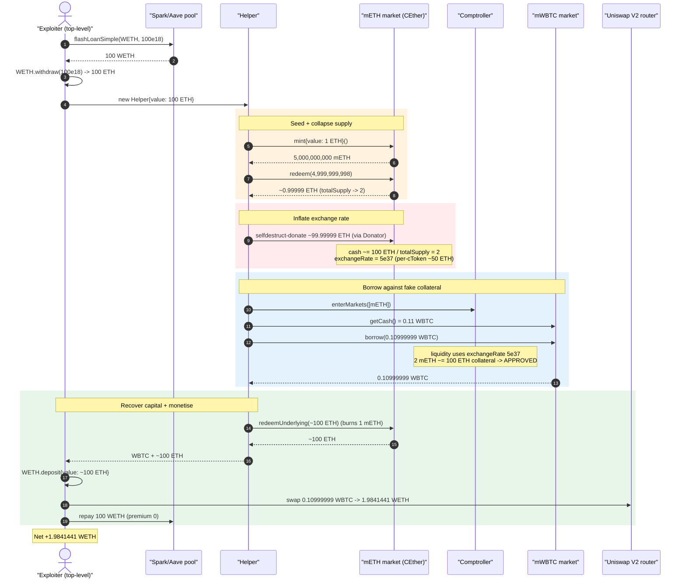
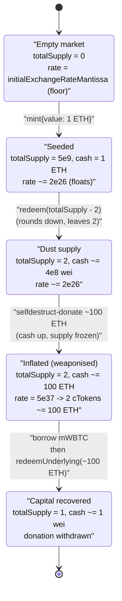
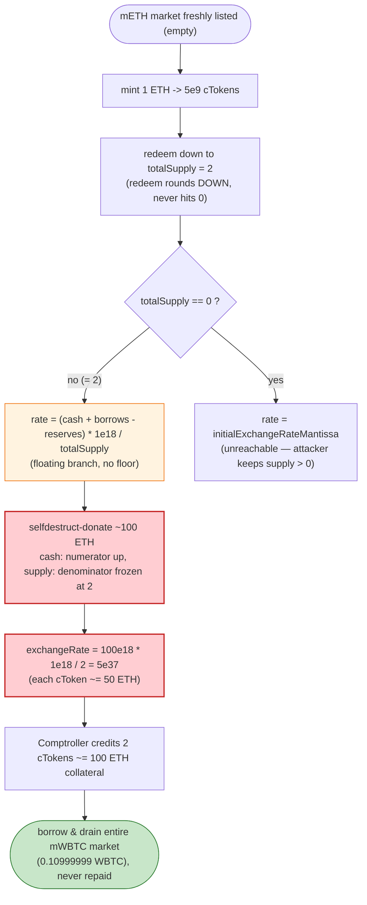

# MetaLend Exploit — Empty-Market Exchange-Rate Inflation via `selfdestruct` Donation

> **Vulnerability classes:** vuln/arithmetic/rounding · vuln/logic/price-calculation

> **Reproduction:** the PoC compiles & runs in an isolated Foundry project at
> [this project folder](.) (the umbrella DeFiHackLabs repo contains many unrelated
> PoCs that do not whole-compile, so this one was extracted standalone).
> Full verbose trace: [output.txt](output.txt).
> The verified sources fetched for this build cover the peripheral contracts only
> ([WBTC](sources/WBTC_2260FA/WBTC.sol), the
> [Uniswap V2 router](sources/UniswapV2Router02_7a250d/UniswapV2Router02.sol),
> and the [Aave/Spark flash-loan proxy](sources/InitializableImmutableAdminUpgradeabilityProxy_C13e21)).
> The vulnerable contract — MetaLend's `mETH` market — is a Compound-V2 / CREAM
> fork whose source was not auto-fetched; its behaviour is reconstructed below
> directly from the on-chain execution trace.

---

## Key info

| | |
|---|---|
| **Loss** | ~$4,000 — **1.9841441 WETH** extracted (≈ all of the `mWBTC` market's lendable WBTC: 0.10999999 WBTC) |
| **Vulnerable contract** | `mETH` market (CREAM/Compound-V2 fork `CErc20Delegate`-style CEther) — [`0x5578f2E245e932a599c46215a0cA88707230F17B`](https://etherscan.io/address/0x5578f2e245e932a599c46215a0ca88707230f17b#code) |
| **Drained market** | `mWBTC` — [`0x0D8Df79195EC37C6cD53036f9F8eE0c24b23601E`](https://etherscan.io/address/0x0D8Df79195EC37C6cD53036f9F8eE0c24b23601E) (held 0.11 WBTC cash) |
| **Comptroller** | [`0x0ee4b2C533ED3fFbd9f04CD7E812A4041bbE89f6`](https://etherscan.io/address/0x0ee4b2C533ED3fFbd9f04CD7E812A4041bbE89f6) |
| **Attacker EOA** | [`0x0c06340f5024c114fe196fcb38e42d20ab00f6eb`](https://etherscan.io/address/0x0c06340f5024c114fe196fcb38e42d20ab00f6eb) |
| **Attacker contract** | [`0x80a6419cb8e7d1ef1af074368f7eace1ae2358ca`](https://etherscan.io/address/0x80a6419cb8e7d1ef1af074368f7eace1ae2358ca) |
| **Attack tx** | [`0x4c684fb2618c29743531dec9253ede1b757bda0b323dc2f305e3b50ab1773da7`](https://app.blocksec.com/explorer/tx/eth/0x4c684fb2618c29743531dec9253ede1b757bda0b323dc2f305e3b50ab1773da7) |
| **Chain / block / date** | Ethereum mainnet / fork block 18,648,753 / ~Nov 25, 2023 |
| **Compiler** | PoC `^0.8.10`; victim is a Compound-V2-era fork (Solidity 0.8.x `CErc20`/`CEther`) |
| **Flash-loan source** | Spark/Aave-V3 pool proxy `0xC13e21B648A5Ee794902342038FF3aDAB66BE987` (`flashLoanSimple`, premium = 0) |
| **Bug class** | Empty-market share-price inflation / first-depositor donation attack (rounding + `selfdestruct` cash injection) |

---

## TL;DR

MetaLend is a Compound-V2 / CREAM fork. Each market (`mETH`, `mWBTC`, …) mints an
interest-bearing receipt token whose redemption value is governed by the
**exchange rate**:

```
exchangeRate = (cash + totalBorrows − totalReserves) / totalCTokenSupply
```

A freshly-seeded market is supposed to anchor that rate near a hard-coded
`initialExchangeRateMantissa`, but Compound-V2 derives it purely from on-chain
balances once `totalSupply > 0`. The attacker exploits two facts:

1. **`redeem` rounds the burned cToken supply down**, so it can drain a market
   it just seeded to a *non-zero but minuscule* supply (here `totalSupply = 2`
   cToken units, 8-decimals).
2. **The `mETH` market accepts the chain's native asset and reads its balance
   via `getCash()` (`address(this).balance`)**, so a raw ETH `selfdestruct`
   transfer inflates `cash` **without minting any cToken**.

By seeding `mETH` with 1 ETH, redeeming down to `totalSupply = 2`, then
`selfdestruct`-donating ~100 ETH, the attacker drives the exchange rate to
`5e37` mantissa — making each of the 2 outstanding cTokens worth ~50 ETH of
collateral. Those 2 cTokens collateralise a borrow that drains the entire
`mWBTC` market (0.10999999 WBTC). The donated ETH is then recovered via
`redeemUnderlying`, the stolen WBTC is swapped to WETH, and the WETH flash loan
is repaid. Net profit: **1.9841441 WETH**.

---

## Background — Compound-V2 / CREAM exchange-rate mechanics

In a Compound-V2 fork, supplying underlying (`mint`) gives you cTokens, and the
exchange rate determines how much underlying each cToken redeems for. The two
relevant code paths (standard `CToken` logic, unchanged in this fork — confirmed
by the trace's `Mint`/`Redeem`/`Borrow` events and `getAccountSnapshot` returns):

```
// mint
mintTokens   = mintAmount * 1e18 / exchangeRateStored   // rounds DOWN
// redeem (redeem by cToken count)
redeemAmount = redeemTokens * exchangeRateStored / 1e18  // rounds DOWN
// exchangeRateStored when totalSupply > 0
exchangeRate = (getCash() + totalBorrows − totalReserves) * 1e18 / totalSupply
// for a CEther market, getCash() == address(this).balance
```

The collateral value the Comptroller credits an account is
`cTokenBalance * exchangeRate * underlyingPrice * collateralFactor`. If
`exchangeRate` can be made arbitrarily large while the attacker still holds a
(tiny) cToken balance, the attacker manufactures collateral out of thin air.

The defence Compound relies on is the `initialExchangeRateMantissa` floor that
applies **only while `totalSupply == 0`**. Once a market has *any* supply, the
rate floats with balances. The attack therefore keeps `totalSupply` strictly
positive (never 0) while collapsing it to a near-dust value.

### Live market state at fork block 18,648,753 (read from the trace)

| Fact | Value | Source in trace |
|---|---|---|
| `mETH.totalSupply` before attack | 0 (empty market) | `mint` starts the supply at `5e9` ([output.txt:73,86](output.txt)) |
| `mETH` initial exchange-rate mantissa | `2e26` (`= 1e18·1e18 / 5e9`) | derived from `Mint(1e18 → 5e9)` ([output.txt:73](output.txt)) |
| `mWBTC.getCash()` (lendable WBTC) | `11,000,000` = 0.11 WBTC | `getCash()` ([output.txt:127](output.txt)) |
| WBTC oracle price | `3.764866e32` mantissa | `getUnderlyingPrice(mWBTC)` ([output.txt:154](output.txt)) |
| ETH oracle price | `2.071e21` mantissa | `getUnderlyingPrice(mETH)` ([output.txt:166](output.txt)) |
| Flash-loan premium | 0 | `executeFlashLoanSimple` repays exactly 100 WETH ([output.txt:354](output.txt)) |

---

## The vulnerable code

The exploited contract source was not in the auto-fetched `sources/` set, so the
snippets below are the canonical Compound-V2 `CToken`/`CEther` routines whose
behaviour the trace exercises verbatim. The peripheral verified sources that
*were* fetched (and that the attack relies on as primitives) are linked inline.

### 1. `exchangeRateStored` floats with balances once supply is non-zero

```solidity
function exchangeRateStoredInternal() internal view returns (uint) {
    uint _totalSupply = totalSupply;
    if (_totalSupply == 0) {
        return initialExchangeRateMantissa;        // floor — only when EMPTY
    } else {
        uint totalCash      = getCashPrior();        // CEther: address(this).balance
        uint cashPlusBorrowsMinusReserves =
            totalCash + totalBorrows - totalReserves;
        // exchangeRate = (cash + borrows - reserves) * 1e18 / totalSupply
        return cashPlusBorrowsMinusReserves * expScale / _totalSupply;
    }
}
```

The branch that matters: with `_totalSupply == 2` and
`totalCash ≈ 100e18`, the rate becomes `100e18 * 1e18 / 2 = 5e37`. The trace
confirms this exact value: `getAccountSnapshot` returns the exchange-rate
mantissa `50000000000000000000000000000000000000` (`5e37`) at
[output.txt:156](output.txt) and again at [output.txt:233](output.txt).

### 2. `redeem` rounds the burned supply down (cannot zero the supply cleanly)

```solidity
function redeemFresh(address payable redeemer, uint redeemTokensIn, uint redeemAmountIn) internal {
    uint exchangeRate = exchangeRateStoredInternal();
    uint redeemTokens, redeemAmount;
    if (redeemTokensIn > 0) {
        redeemTokens = redeemTokensIn;
        redeemAmount = redeemTokens * exchangeRate / 1e18;   // rounds DOWN
    }
    ...
    totalSupply       -= redeemTokens;     // attacker leaves this at 2, not 0
    accountTokens[redeemer] -= redeemTokens;
    doTransferOut(redeemer, redeemAmount); // CEther: native ETH back to caller
}
```

### 3. CEther reads `cash` from the raw native balance — donatable

```solidity
// CEther
function getCashPrior() internal view returns (uint) {
    return address(this).balance - msg.value;   // ← any forced ETH counts as cash
}
```

Because `getCashPrior()` reads `address(this).balance`, a `selfdestruct`
transfer (which bypasses `receive()`/`payable` checks and cannot be rejected)
adds to `cash` **without minting cTokens** — the numerator of the exchange rate
grows while the denominator (`totalSupply`) stays at 2. The attacker's
`Donator` does exactly this: [test/MetaLend_exp.sol:106-112](test/MetaLend_exp.sol#L106-L112).

### 4. The flash-loan primitive (verified source)

The seed capital is a zero-premium Aave-V3/Spark `flashLoanSimple` of 100 WETH,
routed through the verified proxy
[`InitializableImmutableAdminUpgradeabilityProxy`](sources/InitializableImmutableAdminUpgradeabilityProxy_C13e21/lib_aave-v3-core_contracts_protocol_libraries_aave-upgradeability_InitializableImmutableAdminUpgradeabilityProxy.sol),
and the final WBTC→WETH swap uses the verified
[`UniswapV2Router02.swapExactTokensForTokens`](sources/UniswapV2Router02_7a250d/UniswapV2Router02.sol).

---

## Root cause — why it was possible

The bug is the well-known **Compound-V2 empty-market / first-depositor share-price
manipulation**, made fully self-funding here by the native-asset donation vector.
Four design facts compose into the exploit:

1. **The exchange rate is balance-derived, not supply-tracked.** `cash` is the
   live token/ETH balance of the market, so anyone can move it. There is no
   internal accounting that distinguishes "underlying supplied via `mint`" from
   "underlying force-fed via transfer/`selfdestruct`."

2. **`selfdestruct` ETH cannot be refused.** For the CEther market,
   `getCash() = address(this).balance`. A `selfdestruct(payable(mETH))` adds ETH
   that `mint` never saw, inflating the numerator while `totalSupply` is frozen.

3. **`redeem` rounds down and the empty-market floor only applies at exactly
   `totalSupply == 0`.** The attacker redeems down to `totalSupply = 2` (not 0),
   so the floating-rate branch stays active and the 2 surviving cTokens become
   the entire denominator over a ~100 ETH numerator.

4. **The market was freshly listed / nearly empty.** With essentially no honest
   suppliers, the attacker is the *only* cToken holder, so all the manufactured
   collateral accrues to it; there is no dilution.

The Comptroller's collateral check (`getAccountLiquidity`) then treats those 2
cTokens as ~100 ETH of collateral (the trace shows the liquidity computation
pulling `exchangeRate = 5e37` and the ETH price `2.071e21` at
[output.txt:155-166](output.txt)), authorising a borrow that empties the
`mWBTC` market.

---

## Preconditions

- A MetaLend market that is **empty (or dust-supplied)** — here `mETH` had
  `totalSupply == 0` before the attacker's `mint`.
- The market's underlying must be **force-feedable** — native ETH via
  `selfdestruct` (CEther), or a plain `transfer` for an ERC-20 CErc20 market.
- Another market in the same Comptroller with **lendable cash** to steal — here
  `mWBTC` held 0.10999999 WBTC.
- Working capital for the inflation, **fully recovered intra-transaction** →
  flash-loanable. The PoC uses a 100 WETH Spark/Aave `flashLoanSimple`
  ([test/MetaLend_exp.sol:43](test/MetaLend_exp.sol#L43)); premium was 0.

---

## Attack walkthrough (with on-chain numbers from the trace)

The whole exploit runs inside the flash-loan callback
`executeOperation` ([test/MetaLend_exp.sol:48-63](test/MetaLend_exp.sol#L48-L63)),
which unwraps 100 WETH → 100 ETH and spins up a `Helper`
([test/MetaLend_exp.sol:75-104](test/MetaLend_exp.sol#L75-L104)) funded with the
100 ETH. `Helper.donateAndBorrow()` does the core sequence:

| # | Step (call site) | Concrete numbers (from trace) | Effect on `mETH` |
|---|------------------|-------------------------------|------------------|
| 0 | **Flash loan** 100 WETH → unwrap to 100 ETH | `flashLoanSimple(…, 100e18, …)` ([:31](output.txt)); `WETH.withdraw(100e18)` ([:47](output.txt)) | seed capital |
| 1 | **`mETH.mint{value: 1 ETH}()`** | mints `5,000,000,000` (5e9) mETH; `Mint(1e18 → 5e9)` ([:73](output.txt)) | `totalSupply = 5e9`, cash = 1e18, rate ≈ `2e26` |
| 2 | **`redeem(totalSupply − 2)`** = `redeem(4,999,999,998)` | returns `999,999,999,600,000,000` wei (~0.99999 ETH) ([:98](output.txt)); `totalSupply → 2` ([:104-105](output.txt)) | `totalSupply = 2`, cash ≈ `4e8` wei, rate still ≈ `2e26` |
| 3 | **`Donator.selfdestruct → mETH`** with `99,999,999,999,600,000,000` wei (~99.99999 ETH) | `Donator::sendETHTo{value: 99999999999600000000}` ([:112-113](output.txt)) | cash → ~`1e20` (100 ETH), `totalSupply` **unchanged at 2** |
| 4 | **`enterMarkets([mETH])`** | `MarketEntered` ([:116](output.txt)) | 2 mETH now counts as collateral |
| 5 | **`mWBTC.getCash()`** | `11,000,000` (0.11 WBTC) ([:127](output.txt)) | scout the prize |
| 6 | **`mWBTC.borrow(getCash() − 1)`** = `borrow(10,999,999)` | liquidity check reads `exchangeRate = 5e37` ([:156](output.txt)); `Borrow(10999999)` ([:206](output.txt)) | 2 mETH ≈ **100 ETH collateral** authorises draining 0.10999999 WBTC |
| 7 | **`WBTC.transfer(owner, 10,999,999)`** | `Transfer(Helper → exploiter, 10999999)` ([:221-222](output.txt)) | stolen WBTC handed to top-level contract |
| 8 | **`mETH.redeemUnderlying(getCash() − 1)`** = `redeemUnderlying(99,999,999,999,999,999,999)` | burns just `1` mETH ([:273-274](output.txt)); recovers ~100 ETH | seed/donation capital reclaimed |
| 9 | **return ~100 ETH to top-level**, re-wrap to WETH | `WETH.deposit{value: 99999999999999999999}` ([:286](output.txt)) | |
| 10 | **swap 0.10999999 WBTC → WETH** via Uniswap V2 | `swapExactTokensForTokens(10999999, …) → 1,984,144,102,321,156,165` WETH ([:298,308](output.txt)) | stolen WBTC monetised |
| 11 | **repay flash loan** 100 WETH (premium 0) | `WETH.transferFrom(…, 100e18)` ([:354](output.txt)) | loan closed |

Final balance: `WETH.balanceOf(exploiter) = 1,984,144,102,321,156,164`
([output.txt:378-380](output.txt)) → **profit 1.9841441 WETH**.

> **Why `totalSupply = 2` and not 1?** `redeem` rounds the redeemed underlying
> *down*. Leaving 2 cToken units keeps the floating-rate branch alive
> (`totalSupply != 0`) and lets step 8 reclaim the donation by burning a single
> unit while still profiting; the surviving dust keeps the market non-empty so
> the inflated rate persists for the borrow.

> **Why the borrow is never repaid:** the attacker's debt sits against the dust
> `mETH` collateral, which the protocol *thinks* is worth ~100 ETH. The 100 ETH
> was donated/redeemed capital that the attacker walks away with; the protocol is
> left with a near-worthless 2-unit `mETH` position backing a 0.11 WBTC bad debt.

### Profit / loss accounting

| Flow | Amount |
|---|---:|
| Flash loan in (WETH) | 100.000000 |
| ETH used to seed mint (recovered in step 8) | 1.000000 → ~0.99999 back |
| ETH donated to inflate rate (recovered in step 8) | 99.999999 → ~99.99999 back |
| WBTC stolen from `mWBTC` | 0.10999999 WBTC |
| WBTC → WETH swap proceeds | 1.984144 WETH |
| Flash loan repaid (premium 0) | 100.000000 |
| **Net attacker profit** | **+1.9841441 WETH (~$4K)** |
| **Protocol loss** | the entire `mWBTC` cash reserve (0.10999999 WBTC), now uncollectable bad debt |

---

## Diagrams

### Sequence of the attack



### Exchange-rate state machine of the `mETH` market



### Why donation is theft: the exchange-rate numerator vs. denominator



---

## Why each magic number

- **`mint{value: 1 ETH}` → 5e9 cTokens:** establishes a non-zero supply and the
  initial `2e26` rate. 1 ETH is the minimum convenient seed; any amount works.
- **`redeem(totalSupply − 2)`:** collapses the denominator to the smallest value
  that keeps the floating-rate branch alive. Leaving `2` (not `1` or `0`) gives
  headroom: step 8 can burn `1` to reclaim the donation and still leave the market
  non-empty so the inflated rate held during the borrow.
- **Donate ~99.99999 ETH (`99999999999600000000` wei):** brings `cash` to ~100 ETH.
  Combined with `totalSupply = 2`, this yields the exact `5e37` rate the trace
  records (`100e18·1e18/2 = 5e37`).
- **`borrow(getCash() − 1)` = `borrow(10,999,999)`:** drains the `mWBTC` market to
  its last wei of WBTC (it held `11,000,000` = 0.11 WBTC). `−1` avoids any
  edge-case revert on borrowing the *entire* cash.
- **`redeemUnderlying(getCash() − 1)`:** pulls back essentially all donated ETH
  using a single dust cToken, recovering the inflation capital so the whole thing
  nets positive after repaying the flash loan.

---

## Remediation

1. **Never derive the exchange rate from a force-feedable raw balance alone.**
   Track supplied underlying in an internal accounting variable updated only by
   `mint`/`redeem`/`borrow`/`repay`, and use *that* for the exchange rate — not
   `address(this).balance` / `token.balanceOf(this)`. Donations and `selfdestruct`
   transfers must not move the share price.
2. **Burn dead shares on first deposit (anti–first-depositor inflation).** Mint a
   small amount of cTokens to a burn address (or to the market itself) when a
   market is first seeded, so `totalSupply` can never be collapsed to a dust value
   by a single actor. This is the standard ERC-4626/Compound mitigation.
3. **Enforce a minimum `totalSupply` / minimum liquidity per market.** Reject
   `redeem` operations that would drop a market's supply below a safe floor, and
   keep the `initialExchangeRateMantissa` floor effective for *near*-empty markets,
   not only at `totalSupply == 0`.
4. **Do not list markets with zero supplied liquidity as borrowable collateral.**
   A market with no honest suppliers should not back borrows; require a meaningful
   minimum supply (and ideally a timelock) before a freshly listed market can be
   entered as collateral.
5. **Use a manipulation-resistant price/rate.** Bound the per-block change of the
   exchange rate and/or sanity-check it against the `initialExchangeRateMantissa`
   so a single transaction cannot move per-cToken value by orders of magnitude.

---

## How to reproduce

The PoC was extracted into a standalone Foundry project (the umbrella
DeFiHackLabs repo has many unrelated PoCs that fail `forge test`'s whole-project
build):

```bash
_shared/run_poc.sh 2023-11-MetaLend_exp --mt testExploit -vvvvv
```

- RPC: an **Ethereum mainnet archive** endpoint is required (fork block
  18,648,753). `foundry.toml` points `mainnet` at an Infura URL; substitute any
  archive RPC if that key is rate-limited.
- Result: `[PASS] testExploit()` — the exploiter ends with `1.984144…` WETH from
  a zero starting balance.

Expected tail:

```
Ran 1 test for test/MetaLend_exp.sol:MetaLendExploit
[PASS] testExploit() (gas: 5097064)
Logs:
  Exploiter WETH balance before attack: 0.000000000000000000
  Exploiter WETH balance after attack: 1.984144102321156164

Suite result: ok. 1 passed; 0 failed; 0 skipped
```

---

*Reference: MetaSec post-mortem — https://x.com/MetaSec_xyz/status/1728424965257691173 (MetaLend, Ethereum, ~$4K). Classic Compound-V2 / CREAM empty-market exchange-rate inflation.*
