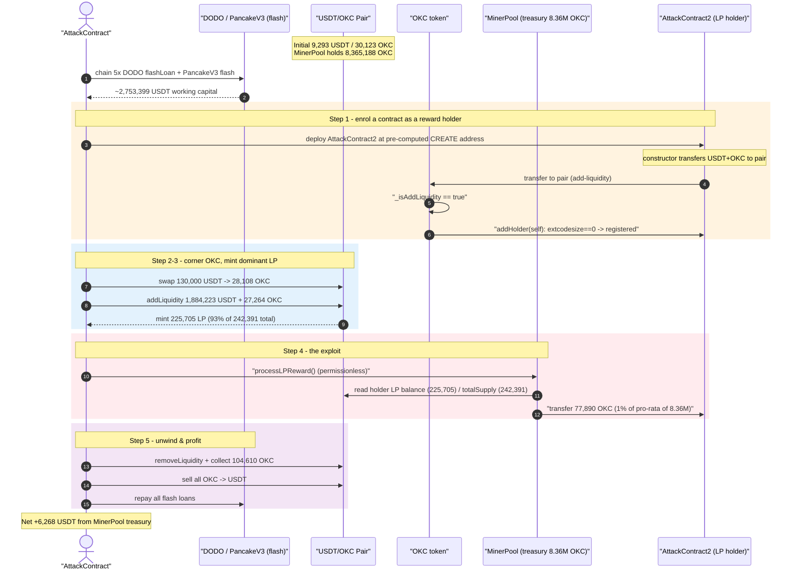
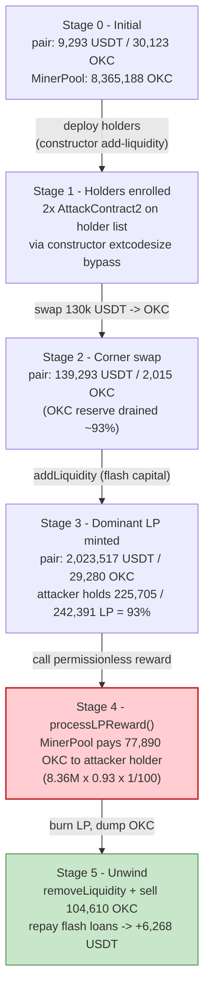
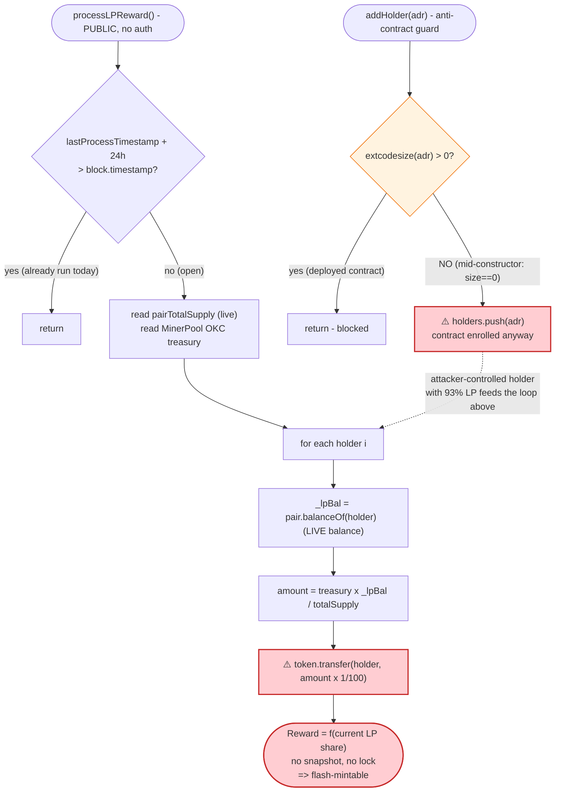

# OKC Exploit — Permissionless `processLPReward()` Pays Out on a Flash-Minted LP Position

> **Reproduction:** the PoC compiles & runs in an isolated Foundry project at
> [this project folder](.) (the umbrella DeFiHackLabs repo contains many
> unrelated PoCs that do not whole-compile, so this one was extracted).
> Full verbose trace: [output.txt](output.txt).
> Verified vulnerable source: [sources/OKC_ABba89/OKC.sol](sources/OKC_ABba89/OKC.sol).

---

## Key info

| | |
|---|---|
| **Loss** | **~6,268 USDT** profit per run, paid out of the `MinerPool`'s 8.36M-OKC reward treasury (≈ $6.3K at the time; the OKC drained was sold back into the pool) |
| **Vulnerable contract** | `OKC` / its `MinerPool` — [`0xABba891c633Fb27f8aa656EA6244dEDb15153fE0`](https://bscscan.com/address/0xABba891c633Fb27f8aa656EA6244dEDb15153fE0#code) |
| **Reward treasury (drained)** | `MinerPool` — [`0x36016C4F0E0177861E6377f73C380c70138E13EE`](https://bscscan.com/address/0x36016C4F0E0177861E6377f73C380c70138E13EE) |
| **Victim pool** | PancakeSwap V2 USDT/OKC pair — [`0x9CC7283d8F8b92654e6097acA2acB9655fD5ED96`](https://bscscan.com/address/0x9CC7283d8F8b92654e6097acA2acB9655fD5ED96) |
| **Attack tx** | [`0xd85c603f71bb84437bc69b21d785f982f7630355573566fa365dbee4cd236f08`](https://bscscan.com/tx/0xd85c603f71bb84437bc69b21d785f982f7630355573566fa365dbee4cd236f08) |
| **Chain / block / date** | BSC / 33,464,598 / Nov 14 2023 |
| **Compiler** | OKC: Solidity v0.8.5, optimizer **off** (200 runs nominal); Pair: v0.5.16 |
| **Bug class** | Instantaneous-balance reward accounting (no LP snapshot/lock) + `extcodesize`-during-construction holder-filter bypass, amplified by flash loans |

---

## TL;DR

OKC ships a "hold LP, earn OKC" yield program in its `MinerPool` contract. The payout
function [`processLPReward()`](sources/OKC_ABba89/OKC.sol#L1226-L1246) is **permissionless**
and computes each holder's reward from their **current** PancakeSwap LP balance, divided by the
pair's **current** `totalSupply`, with no snapshot, no time-lock, and no minimum-holding period:

```
amount = pairTokenBalance * _lpBal / pairTotalSupply ;  token.transfer(_addr, amount * 1 / 100);
```

So a reward share is purely a function of how much LP you hold *at the instant you call the
function*. Nothing stops an attacker from minting a massive LP position, calling
`processLPReward()` in the same transaction, then burning the LP back out.

The only guard against gaming this — `LPRewardProcessor.addHolder()` rejecting contract
addresses via `extcodesize` ([:1304-1316](sources/OKC_ABba89/OKC.sol#L1304-L1316)) — is
bypassed by registering the holder **from inside a contract's own constructor**, where
`extcodesize(self) == 0`.

The attacker, funded by a chain of DODO + PancakeV3 flash loans (~2.75M USDT):

1. **Pre-positions** USDT+OKC at two pre-computed CREATE addresses, then deploys
   `AttackContract2` at each. Each constructor pushes its tokens into the pair, which triggers
   OKC's add-liquidity hook → `addHolder(self)`. Because the contract is still under construction,
   the `extcodesize` filter sees `0` and registers it as a reward holder.
2. **Swaps** 130,000 USDT → 27,264 OKC, draining the pair's OKC reserve to ~2,015 OKC (price spikes).
3. **Mints** an LP position of **225,705 LP** — about **93% of the pair's 242,391 total LP supply**.
4. **Calls the permissionless `processLPReward()`**. The holder it controls (with 93% of LP) is
   handed `8,364,915 OKC × 225,705/242,391 × 1/100 = 77,890 OKC` out of the MinerPool treasury.
5. **Exits**: removes liquidity, collects the 77,890 OKC reward (+ a small 272 OKC referral payout),
   sells all 104,610 OKC back into the pool for USDT, and repays the flash loans.

Net result: **+6,268 USDT** profit per run, extracted from the MinerPool's reward fund.

---

## Background — what OKC's reward machinery does

[`OKC`](sources/OKC_ABba89/OKC.sol#L770-L1009) is a fee-on-transfer ERC20 with a small ecosystem of
helper contracts created in its constructor ([:795-828](sources/OKC_ABba89/OKC.sol#L795-L828)):

- **`MinerPool`** ([:1199-1272](sources/OKC_ABba89/OKC.sol#L1199-L1272)) — holds a large OKC
  treasury (8.36M OKC at the fork block) and pays an "LP reward" to liquidity providers.
- **`LPRewardProcessor`** ([:1280-1386](sources/OKC_ABba89/OKC.sol#L1280-L1386)) — maintains the
  `holders[]` array of LP providers and a separate USDT-fee distribution.

When a normal user adds liquidity, OKC's overridden `_transfer`
([:830-896](sources/OKC_ABba89/OKC.sol#L830-L896)) detects the add-liquidity transfer to the pair
and registers the sender as a reward holder:

```solidity
if (recipient == uniswapV2Pair && _isAddLiquidity(amount)) {
    lpRewardProcessor.addHolder(sender);     // ← register LP provider
    processInviterReward(sender, amount);
    super._transfer(sender, recipient, amount);
    return;
}
```

`MinerPool.processLPReward()` then walks the holder list and pays each one OKC proportional to
their LP balance. The intent is a passive "hold LP, earn OKC daily" incentive.

The on-chain state at the fork block (block 33,464,598), read from the trace's first log lines
([output.txt:7-9](output.txt)):

| Parameter | Value |
|---|---|
| `MinerPool` OKC treasury | **8,365,188 OKC** |
| Pair USDT reserve (reserve0) | 9,293 USDT |
| Pair OKC reserve (reserve1) | 30,123 OKC |
| `LPRewardProcessor` holder count | 99 (attacker becomes #98/#99) |
| `MinerPool.lastProcessTimestamp` | 0 (reward never run before — interval gate open) |

---

## The vulnerable code

### 1. Reward is proportional to *instantaneous* LP balance, permissionless, no lock

[`MinerPool.processLPReward()`](sources/OKC_ABba89/OKC.sol#L1226-L1246):

```solidity
function processLPReward() public {                     // ⚠️ no access control
    if (lastProcessTimestamp + 24 hours > block.timestamp) return; // only a once-a-day timing gate

    uint256 lpHolderCount   = lpRewardProcessor.getLength();
    address pair            = lpRewardProcessor.getPair();
    uint256 pairTotalSupply = ISwapPair(pair).totalSupply();                       // ← current LP supply
    uint256 pairTokenBalance = IERC20(ISwapPair(pair).token1()).balanceOf(address(this)); // ← OKC treasury
    if (lpHolderCount == 0) return;
    if (token.balanceOf(address(this)) == 0) return;

    for (uint256 i = 0; i < lpHolderCount; i++) {
        address _addr  = lpRewardProcessor.holders(i);
        uint256 _lpBal = IERC20(pair).balanceOf(_addr);                            // ← current LP balance
        uint256 amount = pairTokenBalance * _lpBal / pairTotalSupply;              // ← pro-rata of treasury
        token.transfer(_addr, amount * 1 / 100);                                   // ← pay 1% of pro-rata share
    }
    lastProcessTimestamp = block.timestamp;
}
```

Every input that decides "how big is my reward" — `_lpBal`, `pairTotalSupply` — is read at the
moment of the call. There is no balance snapshot, no staking duration, no "LP must have been held
since block X" requirement. **Mint LP, call, burn LP** all in one transaction yields the full
pro-rata reward.

### 2. The anti-contract holder filter is bypassable during construction

[`LPRewardProcessor.addHolder()`](sources/OKC_ABba89/OKC.sol#L1304-L1316):

```solidity
function addHolder(address adr) external onlyAdmin {
    uint256 size;
    assembly { size := extcodesize(adr) }   // ⚠️ a contract under construction reports size == 0
    if (size > 0) { return; }               // ← intended to block contract holders
    if (0 == holderIndex[adr]) {
        if (0 == holders.length || holders[0] != adr) {
            holderIndex[adr] = holders.length;
            holders.push(adr);
        }
    }
}
```

The `extcodesize` check is meant to keep contracts off the reward list. But `extcodesize` of an
address that is *mid-constructor* is `0` — the runtime bytecode is only written after the
constructor returns. By performing the add-liquidity transfer (which triggers
`_transfer → addHolder(sender)`) **from inside `AttackContract2`'s constructor**, the attacker
registers a fully-functional contract as a reward holder.

### 3. Add-liquidity detection keys off live reserve vs. balance

[`OKC._isAddLiquidity()`](sources/OKC_ABba89/OKC.sol#L920-L941) treats any transfer to the pair that
leaves the pair holding *more USDT than its recorded reserve* as an add-liquidity event. The
attacker satisfies this trivially by sending USDT to the pair before sending OKC.

---

## Root cause — why it was possible

Three independent design flaws compose into a profitable exploit:

1. **Stateless, instantaneous reward accounting.** `processLPReward()` rewards based on the LP
   balance *at call time* with no snapshot or holding period. This is the textbook
   "flash-mint a position, claim a pro-rata reward, unwind" pattern. Because the function is
   **permissionless**, the attacker controls *when* it runs and ensures it runs while they hold
   ~93% of the LP supply.

2. **The only sybil guard is bypassable.** The `extcodesize` filter in `addHolder()` is defeated by
   the well-known "register from within a constructor" trick (`extcodesize(self) == 0` during
   construction). This lets the attacker enrol an attacker-controlled contract — which can later be
   driven programmatically to mint/burn LP and forward rewards — onto the holder list.

3. **Trust placed in a manipulable AMM position.** The reward weight is the attacker's share of the
   *current* pair LP supply, which they inflate to 93% with flash-loaned capital. Nothing forces the
   LP to have existed before this transaction.

The treasury that funds the payout (`MinerPool`, 8.36M OKC) is the loss bearer: the attacker walks
off with 77,890 OKC of it, which is then sold into the OKC/USDT pool for real USDT.

---

## Preconditions

- `MinerPool.lastProcessTimestamp + 24h <= block.timestamp` so the once-a-day interval gate is open
  ([:1227](sources/OKC_ABba89/OKC.sol#L1227)). At the fork block it was `0` (never run) so the gate
  was open.
- `MinerPool` holds a non-trivial OKC treasury (8.36M OKC) — the larger the treasury, the larger the
  extractable reward.
- Enough flash-loanable USDT to (a) buy out the OKC reserve and (b) mint a dominant LP position.
  Peak working capital was ~2.75M USDT, fully recovered intra-transaction → **flash-loanable** (the
  PoC sources it from five chained DODO pools + a PancakeV3 flash).

---

## Step-by-step attack walkthrough (with on-chain numbers from the trace)

All figures are taken directly from [output.txt](output.txt). The pair's `token0 = USDT`,
`token1 = OKC`, so `reserve0 = USDT`, `reserve1 = OKC`.

| # | Step | USDT reserve | OKC reserve | Pool / treasury effect |
|---|------|-------------:|------------:|------------------------|
| 0 | **Initial** | 9,293 | 30,123 | Honest pool. MinerPool holds 8,365,188 OKC. |
| 1 | **Flash-loan stack** — 5× DODO (`DPP1..DPP5`) + PancakeV3 `flash(2.5M USDT)`, total ≈ **2,753,399 USDT** working capital | 9,293 | 30,123 | Capital obtained ([output.txt:6](output.txt)). |
| 2 | **Register two holders** — send USDT+OKC to two pre-computed CREATE addresses, deploy `AttackContract2` at each; each constructor transfers tokens to the pair → `addHolder(self)` with `extcodesize==0` | 139,293* | 2,015* | Attacker contracts enrolled as reward holders (indices 98, 99). |
| 3 | **Corner swap** — push 130,000 USDT into the pair, `swap()` out 28,108 OKC | 139,293 | 2,015 | Pair's OKC reserve drained ~93%; OKC made scarce/expensive. |
| 4 | **Mint dominant LP** — add 1,884,223 USDT + 27,264 OKC → mint **225,705 LP** | 2,023,517 | 29,280 | Attacker holds 225,705 of 242,391 LP = **93%**. |
| 5 | **`processLPReward()`** — pays the 93%-holder `8,364,915 × 225,705/242,391 × 1/100` | 2,023,517 | 29,280 | **77,890 OKC transferred out of MinerPool treasury** to `AttackContract2`. |
| 6 | **Exit** — `removeLiquidity` (→ 27,264 OKC + 1,884,223 USDT), collect rewards, sell all **104,610 OKC** → USDT, repay all flash loans | 2,775* | 101,395* | Net **+6,268 USDT** kept. |

\* intermediate reserve values from `Sync`/`getReserves` events during the corresponding sub-step.

### Why holder registration must happen in the constructor

The `addHolder` filter (`size := extcodesize(adr); if (size > 0) return;`) is meant to block
contracts. The trace shows the registration succeeding *inside* the
`new AttackContract2@0x037eDa3a...` deployment ([output.txt:387](output.txt)) — the contract's
constructor transfers its OKC to the pair, OKC's `_transfer` calls
`addHolder(0x037eDa3a...)`, and because the address is mid-construction its `extcodesize` is `0`,
so it slips past the filter and lands at holder index 98
([output.txt:387-393](output.txt)).

### The reward computation, line by line, against trace values

Inside `processLPReward()` ([output.txt:485-1320](output.txt)):

- `pairTotalSupply = 242,391.460 LP`
- `pairTokenBalance = MinerPool OKC balance = 8,364,915.696 OKC`
- attacker holder `0x037eDa3a...` `_lpBal = 225,705.840 LP`
- reward `= 8,364,915.696 × 225,705.840 / 242,391.460 × 1/100`
        `= 7,789,095.88 × 1/100`
        `= 77,890.958 OKC` → **matches the on-chain transfer of `77890958849117701118009` wei**
        ([output.txt:1317](output.txt)).

A small extra 272.649 OKC was also paid to the *first* attacker contract via the referrer path
(`MinerPool.withdrawTo`, [output.txt:429-430](output.txt)), bringing the attacker's total OKC to
`104,610.637 OKC` ([output.txt:37](output.txt)).

### Profit accounting

| Quantity | Value |
|---|---:|
| OKC reward harvested (`processLPReward`) | 77,890.96 OKC |
| OKC referral payout (`withdrawTo`) | 272.65 OKC |
| OKC recovered from removeLiquidity + dust | ~26,447 OKC |
| **Total OKC controlled before final sell** | **104,610.64 OKC** |
| USDT after selling all OKC back to pool | 2,759,918.09 USDT |
| Flash-loan principal + fees repaid | ~2,753,650 USDT |
| **Net profit kept** | **≈ 6,268.10 USDT** ([output.txt:42](output.txt)) |

The profit is bounded by how much OKC the inflated reward (77,890 OKC) is worth once dumped back
into the same thin pool — selling it crashes the OKC price (`1 OKC` falls from `68.9 USDT` to
`0.027 USDT` across the run), so only a fraction of the nominal reward converts to net USDT. Still,
every run nets ~6,268 USDT straight out of the MinerPool treasury.

---

## Diagrams

### Sequence of the attack



### Pool & treasury state evolution



### The flaw inside the reward / holder-registration logic



---

## Remediation

1. **Snapshot LP balances, don't read them live.** Reward eligibility must be based on LP held over
   a *period* (e.g., a checkpoint taken at least one block — preferably much longer — before payout),
   not the balance at the instant `processLPReward()` runs. A flash-minted position should earn
   nothing.

2. **Require a minimum holding duration / staking lock.** Track `firstHeldBlock`/`stakeStart` per
   holder and disqualify (or pro-rate to ~0) positions younger than a meaningful window. This breaks
   the mint-claim-burn-in-one-tx pattern outright.

3. **Don't gate sybil protection on `extcodesize`.** `extcodesize(self) == 0` during construction
   makes this filter trivially bypassable. If contract holders must be excluded, check
   `tx.origin == msg.sender` *at registration* and/or maintain an explicit allowlist; better yet,
   make the reward weight intrinsically resistant to manipulation (snapshots) so the filter is not
   load-bearing.

4. **Make reward distribution privileged or pull-based with accrual.** A permissionless push that
   anyone can trigger at the moment most favourable to themselves is the wrong shape. Use a
   keeper/role-gated trigger, or an accrual model where rewards accumulate per-LP-second and are
   claimed against time-weighted balances.

5. **Cap per-call / per-holder payout.** Bounding any single holder's reward to a small fraction of
   the treasury per interval limits the blast radius even if the weighting is gamed.

---

## How to reproduce

The PoC was extracted into a standalone Foundry project (the umbrella DeFiHackLabs repo has many
unrelated PoCs that fail to whole-compile under `forge test`):

```bash
_shared/run_poc.sh 2023-11-OKC_exp -vvvvv
```

- RPC: a **BSC archive** endpoint is required (fork block 33,464,598 is long pruned on most public
  RPCs). `foundry.toml` uses `https://bsc-mainnet.public.blastapi.io`, which serves historical state
  at that block; pruned RPCs fail with `header not found` / `missing trie node`.
- Result: `[PASS] testExploit()` and a logged `usdt amount profit: ... 6268`.

Expected tail:

```
Ran 1 test for test/OKC_exp.sol:ContractTest
[PASS] testExploit() (gas: 4227308)
...
  usdt amount profit:  6268101868839343707285   6268
...
Suite result: ok. 1 passed; 0 failed; 0 skipped
```

---

*References: Lunaray "OKC Project Hack Analysis" — https://lunaray.medium.com/okc-project-hack-analysis-0907312f519b ;
attack tx `0xd85c603f71bb84437bc69b21d785f982f7630355573566fa365dbee4cd236f08`.*
