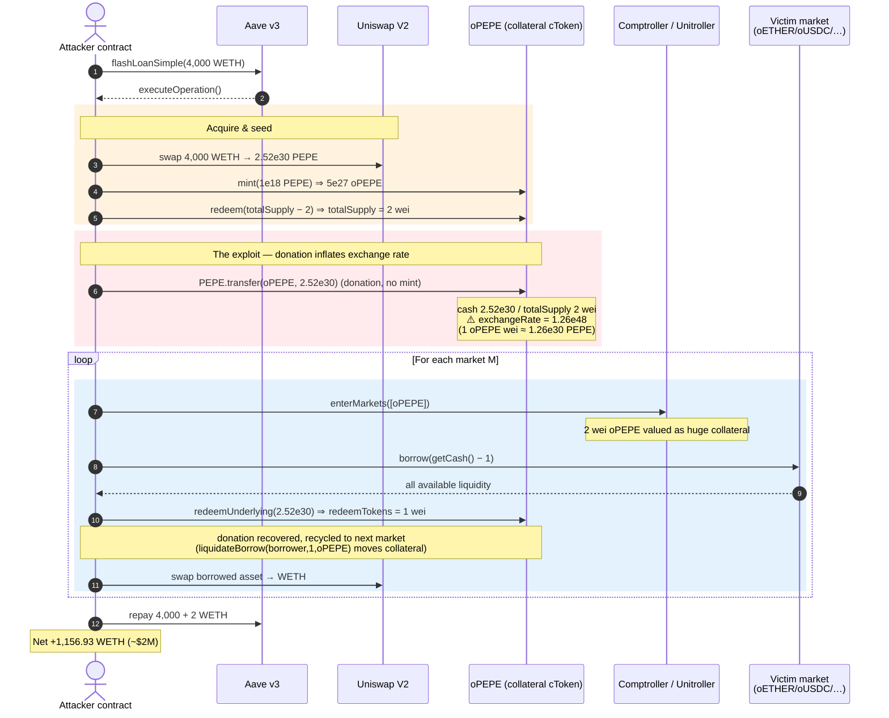
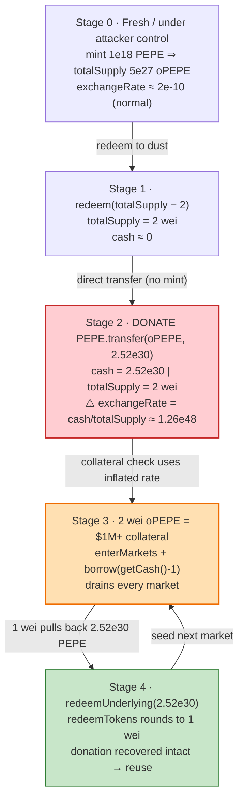
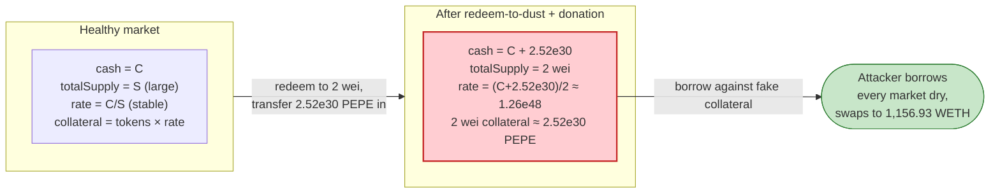

# Onyx Protocol Exploit — Empty-Market Exchange-Rate Inflation (Compound V2 Fork)

> **Vulnerability classes:** vuln/arithmetic/rounding · vuln/logic/price-calculation

> **Reproduction:** the PoC compiles & runs in an isolated Foundry project at
> [this project folder](.) (the umbrella DeFiHackLabs repo does not whole-compile,
> so this PoC was extracted into a standalone project).
> Full verbose trace: [output.txt](output.txt).
> Verified vulnerable sources (the `OErc20Delegator` proxies and the Comptroller/`Unitroller`)
> are under [sources/](sources/). The exploited logic lives in the shared
> `OErc20Delegate` implementation (`0x9dcb6bc351ab416f35aeab1351776e2ad295abc4`), a
> standard Compound V2 cToken.

---

## Key info

| | |
|---|---|
| **Loss** | ~$2,000,000 — attacker ends with **1,156.93 WETH** of pure profit, drained across 8 Onyx markets |
| **Vulnerable contract** | `OErc20Delegate` cToken logic, e.g. `oPEPE` — [`0x5FdBcD61bC9bd4B6D3FD1F49a5D253165Ea11750`](https://etherscan.io/address/0x5FdBcD61bC9bd4B6D3FD1F49a5D253165Ea11750#code) (impl `0x9dcb6bc351ab416f35aeab1351776e2ad295abc4`) |
| **Victim markets** | oETHER, oUSDC, oUSDT, oPAXG, oDAI, oBTC, oLINK + oPEPE collateral, all under `Unitroller` [`0x7D61ed92a6778f5ABf5c94085739f1EDAbec2800`](https://etherscan.io/address/0x7D61ed92a6778f5ABf5c94085739f1EDAbec2800#code) |
| **Attacker EOA** | [`0x085bdff2c522e8637d4154039db8746bb8642bff`](https://etherscan.io/address/0x085bdff2c522e8637d4154039db8746bb8642bff) |
| **Attacker contract** | [`0x526e8e98356194b64eae4c2d443cc8aad367336f`](https://etherscan.io/address/0x526e8e98356194b64eae4c2d443cc8aad367336f) |
| **Attack tx** | [`0xf7c21600452939a81b599017ee24ee0dfd92aaaccd0a55d02819a7658a6ef635`](https://explorer.phalcon.xyz/tx/eth/0xf7c21600452939a81b599017ee24ee0dfd92aaaccd0a55d02819a7658a6ef635) |
| **Chain / block / date** | Ethereum mainnet / fork 18,476,512 / Nov 1, 2023 |
| **Compiler** | cToken logic v0.5.16/0.5.17 (Compound V2 fork); PoC v0.8.10 |
| **Bug class** | Empty-market exchange-rate inflation via donation (the classic "Compound-fork `mint` 1 / `redeem` to dust + direct transfer" rounding/CEI flaw) |

---

## TL;DR

Onyx is a Compound V2 fork. A Compound V2 cToken values collateral as
`exchangeRate = (cash + totalBorrows − totalReserves) / totalSupply`. When a market is
emptied down to a **tiny `totalSupply`**, a direct `underlying.transfer(cToken, …)`
**donation** inflates `cash` while `totalSupply` stays at a handful of wei, so the
**exchange rate explodes** and each remaining cToken-wei becomes worth an enormous amount of
underlying.

The attacker does exactly this on `oPEPE`:

1. `oPEPE.mint(1e18 PEPE)` → mints **5,000,000,000,000,000,000,000,000,000 (5e27)** oPEPE wei.
2. `oPEPE.redeem(totalSupply − 2)` → burns nearly all of it, leaving **`totalSupply = 2` wei** and
   pulling almost all PEPE back out ([trace L308](output.txt) — slot `13` totalSupply set to `2`).
3. **Donates** the redeemed PEPE straight to the oPEPE contract:
   `PEPE.transfer(oPEPE, 2,520,870,348,093,423,681,390,050,791,471 ≈ 2.52e30)`
   ([trace L302](output.txt)). Now `cash ≈ 2.52e30` while `totalSupply = 2`.
4. The exchange rate reported by `getAccountSnapshot` is now
   **`1,260,435,174,046,711,840,695,025,395,736,000,000,000,000,000,000` ≈ 1.26e48 mantissa**
   ([trace L353](output.txt)) — i.e. **1 oPEPE wei ≈ 1.26e30 PEPE**. Two wei of oPEPE is suddenly
   worth ~$1M+ of collateral.
5. With that fictitious collateral, `enterMarkets([oPEPE])` and **borrow each market dry**
   (`borrow(getCash() − 1)`), then `redeemUnderlying` the donated PEPE back, and reuse a
   `liquidateBorrow(borrower, 1, oPEPE)` + precise `mint`/`redeem` recycling pattern to carry the
   inflated oPEPE collateral from market to market.

Across **oETHER, oUSDC, oUSDT, oPAXG, oDAI, oBTC, oLINK**, the attacker borrows essentially all
available liquidity, swaps everything to WETH, repays a 4,000-WETH Aave flash loan + 2-WETH premium,
and walks away with **1,156.93 WETH** (~$2M).

---

## Background — what Onyx is

Onyx Protocol is a near-verbatim **Compound V2 fork** (renamed `cToken → OToken`,
`Comptroller`/`Unitroller`, `CErc20Delegator → OErc20Delegator`). The on-chain layout:

- **`Unitroller`** [`0x7D61ed…2800`](sources/Unitroller_7D61ed/Unitroller.sol) — the storage proxy
  whose implementation is the `Comptroller` (`0x4345d3…478e`). It tracks collateral factors, account
  liquidity, and gates `borrow`/`redeem`/`liquidate`.
- **`OErc20Delegator`** — one transparent proxy per ERC-20 market (oPEPE, oUSDC, oUSDT, oPAXG, oDAI,
  oBTC, oLINK), all delegating to the **same** `OErc20Delegate` logic
  ([`sources/OErc20Delegator_5FdBcD/contracts_OErc20Delegator.sol`](sources/OErc20Delegator_5FdBcD/contracts_OErc20Delegator.sol)).
- **`OEther`** [`0x714bD9…0d79`](sources/OEther_714bD9/OEther.sol) — the native-ETH market.

The cToken accounting variables relevant here are declared in
[`contracts_OTokenInterfaces.sol`](sources/OErc20Delegator_5FdBcD/contracts_OTokenInterfaces.sol)
— `totalSupply` ([:92](sources/OErc20Delegator_5FdBcD/contracts_OTokenInterfaces.sol#L92)),
`totalBorrows` ([:82](sources/OErc20Delegator_5FdBcD/contracts_OTokenInterfaces.sol#L82)),
`totalReserves` ([:87](sources/OErc20Delegator_5FdBcD/contracts_OTokenInterfaces.sol#L87)),
and `accountTokens` ([:97](sources/OErc20Delegator_5FdBcD/contracts_OTokenInterfaces.sol#L97)).

The user-facing entry points are forwarded to the implementation via `delegateToImplementation`
([`contracts_OErc20Delegator.sol:86-160`](sources/OErc20Delegator_5FdBcD/contracts_OErc20Delegator.sol#L86-L160)):
`mint`, `redeem`, `redeemUnderlying`, `borrow`, `liquidateBorrow`, and the view
`getAccountSnapshot` / `exchangeRateStored`.

---

## The vulnerable code

The bug is in the **shared `OErc20Delegate` cToken logic** (impl `0x9dcb6b…abc4`), which the verified
delegators all point at. Its source is the standard Compound V2 cToken, where the exchange rate is
computed as:

```solidity
// exchangeRateStoredInternal() — Compound V2 cToken (the Onyx OErc20Delegate logic)
function exchangeRateStoredInternal() internal view returns (MathError, uint) {
    uint _totalSupply = totalSupply;
    if (_totalSupply == 0) {
        // first mint: use initialExchangeRateMantissa
        return (MathError.NO_ERROR, initialExchangeRateMantissa);
    } else {
        uint totalCash = getCashPrior();                                  // underlying.balanceOf(this)
        uint cashPlusBorrowsMinusReserves = totalCash + totalBorrows - totalReserves;
        // exchangeRate = (cash + borrows − reserves) / totalSupply
        uint exchangeRate = cashPlusBorrowsMinusReserves * 1e18 / _totalSupply;
        return (MathError.NO_ERROR, exchangeRate);
    }
}
```

Two design facts combine into a critical flaw:

1. **`getCashPrior()` is `underlying.balanceOf(this)`** — it counts *any* tokens sitting in the
   contract, including ones that arrived via a plain `transfer` (a "donation"), not through `mint`.
   So `cash` can be inflated **without** minting any new cTokens, and `totalSupply` is unchanged.
2. **The redeem path lets `totalSupply` be driven down to a few wei.** Compound's first-depositor /
   empty-market guard was never added to this fork, so a market can be brought to
   `totalSupply = 2` and then donated into.

The redeem math (`redeemFresh` in the same logic contract) computes either
`redeemAmount = redeemTokens × exchangeRate` (for `redeem(tokens)`) or
`redeemTokens = redeemAmount / exchangeRate` (for `redeemUnderlying(amount)`), and **rounds toward
the attacker** at the 1-wei boundary, which is what makes the recycling in steps 4–6 below net out in
the attacker's favor.

The trace shows the donation and the resulting exchange rate directly:

```
# After redeem leaves totalSupply = 2 wei (storage slot 13 → 2):
emit Redeem(redeemer: …, redeemAmount: 999999999999999999, redeemTokens: 4999999999999999999999999998)   # output.txt L287
@ 13: 0x…1027e72f1f12813088000000 → 2                                                                       # output.txt L308

# Donation: send the redeemed PEPE straight back to oPEPE:
PEPE::transfer(oPEPE, 2520870348093423681390050791471 [2.52e30])                                            # output.txt L302

# Exchange rate now ≈ 1.26e48 (1 oPEPE wei ≈ 1.26e30 PEPE):
oPEPE::getAccountSnapshot(…) ⇒ (0, 2, 0, 1260435174046711840695025395736000000000000000000)                 # output.txt L353
```

---

## Root cause — why it was possible

> A Compound V2 cToken trusts `underlying.balanceOf(this)` as "cash" and divides it by `totalSupply`
> to price collateral. With **no first-depositor / minimum-liquidity protection**, an attacker can
> shrink `totalSupply` to a couple of wei and then **donate** underlying directly, making the exchange
> rate explode. A few wei of cToken then collateralize loans worth the entire protocol.

Concretely, four properties of the Onyx fork compose into the exploit:

1. **`cash` is balance-based and donation-manipulable.** `getCashPrior()` reads
   `underlying.balanceOf(cToken)`, so a bare ERC-20 `transfer` (no `mint`) inflates the numerator of
   the exchange rate while leaving `totalSupply` untouched.
2. **No empty-market / first-depositor guard.** Compound V2's known fix is to seed each market with a
   permanent dust amount (or block redeeming the last shares). Onyx kept the original code, so the
   attacker can reach `totalSupply = 2` wei.
3. **Exchange rate is used for collateral valuation immediately.** Once inflated, `getAccountSnapshot`
   returns the manipulated rate to the Comptroller during `borrowAllowed`, so the borrow checks see
   astronomically valuable collateral (trace: oPEPE snapshot exchangeRate `1.26e48` at
   [L353](output.txt)).
4. **`liquidateCalculateSeizeTokens` + redeem rounding let the donated PEPE be recycled.** The
   `liquidateBorrow(borrower, 1, oPEPE)` (repayAmount = 1 wei) and the `redeemUnderlying`/`mint` dance
   ([test/OnyxProtocol_exp.sol:298-302](test/OnyxProtocol_exp.sol#L298-L302),
   [:338-342](test/OnyxProtocol_exp.sol#L338-L342)) move the inflated oPEPE collateral from one
   intermediate borrower to the next so the **same** ~2.52e30 PEPE seeds the attack against every
   market, one after another.

---

## Preconditions

- A Compound V2-style market with **no minimum-liquidity / first-depositor protection** (Onyx ✓).
- Ability to bring a market's `totalSupply` down to a few wei — trivially satisfied by being the only
  (or dominant) supplier and `redeem`-ing all but a dust amount.
- Working capital in the donated asset. Here the attacker first buys PEPE (the cheap, manipulable
  market) using flash-loaned WETH, so the only real outlay is a **4,000 WETH Aave v3 flash loan**
  ([test/OnyxProtocol_exp.sol:73](test/OnyxProtocol_exp.sol#L73)), fully repaid intra-transaction
  (+2 WETH premium).

---

## Attack walkthrough (with on-chain numbers from the trace)

The whole exploit runs inside `executeOperation` (the Aave flash-loan callback,
[test/OnyxProtocol_exp.sol:78-152](test/OnyxProtocol_exp.sol#L78-L152)). The collateral side is
always **oPEPE**, inflated once and then reused. Each victim market is drained via a dedicated
`IntermediateContract*` borrower.

| # | Step | Concrete values from [output.txt](output.txt) |
|---|------|-----------------------------------------------|
| 0 | Flash-loan 4,000 WETH from Aave v3 | `flashLoanSimple(…, 4000e18, …)` |
| 1 | Swap all WETH → PEPE on Uniswap V2 | attacker now holds ~2.52e30 PEPE wei |
| 2 | `oPEPE.mint(1e18 PEPE)` | `Mint(…, mintAmount 1e18, mintTokens 5e27)` (L252) |
| 3 | `oPEPE.redeem(totalSupply − 2)` | `Redeem(…, redeemTokens 4.999e27)`; **totalSupply → 2 wei** (L287, L308) |
| 4 | **Donate**: `PEPE.transfer(oPEPE, 2.52e30)` | cash → 2.52e30, exchangeRate → **1.26e48** (L302, L353) |
| 5 | `enterMarkets([oPEPE])` → 2 wei oPEPE = huge collateral | `MarketEntered(oPEPE, …)` (L309) |
| 6 | `oETHER.borrow(getCash() − 1)` | **334.48 ETH** borrowed (`Borrow … 334476442580295733160`, L404) |
| 7 | `oPEPE.redeemUnderlying(2.52e30)` then recycle (liquidate w/ repay = 1) | `Redeem(redeemTokens: 1, redeemAmount 2.52e30)` (L489) — 1 oPEPE wei pulls back the whole donation |
| 8 | Repeat 5–7 against **oUSDC** | **513,987.93 USDC** (`Borrow … 513987927004`, L1135) |
| 9 | …**oUSDT** | **249,534.20 USDT** (`Borrow … 249534202651`, L2000) |
| 10 | …**oPAXG** | **81.37 PAXG** (`Borrow … 81375414746413246657`, L2860) |
| 11 | …**oDAI** | **103,657.60 DAI** (`Borrow … 103657601740278955029570`, L3778) |
| 12 | …**oBTC** | **13.12 WBTC** (`Borrow … 1312889485`, L4601) |
| 13 | …**oLINK** | **10,082.86 LINK** (`Borrow … 10082867210431152021425`, L5426) |
| 14 | Swap every borrowed asset → WETH on Uniswap V2 | `USDCToWETH`, `USDTToWETH`, `PAXGToWETH`, `DAIToWETH`, `WBTCToWETH`, `LINKToWETH`, `PEPEToWETH` |
| 15 | Repay 4,000 WETH + 2 WETH premium to Aave | `FlashLoan(… amount 4e21, premium 2e18)` (tail of [output.txt](output.txt)) |
| 16 | **Profit** | **1,156.93 WETH** left in the attacker contract (`balance after exploit 1156934745663858638915`, L6080) |

### The "1 wei pulls everything back" proof

The second `Redeem` event for each market is the smoking gun:

```
emit Redeem(redeemer: …, redeemAmount: 2520870348093423681390050791470 [2.52e30], redeemTokens: 1)   # output.txt L489
```

Redeeming **1 oPEPE wei** returns the entire **2.52e30 PEPE** donation, because at exchangeRate ≈
1.26e48, `redeemTokens = redeemAmount / exchangeRate` rounds 2.52e30 PEPE to a single oPEPE wei. The
same donated PEPE is therefore recovered intact and reused to seed the next market — the attacker
never spends it.

### Profit accounting

| Item | Amount |
|---|---:|
| Aave flash loan in | 4,000 WETH |
| Aave premium | 2 WETH |
| Borrowed (all markets), swapped to WETH | ≈ 5,158 WETH equivalent |
| Repaid to Aave | 4,002 WETH |
| **Net profit (attacker WETH after)** | **1,156.93 WETH** (~$2M) |

The starting attacker WETH was **0** and the ending balance is **1,156.93 WETH**
([output.txt L6, L6080](output.txt)) — all of it extracted liquidity from the eight Onyx markets, net
of the flash-loan repayment.

---

## Diagrams

### Sequence of the attack



### Empty-market exchange-rate inflation



### Why the donation is free money: the exchange-rate division



---

## Remediation

1. **Seed every market with permanent, un-redeemable liquidity (first-depositor fix).** Compound's
   canonical mitigation: mint a small amount of cTokens to a dead address at market creation so
   `totalSupply` can never approach zero, neutralizing the donation amplification. Onyx omitted this.
2. **Do not derive `cash` purely from `balanceOf`.** Track supplied cash in an internal accumulator
   updated only on `mint`/`redeem`/`borrow`/`repay`, so a bare `transfer` donation cannot move the
   exchange rate. (Or subtract un-minted donations.)
3. **Bound the exchange rate / detect anomalous jumps.** Reject collateral valuation when the exchange
   rate moves by more than a sane factor between blocks, or cap collateral contribution from
   freshly-inflated markets.
4. **Add a minimum-liquidity invariant to redeem.** Block redeems that would drop `totalSupply`
   (or `cash`) below a market-specific floor, so a market can never be reduced to a few wei.
5. **Use rounding that always favors the protocol** in `redeemFresh` / `liquidateCalculateSeizeTokens`
   so the 1-wei recycling trick cannot net positive for the attacker.

---

## How to reproduce

The PoC was extracted into a standalone Foundry project (the umbrella DeFiHackLabs repo has several
unrelated PoCs that fail to compile under `forge test`'s whole-project build):

```bash
_shared/run_poc.sh 2023-11-OnyxProtocol_exp --mt testExploit -vvvvv
```

- RPC: an Ethereum mainnet **archive** endpoint is required (fork block 18,476,512 is well-pruned).
- Result: `[PASS] testExploit()`.

Expected tail:

```
Ran 1 test for test/OnyxProtocol_exp.sol:ContractTest
[PASS] testExploit() (gas: 17794449)
Logs:
  Attacker WETH balance before exploit: 0.000000000000000000
  Attacker WETH balance after exploit: 1156.934745663858638915
```

---

*References: Phalcon — https://twitter.com/Phalcon_xyz/status/1719697319824851051 ;
Decurity — https://twitter.com/DecurityHQ/status/1719657969925677161 .
Onyx Protocol, Ethereum mainnet, ~$2M, Nov 1 2023.*
