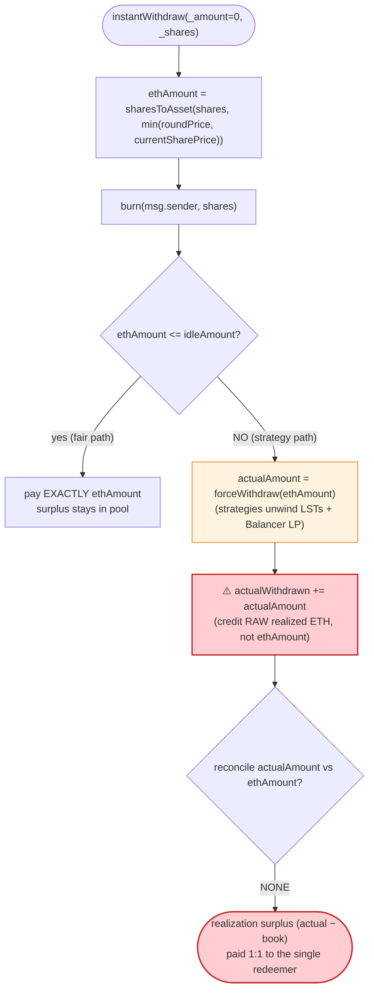
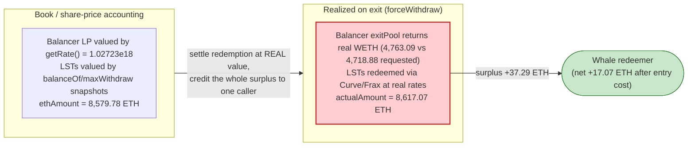

# StakeStone `StoneVault` Exploit — Same-Block Deposit + `instantWithdraw` Skims Strategy-Realization Surplus

> **Vulnerability classes:** vuln/defi/slippage · vuln/logic/price-calculation

> **Reproduction:** the PoC compiles & runs in an isolated Foundry project at
> [this project folder](.) (the umbrella DeFiHackLabs repo contains many
> unrelated PoCs that do not compile under one whole-project build, so this one
> was extracted).
> Full verbose trace: [output.txt](output.txt).
> Verified vulnerable sources under [sources/StoneVault_A62F9C/](sources/StoneVault_A62F9C/).

---

## Key info

| | |
|---|---|
| **Loss** | **~17.07 ETH** (≈ $30K at the time) skimmed from honest StoneVault LPs |
| **Vulnerable contract** | `StoneVault` — [`0xA62F9C5af106FeEE069F38dE51098D9d81B90572`](https://etherscan.io/address/0xA62F9C5af106FeEE069F38dE51098D9d81B90572#code) |
| **Victim** | StoneVault depositors (the vault's pooled ETH / `STONE` LST) |
| **`STONE` token** | [`0x7122985656e38BDC0302Db86685bb972b145bD3C`](https://etherscan.io/address/0x7122985656e38BDC0302Db86685bb972b145bD3C) (Minter `0xEc306E46549A7E8f4fCE823D3058f2D134133B17`) |
| **Attacker EOA** | [`0x9abe851bcc4fd1986c3d1ef8978fad86a26a0c57`](https://etherscan.io/address/0x9abe851bcc4fd1986c3d1ef8978fad86a26a0c57) |
| **Attacker contract** | [`0x9c52c485edd3d22847a1614b8988fbf520b33047`](https://etherscan.io/address/0x9c52c485edd3d22847a1614b8988fbf520b33047) |
| **Attack tx** | [`0xbf5b2d22fa88965ddfc6e6d685fc7cfc683340c49e126386759ed9e4027b1415`](https://app.blocksec.com/explorer/tx/eth/0xbf5b2d22fa88965ddfc6e6d685fc7cfc683340c49e126386759ed9e4027b1415) |
| **Chain / block / date** | Ethereum / fork at **18,523,440** / **Nov 7, 2023** |
| **Compiler** | Solidity **v0.8.21**, optimizer **10 runs** |
| **Bug class** | Accounting mismatch: `instantWithdraw` credits the **actual** strategy-realized ETH instead of the **share-price-fair** ETH; same-block `deposit → rollToNextRound → instantWithdraw` lets a whale capture the realization surplus that belongs to all LPs |

Reference: [@AnciliaInc tweet](https://x.com/AnciliaInc/status/1722121056083943909) on the StakeStone (a.k.a. "RBalancer") incident.

---

## TL;DR

`StoneVault` is an ETH LST vault. It mints `STONE` shares on deposit and lets users
redeem them with `instantWithdraw`. Redemptions are priced at a conservative
share price (`min(roundPrice, currentSharePrice)`), but the function does **not**
pay out that priced amount — it forwards the priced figure as a *request* to
`StrategyController.forceWithdraw(...)` and then **credits the user with whatever
ETH the underlying strategies actually return** ([contracts_StoneVault.sol:309-330](sources/StoneVault_A62F9C/contracts_StoneVault.sol#L309-L330)).

The strategies hold Lido `stETH`, Frax `sfrxETH`, RocketPool `rETH` and a
Balancer `rETH/WETH` MetaStablePool LP. When you unwind those positions, the ETH
you actually realize differs from the vault's internal share-price accounting:
LSTs carry accrued yield, and the Balancer LP `exitPool` returns more than its
`getRate()`-implied book value. That **realization surplus** is normally LP value
that should be spread across all `STONE` holders. `instantWithdraw` instead hands
**100 %** of it to the single caller doing the redemption.

The attacker:

1. **Deposits 8,600 ETH** in the same block, minting **8,582.16 STONE** — becoming
   ~93 % of the vault's total `STONE` supply.
2. **Calls `rollToNextRound()`** (permissionless), which invests the fresh 8,600 ETH
   into the strategies (`rebaseStrategies(8600 ETH, 0)`) and rolls the round.
3. **Calls `instantWithdraw(0, 8,582.16 STONE)`**. The vault prices those shares at
   **8,579.78 ETH**, requests that from `forceWithdraw`, the strategies unwind and
   actually return **8,617.07 ETH**, and the attacker is paid the full **8,617.07 ETH**.

Net: **8,617.07 − 8,600 = +17.07 ETH** — the realization surplus of the whole vault,
captured in a single block by the dominant share holder.

---

## Background — what `StoneVault` does

`StoneVault` ([source](sources/StoneVault_A62F9C/contracts_StoneVault.sol)) is the
core of StakeStone's `STONE` LST product:

- **`deposit()`** takes ETH, mints `STONE` at `mintAmount = amount * 1e18 / sharePrice`,
  and forwards the ETH to the `AssetsVault`
  ([:135-173](sources/StoneVault_A62F9C/contracts_StoneVault.sol#L135-L173)).
- **`rollToNextRound()`** is a **permissionless** rebase: it rebalances idle ETH into
  the strategies via `StrategyController.rebaseStrategies`, recomputes the share
  price, and advances `latestRoundID`
  ([:345-392](sources/StoneVault_A62F9C/contracts_StoneVault.sol#L345-L392)).
- **`instantWithdraw(_amount, _shares)`** burns `STONE` and pays ETH back, pulling
  from idle vault ETH first and from the strategies (`forceWithdraw`) for the
  remainder ([:241-343](sources/StoneVault_A62F9C/contracts_StoneVault.sol#L241-L343)).
- **`currentSharePrice()`** = `(idle + Σ strategy value − pending) / activeShares`
  ([:436-453](sources/StoneVault_A62F9C/contracts_StoneVault.sol#L436-L453)).

Funds are deployed across four ETH strategies (all visible in the trace):

| Strategy | Address | Holds |
|---|---|---|
| Lido | `0x363D200E54FE86985790f4E210dF9BfB14234202` | `stETH` |
| RocketPool | `0x9221FbE66Be06F43dCBda3FC17CdD66ef1b236f9` | `rETH` (0 at fork) |
| Frax | `0xa66723D951F15423Ef2C9C11edcb821E38301836` | `sfrxETH` |
| Balancer | `0x856EdF1B835ea02Bf11B16F041DF5A13Ef1EC3d1` | Balancer `rETH/WETH` MetaStablePool LP (Aura/Convex-staked) |

On-chain state at the fork block (read from the trace):

| Parameter | Value |
|---|---|
| `latestRoundID` | **3** (storage slot 5: `3 → 4` during the attack) |
| `roundPricePerShare[2]` | ≈ `1.00208e18` (deposit used `max(roundPrice[2], curr)`) |
| `STONE.totalSupply()` (pre-deposit) | `646.89` STONE |
| `Σ strategy value` (pre-deposit) | `648.13` ETH (implied price ≈ `1.00192`) |
| `AssetsVault` idle balance | ≈ `0.10` ETH |

---

## The vulnerable code

### 1. `instantWithdraw` pays the *actual* strategy return, not the priced amount

```solidity
// contracts_StoneVault.sol — instantWithdraw, share branch
uint256 ethAmount = VaultMath.sharesToAsset(_shares, sharePrice);  // priced @ min(round, curr)

stoneMinter.burn(msg.sender, _shares);

if (ethAmount <= idleAmount) {
    actualWithdrawn = actualWithdrawn + ethAmount;             // paid = priced amount
    emit Withdrawn(msg.sender, ethAmount, latestRoundID);
} else {
    actualWithdrawn = actualWithdrawn + idleAmount;
    ethAmount = ethAmount - idleAmount;

    StrategyController controller = StrategyController(strategyController);
    uint256 actualAmount = controller.forceWithdraw(ethAmount); // request `ethAmount`...
    actualWithdrawn = actualWithdrawn + actualAmount;           // ...but credit ACTUAL return ⚠️

    emit WithdrawnFromStrategy(msg.sender, ethAmount, actualAmount, latestRoundID);
}
```
([contracts_StoneVault.sol:289-331](sources/StoneVault_A62F9C/contracts_StoneVault.sol#L289-L331))

The two branches are asymmetric. When the redemption fits in idle ETH, the user is
paid exactly `ethAmount` (the share-price-fair value). When it does **not** fit and
the strategies must unwind, the user is paid `idleAmount + actualAmount`, where
`actualAmount` is whatever ETH the strategies *happened to realize*. There is **no
check** that `actualAmount ≈ ethAmount`, and any positive difference is value
silently transferred from the rest of the pool to the caller.

### 2. `forceWithdraw` realizes raw strategy value

```solidity
function forceWithdraw(uint256 _amount) external onlyVault returns (uint256 actualAmount) {
    uint256 balanceBeforeRepay = address(this).balance;
    if (balanceBeforeRepay >= _amount) { _repayToVault(); actualAmount = balanceBeforeRepay; }
    else { actualAmount = _forceWithdraw(_amount - balanceBeforeRepay) + balanceBeforeRepay; }
}

function _forceWithdraw(uint256 _amount) internal returns (uint256 actualAmount) {
    // pro-rata across strategies by ratio, sums each Strategy.instantWithdraw(...)
    actualAmount = Strategy(strategy).instantWithdraw(withAmount) + actualAmount;  // raw realized ETH
    _repayToVault();
}
```
([contracts_strategies_StrategyController.sol:55-69](sources/StoneVault_A62F9C/contracts_strategies_StrategyController.sol#L55-L69),
[:179-197](sources/StoneVault_A62F9C/contracts_strategies_StrategyController.sol#L179-L197))

Each strategy's `instantWithdraw` unwinds an LST or `exitPool`s the Balancer LP and
returns the **actual** ETH out — which includes accrued LST yield and the gap between
the LP's `getRate()` book value and its real exit value. In the trace, the Balancer
strategy was *requested* `4,718.88 WETH` but its `exitPool` returned `4,763.09 WETH`
([output.txt:1025-1036](output.txt)), and the aggregate `forceWithdraw` returned
`8,617.07 ETH` against an `ethAmount` request of `8,579.78 ETH`
([output.txt:609](output.txt), [:1060](output.txt)).

### 3. `rollToNextRound()` is permissionless

```solidity
function rollToNextRound() external {
    require(block.timestamp > rebaseTime + rebaseTimeInterval, "already rebased");
    ...
    controller.rebaseStrategies(vaultIn, vaultOut);   // invests fresh deposit into strategies
    ...
    latestRoundID = latestRoundID + 1;
}
```
([contracts_StoneVault.sol:345-392](sources/StoneVault_A62F9C/contracts_StoneVault.sol#L345-L392))

No access control. Once `rebaseTimeInterval` (24h) has elapsed, anyone can trigger the
rebase that pushes the attacker's just-deposited ETH into the yield-bearing strategies,
so that the subsequent `forceWithdraw` realizes their surplus.

---

## Root cause — why it was possible

The vault uses a **conservative, lagging share price** for accounting
(`min(roundPrice, currentSharePrice)`, and `getRate()`-based book values for the
Balancer LP) but settles redemptions at the **raw realized cash value** of the
underlying positions. These two numbers are *not* equal:

> `instantWithdraw` burns the user's shares at the *book* price (`ethAmount`), but then
> forwards the **entire** realized strategy return (`actualAmount`) to that one user.
> The realized-minus-book surplus is pooled LP value that should be socialized across
> all `STONE` holders — instead it is paid out 1:1 to whoever calls the redemption.

Three design decisions compose into the exploit:

1. **Settlement ≠ accounting.** The share branch credits `actualAmount` from
   `forceWithdraw`, never reconciling it against the `ethAmount` the shares were
   priced at. A correct vault must cap the payout at the share-priced amount and
   leave any positive slippage/realization in the pool (or socialize it via the
   share price), and conversely must *not* let a redeemer absorb the full realized
   gain of the collective.
2. **Permissionless `rollToNextRound`** lets the attacker, in the same block as their
   deposit, force the fresh capital into the strategies — guaranteeing the next
   `forceWithdraw` unwinds positions that carry the realization surplus.
3. **Whale-dominated pool.** By depositing 8,600 ETH into a vault that previously held
   only ~648 ETH, the attacker becomes ~93 % of `STONE` supply, so essentially the
   *whole* vault's realization surplus accrues to their single redemption. The deposit
   uses `max(roundPrice, currentSharePrice)` (paying a slightly *higher* entry price),
   but that ~17.8 ETH entry "cost" is dwarfed by the ~37.3 ETH realization surplus
   captured on exit, netting +17.07 ETH.

The "RBalancer" / Balancer angle: the Balancer `MetaStablePool` is the largest source
of the book-vs-realized gap. Its `getRate()` (used by `getAllValue()` /
`getInvestedValue()` for share pricing) returns a smoothed `1.02723e18`, while an actual
`exitPool` returns the real reserve-weighted WETH — a classic instance of "price by an
oracle/rate function, settle by real liquidity," which is exactly the discrepancy the
attacker monetizes.

---

## Preconditions

- A redemption large enough that `ethAmount > idleAmount`, forcing the
  `forceWithdraw` branch (trivially satisfied by a whale deposit into a thin vault).
- The attacker holds a large share of `STONE` supply, so the socialized surplus they
  capture is large relative to their entry cost (here: deposit 8,600 ETH into a ~648 ETH
  vault → ~93 % ownership).
- `rollToNextRound()` is callable (≥ `rebaseTimeInterval` since last rebase) so the
  fresh deposit is invested into the yield/LP strategies before withdrawal. It is
  permissionless.
- Working capital in ETH for the deposit. The capital is fully recovered intra-tx
  (deposit 8,600, withdraw 8,617.07), so the position is effectively **flash-loanable**;
  the PoC just funds the test contract directly with `vm.deal`-style ETH.

---

## Attack walkthrough (with on-chain numbers from the trace)

All figures are taken directly from [output.txt](output.txt). The PoC drives three raw
calls via selectors: `deposit()` (`0xd0e30db0`), `rollToNextRound()` (`0x5069fb57`),
and `instantWithdraw(uint256,uint256)` (`0xb18f2e91`) ([test/RBalancer_exp.sol:37-45](test/RBalancer_exp.sol#L37-L45)).

| # | Step | Trace | STONE supply | Σ strategy value | Effect |
|---|------|-------|-------------:|-----------------:|--------|
| 0 | **Initial** | [:25-89](output.txt) | 646.89 | 648.13 | Honest vault, ~0.1 ETH idle, round 3. |
| 1 | **`deposit{8600 ETH}()`** — share price `max(roundPrice[2], curr) = 1.002078e18` | [:24-88](output.txt) | 9,229.05 | — | Mints **8,582.16 STONE** to attacker (~93 % of supply); ETH parked in `AssetsVault`. |
| 2 | **`rollToNextRound()`** — `rebaseStrategies(8600.005 ETH, 0)` invests the deposit; round 3→4; `newSharePrice = 0.99972e18` | [:89-498](output.txt) | 9,229.05 | 9,226.39 | 8,600 ETH split into Lido/Frax/Balancer positions; share price recorded as `roundPricePerShare[3]=0.99972`. |
| 3 | **`instantWithdraw(0, 8,582.16 STONE)`** — burns shares; `ethAmount = sharesToAsset(shares, min(0.99972, curr)) = 8,579.78 ETH` | [:504-608](output.txt) | 646.89 | 9,226.39 | Idle (0.1 ETH) << ethAmount → enters `forceWithdraw` branch. |
| 4 | **`forceWithdraw(8,579.78 ETH)`** — Lido `instantWithdraw` (Curve swap stETH→ETH), Frax `sfrxETH` redeem, Balancer `exitPool` | [:609-1060](output.txt) | — | — | Strategies **actually return 8,617.07 ETH** (Balancer alone: requested 4,718.88, returned 4,763.09). |
| 5 | **Payout** — `AssetsVault.withdraw(attacker, 8,617.07 ETH)` | [:1064-1067](output.txt) | — | — | Attacker credited the **full actual** 8,617.07 ETH (not the 8,579.78 priced amount). |

**The numeric gap (verified against the trace):**

| Quantity | Value (ETH) |
|---|---:|
| Shares burned, priced at `min(roundPrice, curr)=0.99972` → `ethAmount` | 8,579.78 |
| `forceWithdraw` **actual** realized return | 8,617.07 |
| **Realization surplus handed to attacker** | **+37.29** |
| Less: deposit entry cost (8,600 in for 8,582.16 STONE @ 1.002078) | −20.22 (book) |
| **Net profit** | **+17.07** |

### Profit accounting (ETH)

| Direction | Amount |
|---|---:|
| Spent — `deposit{value}` | 8,600.000 |
| Received — `instantWithdraw` payout | 8,617.073 |
| **Net profit** | **+17.073** |

Confirmed by the test logs: attacker ETH balance `79,228,162,514.2643…` →
`79,228,162,531.3372…` ([output.txt:7-9](output.txt)), a **+17.073 ETH** gain, matching the
PoC header's *"Total Lost : ~17 ETH"*.

---

## Diagrams

### Sequence of the attack

```mermaid
sequenceDiagram
    autonumber
    actor A as "Attacker"
    participant V as "StoneVault"
    participant AV as "AssetsVault"
    participant SC as "StrategyController"
    participant S as "Strategies (Lido / Frax / Balancer LP)"

    Note over V: "Round 3 — supply 646.89 STONE, Σ value 648.13 ETH"

    rect rgb(227,242,253)
    Note over A,S: "Step 1 — whale deposit"
    A->>V: "deposit{8,600 ETH}()"
    V->>V: "sharePrice = max(roundPrice[2], curr) = 1.002078"
    V->>AV: "forward 8,600 ETH"
    V-->>A: "mint 8,582.16 STONE (~93% of supply)"
    end

    rect rgb(232,245,233)
    Note over A,S: "Step 2 — permissionless rebase invests the deposit"
    A->>V: "rollToNextRound()"
    V->>SC: "rebaseStrategies(8,600 ETH, 0)"
    SC->>S: "deposit ETH into Lido / Frax / Balancer LP"
    V->>V: "round 3 to 4; roundPrice[3] = 0.99972"
    end

    rect rgb(255,235,238)
    Note over A,S: "Step 3 — redeem at book price, get paid actual"
    A->>V: "instantWithdraw(0, 8,582.16 STONE)"
    V->>V: "ethAmount = sharesToAsset(shares, 0.99972) = 8,579.78 ETH"
    V->>SC: "forceWithdraw(8,579.78 ETH)  (request)"
    SC->>S: "unwind LSTs + Balancer exitPool"
    S-->>SC: "ACTUAL 8,617.07 ETH (surplus +37.29)"
    SC-->>V: "8,617.07 ETH"
    V->>AV: "withdraw(attacker, 8,617.07 ETH)"
    AV-->>A: "8,617.07 ETH  (full actual, not 8,579.78)"
    end

    Note over A: "Net +17.07 ETH (vault's realization surplus)"
```

### The accounting flaw inside `instantWithdraw`



### Book value vs. realized value (where the 37 ETH comes from)



---

## Why each magic number

- **`deposit{8,600 ETH}`:** sized to dwarf the vault's prior ~648 ETH so the attacker
  owns ~93 % of `STONE`. The bigger their share, the larger the *socialized* realization
  surplus that funnels into their single redemption.
- **`rollToNextRound()`:** must run *between* the deposit and the withdrawal so the fresh
  8,600 ETH is actually invested into the yield/LP strategies (`rebaseStrategies(8600, 0)`);
  otherwise it would sit idle and the `forceWithdraw` branch would realize no surplus.
- **`instantWithdraw(0, 8,582.16 STONE)`:** redeems *all* of the attacker's shares. With
  `_amount = 0`, only the share branch runs; burning the full position maximizes the slice
  of realized strategy ETH the attacker is entitled to receive.

---

## Remediation

1. **Cap the payout at the share-priced amount.** In the strategy branch, pay
   `min(ethAmount, actualAmount)` and return any positive surplus to the `AssetsVault`
   so it is socialized across all `STONE` holders via the share price — never forward
   `actualAmount` wholesale to the redeemer.
2. **Reconcile settlement with accounting.** The value used to *price* the burned shares
   (`getRate()`, `min(roundPrice, currentSharePrice)`) must be the same basis used to
   *settle* them. Do not price by a smoothed rate/oracle while settling at raw realized
   liquidity.
3. **Gate or delay `rollToNextRound()`.** Restrict the rebase to a trusted keeper, and/or
   enforce a deposit→withdraw delay (a non-zero unbonding/round lag) so a deposit cannot
   be invested and redeemed in the same block.
4. **Charge realistic exit slippage to the redeemer, not the pool.** If a withdrawal
   forces strategy unwinds, the unwinding cost/benefit should accrue to the actor causing
   it, computed against the share-priced expectation — not pooled and skimmed.
5. **Add an invariant check.** After `forceWithdraw`, assert
   `actualWithdrawn ≤ ethAmount + idleAmount + tolerance` (and route the remainder to the
   vault), turning the silent surplus transfer into either a revert or a socialized gain.

---

## How to reproduce

The PoC was extracted into a standalone Foundry project (the umbrella DeFiHackLabs repo
has many unrelated PoCs that fail to compile under one whole-project build):

```bash
_shared/run_poc.sh 2023-11-RBalancer_exp -vvvvv
```

- RPC: a **mainnet archive** endpoint is required (fork block 18,523,440). Most public
  mainnet RPCs prune state this old and fail with `header not found` / `missing trie node`.
- Result: `[PASS] testExpolit()`.

Expected tail:

```
Ran 1 test for test/RBalancer_exp.sol:ContractTest
[PASS] testExpolit() (gas: 5208492)
Logs:
  attacker WETH balance before attack: 0.000000000000000000
  attacker balance before attack: 79228162514.264337593543950335
  attacker WETH balance after attack: 0.000000000000000000
  attacker balance after attack: 79228162531.337290268275864267
```

(`79,228,162,531.3372… − 79,228,162,514.2643… = +17.073 ETH`.)

---

*Reference: AnciliaInc — https://x.com/AnciliaInc/status/1722121056083943909 (StakeStone / StoneVault, Ethereum, ~17 ETH).*
