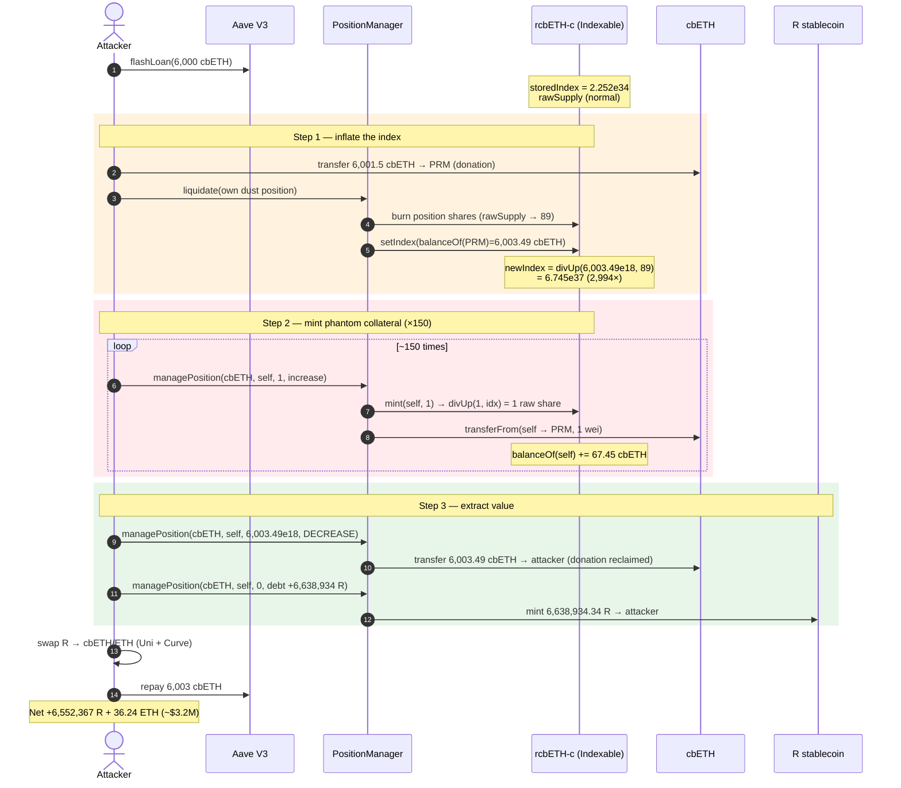
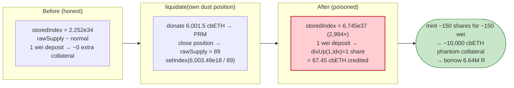
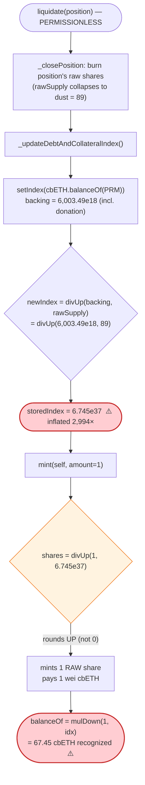

# Raft Finance Exploit — Indexable-Collateral `setIndex` Inflation + `divUp` Rounding Mint

> **Vulnerability classes:** vuln/arithmetic/rounding · vuln/arithmetic/precision-loss

> **Reproduction:** the PoC compiles & runs in an isolated Foundry project at
> [this project folder](.) (the umbrella DeFiHackLabs repo
> contains many unrelated PoCs that fail to whole-compile, so this one was extracted).
> Full verbose trace: [output.txt](output.txt).
> Verified vulnerable source: [contracts_ERC20Indexable.f.sol](sources/ERC20Indexable_D0Db31/contracts_ERC20Indexable.f.sol)
> and [InterestRatePositionManager.f.sol](sources/InterestRatePositionManager_9AB6b2/contracts_InterestRates_InterestRatePositionManager.f.sol).

---

## Key info

| | |
|---|---|
| **Loss** | ~$3.2 M — attacker minted **6,638,934 R** (the protocol's stablecoin) backed by ~150 wei of real collateral, then dumped it |
| **Vulnerable contract** | `ERC20Indexable` (rcbETH-c) — [`0xD0Db31473CaAd65428ba301D2174390d11D0C788`](https://etherscan.io/address/0xD0Db31473CaAd65428ba301D2174390d11D0C788#code) |
| **Vulnerable manager** | `InterestRatePositionManager` (PRM) — [`0x9AB6b21cDF116f611110b048987E58894786C244`](https://etherscan.io/address/0x9AB6b21cDF116f611110b048987E58894786C244#code) |
| **Victim / drained asset** | The `R` stablecoin minted against fake collateral, swapped to ~36.24 ETH + 6.55 M R |
| **Attacker EOA** | [`0xc1f2b71a502b551a65eee9c96318afdd5fd439fa`](https://etherscan.io/address/0xc1f2b71a502b551a65eee9c96318afdd5fd439fa) |
| **Attacker contract** | [`0x0A3340129816a86b62b7eafD61427f743c315ef8`](https://etherscan.io/address/0x0a3340129816a86b62b7eafd61427f743c315ef8) |
| **Attack tx** | [`0xfeedbf51b4e2338e38171f6e19501327294ab1907ab44cfd2d7e7336c975ace7`](https://etherscan.io/tx/0xfeedbf51b4e2338e38171f6e19501327294ab1907ab44cfd2d7e7336c975ace7) |
| **Chain / block / date** | Ethereum mainnet / fork at 18,543,485 / Nov 10, 2023 |
| **Compiler** | Solidity 0.8.19 (BUSL-1.1) |
| **Bug class** | Share-inflation (donation) attack on an index/share accounting token + `divUp` rounding-up mint |

---

## TL;DR

Raft's collateral and debt are tracked with rebasing "indexable" tokens (`ERC20Indexable`). The
real user-facing balance is `rawBalance × storedIndex`, and `storedIndex` is recomputed on every
liquidation as **`backingCollateral ÷ rawSupply`**
([ERC20Indexable.f.sol:837-842](sources/ERC20Indexable_D0Db31/contracts_ERC20Indexable.f.sol#L837-L842)).

The attacker turned that single division into a free-money machine in two moves:

1. **Inflate the index.** They opened a tiny self-controlled position, **donated 6,001.5 cbETH** straight
   into the PositionManager, then **`liquidate()`**'d their own dust position. Liquidation closes the
   position (burning the raw supply down to a near-zero dust of **89 raw units**) and then calls
   `setIndex(cbETH.balanceOf(PRM))`
   ([InterestRatePositionManager.f.sol:3886-3896](sources/InterestRatePositionManager_9AB6b2/contracts_InterestRates_InterestRatePositionManager.f.sol#L3886-L3896)).
   With backing = **6,003.49 cbETH** and rawSupply = **89**, the index explodes from `2.25e34` to
   **`6.745e37`** — a **2,994×** magnification (confirmed in the trace logs).

2. **Mint collateral for 1 wei a pop.** Collateral mint does
   `_mint(to, amount.divUp(storedIndex))`
   ([ERC20Indexable.f.sol:829-831](sources/ERC20Indexable_D0Db31/contracts_ERC20Indexable.f.sol#L829-L831)).
   With the giant index, depositing **1 wei** of cbETH rounds **up** to **1 raw unit**, but that 1 raw
   unit reads back as **`1 × 6.745e37 / 1e18 = 67.45 cbETH`** of recognized collateral
   ([balanceOf at :852-854](sources/ERC20Indexable_D0Db31/contracts_ERC20Indexable.f.sol#L852-L854)).
   The attacker calls `managePosition(cbETH, self, 1, true, …)` **~150 times** — paying ~150 wei total —
   to manufacture **~10,000 cbETH** of phantom collateral.

They then **borrow 6,638,934 R** against the phantom collateral, **redeem the 6,003.49 cbETH they donated**,
repay the flash loan, and walk off with **6,552,367 R + 36.24 ETH** (≈ $3.2 M). All in one transaction.

---

## Background — how Raft accounting works

Raft is a CDP/stablecoin protocol (Liquity-style). A user locks cbETH collateral and borrows `R`,
a USD-pegged stablecoin. Two bookkeeping tokens model each position:

- **`rcbETH-c`** (raft collateral token) — tracks deposited cbETH.
- **`rcbETH-d`** (raft debt token) — tracks R debt (accrues interest).

Both are `ERC20Indexable`. Crucially, they are **rebasing via an index**:

```solidity
// sources/ERC20Indexable_D0Db31/contracts_ERC20Indexable.f.sol:844-854
function currentIndex() public view returns (uint256) { return storedIndex; }

function totalSupply() public view returns (uint256) {
    return ERC20.totalSupply().mulDown(currentIndex());   // raw * index / 1e18
}
function balanceOf(address account) public view returns (uint256) {
    return ERC20.balanceOf(account).mulDown(currentIndex()); // raw * index / 1e18
}
```

So the "real" amount a user sees = `rawBalance × index / 1e18`. The `index` is the single number that
maps internal raw shares to actual cbETH. **Whoever controls the index controls how much collateral
everyone's shares are worth.**

On the fork block the live parameters were:

| Parameter | Value (raw) | Meaning |
|---|---|---|
| `storedIndex` (rcbETH-c) before attack | `22,528,727,648,486,975,235,001,271,078,722,143` (≈ `2.252e34`) | pre-existing collateral index |
| `storedIndex` (rcbETH-c) after attack | `67,454,999,362,239,153,474,224,719,101,123,595,506` (≈ `6.745e37`) | **2,994× inflated** |
| cbETH price (`RaftOracle.fetchPrice`) | `2,095,673,200,000,000,000,000` (≈ 2,095.67 R/cbETH) | used to size the debt borrow |
| Minimum debt (`LOW_TOTAL_DEBT`) | `3,000e18` R | floor that forced the 3,100 R-debt setup |

---

## The vulnerable code

### 1. The index is recomputed as `backing ÷ rawSupply` on every liquidation

```solidity
// sources/ERC20Indexable_D0Db31/contracts_ERC20Indexable.f.sol:837-842
function setIndex(uint256 backingAmount) external override onlyPositionManager {
    uint256 supply = ERC20.totalSupply();                 // RAW internal supply (shares)
    uint256 newIndex = (backingAmount == 0 && supply == 0)
        ? INDEX_PRECISION
        : backingAmount.divUp(supply);                    // ⚠️ backing / rawSupply, rounded UP
    storedIndex = newIndex;
    emit IndexUpdated(newIndex);
}
```

The PositionManager feeds `backingAmount = collateralToken.balanceOf(address(this))` — i.e. **the PRM's
entire current cbETH balance** — and the manager itself decides when:

```solidity
// sources/InterestRatePositionManager_9AB6b2/contracts_InterestRates_InterestRatePositionManager.f.sol:3886-3896
function _updateDebtAndCollateralIndex(
    IERC20 collateralToken,
    IERC20Indexable raftCollateralToken,
    IERC20Indexable raftDebtToken,
    uint256 totalDebtForCollateral
) internal {
    raftDebtToken.setIndex(totalDebtForCollateral);
    raftCollateralToken.setIndex(collateralToken.balanceOf(address(this)));  // ⚠️ uses live balance
}
```

`_updateDebtAndCollateralIndex` is called at the **end of `liquidate()`**
([:3505-3507](sources/InterestRatePositionManager_9AB6b2/contracts_InterestRates_InterestRatePositionManager.f.sol#L3505-L3507)),
**after** the liquidated position is closed (its raw shares burned). So an attacker who (a) raises the
PRM cbETH balance via a plain **donation** and (b) crashes the raw supply by liquidating their own dust
position gets to dictate a wildly inflated `newIndex = donation / dust`.

### 2. Minting collateral rounds the share amount UP (`divUp`)

```solidity
// sources/ERC20Indexable_D0Db31/contracts_ERC20Indexable.f.sol:829-835
function mint(address to, uint256 amount) public override onlyPositionManager {
    _mint(to, amount.divUp(storedIndex));   // ⚠️ shares = ceil(amount * 1e18 / index)
}
function burn(address from, uint256 amount) public override onlyPositionManager {
    _burn(from, amount == type(uint256).max ? ERC20.balanceOf(from) : amount.divUp(storedIndex));
}
```

`divUp` is the round-**up** fixed-point division
([:534-540](sources/ERC20Indexable_D0Db31/contracts_ERC20Indexable.f.sol#L534-L540)):

```solidity
function divUp(uint256 a, uint256 b) internal pure returns (uint256) {
    if (a == 0) return 0;
    return (((a * ONE) - 1) / b) + 1;     // ceil(a*1e18/b)
}
```

With a huge `storedIndex`, **any non-zero `amount` mints at least 1 raw share** — `divUp(1, 6.745e37)`
returns `1`, not `0`. That 1 raw share is then worth a full `index/1e18 ≈ 67.45 cbETH` when read via
`balanceOf`. The attacker pays **1 wei of cbETH** and gets **67.45 cbETH of recognized collateral**.

### 3. `managePosition` mints collateral 1:1 with `collateralChange`, no minimum

```solidity
// sources/InterestRatePositionManager_9AB6b2/contracts_InterestRates_InterestRatePositionManager.f.sol:3857-3878
function _adjustCollateral(
    IERC20 collateralToken,
    IERC20Indexable raftCollateralToken,
    address position,
    uint256 collateralChange,           // = 1 wei
    bool isCollateralIncrease
) internal {
    if (collateralChange == 0) return;
    if (isCollateralIncrease) {
        raftCollateralToken.mint(position, collateralChange);                 // mints 1 raw share
        collateralToken.safeTransferFrom(msg.sender, address(this), collateralChange); // pulls 1 wei
    } else { ... }
    emit CollateralChanged(position, collateralToken, collateralChange, isCollateralIncrease);
}
```

`managePosition` is **permissionless** for one's own position and imposes no per-call minimum on
`collateralChange` ([:3401-3464](sources/InterestRatePositionManager_9AB6b2/contracts_InterestRates_InterestRatePositionManager.f.sol#L3401-L3464)),
so `collateralChange = 1` is accepted and repeats freely.

---

## Root cause — why it was possible

Three independent design flaws compose into a critical bug:

1. **The index is derived from a manipulable, instantaneous balance (`balanceOf(PRM)`) over a
   manipulable supply.** `setIndex` performs `backing / rawSupply` with **no lower bound on supply**
   and **no protection against direct donations** inflating `backing`. This is the textbook
   ERC4626-style first-depositor / share-inflation attack, but applied to the *index* rather than a
   share price. After the attacker liquidates their own position the raw supply is dust (89), so the
   division blows up.

2. **The liquidation entry point is permissionless and recomputes the index using the post-burn
   supply.** `liquidate()` closes the position (burning its shares) *before* calling `setIndex`, so the
   attacker fully controls the denominator. Anyone can liquidate any under-collateralized position; the
   attacker simply liquidates one they own and have under-collateralized on purpose.

3. **Mint uses `divUp` (round up) with no economic guard.** Rounding **up** means a sub-share deposit is
   never truncated to zero — it is promoted to a whole share. At a normal index this loses ~1 wei; at an
   inflated index of `6.745e37` it gifts ~67.45 cbETH per wei. Pairing round-up mint with an
   attacker-inflatable index converts a harmless dust-rounding into bulk free collateral.

The protocol's safety check (`_checkValidPosition` / min-debt) was no obstacle: the attacker's phantom
collateral was *recognized as real* by `balanceOf`, so the position looked massively over-collateralized
and the borrow of 6.6 M R passed the collateral-ratio gate cleanly.

---

## Preconditions

- An indexable collateral token whose index is recomputed from `balanceOf(PRM) / rawSupply` on
  liquidation (true for rcbETH-c at the fork block).
- The ability to open and self-liquidate a position. The PoC seeds the attacker with a `mint` of 3,100
  rcbETH-d debt (above the `LOW_TOTAL_DEBT = 3,000` floor) via `vm.prank(PRM)` to mirror the on-chain
  setup ([Raft_exp.sol:106-108](test/Raft_exp.sol#L106-L108)); on mainnet the attacker created the
  position normally.
- Working capital in cbETH to (a) donate into PRM and (b) post as the dust position's collateral. The
  PoC sources this from a **6,000 cbETH Aave V3 flash loan**
  ([Raft_exp.sol:113-119](test/Raft_exp.sol#L113-L119)); it is repaid in-transaction, so the attack is
  effectively **flash-loanable / zero-capital**.

---

## Attack walkthrough (with on-chain numbers from the trace)

All figures are taken directly from [output.txt](output.txt). The PoC's whole exploit body lives in
`executeOperation` ([Raft_exp.sol:126-169](test/Raft_exp.sol#L126-L169)), invoked inside the Aave flash
loan.

| # | Step (code ref) | Concrete numbers from trace | Effect |
|---|---|---|---|
| 0 | **Flash loan 6,000 cbETH** from Aave V3 ([Raft_exp.sol:119](test/Raft_exp.sol#L119)) | borrow `6,000e18` cbETH, premium `3e18` | working capital in hand |
| 1 | **Read pre-attack index** ([Raft_exp.sol:135-137](test/Raft_exp.sol#L135-L137)) | `storedIndex` = `2.252e34` (`÷1e18 = 22,528,727,648,486,975`) | baseline index |
| 2 | **Donate cbETH to PRM** ([Raft_exp.sol:141](test/Raft_exp.sol#L141)) | transfer `6,001.5e18` cbETH (6,000 loaned + 1.5 owned) → PRM | inflates PRM cbETH balance |
| 3 | **`PRM.liquidate(dustPosition)`** ([Raft_exp.sol:142](test/Raft_exp.sol#L142)) | position closed → raw supply collapses to **89**; PRM cbETH balance now **6,003.49e18** | triggers `setIndex(6003.49e18)` |
| 4 | **Index recomputed** — `setIndex` does `divUp(6,003,494,943,239,284,659,206, 89)` ([ERC20Indexable.f.sol:837-842](sources/ERC20Indexable_D0Db31/contracts_ERC20Indexable.f.sol#L837-L842)) | `newIndex` = **`6.745e37`** (`÷1e18 = 67,454,999,362,239,153,474`) | **index up 2,994×** |
| 5 | **Mint loop:** `managePosition(cbETH, self, 1, true, 0, true, …)` × **~150** ([Raft_exp.sol:153-155](test/Raft_exp.sol#L153-L155)) | each call: pull **1 wei** cbETH, mint **1 raw share** worth `balanceOf += 67.45e18` cbETH | ~150 wei buys ~10,118 cbETH of phantom collateral |
| 6 | **Redeem the donation** — `managePosition(cbETH, self, 6,003.49e18, false, …)` ([Raft_exp.sol:157-158](test/Raft_exp.sol#L157-L158)) | burn 90 raw shares, **withdraw 6,003.49e18 cbETH** back to attacker | reclaims the donated capital |
| 7 | **Borrow R** — `managePosition(cbETH, self, 0, true, debtChange, true, …)` ([Raft_exp.sol:161-164](test/Raft_exp.sol#L161-L164)) | mint **6,638,934.34 R** to attacker against phantom collateral | the actual theft |
| 8 | **Dump R → cbETH/ETH** (`RTocbETH`, [Raft_exp.sol:171-182](test/Raft_exp.sol#L171-L182)) | swap via R/USDC + WETH/USDC + Curve cbETH/ETH pools | converts loot to liquid assets |
| 9 | **Repay flash loan** (6,003 cbETH) | premium 3 cbETH paid | loan closed |

**The rounding mechanism, step-5 detail (from trace lines ~1976-2010 in [output.txt](output.txt)):**

```
rcbETH_c::mint(attacker, 1)          → Transfer(0x0, attacker, value: 1)   // 1 RAW share minted
   storage: rawSupply 89 → 90
cbETH::transferFrom(attacker, PRM, 1)                                       // only 1 WEI pulled
rcbETH_c::balanceOf(attacker) → 67,454,999,362,239,153,474  (= 67.45 cbETH) // worth 67.45 cbETH!
```

So one wei in, 67.45 cbETH of credited collateral out — verified by `divUp(1, 6.745e37) = 1` and
`mulDown(1, 6.745e37) = 67,454,999,362,239,153,474`.

### Profit accounting

| Item | Amount |
|---|---:|
| Phantom collateral manufactured (~150 wei spend) | ≈ 10,118 cbETH (recognized) |
| Donation reclaimed (step 6) | 6,003.49 cbETH (net-zero vs. step 2) |
| **R borrowed (step 7)** | **6,638,934.34 R** |
| Flash-loan principal + premium repaid | 6,003 cbETH (from reclaimed donation) |
| **Final attacker R balance** | **6,552,367.82 R** |
| **Final attacker ETH balance** | **36.24 ETH** |

Net haul ≈ **6.55 M R + 36.24 ETH ≈ $3.2 M**, created out of ~150 wei of cbETH and a fully-recovered
flash loan.

---

## Diagrams

### Sequence of the attack



### Index inflation: before vs. after liquidation



### The flaw inside `setIndex` / `mint`



---

## Why each magic number

- **Donation = 6,001.5 cbETH:** the attacker's full cbETH (6,000 flash-loaned + 1.5 owned) is dumped
  into PRM so that, *after* their dust position is liquidated, `balanceOf(PRM) = 6,003.49 cbETH` becomes
  the index numerator. Bigger donation = bigger index = more collateral per wei.
- **rawSupply = 89:** the residual raw collateral shares left in the system once the attacker's position
  is closed (≈ `2.005e18 cbETH / 2.252e34 index`). This is the index *denominator*; the smaller it is,
  the larger the resulting index. `6,003.49e18 / 89 = 6.745e37`.
- **Loop count ≈ 150 (`60 + rcbETH_c_HeldbyAttacker`):** `rcbETH_c_HeldbyAttacker` ≈ 89, plus a 60-call
  buffer, so the attacker accumulates enough phantom shares (≈10,000 cbETH worth) to back the desired
  borrow ([Raft_exp.sol:139,153](test/Raft_exp.sol#L139-L155)).
- **`collateralChange = 1`:** the minimum that still mints a share under `divUp`, maximizing the
  cbETH-credited-per-wei-spent ratio (67.45e18 ÷ 1).
- **`debtChange = collateral × price × 100 / 130 − existingDebt`** ([Raft_exp.sol:161-164](test/Raft_exp.sol#L161-L164)):
  borrows R right up to the ~130% collateral-ratio limit (price = 2,095.67 R/cbETH) → **6,638,934.34 R**.

---

## Remediation

1. **Never derive an index/share price from a spot balance that can be donated to.** `setIndex` must not
   read `collateralToken.balanceOf(address(this))`. Track backing collateral in an internal accounting
   variable that only changes through controlled deposit/withdraw paths, immune to direct ERC20
   transfers.
2. **Enforce a minimum effective supply (virtual shares / dead shares).** Like the OpenZeppelin ERC4626
   inflation-attack mitigation, seed the indexable token with virtual shares + virtual assets so the
   index can never be driven to extreme values by collapsing the real supply to dust.
3. **Round mint DOWN, not up.** `mint` should use `divDown` so a sub-share deposit truncates to zero (or
   reverts) rather than being promoted to a full share. Round protocol-favoring: deposits down, debt up.
4. **Decouple index updates from attacker-controlled liquidation timing.** Do not recompute the global
   index inside a permissionless `liquidate()` on the post-burn supply. If an index must be refreshed,
   use accounting that does not depend on who triggers it or in what order.
5. **Bound single-operation index movement.** Reject any `setIndex` that would move `storedIndex` by more
   than a small factor in one call — a 2,994× jump in a single transaction is an unmistakable red flag.
6. **Add a per-call minimum to `managePosition` collateral changes** so 1-wei mints (and the rounding
   they exploit) are not economically reachable.

---

## How to reproduce

The PoC was extracted into a standalone Foundry project (the umbrella DeFiHackLabs repo has many
unrelated PoCs that fail to compile under `forge test`'s whole-project build):

```bash
_shared/run_poc.sh 2023-11-Raft_exp -vvvvv
```

- RPC: an **Ethereum mainnet archive** endpoint is required (fork block 18,543,485, Nov 2023). Most
  public RPCs prune state that old and fail with `header not found` / `missing trie node`.
- Result: `[PASS] testExploit()`.

Expected tail (from [output.txt](output.txt)):

```
Ran 1 test for test/Raft_exp.sol:ContractTest
[PASS] testExploit() (gas: 10177549)
Logs:
  before infalte index, the storedIndex 22528727648486975
  after infalte index, the storedIndex 67454999362239153474
  storedIndex magnification factor 2994
  Attacker R balance after exploit: 6552367.815843522883438407
  Attacker ETH balance after exploit: 36.243665487423583200

Suite result: ok. 1 passed; 0 failed; 0 skipped
```

---

*References: BlockSec analysis — https://twitter.com/BlockSecTeam/status/1723229393529835972 ;
SlowMist Hacked — https://hacked.slowmist.io/ (Raft, Ethereum, ~$3.2M).*
