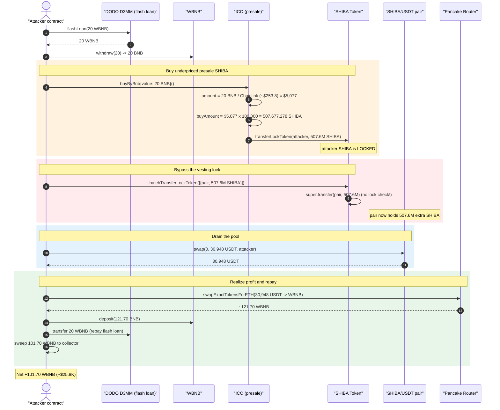
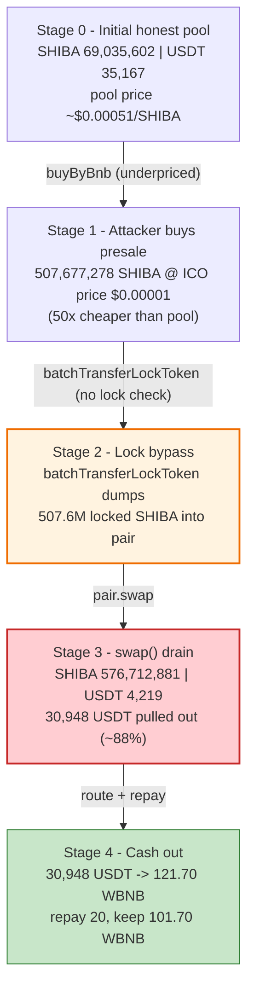
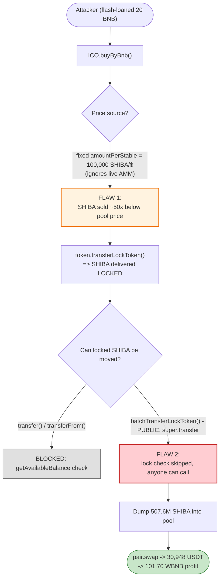

# SHIBAINU DAO Exploit — Underpriced ICO Sale + Lock-Bypassing `batchTransferLockToken` Pool Drain

> **Vulnerability classes:** vuln/oracle/price-manipulation · vuln/access-control/missing-auth

> **Reproduction:** the PoC compiles & runs in an isolated Foundry project at
> [this project folder](.) (the umbrella DeFiHackLabs repo contains several
> unrelated PoCs that do not whole-compile, so this one was extracted).
> Full verbose trace: [output.txt](output.txt).
> Verified vulnerable sources: [SHIBA `Token`](sources/Token_13B1F2/contracts_Token.sol)
> and [`ICO`](sources/ICO_A4227d/contracts_ICO.sol).

---

## Key info

| | |
|---|---|
| **Loss** | ~**$31K** — attacker walked off with **101.70 WBNB** (≈ $25.8K) plus residual USDT, drained from the SHIBA/USDT PancakeSwap pool |
| **Vulnerable contracts** | SHIBA `Token` — [`0x13B1F2E227cA6f8e08aC80368fd637f5084F10a5`](https://bscscan.com/address/0x13B1F2E227cA6f8e08aC80368fd637f5084F10a5#code) (lock bypass) + `ICO` — [`0xA4227de36398851aEBf4A2506008D0Aab2dd0E71`](https://bscscan.com/address/0xA4227de36398851aEBf4A2506008D0Aab2dd0E71#code) (underpriced sale) |
| **Victim pool** | SHIBA/USDT pair — [`0xa19D2674A8E2709a92e04403F721d8448f802e1f`](https://bscscan.com/address/0xa19D2674A8E2709a92e04403F721d8448f802e1f) |
| **Attacker EOA** | [`0xb9bdc2537C6F4B587A5C81A67e7e3a4e6dDDa189`](https://bscscan.com/address/0xb9bdc2537c6f4b587a5c81a67e7e3a4e6ddda189) |
| **Attacker contract** | [`0xda148143379ae54e06d2429a5c80b19d4a9d6734`](https://bscscan.com/address/0xda148143379ae54e06d2429a5c80b19d4a9d6734) |
| **Attack tx** | [`0x75a26224da9faf37c2b3a4a634a096af7fec561f631a02c93e11e4a19d159477`](https://explorer.phalcon.xyz/tx/bsc/0x75a26224da9faf37c2b3a4a634a096af7fec561f631a02c93e11e4a19d159477) |
| **Chain / block / date** | BSC / **33,528,882** / **2023-11-16** |
| **Compiler** | SHIBA `Token` & `ICO`: Solidity **v0.8.17**, optimizer off (200 runs); pair: v0.5.16 |
| **Bug class** | Mispriced primary-sale oracle **+** broken vesting-lock enforcement (missing access control / lock check on `batchTransferLockToken`) → flash-loan-funded arbitrage drain |

---

## TL;DR

The SHIBAINU DAO presale (`ICO.buyByBnb`) sold SHIBA at a **fixed `amountPerStable` rate of 100,000 SHIBA per $1** — i.e. $0.00001 per SHIBA. At the fork block the *live* SHIBA/USDT PancakeSwap pool valued SHIBA at **~$0.00051**, a **~50× higher price**. The presale was therefore selling SHIBA at a 98%-discount to the open market.

That mispricing alone would have been blocked by SHIBA's vesting design: every ICO purchase routes through `Token.transferLockToken`, which records the purchased amount as a **locked** balance and the overridden `transfer()` refuses to move locked tokens ([Token.sol:76-81](sources/Token_13B1F2/contracts_Token.sol#L76-L81)). The attacker could not normally sell the cheap presale tokens.

The second bug defeats that protection: `Token.batchTransferLockToken` ([Token.sol:63-74](sources/Token_13B1F2/contracts_Token.sol#L63-L74)) is **`public`, has no access control, and moves tokens via `super.transfer` — skipping the lock check entirely.** Anyone can call it to push their own (locked) balance anywhere. So the attacker:

1. Flash-loans 20 WBNB from DODO, unwraps to 20 BNB.
2. Calls `ICO.buyByBnb{value: 20 BNB}` — receives **507,677,278 SHIBA** (≈5.077e26 wei) at the underpriced rate, recorded as *locked*.
3. Calls `batchTransferLockToken([{pair, 507,677,278 SHIBA}])` — the unguarded path ships the *locked* SHIBA straight into the SHIBA/USDT pair, bypassing the vesting lock.
4. Calls `pair.swap(...)` to extract **30,948 USDT** from the pool's reserves (the 507M dumped SHIBA crush the pool, which only held ~69M SHIBA / 35.2K USDT).
5. Routes USDT → WBNB on PancakeSwap (≈121.7 WBNB), repays the 20 WBNB flash loan, and keeps **101.70 WBNB** (~$25.8K).

Net result: the attacker converted a flash-loaned 20 BNB into ~$5,077 of artificially-cheap presale SHIBA and arbitraged it against the real pool, walking off with the pool's liquidity.

---

## Background — what SHIBAINU DAO is

The deployment is a two-contract presale system on BSC:

- **`Token` ("SHIBAINU DAO", symbol `SHIBA`)** — an `ERC20PresetMinterPauser` with a bolted-on **vesting lock** ([contracts_Token.sol](sources/Token_13B1F2/contracts_Token.sol)). Total supply is `10**12 * 10**18` (1 trillion SHIBA). Buyers receive tokens whose `lockedBalance` vests linearly (`unlockPercent`%/`duration`); the overridden `transfer`/`transferFrom` forbid spending the locked portion.
- **`ICO`** — the presale ([contracts_ICO.sol](sources/ICO_A4227d/contracts_ICO.sol)). It sells SHIBA for BNB/USDT/BUSD. The BNB path converts `msg.value` to a "stable" amount using a Chainlink price feed, multiplies by a fixed `amountPerStable`, and hands the tokens to the buyer via `token.transferLockToken(...)` so they arrive *locked*.

On-chain parameters at the fork block (read from the trace):

| Parameter | Value |
|---|---|
| ICO `amountPerStable` | **100,000** SHIBA per $1 (⇒ ICO price $0.00001/SHIBA) |
| Chainlink-derived BNB value | ~$253.8 / BNB (20 BNB ≈ **$5,077**) |
| SHIBA balance held by ICO contract | **99,762,432,776 SHIBA** (9.976e28 wei) — plenty of inventory |
| SHIBA/USDT pool reserves (pair `0xa19D…`) | **69,035,602 SHIBA** / **35,167 USDT** ⇒ pool price **$0.00051/SHIBA** |
| **ICO price vs pool price** | **~50× discount in the presale** |

The whole exploit is the gap between those two prices, made monetizable by the lock-bypass.

---

## The vulnerable code

### 1. The presale sells at a fixed, market-blind rate

```solidity
// ICO.sol
function buyByBnb(address _referrer) external payable {
    validate(msg.value);

    uint256 stablePerBnb = uint256(getLatestPrice()); // USDT/ETH
    uint256 amount       = msg.value.mul(10 ** 18).div(stablePerBnb);
    uint256 buyAmount    = amount.mul(amountPerStable);            // <-- amountPerStable = 100,000
    require(buyAmount   <= token.balanceOf(address(this)), "Not Enough Token To Buy");

    token.transferLockToken(msg.sender, buyAmount);               // <-- tokens delivered LOCKED
    ...
}
```
[ICO.sol:70-78](sources/ICO_A4227d/contracts_ICO.sol#L70-L78)

`amountPerStable` is an admin-set constant ([ICO.sol:60-63](sources/ICO_A4227d/contracts_ICO.sol#L60-L63)). It is never reconciled against the live AMM price, so once the open-market price diverged from the presale price (here, 50×), the presale became a standing arbitrage faucet. The Chainlink feed only prices BNB→USD; it does **not** price SHIBA, so the SHIBA-per-USD rate is purely the static `amountPerStable`.

### 2. The vesting lock — and the function that ignores it

The lock is enforced *only* on the overridden public `transfer`/`transferFrom`:

```solidity
function transfer(address _to, uint256 _amount) public override returns (bool) {
    uint256 availableAmount = getAvailableBalance(_msgSender());
    require(availableAmount >= _amount, "Not Enough Available Token");   // <-- lock check
    return super.transfer(_to, _amount);
}

function getAvailableBalance(address _wallet) public view returns (uint256) {
    return balanceOf(_wallet).sub(users[_wallet].lockedBalance);          // balance MINUS locked
}
```
[Token.sol:76-92](sources/Token_13B1F2/contracts_Token.sol#L76-L92)

But `batchTransferLockToken` is **`public` with no `onlyOwner`/`onlyRole`/`payer` modifier**, and it moves tokens through `super.transfer` (the *parent* ERC20, which has **no** lock check):

```solidity
function batchTransferLockToken(Airdrop[] memory _airdrops) public {       // <-- PUBLIC, no auth
    for (uint256 i = 0; i < _airdrops.length; i++) {
        // don't use this.transferTokenLock because payer modifier
        address wallet = _airdrops[i].wallet;
        uint256 amount = _airdrops[i].amount;

        users[wallet].lockedBalance   = users[wallet].lockedBalance.add(amount);   // locks the RECIPIENT
        users[wallet].unlockPerSecond = users[wallet].lockedBalance.mul(unlockPercent).div(100).div(duration);

        super.transfer(wallet, amount);                                    // <-- bypasses lock check on SENDER
    }
}
```
[Token.sol:63-74](sources/Token_13B1F2/contracts_Token.sol#L63-L74)

The sibling `transferLockToken` ([Token.sol:56-61](sources/Token_13B1F2/contracts_Token.sol#L56-L61)) is likewise public and lock-bypassing. The developer comment ("don't use this.transferTokenLock because payer modifier") shows these helpers were intentionally written to *skip* the restriction — apparently meant only for the ICO/owner to distribute, but left callable by anyone.

---

## Root cause — why it was possible

Two independent flaws compose into a critical, permissionless drain:

1. **Stale / market-blind presale price.** `ICO.buyByBnb` sells SHIBA at a fixed `amountPerStable` (100,000 SHIBA/$1) with no reference to the live AMM price. When the open market priced SHIBA ~50× higher, the presale became free money — buy cheap from the ICO, sell dear on the pool.

2. **Vesting lock is trivially bypassable.** The protection that should have stopped that arbitrage — the vesting lock on presale tokens — is enforced *only* on `transfer`/`transferFrom`. `batchTransferLockToken` (and `transferLockToken`) are `public`, unauthenticated, and call `super.transfer`, which performs **no `getAvailableBalance` check**. So the attacker moves freshly-bought *locked* SHIBA straight into the pool. The lock that was supposed to gate-keep presale liquidity is a no-op for anyone who knows to call the batch function.

Either flaw alone is bounded: with no lock bypass, the cheap tokens would be frozen and unsellable; with a fair presale price, dumping them would yield nothing. Together, a flash loan turns 20 borrowed BNB into the pool's entire USDT reserve.

A subtle aggravator: `batchTransferLockToken` *re-locks the recipient* (it adds `amount` to `users[pair].lockedBalance`). That does not impede the attack — the recipient is the **pair**, and the subsequent extraction is a `pair.swap()` that transfers **USDT out**, not SHIBA, so the pair's SHIBA lock is irrelevant.

---

## Preconditions

- The presale (`ICO`) is live (`block.timestamp` within `[startTime, endTime]`, [ICO.sol:179-183](sources/ICO_A4227d/contracts_ICO.sol#L179-L183)) and holds sufficient SHIBA inventory (it held ~9.98e28 wei — far more than needed).
- The ICO's fixed `amountPerStable` undervalues SHIBA relative to the live SHIBA/USDT pool (50× gap here).
- The SHIBA/USDT pool holds meaningful USDT liquidity to extract (~35.2K USDT).
- Capital to fund the presale buy — **flash-loanable**: the attacker borrowed 20 WBNB from DODO's `DPP` pool (`D3MM` at `0xFeAFe253802b77456B4627F8c2306a9CeBb5d681`) and repaid it within the same transaction.

---

## Attack walkthrough (with on-chain numbers from the trace)

All figures are taken directly from [output.txt](output.txt). The flash-loan callback `DPPFlashLoanCall` ([test/ShibaToken_exp.sol:161-196](test/ShibaToken_exp.sol#L161-L196)) executes the whole sequence.

| # | Step | Trace ref | Concrete numbers |
|---|------|-----------|------------------|
| 0 | **Flash loan** 20 WBNB from DODO `D3MM` | [L12-L18](output.txt#L12) | +20 WBNB (2e19 wei) to attacker |
| 1 | **Unwrap** WBNB → 20 BNB (`withdraw`) | [L22-L28](output.txt#L22) | 20 WBNB → 20 BNB |
| 2 | **Approve** USDT to ICO (unlimited) | [L29-L33](output.txt#L29) | approve `xa422` = `type(uint256).max` |
| 3 | **Buy presale** `ICO.buyByBnb{value:20 BNB}(0x0)` | [L37-L52](output.txt#L37) | Chainlink BNB≈$253.8 ⇒ buyAmount = 5,077 × 100,000 = **507,677,278 SHIBA** sent (locked) to attacker |
| 4 | **Snapshot** attacker SHIBA balance | [L53-L54](output.txt#L53) | balanceOf = **507,677,278 SHIBA** (5.076e26) |
| 5 | **Quote** `getAmountsOut(507.6M SHIBA → USDT)` | [L55-L58](output.txt#L55) | pool reserves: **69,035,602 SHIBA / 35,167 USDT** |
| 6 | **Lock bypass** `batchTransferLockToken([{pair, 507.6M SHIBA}])` | [L59-L66](output.txt#L59) | locked SHIBA shipped to pair `0xa19D…` via `super.transfer` |
| 7 | **Drain** `pair.swap(0, 30,948 USDT, attacker)` | [L67-L84](output.txt#L67) | pool → attacker **30,948.07 USDT** (3.094e22); reserves resync to **576,712,881 SHIBA / 4,219 USDT** |
| 8 | **Approve + route** USDT → WBNB via Pancake router | [L87-L132](output.txt#L87) | swapExactTokensForETH over USDT/WBNB pair `0x16b9…` ⇒ **121.70 WBNB** |
| 9 | **Re-wrap** 121.70 BNB → WBNB (`deposit`) | [L133-L137](output.txt#L133) | +121.697 WBNB |
| 10 | **Repay** flash loan: transfer 20 WBNB to `D3MM` | [L138-L143](output.txt#L138) | −20 WBNB to DODO |
| 11 | **Sweep profit** transfer 101.70 WBNB to collector `0x1874…` | [L146-L151](output.txt#L146) | **+101.697 WBNB** profit out |

### Why step 7 drains so much

The attacker dumped **507,677,278 SHIBA** into a pool whose entire reserve was only **69,035,602 SHIBA**. The input is ~7.4× the pool's SHIBA reserve, so the constant-product swap pulls almost all of the 35,167 USDT out — `getAmountsOut` quoted, and `swap` delivered, **30,948 USDT (~88% of the pool's USDT)**. The remaining USDT side is left at ~4,219 USDT. The pool's honest LPs absorbed the loss: they're left holding 507M+ near-worthless presale SHIBA against a gutted USDT reserve.

---

## Profit / loss accounting

| Direction | Amount |
|---|---:|
| Borrowed — DODO flash loan | 20.00 WBNB |
| Spent — presale buy (the unwrapped 20 BNB) | 20.00 BNB (≈ $5,077) |
| Received — USDT drained from pool | 30,948.07 USDT |
| Received — USDT routed to WBNB | 121.70 WBNB |
| Repaid — DODO flash loan | −20.00 WBNB |
| **Net profit swept to attacker** | **+101.697 WBNB (≈ $25.8K)** + ~26.5 USDT residual |

At the trace's BNB price (~$253.8), 101.70 WBNB ≈ **$25,815**; with the residual USDT and rounding, the publicly-reported headline loss is **~$31K**. The attacker's only real cost was the flash-loan fee and gas — the 20 BNB "spent" on the presale was borrowed and repaid in the same transaction.

---

## Diagrams

### Sequence of the attack



### Pool state evolution (SHIBA/USDT pair)



### Where the two flaws compose



---

## Remediation

1. **Enforce the vesting lock on every transfer path.** `batchTransferLockToken` and `transferLockToken` must apply the same `getAvailableBalance` / locked-balance check as the overridden `transfer`, or be made internal. Routing through `super.transfer` to *deliberately* skip the check (per the in-code comment) defeats the entire vesting design.
2. **Add access control to distribution helpers.** `batchTransferLockToken`/`transferLockToken` should be `onlyOwner` or restricted to the ICO contract (e.g. a `MINTER`/distributor role). They are not airdrop endpoints the public should call.
3. **Price the presale against the live market, or cap arbitrage.** A fixed `amountPerStable` that ignores the AMM price is an open arbitrage faucet whenever the market price rises. Either derive the SHIBA price from a manipulation-resistant oracle/TWAP of the pool, or bound the per-address / per-block purchase size so the presale cannot be flash-loan-drained in one shot.
4. **Do not deliver freshly-sold tokens as transferable.** Even with the lock recorded, the bypass made it moot; with (1) fixed, the presale lock alone would have neutralized the arbitrage by freezing the cheap tokens until vesting.
5. **Block contracts / same-block buy-then-sell** on the presale (e.g. `tx.origin == msg.sender` or a one-block hold) to remove flash-loan composability.

---

## How to reproduce

The PoC was extracted into a standalone Foundry project (the umbrella DeFiHackLabs repo has several unrelated PoCs that fail to compile under a whole-project `forge build`):

```bash
_shared/run_poc.sh 2023-11-ShibaToken_exp -vvvvv
```

- RPC: a **BSC archive** endpoint is required — `setUp()` forks BSC at block **33,528,882** ([test/ShibaToken_exp.sol:133-136](test/ShibaToken_exp.sol#L133-L136)), which most pruned public RPCs cannot serve (they fail with `header not found` / `missing trie node`).
- Result: `[PASS] test()`.

Expected tail (see [output.txt](output.txt#L163)):

```
    ├─ [531] 0x55d3...955::balanceOf(ShibaToken_exp) [staticcall]
    │   └─ ← [Return] 26510000000000000000 [2.651e19]
    └─ ← [Stop]

Suite result: ok. 1 passed; 0 failed; 0 skipped; finished in 14.53s
Ran 1 test suite ...: 1 tests passed, 0 failed, 0 skipped (1 total tests)
```

The profit (101.697 WBNB ≈ $25.8K, headline ~$31K with residuals) is swept to collector `0x1874726c8c9a501836929F495A8b44968FBfdad8` in the final `WBNB.transfer` ([output.txt:L146-L151](output.txt#L146)).

---

*Reference: DeFiHackLabs — SHIBA / SHIBAINU DAO, BSC, Nov 2023, ~$31K.*
