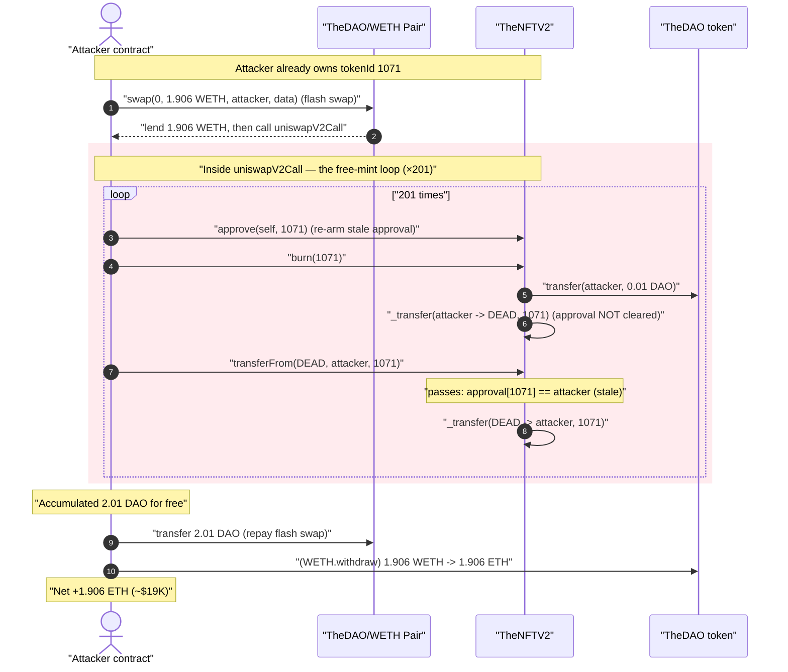
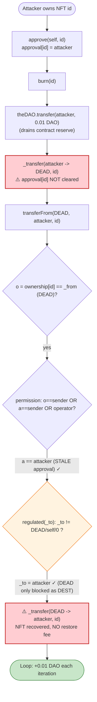
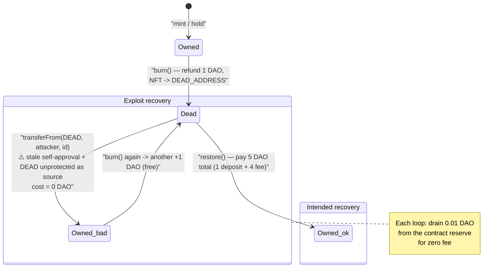

# TheNFTV2 Exploit — Broken `transferFrom` Access Control Lets Anyone Re-Pull Burned NFTs and Drain Their Wrapped DAO

> **Reproduction:** the PoC compiles & runs in an isolated Foundry project at
> [this project folder](.) (the umbrella DeFiHackLabs repo contains many
> unrelated PoCs that do not whole-compile, so this one was extracted).
> Full verbose trace: [output.txt](output.txt).
> Verified vulnerable source: [TheNFTV2.sol](sources/TheNFTV2_79a7D3/TheNFTV2.sol).

---

## Key info

| | |
|---|---|
| **Loss** | ~$19,000 — **1.906 WETH** drained from the TheDAO/WETH Uniswap-V2 pool |
| **Vulnerable contract** | `TheNFTV2` — [`0x79a7D3559D73EA032120A69E59223d4375DEb595`](https://etherscan.io/address/0x79a7D3559D73EA032120A69E59223d4375DEb595#code) |
| **Victim asset** | The DAO tokens (`TheDAO`) wrapped inside burned NFTs, sold into the [TheDAO/WETH Uniswap pair `0xE1eCaDb5...0db`](https://etherscan.io/address/0xE1eCaDb5FEC254c2c893C230b935Db30b8FfF0db) |
| **Attacker EOA** | [`0x2F746bC70f72aAF3340B8BbFd254fd91a3996218`](https://etherscan.io/address/0x2F746bC70f72aAF3340B8BbFd254fd91a3996218) |
| **Attacker contract** | [`0x85301f7b943fd132c8dBc33f8FD9d77109A84f28`](https://etherscan.io/address/0x85301f7b943fd132c8dBc33f8FD9d77109A84f28) |
| **Attack tx** | [`0xd5b4d68432cbbd912130bbb5b93399031ddbb400d8f723c78050574de7533106`](https://etherscan.io/tx/0xd5b4d68432cbbd912130bbb5b93399031ddbb400d8f723c78050574de7533106) |
| **Chain / block / date** | Ethereum mainnet / 18,647,450 / ~Nov 27, 2023 |
| **Compiler** | Solidity v0.8.11, optimizer **2,000,000 runs** |
| **Bug class** | Broken access control — `transferFrom` permits moving a token *out of the burn ("dead") address* with no approval, enabling infinite re-mint/re-burn of a single NFT and recovery of its wrapped DAO |

---

## TL;DR

`TheNFTV2` is an NFT that **wraps one DAO token per NFT**. Burning an NFT (`burn()`) refunds
1 DAO (here `oneDao = 1e16` wei) to the caller and sends the NFT to a constant **dead address**
(`0x…74eda0`). The intended way to get a burned NFT back is `restore()`, which charges a 5-DAO total
fee.

The bug is that `transferFrom()`
([TheNFTV2.sol#L1092 of the source bundle](sources/TheNFTV2_79a7D3/TheNFTV2.sol)) authorizes the
move whenever `msg.sender` is the owner **or** holds an approval — but the dead address is just a
plain `address` that can never grant approvals, *and the function never excludes it as a source*.
The `regulated` modifier blocks the dead address only as a **destination**, not as a **source**.

So an attacker can:

1. `burn(id)` → receive 1 DAO, NFT goes to the dead address.
2. `transferFrom(deadAddress, attacker, id)` → **pull the same NFT straight back out of the
   graveyard for free** (no `restore()`, no fee), because the ownership/approval check passes the
   moment `_from == ownership[id]` and the attacker is the owner-of-record... wait — it passes
   for a subtler reason: see Root Cause below.
3. Repeat. Each cycle nets another **1 DAO** drained from the NFT contract's wrapped-DAO reserve.

In the live attack the attacker looped a single NFT (`tokenId 1071`) **201 times**, accumulating
**2.01 DAO**, then sold that DAO into the Uniswap TheDAO/WETH pair (via a flash-swap callback) for
**1.906 WETH (~$19K)**.

---

## Background — what TheNFTV2 does

`TheNFTV2` ([source](sources/TheNFTV2_79a7D3/TheNFTV2.sol)) is "TheDAO SEC Report NFT": each of the
1,800 NFTs has exactly **1 DAO token wrapped inside it**. The contract's documented rules:

> 1. Each NFT requires 1 DAO token to be minted
> 2. The DAO token will be wrapped inside the NFT
> 3. The DAO token can be unwrapped
> 4. When unwrapped, the NFT gets transferred to the "Dead Address"
> 5. The NFT can be restored from the "Dead Address" with **4 DAO restoration fee**
> 6. the restoration fee goes to the Curator

The economically important consequence of rule 1/2: **the NFT contract holds a pool of DAO tokens**
— one per outstanding (un-burned) NFT. `burn()` pays one of those DAO out:

```solidity
function burn(uint256 id) external {
    require (msg.sender == ownership[id], "only owner can burn");
    if (theDAO.transfer(msg.sender, oneDao)) {   // send theDAO token back to sender
        _transfer(msg.sender, DEAD_ADDRESS, id); // burn the NFT token
        emit Burn(msg.sender, id);
    }
}
```

`DEAD_ADDRESS = address(0x74eda0)` is a hard-coded constant. NFTs sent there are supposed to be
recoverable **only** through `restore()`, which charges 5 DAO total (1 DAO deposit + 4 DAO fee to the
curator):

```solidity
function restore(uint256 id) external {
    require(DEAD_ADDRESS == ownership[id], "must be dead");
    require(theDAO.transferFrom(msg.sender, address(this), oneDao), "DAO deposit insufficient");
    require(theDAO.transferFrom(msg.sender, curator, oneDao*fee), "DAO fee insufficient");
    _transfer(DEAD_ADDRESS, msg.sender, id);
    emit Restore(msg.sender, id);
}
```

The whole security model rests on the assumption: **once an NFT is in the dead address, the only way
out is `restore()`** (which re-funds the wrapped DAO and costs the attacker more than they'd get
back). If that assumption breaks, the wrapped-DAO pool can be milked for free.

---

## The vulnerable code

### `transferFrom` does not protect the dead address as a *source*

```solidity
function transferFrom(address _from, address _to, uint256 _tokenId) external regulated(_to) {
    require (_tokenId < max, "index out of range");
    address o = ownership[_tokenId];
    require (o == _from, "_from must be owner");
    address a = approval[_tokenId];
    require (o == msg.sender || (a == msg.sender) || (approvalAll[o][msg.sender]), "not permitted");
    _transfer(_from, _to, _tokenId);
    if (a != address(0)) {
        approval[_tokenId] = address(0); // clear previous approval
        emit Approval(msg.sender, address(0), _tokenId);
    }
}
```

And the `regulated` modifier — note it only constrains the **destination** `_to`:

```solidity
modifier regulated(address _to) {
    require(_to != DEAD_ADDRESS, "cannot send to dead address");
    require(_to != address(this), "cannot send to self");
    require(_to != address(0),    "cannot send to 0x");
    _;
}
```

`_transfer` is a bare bookkeeping function with no checks of its own:

```solidity
function _transfer(address _from, address _to, uint256 _tokenId) internal {
    balances[_to]++;
    balances[_from]--;
    ownership[_tokenId] = _to;
    emit Transfer(_from, _to, _tokenId);
}
```

---

## Root cause — why anyone can resurrect a burned NFT for free

The whole exploit is the **`approve` → `burn` → `transferFrom(dead → me)` cycle**, and the precise
reason it works is the *ordering and target of the approval*:

1. The attacker owns the NFT and calls **`approve(self, id)`** — sets `approval[id] = attacker`.
2. The attacker calls **`burn(id)`** while still the owner. `burn` refunds 1 DAO and moves the NFT
   to `DEAD_ADDRESS`. **Crucially, `burn` → `_transfer` does NOT clear `approval[id]`.** The stale
   approval `approval[id] = attacker` survives the burn.
3. Now `ownership[id] == DEAD_ADDRESS`, but `approval[id] == attacker`. The attacker calls
   **`transferFrom(DEAD_ADDRESS, attacker, id)`**:
   - `o = ownership[id] = DEAD_ADDRESS`, and the call passes `_from = DEAD_ADDRESS`, so
     `require(o == _from)` ✓.
   - The permission check `o == msg.sender || a == msg.sender || approvalAll[o][msg.sender]`:
     here `a == msg.sender` (the **stale approval from step 1 still points at the attacker**) ✓.
   - `_to = attacker` passes `regulated` (not dead/self/zero) ✓.
   - `_transfer(DEAD_ADDRESS, attacker, id)` executes — the NFT is back in the attacker's hands, and
     `approval[id]` is reset to `0`.

So there are **two cooperating defects**:

> **Defect A — stale approval survives the burn.** `_transfer` (used by `burn`) never clears
> `approval[id]`, so the pre-burn approval the attacker granted to *itself* remains valid after the
> NFT is in the dead address.
>
> **Defect B — the dead address is unprotected as a transfer source.** `regulated` only forbids the
> dead address as a *destination*. Nothing prevents `transferFrom` from moving a token *out of* the
> dead address, and `restore()` is not the only path to do so.

Together they collapse rule 5 entirely: an attacker recovers a burned NFT **without paying the
5-DAO restore fee**, then immediately burns it again to collect another 1 DAO. Because the NFT
contract holds one wrapped DAO per outstanding NFT, this is a direct drain of the contract's DAO
reserve, one DAO per loop iteration, using a single NFT.

The PoC's `uniswapV2Call` is exactly this loop:

```solidity
do {
    THENFTV2.approve(address(this), nftId);   // re-arm the stale approval
    THENFTV2.burn(nftId);                     // +1 DAO refund, NFT → dead
    THENFTV2.transferFrom(deadaddress, address(this), nftId); // pull it back, free
} while (TheDAO.balanceOf(address(this)) < amountIn);
```

([test/TheNFTV2_exp.sol#L57-L64](test/TheNFTV2_exp.sol#L57-L64))

---

## Preconditions

- The attacker must **own at least one NFT** to seed the loop. In the live attack the attacker held
  `tokenId 1071`; the PoC `vm.prank`s the attacker's contract to receive it
  ([test/TheNFTV2_exp.sol#L41](test/TheNFTV2_exp.sol#L41)).
- The NFT contract must hold enough **wrapped DAO** to satisfy the refunds the attacker wants to
  extract (one DAO per loop). With ~1,800 NFTs outstanding the reserve was far larger than the small
  amount actually milked here.
- A liquid market to convert the recovered DAO to value. The attacker used the
  TheDAO/WETH Uniswap-V2 pair and wrapped the whole thing in a **flash swap**: it borrows the WETH
  first, then repays in DAO inside `uniswapV2Call`, so **no upfront capital** is required — the
  attack is effectively free to launch.

---

## Attack walkthrough (with on-chain numbers from the trace)

All figures are taken directly from [output.txt](output.txt). The pair's
`token0 = TheDAO`, `token1 = WETH`, so `reserve0 = DAO`, `reserve1 = WETH`.

| # | Step | Trace evidence | Effect |
|---|------|----------------|--------|
| 0 | **Seed.** Attacker receives `tokenId 1071` from its EOA | [output.txt:33](output.txt) `transferFrom(0x8530…, attacker, 1071)` | Attacker owns the loop NFT. |
| 1 | **Flash swap.** `uniswap.swap(0, 1.906e18 WETH, attacker, data)` — borrow 1.906 WETH first, callback runs before repayment | [output.txt:40](output.txt) `Uniswap Pair::swap(0, 1906331836125411716, …)` | Pool reserves at entry: **102.76 DAO / 99.97 WETH**, `k = 1.027e40`. |
| 2 | Inside `uniswapV2Call`: compute DAO repayment needed | [output.txt:51](output.txt) `amountIn: 2003732608720340626` (≈ **2.0037 DAO**) | Attacker now knows it must source ~2.004 DAO. |
| 3 | **The milk loop ×201**: `approve(self,1071)` → `burn(1071)` (+0.01 DAO, NFT→dead) → `transferFrom(dead, attacker, 1071)` | [output.txt:52-67](output.txt) first cycle; **201 `Burn` events / 402 `transferFrom`-from-dead calls** total | Each cycle drains **0.01 DAO** (`oneDao = 1e16`) from the NFT contract. 201 × 0.01 = **2.01 DAO** accumulated. |
| 4 | **Repay the flash swap.** Transfer all 2.01 DAO to the pair | [output.txt:6486](output.txt) `TheDAO::transfer(Uniswap Pair, 2010000000000000000)` | Repays the 1.906 WETH loan; surplus DAO stays in the pool as the attacker's "fee". |
| 5 | **Unwrap WETH → ETH.** `WETH.withdraw(1.906e18)` | [output.txt:6496](output.txt) `WETH::withdraw(1906331836125411716)` | Attacker walks away with **1.906 ETH (~$19K)**. |
| — | Pool after attack: **104.77 DAO / 98.06 WETH** | [output.txt](output.txt) closing `Sync(104774715138530020199, 98063547314764175838)` | Pool lost 1.906 WETH, gained ~2.01 DAO. |

**Why "0.01 DAO per loop":** `oneDao = 1e16`. `burn()` does
`theDAO.transfer(msg.sender, oneDao)` — exactly 0.01 DAO refunded per call. The trace shows the
attacker's DAO balance climbing `… → 2.00 DAO → 2.01 DAO` ([output.txt:6451, 6483](output.txt))
right before the repayment transfer of `2.01e18`.

### Profit / loss accounting

| Item | Amount |
|---|---:|
| WETH flash-borrowed from the pair | 1.906331836125411716 WETH |
| DAO repaid into the pair (201 × 0.01 DAO) | 2.010000000000000000 DAO |
| DAO required to repay the 1.906 WETH (`getAmountIn`) | ≈ 2.003732608720340626 DAO |
| Surplus DAO left in pool (rounding/over-collection) | ≈ 0.0063 DAO |
| **Net to attacker** | **+1.906 WETH (~$19K)** |

The attacker's starting ETH/WETH balance was **0** ([output.txt:6, 30](output.txt)) and it ends with
`1906331836125411716` wei of ETH — confirming the attack is fully self-funded via the flash swap and
the only "cost" is gas. The 2.01 DAO handed to the pool was itself extracted for free from the NFT
contract's wrapped-DAO reserve.

---

## Diagrams

### Sequence of the attack



### The flaw inside the burn / re-pull cycle



### Intended vs. actual lifecycle of a burned NFT



---

## Why each magic number

- **`tokenId 1071`:** simply the NFT the attacker happened to own — any owned NFT works; the bug is
  per-token-id and reusable indefinitely on one id.
- **201 iterations:** the loop runs until the attacker holds enough DAO to repay the flash swap.
  `getAmountIn(1.906 WETH)` ≈ **2.0037 DAO**; at **0.01 DAO per burn** that needs `ceil(2.0037/0.01) =
  201` cycles → **2.01 DAO** accumulated, comfortably above the repayment.
- **`amount1Out = 1.906331836125411716 WETH`:** the attacker hand-tuned the borrow so that the
  required DAO repayment was just under what 201 loops yields, maximizing WETH extracted in one shot
  while keeping the flash swap solvent.
- **`oneDao = 1e16`:** the contract's definition of "1 DAO" in the refund — this is the per-iteration
  leak size.

---

## Remediation

1. **Clear approvals on every transfer, including burns.** `_transfer` must reset
   `approval[_tokenId] = address(0)` (and emit the cleared `Approval`) so a pre-burn approval can
   never authorize a later move *out of* the dead address. This single fix breaks the exploit's
   permission check.
2. **Treat the dead address as untouchable at the source too.** Either store burned NFTs at
   `address(0)`/an explicit non-recoverable sentinel, or add `require(_from != DEAD_ADDRESS)` to
   every transfer path so the only way out of the graveyard is the fee-charging `restore()`.
3. **Don't refund value before state is finalized / make burn idempotent per id.** The economic leak
   only matters because `burn()` pays out DAO each time. Track a per-id "burned" flag so a token that
   is already in the dead address cannot be burned again to collect a second refund, even if it is
   somehow re-acquired.
4. **Use a battle-tested ERC-721 implementation.** OpenZeppelin's `_transfer`/`_burn` clear approvals
   and forbid spurious source moves by construction; the custom bookkeeping here re-implemented the
   standard and dropped the approval-clear invariant.

---

## How to reproduce

The PoC was extracted into a standalone Foundry project (the umbrella DeFiHackLabs repo has many
unrelated PoCs that fail under `forge test`'s whole-project build):

```bash
_shared/run_poc.sh 2023-11-TheNFTV2_exp -vvvvv
```

- RPC: a **mainnet archive** endpoint is required (fork block `18_647_450`). The project's
  `mainnet` alias must point at an archive node that serves historical state at that block; most
  pruned public RPCs fail with `header not found` / `missing trie node`.
- Result: `[PASS] test()`. The closing log line is
  `Attacker ETH balance after exploit: 79228162516170669429669362051` — this is the test contract's
  **total** ETH balance, which Foundry seeds with a huge default; it is not the profit. The
  meaningful number is the `1906331836125411716` wei = **1.906 ETH** received via the
  `WETH::withdraw(1906331836125411716)` call ([output.txt:6496](output.txt)), confirmed by the test's
  `assert(balanceAfter > balanceBefore)` ([test/TheNFTV2_exp.sol#L45](test/TheNFTV2_exp.sol#L45)).

Expected tail:

```
Ran 1 test for test/TheNFTV2_exp.sol:TheNFTV2Test
[PASS] test() (gas: 10930940)
...
Suite result: ok. 1 passed; 0 failed; 0 skipped
```

---

*Reference: MetaTrust Alert — https://x.com/MetaTrustAlert/status/1728616715825848377 (TheNFTV2,
Ethereum, ~$19K).*
