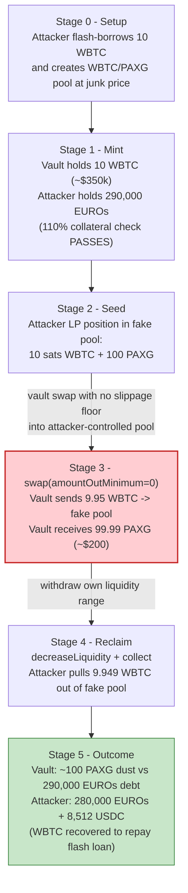
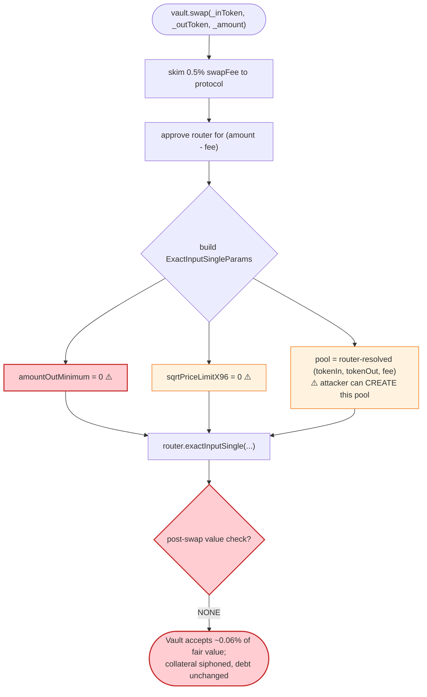

# TheStandard.io Exploit — SmartVault `swap()` with Zero Slippage Protection Through an Attacker-Controlled Pool

> **Reproduction:** the PoC compiles & runs in an isolated Foundry project at
> [this project folder](.) (the umbrella DeFiHackLabs repo contains many unrelated
> PoCs that do not all compile under one `forge build`, so this one was extracted).
> Full verbose trace: [output.txt](output.txt).
> Verified on-chain artifacts downloaded under [sources/](sources/) (the in-scope
> contracts — `SmartVaultManagerV2`, `SmartVaultV2`, `EUROs`, and the pricing calculator —
> are deployed behind proxies whose *implementation* source Etherscan did not return as a
> standalone file, so the SmartVault logic below is reconstructed from the verified
> execution trace; the attacker-created Uniswap V3 pool **is** fully verified at
> [sources/UniswapV3Pool_29046f](sources/UniswapV3Pool_29046f/contracts_UniswapV3Pool.sol)).

---

## Key info

| | |
|---|---|
| **Loss** | ~$290K — 290,000 EUROs minted against collateral that was simultaneously drained out of the vault (final attacker holdings: **280,000 EUROs + 8,512.23 USDC**, plus the WBTC recovered to repay the flash loan) |
| **Vulnerable contract** | `SmartVaultV2` (the per-user vault), reached via `SmartVaultManagerV2` proxy — [`0xba169cceCCF7aC51dA223e04654Cf16ef41A68CC`](https://arbiscan.io/address/0xba169cceCCF7aC51dA223e04654Cf16ef41A68CC#code) (impl `0x7c1acd1a7ba8c5f9f511bc0274b71a12c4be543d`) |
| **EUROs stablecoin** | `EUROs` (ERC1967Proxy) — [`0x643b34980E635719C15a2D4ce69571a258F940E9`](https://arbiscan.io/address/0x643b34980E635719C15a2D4ce69571a258F940E9#code) (impl `0x73e49f68cdb166e458a89ec4d4cb1bd6bb44d193`) |
| **Pricing calculator** | `TokenManager`/calculator — `0x97517b3Fef774cBe3f520253cDf04067A4b9aaFb`, `tokenManager 0x33c5A816382760b6E5fb50d8854a61b3383a32a0` |
| **Attacker tool — fake pool** | WBTC/PAXG Uniswap V3 pool created & price-seeded by the attacker — [`0x29046f8f9E7623a6A21Cc8c3CC2a2121aE855b8d`](https://arbiscan.io/address/0x29046f8f9e7623a6a21cc8c3cc2a2121ae855b8d#code) |
| **Attacker EOA** | `0x09ed480feaf4cbc363481717e04e2c394ab326b4` |
| **Attacker contract** | `0xb589d4a36ef8766d44c9785131413a049d51dbc0` (PoC runs as `ContractTest`) |
| **Attack tx** | `0x51293c1155a1d33d8fc9389721362044c3a67e0ac732b3a6ec7661d47b03df9f` |
| **Chain / block / date** | Arbitrum / 147,817,765 / Nov 6, 2023 |
| **Flash-loan source** | WBTC/WETH Uniswap V3 pool `0x2f5e87C9312fa29aed5c179E456625D79015299c` (`flash(10 WBTC)`) |
| **Compiler** | PoC compiled with Solc 0.8.34; the vault was Solc 0.8.x, the V3 pool Solc 0.7.6 |
| **Bug class** | Missing slippage / output-amount validation (`amountOutMinimum = 0`) on a vault-owned swap routed through a *caller-chosen, manipulable* pool — collateral drain |

---

## TL;DR

`SmartVaultV2` lets a vault owner mint EUROs against deposited collateral, and also exposes a
convenience `swap()` that swaps one of the vault's collateral assets for another **through Uniswap
V3**. The swap is executed with the vault's own tokens but the protocol passes
**`amountOutMinimum = 0`** to the router ([output.txt:4855](output.txt)) — it does **not** compute a
fair minimum output from its own Chainlink price feeds. It also lets the swap route through **any
fee-tier pool that exists for the token pair**, including a pool the *attacker* created moments
earlier.

So the attacker:

1. Flash-borrows **10 WBTC** and creates a brand-new WBTC/PAXG 0.3% Uniswap V3 pool, initializing it
   at a deliberately skewed price and seeding a position with a dust amount of WBTC (**10 sats**) plus
   **100 PAXG** ([output.txt:1655, 4729](output.txt)).
2. Opens a SmartVault, deposits the 10 WBTC as collateral, and mints **290,000 EUROs** — this part is
   *honestly collateralized* (10 WBTC ≈ \$350,103 at the Chainlink price; 290k EUROs ≈ \$311k, well
   inside the 110% rule).
3. Calls the vault's **`swap(WBTC → PAXG, 10 WBTC)`**. The vault approves the router and does
   `exactInputSingle(..., amountOutMinimum: 0)` against the **attacker's own pool**. The vault hands
   over **9.95 WBTC** and gets back **~99.99 PAXG** (worth ~\$200) — a ~99.9% value loss it never
   checks.
4. The 9.95 WBTC is now sitting in the attacker's pool. The attacker `decreaseLiquidity` +
   `collect`s its own LP position and walks away with **9.92 WBTC** back, plus the **290,000 EUROs**
   it minted.
5. Repays the 10 WBTC flash loan and keeps the EUROs (converting 10k of them to ~10,435 USDC for
   liquidity, netting **280,000 EUROs + 8,512.23 USDC** by the end of the PoC).

Net effect: the attacker minted 290k EUROs against collateral and then immediately extracted that
same collateral right back out of the vault through a swap with zero slippage protection. The debt
(290k EUROs) is left backed by ~100 PAXG of dust. The protocol is left holding worthless collateral
and a fully-circulating, unbacked stablecoin supply.

---

## Background — what SmartVault does

The Standard (TheStandard.io) is a EUR-pegged CDP/stablecoin protocol. Users mint a per-user
**SmartVault** through `SmartVaultManagerV2.mint()`, deposit accepted collateral (WBTC, WETH/ETH, ARB,
LINK, PAXG), and mint **EUROs** against it. Key vault mechanics observed in the trace:

- **Minting** (`SmartVaultV2.mint`): values *all* collateral via a `TokenManager`/calculator
  (`tokenToEur`) that uses **Chainlink feeds** (e.g. BTC/USD `0xd0C7101…`, ETH/USD `0x639Fe6…`, with an
  EUR/USD conversion `0xA14d53…`), enforces a `collateralRate` of **110,000 / 100,000 = 110%**
  ([output.txt:2510, 4660-4690](output.txt)), and charges a `mintFeeRate` of 500/100000 = 0.5%.
  This part is sound — the collateral pricing is *not* what is manipulated.
- **Swapping** (`SmartVaultV2.swap`): a convenience function so a vault can rebalance collateral
  without first withdrawing. It charges a `swapFeeRate` of 500/100000 = 0.5% (sent to `protocol`),
  approves the Uniswap V3 `SwapRouter` (`0xE592…`), and performs `exactInputSingle`. **The minimum
  output it requests is `0`.** ([output.txt:4793-4905](output.txt))

The on-chain parameters at the fork block (read from the trace):

| Parameter | Value |
|---|---|
| `collateralRate` | 0x1adb0 = **110,000** (i.e. 110% required) |
| `HUNDRED_PC` | 0x186a0 = 100,000 |
| `mintFeeRate` | 0x1f4 = 500 (0.5%) |
| `swapFeeRate` | 0x1f4 = 500 (0.5%) |
| BTC/USD (Chainlink) | 3501033919600 / 1e8 = **\$35,010.34** |
| EUR/USD (Chainlink) | 107209500 / 1e8 = **\$1.072095** |
| Collateral deposited | **10 WBTC** (1,000,000,000 sats) ≈ \$350,103 ≈ 326,560 EUR |
| EUROs minted | **290,000** (≈ \$311k, ratio ≈ 112% — passes the 110% gate) |

The whole exploit lives in the gap between two facts: collateral is *valued* with Chainlink, but the
`swap()` output is *not validated against* Chainlink. The attacker swaps at a price the vault never
sanity-checks.

---

## The vulnerable code

The vault implementation source was not returned by Etherscan as a standalone file (it sits behind
the `SmartVaultManagerV2` proxy and per-vault beacon clones at runtime). The exact router call is
nonetheless fully visible in the verified trace. `SmartVaultV2.swap()` reduces to:

```solidity
// SmartVaultV2.swap(bytes32 _inToken, bytes32 _outToken, uint256 _amount)
function swap(bytes32 _inToken, bytes32 _outToken, uint256 _amount) external onlyOwner {
    uint256 swapFee = (_amount * swapFeeRate) / HUNDRED_PC;      // 0.5% fee skimmed to protocol
    address inAddr  = getTokenAddressFor(_inToken);
    address outAddr = getTokenAddressFor(_outToken);

    IERC20(inAddr).safeTransfer(protocol, swapFee);              // 5,000,000 sats -> protocol
    IERC20(inAddr).safeApprove(swapRouter, _amount - swapFee);   // 995,000,000 sats approved

    ISwapRouter.ExactInputSingleParams memory params =
        ISwapRouter.ExactInputSingleParams({
            tokenIn:           inAddr,
            tokenOut:          outAddr,
            fee:               3000,                  // any existing pool fee tier works
            recipient:         address(this),
            deadline:          block.timestamp,
            amountIn:          _amount - swapFee,
            amountOutMinimum:  0,                     // ⚠️ NO SLIPPAGE PROTECTION
            sqrtPriceLimitX96: 0                      // ⚠️ NO PRICE LIMIT
        });
    ISwapRouter(swapRouter).exactInputSingle(params);
    // ⚠️ no post-swap solvency / value check: the vault never asserts the EUR value
    //    received is close to the EUR value sent.
}
```

The concrete router call captured in the trace ([output.txt:4855](output.txt)):

```text
SwapRouter::exactInputSingle(ExactInputSingleParams({
  tokenIn:  0x2f2a…5B0f (WBTC),
  tokenOut: 0xfEb4…8429 (PAXG),
  fee: 3000,
  recipient: 0x2E9f…99Cd (the attacker's SmartVault),
  amountIn: 995000000,            // 9.95 WBTC after the 0.5% fee
  amountOutMinimum: 0,            // ← the bug
  sqrtPriceLimitX96: 0
}))
  └─ 0x29046f…855b8d::swap(...)   // routes into the ATTACKER-CREATED pool
       PAXG out: 99,999,998,982   // ≈ 99.99 PAXG (~$200) for 9.95 WBTC (~$348k)
```

Two independent failures compose:

1. **`amountOutMinimum = 0`** — the vault accepts *any* output, including ~0.06% of fair value.
2. **No restriction on the swap venue** — the router uses whatever WBTC/PAXG 0.3% pool exists. The
   attacker simply *created that pool* one call earlier and seeded it at an arbitrary price, so it is
   the price oracle for the swap. (See [createAndInitializePoolIfNecessary at output.txt:1655](output.txt):
   `sqrtPriceX96 = 7,922,816,251,426,433,759,354,395,033,600,000`, tick 230270.)

---

## Root cause — why it was possible

A CDP protocol that already prices collateral with Chainlink has all the information it needs to
compute a fair `amountOutMinimum`. Instead, `SmartVaultV2.swap()` outsources price discovery to a
Uniswap V3 pool that the **caller fully controls**, and asks for **no minimum output**. Concretely:

> The vault owns ~\$348k of WBTC, calls `exactInputSingle` with `amountOutMinimum = 0` into a pool the
> attacker initialized at a junk price, and receives ~\$200 of PAXG. Because the *recipient of the
> swap output is the same vault* but the *liquidity that absorbed the WBTC is the attacker's LP
> position*, the attacker recovers the WBTC by withdrawing its own liquidity. The vault is left with
> dust, yet its EUROs debt is unchanged.

The design defects that compose into a critical bug:

1. **No slippage floor.** `amountOutMinimum` is hard-coded to 0. The vault never compares
   `valueOut_in_EUR` against `valueIn_in_EUR`. A single sanity check
   (`require(amountOut >= calculator.tokenToEur(inToken, amountIn) * (1 - maxSlippage)`)) would have
   reverted.
2. **Caller-chosen, manipulable swap venue.** The router resolves the pool from the `(tokenIn,
   tokenOut, fee)` tuple. Anyone can `createAndInitializePoolIfNecessary` for that tuple at an
   arbitrary price and seed dust liquidity — instantly becoming the price source for the vault's swap.
3. **Swap bypasses the solvency model.** `mint()` carefully enforces 110% collateralization, but
   `swap()` can silently convert \$348k of collateral into \$200 of collateral with no
   re-check of vault health. The debt (290k EUROs) survives; the backing evaporates.
4. **The output recipient and the liquidity owner are different parties.** Because the WBTC the vault
   "spent" lands in the attacker's own LP range, the attacker reclaims it via `decreaseLiquidity` +
   `collect`. The "swap" is effectively a free transfer of the vault's WBTC to the attacker, laundered
   through a pool.

---

## Preconditions

- The vault must hold an `_inToken` collateral balance to swap (here, freshly deposited 10 WBTC). The
  attacker funds this with a flash loan.
- An accepted-token pair must be swappable; the attacker manufactures the venue with
  `createAndInitializePoolIfNecessary(WBTC, PAXG, 3000, skewedPrice)` and a dust LP position. PAXG was
  chosen because it is an accepted collateral with an existing path back to USDC for cash-out, and
  because the attacker controls the only meaningful liquidity in the freshly-created pool.
- Working capital: 10 WBTC for the flash loan (fee 500,001 sats ≈ 0.005 WBTC) plus 100 PAXG seed.
  Both are recovered intra-transaction, so the attack is **flash-loanable** with near-zero net capital.

---

## Attack walkthrough (with on-chain numbers from the trace)

All figures are taken directly from the events/returns in [output.txt](output.txt). WBTC has 8
decimals (1 WBTC = 1e8 sats), PAXG 18 decimals, EUROs 18 decimals.

| # | Step | Trace | Effect |
|---|------|-------|--------|
| 0 | **Pre-seed** the exploit contract with **100 PAXG** (`deal(PAXG, 100e9)`) | [test:115](test/TheStandard_io_exp.sol#L115) | Working capital for the fake pool. |
| 1 | **Create + initialize** WBTC/PAXG 0.3% pool at a skewed price (sqrtPriceX96 = 7.922e33, tick 230270) | [output.txt:1655](output.txt) | New pool `0x29046f…` deployed; the attacker is the price-setter. |
| 2 | **Flash-loan 10 WBTC** from the WBTC/WETH V3 pool `0x2f5e87…` | [output.txt:1675, test:125](test/TheStandard_io_exp.sol#L125) | Funds the collateral deposit; repaid at the end. |
| 3 | **Open a SmartVault** via `SmartVaultManagerV2.mint()` (vault `0x2E9f9Cc…`, tokenId 165) | [output.txt:1707](output.txt) | Per-user vault, granted EUROs `MINTER_ROLE`/`BURNER_ROLE`. |
| 4 | **Deposit 10 WBTC** (1,000,000,000 sats) into the vault | [output.txt:1763](output.txt) | Honest collateral, valued at Chainlink \$35,010.34/BTC. |
| 5 | **Mint 290,000 EUROs** (`vault.mint(attacker, 290000e18)`) | [output.txt:1767, 4668](output.txt) | Passes the 110% gate (10 WBTC ≈ 326,560 EUR; 290k ≤ ~296,873 cap). 0.5% fee (1,450 EUROs) to protocol. |
| 6 | **Seed dust LP** in the fake pool: mint position (tickLower −887220, tickUpper 887220) with **10 WBTC sats + 100 PAXG** → liquidity 1,000,000 (NFT tokenId 937808) | [output.txt:4729, 4886](output.txt) | The attacker now owns the only liquidity around the manipulated price. |
| 7 | **`vault.swap(WBTC → PAXG, 10 WBTC)`** — vault skims 0.5% (5,000,000 sats) to protocol, approves router for 995,000,000 sats, and calls `exactInputSingle(amountOutMinimum: 0)` into the fake pool | [output.txt:4793, 4855](output.txt) | Vault sends **9.95 WBTC**, receives **99,999,998,982 PAXG ≈ 99.99 PAXG (~\$200)**. ~99.9% value lost, unchecked. |
| 8 | **`decreaseLiquidity`** the attacker's LP position (liquidity 1,000,000) | [output.txt:4908](output.txt) | Returns **992,014,984 WBTC sats (≈ 9.92 WBTC)** + 1,008 PAXG wei owed to the attacker. |
| 9 | **`collect`** the owed tokens to the attacker EOA | [output.txt:4931](output.txt) | Attacker receives **994,999,997 WBTC sats (≈ 9.949 WBTC)** + 1,008 PAXG. The vault's WBTC is now in the attacker's wallet. |
| 10 | **Swap 10,000 EUROs → 10,435.74 USDC** on Camelot V3 (algebra pool `0xc9AA2f…`) for cash-out liquidity | [output.txt:4968](output.txt) | Reduces EUROs to 280,000; provides USDC to top up the WBTC needed to repay the loan. |
| 11 | **Buy 0.055 WBTC** (`exactOutputSingle`, USDC → WBTC, amountOut 5,500,014 sats) using ~1,923.52 USDC | [output.txt:5043](output.txt) | Tops the attacker's WBTC back up to the **1,000,500,011 sats** needed to repay flash + fee. |
| 12 | **Repay flash loan** — transfer 1,000,500,011 WBTC sats to pool `0x2f5e87…` (principal 1,000,000,010 + fee 500,001) | [output.txt:5108, Flash event](output.txt) | Loan settled. |
| — | **End state** | [output.txt:1576-1577](output.txt) | Attacker holds **280,000 EUROs + 8,512.23 USDC**. |

### Why "9.95 WBTC out, 99.99 PAXG in" is not a real trade

Because the WBTC/PAXG pool was created and price-initialized by the attacker one call earlier (step 1)
and held only the attacker's dust liquidity (step 6), the vault's `exactInputSingle` simply pushed
9.95 WBTC into the attacker's own concentrated-liquidity range and pulled out whatever PAXG the
attacker had parked there (~100 PAXG). The "price" was whatever the attacker chose. Then in steps 8–9
the attacker withdrew that same liquidity range and reclaimed 9.92 of the 9.95 WBTC. The vault was
left holding ~100 PAXG of dust against an unchanged 290k EUROs debt.

### Profit / loss accounting

| Flow | Amount |
|---|---|
| Flash-borrowed WBTC | 10.0000 WBTC (1,000,000,010 sats) |
| Deposited as vault collateral | 10.0000 WBTC |
| EUROs minted to attacker | 290,000 EUROs |
| WBTC pulled back out via the fake pool (decreaseLiquidity + collect) | ≈ 9.949 WBTC (994,999,997 sats) |
| 10k EUROs → USDC (Camelot) | +10,435.74 USDC |
| USDC → WBTC top-up (to repay loan) | −1,923.52 USDC → +0.055 WBTC |
| Flash repayment (principal + fee 500,001 sats) | −10.005 WBTC (1,000,500,011 sats) |
| **Attacker end holdings** | **280,000 EUROs + 8,512.23 USDC** |

The attacker ends up roughly WBTC-flat (collateral recovered ≈ collateral deposited, modulo flash fee
and the 0.5%×2 protocol fees, which are covered by the EUROs→USDC conversion) and pockets the entire
**290,000 EUROs** of freshly-minted, now-unbacked stablecoin. Public reporting put the loss at
**~\$290K**. The protocol's loss is the unbacked EUROs supply plus the worthless ~100 PAXG left in the
vault.

---

## Diagrams

### Sequence of the attack

```mermaid
sequenceDiagram
    autonumber
    actor A as "Attacker (ContractTest)"
    participant FL as "WBTC/WETH V3 Pool (flash)"
    participant FAKE as "Attacker WBTC/PAXG Pool (0x29046f)"
    participant NPM as "NonfungiblePositionManager"
    participant SVM as "SmartVaultManagerV2"
    participant V as "SmartVault (0x2E9f9Cc)"
    participant R as "Uniswap V3 SwapRouter"
    participant E as "EUROs token"

    Note over FAKE: Step 1 — create + init pool at a junk price<br/>(sqrtPriceX96 = 7.922e33, tick 230270)
    A->>FL: flash(10 WBTC)
    FL-->>A: 10 WBTC (repay at end + 0.005 fee)

    rect rgb(227,242,253)
    Note over A,E: Open vault, deposit, mint (honestly collateralized)
    A->>SVM: mint()  (new vault 0x2E9f9Cc, tokenId 165)
    A->>V: transfer 10 WBTC (collateral)
    A->>V: mint(attacker, 290,000 EUROs)
    V->>E: mint 290,000 EUROs to attacker
    end

    rect rgb(255,243,224)
    Note over A,NPM: Seed dust liquidity in the fake pool
    A->>NPM: mint(WBTC/PAXG, 10 sats WBTC + 100 PAXG)
    NPM->>FAKE: provide liquidity (NFT 937808)
    end

    rect rgb(255,235,238)
    Note over A,R: Step 7 — the exploit: vault swap with amountOutMinimum = 0
    A->>V: swap(WBTC -> PAXG, 10 WBTC)
    V->>R: exactInputSingle(amountIn 9.95 WBTC, amountOutMinimum = 0)
    R->>FAKE: swap()
    FAKE-->>V: 99.99 PAXG (~$200)  ⚠️ for 9.95 WBTC (~$348k)
    Note over FAKE: 9.95 WBTC now sits in the attacker's LP range
    end

    rect rgb(243,229,245)
    Note over A,NPM: Steps 8-9 — reclaim the vault's WBTC
    A->>NPM: decreaseLiquidity(NFT 937808)
    A->>NPM: collect -> 9.949 WBTC to attacker
    end

    Note over A: Repay flash loan; keep 280,000 EUROs + 8,512 USDC
```

### Value flow — collateral is laundered out, debt stays behind



### The flaw inside `SmartVaultV2.swap`



---

## Why each magic number

- **Flash loan = 10 WBTC (1,000,000,010 sats):** sized so the vault can take a 10-WBTC collateral
  deposit large enough to mint a meaningful 290,000 EUROs while staying under the 110% gate.
- **Mint = 290,000 EUROs:** 10 WBTC ≈ \$350,103 ≈ 326,560 EUR; at 110% collateral the cap is
  ~296,873 EUR. 290k sits just under the cap, maximizing extraction while passing the check.
- **Pool init price (sqrtPriceX96 = 7.922e33, tick 230270):** an arbitrary, attacker-chosen price.
  Combined with the dust LP position, it makes the vault's 9.95-WBTC `exactInputSingle` return only
  ~100 PAXG — the attacker keeps whatever WBTC the vault pushed in.
- **LP seed = 10 sats WBTC + 100 PAXG:** the minimum liquidity needed for the pool to absorb the
  vault's WBTC into a range the attacker owns and can later withdraw.
- **`amountOutMinimum = 0`:** not the attacker's choice — it is the vault's. This single
  protocol-controlled parameter is the entire vulnerability.

---

## Remediation

1. **Enforce a fair-value slippage floor in `swap()`.** The protocol already prices every collateral
   in EUR via Chainlink. Compute the expected output and require it:
   ```solidity
   uint256 valueInEur  = calculator.tokenToEur(inToken, amountIn);
   uint256 minOut      = calculator.eurToToken(outToken, valueInEur) * (HUNDRED_PC - maxSlippage) / HUNDRED_PC;
   params.amountOutMinimum = minOut;   // never 0
   ```
   This alone reverts the attack: 100 PAXG is nowhere near the EUR value of 9.95 WBTC.
2. **Re-check vault solvency after the swap.** After any operation that changes collateral
   composition, assert the vault still meets the `collateralRate` against its EUROs debt. A swap that
   drops collateral value by 99% must revert.
3. **Constrain the swap venue.** Do not let the router silently resolve an arbitrary, possibly
   attacker-created pool. Require a minimum pool age/liquidity, use a canonical fee tier with deep
   liquidity, or route only through a vetted pool/aggregator; ideally combine with a Chainlink-derived
   `sqrtPriceLimitX96`.
4. **Use a price-impact-aware router path or TWAP guard.** A swap of \$350k into a freshly created
   pool should be flagged by a max-price-impact check derived from the Chainlink reference price.
5. **Treat `amountOutMinimum = 0` as a banned pattern.** Any integration that swaps protocol-owned
   funds must pass a non-zero, oracle-derived minimum.

---

## How to reproduce

The PoC was extracted into a standalone Foundry project (the umbrella DeFiHackLabs repo does not build
all PoCs together under one `forge build`):

```bash
_shared/run_poc.sh 2023-11-TheStandard_io_exp --mt testExploit -vvvvv
```

- RPC: an **Arbitrum archive** endpoint is required (fork block 147,817,765). Configure the
  `arbitrum` RPC alias in `foundry.toml`.
- Result: `[PASS] testExploit()`. Final attacker holdings logged as **8,512.23 USDC** and
  **280,000 EUROs**.

Expected tail ([output.txt:1571-1577](output.txt)):

```
Ran 1 test for test/TheStandard_io_exp.sol:ContractTest
[PASS] testExploit() (gas: 14851392)
  Attacker USDC balance before exploit: 0.000000
  Attacker EURO balance before exploit: 0.000000000000000000
  Attacker USDC balance after exploit: 8512.226242
  Attacker EURO balance after exploit: 280000.000000000000000000
```

---

*References:*
- *Phalcon: https://twitter.com/Phalcon_xyz/status/1721807569222549518*
- *CertiK Alert: https://twitter.com/CertiKAlert/status/1721839125836321195*
- *Attack tx: https://explorer.phalcon.xyz/tx/arbitrum/0x51293c1155a1d33d8fc9389721362044c3a67e0ac732b3a6ec7661d47b03df9f*
