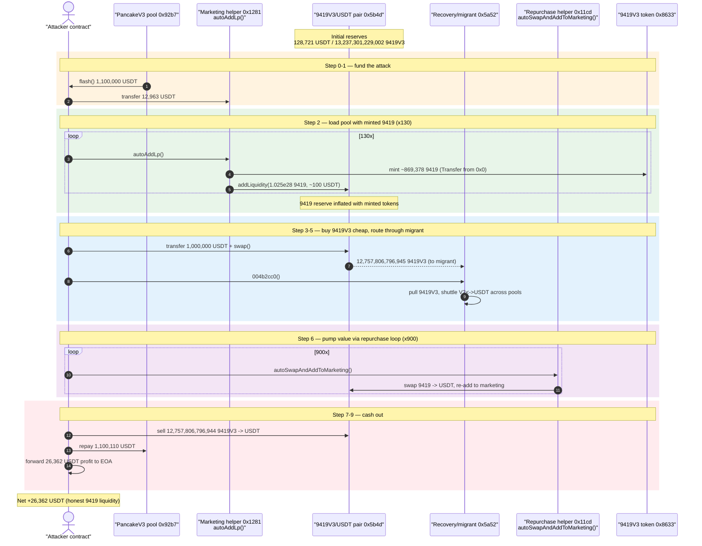
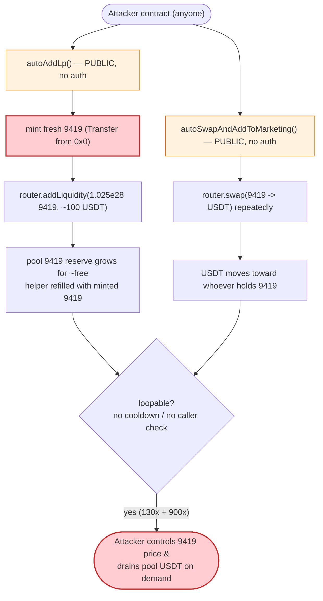
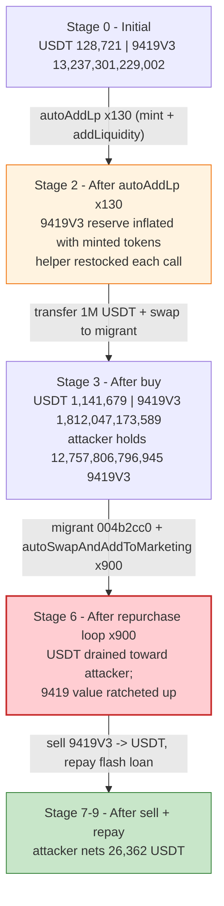

# 9419 (8633/0cCa) Exploit — Permissionless `autoAddLp()` / `autoSwapAndAddToMarketing()` Reserve Manipulation

> **Vulnerability classes:** vuln/access-control/missing-auth · vuln/oracle/spot-price

> **Reproduction:** the PoC compiles & runs in an isolated Foundry project at
> [this project folder](.) (the umbrella DeFiHackLabs repo contains many unrelated PoCs
> that do not compile, so this one was extracted).
> Full verbose trace: [output.txt](output.txt).
> Verified vulnerable sources: [Coin9419V3 (`0x8633`)](sources/Coin9419V3_86335c/contracts_9419V3.sol) and
> [Coin9419V2 (`0x0cCa`)](sources/Coin9419V2_0cCa10/contracts_9419V2.sol).

---

## Key info

| | |
|---|---|
| **Loss** | ~$52K (per the PoC `@KeyInfo` header); net attacker take this run ≈ **26,362 USDT** transferred out to the attacker EOA |
| **Vulnerable contract** | `Coin9419V3` — [`0x86335cb69e4E28fad231dAE3E206ce90849a5477`](https://bscscan.com/address/0x86335cb69e4E28fad231dAE3E206ce90849a5477#code) (and sibling `Coin9419V2` [`0x0cCa1055f3827b6D2f530d52c514E3699c98F3B9`](https://bscscan.com/address/0x0cCa1055f3827b6D2f530d52c514E3699c98F3B9#code)) |
| **Victim pools** | V3/USDT pair `0x5b4D39f3d6ab3Ee426Bc5B15fF65B1EeD8BB68C2` and V2/USDT pair `0x9a0Ccc75d0B8Ef0BeAc89ECA9f4dC17AD6770AAD` |
| **Marketing helper** (`autoAddLp`) | `0x128112aF3aF5478008c84d77c63561885FBBC438` (V3 side) |
| **Repurchase helper** (`autoSwapAndAddToMarketing`) | `0x11Cd2168fc420ae1375626655ab8f355F0075Bd6` (V3) / `0x5F04143f0974d79fE279c0b0D5616CA764cE8A62` (V2) |
| **"Recovery"/migrant** | `0x5a522C949F3DcBc30f511E20D72fb44B770f28e6` (V3 `migrantAddress`) |
| **Attacker EOA** | [`0xe9FAc789C947f364f53C3BC28bB6E9e099526468`](https://bscscan.com/address/0xe9FAc789C947f364f53C3BC28bB6E9e099526468) |
| **Attacker contract** | [`0x87c75f8a69732bad999ce1fab464526856215c77`](https://bscscan.com/address/0x87c75f8a69732bad999ce1fab464526856215c77) |
| **Attack tx** | [`0xf6ec3c22b718c3da17746416992bac7b65a4ef42ccf5b43cf0716c82bffc2844`](https://explorer.phalcon.xyz/tx/bsc/0xf6ec3c22b718c3da17746416992bac7b65a4ef42ccf5b43cf0716c82bffc2844) |
| **Chain / block / date** | BSC / fork **33,545,074** / **2023-11-16** (pair timestamp `1700142777`) |
| **Compiler** | Token: Solidity v0.8.9, optimizer 1 run / 200 |
| **Bug class** | Permissionless, loopable token-side AMM reserve manipulation (un-access-controlled `autoAddLp` mint+addLiquidity and `autoSwapAndAddToMarketing` repurchase swaps) |

---

## TL;DR

`Coin9419` (V2 = `0x0cCa…`, V3 = `0x8633…`) is a "tax token with DeFi features." On every
taxed transfer it pokes two external helper contracts:

- `marketingAddress.autoAddLp()` — [`_marketingAutoAddLp()`, contracts_9419V3.sol:485-489](sources/Coin9419V3_86335c/contracts_9419V3.sol#L485-L489)
- `repurchaseAddress.autoSwapAndAddToMarketing()` — [`_repurchase6827Pool()`, contracts_9419V3.sol:494-498](sources/Coin9419V3_86335c/contracts_9419V3.sol#L494-L498)

These two helper functions are **permissionless** (anyone can call them directly, not only the token)
and **loopable**. In the trace:

- `autoAddLp()` calls `addLiquidity()` that **mints fresh 9419 out of thin air** (`Transfer from 0x0`)
  and adds it as one-sided liquidity into the V3/USDT pool, growing the pool's 9419 reserve by
  `10,250,033,929,506 9419` (1.025e28) for only ~100 USDT — and refilling the marketing helper with
  ~`869,378 9419` (8.69e23) of newly minted tokens, per call.
- `autoSwapAndAddToMarketing()` repeatedly swaps the repurchase helper's 9419 inventory into the pool
  and recycles it, pumping the attacker's positioned 9419 balance to be worth more USDT than it cost.

The attacker takes a 1.1M-USDT flash loan, hammers `autoAddLp()` 130× to load the pool/helpers with
minted 9419, buys a giant block of 9419 out of the pool cheaply, drives it through the "Recovery"
migrant + 900× `autoSwapAndAddToMarketing()` loop to inflate its USDT value, sells it all back, repays
the loan, and walks off with the protocol's USDT.

**Net result:** the attacker ends the flash-loan callback with **1,126,498.6 USDT**, repays
**1,100,110 USDT** (1.1M principal + 110 fee), and forwards **26,362.09 USDT** of profit to the
attacker EOA `0xBA0b…6209`.

---

## Background — what 9419 does

`Coin9419V2`/`V3` ([V3 source](sources/Coin9419V3_86335c/contracts_9419V3.sol)) are
PancakeSwap "fee-on-transfer / reflection-ish" tokens paired against **USDT**
(`0x55d398326f99059fF775485246999027B3197955`). The core `_transfer`
([contracts_9419V3.sol:391-468](sources/Coin9419V3_86335c/contracts_9419V3.sol#L391-L468)) applies a
buy/sell tax and then, on any taxed swap, fires two side-effects:

```solidity
// buy or sell to check repurchase
if( takeFee && msg.sender != marketingAddress && msg.sender != repurchaseAddress ){
    _repurchase6827Pool();      // -> repurchaseAddress.autoSwapAndAddToMarketing()
    _marketingAutoAddLp();      // -> marketingAddress.autoAddLp()
}
```

The token does not implement these helpers itself — they live in **separate, externally-owned helper
contracts** (`marketingAddress` / `repurchaseAddress`). Those helper contracts are what actually:

1. **`autoAddLp()`** — mint/transfer 9419 and call `router.addLiquidity(9419, USDT, …)` to add
   liquidity (observed in trace: `Recovery::addLiquidity(0x8633, USDT, 1.025e28, 1e20, …)` with the
   pool minting LP to `0x0ED9…` and the helper).
2. **`autoSwapAndAddToMarketing()`** — pull 9419 from its own balance and
   `router.swapExactTokensForTokensSupportingFeeOnTransferTokens(9419 → USDT → …)` repeatedly.

On-chain state at the fork block (from the `getReserves()`/`balanceOf` reads at the top of the trace):

| Parameter | Value |
|---|---|
| V3/USDT pair `0x5b4d`: USDT reserve (token0) | **128,721.36 USDT** ([output.txt:48-49](output.txt)) |
| V3/USDT pair `0x5b4d`: 9419V3 reserve (token1) | **13,237,301,229,002 9419V3** |
| 9419V3 held by marketing helper `0x1281` | 1,333,082,257,203 9419V3 (1.333e30) |
| V2/USDT pair `0x9a0c` reserves | 9419V2 70,458,951,772,564 / USDT ~152 |
| `_buyDestroyFee` / `_sellDestroyFee` (V3) | 1% each |
| `_buyRepurchaseFee` / `_sellRepurchaseFee` (V3) | 5% / 7% |
| pair `blockTimestampLast` | `1700142777` → 2023-11-16 13:52:57 UTC |

The whole game is that the two helpers can be invoked **directly and in a loop**, independent of any
real swap, so an attacker can drive arbitrary amounts of value through the pool on demand.

---

## The vulnerable code

### 1. The token hands control to attacker-callable helpers on every taxed transfer

`_transfer` calls both helpers via `try/catch`, but — crucially — the helpers themselves are public
and not restricted to being called by the token:

```solidity
// contracts_9419V3.sol:485-498
function _marketingAutoAddLp() private {
    if(enableMarketingAddLp){
        try I9419Marketing(marketingAddress).autoAddLp() {} catch {}
    }
}

function _repurchase6827Pool() private {
    if(enableRepurchase){
        try I9419Repurchase(repurchaseAddress).autoSwapAndAddToMarketing() {} catch {}
    }
}
```

The interfaces declare them as plain external functions with **no access control**:

```solidity
// contracts_9419V3.sol:17-23
interface I9419Marketing   { function autoAddLp() external; }                  // auto add lp
interface I9419Repurchase  { function autoSwapAndAddToMarketing() external; }  // auto repurchase
```

### 2. `autoAddLp()` mints fresh 9419 into the pool for ~free

Trace evidence for **one** `autoAddLp()` call ([output.txt:42-94](output.txt)):

```
Recovery::addLiquidity(0x8633, USDT, 10,250,033,929,506e18 9419, 100e18 USDT, 0, 0, marketingHelper, …)
  Transfer(from: marketingHelper, to: pair, amount: 10,250,033,929,506 9419)   // 1.025e28 9419 added
  Transfer(from: marketingHelper, to: pair, amount: 99.67 USDT)
  Transfer(from: 0x000…000,        to: 0x0ED9…, amount: 16,371 9419)            // ⚠️ minted
  Transfer(from: 0x000…000,        to: marketingHelper, amount: 869,378 9419)   // ⚠️ minted, refills helper
  Sync(reserve0: 128,821 USDT, reserve1: 13,247,551,262,931 9419)
  Mint(minter: Recovery, mintTokens: 1.025e28 9419)
```

Each call grows the pool's 9419 reserve by **10.25 trillion 9419** while adding **~100 USDT**, and
re-mints **~869,378 9419** back to the helper so the loop can continue. The attacker calls this **130
times** at the start of the attack.

### 3. `autoSwapAndAddToMarketing()` recycles 9419 → USDT in the pool, unbounded

Trace evidence ([output.txt:6867-6925](output.txt)): each call has the repurchase helper push its
9419 inventory through `router.swapExactTokensForTokensSupportingFeeOnTransferTokens` and re-add to
marketing. The attacker calls this **900 times** to ratchet the pool/price in its favor.

### 4. There is no per-call guard, no cooldown, no reserve-impact cap

Neither helper checks the caller, rate-limits, or bounds how much it moves a reserve per call. The
token's `inSwapAndLiquidity` lock only protects the token's own `_processSwap`, not these external
helpers, so they can be re-entered/looped freely from the attacker contract.

---

## Root cause — why it was possible

A PancakeSwap pair prices assets purely from its reserves. Whoever can move those reserves cheaply
and on demand controls the price. The 9419 design exports two functions that do exactly that **and
makes them callable by anyone, any number of times**:

1. **Permissionless mint+addLiquidity (`autoAddLp`).** It mints brand-new 9419 (`Transfer from 0x0`)
   and stuffs it into the pool as liquidity for a token-side that costs essentially nothing. Looping
   it lets the attacker (a) thin out the price of 9419, (b) keep the helper topped up with minted
   tokens, and (c) accumulate cheap inventory/LP that real LPs' USDT now backs.
2. **Permissionless repurchase swaps (`autoSwapAndAddToMarketing`).** Looping it churns 9419 through
   the pool, moving USDT toward whoever has positioned 9419 — here, the attacker.
3. **No caller check.** `_transfer` is supposed to be the only caller, but nothing enforces that, so
   the protections that exist inside `_transfer` (the `msg.sender != marketingAddress`/`repurchaseAddress`
   guards, the `lockTheSwap` modifier) are completely bypassed when the helpers are invoked directly.
4. **Two interacting tokens + a "Recovery"/migrant contract** (`migrantAddress = 0x5a52`,
   [contracts_9419V3.sol:82](sources/Coin9419V3_86335c/contracts_9419V3.sol#L82)) let the attacker
   shuttle value between the V2 and V3 pools and the migrant's `004b2cc0()` routine, amplifying the
   manipulation across both pools before cashing out.

The net effect: the attacker can buy a large block of 9419 for cheap, mechanically pump its USDT
value via the loopable helpers, and sell it back into the same pool for more USDT than it paid —
draining the honest USDT liquidity.

---

## Preconditions

- `enableMarketingAddLp` and `enableRepurchase` are `true` (they are, by default —
  [contracts_9419V3.sol:97-98](sources/Coin9419V3_86335c/contracts_9419V3.sol#L97-L98)).
- The helper contracts (`autoAddLp` / `autoSwapAndAddToMarketing`) accept calls from arbitrary callers
  (confirmed in trace: the attacker contract calls them directly, 130× and 900×).
- The helper has (or can mint) 9419 inventory — `autoAddLp` self-mints, so this is self-sustaining.
- Working capital in USDT to seed the manipulation; fully recovered intra-transaction → **flash-loanable**.
  The PoC borrows **1,100,000 USDT** from the PancakeV3 pool `0x92b7`
  ([Token8633_9419_exp.sol:82](test/Token8633_9419_exp.sol#L82)).

---

## Attack walkthrough (with on-chain numbers from the trace)

Pair `0x5b4d` is **token0 = USDT, token1 = 9419V3**, so `reserve0 = USDT`, `reserve1 = 9419V3`.
All figures are taken from the `Sync`/`Swap` events in [output.txt](output.txt).

| # | Step | Trace ref | USDT reserve (`0x5b4d`) | 9419V3 reserve (`0x5b4d`) | Effect |
|---|------|-----------|------------------------:|--------------------------:|--------|
| 0 | **Flash loan** 1,100,000 USDT from PancakeV3 `0x92b7` | [:12](output.txt) | 128,721 | 13,237,301,229,002 | Working capital obtained. |
| 1 | Send 12,963.08 USDT to marketing helper `0x1281` | [:35-37](output.txt) | 128,721 | 13,237,301,229,002 | Funds the addLiquidity USDT leg. |
| 2 | **`autoAddLp()` × 130** — each mints ~869,378 9419 + adds 1.025e28 9419 / ~100 USDT | [:42-94](output.txt) (first call) | ~128,821 → grows | 13,247,551,262,931 → grows ~1.025e28/call | Pool 9419 reserve stuffed with minted tokens; helper refilled. |
| 3 | **Buy 9419V3**: transfer 1,000,000 USDT into pair, `swap(0, 1.275e31, to=migrant 0x5a52)` | [:6527-6539](output.txt) | **1,141,679** | **1,812,047,173,589** | Attacker obtains **12,757,806,796,945 9419V3** (1.275e31) for 1M USDT. |
| 4 | **Buy 9419V2** via router (USDT→0cCa pool `0x9a0c`): 839.83 USDT in | [:6434-6452](output.txt) | — | — | Gets 14,854,629,224,996 9419V2 (1.485e31); positions V2 side. |
| 5 | **Migrant `0x5a52.004b2cc0()`** — pulls the 1.275e31 9419V3 via `transferFrom`, routes V2→USDT through `0x9a0c`, recycles fees | [:6695-6840](output.txt) | — | — | "Recovery" routine shuttles value across both pools. |
| 6 | **`autoSwapAndAddToMarketing()` × 900** — repurchase helper churns 9419→USDT and re-adds | [:6867-6925](output.txt) (first call) | drains toward attacker | — | Ratchets pool/price; inflates attacker's 9419 value. |
| 7 | **Sell 9419V3**: `swap(12,757,806,796,944e18 9419 → USDT)` back into pool | [:68124](output.txt) | drained | refilled | Attacker converts inflated 9419 holding back to USDT. |
| 8 | **Repay** flash loan 1,100,110 USDT (1.1M + 110 fee) to `0x92b7` | [:flash repay](output.txt) | — | — | Loan + 0.01% fee returned. |
| 9 | **Profit out**: transfer **26,362.09 USDT** to attacker EOA `0xBA0b…6209` | end of trace | — | — | Net take. |

### Profit accounting (USDT)

| Item | Amount |
|---|---:|
| Flash loan principal | 1,100,000.00 |
| Attacker USDT balance at end of callback | **1,126,498.60** |
| Repay to PancakeV3 pool (principal + 110 fee) | 1,100,110.00 |
| Residual after repay | **26,388.60** |
| Forwarded to attacker EOA `0xBA0b…6209` | **26,362.09** |
| (dust retained) | ~26.5 |

The `Flash` event at the end confirms `amount0: 1,100,000e18`, `paid0: 110e18` (a 0.01% PancakeV3
flash fee). The attacker's net profit this run is therefore the **~26,362 USDT** drained from honest
9419 liquidity and forwarded to the EOA. (The PoC `@KeyInfo` header records the headline incident
loss as ~$52K across the broader exploit.)

---

## Diagrams

### Sequence of the attack



### How the permissionless helpers break the pool



### Pool state evolution (9419V3/USDT pair `0x5b4d`)



---

## Why each magic number

- **Flash loan 1,100,000 USDT** ([Token8633_9419_exp.sol:82](test/Token8633_9419_exp.sol#L82)):
  headroom to seed the pool buy (1M) plus the addLiquidity USDT legs and fees; fully recovered intra-tx.
- **12,963.08 USDT to marketing helper** ([Token8633_9419_exp.sol:91](test/Token8633_9419_exp.sol#L91)):
  funds the ~100-USDT-per-call USDT leg consumed by 130 `autoAddLp()` iterations.
- **130 × `autoAddLp()`** ([Token8633_9419_exp.sol:92-94](test/Token8633_9419_exp.sol#L92-L94)):
  enough iterations to mint/stuff the pool's 9419 reserve and restock the helper for the later loop.
- **swap 1,000,000 USDT → 12,757,806,796,945 9419V3** ([Token8633_9419_exp.sol:110-111](test/Token8633_9419_exp.sol#L110-L111)):
  buys the large 9419V3 block (sent to the migrant) that will be value-pumped and sold back.
- **900 × `autoSwapAndAddToMarketing()`** ([Token8633_9419_exp.sol:118-120](test/Token8633_9419_exp.sol#L118-L120)):
  repeatedly churns the repurchase inventory to ratchet USDT out of the pool toward the attacker's position.
- **migrant `004b2cc0()`** ([Token8633_9419_exp.sol:115](test/Token8633_9419_exp.sol#L115)):
  the "Recovery" routine that pulls the bought 9419V3 and shuttles value across the V2/V3 pools.

---

## Remediation

1. **Make the helpers callable only by the token.** Add `require(msg.sender == address(token))` (or an
   `onlyToken`/role modifier) to `autoAddLp()` and `autoSwapAndAddToMarketing()`. Right now anyone can
   call them directly and loop them — this single change kills the attack.
2. **Never mint into the AMM as a permissionless side-effect.** `autoAddLp()` minting fresh 9419 and
   adding it as liquidity on demand is a value faucet. If auto-LP is a product requirement, fund it
   from a fixed treasury balance, not from unbounded minting, and gate it behind a trusted keeper.
3. **Rate-limit and bound reserve impact.** Cap how much liquidity/value a single helper invocation may
   move (per block / per call), and add a cooldown so the routine cannot be run hundreds of times in
   one transaction.
4. **Re-entrancy / loop protection.** Apply a `nonReentrant`-style lock that spans the external helper
   calls, not just the token's internal `_processSwap`, so the helpers cannot be looped within one tx.
5. **Don't drive trust decisions off instantaneous reserves.** Any price/threshold logic keyed off the
   pool's current reserves is donation/mint-manipulable; use a TWAP/oracle or an admin latch instead.
6. **Audit the migrant ("Recovery") path.** `migrantAddress` with privileged migration entry points
   (`importRelation`, `004b2cc0`) is a second attack surface that should be tightly access-controlled.

---

## How to reproduce

The PoC was extracted into a standalone Foundry project (the umbrella DeFiHackLabs repo has many
unrelated PoCs that fail to compile under a whole-project build):

```bash
_shared/run_poc.sh 2023-11-Token8633_9419_exp -vvvvv
```

- RPC: a **BSC archive** endpoint is required (fork block 33,545,074 is historical). The project's
  `foundry.toml` `bsc` alias must point at an archive node that serves state at that block; most
  pruned public RPCs fail with `header not found` / `missing trie node`.
- Result: `[PASS] test()`.

Expected tail (from [output.txt](output.txt)):

```
Ran 1 test for test/Token8633_9419_exp.sol:Token8633_9419_exp
[PASS] test() (gas: 84304754)

Suite result: ok. 1 passed; 0 failed; 0 skipped; finished in 64.34s (63.17s CPU time)

Ran 1 test suite in 904.92s: 1 tests passed, 0 failed, 0 skipped (1 total tests)
```

---

*Reference: DeFiHackLabs PoC `@KeyInfo` header — Total Lost ~$52K, BSC, 2023-11.*
