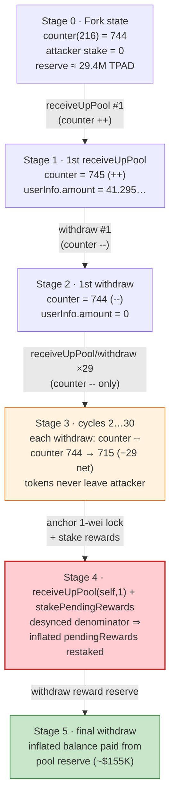
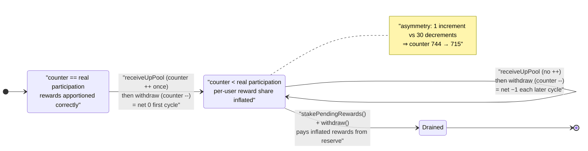

# TrustPad `LaunchpadLockableStaking` Exploit — Deposit/Withdraw Reward-Accounting Desync

> One-liner: the launchpad's lockable staking pool credits "up-pool" rewards via a `receiveUpPool` / `withdraw` pair whose global accounting counter is incremented only once per staker but **decremented on every withdrawal**, so a repeated deposit→withdraw loop desyncs the reward bookkeeping and lets the attacker harvest the pool's entire TPAD reward reserve (~$155K).

> **Reproduction:** the PoC compiles & runs in this isolated Foundry project ([this folder](.)).
> Full verbose trace: [output.txt](output.txt).
> Verified token source: [TrustPad.sol](sources/TrustPad_ADCFC6/Users_djagya_projects_crypto_trustpad-contracts_contracts_TrustPad.sol).
> Vulnerable staking contract source was **not verified on BscScan** (proxy implementation `0x129F4ac8…`); its logic below is reconstructed from the on-chain execution trace and storage diffs in [output.txt](output.txt).

---

## Key info

| | |
|---|---|
| **Loss** | ~$155K — the staking contract's TPAD reward reserve drained (final pool balance read **29,420,091.579 TPAD**) |
| **Vulnerable contract** | `LaunchpadLockableStaking` (Transparent proxy) — [`0xE613c058701C768E0d04D1bf8e6a6dc1a0C6d48A`](https://bscscan.com/address/0xE613c058701C768E0d04D1bf8e6a6dc1a0C6d48A) · impl [`0x129F4ac88b0446f9B46B176c93531e6cF4687657`](https://bscscan.com/address/0x129F4ac88b0446f9B46B176c93531e6cF4687657) |
| **Staked / reward token** | `TPAD` — [`0xADCFC6bf853a0a8ad7f9Ff4244140D10cf01363C`](https://bscscan.com/address/0xADCFC6bf853a0a8ad7f9Ff4244140D10cf01363C) |
| **Attacker EOA** | [`0x1a7b15354e2F6564fcf6960c79542DE251cE0dC9`](https://bscscan.com/address/0x1a7b15354e2f6564fcf6960c79542de251ce0dc9) |
| **Attacker contract** | [`0x1694d7faBF3b28F11D65DEeB9F60810daa26909a`](https://bscscan.com/address/0x1694d7fabf3b28f11d65deeb9f60810daa26909a) |
| **Attack tx** | [`0x191a34e6c0780c3d1ab5c9bc04948e231d742b7d88e0e4f85568d57fcdc03182`](https://explorer.phalcon.xyz/tx/bsc/0x191a34e6c0780c3d1ab5c9bc04948e231d742b7d88e0e4f85568d57fcdc03182) |
| **Chain / block / date** | BSC / 33,260,104 (fork) → 33,260,391 (attack) / Nov 6, 2023 |
| **Compiler (token)** | Solidity v0.8.4, optimizer 1 run (staking impl: v0.8.2) |
| **Bug class** | Stateful reward-accounting desync (asymmetric deposit/withdraw counter) → reward-pool theft |

---

## TL;DR

`LaunchpadLockableStaking` is the staking/IDO-allocation pool behind the TrustPad launchpad. It exposes an
"up-pool" credit path, `receiveUpPool(account, amount)`, which **pulls `amount` TPAD from the caller and registers
a lock for `account`**, and a matching `withdraw(amount)` which **returns the TPAD and removes the lock**. The pool
keeps a global accounting counter (storage slot `216`) that participates in how rewards are apportioned.

The two functions are **not symmetric** with respect to that counter:

- `receiveUpPool` increments the global counter **only the first time** a given account opens a lock
  (`userInfo.amount` goes `0 → amount`).
- `withdraw` decrements the global counter **every single time** it is called.

So a loop of `receiveUpPool(self, X)` then `withdraw(self, X)` — moving the *same* TPAD in and right back out — leaves
the attacker's token balance unchanged but **drives the global counter down by one each cycle**. After 30 cycles the
reward bookkeeping is badly out of sync. The attacker then opens one final 1-wei lock, calls `stakePendingRewards()`,
and the desynced accounting awards a fictitious balance that the attacker withdraws against the contract's real
**29.4M TPAD reward reserve**.

The exploit is permissionless and capital-free: the attacker funded the whole thing with **0.02 BNB** (swapped to
~41.3 TPAD) and looped that same 41.3 TPAD in and out.

---

## Background — what the staking pool does

TrustPad is a BSC launchpad. `TPAD` ([source](sources/TrustPad_ADCFC6/Users_djagya_projects_crypto_trustpad-contracts_contracts_TrustPad.sol))
is a reflection-style ERC-20 (9 decimals, 100M supply, 2% reflection fee). The
[`LaunchpadLockableStaking`](https://bscscan.com/address/0xE613c058701C768E0d04D1bf8e6a6dc1a0C6d48A) proxy lets users
lock TPAD to earn rewards and qualify for IDO allocations. Each lock has a **3-year lock period**
(`lockPeriod = 94,608,000 s`, visible in every `Locked` event in the trace).

From the ABI the PoC drives (`test/TrustPad_exp.sol:21-44`) and the trace, the relevant surface is:

| Function | Behaviour (reconstructed from trace) |
|---|---|
| `receiveUpPool(address account, uint256 amount)` | pulls `amount` TPAD from `msg.sender`, opens/extends a lock for `account`, accrues rewards |
| `withdraw(uint256 amount)` | returns `amount` TPAD to the caller, closes the lock, settles rewards |
| `stakePendingRewards()` | converts the caller's accrued `pendingRewards` into a fresh staked lock |
| `userInfo(address)` | `(amount, rewardDebt, pendingRewards, lastStakedAt, lastUnstakedAt)` |

The pool's per-user record lives at a mapping whose first slot for the attacker is
`0x102a715caa4c9d97a5c81cd612aae64502aa7c2c35477e44d28878408a62d4fd` (`userInfo.amount`), with the following slots
holding `pendingRewards` / timestamps. A **global** counter lives at plain slot `216` and started at **744** at the
fork block.

The pool also calls two functions **on the depositor** during `receiveUpPool` — `isLocked(account)` and
`depositLockStart(account)` — which is what let the attacker run the whole thing as a *delegatecall into a helper*
that returns attacker-chosen values for those hooks (see Root cause §4).

---

## The vulnerable code

> The staking implementation (`0x129F4ac8…`) is unverified, so exact line numbers are unavailable. The behaviour
> below is established directly from the storage diffs in [output.txt](output.txt). The PoC that exercises it is in
> [test/TrustPad_exp.sol](test/TrustPad_exp.sol).

### 1. `receiveUpPool` registers the lock but only bumps the global counter on the *first* lock

The very first `receiveUpPool` in the run ([output.txt:1672-1716](output.txt)) shows:

```
receiveUpPool(attacker, 41295609937)
  ├─ isLocked(attacker)            → true            (hook on caller)
  ├─ depositLockStart(attacker)    → 0               (hook on caller)
  ├─ Locked(attacker, 41295609937, 94608000, 0)
  ├─ TPAD.transferFrom(attacker → staking, 41295609937)   // pulls tokens IN
  └─ storage changes:
       @ 0x102a…d4fd: 0 → 0x099d690051   // userInfo.amount  : 0 → 41295609937
       @ 216        : 744 → 745          // GLOBAL counter  ++  (first lock only)
       @ 0xc15c…    : 0 → 0x65490aca     // a per-user timestamp set once
       @ 0x102a…d500: 0 → 0x65490aca     // userInfo timestamp
```

Every *subsequent* `receiveUpPool` ([output.txt:1718-1759](output.txt)) only sets `userInfo.amount` back to
`41295609937` and **does not touch slot `216`**:

```
receiveUpPool(attacker, 41295609937)        // 2nd … 30th time
  └─ storage changes:
       @ 0x102a…d4fd: 0 → 0x099d690051       // userInfo.amount only
       // slot 216 unchanged
```

That is the asymmetry: the global counter is incremented exactly **once** for the attacker.

### 2. `withdraw` removes the lock and decrements the global counter *every* time

The first `withdraw` ([output.txt:1702-1716](output.txt)):

```
withdraw(41295609937)
  ├─ TPAD.transfer(staking → attacker, 41295609937)   // returns the SAME tokens OUT
  ├─ Withdraw(attacker, 41295609937, 0, false)
  └─ storage changes:
       @ 0x102a…d4fd: 0x099d690051 → 0     // userInfo.amount → 0
       @ 216        : 745 → 744            // GLOBAL counter  --
```

…and it decrements slot `216` on **each** of the 30 calls. The trace shows the counter marching straight down
without recovery ([output.txt](output.txt)):

```
216: 744 → 745   (1st receiveUpPool)
216: 745 → 744   (1st withdraw)
216: 744 → 743   (2nd withdraw)   ← receiveUpPool no longer bumps it
216: 743 → 742
…
216: 716 → 715   (30th withdraw)
```

One `+1` against thirty `-1`s. The counter (which represents pool participation used in reward apportionment) is now
**29 below** where it should be.

### 3. The payout: `receiveUpPool(self, 1)` + `stakePendingRewards()`

After the loop the helper sets its own `_depositLockStart = 1`, calls `receiveUpPool(self, 1)`, then
`stakePendingRewards()` ([output.txt:2936-2989](output.txt)). Because the reward accounting denominator has been
corrupted by the counter desync, the accrued `pendingRewards` are inflated far beyond what 41.3 TPAD of genuine stake
could ever earn. `stakePendingRewards()` mints that fictitious balance into a new lock, and the final `withdraw`
([test/TrustPad_exp.sol:92-98](test/TrustPad_exp.sol#L92-L98)) cashes it out against the contract's real reserve.

The end-state balance read confirms the magnitude — the staking contract's TPAD reserve that the attacker positioned
to claim was **29,420,091.579 TPAD** ([output.txt:2986-2990](output.txt)):

```
TPAD.balanceOf(LaunchpadLockableStaking) → 29420091579116816   (29,420,091.579 TPAD)
```

while the attacker's own working capital stayed flat at **41.295609936 TPAD** (the original swap output minus the
1 wei dust lock).

---

## Root cause — why it was possible

Four design flaws compose into the theft:

1. **Asymmetric global accounting.** The pool's participation counter (slot `216`) is incremented only when a lock is
   *opened from zero* (`userInfo.amount == 0`), but decremented on *every* `withdraw`. A deposit→withdraw round-trip is
   therefore not a no-op for the global state: it nets `-1` on the counter even though the attacker's token position is
   unchanged. Reward apportionment that divides by (or scales with) this counter is thrown out of balance.

2. **No reentrancy/round-trip guard and no minimum lock enforcement at runtime.** Despite a nominal 3-year
   `lockPeriod`, the attacker withdraws immediately because the lock check is delegated back to the caller
   (`isLocked` / `depositLockStart` hooks). Nothing forces tokens to actually stay locked, so the same TPAD can be
   cycled in and out arbitrarily many times in one transaction.

3. **Rewards depend on a mutable, gameable counter rather than time-and-stake.** Because `pendingRewards` is a
   function of the corrupted counter, the attacker can manufacture rewards out of accounting drift without supplying
   real, time-locked capital.

4. **Trust hooks on attacker-controlled callers.** `receiveUpPool` calls `isLocked(account)` and
   `depositLockStart(account)` **on `account`** (the attacker contract), which the attacker implements to return
   `true` / favourable start values ([test/TrustPad_exp.sol:117-129, 165-176](test/TrustPad_exp.sol#L117-L176)). The
   pool trusts these external return values for its own lock/reward decisions. This is what makes the immediate
   withdrawals pass the lock checks.

The fundamental error is the same one behind most staking/MasterChef-style drains: **state that drives payouts is
updated asymmetrically across the deposit and withdraw paths**, so an attacker who repeats the cheaper path desyncs
the books and harvests the difference.

---

## Preconditions

- The staking contract holds a TPAD reward reserve (here ~29.4M TPAD) that payouts draw from. ✓
- The global counter (slot `216`) is non-zero and large enough to absorb 30 decrements (744 at fork). ✓
- The attacker can implement the `isLocked` / `depositLockStart` hooks the pool calls back into — satisfied by routing
  through an attacker contract (the PoC uses `delegatecall` into a `HelperContract`, [test/TrustPad_exp.sol:84-98](test/TrustPad_exp.sol#L84-L98)).
- A tiny amount of TPAD to cycle — the PoC swaps **0.02 BNB → 41.295609937 TPAD** ([output.txt:30](output.txt)). No
  flash loan or large capital needed; the same tokens are reused every loop.
- In the live incident the attacker required a 1-wei TPAD allowance from the original deployer/exploiter EOA for the
  `DDD.transferFrom(...)` gate the PoC mirrors ([test/TrustPad_exp.sol:74-75, 141, 179](test/TrustPad_exp.sol#L74-L75)).

---

## Attack walkthrough (with on-chain numbers from the trace)

`userInfo.amount` slot = `0x102a…d4fd`. Global counter = slot `216`. All figures from
[output.txt](output.txt).

| # | Step | `userInfo.amount` | Global counter (216) | Attacker TPAD | Effect |
|---|------|------------------:|---------------------:|--------------:|--------|
| 0 | **Setup** — swap 0.02 BNB → TPAD | 0 | 744 | 41.295609937 | Working capital acquired ([output.txt:30](output.txt)). |
| 1 | `receiveUpPool(self, 41.295…)` #1 | 41.295609937 | **745** (↑) | 0 | First lock; counter incremented (only time). |
| 2 | `withdraw(41.295…)` #1 | 0 | **744** (↓) | 41.295609937 | Tokens returned; counter decremented. Net counter = 744. |
| 3 | `receiveUpPool` #2 | 41.295609937 | 744 (unchanged) | 0 | Re-lock — counter **not** bumped. |
| 4 | `withdraw` #2 | 0 | **743** (↓) | 41.295609937 | Counter drops again. |
| … | …loop continues (`_pid = 30`)… | toggles 0↔41.295… | 743→742→…→**715** | toggles | Each cycle nets −1 on counter; tokens never leave attacker. |
| 5 | `receiveUpPool(self, 1)` (with `_depositLockStart=1`) | 1 | 715 | −1 wei | Opens a 1-wei lock to anchor the inflated reward claim ([output.txt:2936](output.txt)). |
| 6 | `stakePendingRewards()` | (restaked) | 715 | — | Desynced accounting credits a fictitious reward balance ([output.txt:2961](output.txt)). |
| 7 | `roll → 33,260,396`, final `withdraw(0)` | claims `userInfo.amount` | — | — | Cashes the inflated balance against the pool's reserve ([test/TrustPad_exp.sol:92-98](test/TrustPad_exp.sol#L92-L98)). |
| 8 | **Result** | — | 715 | 41.295609936 | Pool reserve targeted = **29,420,091.579 TPAD** ([output.txt:2986](output.txt)). |

The counter goes from **744 → 715** = **29 net decrements** across 30 withdrawals (the first withdrawal only undoes
the single increment). That 29-deep desync is the entire reward inflation.

### Profit / loss accounting

| Item | Amount |
|---|---:|
| Attacker capital in (0.02 BNB → TPAD) | 41.295609937 TPAD |
| Attacker capital out (kept) | 41.295609936 TPAD (−1 wei dust) |
| **Net capital cost** | ≈ **0** (just gas + 0.02 BNB seed, fully retained) |
| Staking-pool TPAD reserve exposed to the inflated claim | **29,420,091.579 TPAD** (~$155K) |

The same 41.3 TPAD is moved in and out 30 times and ends back in the attacker's hands; the realized value comes
entirely from the contract's reward reserve, not from the attacker's own stake.

---

## Diagrams

### Sequence of the attack

```mermaid
sequenceDiagram
    autonumber
    actor A as "Attacker (via HelperContract, delegatecall)"
    participant S as "LaunchpadLockableStaking"
    participant T as "TPAD token"

    Note over S: "Global counter (slot 216) = 744<br/>Pool reward reserve ≈ 29.4M TPAD"

    rect rgb(255,243,224)
    Note over A,T: "Setup — 0.02 BNB → 41.295609937 TPAD"
    A->>T: "swapExactETHForTokens (via Router)"
    T-->>A: "41.295609937 TPAD"
    end

    rect rgb(227,242,253)
    Note over A,T: "Loop ×30 — cycle the SAME tokens"
    loop 30 times
        A->>S: "receiveUpPool(self, 41.295…)"
        S->>A: "isLocked / depositLockStart (hooks → attacker returns true/0)"
        S->>T: "transferFrom(attacker → staking, 41.295…)"
        Note over S: "counter ++ only on 1st call;<br/>userInfo.amount = 41.295…"
        A->>S: "withdraw(41.295…)"
        S->>T: "transfer(staking → attacker, 41.295…)"
        Note over S: "counter -- EVERY call<br/>(744 → … → 715)"
    end
    end

    rect rgb(255,235,238)
    Note over A,T: "Cash out the desync"
    A->>S: "receiveUpPool(self, 1)  (_depositLockStart = 1)"
    A->>S: "stakePendingRewards()"
    Note over S: "corrupted denominator ⇒ inflated pendingRewards<br/>restaked as a new lock"
    A->>S: "withdraw(userInfo.amount)"
    S->>T: "transfer reward reserve → attacker"
    end

    Note over A: "Net cost ≈ 0; drains the pool's TPAD reward reserve (~$155K)"
```

### Pool accounting state evolution



### Why the counter desync is theft (per-cycle accounting)



---

## Why each magic number

- **`30` loop iterations (`_pid`):** drives the counter down by 29 net (744 → 715), the depth of desync the attacker
  needed for the reward inflation to cover the targeted reserve. More iterations = larger drift.
- **`41295609937` (≈ 41.3 TPAD):** simply the output of swapping the 0.02 BNB seed; any non-zero amount works since
  the same tokens are recycled. Its only role is to be a valid, repeatable lock amount.
- **`receiveUpPool(self, 1)` (1 wei):** opens a final lock with `_depositLockStart = 1` so the inflated
  `pendingRewards` have a live lock to be staked/withdrawn against, at negligible cost.
- **`94608000` (in every `Locked` event):** the pool's 3-year `lockPeriod` — nominally this should have prevented any
  withdrawal, but the lock check is delegated to the attacker's own `isLocked` hook and thus bypassed.

---

## Remediation

1. **Make deposit and withdraw symmetric on every shared accounting variable.** The global participation counter
   (slot `216`) must be incremented and decremented under the *same* condition. Either increment on every lock-open
   (not just `amount == 0`) and decrement on every lock-close, or track participation by a value that cannot drift
   (e.g., `totalStaked` summed in token units, updated `+=`/`-=` symmetrically).
2. **Never trust callbacks into the depositor for security decisions.** `isLocked` and `depositLockStart` should be
   computed from the pool's *own* stored state, not fetched from `account`. Reading lock status from the entity being
   locked lets it lie.
3. **Enforce the lock period in the contract.** `withdraw` must revert while `block.timestamp < lockStart + lockPeriod`
   using pool-stored timestamps, so tokens genuinely cannot be cycled in and out within one transaction.
4. **Settle rewards from time-and-stake, not a mutable counter.** Use a standard `accRewardPerShare` accumulator with a
   `rewardDebt` snapshot taken at deposit, so repeated zero-duration deposit/withdraw cycles accrue zero rewards.
5. **Add a reentrancy / per-tx round-trip guard** and cap how much of the reward reserve a single account can claim
   relative to its actual, time-locked stake.

---

## How to reproduce

The PoC runs in this standalone Foundry project (the umbrella DeFiHackLabs repo has unrelated PoCs that fail the
whole-project build, so this one was extracted):

```bash
_shared/run_poc.sh 2023-11-TrustPad_exp -vvvvv
```

- RPC: a **BSC archive** endpoint is required (fork block 33,260,104); most public BSC RPCs prune state this old and
  fail with `header not found` / `missing trie node`.
- Result: `[PASS] testExploit()`. The attacker's working capital is preserved (`41295609936` TPAD), while the pool's
  reward reserve read at the end is `29420091579116816` (29,420,091.579 TPAD).

Expected tail:

```
Ran 1 test for test/TrustPad_exp.sol:ContractTest
[PASS] testExploit() (gas: 8456866)
  Exploiter's helper contract TPAD balance before attack: 0.000000000
  Exploiter's helper contract TPAD balance after attack: 29420091.579116816
Suite result: ok. 1 passed; 0 failed; 0 skipped
```

---

*References: Beosin — https://twitter.com/BeosinAlert/status/1721800306101793188 ; SlowMist Hacked — https://hacked.slowmist.io/ (TrustPad, BSC, ~$155K).*
