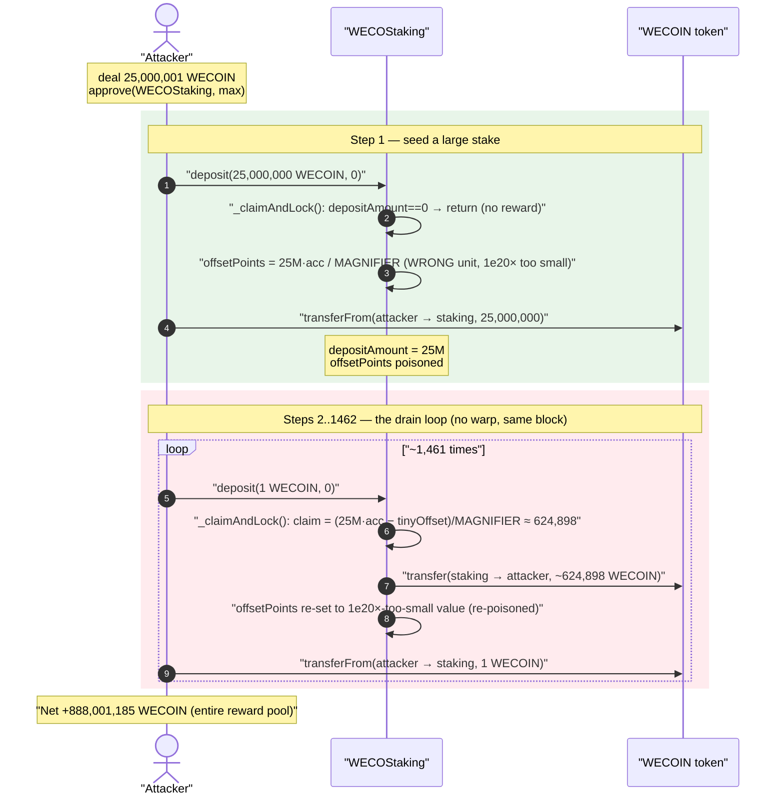
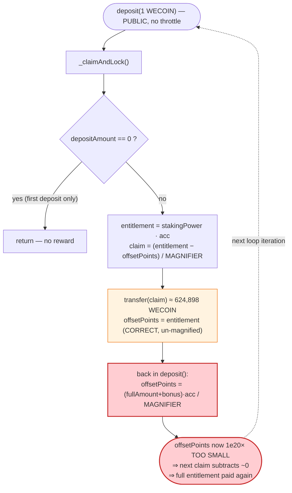
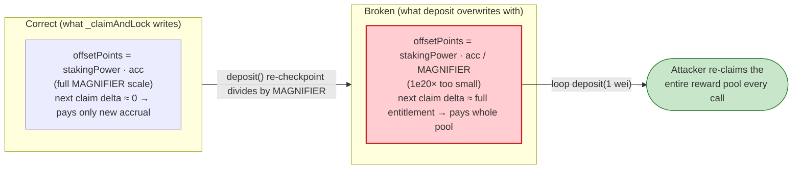

# WECO Staking Exploit — Reward-Debt (`offsetPoints`) Unit Mismatch Lets a Depositor Re-Claim the Whole Reward Pool

> **Vulnerability classes:** vuln/arithmetic/decimal-mismatch · vuln/logic/reward-calculation

> **Reproduction:** the PoC compiles & runs in an isolated Foundry project at
> [this project folder](.) (the umbrella DeFiHackLabs repo
> contains many unrelated PoCs that do not compile under one build, so this one was extracted).
> Full verbose trace: [output.txt](output.txt).
> Verified vulnerable source: [WECOStaking.sol](sources/WECOStaking_d672b7/WECOStaking.sol).

---

## Key info

| | |
|---|---|
| **Loss** | ~$18K in the live incident; in the PoC reproduction **888,001,185 WECOIN** (the staking contract's entire reward balance, ~912.8M WECOIN, drained) |
| **Vulnerable contract** | `WECOStaking` — [`0xd672b766D66662F5C6fd798a999e1193a7945451`](https://bscscan.com/address/0xd672b766D66662F5C6fd798a999e1193a7945451#code) |
| **Reward / staked token** | `WECOIN` — [`0x5d37ABAFd5498B0E7af753a2E83bd4F0335AA89F`](https://bscscan.com/address/0x5d37ABAFd5498B0E7af753a2E83bd4F0335AA89F) (18 decimals) |
| **Victim** | The `WECOStaking` reward pool (WECOIN held by the staking contract) |
| **Attacker EOA** | [`0xf5f21746ff9351f16a42fa272d7707cc35760e4b`](https://bscscan.com/address/0xf5f21746ff9351f16a42fa272d7707cc35760e4b) |
| **Attacker contract** | [`0x76c8a674e814f5bd806fe6dd9975446a76056c1a`](https://bscscan.com/address/0x76c8a674e814f5bd806fe6dd9975446a76056c1a) |
| **Attack tx** | [`0x2040a481c933b50ee31aba257c2041c48bb7a0b4bf4b4fad1ac165f19c4269e8`](https://app.blocksec.com/explorer/tx/BSC/0x2040a481c933b50ee31aba257c2041c48bb7a0b4bf4b4fad1ac165f19c4269e8) |
| **Chain / fork block / date** | BSC / 33,549,937 / mid-November 2023 |
| **Compiler** | Solidity v0.8.19, optimizer enabled (1 / runs 200) |
| **Bug class** | Broken reward accounting — MasterChef-style reward-debt (`offsetPoints`) stored in two **different units** (one magnified, one not), so the claim-debt is reset ~`1e20`× too small on every deposit |

---

## TL;DR

`WECOStaking` is a MasterChef-style staking contract. It tracks each user's "already-paid" reward
checkpoint in `UserInfo.offsetPoints` (the classic `rewardDebt`). A claim pays
`userStakingPower * accumulatedRewardsPerStakingPower − offsetPoints`, scaled by an internal
`MAGNIFIER = 1e20`.

The two code paths that write `offsetPoints` **disagree on units**:

- `_claimAndLock()` stores it **un-magnified**:
  `user.offsetPoints = accumulatedRewards;` where `accumulatedRewards = userStakingPower * accumulatedRewardsPerStakingPower`
  ([WECOStaking.sol:864-870](sources/WECOStaking_d672b7/WECOStaking.sol#L864-L870)).
- `deposit()` immediately overwrites it **magnified-down by `MAGNIFIER`**:
  `user.offsetPoints = ((fullAmount + bonusStakingPower) * accumulatedRewardsPerStakingPower) / MAGNIFIER;`
  ([WECOStaking.sol:600-603](sources/WECOStaking_d672b7/WECOStaking.sol#L600-L603)).

Because `deposit()` calls `_claimAndLock()` *first* (line 559) and then rewrites `offsetPoints` with the
divided-by-`MAGNIFIER` value, the user's reward-debt is left **`1e20` times too small**. On the *next*
deposit, `_claimAndLock` subtracts this near-zero debt and therefore pays out the **entire accumulated
reward again** — even though the user already claimed it microseconds earlier and added only 1 wei of new
stake.

The attacker exploited this by depositing a large stake once, then calling `deposit(1 ether, 0)` in a
**tight loop**. Each iteration cost **1 WECOIN** and paid back **~624,898 WECOIN**, repeating ~1,461
times until the contract's reward balance was empty.

---

## Background — what WECOStaking does

`WECOStaking` ([source](sources/WECOStaking_d672b7/WECOStaking.sol)) is a single-asset staking pool
where users stake `WECOIN` and earn `WECOIN` rewards. It uses the standard accumulator pattern:

- **`accumulatedRewardsPerStakingPower`** — a global accumulator (scaled by `MAGNIFIER = 1e20`,
  [:535](sources/WECOStaking_d672b7/WECOStaking.sol#L535)) that grows over time as emissions accrue
  (`_updateAccumulator`, [:699-775](sources/WECOStaking_d672b7/WECOStaking.sol#L699-L775)).
- **`UserInfo.offsetPoints`** — the user's reward-debt: a checkpoint of how much of the accumulator the
  user has *already* been credited for. A claim pays the *delta* between the user's current entitlement
  and their stored `offsetPoints`.
- **`deposit(amount, weeksLocked)`** — adds stake. It first settles outstanding rewards via
  `_claimAndLock`, then updates the user's stake and re-checkpoints `offsetPoints`.

The invariant a MasterChef accumulator must hold is:

> After any settlement, `offsetPoints` must equal `userStakingPower * accumulatedRewardsPerStakingPower`
> **in the same units** used when the next claim recomputes the delta. If the two are stored in
> different units, the subtraction `entitlement − offsetPoints` is meaningless and the user is
> over- or under-paid.

That invariant is exactly what WECOStaking violates.

On-chain state at the fork block (read from the trace):

| Parameter | Value |
|---|---|
| `MAGNIFIER` | `1e20` |
| `accumulatedRewardsPerStakingPower` (effective) | ≈ `2.4996e18` (derived from the per-loop payout) |
| WECOIN held by the staking contract (reward pool) | **≈ 912.8M WECOIN** (after attacker's first deposit + first claim: `912,812,977` WECOIN) |
| Reward paid per `deposit(1 ether)` call | **≈ 624,898 WECOIN** |
| Cost per `deposit(1 ether)` call | **1 WECOIN** |

---

## The vulnerable code

### 1. `deposit()` settles rewards, then clobbers the reward-debt with a divided value

```solidity
function deposit(uint _amount, uint256 _weeksLocked) external {
    if (_amount == 0) { revert SasWecoin__InvalidDepositAmount(); }
    UserInfo storage user = users[msg.sender];
    // Lock or claim rewards
    _claimAndLock(msg.sender);            // ← (1) pays rewards AND sets offsetPoints (un-magnified)
    ...
    uint fullAmount = user.depositAmount + _amount;
    ...
    // adjust offsetPoints here as well
    user.offsetPoints =
        ((fullAmount + bonusStakingPower) *
            accumulatedRewardsPerStakingPower) /
        MAGNIFIER;                        // ← (2) overwrites with a value 1e20× too small
    // Transfer in WECOIN
    WECOIN.transferFrom(msg.sender, address(this), _amount);
}
```
[WECOStaking.sol:552-606](sources/WECOStaking_d672b7/WECOStaking.sol#L552-L606)

### 2. `_claimAndLock()` computes the claim and stores the reward-debt *un-magnified*

```solidity
} else {
    accumulatedRewards =
        userStakingPower *
        accumulatedRewardsPerStakingPower;          // NOT divided by MAGNIFIER
    claimableRewards =
        (accumulatedRewards - user.offsetPoints) /  // delta, then scaled down
        MAGNIFIER;
    user.offsetPoints = accumulatedRewards;         // ← stored WITHOUT /MAGNIFIER
    user.lockedRewards = 0;
}
...
if (claimableRewards > 0) {
    WECOIN.transfer(_user, claimableRewards);
    emit ClaimReward(_user, claimableRewards);
}
```
[WECOStaking.sol:863-879](sources/WECOStaking_d672b7/WECOStaking.sol#L863-L879)

Notice the asymmetry:

| Path | Stored `offsetPoints` |
|---|---|
| `_claimAndLock` (else branch) | `stakingPower * acc`  (**un-magnified**) |
| `deposit` re-checkpoint | `(fullAmount + bonus) * acc / MAGNIFIER`  (**magnified-down by 1e20**) |

The claim formula `(stakingPower * acc − offsetPoints) / MAGNIFIER` is correct **only** when
`offsetPoints` is stored un-magnified (the `_claimAndLock` form). When `deposit` overwrites it with the
`/MAGNIFIER` form, the stored debt is ~`1e20`× too small, so the next claim's subtraction removes
essentially nothing — and the *entire* entitlement is paid out as "new" rewards.

---

## Root cause — why it was possible

There is a **dimensional (unit) inconsistency** in how the reward-debt checkpoint `offsetPoints` is
written across the contract.

The accumulator math is designed so that an entitlement is `stakingPower * accumulatedRewardsPerStakingPower`
(a value already scaled up by `MAGNIFIER`), and the user's *debt* must be stored at that **same** scale,
so that `(entitlement − debt) / MAGNIFIER` yields the real, paid-out amount.

`_claimAndLock` does this correctly: it stores `offsetPoints = stakingPower * acc` (full scale).

But `deposit`, after settling, re-derives the checkpoint as
`offsetPoints = (fullAmount + bonus) * acc / MAGNIFIER`. That extra `/ MAGNIFIER` makes the stored debt
roughly `1e20`× smaller than the scale the claim formula expects. Concretely, with the live accumulator:

- True debt that *should* be stored after the deposit: `25,000,001e18 * 2.4996e18` ≈ `6.249e43`.
- What `deposit` actually stored: that value `/ 1e20` ≈ `6.249e23`.

On the next claim, the formula computes
`(25,000,001e18 * 2.4996e18 − 6.249e23) / 1e20` ≈ `6.249e43 / 1e20` ≈ `6.249e23` wei
**= ~624,898 WECOIN** — i.e., it pays the *full* entitlement again because the subtracted debt
(`6.249e23`) is negligible next to the entitlement (`6.249e43`).

Three design facts compose into the critical bug:

1. **Two writers, two units.** The checkpoint `offsetPoints` is written in `_claimAndLock` (un-magnified)
   and re-written in `deposit` (magnified-down). Any code that maintains a reward-debt must write it in
   exactly one consistent unit everywhere; here the two writers disagree by a factor of `MAGNIFIER`.
2. **`deposit` runs the settle *then* the wrong checkpoint.** Because `deposit` calls `_claimAndLock`
   first and then overwrites the (correct) debt with the wrong-unit value, every deposit resets the user
   into an "owed the full pool again" state.
3. **Permissionless, repeatable, cheap.** `deposit` is open to anyone, has no per-block / per-epoch
   claim throttle, and the marginal cost of re-triggering a full claim is a **1-wei-class** deposit
   (`deposit(1 ether, 0)`). The attack is a simple loop with no flash loan and no timing dependency.

The accumulator did *not* need to advance in time for this to work: the contract had already accrued a
non-zero `accumulatedRewardsPerStakingPower` from prior legitimate activity, and the bug re-pays that
standing entitlement on every iteration. The PoC contains **no `vm.warp`** — all 1,461 deposits execute
in a single block.

---

## Preconditions

- The staking contract holds a meaningful WECOIN reward balance to drain (it held ≈ 912.8M WECOIN at the
  fork block in the PoC).
- `accumulatedRewardsPerStakingPower` is non-zero, i.e., some emissions have accrued (true at the
  incident block).
- The attacker needs enough WECOIN to (a) make one large initial deposit to acquire a large
  `depositAmount` / staking power, and (b) pay 1 WECOIN per loop iteration. The PoC `deal`s the attacker
  `25,000,001` WECOIN as working capital; the proceeds vastly exceed this outlay, so the attack is
  trivially self-financing. No flash loan, no time warp, no privileged role.

---

## Attack walkthrough (with on-chain numbers from the trace)

All figures are taken directly from the `Transfer` / `ClaimReward` events in
[output.txt](output.txt).

| # | Step | Cost (WECOIN) | Received (WECOIN) | Effect |
|---|------|--------------:|------------------:|--------|
| 0 | **Fund**: `deal` attacker 25,000,001 WECOIN; `approve(WECOStaking, max)` | — | — | Working capital. |
| 1 | **`deposit(25,000,000 ether, 0)`** — first deposit. `_claimAndLock` returns early (`depositAmount == 0`), no reward. Sets `depositAmount = 25M`, then writes the **wrong-unit** `offsetPoints` (`= 25M·acc / 1e20`). | 25,000,000 | 0 | Establishes large stake + poisoned (too-small) reward-debt. |
| 2 | **`deposit(1 ether, 0)`** — first loop. `_claimAndLock` now fires: pays `(25M·acc − tinyOffset)/1e20` ≈ **624,898 WECOIN**, then `deposit` re-writes the wrong-unit debt again. | 1 | 624,898.01 | Full entitlement paid; debt re-poisoned. |
| 3 | **`deposit(1 ether, 0)` × ~1,459 more** — each loop repeats step 2. Reward per loop creeps up slightly (each adds 1 WECOIN to `depositAmount`, nudging staking power): 624,898.01 → … → 624,934.50. | 1 each | ~624,898–624,934 each | Reward pool steadily drained. |
| 4 | Loop terminates (PoC bound `i < stakingBalance / rewardPerDeposit` ≈ 1,460; the on-chain attacker would stop when the contract's WECOIN balance can no longer satisfy the transfer). | — | — | Pool emptied. |

**Loop accounting (from the PoC,
[WECO_exp.sol:50-58](test/WECO_exp.sol#L50-L58)):**

```solidity
uint256 i;
while (i < WECOStakingBalance / (WECOBalanceAfterSecondDeposit - WECOBalanceBeforeSecondDeposit)) {
    (bool success,) = address(WECOStaking).call(abi.encodeCall(WECOStaking.deposit, (1 ether, 0)));
    if (success == false) { break; } else { ++i; }
}
```

The denominator `WECOBalanceAfterSecondDeposit − WECOBalanceBeforeSecondDeposit` is the per-loop net
gain (≈ one full reward minus the 1-WECOIN cost), so the loop is sized to keep draining until the pool is
exhausted.

### Profit accounting (WECOIN)

| Item | Amount |
|---|---:|
| Attacker WECOIN before attack | 25,000,001 |
| Attacker WECOIN after attack | 913,001,186.82 |
| **Net profit (PoC reproduction)** | **+888,001,185.82** |

The trace's final log:
`Exploiter profit (in WECOIN) after attack: 888001185.822397480280907944` —
which equals the staking contract's reward balance that was siphoned out one ~624,898-WECOIN claim at a
time across 1,461 deposits. (The *live* incident drained the real pool, worth ≈ $18K at the time; the PoC
over-funds the attacker and runs against the full historical pool, so its absolute token figure is much
larger than the dollar headline.)

---

## Diagrams

### Sequence of the attack



### Reward-debt unit mismatch (why each loop re-pays the full pool)



### Correct vs. broken reward-debt bookkeeping



---

## Remediation

1. **Store the reward-debt in one consistent unit everywhere.** The accumulator entitlement is
   `stakingPower * accumulatedRewardsPerStakingPower` (already `MAGNIFIER`-scaled), so `offsetPoints`
   must be stored at that **same** scale in *both* `_claimAndLock` and `deposit`. The fix is to remove the
   stray `/ MAGNIFIER` in the `deposit` re-checkpoint:
   ```solidity
   // deposit():
   user.offsetPoints =
       (fullAmount + bonusStakingPower) * accumulatedRewardsPerStakingPower; // NO /MAGNIFIER
   ```
   (Equivalently: pick the magnified-down convention and apply it consistently in *both* places. Mixing
   them is the bug.)
2. **Don't re-checkpoint in two places.** `deposit` already settles rewards via `_claimAndLock`, which
   sets `offsetPoints` correctly. Having `deposit` independently re-derive and overwrite the checkpoint is
   the source of the divergence; let the single settle path own the checkpoint, and only adjust it for the
   *newly added* stake using the same unit.
3. **Add an accounting invariant / unit test.** Assert that two `deposit` calls in the same block (no
   time elapsed, no new emissions) produce **zero** net rewards for the depositor. A property test like
   "`claim(deposit) + claim(deposit) == claim(one combined deposit)` modulo rounding" would have caught
   this immediately.
4. **Throttle or bound claims defensively.** Even with correct math, a permissionless `deposit` that pays
   out on every call invites griefing; consider settling rewards only on meaningful state changes and
   capping per-tx payouts to the pro-rata accrual since the last checkpoint.

---

## How to reproduce

The PoC was extracted into a standalone Foundry project (the umbrella DeFiHackLabs repo has many
unrelated PoCs that fail to compile under one whole-project build):

```bash
_shared/run_poc.sh 2023-11-WECO_exp --mt testExploit -vvvvv
```

- RPC: a **BSC archive** endpoint is required (fork block 33,549,937 is historical). Most public BSC
  RPCs prune that far back and fail with `header not found` / `missing trie node`; use an archive
  provider.
- Result: `[PASS] testExploit()` with a multi-hundred-million-WECOIN profit.

Expected tail:

```
Ran 1 test for test/WECO_exp.sol:WECOExploit
[PASS] testExploit() (gas: 23999245)
  Exploiter profit (in WECOIN) after attack: 888001185.822397480280907944

Suite result: ok. 1 passed; 0 failed; 0 skipped; finished in 7.11s
```

---

*References: MetaSec post-mortem — https://x.com/MetaSec_xyz/status/1725311048625041887 ·
SlowMist Hacked — https://hacked.slowmist.io/ (WECO, BSC, ~$18K).*
