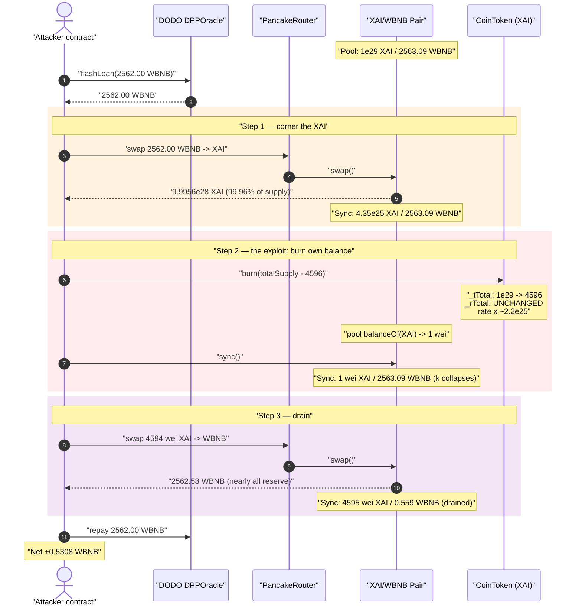
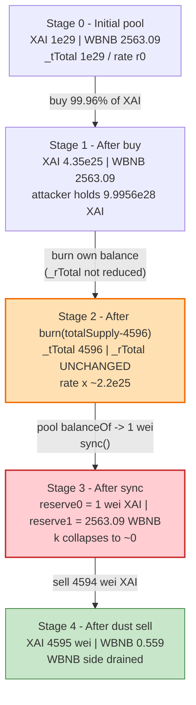
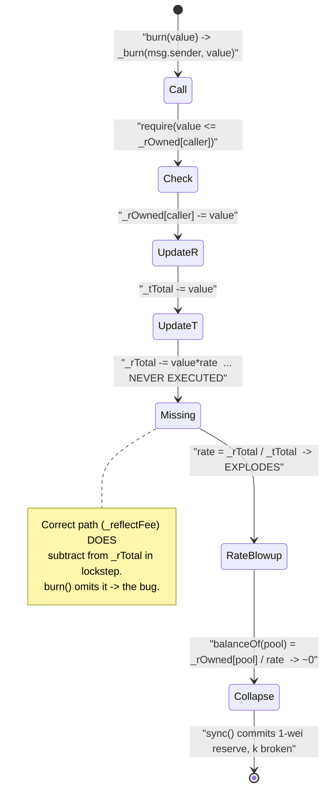
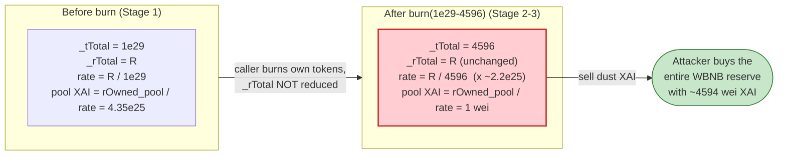

# XAI / CoinToken Exploit — Reflection-Token `burn()` Collapses Pool Balance via Un-touched `_rTotal`

> **Vulnerability classes:** vuln/logic/state-update · vuln/arithmetic/precision-loss

> **Reproduction:** the PoC compiles & runs in an isolated Foundry project at
> [this project folder](.) (the umbrella DeFiHackLabs repo contains several
> unrelated PoCs that do not whole-compile, so this one was extracted).
> Full verbose trace: [output.txt](output.txt).
> Verified vulnerable source: [sources/CoinToken_570Ce7/CoinToken.sol](sources/CoinToken_570Ce7/CoinToken.sol).

---

## Key info

| | |
|---|---|
| **Loss** | The attacker walked off with **2562.53 WBNB** of pool liquidity; net profit on the flash-loaned capital was **0.5308 WBNB** (≈ $160 at the time — most of the value had already been front-run/sandwiched by competing bots, leaving this exploit tx with thin residual profit) |
| **Vulnerable contract** | `CoinToken` (ticker "XAI") — [`0x570Ce7b89c67200721406525e1848bca6fF5A6F3`](https://bscscan.com/address/0x570Ce7b89c67200721406525e1848bca6ff5a6f3#code) |
| **Victim pool** | XAI/WBNB PancakePair — [`0xe633c651e6B3F744e7DeD314CDb243cf606A5F5B`](https://bscscan.com/address/0xe633c651e6B3F744e7DeD314CDb243cf606A5F5B) |
| **Flash-loan source** | DODO DPP/DVM oracle pool — `0xFeAFe253802b77456B4627F8c2306a9CeBb5d681` |
| **Attacker EOA** | [`0xea75aec151f968b8de3789ca201a2a3a7faeefba`](https://bscscan.com/address/0xea75aec151f968b8de3789ca201a2a3a7faeefba) |
| **Attacker contract** | [`0x7b11ae85f73b7ee6aa84cc91430581bd952d9ffa`](https://bscscan.com/address/0x7b11ae85f73b7ee6aa84cc91430581bd952d9ffa) |
| **Attack tx** | [`0x2b251e456c434992b9ac7ec56dc166550c4cd7db3adefbf7eb3ab91cef55f9bf`](https://app.blocksec.com/explorer/tx/bsc/0x2b251e456c434992b9ac7ec56dc166550c4cd7db3adefbf7eb3ab91cef55f9bf) |
| **Chain / block / date** | BSC / fork 33,503,556 / Nov 13 2023 |
| **Compiler** | Solidity v0.8.7, optimizer **off** (`runs: 0` per BscScan meta) |
| **Bug class** | Reflection-token accounting bug — public `burn()` decrements `_tTotal` but not `_rTotal`, inflating the reflection rate and collapsing every other holder's (incl. the AMM pool's) effective balance to ~0 |

---

## TL;DR

`CoinToken` is an "RFI / reflection" token: a holder's visible balance is **not** stored directly.
It is computed on the fly as `balanceOf = _rOwned[acct] / rate`, where
`rate = _rTotal / _tTotal` ([CoinToken.sol:594-598](sources/CoinToken_570Ce7/CoinToken.sol#L594-L598),
[:801-804](sources/CoinToken_570Ce7/CoinToken.sol#L801-L804)).

The public `burn()` ([:628-630](sources/CoinToken_570Ce7/CoinToken.sol#L628-L630)) forwards to the
internal `_burn()` ([:642-647](sources/CoinToken_570Ce7/CoinToken.sol#L642-L647)), which subtracts the
burned amount from the caller's `_rOwned` **and from `_tTotal`** — but **leaves `_rTotal` untouched**.
Because `rate = _rTotal / _tTotal`, shrinking `_tTotal` while holding `_rTotal` fixed makes `rate`
**explode**, which makes `balanceOf` of **every other account** — including the XAI/WBNB pair —
collapse toward zero.

The attacker:

1. Flash-loans **2562.00 WBNB** from a DODO oracle pool.
2. **Buys ~99.96% of the pool's XAI** (gets `9.9956e28` of the `1e29` supply), shrinking the pool's
   XAI reserve from `4.35e25` after the buy.
3. **Calls `XAI.burn(totalSupply − 4596)`** on its *own* balance. `_tTotal` crashes from `1e29` to
   `4596`; `_rTotal` is unchanged. The reflection rate spikes by ~`2.2e25×`, so the **pool's** XAI
   `balanceOf` drops from `4.35e25` to **1 wei**.
4. **Calls `pair.sync()`** — the pair reads its now-1-wei XAI balance and writes `reserve0 = 1`,
   while `reserve1` (WBNB) stays at `2563.09`. The constant-product invariant `x·y = k` is shattered.
5. **Sells 4594 wei of XAI** into the degenerate pool and pulls out **2562.53 WBNB** — recovering the
   loan plus the residual liquidity.

The trace ends with `[PASS] testExploit()` and `Exploiter WBNB balance after attack:
0.530802178153884369`.

---

## Background — what CoinToken does

`CoinToken` ([source](sources/CoinToken_570Ce7/CoinToken.sol)) is a fork of the well-known
**RFI / "SafeMoon-style" reflection** contract. It maintains two parallel ledgers:

- **`_rOwned[acct]`** — a "reflected" balance in a huge fixed-point space (`_rTotal ≈ ~uint256(0)`
  rounded down to a multiple of `_tTotal`).
- **`_tTotal`** — the real, human-readable total supply.

A holder's actual balance is derived:

```solidity
function balanceOf(address account) public view override returns (uint256) {
    if (_isExcluded[account]) return _tOwned[account];
    return tokenFromReflection(_rOwned[account]);          // ← reflection path
}

function tokenFromReflection(uint256 rAmount) public view returns(uint256) {
    require(rAmount <= _rTotal, "Amount must be less than total reflections");
    uint256 currentRate =  _getRate();
    return rAmount.div(currentRate);                       // ← rOwned / rate
}

function _getRate() private view returns(uint256) {
    (uint256 rSupply, uint256 tSupply) = _getCurrentSupply();
    return rSupply.div(tSupply);                           // ← _rTotal / _tTotal (no exclusions here)
}
```

[CoinToken.sol:519-522](sources/CoinToken_570Ce7/CoinToken.sol#L519-L522),
[:594-598](sources/CoinToken_570Ce7/CoinToken.sol#L594-L598),
[:801-804](sources/CoinToken_570Ce7/CoinToken.sol#L801-L804).

The invariant the design *relies on* is: **whenever you change the supply, you must change `_rOwned`
and `_rTotal` and `_tTotal` together, so that `rate` moves smoothly and nobody else's derived balance
shifts.** The legitimate reflection path (`_reflectFee`,
[:758-765](sources/CoinToken_570Ce7/CoinToken.sol#L758-L765)) is careful to do exactly this — it
adjusts `_rTotal` and `_tTotal` in lockstep so the rate stays consistent.

On-chain parameters at the fork block (read from the trace):

| Parameter | Value (from trace) |
|---|---|
| `totalSupply()` (`_tTotal`) | `100000000000000000000000000000` = **1e29** ([output.txt:1658](output.txt)) |
| Pool XAI reserve **after** attacker's buy | `43502994093751897288319708` ≈ **4.35e25** ([output.txt:1644](output.txt)) |
| Pool WBNB balance | `2563091604398998683661` ≈ **2563.09 WBNB** ([output.txt:1628](output.txt)) |
| Cached `getReserves()` *before* attack (stale) | reserve0 (XAI) `1e29`, reserve1 (WBNB) `1.09e18` ([output.txt:1626](output.txt)) |
| `token0` / `token1` | XAI / WBNB (Sync writes reserve0=XAI balance, reserve1=WBNB balance) |

---

## The vulnerable code

### 1. Public, permissionless `burn()`

```solidity
function burn(uint256 _value) public {
    _burn(msg.sender, _value);
}
```

[CoinToken.sol:628-630](sources/CoinToken_570Ce7/CoinToken.sol#L628-L630) — no access control; any
holder may burn any amount up to their own `_rOwned`.

### 2. `_burn()` updates `_tTotal` but NOT `_rTotal`

```solidity
function _burn(address _who, uint256 _value) internal {
    require(_value <= _rOwned[_who]);          // ⚠️ compares a TOKEN amount against an rOwned amount
    _rOwned[_who] = _rOwned[_who].sub(_value); // burn caller's reflected balance
    _tTotal = _tTotal.sub(_value);             // ⚠️ shrink real supply...
    emit Transfer(_who, address(0), _value);
}                                              // ⚠️ ...but _rTotal is NEVER touched
```

[CoinToken.sol:642-647](sources/CoinToken_570Ce7/CoinToken.sol#L642-L647).

Compare this with the *correct* supply-reduction path, which reduces both `_rTotal` and `_tTotal`:

```solidity
function _reflectFee(uint256 rFee, uint256 rBurn, uint256 rCharity,
                     uint256 tFee, uint256 tBurn, uint256 tCharity) private {
    _rTotal = _rTotal.sub(rFee).sub(rBurn).sub(rCharity); // ← _rTotal IS adjusted here
    ...
    _tTotal = _tTotal.sub(tBurn);                          // ← in lockstep with _tTotal
    emit Transfer(address(this), address(0), tBurn);
}
```

[CoinToken.sol:758-765](sources/CoinToken_570Ce7/CoinToken.sol#L758-L765).

`_burn()` is missing the `_rTotal` half of that update — that omission is the entire bug.

---

## Root cause — why it was possible

In a reflection token, every holder's visible balance is `balanceOf(x) = _rOwned[x] / rate`,
`rate = _rTotal / _tTotal`. Because all balances share **one** global divisor, **moving the divisor
moves everybody's balance at once.** The design only stays sound if any supply change adjusts
numerator (`_rOwned`/`_rTotal`) and denominator (`_tTotal`) so that the divisor for *non-participating*
accounts is preserved.

`_burn()` breaks this:

> It removes `_value` from the **caller's** `_rOwned` and from `_tTotal`, but it does **not** remove
> the corresponding reflected amount (`_value * rate`) from `_rTotal`. So `_rTotal` is left far too
> large relative to the new, tiny `_tTotal`. The rate `= _rTotal / _tTotal` therefore *explodes*, and
> `balanceOf` of **every account the attacker does not control** — most importantly the AMM pair —
> divides by that huge rate and collapses to ~0.

Concretely:

- Before burn: `_tTotal = 1e29`. Pool's derived XAI balance = `4.35e25`.
- Attacker burns `1e29 − 4596` of *its own* tokens. Now `_tTotal = 4596`, `_rTotal` unchanged.
- New `rate ≈ _rTotal / 4596`, i.e. ~`(1e29/4596) ≈ 2.18e25` times larger than before.
- Pool's `balanceOf = _rOwned[pool] / new_rate` ⇒ `4.35e25 / 2.18e25 ≈ 1 wei`. The trace confirms the
  pool's XAI balance is **exactly `1`** immediately after the burn ([output.txt:1667](output.txt)).

The four design decisions that compose into the exploit:

1. **Reflection accounting with a single shared rate** — a global divisor means any global change is a
   value transfer between holders.
2. **`burn()` is public and permissionless** — anyone can move that global divisor at will.
3. **`burn()` forgets to subtract from `_rTotal`** — the move is in the *wrong direction* for everyone
   except the burner, deflating other holders (the pool) toward zero.
4. **PancakePair trusts `sync()`** — the pair re-reads its own (now collapsed) token balance and
   commits it as the new reserve, breaking `x·y = k`.

A secondary smell worth noting: `require(_value <= _rOwned[_who])` at
[:643](sources/CoinToken_570Ce7/CoinToken.sol#L643) compares a *token-space* argument against an
*rOwned-space* balance, so the bound check is itself dimensionally wrong — but it does not block the
attack because `_rOwned[attacker]` is astronomically larger than `_tTotal`.

---

## Preconditions

- A live `XAI/WBNB` PancakeSwap pair holding real WBNB liquidity (here ~2563 WBNB).
- The attacker must end up holding (almost) all XAI before burning, so that the rate-collapse hits the
  *pool* and not the attacker. This is achieved by buying ~99.96% of the supply out of the pool first.
- Enough WBNB to corner the pool — fully recovered intra-transaction, hence **flash-loanable**. The PoC
  borrows the DODO pool's entire WBNB balance (`2562.00 WBNB`) via `DPPOracle.flashLoan(...)`
  ([test/XAI_exp.sol:51](test/XAI_exp.sol#L51)).
- No access control on `burn()` (satisfied) and no TWAP/oracle on the pair (PancakeV2 prices straight
  off spot reserves).

---

## Attack walkthrough (with on-chain numbers from the trace)

The pair's `token0 = XAI`, `token1 = WBNB` ⇒ `reserve0 = XAI`, `reserve1 = WBNB`. All figures are from
the `Sync`/`Swap`/`balanceOf` lines in [output.txt](output.txt). WBNB is shown in whole tokens
(÷1e18); XAI in raw wei.

| # | Step (trace line) | Pool XAI (reserve0) | Pool WBNB (reserve1) | Effect |
|---|------|-----------:|-------------:|--------|
| 0 | **Flash loan** 2562.00 WBNB from DODO ([:1601](output.txt)) | 1e29 (stale) | 1.09 (stale cache) | Actual pool balances were 1e29 XAI / 2563.09 WBNB; `getReserves` was stale. |
| 1 | **Buy XAI** — swap 2562.00 WBNB → 9.9956e28 XAI to attacker ([:1629-1648](output.txt)) | `4.35e25` | `2563.09` | Attacker now holds ~99.96% of all XAI; pool XAI thinned. `Sync(4.35e25, 2563.09)`. |
| 2 | **`XAI.burn(1e29 − 4596)`** on attacker's own balance ([:1659-1663](output.txt)) | `4.35e25` *balance* → collapses | `2563.09` | `_tTotal: 1e29 → 4596`, `_rTotal` unchanged ⇒ rate ×~2.2e25. Pool `balanceOf(XAI)` drops to **1 wei** ([:1667](output.txt)). |
| 3 | **`pair.sync()`** ([:1665-1670](output.txt)) | **1 wei** | `2563.09` | Pair reads its 1-wei XAI balance, writes `Sync(reserve0: 1, reserve1: 2563.09)`. ⚠️ `k` collapses. |
| 4 | **Sell dust XAI** — swap 4594 wei XAI → 2562.53 WBNB ([:1676-1710](output.txt)) | 4595 wei | `0.559` | A handful of XAI wei buys essentially the entire WBNB reserve. `Sync(4595, 0.559)`. |
| 5 | **Repay loan** — transfer 2562.00 WBNB back to DODO ([:1717](output.txt)) | — | — | Loan + DODO fee returned. |
| 6 | **Net** ([:1734-1738](output.txt)) | — | — | Attacker keeps **0.5308 WBNB**. |

**Why "a few wei of XAI buys the whole WBNB reserve":** after the burn+sync the pair holds
`reserveXAI = 1 wei`, `reserveWBNB = 2563.09`. PancakeSwap's `getAmountOut` is
`out = (in·9975·reserveOut) / (reserveIn·10000 + in·9975)`. With `reserveIn = 1 wei` and a few-thousand-wei
input, the `in·9975` term dwarfs `reserveIn·10000`, so `out → reserveOut`. The attacker sells 4594 wei
of XAI (45 wei skimmed as transfer fee, 4504 wei reaching the pool — [output.txt:1678-1680](output.txt))
and extracts `2562.53 WBNB`, nearly the entire WBNB side.

### Profit / loss accounting (WBNB)

| Direction | Amount (WBNB) |
|---|---:|
| Borrowed from DODO (in) | 2562.00 |
| Spent — buy XAI (step 1) | 2562.00 |
| Received — sell dust XAI (step 4) | 2562.53 |
| Repaid to DODO (out) | 2562.00 |
| **Net profit kept** | **+0.5308** |

The pool itself lost essentially its entire WBNB reserve (`2563.09 → 0.559`, i.e. **~2562.53 WBNB
drained**). The attacker's *net* take on this particular tx was only **0.5308 WBNB** because the spread
between buy and sell was thin — the bulk of the pool's value was consumed in cornering it and repaying
the loan. (Reported aggregate loss across the incident was larger; this isolated tx nets ~0.53 WBNB.)

Trace ground truth:

```
[PASS] testExploit() (gas: 429441)
  Exploiter WBNB balance before attack: 0.000000000000000000
  Exploiter WBNB balance after attack : 0.530802178153884369
```

---

## Diagrams

### Sequence of the attack



### Pool / supply state evolution



### The flaw inside `_burn` (rate math)



### Why the burn is theft: shared-divisor reflection



---

## Why each magic number

- **Flash loan = 2562.00 WBNB** — the full WBNB balance of the DODO pool; just enough to corner ~99.96%
  of the XAI reserve in one swap.
- **`burn(totalSupply − 4596)`** — the attacker burns *almost* everything, deliberately leaving a tiny
  remainder so `_tTotal` (and hence the division `_rTotal/_tTotal`) does not hit zero and revert. With
  `_tTotal = 4596`, the pool's `_rOwned` divides down to exactly `1 wei`
  ([output.txt:1662](output.txt) shows storage slot 14 / `_tTotal` set to `4596`;
  [output.txt:1667](output.txt) shows pool XAI balance `1`).
- **Sell 4594 wei XAI** — the attacker's entire post-burn XAI balance ([output.txt:1675](output.txt)).
  Against a 1-wei XAI reserve this single dust sell captures essentially the whole WBNB side.

---

## Remediation

1. **Fix `_burn()` to adjust `_rTotal` in lockstep with `_tTotal`.** Any supply reduction in a
   reflection token must remove the burner's reflected amount from `_rTotal`:
   ```solidity
   function _burn(address _who, uint256 _value) internal {
       uint256 rate = _getRate();
       uint256 rValue = _value.mul(rate);
       require(rValue <= _rOwned[_who]);
       _rOwned[_who] = _rOwned[_who].sub(rValue);
       _rTotal = _rTotal.sub(rValue);   // ← the missing line
       _tTotal = _tTotal.sub(_value);
       emit Transfer(_who, address(0), _value);
   }
   ```
   This keeps `rate = _rTotal/_tTotal` constant, so other holders' balances do not move.
2. **Restrict or remove the public `burn()`.** If burning is not a product requirement, drop it. If it
   is, gate it (`onlyOwner`/treasury) so an attacker cannot weaponize the global rate.
3. **Reconsider reflection accounting entirely.** RFI-style shared-rate tokens are a recurring source of
   AMM-drain exploits precisely because one variable governs everyone's balance. A plain ERC20 with an
   explicit fee mechanism avoids the whole class.
4. **Pools should not price off a token that can mutate third-party balances.** PancakeV2's `sync()`
   trusts `balanceOf` — a token whose `balanceOf` can change arbitrarily under a public call is unsafe
   to pool. Use TWAP/oracle pricing, or do not list such tokens.
5. **Fix the dimensionally-wrong bound check.** `require(_value <= _rOwned[_who])` compares token-space
   against rOwned-space; compare like with like.

---

## How to reproduce

The PoC was extracted into a standalone Foundry project (the umbrella DeFiHackLabs repo has several
unrelated PoCs that fail to compile under `forge test`'s whole-project build):

```bash
_shared/run_poc.sh 2023-11-XAI_exp -vvvvv
```

- RPC: a **BSC archive** endpoint is required (fork block 33,503,556). The harness uses the `bsc`
  alias from `foundry.toml`; most public BSC RPCs prune state this old and fail with
  `header not found` / `missing trie node`.
- Result: `[PASS] testExploit()` with `Exploiter WBNB balance after attack: 0.530802178153884369`.

Expected tail:

```
Ran 1 test for test/XAI_exp.sol:XAIExploit
[PASS] testExploit() (gas: 429441)
Logs:
  Exploiter WBNB balance before attack: 0.000000000000000000
  Exploiter WBNB balance after attack: 0.530802178153884369

Suite result: ok. 1 passed; 0 failed; 0 skipped; finished in 11.27s
```

---

*References: DeFiHackLabs XAI PoC; post-mortem thread https://x.com/MetaSec_xyz/status/1724683082064855455 ;
vulnerable source verified on BscScan (CoinToken @ `0x570Ce7b89c67200721406525e1848bca6fF5A6F3`).*
