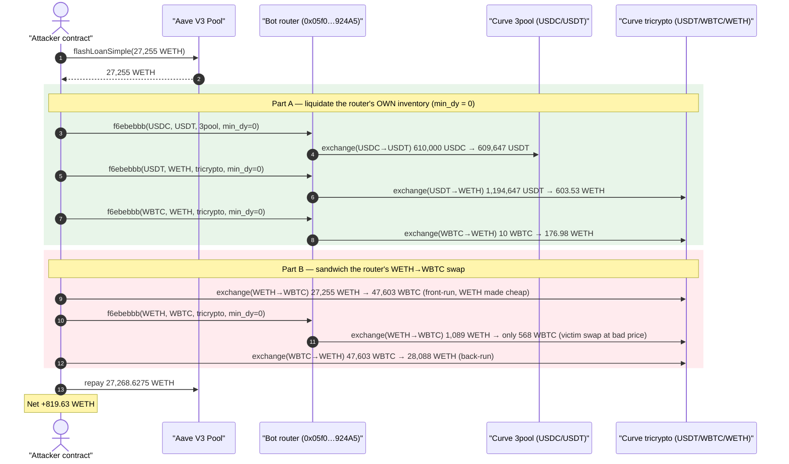
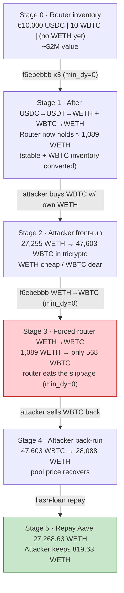
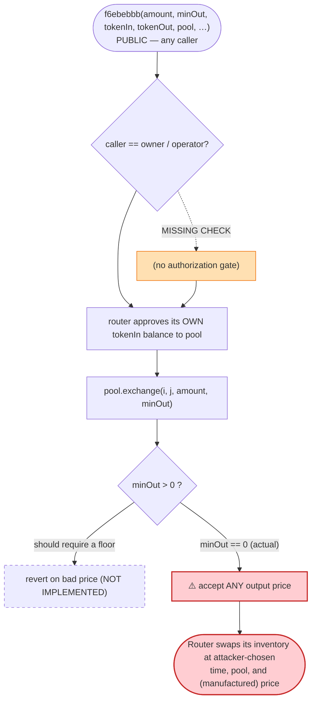
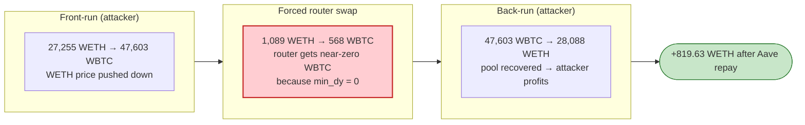

# "bot" / MEV-bot Router Exploit — Permissionless, Zero-Slippage Forced Swaps + Sandwich Drain

> **Vulnerability classes:** vuln/access-control/missing-auth · vuln/defi/slippage

> **Reproduction:** the PoC compiles & runs in an isolated Foundry project at
> [this project folder](.) (the umbrella DeFiHackLabs repo contains many unrelated PoCs
> that do not whole-compile, so this one was extracted).
> Full verbose trace: [output.txt](output.txt).
> The vulnerable router `0x05f016765c6C601fd05a10dBa1AbE21a04F924A5` is **unverified / closed-source**
> on Etherscan (confirmed: `getsourcecode` returns *"Contract source code not verified"*, and the
> exploited selector `0xf6ebebbb` has **no** text signature in the 4byte directory). There is therefore
> no `sources/` snippet to link; the bug is reconstructed from the on-chain trace and the PoC calldata.

---

## Key info

| | |
|---|---|
| **Loss** | ~$2,000,000 (per PoC header) — in this fork-block reproduction the attacker nets **819.63 WETH** from a single tx |
| **Vulnerable contract** | Unverified MEV/arbitrage **bot router** — [`0x05f016765c6C601fd05a10dBa1AbE21a04F924A5`](https://etherscan.io/address/0x05f016765c6c601fd05a10dba1abe21a04f924a5) |
| **Vulnerable function** | `f6ebebbb(uint256 amount, uint256 minOut, address tokenIn, address tokenOut, address pool, …)` — public, no access control, hardcodes Curve `min_dy = 0` |
| **Victim** | The router's **own token inventory** (USDC, USDT, WBTC, WETH it held for arbitraging) + LPs of the manipulated Curve pool |
| **Pools touched** | Curve 3pool `0xbEbc44782C7dB0a1A60Cb6fe97d0b483032FF1C7` (USDC/USDT) · Curve tricrypto `0xD51a44d3FaE010294C616388b506AcdA1bfAAE46` (USDT/WBTC/WETH) |
| **Attacker EOA** | [`0x46d9b3dfbc163465ca9e306487cba60bc438f5a2`](https://etherscan.io/address/0x46d9b3dfbc163465ca9e306487cba60bc438f5a2) |
| **Attacker contract** | [`0xeadf72fd4733665854c76926f4473389ff1b78b1`](https://etherscan.io/address/0xeadf72fd4733665854c76926f4473389ff1b78b1) |
| **Attack tx** | [`0xbc08860cd0a08289c41033bdc84b2bb2b0c54a51ceae59620ed9904384287a38`](https://explorer.phalcon.xyz/tx/eth/0xbc08860cd0a08289c41033bdc84b2bb2b0c54a51ceae59620ed9904384287a38) |
| **Chain / block / date** | Ethereum mainnet / fork at **18,523,343** (`18_523_344 - 1`) / Nov 2023 |
| **Flash-loan source** | Aave V3 Pool `0x87870Bca3F3fD6335C3F4ce8392D69350B4fA4E2` — 27,255 WETH, 0.05% premium |
| **Compiler** | PoC: Solidity `^0.8.10`, EVM `cancun` |
| **Bug class** | Missing access control + missing slippage (`min_dy=0`) on a privileged swap helper → forced-swap value extraction via sandwich |

---

## TL;DR

The victim is an **unverified MEV/arbitrage bot router** that held a working inventory of stablecoins
and blue-chips (USDC, USDT, WBTC, WETH) and exposed a helper, selector `0xf6ebebbb`, that swaps the
**router's own balance** of one token into another on a caller-specified Curve pool. The helper has
**two fatal flaws**:

1. **No access control** — *anyone* can call it and make the router move its own funds.
2. **No slippage protection** — it calls Curve's `exchange(i, j, dx, min_dy)` with **`min_dy = 0`**,
   so the router accepts any output, however bad.

The attacker chains these into a profitable two-part drain inside one Aave flash loan:

- **Part A — direct inventory liquidation.** The attacker forces the router to dump *its own*
  610,000 USDC → USDT (3pool), then 1,194,647 USDT → 603.5 WETH and ~10 WBTC → 176.98 WETH
  (tricrypto). The router's holdings are converted to WETH inside the tricrypto pool.
- **Part B — sandwich the router's WETH→WBTC swap.** The attacker front-runs by swapping its
  **flash-loaned 27,255 WETH → 47,603 WBTC** in tricrypto (pushing WETH cheap / WBTC dear), then
  forces the router (via `0xf6ebebbb`) to swap its ~1,089 WETH → only 568 WBTC at that skewed price,
  then back-runs by swapping its 47,603 WBTC → **28,088.26 WETH**.

After repaying the flash loan (27,255 + 13.6275 premium = 27,268.6275 WETH), the attacker keeps
**819.63 WETH**. The `min_dy = 0` is what makes the sandwich free money: the router has no floor on
what it will accept, so the attacker's front-run can move the price as far as it likes and the forced
victim swap will still execute.

---

## Background — what the router was

`0x05f016…924A5` is a private trading/arbitrage bot's router. It is not verified on Etherscan, but
its on-chain behavior (visible in the trace) is unambiguous: it custodies token inventory and contains
a helper that performs Curve swaps on that inventory. The PoC reconstructs the helper's ABI from its
4-byte selector and the observed calldata layout:

```solidity
// reconstructed from PoC calldata + trace (function is in unverified bytecode)
bytes4 vulnFunctionSignature = hex"f6ebebbb";
abi.encodeWithSelector(
    vulnFunctionSignature,
    amount,        // dx — how much of tokenIn to swap (PoC passes the router's full balance)
    0,             // min_dy — ⚠️ always 0
    tokenIn,       // e.g. USDC
    tokenOut,      // e.g. USDT
    pool,          // Curve pool to route through
    0, 0           // two trailing zero words (unused in the observed paths)
);
```

See the PoC's `executeOperation` ([test/bot_exp.sol:62-121](test/bot_exp.sol#L62-L121)) for the exact
sequence of five calls (four `f6ebebbb` forced swaps interleaved with two attacker-owned tricrypto
swaps).

At the fork block the router was holding (read from the trace's `balanceOf` static calls):

| Asset | Router balance at attack time | Trace line |
|---|---:|---|
| USDC | 610,000.001612 USDC | [output.txt:1604](output.txt#L1604) |
| USDT (after USDC→USDT) | 1,194,647.407421 USDT | [output.txt:1642](output.txt#L1642) |
| WBTC | 10.00555329 WBTC | [output.txt:1692](output.txt#L1692) |
| WETH (after stablecoin liquidation + sandwich front-run) | 1,089.167189788580147404 WETH | [output.txt:1784](output.txt#L1784) |

The whole game is that the router will, on command from *anyone*, convert any of these to any other
token through a pool the caller picks, accepting *any* output.

---

## The vulnerable code

> The router is unverified, so a real source snippet cannot be linked. The semantic of `0xf6ebebbb`
> is fully determined by the trace. Each invocation does, in effect:

```solidity
// PSEUDOCODE — equivalent behaviour observed in the trace for selector 0xf6ebebbb
function f6ebebbb(
    uint256 amount,
    uint256 minOut,     // caller-supplied; PoC always passes 0
    address tokenIn,
    address tokenOut,
    address pool,
    uint256 /*unused*/,
    uint256 /*unused*/
) external {                                  // ⚠️ NO onlyOwner / onlyOperator
    IERC20(tokenIn).approve(pool, amount);     // router approves its OWN inventory
    ICurve(pool).exchange(
        indexOf(pool, tokenIn),
        indexOf(pool, tokenOut),
        amount,
        minOut                                 // ⚠️ == 0  → no slippage floor
    );
    // output tokenOut now sits in the router; no profitability / caller check
}
```

The two defects are visible directly in the PoC calldata: every `f6ebebbb` call passes its second
argument (`min_dy`) as **`0`** ([test/bot_exp.sol:73-80, 84-91, 95-102, 110-117](test/bot_exp.sol#L73-L117)),
and the calls succeed even though they originate from the attacker's flash-loan callback, proving the
absence of any caller restriction.

The on-chain Curve exchanges confirm the `min_dy = 0` reaches Curve unchanged, e.g.:

```
output.txt:1607  Vyper_contract::exchange(1, 2, 610000001612, 0)            // USDC→USDT, min_dy = 0
output.txt:1646  Curve …Pool::exchange(0, 2, 1194647407421, 0)             // USDT→WETH, min_dy = 0
output.txt:1696  Curve …Pool::exchange(1, 2, 1000555329, 0)                // WBTC→WETH, min_dy = 0
output.txt:1788  Curve …Pool::exchange(2, 1, 1089167189788580147404, 0)    // WETH→WBTC, min_dy = 0  ← sandwiched
```

---

## Root cause — why it was possible

A function that spends a contract's own assets MUST answer two questions before executing:
**"is the caller allowed?"** and **"is the output acceptable?"** This router answers neither.

1. **No authorization.** `f6ebebbb` lets *any* external address direct the router to swap *its own*
   inventory. Normally an arbitrage bot only swaps when *it* computes a profitable route; here the
   decision of when, what, and through which pool is handed to the attacker.
2. **`min_dy = 0` (no slippage floor).** Curve's `exchange` will execute against whatever the pool's
   instantaneous reserves dictate. With `min_dy = 0`, the router will accept an arbitrarily bad rate.
   This is what converts (1) from "annoying — anyone can rebalance the bot" into "critical — anyone can
   make the bot trade into a price they themselves created."

These compose into the classic **forced-swap sandwich**:

> Because the attacker controls *when* the router's WETH→WBTC swap happens (flaw 1) **and** the router
> will accept any price (flaw 2), the attacker simply moves the tricrypto price first (front-run), fires
> the router's swap at that bad price, and reverses their position (back-run). The router's slippage is
> the attacker's profit. The stablecoin/WBTC inventory liquidation in Part A is pure bonus: the attacker
> didn't even need to own those assets — it ordered the router to convert *its own* holdings to WETH and
> then bled that WETH out through the same sandwiched pool.

The Aave flash loan provides the working capital (27,255 WETH) needed to move tricrypto's price far
enough for the sandwich; it is repaid in the same transaction, so the attack is **capital-free** beyond
gas.

---

## Preconditions

- The router holds a non-trivial token inventory (it did: ~$2M across USDC/USDT/WBTC/WETH).
- `f6ebebbb` is callable by an arbitrary address (no `onlyOwner`/operator gate) — **the core flaw**.
- `f6ebebbb` forwards `min_dy = 0` to Curve — **the amplifying flaw**.
- Enough flash-loanable WETH to skew the tricrypto pool for the sandwich. The PoC borrows
  **27,255 WETH** from Aave V3 ([test/bot_exp.sol:58](test/bot_exp.sol#L58)); the loan + 0.05% premium
  is repaid intra-transaction, so the attack needs **no upfront capital**.

---

## Attack walkthrough (with on-chain numbers from the trace)

All figures are taken from the `Transfer` / `TokenExchange` events and `balanceOf` static calls in
[output.txt](output.txt). Curve tricrypto indices: `0 = USDT`, `1 = WBTC`, `2 = WETH`.

| # | Step | Actor | Concrete values | Trace |
|---|------|-------|-----------------|-------|
| 0 | **Flash-loan 27,255 WETH** from Aave V3 (premium 13.6275 WETH) | Attacker → Aave | 27,255 WETH received | [:1583-1588](output.txt#L1583-L1588) |
| 1 | **Force router: USDC → USDT** via 3pool (`f6ebebbb`, min_dy=0) | Attacker → router | 610,000.001612 USDC → 609,647.397555 USDT | [:1606-1635](output.txt#L1606-L1635) |
| 2 | **Force router: USDT → WETH** via tricrypto (min_dy=0) | Attacker → router | 1,194,647.407421 USDT → **603.530688630956198648 WETH** | [:1643-1677](output.txt#L1643-L1677) |
| 3 | **Force router: WBTC → WETH** via tricrypto (min_dy=0) | Attacker → router | 10.00555329 WBTC → **176.978770615911242398 WETH** | [:1693-1726](output.txt#L1693-L1726) |
| 4 | **Front-run: attacker WETH → WBTC** (own flash-loaned WETH) in tricrypto | Attacker → tricrypto | 27,255 WETH → **47,603.811518 WBTC** (pushes WETH cheap) | [:1744-1773](output.txt#L1744-L1773) |
| 5 | **Force router: WETH → WBTC** via tricrypto at the skewed price (min_dy=0) | Attacker → router | router's 1,089.167189788580147404 WETH → only **568.325723 WBTC** | [:1785-1817](output.txt#L1785-L1817) |
| 6 | **Back-run: attacker WBTC → WETH** in tricrypto | Attacker → tricrypto | 47,603.811518 WBTC → **28,088.260089557071070923 WETH** | [:1835-1865](output.txt#L1835-L1865) |
| 7 | **Repay flash loan** 27,268.6275 WETH to Aave | Attacker → Aave | leaves attacker with 819.63 WETH | [:1916-1920](output.txt#L1916-L1920) |

Steps 4–6 are the sandwich: the attacker buys WBTC cheaply with its own WETH (4), forces the router to
sell *its* WETH into the depressed-WETH pool, getting almost nothing back (5), and then sells the WBTC
back into the now-recovered pool for far more WETH than it spent (6). The router's swap (5) executed at
a price the attacker manufactured, and `min_dy = 0` meant the router could not refuse.

---

## Profit / loss accounting (WETH)

The attacker's contract starts and ends the transaction; net is what it keeps after repaying Aave.

| Flow | WETH |
|---|---:|
| Flash-loan in (Aave) | +27,255.000000000000000000 |
| Attacker front-run: spends own 27,255 WETH for WBTC | −27,255.000000000000000000 |
| Attacker back-run: WBTC → WETH | +28,088.260089557071070923 |
| Flash-loan repay (principal + 0.05% premium) | −27,268.627500000000000000 |
| **Net attacker WETH** | **+819.632589557071070923** |

Confirmed by the test logs:

```
attacker balance before attack: 0.000000000000000000
attacker balance after attack : 819.632589557071070923
```
([output.txt:1564-1565](output.txt#L1564-L1565))

The 819.63 WETH the attacker walks away with is funded by (a) the router's stablecoin/WBTC inventory
that was converted to WETH and bled into the pool, and (b) the slippage the router ate on its forced
1,089 WETH → 568 WBTC swap. The PoC header records the real-world total loss as **~$2M**; this
fork-block reproduction captures one tx's WETH profit.

---

## Diagrams

### Sequence of the attack



### Pool / inventory state evolution



### The flaw inside `f6ebebbb`



### Why the sandwich is theft



---

## Remediation

1. **Add access control to `f6ebebbb`.** Any function that spends the contract's own inventory must be
   `onlyOwner` / `onlyOperator` (or restricted to a trusted automation key). An arbitrage bot should
   never let an arbitrary address decide when and how it trades.
2. **Never pass `min_dy = 0`.** Compute a slippage-bounded minimum output off-chain (or from a manipulation-
   resistant oracle / TWAP) and pass it as `min_dy`. A swap helper that accepts any price is a standing
   invitation to be sandwiched.
3. **Validate profitability on-chain.** Even for an owner-only path, require the post-swap balance to be
   no worse than a configured floor (e.g., `assert(balanceAfter >= expectedMin)`), so an operator key
   compromise or a bad route still cannot drain inventory.
4. **Don't custody large idle inventory in a hot router.** Keep working capital minimal and sweep
   profits to a cold treasury, so a single bug caps the loss.
5. **Verify and audit the bytecode.** The contract being unverified hid these flaws from the public and
   from automated scanners; closed-source DeFi infrastructure holding $2M is an unacceptable risk.

---

## How to reproduce

The PoC was extracted into a standalone Foundry project (the umbrella DeFiHackLabs repo has many
unrelated PoCs that fail to compile under a whole-project `forge build`):

```bash
_shared/run_poc.sh 2023-11-bot_exp -vvvvv
```

- RPC: an Ethereum **archive** endpoint is required (the fork pins block `18_523_343`).
  `foundry.toml` uses an Infura mainnet endpoint that serves historical state at that block.
- Result: `[PASS] testExpolit()`; attacker WETH balance goes 0 → **819.632589557071070923**.

Expected tail:

```
Ran 1 test for test/bot_exp.sol:ContractTest
[PASS] testExpolit() (gas: 1849555)
Logs:
  attacker balance before attack: 0.000000000000000000
  attacker balance after attack: 819.632589557071070923

Suite result: ok. 1 passed; 0 failed; 0 skipped
```

---

*References: BlockSec analysis — https://twitter.com/BlockSecTeam/status/1722101942061601052 ·
DeFiHackLabs (bot, Ethereum, ~$2M).*
