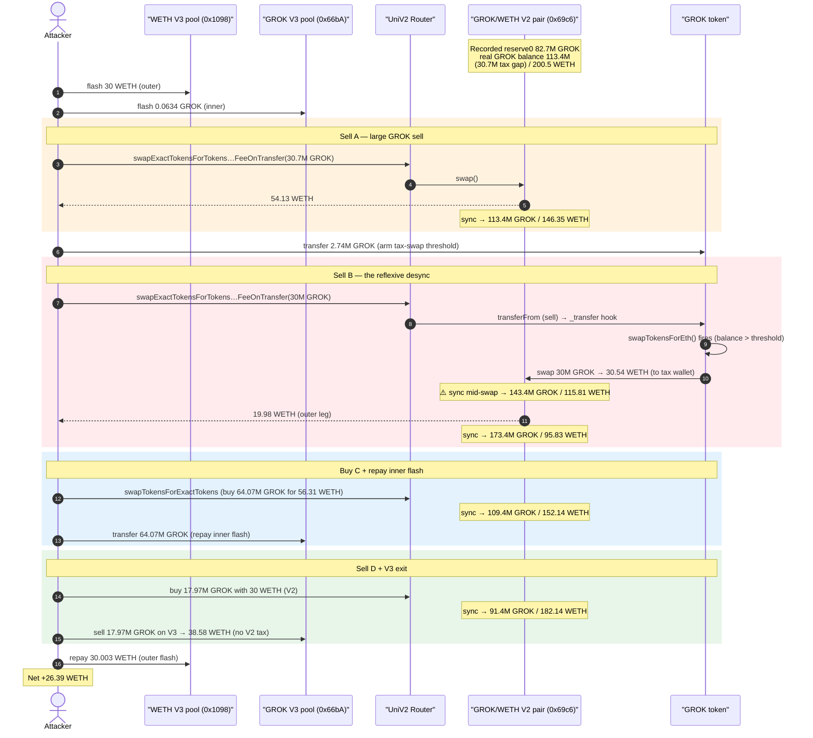
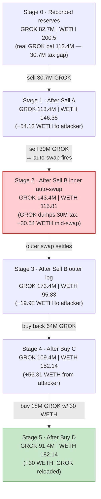
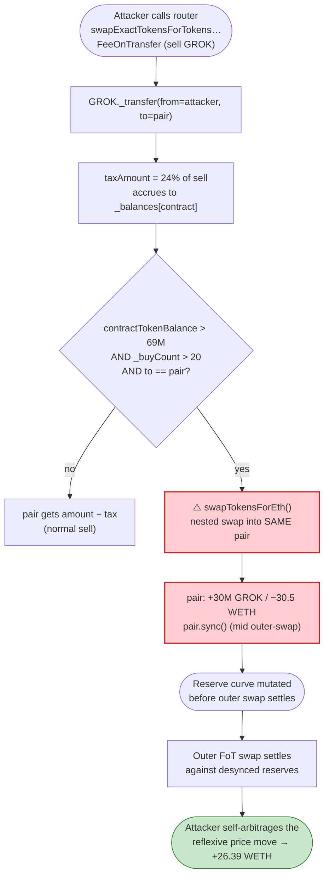

# GROK Token Exploit — Fee-on-Transfer Tax Auto-Swap Reserve Desync

> **Reproduction:** the PoC compiles & runs in an isolated Foundry project at
> [this project folder](.) (the umbrella DeFiHackLabs repo contains many
> unrelated PoCs that do not whole-compile, so this one is extracted).
> Full verbose trace: [output.txt](output.txt).
> Verified vulnerable source: [GROK.sol](sources/GROK_8390a1/GROK.sol).

---

## Key info

| | |
|---|---|
| **Loss** | **~26.39 WETH** (≈ $50K at the time) drained from the GROK/WETH Uniswap-V2 pair |
| **Vulnerable contract** | `GROK` — [`0x8390a1DA07E376ef7aDd4Be859BA74Fb83aA02D5`](https://etherscan.io/address/0x8390a1DA07E376ef7aDd4Be859BA74Fb83aA02D5#code) |
| **Victim pool** | GROK/WETH **V2** pair — `0x69c66BeAfB06674Db41b22CFC50c34A93b8d82a2` |
| **Flash-loan sources** | WETH V3 pool `0x109830a1AAaD605BbF02a9dFA7B0B92EC2FB7dAa` (30 WETH); GROK/WETH V3 pool `0x66bA59cBD09E75B209D1D7E8Cf97f4Ab34DA413B` (0.0634 GROK seed + exit liquidity) |
| **Attacker EOA** | `0x864e656c57a5a119f332c47326a35422294db5c9` |
| **Attacker contract** | `0x03e7b13bcd9b8383f403696c1494845560607eca` |
| **Attack tx** | `0x3e9bcee951cdad84805e0c82d2a1e982e71f2ec301a1cbd344c832e0acaee813` |
| **Chain / block / date** | Ethereum / 18,538,678 / Nov 10, 2023 |
| **Compiler** | Solidity v0.8.20, optimizer **200 runs** |
| **Bug class** | Fee-on-transfer token whose contract-internal tax auto-swap re-enters its own AMM pool mid-swap, desyncing reserves and enabling self-arbitrage |

---

## TL;DR

`GROK` is a stock "meme-token" template: a 24% transfer tax that accrues into the
token contract, plus an **automatic tax-swap** (`swapTokensForEth`,
[GROK.sol:272-284](sources/GROK_8390a1/GROK.sol#L272-L284)) that dumps the accrued
tax back into the **same** GROK/WETH Uniswap-V2 pair whenever the contract's GROK
balance crosses a threshold during a sell.

Because that auto-swap fires **inside** `_transfer`
([GROK.sol:241-247](sources/GROK_8390a1/GROK.sol#L241-L247)) — i.e. *in the middle
of the attacker's own swap* — the pair's GROK balance is mutated and `sync()`'d a
second time before the attacker's outer swap settles. The reserve curve the outer
swap quotes against is no longer the reserve curve that was used when the attacker's
input was priced. An attacker who sandwiches this self-inflicted desync with two
flash loans can repeatedly buy GROK cheap and sell it dear into the *same*
transaction and walk away with the pool's WETH.

The attacker:

1. Flash-borrows **30 WETH** (outer) and **0.0634 GROK** (inner, used to seed the
   pool with a fee-bearing "donation").
2. **Sells GROK** into the V2 pool with the FoT-supporting router; the 24% tax
   accrued in the GROK contract is over the swap threshold, so GROK's
   `swapTokensForEth` fires and dumps **30M GROK** into the pool *during* the swap,
   pulling **30.5 WETH** out to the tax wallet.
3. Rides the resulting reserve desync: buys GROK back, then sells it again into the
   now-mispriced reserves.
4. Repays both flash loans (30.003 WETH + 0.0006 GROK premium) and keeps the
   difference.

Net result: **+26.39 WETH** profit, taken from the GROK/WETH pool's honest LP
liquidity.

---

## Background — what GROK is

`GROK` ([source](sources/GROK_8390a1/GROK.sol)) is an unaudited copy of the
ubiquitous OpenZeppelin-derived "tax token" launch template (9 decimals,
6.9B supply). Its only non-standard behavior lives in `_transfer`:

| Parameter | Value |
|---|---|
| `_initialBuyTax` / `_initialSellTax` | **24%** |
| `_finalBuyTax` / `_finalSellTax` | 0% (only after `_buyCount` passes the reduce thresholds) |
| `_reduceSellTaxAt` | 29 |
| `_preventSwapBefore` | 20 (auto-swap disabled until 20 buys) |
| `_taxSwapThreshold` / `_maxTaxSwap` | **69,000,000 GROK** |
| `_maxTxAmount` / `_maxWalletSize` | 138,000,000 GROK |
| `_tTotal` (supply) | 6,900,000,000 GROK |
| decimals | **9** |

Two mechanisms compose into the bug:

- **Sell tax accrual.** On a sell (`to == uniswapV2Pair`), 24% of the transfer is
  *not* sent to the pair — it is credited to `_balances[address(this)]`
  ([GROK.sol:250-253](sources/GROK_8390a1/GROK.sol#L250-L253)). The pair therefore
  receives `amount − tax`, and the GROK contract steadily accumulates tax tokens.
- **Auto tax-swap.** When the contract's accrued GROK balance exceeds
  `_taxSwapThreshold`, `_buyCount > _preventSwapBefore`, and the current transfer is
  a sell, `_transfer` calls `swapTokensForEth(...)`
  ([GROK.sol:241-247](sources/GROK_8390a1/GROK.sol#L241-L247)), which sells the
  accrued tax **back into the same GROK/WETH V2 pair** for ETH.

The fatal property is *when* that auto-swap runs: it is a nested swap executed
**inside the attacker's swap**, against the same reserves, before the outer swap's
own `sync()` finalizes the price.

---

## The vulnerable code

### 1. Sell tax is withheld from the pair and accrues to the contract

```solidity
// GROK.sol:213-257  _transfer
if(to == uniswapV2Pair && from != address(this) ){
    taxAmount = amount.mul((_buyCount>_reduceSellTaxAt)?_finalSellTax:_initialSellTax).div(100); // 24%
}

uint256 contractTokenBalance = balanceOf(address(this));
if (!inSwap && to == uniswapV2Pair && swapEnabled
        && contractTokenBalance>_taxSwapThreshold && _buyCount>_preventSwapBefore) {
    swapTokensForEth(min(amount,min(contractTokenBalance,_maxTaxSwap)));   // ⚠️ nested swap into SAME pool
    uint256 contractETHBalance = address(this).balance;
    if(contractETHBalance > 0) { sendETHToFee(address(this).balance); }
}
...
if(taxAmount>0){
    _balances[address(this)]=_balances[address(this)].add(taxAmount);     // tax stays in contract
    emit Transfer(from, address(this),taxAmount);
}
_balances[from]=_balances[from].sub(amount);
_balances[to]=_balances[to].add(amount.sub(taxAmount));                   // pair gets amount − tax
```

[contracts/GROK.sol:236-256](sources/GROK_8390a1/GROK.sol#L236-L256)

### 2. The auto-swap dumps tax back into the same V2 pair

```solidity
function swapTokensForEth(uint256 tokenAmount) private lockTheSwap {
    address[] memory path = new address[](2);
    path[0] = address(this);
    path[1] = uniswapV2Router.WETH();
    _approve(address(this), address(uniswapV2Router), tokenAmount);
    uniswapV2Router.swapExactTokensForETHSupportingFeeOnTransferTokens(
        tokenAmount, 0, path, address(this), block.timestamp     // ⚠️ same GROK/WETH pair, 0 slippage guard
    );
}
```

[contracts/GROK.sol:272-284](sources/GROK_8390a1/GROK.sol#L272-L284)

The `lockTheSwap` modifier sets `inSwap=true` so the auto-swap does not recurse — but it does **not** protect the *attacker's* outer swap from seeing reserves that the auto-swap has already mutated. The auto-swap runs against the live pool, pulls WETH out (`30.5 WETH` in the trace), and `sync()`s the pair; then the attacker's outer swap proceeds against the new, lower-WETH / higher-GROK reserve state.

---

## Root cause — why it was possible

A Uniswap-V2 pair prices a swap by the actual balance delta it observes between
entering `swap()` and the caller delivering tokens, and it enforces `x·y ≥ k` once
per `swap()` call. The pair assumes its own balances do **not** change for reasons
it cannot account for between the quote and the settlement of a single logical swap.

GROK breaks that assumption from inside the token's `transfer` hook:

> While the attacker's `swapExactTokensForTokensSupportingFeeOnTransferTokens` is
> executing, GROK's `_transfer` synchronously triggers `swapTokensForEth`, which
> performs **a second, independent `swap()` on the very same pair**, pushing 30M GROK
> in and pulling 30.5 WETH out, then `sync()`-ing. The price/reserve state that the
> FoT router measures *after* delivering the attacker's tokens is the post-auto-swap
> state, not the state the attacker's input was sized against.

The composing design flaws:

1. **Tax-swap is reflexive against the protocol's own pool.** A token that taxes and
   then immediately *sells the tax into its only liquidity pool* injects an
   attacker-timeable, slippage-unbounded (`amountOutMin = 0`) trade into every sell.
2. **The tax-swap executes mid-transfer.** Because the dump happens inside
   `_transfer`, it is interleaved with the user's swap rather than being an isolated
   keeper transaction — the V2 reserve invariant is evaluated across a reserve set
   the user did not consent to.
3. **Fee-on-transfer + balance-based reserve accounting.** The pair's recorded
   `reserve0` lags its real GROK balance by the accumulated tax (in the trace,
   the pair held **113.4M GROK** vs a recorded **82.7M reserve0** — a 30.7M GROK
   gap). FoT-supporting swaps quote on observed balance deltas, so this gap is
   directly monetizable by whoever controls the timing.
4. **Two flash loans make capital free.** The attack needs working WETH to push the
   pool and a small GROK seed; both are flash-borrowed and repaid in the same tx,
   so the attacker risks ~nothing.

---

## Preconditions

- `swapEnabled == true` and `_buyCount > _preventSwapBefore (20)` so the auto-swap
  path is live (GROK had been trading since launch — satisfied at the fork block).
- The GROK contract's accrued tax balance is `> _taxSwapThreshold (69M GROK)`, so a
  sell triggers `swapTokensForEth`. The attacker's own large sell (plus prior
  organic taxes) drives the contract balance over the threshold.
- A GROK/WETH V2 pair as the auto-swap venue, plus auxiliary V3 pools to flash-borrow
  WETH and to liquidate the attacker's residual GROK without fee tax interference.
- Working capital (30 WETH) — fully flash-loaned and repaid intra-transaction.

---

## Attack walkthrough (with on-chain numbers from the trace)

The V2 pair `0x69c66…` has `token0 = GROK (9 dec)`, `token1 = WETH (18 dec)`.
All reserve figures below come from the `Sync` events in
[output.txt](output.txt). GROK amounts shown in whole tokens (÷1e9), WETH in ether
(÷1e18).

| # | Step | Pair GROK reserve | Pair WETH reserve | Effect |
|---|------|------------------:|------------------:|--------|
| 0 | **Initial** `getReserves()` (recorded) | 82,737,835 | 200.48 | Pair's *real* GROK balance is **113,433,466** — a 30.7M-GROK gap vs recorded reserve0 (accrued tax). |
| 1 | **Outer flash**: borrow 30 WETH from V3 pool `0x109830…` | — | — | Working capital. |
| 2 | **Inner flash**: borrow 0.0634 GROK from V3 pool `0x66bA…` | — | — | Seed GROK for the FoT manipulation. |
| 3 | **Sell A** — `swapExactTokensForTokens…FeeOnTransfer(30,695,631 GROK)` → **54.13 WETH** | 113,433,466 | 146.35 | Big sell; pair GROK balance catches up to its real value, WETH drawn down. |
| 4 | **Transfer** 2,737,958 GROK → GROK contract (push contract balance over `_taxSwapThreshold`) | 113,433,466 | 146.35 | Arms the auto-swap. |
| 5a | **Sell B (outer)** — `…FeeOnTransfer(30,000,000 GROK)` triggers GROK `swapTokensForEth` **inside** the transfer | — | — | GROK's auto-swap dumps **30M GROK** into the pool first. |
| 5b | ↳ **auto-swap (nested)** sells 30M GROK → **30.54 WETH** to tax wallet; `sync()` | 143,433,466 | 115.81 | ⚠️ Pair reserves mutated *mid-swap*: +30M GROK, −30.5 WETH. |
| 5c | ↳ **outer leg** of Sell B completes → **19.98 WETH** to attacker; `sync()` | 173,433,466 | 95.83 | Attacker's sell settles against the desynced curve. |
| 6 | **Buy C** — `swapTokensForExactTokens` buy 64,067,926 GROK for **56.31 WETH** | 109,365,540 | 152.14 | Reload GROK to repay the inner flash + position for the final dump. |
| 7 | **Transfer** 64,067,926 GROK → V3 pool `0x66bA…` (repay inner flash + premium) | 109,365,540 | 152.14 | Inner flash closed. |
| 8 | **Sell D** — `…FeeOnTransfer(30 WETH)` buy → 17,968,669 GROK; `sync()` | 91,396,870 | 182.14 | Convert spare WETH to GROK at the inflated GROK reserve. |
| 9 | **V3 exit** — sell 17,968,669 GROK on V3 pool `0x66bA…` → **38.58 WETH** | — | — | Liquidate residual GROK *off the taxed V2 pool* (no 24% tax). |
| 10 | **Repay outer flash** 30.003 WETH to `0x109830…` | — | — | Outer flash closed. |

Final attacker WETH balance (trace line 346): **26,389,150,208,935,126,563 wei =
26.39 WETH**, all profit (started at 0).

### Profit accounting (WETH)

| Direction | Amount |
|---|---:|
| Received — Sell A | +54.13 |
| Received — Sell B outer leg | +19.98 |
| Received — V3 exit (Sell D residual) | +38.58 |
| Spent — Buy C (GROK reload) | −56.31 |
| Spent — Buy D (WETH→GROK on V2) | −30.00 |
| Repaid — outer flash (30 + premium) | −30.003 |
| Inner-flash premium (GROK side) | ≈0 |
| **Net** | **≈ +26.39 WETH** |

The pool was left with **91.4M GROK / 182.1 WETH** of *recorded* reserves, but
those reserves no longer reflect a fair price — the WETH that left as the
"tax → ETH" auto-swap (30.5 WETH to the tax wallet) plus the attacker's extraction
came out of honest LP liquidity.

---

## Diagrams

### Sequence of the attack



### Pool reserve evolution (V2 GROK/WETH pair)



### The flaw inside `_transfer` / `swapTokensForEth`



---

## Why the magic numbers

- **Outer flash 30 WETH** — working capital to buy GROK on the V2 pool (Sell D) and
  to cover repayment headroom; recovered in full intra-tx.
- **Inner flash 0.0634 GROK** — a tiny GROK seed; the attacker repays it as
  64,067,926 GROK (Buy C) into the V3 pool, the small premium being the cost of
  borrowing.
- **Sell A 30,695,631 GROK** — equals the pair's *real-vs-recorded GROK gap*
  (113.4M − 82.7M), so the first sell monetizes the latent tax-accrual desync before
  arming the auto-swap.
- **Transfer 2,737,958 GROK → GROK contract** — top-up that pushes the contract's
  accrued-tax balance over `_taxSwapThreshold` so the auto-swap is guaranteed to fire
  on Sell B.
- **Sell B 30,000,000 GROK** — the trigger sell; its 24% tax plus the prior balance
  exceeds the threshold, firing `swapTokensForEth` that dumps 30M GROK into the pool
  mid-swap.
- **V3 exit** — the residual GROK is liquidated on the *V3* GROK pool, sidestepping
  GROK's 24% V2 sell tax entirely.

---

## Remediation

1. **Never auto-swap tax into the protocol's own live pool from inside `transfer`.**
   The reflexive, in-transfer dump is the core flaw. If a tax-swap is required, run
   it as an isolated keeper/owner transaction (not interleaved with user swaps), or
   route it through a separate pool the contract does not also price against.
2. **Bound the auto-swap with real slippage protection.** `amountOutMin = 0`
   ([GROK.sol:277-283](sources/GROK_8390a1/GROK.sol#L277-L283)) lets the swap execute
   at any price; an attacker-shaped pool means the tax-swap itself can be front/back-run.
3. **Avoid fee-on-transfer tokenomics, or make reserves tax-aware.** FoT semantics
   combined with balance-delta AMM accounting are a recurring exploit primitive; the
   pair's recorded reserve drifting from its real balance (the 30.7M-GROK gap here)
   is the monetizable surface.
4. **If a tax-swap mechanism is unavoidable, debounce it.** Skip the swap when the
   call originates from within an in-progress external swap, or cap the per-tx tax
   swap to a negligible fraction of pool depth so it cannot move price materially.
5. **Use a TWAP/oracle, not instantaneous pool reserves,** for any decision that an
   attacker can move within a single transaction.

---

## How to reproduce

The PoC runs in this standalone Foundry project (extracted from DeFiHackLabs, whose
umbrella repo does not whole-compile under `forge test`):

```bash
_shared/run_poc.sh 2023-11-grok_exp -vvvvv
```

- RPC: an **Ethereum archive** endpoint is required (fork block 18,538,678).
  `foundry.toml` uses an Infura mainnet endpoint; any archive node serving historical
  state at that block works.
- Result: `[PASS] testExpolit()`.

Expected tail:

```
Ran 1 test for test/grok_exp.sol:ContractTest
[PASS] testExpolit() (gas: 797597)
Logs:
  attaker balance before attack:: 0.000000000000000000
  attaker balance after attack:: 26.389150208935126563

Suite result: ok. 1 passed; 0 failed; 0 skipped
```

(`attaker balance after attack` = **26.39 WETH** = the profit.)

---

*Reference: Phalcon analysis — https://twitter.com/Phalcon_xyz/status/1722841076120130020 ;
attack tx `0x3e9bcee951cdad84805e0c82d2a1e982e71f2ec301a1cbd344c832e0acaee813`.*
