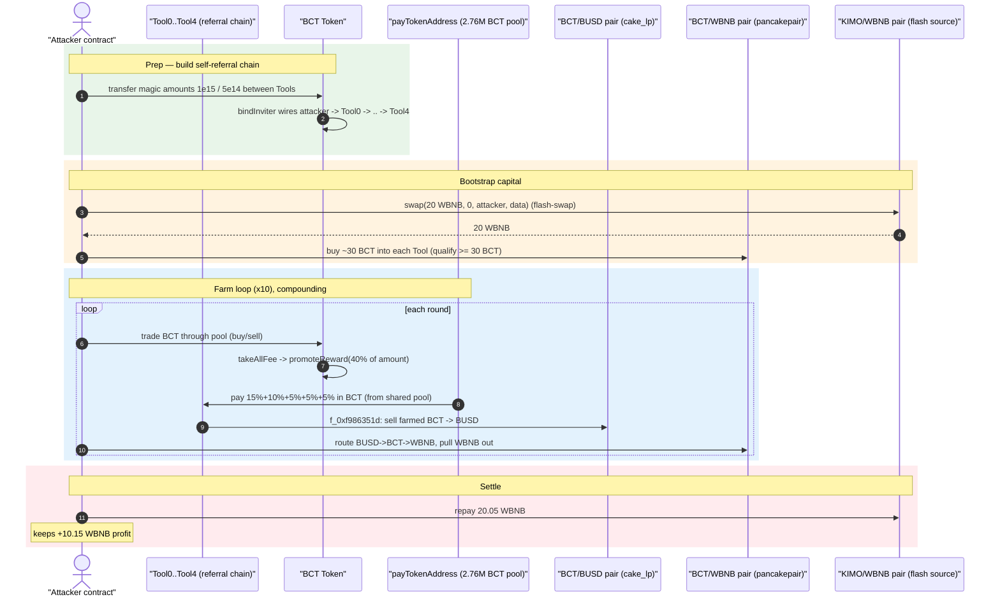
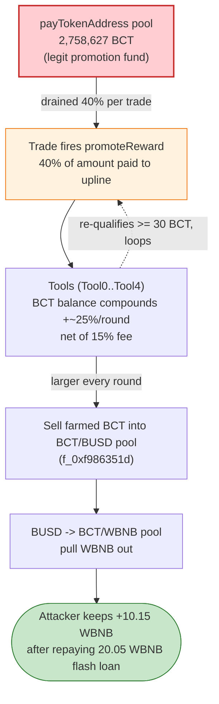
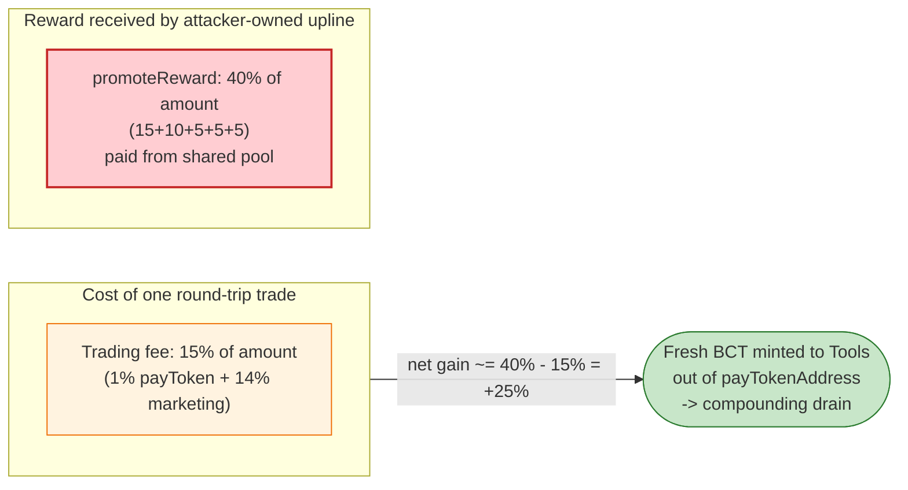

# BCT Token Exploit — Self-Funding Referral-Reward Drain of the Promotion Pool

> One-line: BCT's `promoteReward` pays 40% of every pool trade as referral bonuses out of a 2.76M-BCT promotion wallet — the attacker built a 5-deep self-referral chain and farmed that pool into liquidity it then swapped for **~10.15 BNB**.

> **Reproduction:** the PoC compiles & runs in an isolated Foundry project at
> [this project folder](.) (the umbrella DeFiHackLabs repo does not whole-compile, so this PoC was extracted).
> Full verbose trace: [output.txt](output.txt).
> Verified vulnerable source: [sources/Token_70ca72/Token.sol](sources/Token_70ca72/Token.sol).

---

## Key info

| | |
|---|---|
| **Loss** | **~10.15 BNB** profit to attacker (drained from the BCT promotion-reward pool, monetized via the BCT/WBNB pool) |
| **Vulnerable contract** | `BCT` Token — [`0x70ca72BB4A1386439a2a51476f2335A31005EBe8`](https://bscscan.com/address/0x70ca72BB4A1386439a2a51476f2335A31005EBe8#code) |
| **Drained reward wallet** | `payTokenAddress` — `0x8eBeb2bf3C6CA7d5C6b345515e368E94Eda0aB26` (held **2,758,627 BCT** at fork block) |
| **Pools used** | BCT/BUSD pair `0x5A25B8576B14699bbb15947111f5811E58B39A82` (cake_lp); BCT/WBNB pair `0x88b3EB62e363d9f153BeAb49c5C2EF2E785a375a` (pancakepair); KIMO/WBNB pair `0x1B96B92314C44b159149f7E0303511fB2Fc4774f` (flash-swap source) |
| **Attacker EOA** | [`0x9c66b0c68c144ffe33e7084fe8ce36ebc44ad21e`](https://bscscan.com/address/0x9c66b0c68c144ffe33e7084fe8ce36ebc44ad21e) |
| **Attacker contract** | [`0xe9616ff20ad519bce0e3d61353a37232f0c27a50`](https://bscscan.com/address/0xe9616ff20ad519bce0e3d61353a37232f0c27a50) |
| **Prep tx** | [`0xd4c19d575ea5b3a415cc288ce09942299ca3a3b49ef9718cda17e4033dd4c250`](https://bscscan.com/tx/0xd4c19d575ea5b3a415cc288ce09942299ca3a3b49ef9718cda17e4033dd4c250) (creates 5 tool contracts + builds referral chain) |
| **Attack tx** | [`0xdae0b85e01670e6b6b317657a72fb560fc388664cf8bfdd9e1b0ae88e0679103`](https://bscscan.com/tx/0xdae0b85e01670e6b6b317657a72fb560fc388664cf8bfdd9e1b0ae88e0679103) |
| **Chain / block / date** | BSC / 34,204,710 / **Sat, 9 Dec 2023** |
| **Compiler** | BCT token: Solidity v0.8.17, optimizer 200 runs |
| **Bug class** | Tokenomics design flaw — unprotected, over-generous referral reward paid from a shared pool, drainable by a self-referral cycle |

---

## TL;DR

`BCT` is a "DeFi tokenomics" ERC20 with a multi-level marketing (MLM) referral system. On **every** buy or
sell routed through its liquidity pair, the token pays referral bonuses to up to **5 levels of "inviters"**:
15% + 10% + 5% + 5% + 5% = **40% of the trade amount**, paid in BCT **out of a dedicated promotion wallet**
(`payTokenAddress`, [Token.sol:1485-1505](sources/Token_70ca72/Token.sol#L1485-L1505)).

The fatal property: **the payout (40%) is far larger than the trading fee the protocol collects (15%)**, and the
referral graph is fully attacker-controlled. So a single actor who is both the trader *and* the chain of inviters
profits ~25% in fresh BCT on every round-trip, with the surplus minted out of the shared promotion pool.

The attacker:

1. **Built a self-referral chain** (prep tx): deployed 5 `Tool` contracts and abused the on-transfer
   `bindInviter` logic ([:1473-1483](sources/Token_70ca72/Token.sol#L1473-L1483)) — which keys binding off the
   *exact* magic transfer amounts `1e15` and `5e14` — to wire `attacker → Tool0 → Tool1 → Tool2 → Tool3 → Tool4`.
2. **Flash-borrowed 20 WBNB** from the KIMO/WBNB pair to bootstrap capital.
3. **Repeatedly traded BCT through the pools.** Each trade triggered `promoteReward`, paying 40% of the trade
   in BCT from the 2.76M-BCT promotion wallet to the 5 Tools. Because each Tool re-qualifies (holds ≥ 30 BCT)
   and the payout exceeds the cost, the Tools' BCT balances **compounded** every round (visible in the trace:
   sold amounts grow 1.9e20 → 4.1e20 → 8.8e20 → …).
4. **Cashed out:** funneled the accumulated BCT through BCT/BUSD → BUSD → BCT/WBNB to pull WBNB out of the
   BCT/WBNB pool, repaid the 20.05 WBNB flash loan, and kept the rest.

**Net result: +10.154835184214484706 WBNB** (≈10.15 BNB) to the attacker, sourced from the protocol's
promotion-reward wallet.

---

## Background — what BCT does

`BCT` ([source](sources/Token_70ca72/Token.sol)) is a BSC ERC20 (`contract Token is Ownable, ERC20`,
[:1333](sources/Token_70ca72/Token.sol#L1333)) with three bolted-on tokenomics features:

- **Trading tax** — on any buy/sell through the BCT/BUSD pair (`uniswapV2Pair`), `takeAllFee`
  ([:1567-1600](sources/Token_70ca72/Token.sol#L1567-L1600)) keeps 1% to `payTokenAddress` + 14% to the
  contract (later swapped to BUSD for "marketing") = **15% total fee**. Plain wallet-to-wallet transfers
  pay a 50% fee to `payTokenAddress`.
- **MLM referral graph** — `inviter[]` / `beinvited[]` mappings, populated by `bindInviter` during transfers
  ([:1473-1483](sources/Token_70ca72/Token.sol#L1473-L1483)). Binding is triggered by sending precise magic
  amounts (`amount == 10**15` to register, then `amount == 5*10**14` to confirm).
- **Referral reward** — `promoteReward` ([:1485-1505](sources/Token_70ca72/Token.sol#L1485-L1505)): every taxed
  buy/sell pays the trader's upline 5 levels of bonuses **from `payTokenAddress`'s BCT balance**.

On-chain parameters at the fork block (read via `cast`):

| Parameter | Value |
|---|---|
| `payTokenAddress` | `0x8eBeb2bf3C6CA7d5C6b345515e368E94Eda0aB26` |
| **BCT held by `payTokenAddress`** | **2,758,627 BCT** ← the reward pool |
| `promoteRewardSwitch` | `true` (rewards active) |
| Reward per level | L1 15%, L2 10%, L3-L5 5% each → **40% of trade amount** |
| Reward qualification | inviter must hold `>= 30 * 1e18` BCT |
| Trading fee on buy/sell | 15% (1% + 14%) |
| BCT/BUSD pair (`cake_lp`) reserves | 4.098 BUSD / 1.601 BCT (token0=BUSD, token1=BCT) |
| BCT/WBNB pair (`pancakepair`) reserves | 799.25 BCT / 10.22 WBNB (token0=BCT, token1=WBNB) |

> The whole exploit hinges on `40% payout > 15% fee`, paid from a **shared pool the trader does not own**,
> over a referral graph the trader fully controls.

---

## The vulnerable code

### 1. `promoteReward` — pays 40% of the trade to the upline from the shared pool

```solidity
function promoteReward(address _address, uint _amount) internal {
    if (!promoteRewardSwitch) { return ; }
    uint amount;
    for (uint i = 0; i < 5; i++) {
        if (inviter[_address] != address(0) && balanceOf(inviter[_address]) >= 30 * 10**18) {
            _address = inviter[_address];
            if (i == 0)      { amount = _amount.mul(15).div(100); }  // 15%
            else if (i == 1) { amount = _amount.mul(10).div(100); }  // 10%
            else             { amount = _amount.mul(5).div(100);  }  //  5% (×3)
            if (balanceOf(payTokenAddress) >= amount) {
                transferToken(payTokenAddress, _address, amount);    // ⚠️ paid from the shared pool
            }
        }
    }
}
```

[Token.sol:1485-1505](sources/Token_70ca72/Token.sol#L1485-L1505)

`_amount` is the **full traded amount**, and the sum of the five tiers is 40%. Crucially the reward source is
`payTokenAddress` — a wallet pre-loaded with 2.76M BCT by the protocol — **not** the trader and **not** burned.

### 2. `takeAllFee` — fires `promoteReward` on every pool buy and sell

```solidity
function takeAllFee(address from, address to, uint256 amount) private returns(uint256 amountAfter) {
    amountAfter = amount;
    if (from == uniswapV2Pair) {            // BUY
        ... // 1% + 14% fee
        promoteReward(to, amount);          // ⚠️ reward = 40% of the FULL buy amount
    } else if (to == uniswapV2Pair) {       // SELL
        ... // 1% + 14% fee
        promoteReward(from, amount);        // ⚠️ reward = 40% of the FULL sell amount
    } else {
        ... // 50% fee, no reward
    }
    return amountAfter;
}
```

[Token.sol:1567-1600](sources/Token_70ca72/Token.sol#L1567-L1600) (reward calls at
[:1580](sources/Token_70ca72/Token.sol#L1580) and [:1591](sources/Token_70ca72/Token.sol#L1591))

### 3. `bindInviter` — referral edges set by magic transfer amounts (no auth)

```solidity
function bindInviter(address from, address to, uint256 amount) internal {
    if (inviter[to] == address(0) && to != from && inviter[from] != to && amount == 10**15) {
        beinvited[to] = from;
    }
    if (inviter[from] == address(0) && to != from && inviter[to] != from
        && beinvited[from] == to && amount == 5 * 10**14) {
        inviter[to] = from;                 // ⚠️ anyone can wire any graph with the right amounts
        myteam[from].push(Myteam(from, block.timestamp));
    }
}
```

[Token.sol:1473-1483](sources/Token_70ca72/Token.sol#L1473-L1483) — invoked from `_transfer`
([:1543](sources/Token_70ca72/Token.sol#L1543)). Binding requires only that the sender pushes the exact
amounts `1e15` then `5e14` between the two addresses — fully reproducible by an attacker for its own contracts.

---

## Root cause — why it was possible

The reward arithmetic is a guaranteed-profit machine for anyone who can be both sides of the referral graph:

1. **Payout exceeds cost.** A pool trade costs the trader 15% in fees but pays the upline **40%** in BCT.
   Net of fees, a single actor that owns the entire 5-level upline gains **~25% of the trade amount in fresh
   BCT every round**, drawn from `payTokenAddress`.
2. **Reward funded from a shared pool, not the trader.** `transferToken(payTokenAddress, _address, amount)`
   ([:1501](sources/Token_70ca72/Token.sol#L1501)) hands out BCT the protocol deposited for legitimate
   promotions. The attacker contributes none of it.
3. **Referral graph is permissionless and self-dealable.** `bindInviter` ([:1473](sources/Token_70ca72/Token.sol#L1473))
   lets the attacker register `attacker → Tool0 → … → Tool4` by sending fixed magic amounts to its own contracts.
   There is no "real human" or sybil resistance.
4. **Qualification is trivial.** A level only pays if the inviter holds `>= 30 BCT`
   ([:1491](sources/Token_70ca72/Token.sol#L1491)). The attacker simply seeds each Tool with ≥ 30 BCT
   (via the `Tool.buy()` calls in `pancakeCall`), and because each round *adds* 40% to the Tools, they stay
   qualified and the loop **compounds**.
5. **No global rate-limit / per-tx cap on rewards.** Nothing bounds how many times rewards can be claimed in a
   block, or caps cumulative reward vs. pool balance. The attacker iterates the trade-and-reward loop dozens of
   times in one transaction (the trace contains **2,840** payout transfers from `payTokenAddress`).

The result is a positive-feedback drain: every iteration removes ~25% of the trade amount from the promotion
pool into the attacker's Tools, which then increases the trade size of the next iteration.

---

## Preconditions

- `promoteRewardSwitch == true` (rewards active) and `payTokenAddress` holds a large BCT balance (2.76M here).
- The attacker can register an arbitrary referral chain via `bindInviter` magic amounts — true for anyone.
- Working capital to (a) seed each Tool with ≥ 30 BCT and (b) provide initial trade volume. Tiny: the live
  attack bootstrapped with a **20 WBNB flash-swap** from the KIMO/WBNB pair plus ~0.0009 BNB of dust buys.
- Liquidity in the BCT/BUSD and BCT/WBNB pools to convert the farmed BCT back into WBNB.

---

## Attack walkthrough (with on-chain numbers from the trace)

All figures are taken directly from [output.txt](output.txt). The PoC's `testExploit`
([test/BCT_exp.sol:63-71](test/BCT_exp.sol#L63-L71)) reproduces the two real txs as `init()` (prep) +
the flash-swap entry.

### Phase A — Preparation (`init()`, [test/BCT_exp.sol:75-109](test/BCT_exp.sol#L75-L109))

| # | Action | Effect |
|---|--------|--------|
| A1 | Deploy 5 `Tool` contracts | The 5 levels of the referral chain |
| A2 | Buy a dust of BCT, route magic transfers `1e15`/`5e14` between Tools | `bindInviter` wires `attacker → Tool0 → Tool1 → Tool2 → Tool3 → Tool4` |

Verified inviter chain from the trace ([output.txt:225-243](output.txt#L225)):
`inviter[attacker] = Tool0`, `inviter[Tool0] = Tool1`, … `inviter[Tool3] = Tool4`.

### Phase B — Exploit (`pancakeCall`, [test/BCT_exp.sol:111-161](test/BCT_exp.sol#L111-L161))

The attacker enters via a 20 WBNB flash-swap on the KIMO/WBNB pair
([test/BCT_exp.sol:67](test/BCT_exp.sol#L67)) and runs the farm inside `pancakeCall`:

| # | Step | On-chain numbers |
|---|------|------------------|
| B0 | **Flash-borrow 20 WBNB** from KIMO/WBNB pair `0x1B96…774f` | borrows 20.0 WBNB ([output.txt:220-222](output.txt#L220)) |
| B1 | **Seed each Tool with ≥ 30 BCT** via `Tool.buy()` (buys ~30 BCT each from `0x88b3` BCT/WBNB pool) | each Tool now qualifies (`balanceOf ≥ 30e18`) ([output.txt:250-356](output.txt#L250)) |
| B2 | **Trade loop ×10** (`pancakeCall` while-loop): swap WBNB→BCT and sell BCT into pools | each trade fires `promoteReward`, paying 40% of `amount` in BCT from `payTokenAddress` to the 5 Tools |
| B3 | **`process()` per round** ([test/BCT_exp.sol:163-185](test/BCT_exp.sol#L163-L185)): each Tool sells its BCT into the BCT/BUSD pair via `f_0xf986351d`, then swaps BUSD→BCT→WBNB to pull WBNB out of the BCT/WBNB pair | per-round WBNB pulled grows each round (see below) |
| B4 | **Repay flash loan**: transfer 20.05 WBNB back to KIMO pair ([test/BCT_exp.sol:160](test/BCT_exp.sol#L160), [output.txt:16976](output.txt#L16976)) | loan + 0.25% fee repaid |

The compounding is the signature of the bug. Each round the Tools sell progressively larger BCT amounts into
the BCT/BUSD pair (`f_0xf986351d`), because the previous round's 40% rewards inflated their balances:

| Round | Tool0 BCT sold into BCT/BUSD (`f_0xf986351d`) | WBNB pulled out of BCT/WBNB this round |
|------:|----------------------------------------------:|---------------------------------------:|
| 1 | 193.1 BCT | 19.40 WBNB |
| 2 | 413.5 BCT | 23.95 WBNB |
| 3 | 883.4 BCT | 26.91 WBNB |
| … | (grows ~2× each round) | … (approaches the ~30 WBNB the BCT/WBNB pool side can give) |
| 10 | — | 30.20 WBNB |
| final | — | 0.0000055 WBNB (dust true-up) |

Total WBNB pulled out of the BCT/WBNB pool across all rounds: **278.68 WBNB** (this is gross throughput, most of
which is recycled to keep buying BCT and to repay the loan; the *net* kept is the profit below).

### Profit / loss accounting (WBNB)

| Item | Amount |
|---|---:|
| Flash-loan principal borrowed | 20.000000000000000000 WBNB |
| Flash-loan repaid (principal + 0.25% fee) | 20.050000000000000001 WBNB |
| **Net WBNB profit kept by attacker** | **+10.154835184214484706 WBNB** |
| Source of value | 2.76M-BCT promotion pool (`payTokenAddress`), monetized via BCT/BUSD + BCT/WBNB pools |
| Reward payout transfers observed in trace | **2,840** transfers out of `payTokenAddress` |

Final attacker WBNB balance after repaying the loan: `10154835184214484706` wei
([output.txt:16991-16992](output.txt#L16991)) — matching the PoC's logged profit and the header's "~10.2 BNB".

---

## Diagrams

### Sequence of the attack



### Value flow / state evolution



### Why each trade is net-positive for the attacker



---

## Why the magic numbers

- **`bindInviter` amounts `1e15` / `5e14`:** these are the *exact* values `bindInviter`
  ([:1474, :1479](sources/Token_70ca72/Token.sol#L1474)) checks to register then confirm a referral edge. The
  prep `init()` ([test/BCT_exp.sol:90-106](test/BCT_exp.sol#L90-L106)) sends precisely these amounts to wire the
  chain. They have no other purpose than satisfying the binding gate.
- **≥ 30 BCT per Tool:** the qualification threshold in `promoteReward`
  ([:1491](sources/Token_70ca72/Token.sol#L1491)). The `Tool.buy()` calls in `pancakeCall`
  ([test/BCT_exp.sol:213-217](test/BCT_exp.sol#L213-L217)) buy ~30+ BCT into each Tool so all five levels pay out.
- **40% reward vs 15% fee:** the whole exploit is `(15+10+5+5+5)% − 15% = +25%` per trade — guaranteed profit as
  long as the attacker owns the entire upline and the pool has balance.
- **20 WBNB flash-swap, repay 20.05:** PancakeSwap V2 flash-swap with the 0.25% fee. The attacker needs zero
  starting capital beyond dust; the loan is fully repaid intra-transaction.

---

## Remediation

1. **Reward ≤ fee, always.** If a referral program pays out of a pool, the per-trade payout must be strictly
   *less* than the fee the trade contributes, otherwise round-tripping is profitable. Here 40% payout vs 15% fee
   is an immediate arbitrage. Cap total reward at, e.g., a fraction of the *collected fee for that trade*.
2. **Don't pay rewards from a shared, prefunded pool on every trade.** Pay referral bonuses only out of the
   value the *referred trade itself* generated, not a communal wallet anyone can farm.
3. **Sybil-resist the referral graph.** `bindInviter` should not be settable by sending magic amounts to your own
   contracts. Require off-chain verification, a real economic stake that is forfeited on abuse, or KYC-gated
   binding. At minimum, forbid contracts and self-referential cycles.
4. **Per-block / per-address reward rate limits.** Bound the number and cumulative size of reward claims per
   address per block, and require a cooldown so a single transaction cannot iterate the loop thousands of times.
5. **Exclude liquidity pairs and contracts from earning referral rewards**, and require the inviter to be an EOA
   that demonstrably preceded the invitee in time.
6. **Tie qualification to net deposits, not instantaneous balance.** Keying off `balanceOf >= 30` lets the very
   rewards being paid keep the recipient "qualified," which is what makes the loop compound.

---

## How to reproduce

The PoC was extracted into a standalone Foundry project (the umbrella DeFiHackLabs repo has several unrelated
PoCs that fail to compile under a whole-project `forge build`):

```bash
_shared/run_poc.sh 2023-12-BCT_exp -vvvvv
```

- RPC: a **BSC archive** endpoint is required (fork block 34,204,709). `foundry.toml` uses
  `https://bsc-mainnet.public.blastapi.io`, which serves historical state at that block; most public BSC RPCs
  prune it.
- The full run forks at block `34_204_710 - 1` and is slow (~1–9 min depending on RPC latency); the test itself
  executes in ~1.2s once state is cached.
- Result: `[PASS] testExploit()` with the logged profit.

Expected tail:

```
Ran 1 test for test/BCT_exp.sol:BCT
[PASS] testExploit() (gas: 34108627)
Logs:
  [End] After repay, Profit: BNB balance of attacker: 10.154835184214484706

Suite result: ok. 1 passed; 0 failed; 0 skipped
```

---

*Reference: DeFiHackLabs PoC `src/test/2023-12/BCT_exp.sol`. SlowMist / hack registries record BCT (BSC) ~10.2 BNB, Dec 9, 2023.*
