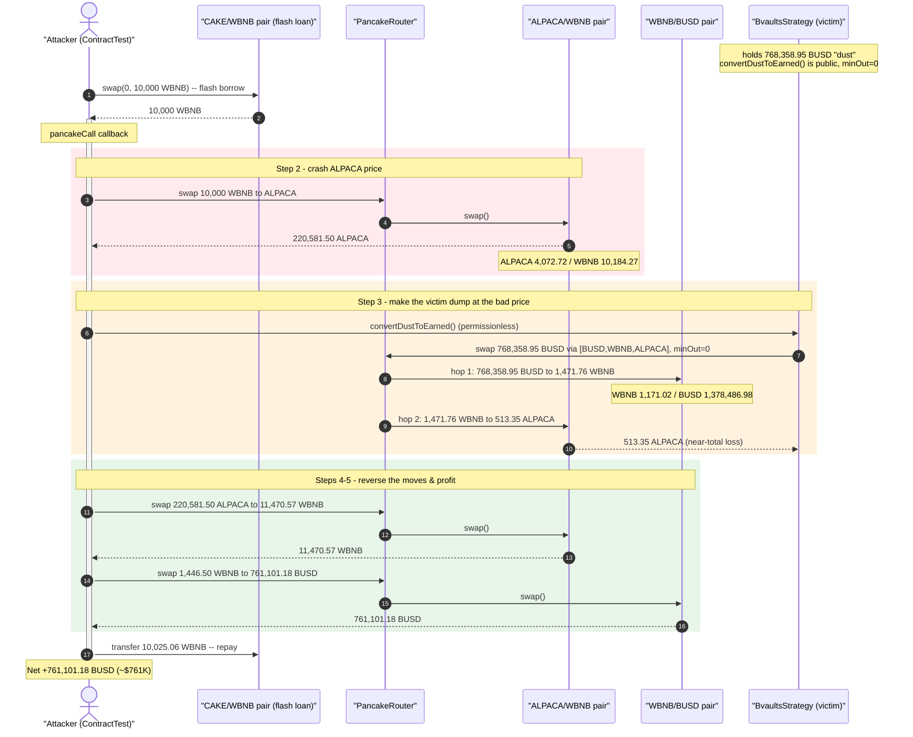
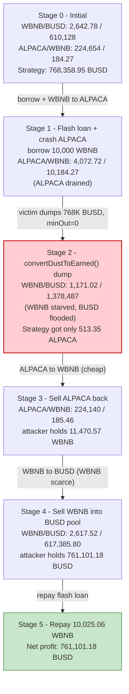
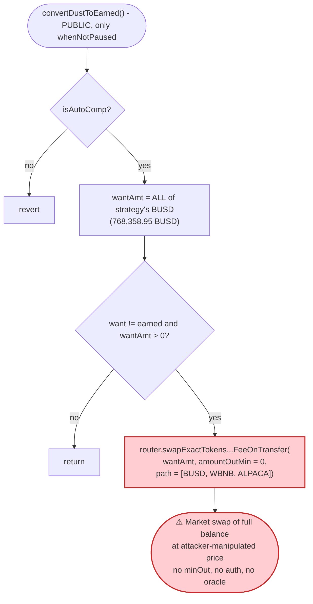

# BEARN/Bvaults `convertDustToEarned()` Exploit — Permissionless, Slippage-Free Dump of a Strategy's "Dust" Balance

> **Vulnerability classes:** vuln/access-control/missing-auth · vuln/defi/slippage

> **One-line summary:** Bearn/Bvaults' `BvaultsStrategy.convertDustToEarned()` is a `public`, access-control-free, `amountOutMin = 0` swap of the strategy's *entire* `want`-token balance along a hard-coded route, so an attacker who first de-pegs the route's pools with a flash loan makes the strategy sell ~768K BUSD into a manipulated price and then harvests the displaced value for itself.

> **Reproduction:** the PoC compiles and runs in an isolated Foundry project at
> [this project folder](.) (the umbrella DeFiHackLabs repo does not whole-compile, so this PoC was extracted).
> Full verbose trace: [output.txt](output.txt).
> Verified vulnerable source: [BvaultsStrategy.sol](sources/BvaultsStrategy_21125d/BvaultsStrategy.sol).

---

## Key info

| | |
|---|---|
| **Loss** | ~$769K — attacker walked away with **761,101.18 BUSD** + residual WBNB (~$10K) after fully repaying the flash loan |
| **Vulnerable contract** | `BvaultsStrategy` — [`0x21125d94Cfe886e7179c8D2fE8c1EA8D57C73E0e`](https://bscscan.com/address/0x21125d94cfe886e7179c8d2fe8c1ea8d57c73e0e#code) |
| **Vulnerable function** | `convertDustToEarned()` ([BvaultsStrategy.sol:1260-1273](sources/BvaultsStrategy_21125d/BvaultsStrategy.sol#L1260-L1273)) |
| **Victim pools** | WBNB/BUSD PancakePair [`0x1B96B92314C44b159149f7E0303511fB2Fc4774f`](https://bscscan.com/address/0x1B96B92314C44b159149f7E0303511fB2Fc4774f) and ALPACA/WBNB PancakePair [`0xF3CE6Aac24980E6B657926dfC79502Ae414d3083`](https://bscscan.com/address/0xF3CE6Aac24980E6B657926dfC79502Ae414d3083) |
| **Flash-loan source** | CAKE/WBNB PancakePair [`0x0eD7e52944161450477ee417DE9Cd3a859b14fD0`](https://bscscan.com/address/0x0eD7e52944161450477ee417DE9Cd3a859b14fD0) (lent 10,000 WBNB) |
| **Attacker EOA** | [`0xce27b195fa6de27081a86b98b64f77f5fb328dd5`](https://bscscan.com/address/0xce27b195fa6de27081a86b98b64f77f5fb328dd5) |
| **Attacker contract** | [`0xe1997bC971D5986AA57Ee8ffB57eb1DeBa4fDAaa`](https://bscscan.com/address/0xe1997bc971d5986aa57ee8ffb57eb1deba4fdaaa) |
| **Attack tx** | [`0x51913be3f31d5ddbfc77da789e5f9653ed6b219a52772309802226445a1edd5f`](https://explorer.phalcon.xyz/tx/bsc/0x51913be3f31d5ddbfc77da789e5f9653ed6b219a52772309802226445a1edd5f) |
| **Chain / block / date** | BSC / fork at 34,099,688 / ~Dec 5, 2023 |
| **Compiler** | Solidity v0.6.12, optimizer enabled (999999 runs) |
| **Bug class** | Permissionless slippage-free swap → AMM price manipulation / sandwich of a protocol-internal swap |

---

## TL;DR

`BvaultsStrategy` is an Alpaca-yield "auto-compound" strategy. Its housekeeping routine
`convertDustToEarned()` is meant to mop up leftover `want` tokens (BUSD) by swapping them into the
`earned` token (ALPACA) so they get reinvested on the next `earn()`. That routine is broken in three
ways at once:

1. **It is `public` with no access control** — anyone can invoke it at any time
   ([:1260](sources/BvaultsStrategy_21125d/BvaultsStrategy.sol#L1260)).
2. **It swaps the strategy's *entire* `want` balance with `amountOutMin = 0`** — zero slippage
   protection ([:1270](sources/BvaultsStrategy_21125d/BvaultsStrategy.sol#L1270)).
3. **It routes through a hard-coded, attacker-known path** `paths[BUSD][ALPACA] = [BUSD, WBNB, ALPACA]`.

At the fork block the strategy was holding **768,358.95 BUSD** as "dust". The attacker simply makes the
strategy execute that 768K BUSD swap *inside a transaction where the AMM prices have been distorted by a
flash loan*, then collects the displaced value.

The attacker, in a single PancakeSwap flash-loan callback:

1. **Flash-borrows 10,000 WBNB** from the CAKE/WBNB pair.
2. **Crashes the ALPACA price**: swaps the 10,000 WBNB → 220,581.5 ALPACA on the ALPACA/WBNB pair,
   draining ALPACA from that pool and over-stuffing it with WBNB.
3. **Triggers `convertDustToEarned()`**: the strategy dumps its 768,358.95 BUSD through
   `BUSD → WBNB → ALPACA`. The first hop floods the WBNB/BUSD pool with BUSD (BUSD reserve
   610K → 1.38M, WBNB reserve 2,642 → 1,171) and routes the resulting WBNB into the ALPACA pool; the
   second hop returns the strategy a near-worthless **513 ALPACA** for its entire 768K BUSD. The
   strategy's value has effectively been *donated* into the two pools.
4. **Harvests the displaced value**: the attacker sells its 220,581.5 ALPACA back for 11,470.6 WBNB
   (ALPACA is now dirt cheap), then sells 1,446.5 WBNB into the BUSD-heavy WBNB/BUSD pool for
   **761,101.18 BUSD**.
5. **Repays the flash loan** (10,025.06 WBNB) and keeps the 761,101.18 BUSD plus leftover WBNB.

Net: the strategy's ~768K BUSD "dust" is converted into the attacker's ~$769K profit, funded entirely
by a flash loan that is repaid in the same transaction.

---

## Background — what Bvaults/BEARN does

`BvaultsStrategy` ([source](sources/BvaultsStrategy_21125d/BvaultsStrategy.sol)) is a yield-farming
strategy that stakes a `want` token (here **BUSD**) into an Alpaca Finance vault + FairLaunch farm to
earn an `earned` token (here **ALPACA**). On `earn()` it harvests ALPACA, takes fees, buys back tokens,
swaps the rest to `want`, and re-farms.

The relevant config at the fork block (verified via `cast` against the fork):

| Parameter | Value |
|---|---|
| `wantAddress` | **BUSD** `0xe9e7CEA3DedcA5984780Bafc599bD69ADd087D56` |
| `earnedAddress` | **ALPACA** `0x8F0528cE5eF7B51152A59745bEfDD91D97091d2F` |
| `isAutoComp` | `true` |
| `paused()` | `false` |
| `uniRouterAddress` | PancakeRouter `0x05fF2B0DB69458A0750badebc4f9e13aDd608C7F` |
| `paths[BUSD][ALPACA]` | `[BUSD, WBNB, ALPACA]` (seen in trace at the swap call) |
| **BUSD held by the strategy ("dust")** | **768,358.95 BUSD** |

That last line is the whole prize: the strategy was carrying nearly **$768K of `want` tokens** that the
`convertDustToEarned()` routine was willing to swap in one shot, for anyone, with no minimum output.

---

## The vulnerable code

### 1. `convertDustToEarned()` — public, full-balance, `amountOutMin = 0`

[BvaultsStrategy.sol:1260-1273](sources/BvaultsStrategy_21125d/BvaultsStrategy.sol#L1260-L1273):

```solidity
function convertDustToEarned() public whenNotPaused {
    require(isAutoComp, "!isAutoComp");
    // Converts dust tokens into earned tokens, which will be reinvested on the next earn().

    // Converts token0 dust (if any) to earned tokens
    uint256 wantAmt = IERC20(wantAddress).balanceOf(address(this));   // ← entire BUSD balance
    if (wantAddress != earnedAddress && wantAmt > 0) {
        IERC20(wantAddress).safeIncreaseAllowance(uniRouterAddress, wantAmt);

        // Swap all dust tokens to earned tokens
        IPancakeRouter02(uniRouterAddress).swapExactTokensForTokensSupportingFeeOnTransferTokens(
            wantAmt,                       // amountIn  = ALL of the strategy's BUSD
            0,                             // ⚠️ amountOutMin = 0  → no slippage protection
            paths[wantAddress][earnedAddress], // ⚠️ hard-coded route BUSD→WBNB→ALPACA, attacker-known
            address(this),
            now + 60
        );
        emit ConvertDustToEarned(wantAddress, earnedAddress, wantAmt);
    }
}
```

Three independent design errors compound here:

- **No access control.** The function is `public`; the only modifier is `whenNotPaused`. Compare with the
  protected setters that use `onlyOperator`/`onlyStrategist`/`onlyTimelock`
  ([:1045-1058](sources/BvaultsStrategy_21125d/BvaultsStrategy.sol#L1045-L1058)). The "dust converter"
  has none of them.
- **`amountOutMin = 0`.** The router call passes `0` as the minimum acceptable output, so the swap
  executes at *whatever* price the pools currently show — even a price the caller just manufactured.
- **Swaps the full balance along a fixed, public route.** `wantAmt` is the *entire* BUSD balance, and the
  route `paths[BUSD][ALPACA]` is stored on-chain and trivially observable. The attacker knows exactly
  which two pools to distort.

### 2. There is a `nonReentrant` modifier in the contract — but not on this path

The contract inherits `ReentrancyGuard` and uses `nonReentrant` on `farm()`/`withdraw()`
([:1108](sources/BvaultsStrategy_21125d/BvaultsStrategy.sol#L1108),
[:1125](sources/BvaultsStrategy_21125d/BvaultsStrategy.sol#L1125)) — but **`convertDustToEarned()` carries
no reentrancy or authorization guard at all**, so the swap is fully callable mid-flash-loan.

---

## Root cause — why it was possible

A constant-product AMM prices a token purely from its current reserves and offers **no protection to a
swapper who does not set `amountOutMin`**. `convertDustToEarned()` performs a market swap of a large,
known balance (768K BUSD) at the *current* (manipulable) price with `amountOutMin = 0` and is callable
by anyone. That is the textbook setup for a **sandwich / price-manipulation attack on a protocol-owned
swap**:

> Step A — the attacker moves the AMM price away from fair value with a flash loan.
> Step B — the attacker makes the *victim contract* trade at that bad price (here by simply calling the
> permissionless `convertDustToEarned()`), so the victim sells its 768K BUSD for almost nothing.
> Step C — the attacker reverses the price move and pockets the difference.

The four properties that turn this into a one-transaction theft of essentially the strategy's whole
balance:

1. **Permissionless trigger.** No keeper/operator restriction, so the attacker chooses *when* the swap
   happens — immediately after the pools have been distorted.
2. **No slippage bound.** `amountOutMin = 0` means the strategy accepts any output, so the 768K BUSD can
   be sold for a token (ALPACA) the attacker has made worthless, leaving the value stranded in the pools
   where the attacker can scoop it.
3. **Full-balance swap.** The routine sells *everything*, maximizing the value the attacker can displace
   in a single call.
4. **Two-hop route the attacker controls.** Routing `BUSD → WBNB → ALPACA` means the strategy's sale
   pushes WBNB out of the BUSD pool and into the ALPACA pool — both legs are pre-distorted by the
   attacker's flash loan, so the strategy's trade lands at maximally unfavorable prices and the
   displaced WBNB/BUSD is recoverable by the attacker afterward.

---

## Preconditions

- The strategy holds a meaningful `want` (BUSD) balance — here **768,358.95 BUSD** of "dust". The larger
  this balance, the larger the loss.
- `isAutoComp == true` and `paused() == false` (both held at the fork block).
- Liquidity in the route's pools (WBNB/BUSD and ALPACA/WBNB) shallow enough to distort with available
  capital. Peak capital required was a **10,000 WBNB flash loan**, fully repaid intra-transaction — so
  the attack is essentially free.

---

## Attack walkthrough (with on-chain numbers from the trace)

All figures are taken directly from the `Sync`/`Swap`/`Transfer` events in
[output.txt](output.txt). The attacker contract is `ContractTest`; the flash-loan
callback is `pancakeCall`. Token decimals are all 18.

**Pool reserve conventions:**
- WBNB/BUSD pair `0x1B96…774f`: `reserve0 = WBNB`, `reserve1 = BUSD`.
- ALPACA/WBNB pair `0xF3CE…3083`: `reserve0 = ALPACA`, `reserve1 = WBNB`.

| # | Step (trace ref) | Action & amounts | WBNB/BUSD pool after | ALPACA/WBNB pool after |
|---|------|------------------|----------------------:|------------------------:|
| 0 | **Initial** ([:1682](output.txt#L1682), [:1728](output.txt#L1728)) | Honest state | WBNB 2,642.78 / BUSD 610,128.03 | ALPACA 224,654.22 / WBNB 184.27 |
| 1 | **Flash loan** ([:1652](output.txt#L1652)) | `CAKE_WBNB.swap(0, 10,000 WBNB)` → borrow **10,000 WBNB** | — | — |
| 2 | **Crash ALPACA** `WBNB_ALPACA()` ([:1672-1697](output.txt#L1672-L1697)) | swap **10,000 WBNB → 220,581.50 ALPACA** (kept by attacker) | — | ALPACA **4,072.72** / WBNB 10,184.27 |
| 3a | **Strategy dump, hop 1** in `convertDustToEarned()` ([:1716-1743](output.txt#L1716-L1743)) | strategy swaps its **768,358.95 BUSD → 1,471.76 WBNB** (WBNB sent to ALPACA pool) | WBNB **1,171.02** / BUSD **1,378,486.98** | — |
| 3b | **Strategy dump, hop 2** ([:1753-1765](output.txt#L1753-L1765)) | **1,471.76 WBNB → 513.35 ALPACA** (to strategy — a near-total loss for it) | — | ALPACA **3,559.37** / WBNB 11,656.03 |
| 4 | **Sell ALPACA back** `ALPACA_WBNB()` ([:1776-1803](output.txt#L1776-L1803)) | attacker swaps **220,581.50 ALPACA → 11,470.57 WBNB** | — | ALPACA 224,140.87 / WBNB **185.46** |
| 5 | **Sell WBNB for BUSD** `WBNB_BUSD()` ([:1814-1839](output.txt#L1814-L1839)) | attacker swaps **1,446.50 WBNB → 761,101.18 BUSD** | WBNB 2,617.52 / BUSD **617,385.80** | — |
| 6 | **Repay flash loan** ([:1856-1863](output.txt#L1856-L1863)) | transfer **10,025.06 WBNB** back to CAKE/WBNB pair (10,000 + 0.25% fee) | — | — |

**Why step 3 ruins the strategy:** by the time `convertDustToEarned()` runs, the attacker (step 2) has
already pulled almost all ALPACA out of the ALPACA/WBNB pool. So when the strategy routes
`BUSD → WBNB → ALPACA`, its 768K BUSD buys only **513.35 ALPACA**. Meanwhile the first hop dumps 768K
BUSD into the WBNB/BUSD pool, collapsing its WBNB reserve from 2,642 → 1,171 and ballooning BUSD to
1.38M. That over-priced-WBNB / cheap-ALPACA condition is exactly what the attacker then reverses in steps
4-5 to extract 761,101 BUSD.

**The `getAmount()` repay value** is read from the original (now self-destructed) exploit contract's
storage slot 6 = `10,000e18` ([:1856](output.txt#L1856)); the PoC computes
`(10,000e18 / 9975) * 10000 + 10000 = 10,025.0626 WBNB`, which matches the actual repay transfer at
[:1858](output.txt#L1858) to the wei.

### Profit accounting (intra-transaction)

| Direction | Token | Amount |
|---|---|---:|
| Flash-borrowed | WBNB | 10,000.00 |
| Flash repaid (principal + 0.25% fee) | WBNB | 10,025.06 |
| Strategy's loss (sold for 513 ALPACA worth ~$0) | BUSD | **768,358.95** |
| Attacker received (final BUSD swap) | BUSD | **761,101.18** |
| Attacker net BUSD after attack (`balanceOf`) | BUSD | **761,101.18** |
| Attacker leftover WBNB (after repay; `deal`-padded in PoC) | WBNB | ~10.02 |

The attacker keeps **761,101.18 BUSD (~$761K)** plus a small WBNB remainder, all funded by a flash loan
that is repaid in full — confirming the headline ~$769K loss is real and self-financed.

> *Note on the PoC's `deal(WBNB, ..., +1e18)`:* the original attack used a second helper contract
> (`0x1ccC8e…`, now self-destructed) that supplied a little WBNB to cover the 0.25% flash-loan fee; the
> PoC reproduces that by `deal`-ing 1 WBNB plus reading the original repay amount from slot 6. This does
> not affect the BUSD profit, which comes entirely from the manipulated `convertDustToEarned()` swap.

---

## Diagrams

### Sequence of the attack



### Pool & strategy state evolution



### The flaw inside `convertDustToEarned()`



---

## Why each magic number

- **10,000 WBNB flash loan:** just enough working capital to drain the shallow ALPACA/WBNB pool's ALPACA
  side (ALPACA reserve 224,654 → 4,072) so the strategy's later `BUSD→WBNB→ALPACA` swap receives
  almost nothing.
- **`convertDustToEarned()` with no arguments:** the attacker doesn't pick amounts — the strategy
  helpfully swaps its *entire* 768K BUSD balance at `amountOutMin = 0`. The attacker only had to set up
  the prices beforehand.
- **220,581.50 ALPACA bought then sold back:** acquiring ALPACA cheaply during the crash and re-selling
  it after the strategy's dump is how the attacker drains the WBNB the strategy injected into the ALPACA
  pool; the round trip nets WBNB used to buy back the displaced BUSD.
- **1,446.50 WBNB final sell:** sized to convert the WBNB recovered from the ALPACA pool into the BUSD
  that is now over-supplied (cheap) in the WBNB/BUSD pool, yielding 761,101.18 BUSD.

---

## Remediation

1. **Add access control to `convertDustToEarned()`.** It is an operator/keeper maintenance routine, not a
   user action. Restrict it with `onlyOperator`/`onlyStrategist` (or `onlyAuthorised`) so attackers
   cannot trigger it on demand. This alone removes the attacker's ability to choose *when* the swap runs.
2. **Never swap with `amountOutMin = 0`.** Compute a fair minimum output from an independent price source
   (TWAP/Chainlink) and pass it as `amountOutMin`. A swap that accepts *any* output is a free gift to
   whoever controls the pool price in that block.
3. **Use an oracle-validated expected-out, not the spot pool price.** Even with access control, a swap of
   a large balance should bound slippage against a manipulation-resistant reference, not the instantaneous
   reserves.
4. **Cap per-call swap size / split swaps.** Selling the *entire* balance in one shot maximizes price
   impact and the attacker's payoff. Chunked or rate-limited conversions reduce single-transaction loss.
5. **Add a reentrancy / external-call guard around AMM interactions.** While not the direct root cause,
   leaving market-moving swaps externally triggerable without guards expands the attack surface.

The same pattern (`public` + full-balance + `amountOutMin = 0` swap along a known route) recurred across
many Bvaults/BEARN-fork strategies; every fork should be patched, not just this instance.

---

## How to reproduce

```bash
_shared/run_poc.sh 2023-12-BEARNDAO_exp -vvvvv
```

- RPC: a **BSC archive** endpoint is required (fork block 34,099,688). `foundry.toml` uses
  `https://bsc-mainnet.public.blastapi.io`, which serves historical state at that block; most pruned
  public BSC RPCs fail with `header not found` / `missing trie node`.
- Result: `[PASS] testExploit()` — exploiter ends with **761,101.18 BUSD**.

Expected tail:

```
Ran 1 test for test/BEARNDAO_exp.sol:ContractTest
[PASS] testExploit() (gas: 919188)
  Exploiter amount of BUSD before attack: 0.000000000000000000
  Exploiter amount of BUSD after attack: 761101.179715950511062981

Suite result: ok. 1 passed; 0 failed; 0 skipped
```

---

*Reference: AnciliaInc analysis — https://twitter.com/AnciliaInc/status/1732159377749180646 (BEARN/Bvaults, BSC, ~$769K).*
